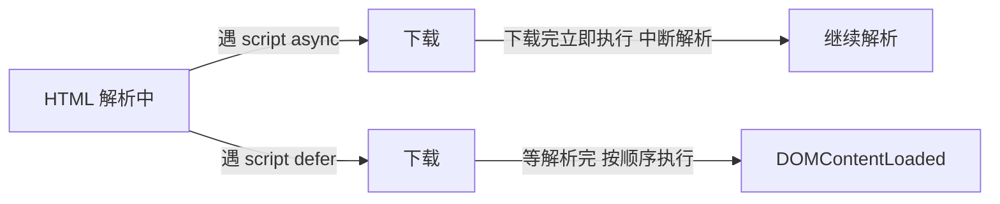

# HTML 常见面试题与最佳实践

> 配套文档《核心知识点详解.md》见同目录。本文件覆盖 HTML 高频面试题（含参考答案与易错点）+ 工程最佳实践 Checklist，按"基础 / 语义与结构 / 表单与可访问性 / 性能与安全"四个维度组织。
>
> 答案要点可直接背诵，易错点用于追问场景。文末附手写题与场景题。

---

## 一、基础概念（12 题）

### 1.1 DOCTYPE 的作用？不写会怎样？

声明文档类型为 HTML5，让浏览器进入**标准模式**（standards mode）。
不写会触发**怪异模式**（quirks mode）：

- 盒模型变为 IE 老式（width 含 padding+border）。
- 行内图片下方出现间隙。
- 部分现代 CSS 选择器与单位失效。

一句话：一行 `<!DOCTYPE html>` 决定整页渲染规则。

### 1.2 meta viewport 怎么写？为什么移动端必须写？

```html
<meta name="viewport" content="width=device-width, initial-scale=1.0">
```

不写时手机浏览器默认按 980px 宽渲染，再缩放塞进小屏，导致字小、需手动放大。写后页面宽度等于设备宽度，配合响应式 CSS 才能正常工作。

### 1.3 `<html lang="zh-CN">` 的 lang 属性有什么用？

- 屏幕阅读器决定发音引擎（中文用中文 TTS）。
- 浏览器决定是否弹"翻译此页"。
- 搜索引擎理解页面语言。

不写或写错，盲人用户听不到正确发音、海外用户收不到翻译提示。

### 1.4 `<meta charset="UTF-8">` 为什么要放 head 第一个？

浏览器解析字节流时有一个**预扫描**机制：在前 1024 字节内找 charset 声明。如果 charset 前有大量中文，浏览器可能猜错编码导致乱码，且一旦开始渲染无法回退。所以放最前。

### 1.5 行内元素 vs 块级元素区别？各举 5 个。

| 维度 | 块级 | 行内 |
|---|---|---|
| 独占一行 | 是 | 否 |
| 设宽高 | 可 | 不可（img/input 等替换元素例外） |
| 默认宽度 | 父容器宽 | 内容宽 |
| 典型 | div p h1-6 ul li section | span a strong em code |

行内块（inline-block）：不换行但可设宽高，如 button、img。

### 1.6 HTML5 相对 HTML4 删除/新增了什么？

新增：语义化标签（header/nav/main/article）、表单类型（email/date/color/range）、video/audio、canvas/svg、Web Storage、Geolocation、WebSocket、Web Worker。
废弃：font/center/big/align 属性等"样式标签"（样式归 CSS）、frame/frameset。

### 1.7 data-* 属性的作用与限制？

```html
<div data-user-id="42" data-role="admin"></div>
```

- 在元素上存自定义数据，JS 用 `dataset.userId` 读取（自动转 camelCase）。
- 限制：只能存字符串，**不应存敏感信息**（DOM 可见可改）、不应存大量数据（影响 HTML 体积）。

### 1.8 标签的 title 属性 vs img 的 alt 属性？

- `title`：悬停提示气泡，可选，几乎所有元素都有。
- `alt`：图片替代文本，**必填**——加载失败时占位、读屏器朗读、SEO 抓取。

### 1.9 相对路径 `./`、`../`、`/` 区别？

- `./xxx`：当前目录（可省略，默认）。
- `../xxx`：上级目录。
- `/xxx`：站点根路径（从域名根算，不依赖当前文件位置）。

### 1.10 a 标签的 href 可以写哪些协议？

```html
<a href="https://...">网页</a>
<a href="#section">锚点</a>
<a href="mailto:a@b.com">邮件</a>
<a href="tel:+86138...">电话</a>
<a href="javascript:void(0)">空操作（不推荐，见下题）</a>
```

### 1.11 为什么不推荐 `href="javascript:void(0)`？

- 不利于 SEO、屏幕阅读器无法识别为链接。
- CSP 严格模式下可能被拦截。
- 替代：`<button type="button">` 或 `<a href="#!" >` + `e.preventDefault()`。

### 1.12 iframe 的安全风险与防护？

风险：第三方页面可运行任意脚本、操纵父窗口（默认）、注入钓鱼内容。
防护：

```html
<iframe src="..." sandbox="allow-scripts allow-same-origin"
        referrerpolicy="no-referrer"
        loading="lazy"></iframe>
```

`sandbox` 默认禁用一切，按需开放白名单能力。

---

## 二、语义与结构（10 题）

### 2.1 语义化标签有哪些好处？

1. **可访问性**：读屏器靠标签理解结构，`<nav>` 直接跳到导航。
2. **SEO**：搜索引擎靠 `<h1>`/`<article>` 判断内容权重。
3. **可维护性**：结构即注释，`<header>` 比 `<div class="header">` 自解释。
4. **默认能力**：`<button>` 自带键盘可达与表单提交。

### 2.2 article vs section 怎么选？

口诀：**能整体复制到 RSS 独立成立的是 article，只是章节切分的是 section**。

- 博客文章、评论、卡片 → article。
- 文章里的"引言/正文/总结" → section。

### 2.3 一个页面可以有几个 h1？

规范允许多个，但建议**只有一个**（对应页面主标题）。多个 h1 会让搜索引擎与读屏器难以判断主从关系。HTML5 曾允许每个 section 内嵌套 h1 重新计数，但实测 SEO 效果差，已弃用。

### 2.4 main / header / nav 各自定位？

- `<main>`：页面主内容，**每页只有一个**，不应在 header/nav/footer 内。
- `<header>`：页眉或区块头部，可多个（页面级、article 内）。
- `<nav>`：主导航，**仅主导航用**，页脚的次要链接不必套 nav。

### 2.5 为什么不能用 table 做布局？

- 移动端响应式困难（列宽固定）。
- 读屏器读出"表格"语义，混淆数据与布局。
- SEO 误判页面是数据表。
- 维护成本高。

布局用 Flex/Grid，table 只放真正的数据。

### 2.6 figure / figcaption / picture 区别？

- `<figure>`：图文组合（图 + 标题 + 描述），可独立移动不影响主文。
- `<figcaption>`：figure 内的说明文字。
- `<picture>`：响应式图片容器，按屏幕选不同图源。

### 2.7 dl/dt/dd 用在哪？

定义列表，键值对结构：

```html
<dl>
  <dt>HTML</dt><dd>超文本标记语言</dd>
  <dt>CSS</dt><dd>层叠样式表</dd>
</dl>
```

常用于 FAQ、术语表、商品参数。

### 2.8 何时用 strong / em 而非 b / i？

- `strong` / `em` 是**语义**强调（重要性 / 语气强调），读屏器会重读，SEO 加权。
- `b` / `i` 只是**视觉**加粗 / 斜体，无语义，应被 CSS 取代。

### 2.9 blockquote 与 q 的区别？

- `<blockquote>`：块级引用，独立成段，浏览器默认加左缩进。
- `<q>`：行内引用，自动加引号（中文引号""）。

都需要配 `<cite>` 标注来源。

### 2.10 列出至少 8 个语义化标签。

header / nav / main / article / section / aside / footer / figure / figcaption / time / address / mark / details / summary。

---

## 三、表单与可访问性（10 题）

### 3.1 label 的两种写法？哪种更好？

```html
<!-- 写法 1：for 关联（推荐） -->
<label for="email">邮箱</label>
<input id="email" type="email">

<!-- 写法 2：包裹 -->
<label>邮箱 <input type="email"></label>
```

`for` 关联更灵活（label 与 input 可分开排版），且不会被嵌套样式影响。**点击 label 文字也能聚焦 input**。

### 3.2 input 的 name 和 id 区别？

- `name`：提交到后端的字段名，单选按钮同 name 才互斥。
- `id`：HTML 唯一标识，关联 label、CSS/JS 选择器、锚点。

两者用途不同，不要混。一个元素可同时有 name 和 id。

### 3.3 button 的 type 有几种？默认是哪个？

- `submit`（**默认**）：在 form 内点击会提交表单。
- `button`：纯按钮，不触发提交。
- `reset`：重置表单。

**坑**：在 form 内写 `<button>提交</button>`（忘了 type），点击会触发提交。非提交按钮务必显式 `type="button"`。

### 3.4 列举至少 6 种 input type。

text / password / email / number / tel / url / date / time / month / color / range / file / checkbox / radio / search。

### 3.5 表单原生校验有哪些属性？

- `required`：必填。
- `pattern="正则"`：格式校验。
- `minlength` / `maxlength`：字符长度。
- `min` / `max` / `step`：数值范围。
- `type="email|url"`：内置格式校验。

浏览器会显示默认提示，可用 `:invalid` / `:valid` 伪类做样式。

### 3.6 select 与 datalist 区别？

- `<select>`：下拉固定选项，必选其一。
- `<datalist>`：输入框 + 自动补全建议，用户可自由输入。

```html
<input list="cities">
<datalist id="cities">
  <option value="北京">
  <option value="上海">
</datalist>
```

### 3.7 fieldset + legend 的作用？

```html
<fieldset>
  <legend>性别</legend>
  <label><input type="radio" name="gender" value="m"> 男</label>
  <label><input type="radio" name="gender" value="f"> 女</label>
</fieldset>
```

给一组字段加标题边框，读屏器朗读时会说"性别 分组"，可访问性必备。

### 3.8 disabled vs readonly 区别？

| 特性 | disabled | readonly |
|---|---|---|
| 可聚焦 | 否 | 是 |
| 提交后端 | 否（字段不发） | 是（字段发） |
| 样式 | 默认灰 | 看正常输入 |
| 适用 | 完全禁用 | 只读但可提交（如 id） |

### 3.9 ARIA 的第一条规则是什么？

**能改原生标签就别用 ARIA 给 div 加角色**。

```html
<!-- 不好 -->
<div role="button" tabindex="0" onclick="...">提交</div>
<!-- 好 -->
<button type="submit">提交</button>
```

原生 button 自带键盘 Enter/Space 触发、focus 样式、读屏器识别，div 全要手动补。

### 3.10 alt=""（空 alt）什么时候用？

装饰性图片（背景图、纯装饰）用 `alt=""`，显式告诉读屏器"跳过"。**不要省略 alt 属性**——省略后读屏器会朗读图片文件名，更吵。

---

## 四、性能与安全（8 题）

### 4.1 script 的 defer 与 async 区别？画图说明。



<!-- -->

| 属性 | 下载 | 执行时机 | 多个顺序 |
|---|---|---|---|
| 无 | 阻塞解析下载 | 下载完立即阻塞执行 | 出现顺序 |
| async | 并行 | 下载完立即执行（中断解析） | 不保证 |
| defer | 并行 | DOM 解析完后按出现顺序执行 | 保证顺序 |

实践：依赖顺序用 defer（main.js 依赖 lib.js），独立统计脚本用 async。

### 4.2 为什么 script 通常放 body 末尾？

无 defer/async 时，遇 `<script>` 会阻塞 HTML 解析，先下载执行完才继续。放末尾可让 HTML 先解析渲染，用户早看到内容。现代推荐用 `defer` 替代位置约定。

### 4.3 图片懒加载有几种实现？

1. 原生：``（最简单，现代浏览器支持）。
2. IntersectionObserver：观察元素进入视口再设 src。
3. 第三方库：lozad、lazysizes。

### 4.4 响应式图片怎么实现？

```html
<!-- 1. srcset + sizes -->


<!-- 2. picture 按格式/媒体条件 -->
<picture>
  <source srcset="photo.webp" type="image/webp">
  <source srcset="photo.jpg" type="image/jpeg"
          media="(min-width: 800px)">
  
</picture>
```

### 4.5 preconnect / dns-prefetch / preload 区别？

```html
<link rel="preconnect" href="https://cdn.example.com">  <!-- 建立 TCP+TLS，最重 -->
<link rel="dns-prefetch" href="https://cdn.example.com"> <!-- 仅 DNS -->
<link rel="preload" href="/font.woff2" as="font" crossorigin> <!-- 优先下载关键资源 -->
```

preconnect > dns-prefetch（前者多走两步），preload 是"现在就下载"。

### 4.6 target="_blank" 为什么必须加 rel="noopener"？

新页面默认可通过 `window.opener` 访问原页面的 window 对象，能改 `opener.location` 把原页面替换成钓鱼站。加 `noopener` 切断引用，`noreferrer` 顺带防 Referer 泄露。现代浏览器已默认 noopener，但仍建议显式写以兼容旧版。

### 4.7 什么是 XSS？HTML 层面如何防？

XSS = 跨站脚本攻击，攻击者把恶意脚本注入页面。
HTML 防护：

- 用户输入写入 HTML 前转义 `<`/`>`/`"`/`'`。
- 不用 `innerHTML` 拼接用户内容，用 `textContent`。
- 配 CSP 头限制脚本来源。
- cookie 加 HttpOnly 防 JS 偷取。

### 4.8 Cookie 的三个安全属性？

- `HttpOnly`：JS 不可读（防 XSS 偷 token）。
- `Secure`：仅 HTTPS 传输。
- `SameSite=Strict|Lax|None`：防 CSRF（跨站请求伪造）。

---

## 五、手写题与场景题（5 题）

### 5.1 写一个语义化的文章页骨架

```html
<body>
  <header>
    <a href="/"></a>
    <nav aria-label="主导航">
      <a href="/posts">文章</a>
      <a href="/about">关于</a>
    </nav>
  </header>
  <main>
    <article>
      <header>
        <h1>文章标题</h1>
        <p><time datetime="2026-08-21">2026-08-21</time> · 作者</p>
      </header>
      <section><h2>引言</h2><p>...</p></section>
      <section><h2>正文</h2><p>...</p></section>
      <footer>许可协议 · <a href="#comments">评论</a></footer>
    </article>
    <aside aria-label="相关推荐">
      <article><h3>相关文章 1</h3></article>
    </aside>
  </main>
  <footer><small>© 2026</small></footer>
</body>
```

### 5.2 写一个带校验的登录表单

```html
<form action="/api/login" method="POST">
  <label for="email">邮箱</label>
  <input id="email" name="email" type="email" required
         autocomplete="email" placeholder="you@example.com">

  <label for="pwd">密码</label>
  <input id="pwd" name="pwd" type="password"
         minlength="8" required autocomplete="current-password">

  <label><input type="checkbox" name="remember"> 记住我</label>

  <button type="submit">登录</button>
</form>
```

注意 `autocomplete="current-password"` 让浏览器正确识别密码字段。

### 5.3 实现一个吸顶导航条

```html
<header style="position: sticky; top: 0; background: #fff; z-index: 100;">
  <nav>...</nav>
</header>
```

`sticky` 滚动到 top:0 后变 fixed，性能优于 JS 监听滚动改 position。

### 5.4 场景：图片加载失败想显示占位图，怎么做？

```html

```

`this.onerror=null` 防止占位图也加载失败时死循环。

### 5.5 场景：让浏览器自动跳转但不想被 SEO 惩罚

避免 `<meta http-equiv="refresh">`（搜索引擎可能降权），改用 JS：

```html
<script>location.replace('/new-page');</script>
```

`replace` 不留历史记录，更像"重定向"。

---

## 六、生产环境最佳实践 Checklist

### 6.1 文档骨架

- `<!DOCTYPE html>` 开头
- `<html lang="...">` 写明语言
- head 内：charset（最前）、viewport、title、description
- 一个页面一个 `<h1>`，标题层级连续不跳级

### 6.2 语义与结构

- 用 header/nav/main/article 替代无意义 div
- table 只放数据
- form 用 fieldset + legend 分组
- 列表用 ul/ol/dl，不要 div 模拟

### 6.3 表单与可访问

- 所有 input 配 label for
- 非提交 button 显式 type="button"
- 所有 img 有 alt，装饰图 alt=""
- 颜色对比度 ≥ 4.5:1
- 交互元素用 button/a，不用 div onclick

### 6.4 性能

- script 加 defer 或放 body 末尾
- 关键域名 `<link rel="preconnect">`
- 图片加 width/height/loading="lazy"，提供 webp
- 内联首屏 CSS，异步加载非关键 CSS

### 6.5 安全

- target="_blank" 配 rel="noopener noreferrer"
- iframe 用 sandbox
- 用户输入转义后再写 innerHTML
- cookie 配 HttpOnly + Secure + SameSite
- 部署 CSP 头

---

## 七、一句话总纲

> HTML 面试的三个层次：**第一层问"是什么"**（DOCTYPE、语义化标签），**第二层问"为什么"**（语义化的可访问/SEO/可维护价值），**第三层问"工程上怎么做"**（defer/async、preconnect、ARIA 边界、安全属性）。能从"是什么"答到"工程权衡"，就是高级前端对 HTML 的认知。
