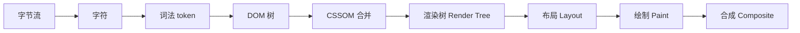
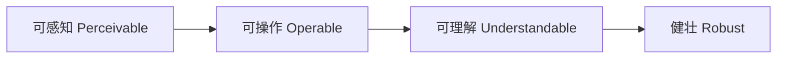

# HTML 核心知识点详解

> 本文档位于 `知识库/前端/01基础语言层/01HTML/`，系统梳理 HTML5 从文档结构、语义化、表单、多媒体到可访问性与 SEO 的核心内容，配合 Mermaid 图与代码示例辅助理解。配套的《常见面试题与最佳实践.md》见同目录（后续补充）。
>
> 适合正在学习 HTML 基础、希望同时建立工程化与面试视角的同学。文中所有代码均可直接复制到 `.html` 文件中用浏览器打开验证。

---

## 一、HTML 文档骨架

### 1.1 最小可用模板

```html
<!DOCTYPE html>
<html lang="zh-CN">
<head>
  <meta charset="UTF-8">
  <meta name="viewport" content="width=device-width, initial-scale=1.0">
  <title>页面标题</title>
</head>
<body>
  <h1>Hello, HTML</h1>
</body>
</html>
```

要点：

- `<!DOCTYPE html>` 声明 HTML5，触发标准模式（不写会触发怪异模式，盒模型与样式行为异常）。
- `<html lang="zh-CN">` 的 `lang` 属性影响搜索引擎、屏幕阅读器发音、浏览器翻译提示，必须写。
- `<meta charset="UTF-8">` 尽量放 head 第一个，避免短于 1024 字节时浏览器猜测编码出错。
- `<meta name="viewport">` 是移动端响应式的前提，不写则手机会按 980px 宽渲染再缩放。

### 1.2 一个 HTML 文档的解析流程



<!-- -->

> 关键结论：HTML 解析是流式的，遇到 `<script>` 默认会阻塞解析（先下载执行再继续），所以脚本通常放 `</body>` 之前，或用 `defer` / `async`。

---

## 二、语义化标签

### 2.1 为什么强调语义化

- **可访问性**：屏幕阅读器靠标签判断页面结构，`<div>` 对它无意义。
- **SEO**：搜索引擎靠语义理解内容权重，`<h1>` 是标题、`<article>` 是正文。
- **可维护性**：结构即注释，`<header>` 比 `<div class="header">` 更直白。
- **默认样式**：`<button>` 自带键盘可达性与表单提交能力，`<div onclick>` 需要手动补全。

### 2.2 常用结构化标签

| 标签 | 用途 | 典型位置 |
|---|---|---|
| `<header>` | 页眉 / 区块的头部 | 页面顶部、`<article>` 内 |
| `<nav>` | 主导航链接区 | 通常仅主导航用 |
| `<main>` | 页面主内容 | 每页只有一个 |
| `<article>` | 可独立分发/复用的内容 | 文章、评论、卡片 |
| `<section>` | 主题分组，通常带标题 | 章节、功能区 |
| `<aside>` | 旁支内容 | 侧边栏、相关推荐 |
| `<footer>` | 页脚 / 区块尾部 | 版权、备案、引用 |
| `<figure>` / `<figcaption>` | 图文组合 + 说明 | 文章插图、代码截图 |

判断 `article` vs `section` 的口诀：能整体复制到 RSS 里独立成立的是 `article`；只是章节切分的是 `section`。

### 2.3 典型页面骨架

```html
<body>
  <header>
    <nav>主导航</nav>
  </header>
  <main>
    <article>
      <h1>文章标题</h1>
      <section><h2>引言</h2></section>
      <section><h2>正文</h2></section>
    </article>
    <aside>相关推荐</aside>
  </main>
  <footer>版权信息</footer>
</body>
```

---

## 三、文本与排版

### 3.1 标题层级

- 一页只应有一个 `<h1>`（通常对应文章主标题）。
- 不要为了样式跳级（h1 → h4），也不要用 `<h3>` 仅仅因为字大小合适——样式归 CSS 管。
- 层级应连续：h1 → h2 → h3。

### 3.2 语义 vs 外观

| 语义标签 | 含义 | 不要用 div 替代 |
|---|---|---|
| `<strong>` | 强重要性 | 加粗请用 CSS |
| `<em>` | 语义强调 | 斜体请用 CSS |
| `<blockquote>` | 块级引用 | — |
| `<q>` | 行内引用（自动加引号） | — |
| `<code>` | 行内代码 | 配合 `<pre>` 使用 |
| `<pre>` | 预格式化文本，保留空白 | 放代码块 |
| `<abbr title="...">` | 缩写，hover 显示全称 | — |
| `<time datetime="2026-08-21">` | 机器可读时间 | SEO 友好 |

---

## 四、链接、图片与路径

### 4.1 链接 `<a>`

```html
<a href="https://example.com" target="_blank" rel="noopener noreferrer">新窗口打开</a>
<a href="#section2">页内锚点</a>
<a href="mailto:a@b.com?subject=你好">发邮件</a>
<a href="tel:+8613800000000">打电话</a>
<a href="/download.pdf" download>下载</a>
```

要点：

- `target="_blank"` 必须配 `rel="noopener noreferrer"`，否则新页面可通过 `window.opener` 操纵原页面（安全风险 + 性能）。
- `download` 属性触发下载而非导航，但跨域资源会被浏览器忽略。

### 4.2 图片 ``

```html

```

要点：

- `alt` 是必写的：可访问性、SEO、图片加载失败时的占位文字都靠它。
- `width` / `height` 写上可避免布局抖动（CLS），现代浏览器按比例保留空间。
- `loading="lazy"` 懒加载视口外图片，首屏更快。
- 响应式图片用 `<picture>` + `srcset`，按屏幕宽度选不同图。

```html
<picture>
  <source srcset="photo.webp" type="image/webp">
  
</picture>
```

---

## 五、列表与表格

### 5.1 列表

```html
<ul><li>无序列表</li></ul>
<ol><li>有序列表</li></ol>
<dl>
  <dt>HTML</dt><dd>超文本标记语言</dd>
  <dt>CSS</dt><dd>层叠样式表</dd>
</dl>
```

### 5.2 表格

```html
<table>
  <caption>用户表</caption>
  <thead>
    <tr><th>姓名</th><th>年龄</th></tr>
  </thead>
  <tbody>
    <tr><td>张三</td><td>20</td></tr>
  </tbody>
</table>
```

要点：

- `<caption>` 给表格标题，可访问性友好。
- 表格只用于展示数据，**不要用 table 做布局**（上世纪做法，响应式与可访问性灾难）。
- `colspan` / `rowspan` 合并单元格，能不用就不用——合并越多越难维护。

---

## 六、表单（实战重点）

### 6.1 基本结构

```html
<form action="/api/login" method="POST">
  <label for="email">邮箱</label>
  <input id="email" name="email" type="email" required
         placeholder="you@example.com">

  <label for="pwd">密码</label>
  <input id="pwd" name="pwd" type="password" minlength="6" required>

  <button type="submit">登录</button>
</form>
```

要点：

- **永远用 `<label>` 配 `<input>`**，`for` 指向 `id`。点击文字也能聚焦，屏幕阅读器才能读出字段含义。
- `name` 是提交到后端的字段名，`id` 是前端关联 label 与 JS 用的，两者不要混。
- `<button>` 默认 `type="submit"`；在表单内的非提交按钮要显式写 `type="button"`，否则可能误提交。

### 6.2 input 类型与原生校验

| type | 用途 | 原生校验 |
|---|---|---|
| `text` | 单行文本 | — |
| `email` | 邮箱 | 格式校验 |
| `password` | 密码（掩码） | — |
| `number` | 数字 | min/max/step |
| `tel` | 电话 | 不校验格式（地区差异大） |
| `url` | 网址 | 格式校验 |
| `date` / `time` / `month` | 日期时间 | 浏览器原生选择器 |
| `color` | 颜色选择 | — |
| `file` | 文件上传 | `accept` 限制类型 |
| `checkbox` / `radio` | 多选/单选 | `name` 同组 |
| `range` | 滑块 | min/max/step |

校验相关属性：`required`（必填）、`pattern`（正则）、`minlength` / `maxlength`、`min` / `max`。

```html
<input type="text" name="phone" pattern="^1\d{10}$"
       required title="请输入 11 位手机号">
```

### 6.3 select / textarea / fieldset

```html
<fieldset>
  <legend>性别</legend>
  <label><input type="radio" name="gender" value="m"> 男</label>
  <label><input type="radio" name="gender" value="f"> 女</label>
</fieldset>

<select name="city">
  <option value="">请选择</option>
  <optgroup label="一线城市">
    <option value="bj">北京</option>
    <option value="sh">上海</option>
  </optgroup>
</select>

<textarea name="bio" rows="4" maxlength="200"></textarea>
```

`<fieldset>` + `<legend>` 给一组字段加标题，表单分组与可访问性都靠它。

---

## 七、多媒体与嵌入

### 7.1 音视频

```html
<video controls width="640" poster="cover.jpg" preload="metadata">
  <source src="movie.mp4" type="video/mp4">
  <source src="movie.webm" type="video/webm">
  你的浏览器不支持 video。
</video>

<audio controls>
  <source src="song.mp3" type="audio/mpeg">
</audio>
```

要点：

- `<source>` 多源按顺序尝试，第一个支持的生效，用于兼容不同浏览器。
- `preload="metadata"` 只加载元信息（时长、尺寸），省流量。
- 自动播放限制：带音轨的自动播放被大多数浏览器禁止，`muted` 可放行。

### 7.2 iframe 与安全

```html
<iframe src="https://example.com" sandbox="allow-scripts allow-same-origin"
        referrerpolicy="no-referrer" loading="lazy"></iframe>
```

嵌入第三方内容时务必：

- 用 `sandbox` 限制能力（默认全部禁用，按需开放）。
- 配 `referrerpolicy` 控制 Referer 头泄露。
- 跨域资源不可用 JS 操作其内部 DOM（同源策略）。

---

## 八、元数据与 SEO

### 8.1 head 内常用 meta

```html
<meta name="description" content="一句话描述页面，搜索引擎结果摘要">
<meta name="keywords" content="HTML, 教程">  <!-- 已被搜索引擎忽略 -->
<meta name="robots" content="index, follow">
<meta http-equiv="refresh" content="3;url=/new">  <!-- 跳转，慎用 -->
```

### 8.2 Open Graph 与社交分享

```html
<meta property="og:title" content="HTML 核心知识点">
<meta property="og:description" content="从骨架到 SEO 的完整梳理">
<meta property="og:image" content="https://example.com/cover.jpg">
<meta property="og:url" content="https://example.com/post">
```

被微信、微博、Twitter、Facebook 抓取用于分享卡片。

### 8.3 canonical 与 link

```html
<link rel="canonical" href="https://example.com/post">
<link rel="icon" href="/favicon.ico">
<link rel="preconnect" href="https://cdn.example.com">
<link rel="stylesheet" href="/style.css">
```

`canonical` 告诉搜索引擎"这是规范地址"，避免多 URL 重复内容降权。

---

## 九、可访问性 a11y

### 9.1 核心原则

可访问性不只是给盲人用——屏幕阅读器、键盘导航、老人低视力、临时手伤的人都受益，且法律上一些场景是强制要求。

### 9.2 WCAG 的 POUR 四原则



<!-- -->

### 9.3 工程落地清单

- 语义化标签优先（`<button>` 不要 `<div onclick>`）。
- 所有图片有 `alt`（装饰图用 `alt=""` 显式声明跳过）。
- 表单字段必有 `<label>`。
- 颜色对比度 ≥ 4.5:1（正文），不要只靠颜色传达信息（色盲）。
- 键盘可达：所有交互元素 Tab 可聚焦，顺序符合阅读顺序。
- 动效尊重 `prefers-reduced-motion`。

### 9.4 ARIA 的边界

ARIA 是补充，不是替代语义。能语义化就别加 ARIA：

```html
<!-- 不好 -->
<div role="button" tabindex="0" onclick="...">提交</div>
<!-- 好 -->
<button type="submit">提交</button>
```

ARIA 第一规则："能改原生标签就别用 ARIA 给 div 加角色"。

---

## 十、HTML5 新特性一览

| 能力 | 标签 / API | 用途 |
|---|---|---|
| 语义化 | header/nav/main/article | 结构清晰 |
| 表单增强 | email/date/range/color | 原生校验与控件 |
| 多媒体 | video/audio | 不再依赖 Flash |
| 绘图 | `<canvas>` | 像素位图，游戏/图表 |
| 矢量图 | `<svg>` | 矢量图形，CSS 可控 |
| 本地存储 | localStorage / sessionStorage | 客户端持久化 |
| 地理位置 | Geolocation API | 获取经纬度（需授权） |
| 拖放 | dragstart/drop 事件 | 原生拖拽 |
| Web Worker | `new Worker()` | 后台线程不阻塞 UI |
| WebSocket | `new WebSocket()` | 全双工长连接 |
| 历史管理 | history.pushState | SPA 路由基础 |

> 注意：`localStorage` 等存储 API 本质是 JS 接口，但 HTML5 规范定义，常与 HTML 一起讲。

---

## 十一、最佳实践 Checklist

### 11.1 结构与语义

- 文档以 `<!DOCTYPE html>` 开头，`<html lang="...">`。
- head 含 charset、viewport、title、description。
- 一个页面一个 `<h1>`，标题层级连续不跳级。
- 用语义标签替代无意义的 `<div class="...">`。
- 表格只放数据，不做布局。

### 11.2 性能

- `<script>` 放底部，或加 `defer`（保持执行顺序）/ `async`（独立脚本）。
- `<link rel="preconnect">` 预连关键第三方域名。
- 图片加 `width`/`height`/`loading="lazy"`，提供 webp 源。
- 内联关键 CSS，异步加载非首屏 CSS。

### 11.3 可访问性

- 所有 `` 有 `alt`，装饰图 `alt=""`。
- 所有 `<input>` 配 `<label for>`。
- 交互元素用 `<button>`/`<a>`，不用 `<div onclick>`。
- 颜色对比度 ≥ 4.5:1。
- 跳过导航链接（"skip to main content"）便于键盘用户。

### 11.4 安全

- `target="_blank"` 配 `rel="noopener noreferrer"`。
- iframe 用 `sandbox` 限制能力。
- 用户输入写入 HTML 前转义，防 XSS。
- CSP 头限制脚本来源。

---

## 十二、高频面试要点

1. **DOCTYPE 的作用？** 声明 HTML5 标准模式，不写会进怪异模式（盒模型按 IE 老规则、行内图片下方留间隙等）。
2. **meta viewport 怎么写？为什么？** `width=device-width, initial-scale=1.0`。移动端不写则按 980px 渲染再缩放，字小需手动放大。
3. **语义化标签有哪些好处？** 可访问性、SEO、可维护性、默认能力（button 可键盘提交）。
4. **`<script>` 的 defer 与 async 区别？**
   - `defer`：异步下载，DOM 解析完后按顺序执行，多个 defer 按出现顺序。
   - `async`：异步下载，下载完立即执行（中断解析），多个 async 顺序不确定。
   - 无属性：遇 script 暂停解析，下载执行完才继续。
5. **img 的 alt 与 title 区别？** `alt` 是替代文本（加载失败/读屏用，必填）；`title` 是悬停提示（可选）。
6. **如何实现响应式图片？** `<picture>` + `<source srcset>`，或 ``。
7. **localStorage / sessionStorage / cookie 区别？**
   - localStorage：持久化，5MB+，同源共享。
   - sessionStorage：标签页关闭即失效，同源同标签页。
   - cookie：随请求自动带，4KB，可设 HttpOnly/Secure/SameSite。
8. **target="_blank" 为什么要加 rel="noopener"？** 防止新页面通过 `window.opener` 反向操纵原页面（钓鱼/重定向），noreferrer 还防 Referer 泄露。
9. **ARIA 什么时候用？** 语义标签无法满足时（自定义组件如 Tab、Modal、Menu），补充 role/aria-*；能语义化就别加。
10. **什么是同源策略？** 协议 + 域名 + 端口三者相同才算同源，跨域 JS 默认不能读响应（img/script 标签可跨域加载，但读不到内容）。

---

## 十三、一句话总纲

> HTML 的本质是**给内容打语义标签**：结构清晰、可被搜索、可被读屏、可被样式与脚本操作。会写标签只是入门，会选对的标签才是工程师。
