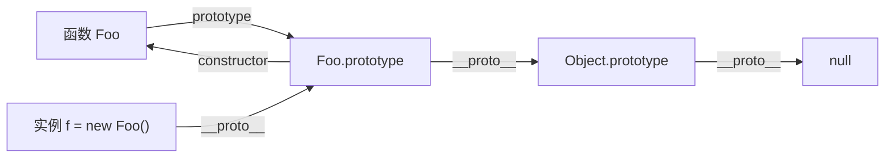
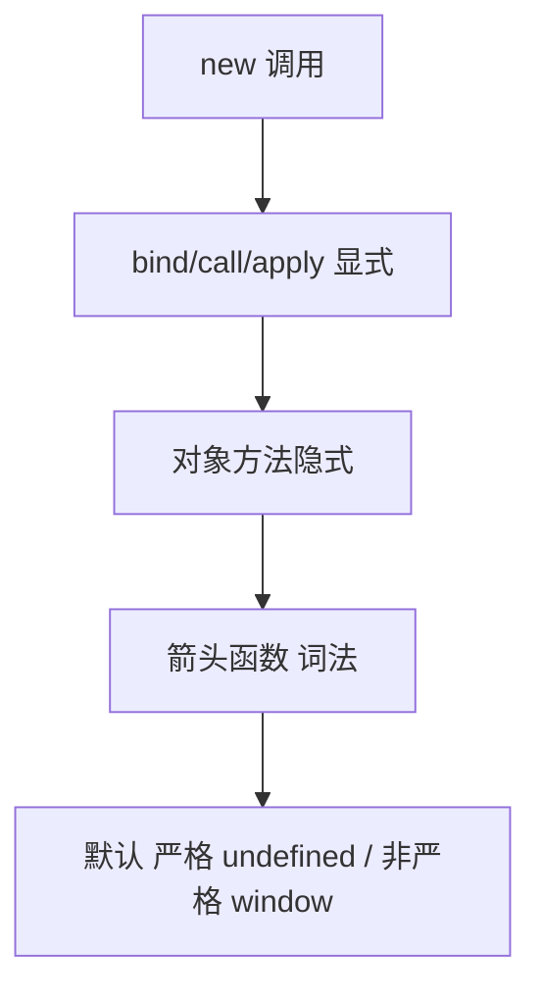
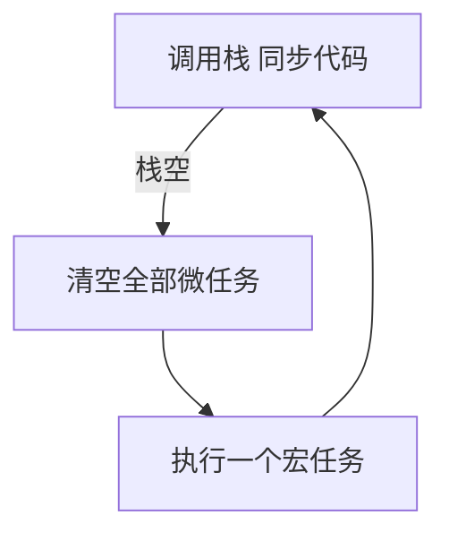

# JavaScript 常见面试题与最佳实践

> 配套文档《核心知识点详解.md》见同目录。本文件覆盖 JavaScript 高频面试题（含参考答案与易错点）+ 手写题 + 工程最佳实践 Checklist，按"基础概念 / 作用域与闭包 / 原型与 this / 异步与事件循环 / ES6+ / DOM 与事件 / 手写题"七个维度组织。
>
> 答案要点可直接背诵，手写题给出可直接复制的实现。JS 是前端面试重头戏，本文篇幅最长。

---

## 一、基础概念（10 题）

### 1.1 JavaScript 有几种数据类型？如何判断？

8 种：7 原始（string/number/boolean/undefined/null/symbol/bigint）+ 1 引用（object，含 Array/Function/Date/Map/Set 等）。

判断三板斧：

```js
typeof "a";                              // "string"
typeof null;                             // "object"（历史 bug）
typeof function(){};                     // "function"
[] instanceof Array;                     // true（不能跨 iframe）
Object.prototype.toString.call(null);     // "[object Null]"（最准）
Array.isArray([]);                       // true（判断数组首选）
```

### 1.2 == vs === 区别？为什么生产用 ===？

`==` 会做类型转换，`===` 不会。

```js
0 == ""          // true
0 == false       // true
null == undefined // true
NaN == NaN       // false
[] == false      // true
```

`===` 行为可预测，`==` 的转换规则复杂难记。生产统一 `===`，判断 null/undefined 用 `x == null`（同时匹配两者）是少数合理用法。

### 1.3 什么是假值？列出所有。

只有 6 个：`false`、`0`、`""`、`null`、`undefined`、`NaN`。
其他都是 truthy，包括 `[]`、`{}`、`"0"`、`"false"`、`Infinity`。

```js
if ([])  { /* 会执行，[] 是 truthy */ }
if ("0") { /* 会执行 */ }
```

### 1.4 typeof null === "object" 为什么？

早期 JS 用低位标记类型，对象类型的标记位是 `000`，而 null 在机器码里是全 0，被误判为对象。已成历史包袱无法修复（会破坏大量现有代码）。判断 null 用 `x === null`。

### 1.5 var / let / const 区别？

| 特性 | var | let | const |
|---|---|---|---|
| 作用域 | 函数级 | 块级 | 块级 |
| 提升 | 是（值为 undefined） | 是（TDZ） | 是（TDZ） |
| 重复声明 | 允许 | 禁止 | 禁止 |
| 重新赋值 | 允许 | 允许 | 禁止 |
| 挂全局对象 | 是 | 否 | 否 |

默认 `const`，需重赋值才 `let`，`var` 已淘汰。

### 1.6 什么是暂时性死区（TDZ）？

`let`/`const` 声明的变量在作用域顶到声明语句之间是"死区"，访问会抛 ReferenceError。

```js
console.log(a);  // ReferenceError
let a = 1;

console.log(b);  // undefined（var 提升）
var b = 2;
```

TDZ 强制"先声明后使用"，避免 var 时代"先用后声明"的混乱。

### 1.7 typeof 未声明变量会怎样？

```js
typeof x;  // "undefined"（不报错）
x;         // ReferenceError
```

`typeof` 是唯一能安全访问未声明变量的方式，常用于环境探测（`typeof window !== "undefined"`）。

### 1.8 JavaScript 是单线程还是多线程？

主线程是单线程（执行栈一次只做一件事），但浏览器提供 Web API（定时器、网络、事件）在后台处理异步任务，配合事件循环实现"并发"。

### 1.9 number 的精度问题？

JS 数字是 IEEE 754 双精度浮点，最大安全整数 2^53 - 1。

```js
0.1 + 0.2;     // 0.30000000000000004
9007199254740992 + 1;  // 9007199254740992（超出安全范围）
```

大整数用 `BigInt`，金额用整数分单位 + 除以 100 显示。

### 1.10 +0 和 -0 区别？

```js
+0 === -0;     // true
Object.is(-0, +0);  // false
1/-0;          // -Infinity（判断符号的依据）
```

多数场景无感，但数学库或缓存 key 需区分时用 `Object.is`。

---

## 二、作用域与闭包（8 题）

### 2.1 什么是闭包？举一个应用。

闭包 = 函数 + 其引用的外层变量。外层函数返回后，内层仍能访问其变量。

```js
function counter() {
  let n = 0;
  return () => ++n;  // 闭包：持有 n 的引用
}
const c = counter();
c();  // 1
c();  // 2
```

应用：私有变量、模块模式、防抖节流、柯里化、React Hooks 的依赖捕获。

### 2.2 经典题：循环 + setTimeout 输出什么？为什么？

```js
for (var i = 0; i < 3; i++) {
  setTimeout(() => console.log(i), 0);
}
// 输出：3 3 3
```

`var` 是函数级，整个循环只有一个 `i`。回调执行时循环早已结束，`i` 已是 3。
修复：

```js
for (let i = 0; i < 3; i++) setTimeout(() => console.log(i), 0);  // 0 1 2

// 或用 IIFE 捕获
for (var i = 0; i < 3; i++) {
  ((j) => setTimeout(() => console.log(j), 0))(i);
}
```

### 2.3 闭包会导致内存泄漏吗？

不会"自动泄漏"，但若闭包长期持有大对象引用且不释放，会延迟回收。常见场景：

- 定时器回调闭包持有 DOM 引用，DOM 删除后定时器未清。
- 全局变量缓存（window.xxx = bigObj）。

现代浏览器标记-清除算法会清理"无引用"对象，闭包本身不是泄漏源，"忘记清引用"才是。

### 2.4 词法作用域 vs 动态作用域？

- **词法作用域**（JS 采用）：函数定义时确定的作用域链，与调用位置无关。
- **动态作用域**：函数调用时确定的作用域（如 bash）。

```js
const x = "outer";
function f() { console.log(x); }
function caller() { const x = "inner"; f(); }
caller();  // "outer"（词法作用域，f 定义时 x 是 outer）
```

### 2.5 作用域链查找规则？

访问变量时，从内层作用域向外逐层查找，找到即停，找不到抛 ReferenceError。函数定义时确定的作用域链与调用位置无关。

### 2.6 IIFE 是什么？现在还需要吗？

```js
(function () {
  var private = 1;
})();
```

立即执行函数，用于创建独立作用域避免污染全局。ES6 后用块级作用域 `{ let x = 1; }` 即可，IIFE 已基本退役，仅在老代码与库的 UMD 包装中见到。

### 2.7 模块模式怎么实现私有变量？

```js
const counter = (() => {
  let n = 0;  // 私有
  return {
    inc: () => ++n,
    get: () => n,
  };
})();
counter.inc();  // 1
counter.n;      // undefined（外部访问不到）
```

闭包持有 `n`，对外只暴露方法。ES6 class 用 `#privateField` 语法实现真私有。

### 2.8 for...of 与 for...in 区别？

```js
const arr = [1, 2, 3];
arr.extra = "x";

for (const k in arr) console.log(k);  // "0" "1" "2" "extra"（遍历 key 含原型链）
for (const v of arr) console.log(v);  // 1 2 3（遍历值，仅自身可迭代）
```

- `for...in`：遍历**可枚举属性**（含原型链），适合对象。
- `for...of`：遍历**可迭代对象**（Symbol.iterator），适合数组/Map/Set/字符串。

遍历对象推荐 `Object.entries()`。

---

## 三、原型与 this（8 题）

### 3.1 描述原型链。



<!-- -->

每个对象有 `__proto__` 指向其构造函数的 `prototype`，访问属性时沿这条链查找，直到 `Object.prototype.__proto__ === null` 为止。

```js
function Foo() {}
const f = new Foo();
f.__proto__ === Foo.prototype;             // true
Foo.prototype.__proto__ === Object.prototype;  // true
f.constructor === Foo;                     // true
```

### 3.2 new 做了什么？手写实现。

1. 创建空对象。
2. 链接到构造函数的 prototype。
3. 绑定 this 执行构造函数。
4. 返回对象（若构造函数显式返回对象则用之，否则返回新对象）。

```js
function myNew(Ctor, ...args) {
  const obj = Object.create(Ctor.prototype);
  const ret = Ctor.apply(obj, args);
  return (ret && typeof ret === "object") ? ret : obj;
}
```

### 3.3 instanceof 原理？手写。

沿对象 `__proto__` 链查找，直到找到构造函数的 `prototype` 或到 null。

```js
function myInstanceof(obj, Ctor) {
  let proto = Object.getPrototypeOf(obj);
  while (proto !== null) {
    if (proto === Ctor.prototype) return true;
    proto = Object.getPrototypeOf(proto);
  }
  return false;
}
```

### 3.4 this 的五种绑定规则（按优先级）？



<!-- -->

```js
obj.say();              // 隐式：this = obj
obj.say.call({});       // 显式：this = {}
new Person();           // new：this = 新对象
const say = () => this; // 箭头：this = 外层词法 this
fn();                   // 默认：strict 下 undefined
```

### 3.5 箭头函数与普通函数区别？

- 无自己的 this（沿外层词法作用域）。
- 无 `arguments`、`super`、`new.target`。
- 不能 `new` 调用，无 `prototype`。
- 不能改 this（call/apply/bind 只传参不改 this）。

**不适合**：对象方法（this 不指向对象）、原型方法、构造函数、需 arguments 的场景。

### 3.6 call / apply / bind 区别？

| 方法 | 调用方式 | 立即执行 |
|---|---|---|
| `call(this, a, b)` | 逐个参数 | 是 |
| `apply(this, [a, b])` | 数组参数 | 是 |
| `bind(this, a, b)` | 返回新函数 | 否 |

```js
fn.call(obj, 1, 2);
fn.apply(obj, [1, 2]);
const bound = fn.bind(obj, 1, 2);  // 返回新函数
bound();
```

### 3.7 手写 call / apply / bind

```js
Function.prototype.myCall = function (ctx = globalThis, ...args) {
  const key = Symbol("fn");
  ctx[key] = this;
  const ret = ctx[key](...args);
  delete ctx[key];
  return ret;
};

Function.prototype.myBind = function (ctx, ...args) {
  const fn = this;
  return function (...rest) {
    return fn.apply(this instanceof fn ? this : ctx, [...args, ...rest]);
  };
};
```

### 3.8 ES6 class 与 function 构造函数区别？

- class 必须用 `new` 调用，function 可直接调用。
- class 方法不可枚举，function 原型方法可枚举。
- class 有 `extends` / `super` 语法糖。
- class 内默认严格模式。

底层仍是原型链，class 是语法糖。

---

## 四、异步与事件循环（10 题）

### 4.1 描述事件循环。



<!-- -->

规则：

1. 同步代码进调用栈立即执行。
2. 异步任务交给 Web API，回调就绪后入队（Promise.then → 微任务，setTimeout → 宏任务）。
3. 调用栈清空后，先清空**全部微任务**，再执行**一个**宏任务，循环往复。

### 4.2 微任务和宏任务各有哪些？

- **微任务**：Promise.then / queueMicrotask / MutationObserver / process.nextTick（Node）。
- **宏任务**：setTimeout / setInterval / I/O / UI 渲染 / postMessage / setImmediate（Node）。

微任务优先级高于宏任务，每次宏任务后清空全部微任务。

### 4.3 经典输出题

```js
console.log(1);
setTimeout(() => console.log(2), 0);
Promise.resolve().then(() => console.log(3));
console.log(4);
// 输出：1 4 3 2
```

同步 → 微任务 → 宏任务。

### 4.4 async/await 输出题

```js
async function a() {
  console.log(1);
  await Promise.resolve();
  console.log(2);
}
console.log(3);
a();
console.log(4);
// 输出：3 1 4 2
```

`await` 之后的代码相当于 `.then` 回调，进微任务队列。所以 2 在 4 之后。

### 4.5 Promise 的状态？状态转换规则？

pending → fulfilled / rejected，**一经改变不可逆**。

```js
const p = new Promise((resolve, reject) => {
  resolve("ok");   // 状态定
  reject("err");   // 无效
});
```

`resolve` 一个 Promise 会" adopt"其状态（等待内层 Promise 决定）。

### 4.6 Promise.all / allSettled / race / any 区别？

| 方法 | 行为 | 失败时 |
|---|---|---|
| `Promise.all` | 全成功才成功 | 任一失败即失败 |
| `Promise.allSettled` | 全结束才结束 | 不失败，记录状态 |
| `Promise.race` | 第一个完成（成败均可） | 第一个是失败则失败 |
| `Promise.any` | 第一个成功 | 全失败才失败 |

```js
await Promise.all([p1, p2]);        // 都成功才返回数组
await Promise.allSettled([p1, p2]); // [{status, value/reason}, ...]
await Promise.any([p1, p2]);        // 第一个成功的值
```

### 4.7 Promise.then 的链式调用怎么实现？

每个 then 返回**新 Promise**：

- 回调返回普通值 → 新 Promise fulfilled 该值。
- 回调返回 Promise → 新 Promise adopt 其状态。
- 回调抛错 → 新 Promise rejected。

```js
fetch(url)
  .then(r => r.json())    // 返回 Promise，链式
  .then(data => data.items)
  .catch(err => console.error(err));
```

### 4.8 async/await 相比 Promise 的优势？

- 同步写法读起来更直观（避免 then 链）。
- 错误处理用 try/catch 统一捕获（跨多个 await）。
- 调试更友好（断点在 await 后能停）。

底层是 Generator + 自动执行器的语法糖。

### 4.9 怎么实现并发请求限制（如 5 个一批）？

```js
async function limitConcurrency(tasks, limit) {
  const results = [];
  const executing = new Set();
  for (const task of tasks) {
    const p = task().then(r => { executing.delete(p); return r; });
    executing.add(p);
    results.push(p);
    if (executing.size >= limit) await Promise.race(executing);
  }
  return Promise.all(results);
}
```

用 `Promise.race` 等任一完成释放位置，配合 `Promise.all` 收集结果。

### 4.10 怎么取消一个 fetch 请求？

用 `AbortController`：

```js
const controller = new AbortController();
setTimeout(() => controller.abort(), 3000);
fetch(url, { signal: controller.signal }).catch(err => {
  if (err.name === "AbortError") console.log("已取消");
});
```

页面切换、防抖过期、用户主动取消都靠它。

---

## 五、ES6+（8 题）

### 5.1 let/const 的"提升"和 var 的提升区别？

`let`/`const` 也会提升到块顶，但进入 TDZ，访问前抛 ReferenceError。`var` 提升后值为 undefined，可访问。

### 5.2 解构赋值的常用写法？

```js
const [a, b, ...rest] = [1, 2, 3, 4];     // 数组
const { name, age = 18 } = user;          // 对象 + 默认值
const { name: n } = user;                 // 重命名
function f({ x = 0, y = 0 } = {}) {}      // 参数解构 + 默认
const [first, , third] = arr;             // 跳过
```

### 5.3 扩展运算符的用途？

```js
const copy = [...arr];              // 浅拷贝数组
const merged = [...a, ...b];        // 合并数组
const obj = { ...old, newField: 1 }; // 浅拷贝/合并对象
function f(...args) {}              // 剩余参数
```

注意：对象扩展是**浅拷贝**，嵌套对象仍是引用。

### 5.4 模板字符串的高级用法？

```js
const html = `<div>${name}</div>`;        // 插值
const multi = `第一行
第二行`;                                  // 多行
const tag = (s, ...v) => v.join("-");     // 标签模板
tag`${1}${2}${3}`;                        // "1-2-3"
```

### 5.5 Map / WeakMap 区别？何时用 WeakMap？

| 特性 | Map | WeakMap |
|---|---|---|
| 键类型 | 任意 | 仅对象 |
| 可枚举 | 是 | 否 |
| 阻止 GC | 是 | 否（键被回收即移除） |
| 用途 | 数据存储 | 对象关联数据（私有、缓存） |

```js
const meta = new WeakMap();
function track(obj) { meta.set(obj, { count: 0 }); }  // obj 被回收时 meta 自动清理
```

### 5.6 Set 去重的陷阱？

```js
const set = new Set([1, 2, 2, 3]);  // {1,2,3}
const objSet = new Set([{a:1}, {a:1}]);  // 2 个元素（引用不同）
NaN === NaN;  // false
new Set([NaN, NaN]);  // {NaN}（Set 内部用 SameValueZero，NaN 算相等）
```

对象去重要自己写 reducer 用唯一字段判断。

### 5.7 Proxy 与 Reflect 的关系？

Proxy 拦截对象操作，Reflect 提供与拦截器同名的默认行为方法，便于在拦截内调用"原本应做的事"。

```js
const proxy = new Proxy({}, {
  get(t, k) { console.log("读取", k); return Reflect.get(t, k); },
  set(t, k, v) { console.log("设置", k, v); return Reflect.set(t, k, v); },
});
```

Vue 3 响应式基于 Proxy，比 Vue 2 的 Object.defineProperty 强（能监听新增属性、数组索引）。

### 5.8 ES Module 与 CommonJS 区别？

| 特性 | ES Module | CommonJS |
|---|---|---|
| 加载 | 静态、编译期 | 动态、运行时 |
| 输出 | 引用（live binding） | 值拷贝 |
| 异步 | 是 | 同步 |
| 严格模式 | 默认 | 否 |
| Tree-shaking | 支持 | 不支持 |

```js
// ESM
import { x } from "./m.js";    // 静态，可 tree-shake
export default function () {}
// CommonJS
const m = require("./m.js");   // 动态，运行时
module.exports = {};
```

---

## 六、DOM 与事件（6 题）

### 6.1 事件流三个阶段？

捕获 → 目标 → 冒泡。

```js
btn.addEventListener("click", fn);          // 默认冒泡阶段
btn.addEventListener("click", fn, true);    // 捕获阶段
```

### 6.2 事件委托原理与优势？

利用冒泡，在父监听，子触发，用 `e.target.closest(选择器)` 定位实际元素。

```js
ul.addEventListener("click", e => {
  const li = e.target.closest("li");
  if (li) console.log(li.dataset.id);
});
```

优势：动态增删元素无需重绑、监听器少、内存省。适合列表、表格、动态内容。

### 6.3 stopPropagation vs stopImmediatePropagation？

- `stopPropagation`：阻止冒泡/捕获继续。
- `stopImmediatePropagation`：还阻止同元素后续监听执行。

```js
btn.addEventListener("click", e => { e.stopImmediatePropagation(); });
btn.addEventListener("click", () => console.log("不会执行"));
```

### 6.4 preventDefault 与 return false 区别？

- `e.preventDefault()`：阻止默认行为（表单提交、链接跳转）。
- `return false`：在 addEventListener 里**不**阻止默认，仅阻止事件继续（等同 stopPropagation + preventDefault 在 jQuery 时代）；现代 DOM 监听里等同 preventDefault 仅在 onXxx 属性赋值时。

DOM 监听里推荐显式 `e.preventDefault()`。

### 6.5 querySelectorAll vs getElementsByClassName？

```js
document.querySelectorAll(".item");    // 静态 NodeList，后续 DOM 变化不影响
document.getElementsByClassName("x"); // 动态 HTMLCollection，实时同步
```

静态列表遍历安全，动态列表循环删除时要小心索引错乱。

### 6.6 大量 DOM 操作怎么优化？

- DocumentFragment 离线构建，最后一次性插入。
- 先 `display: none` 隐藏父级，操作完再显示（避免每次触发布局）。
- 用 `requestAnimationFrame` 分块插入。
- 长列表用虚拟滚动（只渲染可视区）。

---

## 七、手写题（10 题，重中之重）

### 7.1 手写防抖 debounce

```js
function debounce(fn, ms) {
  let timer;
  return function (...args) {
    clearTimeout(timer);
    timer = setTimeout(() => fn.apply(this, args), ms);
  };
}
```

立即执行版（首触发立即执行，静默期内不再执行）：

```js
function debounceImmediate(fn, ms) {
  let timer = null;
  return function (...args) {
    if (timer) clearTimeout(timer);
    else fn.apply(this, args);  // 首次立即执行
    timer = setTimeout(() => (timer = null), ms);
  };
}
```

### 7.2 手写节流 throttle

```js
function throttle(fn, ms) {
  let last = 0;
  return function (...args) {
    const now = Date.now();
    if (now - last >= ms) {
      last = now;
      fn.apply(this, args);
    }
  };
}
```

### 7.3 手写深拷贝

```js
function deepClone(obj, map = new WeakMap()) {
  if (obj === null || typeof obj !== "object") return obj;
  if (obj instanceof Date) return new Date(obj);
  if (obj instanceof RegExp) return new RegExp(obj);
  if (map.has(obj)) return map.get(obj);  // 处理循环引用
  const clone = Array.isArray(obj) ? [] : {};
  map.set(obj, clone);
  for (const key of Reflect.ownKeys(obj)) {
    clone[key] = deepClone(obj[key], map);
  }
  return clone;
}
```

现代首选 `structuredClone(obj)`，原生支持循环引用、Date/RegExp/Map/Set，但不支持函数。

### 7.4 手写 Promise.all

```js
Promise.all = function (promises) {
  return new Promise((resolve, reject) => {
    const arr = Array.from(promises);
    const result = new Array(arr.length);
    let count = 0;
    if (arr.length === 0) return resolve([]);
    arr.forEach((p, i) => {
      Promise.resolve(p).then(
        (v) => { result[i] = v; if (++count === arr.length) resolve(result); },
        reject
      );
    });
  });
};
```

### 7.5 手写 Promise.race

```js
Promise.race = function (promises) {
  return new Promise((resolve, reject) => {
    for (const p of promises) {
      Promise.resolve(p).then(resolve, reject);
    }
  });
};
```

### 7.6 手写 instanceof（见 3.3）

### 7.7 手写 new（见 3.2）

### 7.8 手写发布订阅 EventEmitter

```js
class EventEmitter {
  constructor() { this.events = new Map(); }
  on(name, fn) {
    if (!this.events.has(name)) this.events.set(name, []);
    this.events.get(name).push(fn);
  }
  off(name, fn) {
    const arr = this.events.get(name);
    if (arr) this.events.set(name, arr.filter(f => f !== fn));
  }
  once(name, fn) {
    const wrap = (...args) => { fn(...args); this.off(name, wrap); };
    this.on(name, wrap);
  }
  emit(name, ...args) {
    const arr = this.events.get(name);
    if (arr) arr.forEach(f => f(...args));
  }
}
```

### 7.9 手写数组扁平化 flatten

```js
function flatten(arr) {
  return arr.reduce((acc, x) =>
    acc.concat(Array.isArray(x) ? flatten(x) : x), []);
}
// 或用原生
arr.flat(Infinity);
```

### 7.10 手写柯里化 curry

```js
function curry(fn) {
  return function curried(...args) {
    if (args.length >= fn.length) return fn.apply(this, args);
    return (...rest) => curried.apply(this, [...args, ...rest]);
  };
}
const add = curry((a, b, c) => a + b + c);
add(1)(2)(3);   // 6
add(1, 2)(3);   // 6
```

---

## 八、场景题（5 题）

### 8.1 实现 sleep

```js
const sleep = (ms) => new Promise(r => setTimeout(r, ms));
await sleep(1000);
```

### 8.2 实现 Promise 重试

```js
async function retry(fn, times, delay = 1000) {
  for (let i = 0; i < times; i++) {
    try { return await fn(); }
    catch (e) {
      if (i === times - 1) throw e;
      await new Promise(r => setTimeout(r, delay));
    }
  }
}
```

### 8.3 实现 Promise 串行

```js
async function sequential(tasks) {
  const result = [];
  for (const task of tasks) result.push(await task());
  return result;
}
// 或 reduce
tasks.reduce((p, task) => p.then(() => task()), Promise.resolve());
```

### 8.4 实现一个 JSONP

```js
function jsonp(url, params, callbackName) {
  return new Promise((resolve, reject) => {
    window[callbackName] = (data) => { resolve(data); script.remove(); delete window[callbackName]; };
    const script = document.createElement("script");
    const query = new URLSearchParams({ ...params, callback: callbackName }).toString();
    script.src = `${url}?${query}`;
    script.onerror = reject;
    document.body.appendChild(script);
  });
}
```

### 8.5 实现 URL 参数解析

```js
function parseQuery(url) {
  return Object.fromEntries(new URLSearchParams(url.split("?")[1]));
}
parseQuery("https://a.com?name=alice&age=18");
// { name: "alice", age: "18" }
```

---

## 九、生产环境最佳实践 Checklist

### 9.1 代码规范

- 默认 `const`，需要重赋值才 `let`，不用 `var`
- 全程 `===`，不用 `==`
- 用模板字符串替代拼接
- 用解构、扩展替代手动取值
- 函数动词开头（fetchUser / handleSubmit）

### 9.2 异步

- async/await 替代嵌套 Promise
- 并行用 `Promise.all`，串行才用 await 链
- 异步函数加 try/catch
- fetch 配 AbortController 支持取消

### 9.3 性能

- 高频事件防抖/节流
- 大列表虚拟滚动
- 循环内 DOM 操作用 DocumentFragment
- 长任务用 `requestIdleCallback` 分块

### 9.4 安全

- 不用 eval / new Function / innerHTML 拼用户输入
- 用户输入写入 HTML 前转义
- 不在 localStorage 存敏感信息
- 跨域用 CORS 而非 JSONP

### 9.5 模块化

- 用 ES Module，配合打包工具 tree-shaking
- 公共逻辑抽 hooks / utils / components
- 不污染全局变量

---

## 十、一句话总纲

> JavaScript 面试的三个层次：**第一层问"是什么"**（类型、作用域、原型链、this 规则），**第二层问"为什么"**（事件循环、Promise 链式、闭包内存），**第三层问"怎么写"**（手写 new/Promise.all/防抖节流/深拷贝/发布订阅）。能讲清"为什么 setTimeout 在 await 之后"、能手写"并发限制"，就是高级前端对 JS 的认知。
