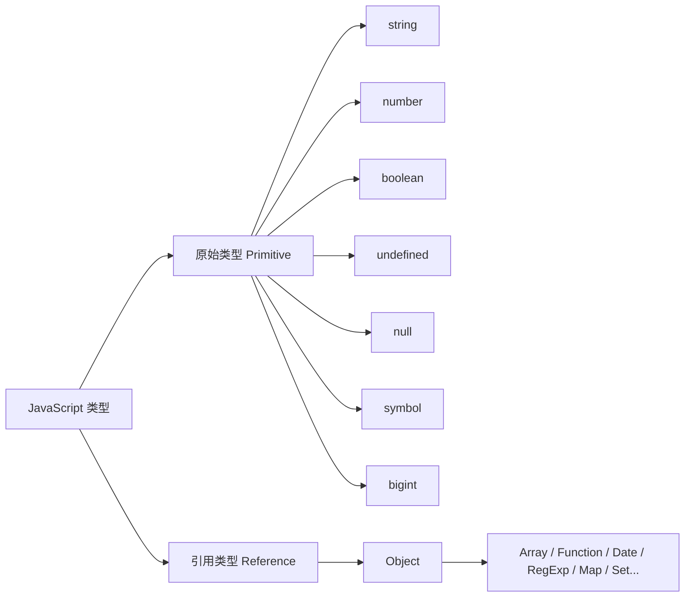
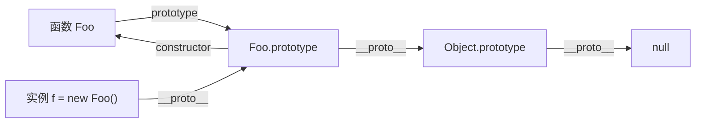
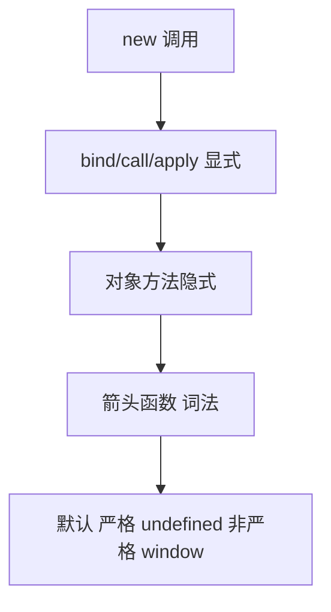
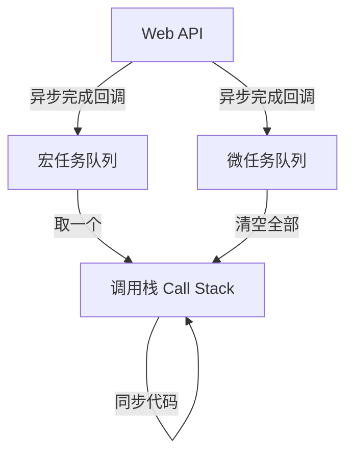
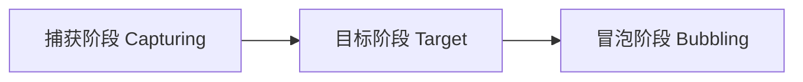

# JavaScript 核心知识点详解

> 本文档位于 `知识库/前端/01基础语言层/03JavaScript/`，系统梳理 JavaScript 从类型系统、作用域闭包、原型链、this、异步、ES6+ 到 DOM 与事件模型的核心内容，配合 Mermaid 图与代码示例辅助理解。建议结合同目录 `01HTML/` 与 `02CSS/` 阅读配套的样式与结构。
>
> 适合已掌握 HTML/CSS 基础、希望系统建立 JS 工程化与面试视角的同学。所有代码均可在浏览器控制台直接验证。

---

## 一、数据类型

### 1.1 八大类型



<!-- -->

- 原始类型按值传递，引用类型按引用传递（操作的是同一对象）。
- `typeof null === "object"` 是历史 bug，判断 null 用 `=== null`。
- `typeof function() {} === "function"`，函数是特殊对象。
- `Symbol` 用于唯一标识符（对象 key、避免冲突），`BigInt` 处理大整数（>2^53）。

### 1.2 类型判断三板斧

| 方法 | 能力 | 局限 |
|---|---|---|
| `typeof` | 区分原始类型 + function | null/object/array 都是 "object" |
| `instanceof` | 判断对象的具体类型 | 不能跨 iframe，原始类型不行 |
| `Object.prototype.toString.call(x)` | 精确判断所有类型 | 写法繁琐 |

```js
typeof "a";              // "string"
typeof null;             // "object"
[] instanceof Array;    // true
Object.prototype.toString.call([]);        // "[object Array]"
Object.prototype.toString.call(null);      // "[object Null]"
```

### 1.3 类型转换

显式：`Number("12")` / `String(123)` / `Boolean("")`。
隐式：`==` 比较与运算符自动转换。

```js
"6" - 1;   // 5（字符串转数字）
"6" + 1;   // "61"（数字转字符串，+ 有字符串走拼接）
[] + [];   // ""（两个都 toString 成 ""）
[] + {};   // ""（{} toString 成 "[object Object]"？实际看引擎）
{} + [];   // 0（{} 被解析为块，剩 +[]）
```

`==` 与 `===` 差别：`==` 会类型转换，`===` 不会。**生产代码统一用 `===`**，避免 `0 == ""`、`null == undefined` 这类坑。

### 1.4 假值（falsy）

只有 6 个：`false`、`0`、`""`、`null`、`undefined`、`NaN`。其他都是 truthy（包括 `[]`、`{}`、`"0"`、`"false"`）。

---

## 二、变量声明与作用域

### 2.1 var / let / const 对比

| 特性 | var | let | const |
|---|---|---|---|
| 作用域 | 函数级 | 块级 | 块级 |
| 提升 | 是（值为 undefined） | 是（TDZ 暂时性死区） | 是（TDZ） |
| 重复声明 | 允许 | 禁止 | 禁止 |
| 重新赋值 | 允许 | 允许 | 禁止 |
| 全局对象属性 | 是（window.x） | 否 | 否 |

```js
console.log(a);  // undefined（var 提升，已声明未赋值）
var a = 1;

console.log(b);  // ReferenceError（let 在 TDZ）
let b = 2;
```

默认用 `const`，需要重新赋值才用 `let`，`var` 已淘汰。

### 2.2 作用域链

```js
const x = "外层";
function outer() {
  function inner() {
    console.log(x);  // 沿作用域链向上找到外层
  }
  inner();
}
```

函数定义时确定的作用域链（词法作用域），与调用位置无关。

---

## 三、闭包

### 3.1 定义与原理

闭包 = 函数 + 其引用的外层变量。即使外层函数已返回，内层仍能访问其变量。

```js
function counter() {
  let n = 0;
  return function () { return ++n; };  // 这个函数就是闭包
}
const c = counter();
c();  // 1
c();  // 2
```

外层 `n` 不会被回收，因为内层函数仍持有引用——这就是"私有变量"的实现原理。

### 3.2 经典陷阱：循环中的闭包

```js
for (var i = 0; i < 3; i++) {
  setTimeout(() => console.log(i), 0);  // 3 3 3
}
```

`var` 是函数级，循环里只有一个 `i`，回调执行时早已是 3。改 `let` 即得 0 1 2：

```js
for (let i = 0; i < 3; i++) {
  setTimeout(() => console.log(i), 0);  // 0 1 2
}
```

### 3.3 应用

- 私有变量封装（模块模式）。
- 函数柯里化、防抖节流。
- React Hooks 依赖捕获（setState 是闭包陷阱的根因之一）。

---

## 四、原型与原型链

### 4.1 三条主线



<!-- -->

- 每个函数都有 `prototype` 属性，指向原型对象。
- 每个对象都有 `__proto__`（即 `[[Prototype]]`），指向其构造函数的 `prototype`。
- `Object.prototype.__proto__ === null`，原型链终点。

```js
function Foo() {}
const f = new Foo();
f.__proto__ === Foo.prototype;            // true
Foo.prototype.__proto__ === Object.prototype;  // true
f.constructor === Foo;                    // true（通过原型链找到）
```

### 4.2 原型链查找

访问 `f.toString()`：先找 f 自身 → 没有就 `f.__proto__`（Foo.prototype） → 仍没有继续到 `Object.prototype` → 找到，否则返回 undefined。

### 4.3 继承的演进

```js
// 1. 原型链继承（缺点：引用类型属性共享）
Child.prototype = new Parent();

// 2. 借用构造函数（缺点：方法不能复用）
function Child() { Parent.call(this); }

// 3. 组合继承（经典方案）
function Child() { Parent.call(this); }
Child.prototype = Object.create(Parent.prototype);
Child.prototype.constructor = Child;

// 4. ES6 class（语法糖，本质同组合继承）
class Parent {}
class Child extends Parent {}
```

现代项目用 `class`，但理解原型链才能看懂框架源码。

---

## 五、this 指向

### 5.1 五种绑定规则（按优先级从高到低）



<!-- -->

```js
const obj = {
  name: "Alice",
  say() { console.log(this.name); },
};
obj.say();           // "Alice"（隐式：this = obj）

const say = obj.say;
say();               // undefined（默认：this = undefined in strict）

// 显式
obj.say.call({ name: "Bob" });  // "Bob"

// new
function Person(name) { this.name = name; }
const p = new Person("Carol");  // this = 新对象

// 箭头函数：无自己的 this，沿外层词法作用域
const obj2 = {
  name: "Dan",
  say: () => console.log(this.name),
};
obj2.say();  // undefined（this 沿外层，是 window/undefined）
```

### 5.2 call / apply / bind

| 方法 | 调用方式 | 立即执行 |
|---|---|---|
| `call(this, a, b)` | 逐个参数 | 是 |
| `apply(this, [a, b])` | 数组参数 | 是 |
| `bind(this, a, b)` | 返回新函数 | 否 |

### 5.3 箭头函数的边界

- 无 `this`、`arguments`、`super`、`new.target`，全部沿外层。
- 不能用 `new` 调用，无 `prototype`。
- **不适合**：对象方法（this 不指向对象）、原型方法、构造函数、需要 arguments 的场景。

---

## 六、函数与高阶函数

### 6.1 函数是"一等公民"

可作为参数、返回值、变量。这是函数式编程与回调模式的基础。

### 6.2 箭头函数语法

```js
const add = (a, b) => a + b;
const log = msg => { console.log(msg); };
const noop = () => {};
const fn = ({ name }) => name;  // 解构参数
```

### 6.3 默认参数 / 剩余参数 / 扩展

```js
function greet(name = "guest", ...others) {  // 默认 + 剩余
  console.log(name, others);
}
greet();                    // guest []
greet("A", "B", "C");       // A ['B','C']

const arr = [1, 2, 3];
const copy = [...arr];      // 扩展
const obj = { a: 1 };
const merged = { ...obj, b: 2 };
```

### 6.4 柯里化与偏函数

```js
const add = a => b => c => a + b + c;
add(1)(2)(3);  // 6
```

### 6.5 防抖与节流

```js
// 防抖：触发后等 n 秒无新触发才执行（搜索框）
function debounce(fn, ms) {
  let timer;
  return (...args) => {
    clearTimeout(timer);
    timer = setTimeout(() => fn.apply(this, args), ms);
  };
}

// 节流：n 秒内只执行一次（滚动监听）
function throttle(fn, ms) {
  let last = 0;
  return (...args) => {
    const now = Date.now();
    if (now - last >= ms) { last = now; fn.apply(this, args); }
  };
}
```

---

## 七、对象与数组常用方法

### 7.1 数组方法（按是否会改原数组分类）

**会改原数组（mutation）**：`push/pop/shift/unshift/splice/sort/reverse/fill`。

**不改原数组（返回新数组）**：`map/filter/slice/concat/flat/flatMap`。

**归并/查找**：`reduce/reduceRight/find/findIndex/some/every/includes/indexOf`。

```js
const nums = [1, 2, 3, 4];
const sum = nums.reduce((acc, n) => acc + n, 0);  // 10
const evens = nums.filter(n => n % 2 === 0);     // [2,4]
const doubled = nums.map(n => n * 2);            // [2,4,6,8]
```

`reduce` 万能但可读性差，能用 `map/filter/find` 就别堆 `reduce`。

### 7.2 对象操作

```js
const obj = { a: 1, b: 2 };
const { a, ...rest } = obj;            // 解构 + 剩余
const merged = { ...obj, c: 3 };       // 浅拷贝 + 合并
const keys = Object.keys(obj);         // ['a','b']
const entries = Object.entries(obj);   // [['a',1],['b',2]]
const newObj = Object.fromEntries(entries);

// 深拷贝
const deep = structuredClone(obj);     // 现代原生，支持循环引用
```

### 7.3 解构实用

```js
const [first, , third] = [1, 2, 3];   // 跳过第二
const { name, age = 18 } = user;       // 默认值
function f({ x = 0, y = 0 } = {}) {}   // 参数解构 + 默认
const [a, ...rest] = arr;              // 剩余
```

---

## 八、异步编程

### 8.1 事件循环（核心中的核心）



<!-- -->

执行规则：

1. 同步代码进调用栈，立即执行。
2. 异步任务交给 Web API（定时器、fetch、事件回调）。
3. 回调就绪后入队：Promise.then 入微任务队列，setTimeout 入宏任务队列。
4. 调用栈清空后，先清空**全部微任务**，再执行**一个**宏任务，循环往复。

```js
console.log(1);
setTimeout(() => console.log(2), 0);
Promise.resolve().then(() => console.log(3));
console.log(4);
// 输出：1 4 3 2（同步 → 微 → 宏）
```

### 8.2 Promise

三种状态：pending → fulfilled / rejected，状态一经改变不可逆。

```js
const p = new Promise((resolve, reject) => {
  setTimeout(() => resolve("done"), 1000);
});
p.then(v => console.log(v))
 .catch(err => console.error(err))
 .finally(() => console.log("结束"));
```

链式：每个 then 返回新 Promise，可串联异步任务。

```js
fetch(url)
  .then(res => res.json())
  .then(data => console.log(data))
  .catch(err => console.error(err));
```

常用 API：`Promise.all`（全成功）、`Promise.allSettled`（全结束）、`Promise.race`（第一个完成）、`Promise.any`（第一个成功）。

```js
await Promise.all([fetch(a), fetch(b)]);           // 都成功才返回
await Promise.allSettled([fetch(a), fetch(b)]);     // 不管成败都返回
```

### 8.3 async / await

```js
async function load() {
  try {
    const res = await fetch(url);
    const data = await res.json();
    return data;
  } catch (err) {
    console.error(err);
  }
}
```

- `async` 函数永远返回 Promise，return 的值会被包成 fulfilled Promise。
- `await` 暂停函数直到 Promise 完成，**不阻塞主线程**。
- 错误用 try/catch 捕获，比 .catch 更直观。
- 并行任务用 `Promise.all`，避免串行 await 拖慢。

```js
// 不好：串行
const a = await fetch(x);
const b = await fetch(y);

// 好：并行
const [a, b] = await Promise.all([fetch(x), fetch(y)]);
```

### 8.4 宏任务 vs 微任务

| 类型 | 典型 | 优先级 |
|---|---|---|
| 微任务 | Promise.then / queueMicrotask / MutationObserver | 高 |
| 宏任务 | setTimeout / setInterval / I/O / UI 渲染 / postMessage | 低 |

每次宏任务结束后会清空所有微任务，再执行下一个宏任务。

---

## 九、ES6+ 重点

### 9.1 class

```js
class Animal {
  constructor(name) { this.name = name; }
  speak() { console.log(`${this.name} 发声`); }
  static create(name) { return new Animal(name); }  // 静态方法
}

class Dog extends Animal {
  constructor(name) { super(name); }   // 必须先 super
  speak() { console.log(`${this.name}: 汪`); }  // 重写
}
```

字段语法（2022+）：

```js
class Counter {
  count = 0;              // 实例字段
  inc = () => this.count++;  // 箭头函数字段，this 绑定实例
}
```

### 9.2 模块

```js
// math.js
export const pi = 3.14;
export function add(a, b) { return a + b; }
export default function multiply(a, b) { return a * b; }

// main.js
import multiply, { pi, add } from "./math.js";
import * as math from "./math.js";  // 命名空间
import("./math.js").then(m => m.add(1,2));  // 动态导入
```

特点：

- 静态结构，可在编译期做 tree-shaking。
- 默认严格模式，无需 `"use strict"`。
- 顶层的 `this` 是 `undefined`。
- 动态 `import()` 是异步的，返回 Promise，是代码分割基础。

### 9.3 新数据结构

| 结构 | 用途 |
|---|---|
| `Map` | 键可为任意类型的有序键值表 |
| `Set` | 唯一值集合 |
| `WeakMap` | 键为对象的弱引用，不阻止 GC |
| `WeakSet` | 对象弱引用集合 |
| `Symbol` | 唯一标识符，对象私有 key |

```js
const m = new Map();
m.set({ id: 1 }, "alice");  // 键可以是对象
m.set("name", "bob");

const s = new Set([1, 2, 2, 3]);  // {1,2,3} 去重
```

### 9.4 Proxy 与 Reflect

```js
const handler = {
  get(target, key) {
    console.log("读取", key);
    return Reflect.get(target, key);
  },
  set(target, key, value) {
    console.log("设置", key, value);
    return Reflect.set(target, key, value);
  },
};
const proxy = new Proxy({}, handler);
proxy.a = 1;  // 设置 a 1
proxy.a;      // 读取 a
```

Vue 3 响应式、MobX 等基于 Proxy 实现。Reflect 提供与 Proxy 拦截器同名的默认行为，便于在拦截内调用"原本应该做的事"。

---

## 十、DOM 与事件

### 10.1 节点操作

```js
const el = document.querySelector(".box");
const list = document.querySelectorAll(".item");  // NodeList（静态）

const div = document.createElement("div");
div.textContent = "hello";
div.classList.add("active");
div.setAttribute("data-id", "1");
document.body.appendChild(div);

div.remove();
```

`querySelectorAll` 返回的是**静态** NodeList，`getElementsByClassName` 返回的是**动态** HTMLCollection。

### 10.2 事件流



<!-- -->

```js
btn.addEventListener("click", e => {
  console.log("冒泡触发");
});
btn.addEventListener("click", e => {
  console.log("捕获触发");
}, true);  // 第三参数 true = 捕获阶段
```

默认在冒泡阶段触发。`e.stopPropagation()` 阻止冒泡，`e.stopImmediatePropagation()` 还能阻止同元素后续监听。

### 10.3 事件委托

```js
document.querySelector("ul").addEventListener("click", e => {
  const li = e.target.closest("li");
  if (li) console.log(li.dataset.id);
});
```

父监听，子触发——优势：动态增删元素无需重新绑定、监听器数量少、内存友好。

### 10.4 阻止默认行为

```js
form.addEventListener("submit", e => {
  e.preventDefault();  // 阻止表单默认提交
  // 自己处理
});
```

---

## 十一、错误处理与存储

### 11.1 错误处理

```js
try {
  JSON.parse(bad);
} catch (err) {
  console.error(err.message);
} finally {
  // 必执行
}

window.addEventListener("unhandledrejection", e => {
  console.error("未捕获的 Promise 拒绝", e.reason);
});
```

### 11.2 客户端存储

| 方式 | 容量 | 生命周期 | 是否随请求 |
|---|---|---|---|
| localStorage | ~5MB | 永久 | 否 |
| sessionStorage | ~5MB | 标签关闭 | 否 |
| cookie | 4KB | 可设过期 | 是（同源请求自动带） |
| IndexedDB | 大（数百 MB+） | 永久 | 否 |
| Cache API | 大 | 永久（手动管理） | 否 |

```js
localStorage.setItem("token", "abc");
const token = localStorage.getItem("token");
localStorage.removeItem("token");
```

注意：localStorage 只能存字符串，存对象要 `JSON.stringify`。敏感数据（token）放 cookie 时务必配 `HttpOnly` + `Secure` + `SameSite=Strict`。

---

## 十二、最佳实践 Checklist

### 12.1 代码规范

- 默认 `const`，需要重赋值才 `let`，不用 `var`。
- 全程 `===`，不用 `==`。
- 用模板字符串 `` `${var}` `` 替代字符串拼接。
- 用解构、扩展替代手动取值拷贝。
- 命名清晰，函数动词开头（`fetchUser`、`handleSubmit`）。

### 12.2 异步

- 用 async/await 替代嵌套 Promise。
- 并行任务用 `Promise.all`，串行才用 await 链。
- 异步函数加 try/catch，避免 unhandledrejection。
- 大数据循环用 `requestIdleCallback` 或分块，避免长任务。

### 12.3 性能

- 避免在循环里频繁操作 DOM（先离线构建再一次插入）。
- 重排重绘密集场景用 DocumentFragment 或 `display: none` 后操作。
- 长列表考虑虚拟滚动。
- 防抖节流控制高频事件（resize/scroll/input）。

### 12.4 安全

- 不用 `eval`、`new Function`、`innerHTML` 拼接用户输入（XSS）。
- 用户输入写入 HTML 前转义。
- 不在 localStorage 存敏感信息（可被 XSS 偷）。
- 跨域资源配 CORS 而非 JSONP。

---

## 十三、高频面试要点

1. **let/const/var 区别？** 作用域、提升、TDZ、是否可重赋值、是否挂全局对象。
2. **闭包是什么？应用？** 函数 + 引用的外层变量；用于私有变量、模块模式、防抖节流、柯里化。注意别在循环里用 var + 闭包共享同一变量。
3. **原型链？** 每个对象有 `__proto__` 指向构造函数的 prototype，逐级查找直到 null。`instanceof` 沿这条链判断。
4. **this 的指向？** 五种规则：new > bind/call/apply > 隐式 > 箭头词法 > 默认。箭头函数无自己 this，沿外层。
5. **事件循环？宏/微任务？** 同步栈 → 清空微任务 → 一个宏任务 → 清空微任务 → … 微任务（Promise.then）优先于宏任务（setTimeout）。
6. **Promise 状态？** pending → fulfilled / rejected，不可逆。`Promise.all` 全成才 fulfilled，一个失败就 reject；`allSettled` 都完成；`race` 第一个完成；`any` 第一个成功。
7. **async/await 原理？** Generator + 自动执行器的语法糖，await 暂停函数等待 Promise，但**不阻塞主线程**。
8. **== vs ===？** `==` 类型转换，`===` 不转换。`null == undefined`、`NaN != NaN` 是坑，生产用 `===`。
9. **new 做了什么？** 创建空对象 → 链接到构造函数 prototype → 绑定 this 执行构造函数 → 返回对象（若构造函数返回对象则用之）。
10. **箭头函数不能 new？为什么？** 无 `[[Construct]]` 内部方法，无 prototype，无自己的 this/arguments/super。
11. **事件委托原理？** 利用冒泡，在父监听，子触发，`e.target.closest(选择器)` 定位。优势：动态增删无需重绑、监听器少、内存省。
12. **深拷贝方案？** `structuredClone()`（推荐，支持循环引用但不支持函数）、`JSON.parse(JSON.stringify())`（简单但丢 undefined/函数/Date）、手写递归（可处理特殊类型）。
13. **var 的变量提升 vs let 的 TDZ？** var 提升到作用域顶，值为 undefined 可访问；let 也提升但进入 TDZ，访问前抛 ReferenceError。
14. **ES Module 与 CommonJS 区别？** ESM 静态结构、编译期解析、支持 tree-shaking、默认严格；CommonJS 动态、运行时加载、`module.exports` 是对象拷贝。

---

## 十四、一句话总纲

> JavaScript 的本质是**单线程异步**：会判类型（typeof/原型链）、会管作用域（let/const/闭包）、会指向 this（五种规则）、会写异步（Promise/事件循环）、会操作页面（DOM/事件）。能解释"为什么 `for...setTimeout` 输出 3 个 3"，就过了大半基础关。
