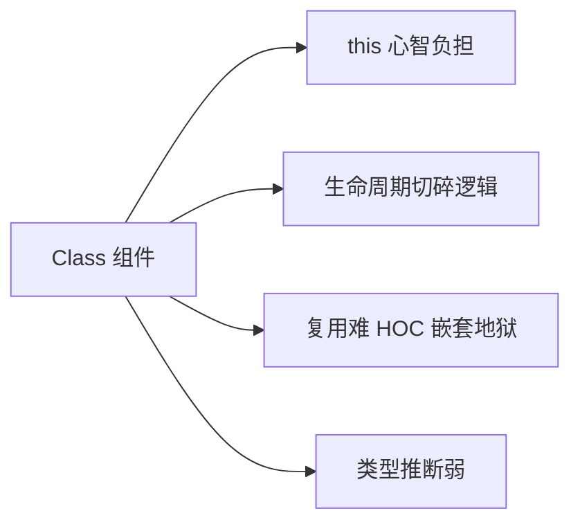
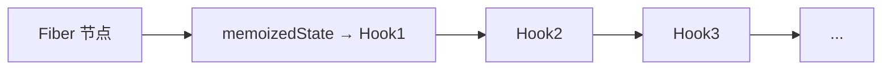
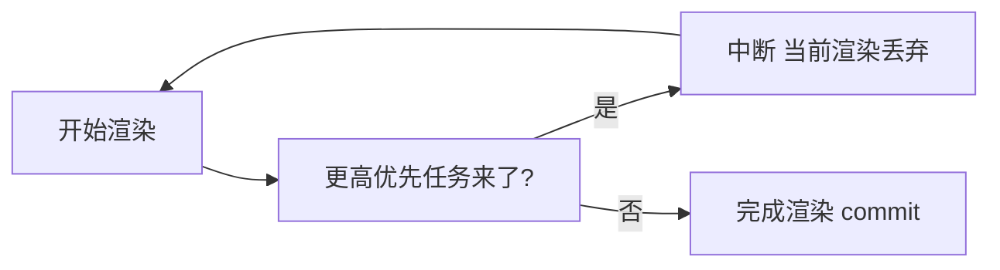
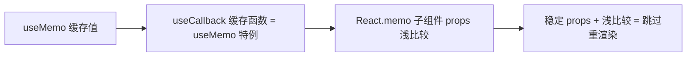

# Hooks 专题

> 本文档位于 `知识库/前端/02框架与库/01React/`，是 Hooks 的深化专题。配套的概览章节见《核心知识点详解.md》第五章、《常见面试题与最佳实践.md》第三章。
>
> 本文从设计动机、Fiber 实现、useState/useEffect/useRef 深度、性能三剑客、并发模式到陷阱与手写 Hook 逐层展开。读完应能解释清楚"为什么 Hooks 不能放条件里""闭包陷阱的本质""useEffect 与 useLayoutEffect 的渲染时机差异"，并能在工程中主动设计可复用的自定义 Hook。

---

## 一、Hooks 的来龙去脉

### 1.1 Class 组件的痛点



<!-- -->

- **`this` 心智**：bind、箭头函数、构造函数——开发者大量精力耗在处理 `this`。
- **生命周期切碎逻辑**：订阅逻辑被拆到 `componentDidMount` / `componentWillUnmount`，分散难追踪。
- **复用难**：HOC / render props 嵌套地狱，调试栈深、命名冲突。
- **类型推断弱**：`this.props`、`this.state` 的类型系统支持差。

### 1.2 设计目标

- **按功能聚合**而非按生命周期——相关逻辑放一起。
- **函数式**——无 `this`、无实例。
- **类型友好**——TS 推断更好。
- **复用直观**——自定义 Hook 比高阶组件清晰。

### 1.3 不向下兼容的代价

Hooks 与 Class 心智模型差异大，老项目迁移成本高。React 团队选择"新项目用 Hooks、老项目按需迁移"的折中策略——Hooks 不强制替换 Class，但官方全力推 Hooks。

---

## 二、Hooks 的实现原理（核心深化）

### 2.1 Fiber 节点与 Hook 链表

每个组件对应一个 Fiber 节点，节点的 `memoizedState` 字段保存该组件的 Hook 链表：



<!-- -->

每个 Hook 是链表的一个节点，包含：

- `memoizedState`：当前 Hook 的状态值（state、effect 数据等）。
- `next`：指向下一个 Hook。
- `queue`：update 队列（useState 专有）。
- 依赖、清理函数等（useEffect 专有）。

### 2.2 调用顺序是 Hook 的"身份证"

React 靠**调用顺序**而非名字建立 Hook 与 Fiber 节点的对应：

```js
function Cmp() {
  const [a] = useState(0);  // 第 1 个 → 链表节点 1
  const [b] = useState(0);  // 第 2 个 → 链表节点 2
  useEffect(() => {}, []);  // 第 3 个 → 链表节点 3
}
```

每次渲染按相同顺序调用，React 才知道"第 N 个 Hook 对应哪个链表节点"。

### 2.3 为什么不能在条件/循环里调用

```js
function Cmp({ cond }) {
  if (cond) useState(0);  // 错！cond 变化时调用顺序变了
  useState(0);
}
```

如果 `cond` 第一次为 true、第二次为 false：

- 第一次：useState1 → useState2 → useState3
- 第二次：useState1 → useState3（跳过了 useState2）

链表错位：useState3 这次拿到的链表节点是 useState2 的，状态对应错乱。

**ESLint 的 `react-hooks/rules-of-hooks` 强制检查，必装。**

### 2.4 mount 与 update 两条路径

React 内部 Hook 调度分两条路径：

- **mount**（首次渲染）：创建 Hook 节点、追加到链表、初始化值。
- **update**（重渲染）：按顺序取出已存在 Hook 节点、应用 update 队列、返回新值。

```js
// 伪代码
function useState(initial) {
  const hook = mountOrUpdate === "mount"
    ? mountHook(initial)
    : updateHook();
  return [hook.memoizedState, dispatchSetState.bind(null, hook)];
}
```

### 2.5 状态保存在哪

**状态不在 Hook 函数里，而在 Fiber 节点的 memoizedState 链表上**。

Hook 函数本身是无状态的——它只是"读链表、写链表"的接口。这就是为什么同一个 useState 函数能给多个组件用、同一组件多次渲染能记住上次值——状态依附于 Fiber 节点。

---

## 三、useState 深度

### 3.1 惰性初值

```js
const [data] = useState(initial);           // initial 每次都算
const [data] = useState(() => expensive());  // 仅首次算
```

初值若计算昂贵，传函数（惰性初始化），仅首次渲染调用一次。

### 3.2 函数式更新

```js
setCount(count + 1);         // 坏：闭包旧值
setCount(prev => prev + 1);   // 好：基于最新值
```

依赖前一次状态时必须用函数式更新。原理：dispatch 时把 update 推入 hook 的 queue，渲染时 reducer 依次应用所有 update，函数式更新接收的是 reducer 应用过程中的最新中间值。

### 3.3 批处理与并发渲染

```js
const click = () => {
  setCount(count + 1);
  setCount(prev => prev + 1);
  setOther(o => o + 1);
};
```

React 18 起所有事件（含 setTimeout/Promise 回调）都自动批处理——多次 setState 合并为一次重渲染。

并发模式下，渲染过程可被中断：



<!-- -->

useState 的渲染结果可能被丢弃后重新计算——这是 reducer 必须纯函数的另一原因。

### 3.4 setState 后的渲染时机

```js
const click = () => {
  setCount(1);
  console.log(count);  // 旧值
  document.querySelector("#x");  // 旧 DOM
};
```

setState 不立即更新，渲染推迟到当前调用栈清空后（批处理）。要在渲染后读 DOM，用 `useLayoutEffect`（同步）或 `useEffect`（异步）。

### 3.5 函数式更新陷阱：依赖未声明

```js
const [count, setCount] = useState(0);
const inc = useCallback(() => setCount(c => c + 1), []);
// 函数式更新不依赖 count，依赖数组空 OK
```

函数式更新让 useCallback 不必把 state 加进依赖——这是 useCallback 与 useState 配合的常见优化模式。

---

## 四、useEffect 深度

### 4.1 三阶段执行时机


<!-- -->

- **Render**：纯函数算新 UI。
- **Commit**：同步应用 DOM 变更。
- **useLayoutEffect**：同步执行，DOM 更新后、绘制前。会阻塞绘制。
- **Paint**：浏览器实际绘制。
- **useEffect**：异步执行，绘制后。不阻塞 UI。

### 4.2 清理函数的执行顺序

```js
useEffect(() => {
  console.log("effect A");
  return () => console.log("cleanup A");
}, [x]);
```

清理时机：

- 组件卸载时。
- 依赖变化重新执行 effect 前。

```
mount: effect A
x 变:  cleanup A → effect A（新）
unmount: cleanup A
```

**清理在重渲染 commit 后、新 effect 执行前调用**——保证旧 effect 的副作用先清理再跑新的。

### 4.3 依赖比较（Object.is）

```js
useEffect(() => {}, [obj]);  // obj 每次新引用 → 每次都执行
```

依赖比较用 `Object.is`，对象/数组/函数每次新引用都不等。把依赖展开成原始值，或用 useMemo 稳定引用。

### 4.4 闭包陷阱的本质

```js
useEffect(() => {
  const id = setInterval(() => console.log(count), 1000);
  return () => clearInterval(id);
}, []);  // count 永远是 mount 时的 0
```

**本质**：effect 函数是闭包，捕获了**渲染时的 state 快照**。依赖空数组 → effect 只在 mount 执行一次 → 闭包捕获的 count 永远是 mount 时的 0。

修复三种方式：

1. **补全依赖** `[count]`：每次 count 变重新注册定时器。
2. **函数式更新**：`setCount(c => c + 1)`，不读 count。
3. **useRef 存最新值**：

```js
const latest = useRef(count);
useEffect(() => { latest.current = count; });  // 每次更新最新值
useEffect(() => {
  const id = setInterval(() => console.log(latest.current), 1000);
  return () => clearInterval(id);
}, []);
```

### 4.5 useEffect vs useLayoutEffect 选型

| 维度 | useEffect | useLayoutEffect |
|---|---|---|
| 执行时机 | 绘制后异步 | DOM 更新后同步绘制前 |
| 阻塞 | 否 | 是 |
| 闪烁 | 可能（先绘制旧态再改） | 无 |
| 用途 | 网络/订阅/日志 | 读布局后改 DOM |

经典用例：tooltip 计算位置要先读 DOM 尺寸再定位，用 useLayoutEffect 避免"先出现在错误位置再跳"的闪烁。

### 4.6 effect 内 async 函数

```js
// 坏：effect 不能直接返回 Promise
useEffect(async () => {
  const data = await fetch();
}, []);

// 好：包一层，清理时取消
useEffect(() => {
  let cancelled = false;
  (async () => {
    const data = await fetch();
    if (!cancelled) setData(data);
  })();
  return () => { cancelled = true; };
}, []);
```

或用 AbortController：

```js
useEffect(() => {
  const ctrl = new AbortController();
  fetch(url, { signal: ctrl.signal }).then(...).catch(e => {
    if (e.name !== "AbortError") setError(e);
  });
  return () => ctrl.abort();
}, [url]);
```

---

## 五、useRef 深度

### 5.1 与 state 的本质区别

```js
const [count, setCount] = useState(0);   // 改 → 重渲染
const ref = useRef(0);                    // 改 → 不重渲染
ref.current++; ref.current = 1;           // 直接改，无触发
```

- **state**：触发渲染，UI 同步。
- **ref**：不触发渲染，跨渲染保持值。

ref 是"逃出 React 渲染体系"的逃生口——存不影响 UI 的值。

### 5.2 三大用途

1. **访问 DOM**：`<input ref={ref}>`，`ref.current.focus()`。
2. **存跨渲染但不触发渲染的值**：定时器 id、上一次值、缓存。
3. **绕过闭包陷阱**：保存最新值，effect 内读 `ref.current`。

### 5.3 保存最新值模式

```js
function useLatest(value) {
  const ref = useRef(value);
  ref.current = value;  // 每次渲染更新（无依赖数组，每次渲染都更新）
  return ref;
}

useEffect(() => {
  const id = setInterval(() => console.log(useLatest(count).current), 1000);
  return () => clearInterval(id);
}, []);  // 依赖空，但读到最新 count
```

### 5.4 forwardRef 与 useImperativeHandle

函数组件默认不接收 `ref`，需 `forwardRef` 转发：

```jsx
const Input = forwardRef((props, ref) => {
  const inputRef = useRef();
  useImperativeHandle(ref, () => ({
    focus: () => inputRef.current.focus(),
    clear: () => (inputRef.current.value = ""),
  }));
  return <input ref={inputRef} />;
});
```

`useImperativeHandle` 限制父通过 ref 能调用的方法，避免暴露整个 DOM 节点。

### 5.5 ref 不要在 render 阶段读写

```js
function Cmp() {
  const ref = useRef(0);
  ref.current++;  // 坏：render 是纯函数，不应有副作用
  return <div>{ref.current}</div>;
}
```

render 阶段读写 ref 会让并发渲染下行为不可预测（render 可能被丢弃重跑）。ref 的读写应在事件回调或 effect 里。

---

## 六、性能三剑客：useMemo / useCallback / React.memo

### 6.1 React 默认渲染策略

父组件渲染时，**所有子组件默认都重渲染**，即使 props 没变。这是 React 与 Vue 的根本区别（Vue 靠依赖追踪只渲染用到该数据的组件）。

```jsx
function App() {
  const [n, setN] = useState(0);
  return <Child name="fixed" />;  // n 变化 Child 也重渲染
}
```

### 6.2 三者关系



<!-- -->

- `useMemo(() => value, deps)`：缓存计算结果。
- `useCallback(fn, deps)`：缓存函数，等价 `useMemo(() => fn, deps)`。
- `React.memo(Cmp)`：对 props 浅比较，相等则跳过子组件渲染。

**三者配合才有效**：memo 子组件 + 稳定 props 引用。

### 6.3 完整链路示例

```jsx
const ExpensiveChild = React.memo(function Child({ onClick, data }) {
  return <button onClick={onClick}>{data.value}</button>;
});

function Parent() {
  const [n, setN] = useState(0);
  const [id] = useState(1);

  const data = useMemo(() => ({ id, value: heavyCompute(id) }), [id]);
  const onClick = useCallback(() => doX(id), [id]);

  return (
    <>
      <button onClick={() => setN(n + 1)}>n={n}</button>
      <ExpensiveChild onClick={onClick} data={data} />
      {/* n 变化时 ExpensiveChild 不重渲染（props 引用稳定 + memo） */}
    </>
  );
}
```

### 6.4 何时不该用

```jsx
// 坏：缓存成本高于收益
const value = useMemo(() => a + b, [a, b]);  // a+b 本身很便宜
const onClick = useCallback(() => setCount(c => c + 1), []);  // 子组件没 memo
```

不是越多越好——缓存本身有比较依赖 + 占内存的成本。仅在：

1. 子组件被 `React.memo` 包裹。
2. 计算确实昂贵（大数据 reduce/map）。
3. 函数作为依赖传给 useEffect。

否则直接写函数/对象，让 React 重渲染即可——优化点比这多的地方有的是。

### 6.5 useCallback 的反模式

```jsx
// 坏：依赖没写全
const handler = useCallback(() => {
  console.log(count);  // 闭包旧值
}, []);  // count 没写

// 好：用 useEvent 模式 或 函数式更新
const handler = useCallback(() => {
  setCount(c => c + 1);  // 不读 count
}, []);
```

useCallback 也是闭包，依赖没写全同样会闭包陷阱。

---

## 七、useContext 深度

### 7.1 Context 查找机制

```jsx
const ThemeCtx = createContext("light");
<ThemeCtx.Provider value="dark"><Deep /></ThemeCtx.Provider>;
```

`useContext` 向上查找最近的 Provider，找不到用默认值。Provider 嵌套时，最近的胜出。

### 7.2 值变化让所有消费者重渲染

```jsx
<ThemeCtx.Provider value={{ theme, user }}>  // 每次新对象
  <Deep />
</ThemeCtx.Provider>
```

Context 值变化会让**所有 useContext 消费者**重渲染——无法精细订阅部分字段。这是 Context 的根本局限。

### 7.3 精细订阅方案

1. **拆分 Context**：theme 和 user 各一个 Context。

```jsx
<ThemeCtx.Provider value={theme}>
  <UserCtx.Provider value={user}><Deep /></UserCtx.Provider>
</ThemeCtx.Provider>
```

2. **use-context-selector 库**：`useContextSelector(ctx, c => c.theme)`。
3. **改用 Zustand/Redux**：状态库自带 selector 精细订阅。

### 7.4 Context 嵌套地狱

```jsx
<ThemeCtx.Provider>
  <UserCtx.Provider>
    <I18nCtx.Provider>
      <RouterCtx.Provider>
        <App />
      </RouterCtx.Provider>
    </I18nCtx.Provider>
  </UserCtx.Provider>
</ThemeCtx.Provider>
```

多个 Context 嵌套难维护，封装成组合 Provider：

```jsx
function AppProviders({ children }) {
  return (
    <ThemeCtx.Provider value={theme}>
      <UserCtx.Provider value={user}>
        <I18nCtx.Provider value={i18n}>
          {children}
        </I18nCtx.Provider>
      </UserCtx.Provider>
    </ThemeCtx.Provider>
  );
}
```

---

## 八、useReducer 深度

### 8.1 与 useState 的边界

| 场景 | 选 |
|---|---|
| 独立简单状态 | useState |
| 多个状态联动 | useReducer |
| 状态变更逻辑复杂 | useReducer |
| 需要"动作历史"调试 | useReducer |
| 跨组件共享状态 | useReducer + Context |

### 8.2 dispatch 的稳定性

```js
const [state, dispatch] = useReducer(reducer, init);
// dispatch 引用永远稳定，不需要 useCallback
```

dispatch 来自 useReducer 内部，引用稳定不变。这是 useReducer + Context 模式能省 useCallback 的原因。

### 8.3 useReducer + Context 实现迷你 Redux

```jsx
const StoreCtx = createContext();

function Provider({ children }) {
  const [state, dispatch] = useReducer(reducer, init);
  return <StoreCtx.Provider value={{ state, dispatch }}>{children}</StoreCtx.Provider>;
}

function useStore() {
  return useContext(StoreCtx);
}

// 组件
const { state, dispatch } = useStore();
dispatch({ type: "inc" });
```

dispatch 稳定所以不需要 useCallback 包裹——这是 React 官方推荐的"小型应用代替 Redux"方案。但**值变化会让所有消费者重渲染**，复杂场景仍要状态库。

---

## 九、自定义 Hook 设计

### 9.1 命名约定

- 函数名以 `use` 开头（强制约定）——让 ESLint `rules-of-hooks` 识别为 Hook。
- 文件名通常也以 `use` 开头：`useMouse.js`。

### 9.2 组合规则

自定义 Hook 内可调用任意其他 Hook（useState/useEffect/useRef 等），且遵循相同规则（顶层调用、不能在条件里）。

```js
function useUser(id) {
  const [user, setUser] = useState(null);
  const [loading, setLoading] = useState(true);
  useEffect(() => { fetch(id).then(setUser).finally(() => setLoading(false)); }, [id]);
  return { user, loading };
}
```

### 9.3 副作用隔离

每个自定义 Hook 内部用 useEffect 注册的清理会在组件卸载时统一执行——多个 Hook 互不干扰：

```js
function useMouse() { useEffect(() => {..., return () => /* 清理 */}); }
function useKeyboard() { useEffect(() => {..., return () => /* 清理 */}); }
function App() { useMouse(); useKeyboard(); }
```

App 卸载时两个 Hook 的清理函数都执行，无需手动协调。

### 9.4 DevTools 调试

自定义 Hook 在 React DevTools 里显示为单独分组，便于追踪：

```
App
├─ useMouse
│  ├─ useState (x)
│  └─ useState (y)
└─ useKeyboard
   └─ useEffect
```

这是为什么命名要以 `use` 开头——DevTools 靠此识别并分组。

---

## 十、React 18 并发模式下的 Hooks

### 10.1 useSyncExternalStore（外部 store 订阅）

React 17 前用 `useState + subscribe` 模式订阅外部 store（如 Redux）在并发模式下有"撕裂"（tearing）问题——不同组件读到不一致的快照。18 提供 `useSyncExternalStore` 标准方案：

```js
import { useSyncExternalStore } from "react";

function useStore(store, selector) {
  return useSyncExternalStore(
    store.subscribe,        // 订阅函数
    () => selector(store.getState()),  // 读快照
    () => selector(store.getServerSnapshot())  // SSR 快照
  );
}
```

Zustand/Redux v18+ 内部基于它实现，避免撕裂。

### 10.2 useTransition / useDeferredValue

```jsx
const [isPending, startTransition] = useTransition();
function search(q) {
  startTransition(() => setResults(filter(q)));  // 低优先
  setQuery(q);  // 高优先
}
```

`startTransition` 标记的更新低优先，可被高优先更新（输入）打断。

```jsx
const deferred = useDeferredValue(query);  // query 的滞后版本
<MemoList query={deferred} />;  // 大列表用滞后值，输入立即响应
```

`useDeferredValue` 是 `useTransition` 的值版本——把某个值的更新标为低优先。

### 10.3 自动批处理

React 18 起**所有事件**（含 setTimeout/Promise 回调）都自动批处理。17 前只在 React 事件里批，需要 `unstable_batchedUpdates` 手动包。

### 10.4 StrictMode 双调用

开发模式下 StrictMode 故意双调用 render 与 effect，暴露副作用问题：

- 组件 render 调用两次。
- effect 执行 mount → unmount → mount（开发期）。

**副作用必须可重复执行**——定时器、订阅必须在清理函数正确取消，否则双调用会泄漏。

---

## 十一、常见陷阱与修复

### 11.1 闭包陷阱

见 4.4。修复：补全依赖 / 函数式更新 / useRef 存最新值。

### 11.2 依赖数组遗漏

```js
useEffect(() => {
  document.title = `Hello ${name}`;
}, []);  // name 没写 → 标题永远不变
```

开启 ESLint `exhaustive-deps`，会强制写全依赖。**只在你确实"只跑一次"且不需要最新值时**才空依赖，并加注释说明。

### 11.3 死循环

```js
useEffect(() => {
  setCount(count + 1);  // 改 state → 重渲染 → effect 再跑 → 改 state → ...
}, [count]);
```

修复：函数式更新 + 合理依赖，或改用派生值（useMemo）。

### 11.4 列表 key 用 index

```jsx
{list.map((item, i) => <Item key={i} {...item} />)}
```

增删元素时 diff 误判，状态错位、动画乱跳、性能损耗。用稳定 id。

### 11.5 重复创建函数/对象作为 props

```jsx
<Child onClick={() => doX()} style={{ color: "red" }} />
```

每次渲染新函数/对象，Child 若 memo 则浅比较失败每次都重渲染。用 useCallback / useMemo 稳定引用。

### 11.6 effect 内 setState 触发重渲染循环

```js
useEffect(() => {
  setData(transform(props.data));  // 改 state → 重渲染 → props 变? → effect 再跑
}, [props.data]);
```

派生数据应该用 useMemo 而非 effect + state。effect 改 state 触发重渲染要格外小心依赖是否会"自我递增"。

### 11.7 unmount 后 setState

```js
useEffect(() => {
  fetch().then(setData);  // 卸载后 Promise 完成 → setData 报警告
}, []);
```

修复：用 `cancelled` 标志或 AbortController。

---

## 十二、手写 Hook（精华）

### 12.1 usePrevious

```jsx
function usePrevious(value) {
  const ref = useRef();
  useEffect(() => { ref.current = value; });  // 无依赖，每次渲染后更新
  return ref.current;  // 返回更新前的值
}
```

无依赖数组 = 每次渲染后都执行 = ref 始终是上一次的值。

### 12.2 useDebounce

```jsx
function useDebounce(value, delay) {
  const [debounced, setDebounced] = useState(value);
  useEffect(() => {
    const id = setTimeout(() => setDebounced(value), delay);
    return () => clearTimeout(id);
  }, [value, delay]);
  return debounced;
}
```

每次 value 变 → 清旧定时器 → 设新定时器 → 静默 delay 后才更新。

### 12.3 useThrottle

```jsx
function useThrottle(value, delay) {
  const [throttled, setThrottled] = useState(value);
  const last = useRef(0);
  useEffect(() => {
    const now = Date.now();
    if (now - last.current >= delay) {
      last.current = now;
      setThrottled(value);
    }
  }, [value, delay]);
  return throttled;
}
```

### 12.4 useInterval（闭包陷阱经典解法）

```jsx
function useInterval(cb, delay) {
  const saved = useRef(cb);
  useEffect(() => { saved.current = cb; });  // 每次更新最新回调
  useEffect(() => {
    const id = setInterval(() => saved.current(), delay);
    return () => clearInterval(id);
  }, [delay]);  // 只在 delay 变时重设
}
```

用 ref 保存最新回调，effect 只设一次定时器，避免依赖变化导致频繁重设。

### 12.5 useEvent（解决闭包陷阱的官方 RFC 方案）

```jsx
function useEvent(handler) {
  const handlerRef = useRef(handler);
  useEffect(() => { handlerRef.current = handler; });  // 最新版本
  return useCallback((...args) => handlerRef.current(...args), []);  // 引用稳定
}
```

返回的函数引用永远稳定，但调用时执行最新版本——既避免 useCallback 重渲染，又避免闭包陷阱。这是 React 团队提案的 `useEvent` 思路。

### 12.6 useFetch

```jsx
function useFetch(url) {
  const [data, setData] = useState(null);
  const [loading, setLoading] = useState(true);
  const [error, setError] = useState(null);
  useEffect(() => {
    const ctrl = new AbortController();
    setLoading(true);
    fetch(url, { signal: ctrl.signal })
      .then(r => r.json())
      .then(d => { setData(d); setError(null); })
      .catch(e => { if (e.name !== "AbortError") setError(e); })
      .finally(() => setLoading(false));
    return () => ctrl.abort();  // 卸载或 url 变时取消
  }, [url]);
  return { data, loading, error };
}
```

实际项目用 React Query 替代——它处理了重试、缓存、失效等所有边界。

### 12.7 useLocalStorage

```jsx
function useLocalStorage(key, initial) {
  const [value, setValue] = useState(() => {
    try { return JSON.parse(localStorage.getItem(key)) ?? initial; }
    catch { return initial; }
  });
  useEffect(() => {
    localStorage.setItem(key, JSON.stringify(value));
  }, [key, value]);
  return [value, setValue];
}
```

### 12.8 useMousePosition

```jsx
function useMousePosition() {
  const [pos, setPos] = useState({ x: 0, y: 0 });
  useEffect(() => {
    const move = e => setPos({ x: e.clientX, y: e.clientY });
    window.addEventListener("mousemove", move);
    return () => window.removeEventListener("mousemove", move);
  }, []);
  return pos;
}
```

### 12.9 useMediaQuery

```jsx
function useMediaQuery(query) {
  const [matches, setMatches] = useState(() => window.matchMedia(query).matches);
  useEffect(() => {
    const mql = window.matchMedia(query);
    const handler = e => setMatches(e.matches);
    mql.addEventListener("change", handler);
    return () => mql.removeEventListener("change", handler);
  }, [query]);
  return matches;
}
const isMobile = useMediaQuery("(max-width: 768px)");
```

### 12.10 useToggle

```jsx
function useToggle(initial = false) {
  const [value, setValue] = useState(initial);
  const toggle = useCallback(() => setValue(v => !v), []);
  return [value, toggle];
}
```

---

## 十三、最佳实践 Checklist

### 13.1 规则

- ESLint `react-hooks/rules-of-hooks` 与 `exhaustive-deps` 开启
- 顶层调用，不在条件/循环里
- 只在函数组件或自定义 Hook 里调
- 自定义 Hook 命名 `use` 开头

### 13.2 状态选择

- 独立简单状态用 useState
- 多状态联动用 useReducer
- 不影响 UI 的值用 useRef
- 派生数据用 useMemo 而非 state

### 13.3 副作用

- 异步/订阅/定时器用 useEffect
- 读 DOM 后改 DOM 用 useLayoutEffect
- 清理函数正确取消订阅/定时器/请求
- effect 内 async 包一层 + 取消机制

### 13.4 性能

- memo 子组件 + useCallback/useMemo 稳定 props
- 昂贵计算 useMemo
- 不要过度用（缓存有成本）
- 大列表虚拟滚动
- React 18 useTransition 标记低优先

### 13.5 Context

- 准静态数据用 Context
- 高频变化用状态库
- 多 Context 封装组合 Provider
- 值稳定（避免每渲染新对象）

### 13.6 并发

- effect 必须可重复执行（StrictMode 双调用）
- 外部 store 订阅用 useSyncExternalStore
- 低优先更新用 useTransition
- 大列表过滤用 useDeferredValue

---

## 十四、高频面试要点

1. **为什么 React 引入 Hooks？** Class 痛点：this 心智、生命周期切碎逻辑、复用难（HOC 嵌套）、类型弱。Hooks 按功能聚合、无 this、类型友好、复用靠自定义 Hook。
2. **Hooks 为什么不能在条件/循环里调用？** Hook 靠调用顺序建立与 Fiber 节点链表的对应，条件让顺序错乱，状态对应错节点。ESLint 强制检查。
3. **Hook 的状态保存在哪？** 不在 Hook 函数里，在 Fiber 节点的 `memoizedState` 链表上。Hook 函数只是"读链表、写链表"的接口。
4. **闭包陷阱的本质？** effect 是闭包，捕获渲染时的 state 快照。依赖没写全时，闭包内的 state 永远是过期的。修复：补全依赖 / 函数式更新 / useRef 存最新值。
5. **useEffect vs useLayoutEffect？** useEffect 绘制后异步不阻塞；useLayoutEffect DOM 更新后同步绘制前，会阻塞但避免闪烁。读布局后改 DOM 用 useLayoutEffect。
6. **useEffect 清理函数何时调用？** 组件卸载时、依赖变化重新执行 effect 前。保证旧副作用先清理再跑新的。
7. **useMemo / useCallback / React.memo 三者关系？** useMemo 缓存值，useCallback 缓存函数（是其特例），memo 子组件 props 浅比较。三者配合（稳定 props + memo）才省渲染。
8. **何时不该用 useMemo/useCallback？** 计算不昂贵、子组件没 memo、props 不会触发 memo——缓存本身有比较依赖 + 占内存成本，过度用反而慢。
9. **useRef 与 useState 区别？** useState 改触发渲染（UI 同步）；useRef 改不触发渲染（跨渲染保持值）。ref 是逃出渲染体系的逃生口，存不影响 UI 的值。
10. **Context 为什么不能替代状态库？** 值变化让所有消费者重渲染、无 selector 精细订阅、无中间件/devtools/持久化。适合主题/配置等准静态，业务状态用库。
11. **useReducer 何时优于 useState？** 多状态联动、变更逻辑复杂、需要可预测可测试、需要"动作历史"调试、跨组件共享（配合 Context）。
12. **React 18 useSyncExternalStore 解决什么？** 并发渲染下外部 store 订阅的"撕裂"问题——不同组件可能读到不一致快照。新 API 保证一致性。
13. **useTransition / useDeferredValue 解决什么？** 标记低优先更新，高优先更新（用户输入）能打断低优先（大列表过滤），UI 永不卡顿。
14. **StrictMode 双调用是什么？** 开发模式故意重复调用 render 与 effect，暴露副作用问题。副作用必须可重复执行（清理正确），否则双调用会泄漏。生产构建自动消失。
15. **自定义 Hook 设计原则？** use 开头命名、顶层调用、副作用隔离（每个 Hook 自己的 effect 清理）、可组合（Hook 内可调 Hook）、DevTools 友好。

---

## 十五、一句话总纲

> Hooks 的本质是 **"用调用顺序建立与 Fiber 链表的对应"**：会读 Hooks 原理（Fiber/memoizedState 链表/调用顺序）、会用三大核心（useState 函数式更新、useEffect 清理与闭包陷阱、useRef 逃出渲染体系）、会做性能三剑客（memo + 稳定 props + 不过度优化）、会写自定义 Hook（useLatest/useInterval/useEvent 模式），就过了 React 的核心关。能答出"为什么 Hooks 不能放条件里""闭包陷阱的本质与三种修复""useEffect 与 useLayoutEffect 渲染时机"，就是高级前端对 Hooks 的认知。
