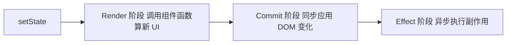

# React 常见面试题与最佳实践

> 配套文档《核心知识点详解.md》见同目录。本文件覆盖 React 高频面试题（含参考答案与易错点）+ 手写题 + 工程最佳实践 Checklist，按"基础概念 / State 与渲染 / Hooks 深入 / 性能优化 / React 18 与生态 / 手写题 / 场景题"七个维度组织。
>
> 答案要点可直接背诵，手写题给出可直接复制的实现。React 面试重头戏在 Hooks 与性能优化两块。

---

## 一、基础概念（10 题）

### 1.1 虚拟 DOM 是什么？解决了什么问题？

UI 描述对象的内存树（普通 JS 对象）。React 比较新旧虚拟树差异，只把最小变化提交到真实 DOM。

解决的问题：

- 跨平台（同一份描述渲染 Web/Native/SSR）。
- 声明式编程（开发者只管描述 UI，不用命令式改 DOM）。
- 批处理更新（多次 setState 合并为一次 DOM 操作）。

代价：内存开销 + diff 计算成本。但比手动操作 DOM 更稳定、更易维护。

### 1.2 diff 算法的三个假设？

把理论 O(n³) 降到 O(n)：

1. **不同类型元素**产出不同树（`<a>` → `<b>` 直接销毁重建）。
2. **同层 sibling** 用 key 匹配（key 相同复用，不同销毁新建）。
3. **同类型元素**保留 DOM 节点，只更新属性。

推论：列表必须有稳定 key；跨层移动节点会被当作销毁+重建。

### 1.3 JSX 与 HTML 的关键区别？

| HTML | JSX |
|---|---|
| class | className |
| for | htmlFor |
| style 字符串 | style 对象 `{{ color: "red" }}` |
| `tabindex` | `tabIndex`（小驼峰） |
| 闭合标签可选 | 必须闭合 |
| 注释 `<!-- -->` | `{/* */}` |
| 布尔属性可省略值 | `disabled={true}` 必须显式 |

JSX 本质是 `React.createElement` 的语法糖，编译后是普通 JS 对象。

### 1.4 元素 vs 组件 vs 实例？

- **元素**：UI 描述对象，不可变，普通 JS 对象 `{ type, props }`。
- **组件**：接收 props 返回元素的函数（或 class）。
- **实例**：class 组件挂载后的对象（函数组件无实例）。

### 1.5 Props 与 State 区别？

| 维度 | Props | State |
|---|---|---|
| 来源 | 父传入 | 组件内部 |
| 可变性 | 只读 | 可通过 setState 改 |
| 改变触发 | 父重渲染传新值 | 调用 setter |
| 子组件能否改 | 不能 | — |

### 1.6 受控 vs 非受控组件？

- **受控**：表单 value 由 state 驱动，onChange 同步更新。实时校验、联动用受控。
- **非受控**：表单 value 由 DOM 自己管，ref 读取。一次性提交用非受控。

```jsx
// 受控
<input value={text} onChange={e => setText(e.target.value)} />
// 非受控
const ref = useRef();
<input ref={ref} defaultValue="" />
```

### 1.7 为什么 props 是只读的？

破坏单向数据流会让数据流难以追踪、调试困难。子组件想改父状态，要通过回调（`onChange` 等）通知父，父改完再传新 props 下来。这是"数据向下、事件向上"模型。

### 1.8 组件组合优于继承？

React 不推荐用继承复用逻辑：

- 继承的耦合度高，父变化全影响子。
- 组合（`children` + props 传组件）更灵活，按需装配。

逻辑复用首选自定义 Hook，UI 复用首选组合。

### 1.9 createElement 与 cloneElement 区别？

- `createElement(type, props, ...children)`：创建元素。
- `cloneElement(element, props, ...children)`：克隆已有元素并合并新 props。

cloneElement 常用于 HOC 给子元素注入 props，但现代函数组件 + Hooks 时代已少用。

### 1.10 React 严格模式 StrictMode 干什么？

开发模式下故意重复调用一些方法，暴露副作用问题：

- 组件 render 调用两次。
- effect 执行 mount → unmount → mount（开发期双重调用）。
- 检查过时 API 用法。

**只在开发构建生效**，生产构建自动消失，不影响性能。

---

## 二、State 与渲染（10 题）

### 2.1 setState 是同步还是异步？

**调用本身是同步的**，但 React 把渲染推迟到当前调用栈清空后（批处理），所以表现为"异步"。

```jsx
const click = () => {
  setCount(count + 1);
  console.log(count);  // 旧值（还没重渲染）
};
```

React 18 起所有事件（含 setTimeout/Promise 回调）都自动批处理。

### 2.2 多次 setState 如何合并？

```jsx
const click = () => {
  setCount(count + 1);  // 基于闭包旧值
  setCount(count + 1);  // 仍是旧值，覆盖成 1
};
// count: 0 → 1（不是 2）
```

修复用函数式更新：

```jsx
setCount(prev => prev + 1);
setCount(prev => prev + 1);  // 0 → 2
```

### 2.3 为什么不能直接改 state 对象？

React 用 `Object.is` 比较新旧 state，引用不变就不重渲染：

```jsx
user.name = "new";  // 改原对象
setUser(user);      // 引用没变，不渲染

setUser({ ...user, name: "new" });  // 新对象，渲染
```

### 2.4 闭包陷阱是什么？怎么解决？

useEffect 依赖没写全，effect 内闭包捕获了旧 state：

```jsx
useEffect(() => {
  const id = setInterval(() => console.log(count), 1000);
  return () => clearInterval(id);
}, []);  // count 永远是 mount 时的 0
```

修复：

1. 补全依赖 `[count]`，每次重新设置定时器。
2. 用函数式更新 `setCount(c => c + 1)`。
3. 用 useRef 存最新值，effect 内读 `ref.current`。

### 2.5 函数式更新什么时候必须用？

依赖前一次状态时：

```jsx
setCount(count + 1);        // 错：闭包旧值
setCount(prev => prev + 1); // 对：基于最新值
```

### 2.6 render 阶段 vs commit 阶段？



<!-- -->

- Render：纯函数，可被打断（并发模式）。
- Commit：同步，不可打断，DOM 真正变化在这里。
- Effect：DOM 更新后异步执行 useEffect。

### 2.7 为什么 useEffect 不能放同步代码？

useEffect 在 commit 后异步执行，不阻塞浏览器绘制。如果副作用（如读 DOM 改样式）必须在绘制前完成，用 `useLayoutEffect`。

### 2.8 useState 初值只生效一次？

```jsx
function Cmp({ initial }) {
  const [n] = useState(initial);  // 只首次渲染用 initial
  // 后续 initial 变了，n 不会变（state 是组件自己的）
}
```

想"props 变就重置 state"，用 key 重置整个组件：

```jsx
<Cmp key={initial} initial={initial} />
```

### 2.9 派生数据应该用 state 还是 useMemo？

派生数据（从已有 state 计算出来的）用 `useMemo`，不要复制成 state：

```jsx
// 坏：派生数据存成 state，要同步两处
const [total, setTotal] = useState(0);
useEffect(() => setTotal(price * qty), [price, qty]);

// 好：直接派生
const total = useMemo(() => price * qty, [price, qty]);
```

### 2.10 setState 后立刻读 DOM 是旧值？

setState 是异步的，调用后 DOM 还没更新。要在更新后读 DOM，用 `useLayoutEffect`（同步）或 `useEffect`（异步）。

---

## 三、Hooks 深入（10 题）

### 3.1 为什么 React 引入 Hooks？

Class 组件的痛点：

- 状态逻辑复用难（HOC 嵌套地狱、render props）。
- `this` 心智负担。
- 相关逻辑被生命周期切碎（订阅在 mount、清理在 unmount，分散两处）。

Hooks 把"按生命周期组织"改成"按功能组织"，相关逻辑放一起，复用靠自定义 Hook。

### 3.2 Hooks 为什么不能在条件/循环里调用？

Hooks 靠**调用顺序**建立与 fiber 节点的对应关系。每次渲染按相同顺序调用，React 才能知道第 N 个 Hook 对应哪个 fiber slot。条件会让顺序变化，对应错乱。

```jsx
if (cond) useState();  // 错：cond 变化时顺序变了
```

### 3.3 useEffect 依赖数组三种形态？

| 写法 | 执行时机 |
|---|---|
| `[]` | mount 时一次 |
| `[a, b]` | mount + a/b 变化时 |
| 不传 | 每次渲染后 |

清理函数在卸载或重新执行前调用。

### 3.4 useEffect 与 useLayoutEffect 区别？

| 维度 | useEffect | useLayoutEffect |
|---|---|---|
| 执行时机 | 浏览器绘制后 | DOM 更新后、绘制前 |
| 阻塞绘制 | 否 | 是 |
| 用途 | 网络/订阅/日志 | 读 DOM 尺寸后再改 DOM |

useLayoutEffect 同步执行，会阻塞浏览器绘制，仅在需要"读布局后立刻改 DOM"时用（如测量元素位置后调整 tooltip）。

### 3.5 useEffect 清理函数何时调用？

- 组件卸载时。
- 依赖变化重新执行 effect 前。

```jsx
useEffect(() => {
  const id = setInterval(...);
  return () => clearInterval(id);  // 卸载或 deps 变时调用
}, [x]);
```

### 3.6 useMemo / useCallback 何时该用？

不是越多越好，缓存本身有成本。仅在：

1. 子组件被 `React.memo` 包裹，props 变化会触发不必要重渲染。
2. 计算确实昂贵（大数据 reduce/map）。
3. 函数作为依赖传给 useEffect。

```jsx
// 仅当 ExpensiveChild 是 memo 包裹时才有意义
const onClick = useCallback(() => doX(id), [id]);
<ExpensiveChild onClick={onClick} />
```

### 3.7 useRef 三大用途？

1. **访问 DOM**：`<input ref={ref}>`，`ref.current.focus()`。
2. **存跨渲染但不触发渲染的值**：定时器 id、上一次值。
3. **绕过闭包陷阱**：保存最新值，effect 内读 `ref.current`。

```jsx
const latest = useRef(count);
useEffect(() => { latest.current = count; });  // 每次更新
useEffect(() => {
  const id = setInterval(() => console.log(latest.current), 1000);
  return () => clearInterval(id);
}, []);  // 依赖空，但读到最新 count
```

### 3.8 useContext 的局限？

- 值变化会让**所有**消费者重渲染，无法精细订阅部分字段。
- Provider 嵌套多了难追踪。
- 高频变化状态会让大量组件频繁渲染。

解法：用状态管理库（Zustand/Redux）做精细订阅，或拆分多个 Context。

### 3.9 useReducer 什么时候用？

状态间有依赖、变更逻辑复杂、需要可预测可测试时：

```jsx
function reducer(state, action) {
  switch (action.type) {
    case "fetch_start": return { ...state, loading: true };
    case "fetch_done":  return { ...state, loading: false, data: action.data };
    default: return state;
  }
}
```

简单独立状态用 useState，复杂联动用 useReducer。

### 3.10 自定义 Hook 规则？

- 函数名以 `use` 开头（强制约定，让 ESLint 识别）。
- 只在顶层调用其他 Hook。
- 返回值可以是 state、函数、对象。

自定义 Hook 是 React 复用有状态逻辑的**首选方案**，比 HOC 和 render props 都直观。

---

## 四、性能优化（8 题）

### 4.1 React 默认渲染策略是什么？

父组件渲染时，**所有子组件默认都重渲染**，即使 props 没变。这与 Vue 的依赖追踪不同（Vue 只渲染用到该数据的组件）。

### 4.2 React.memo 怎么用？

```jsx
const MemoChild = React.memo(Child);
```

对 props 做浅比较，相等则跳过重渲染。配合 `useMemo`/`useCallback` 保证引用稳定才有效。

```jsx
const Parent = () => {
  const [n, setN] = useState(0);
  const onClick = useCallback(() => {}, []);
  return <MemoChild onClick={onClick} />;  // n 变化时 MemoChild 不重渲染
};
```

### 4.3 列表 key 为什么不能用 index？

增删元素时 index 让 diff 误判：

```jsx
// list = [a, b, c] → 删 a → [b, c]
// 用 index：b 复用 a 的位置，c 复用 b 的位置，最后一个被销毁
// 用 id：b 还是 b，c 还是 c，只删了 a
```

状态错位、动画乱跳、性能损耗都源于 index key。

### 4.4 虚拟列表为什么能省渲染？

只渲染可视区 + 缓冲区的元素（~30 个 DOM 节点），滚动时动态替换。1000 条数据渲染只占少量节点。库：`react-window`（轻量）、`react-virtualized`（功能全）。

### 4.5 代码分割怎么做？

```jsx
const Other = React.lazy(() => import("./Other"));
<Suspense fallback={<Spinner />}>
  <Other />
</Suspense>
```

按路由/按需加载，减小首屏 bundle。

### 4.6 何时该用 useMemo / useCallback？

- **该用**：memo 子组件的 props、昂贵计算、effect 依赖。
- **不该用**：简单值、一次性渲染组件、props 不会触发 memo。

过度用反而增加比较与内存成本。

### 4.7 React 18 自动批处理？

18 前只在 React 事件里批处理，setTimeout/Promise 回调里多次 setState 各自触发渲染。18 起所有事件都批处理，无需手动 `unstable_batchedUpdates`。

### 4.8 React 18 Transitions 解决什么？

标记低优先更新，高优先更新（用户输入）能打断低优先（大列表过滤）：

```jsx
startTransition(() => setResults(filter(query)));  // 低优先
setQuery(query);  // 高优先，输入框立即响应
```

让大列表过滤、页面切换不再卡顿输入。

---

## 五、React 18 与生态（6 题）

### 5.1 React 18 主要变化？

- 并发渲染（Concurrent Rendering）默认开启。
- 自动批处理扩展到所有事件。
- Transitions API（`startTransition` / `useTransition`）。
- Suspense 支持数据获取（不只代码分割）。
- 新根 API：`createRoot` 替代 `ReactDOM.render`。

### 5.2 createRoot 与旧 render 区别？

```jsx
// 旧
ReactDOM.render(<App />, document.getElementById("root"));

// 18+
const root = createRoot(document.getElementById("root"));
root.render(<App />);
```

新 API 启用并发特性，旧 API 仍能用但不享受新功能。

### 5.3 Suspense 的两类用途？

1. **代码分割**：`React.lazy` + Suspense fallback。
2. **数据获取**：组件抛 Promise 时显示 fallback，Promise resolve 后继续渲染。需配合数据框架（React Query、Relay 等）使用。

### 5.4 错误边界能捕获什么？

- 渲染期间错误
- 生命周期错误
- 子组件树错误

**不能捕获**：事件回调、setTimeout/Promise、SSR 错误、错误边界自身的错误。

```jsx
class Boundary extends React.Component {
  static getDerivedStateFromError() { return { hasError: true }; }
  componentDidCatch(err, info) { logError(err, info); }
  render() { return this.state.hasError ? <Fallback /> : this.props.children; }
}
```

### 5.5 Portals 的应用场景？

把子节点渲染到 DOM 树其他位置（如 body 末尾的 Modal），但事件仍按组件树冒泡。

```jsx
createPortal(<Modal />, document.body);
```

适合 Modal、Tooltip、Dropdown——避免被父容器 overflow:hidden 裁剪、避免 stacking context 问题。

### 5.6 React Router 核心概念？

- `BrowserRouter`：history 模式路由容器。
- `Routes`/`Route`：声明式路由匹配。
- `Link`/`NavLink`：导航链接。
- `useNavigate`：编程式导航。
- `useParams`/`useSearchParams`：读路由参数。
- 嵌套路由 + 动态参数 + 通配 `*` 兜底。

---

## 六、手写题（6 题）

### 6.1 手写自定义 Hook：useDebounce

```jsx
function useDebounce(value, ms) {
  const [debounced, setDebounced] = useState(value);
  useEffect(() => {
    const id = setTimeout(() => setDebounced(value), ms);
    return () => clearTimeout(id);
  }, [value, ms]);
  return debounced;
}
```

### 6.2 手写自定义 Hook：useInterval（解决闭包陷阱）

```jsx
function useInterval(cb, ms) {
  const saved = useRef(cb);
  useEffect(() => { saved.current = cb; });  // 每次更新最新回调
  useEffect(() => {
    const id = setInterval(() => saved.current(), ms);
    return () => clearInterval(id);
  }, [ms]);  // 只在 ms 变时重设
}
```

经典闭包陷阱解法：用 ref 保存最新回调，effect 只设一次定时器。

### 6.3 手写自定义 Hook：useFetch

```jsx
function useFetch(url) {
  const [data, setData] = useState(null);
  const [loading, setLoading] = useState(true);
  const [error, setError] = useState(null);
  useEffect(() => {
    const ctrl = new AbortController();
    setLoading(true);
    fetch(url, { signal: ctrl.signal })
      .then(r => r.json())
      .then(d => { setData(d); setError(null); })
      .catch(e => { if (e.name !== "AbortError") setError(e); })
      .finally(() => setLoading(false));
    return () => ctrl.abort();  // 组件卸载或 url 变时取消
  }, [url]);
  return { data, loading, error };
}
```

### 6.4 手写 usePrevious

```jsx
function usePrevious(value) {
  const ref = useRef();
  useEffect(() => { ref.current = value; });  // 无依赖，每次渲染后更新
  return ref.current;  // 返回更新前的值
}
```

### 6.5 手写 useLocalStorage

```jsx
function useLocalStorage(key, initial) {
  const [value, setValue] = useState(() => {
    try { return JSON.parse(localStorage.getItem(key)) ?? initial; }
    catch { return initial; }
  });
  useEffect(() => {
    localStorage.setItem(key, JSON.stringify(value));
  }, [key, value]);
  return [value, setValue];
}
```

### 6.6 手写简化版 React.memo

```jsx
function shallowEqual(a, b) {
  if (a === b) return true;
  if (typeof a !== "object" || typeof b !== "object" || !a || !b) return false;
  const ka = Object.keys(a), kb = Object.keys(b);
  if (ka.length !== kb.length) return false;
  return ka.every(k => Object.is(a[k], b[k]));
}
function memo(Cmp) {
  return function Memoized(props) {
    const prev = useRef(props);
    const ref = useRef(null);
    if (!ref.current || !shallowEqual(prev.current, props)) {
      prev.current = props;
      ref.current = <Cmp {...props} />;
    }
    return ref.current;
  };
}
```

---

## 七、场景题（5 题）

### 7.1 父子组件双向联动怎么实现？

父传 props + 回调，子通过回调通知父：

```jsx
function Parent() {
  const [value, setValue] = useState("");
  return <Child value={value} onChange={setValue} />;
}
function Child({ value, onChange }) {
  return <input value={value} onChange={e => onChange(e.target.value)} />;
}
```

复杂双向用 `forwardRef + useImperativeHandle` 暴露方法给父。

### 7.2 跨层组件通信怎么做？

按复杂度递进：

1. 父子：props + 回调。
2. 兄弟：state 提升到共同父。
3. 三层以内：Context。
4. 高频变化/全局：状态管理库（Zustand）。
5. 兄弟组件直接通信：事件总线（自定义 EventEmitter），不推荐。

### 7.3 表单状态太多怎么办？

- 简单：多个 useState。
- 字段联动：useReducer。
- 复杂表单：`react-hook-form` / `formik`，受控/非受控混合，性能与校验都好。

### 7.4 大列表性能差怎么优化？

1. 用虚拟列表 `react-window`。
2. 列表项用 `React.memo` + 稳定 props。
3. 用稳定 id 作为 key。
4. 分页加载 / 无限滚动减少数据量。
5. 项内重计算用 useMemo。

### 7.5 路由切换保留状态怎么做？

React Router v6 默认切走就卸载组件，状态丢失。方案：

1. 把状态提到路由外（如 Zustand）。
2. 用 `useLocation` 的 key 之外的稳定标识缓存（如 `keepalive` 库）。
3. 用 `flushSync` 配合手动控制（复杂）。

---

## 八、生产环境最佳实践 Checklist

### 8.1 组件设计

- 单一职责
- props 类型用 TS
- 受控/非受控分类清晰
- 组件组合优于继承

### 8.2 Hooks

- 依赖数组写全（开 ESLint exhaustive-deps）
- effect 清理副作用
- 自定义 Hook 复用逻辑
- 不在循环/条件调 Hook
- 复杂联动用 useReducer

### 8.3 状态

- state 提升到共同最近父
- 派生数据用 useMemo 不存 state
- 跨层共享用 Context 或状态库
- 不可变更新

### 8.4 性能

- 列表稳定 key
- 大列表虚拟滚动
- memo 子组件 + 稳定 props
- 路由级 lazy 分割
- React 18 并发特性启用

### 8.5 工程

- 函数组件 + Hooks
- StrictMode 开发期开启
- 错误边界包裹关键子树
- React Developer Tools 调试

---

## 九、一句话总纲

> React 面试的三个层次：**第一层问"是什么"**（虚拟 DOM、JSX、Props/State、Hooks 用法），**第二层问"为什么"**（diff 假设、setState 异步批处理、Hooks 顺序、闭包陷阱），**第三层问"怎么优化"**（memo/useMemo/key/虚拟列表/并发模式）。能讲清"为什么 Hooks 不能放条件里""为什么 key 不能用 index""useEffect 闭包陷阱怎么解"，就是高级前端对 React 的认知。
