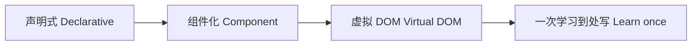
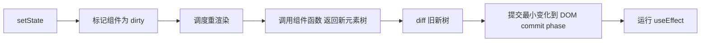

# React 核心知识点详解

> 本文档位于 `知识库/前端/02框架与库/01React/`，系统梳理 React 从设计哲学、JSX、组件、Hooks、性能优化到并发渲染的核心内容，配合 Mermaid 图与代码示例辅助理解。配套的《常见面试题与最佳实践.md》见同目录。
>
> 适合已掌握 JavaScript 基础、希望系统建立 React 工程化与面试视角的同学。所有代码基于 React 18+ 函数组件 + Hooks 范式，class 组件仅做历史对照。

---

## 一、React 的设计哲学

### 1.1 四个核心理念



<!-- -->

- **声明式**：描述"UI 应该长什么样"，不命令"怎么改 DOM"。状态变 → React 算差异 → 更新 DOM。
- **组件化**：UI 拆成独立可复用的小块，组件组合成页面。
- **虚拟 DOM**：内存里维护一份 UI 描述树，diff 后只更新真实 DOM 的最小变化。
- **一次学习到处写**：Web、Native、VR、Electron 桌面（你的项目）共用同一套心智模型。

### 1.2 React 与命令式 DOM 操作的对比

```js
// 命令式：手动改 DOM
let count = 0;
btn.onclick = () => {
  count++;
  document.querySelector("#count").textContent = count;
};

// 声明式：状态变 UI 自动变
function Counter() {
  const [count, setCount] = useState(0);
  return <button onClick={() => setCount(count + 1)}>{count}</button>;
}
```

声明式的核心价值：**状态与 UI 单向绑定**，无需手动同步 DOM，减少 bug 来源。

### 1.3 React 不是 MVC 框架

React 只管 V（视图）。路由、状态管理、网络请求都由生态库补齐：

- 路由：React Router
- 状态：Zustand / Redux / Context
- 数据：React Query / SWR
- 构建：Vite / Next.js

这种"小而专注 + 生态自由组合"是 React 与 Vue/Angular 全家桶路线的根本区别。

---

## 二、JSX

### 2.1 JSX 是什么

JSX = JavaScript XML，在 JS 里写类 HTML 语法，编译后变成 `React.createElement` 调用。

```jsx
const el = <h1 className="title">Hello</h1>;
// 编译后
const el = React.createElement("h1", { className: "title" }, "Hello");
```

最终生成一个普通 JS 对象（虚拟节点）：

```js
{ type: "h1", props: { className: "title", children: "Hello" } }
```

### 2.2 JSX 与 HTML 的关键差异

| HTML | JSX |
|---|---|
| `class` | `className` |
| `for` | `htmlFor` |
| `style="color:red"` | `style={{ color: "red" }}`（对象） |
| 任意属性 | 小驼峰 `tabIndex`、`aria-label` |
| 注释 `<!-- -->` | `{/* 注释 */}` |
| 闭合标签可选 | 必须闭合 `` |
| `true` 修件属性可省略值 | 必须显式 `disabled={true}` |

### 2.3 表达式插值

```jsx
const user = { name: "Alice", age: 20 };
const el = (
  <div>
    <h1>{user.name}</h1>
    <p>{user.age > 18 ? "成年" : "未成年"}</p>
    <ul>{[1, 2, 3].map(n => <li key={n}>{n}</li>)}</ul>
  </div>
);
```

`{}` 内放任意 JS 表达式，但**不能放语句**（if/for/switch）。条件用三元或 `&&`，循环用 `map`。

### 2.4 防止 XSS

JSX 默认转义插值内容：

```jsx
const html = "<script>alert(1)</script>";
<div>{html}</div>;  // 显示为纯文本，不执行
<div dangerouslySetInnerHTML={{ __html: html }} />;  // 显式信任，慎用
```

---

## 三、元素、组件与 Props

### 3.1 元素 vs 组件

- **元素 Element**：UI 的不可变描述对象，普通 JS 对象。
- **组件 Component**：接收 props 返回元素的函数（或 class）。

```jsx
const element = <h1>Hi</h1>;  // 元素
function Greeting({ name }) {  // 组件
  return <h1>Hi {name}</h1>;
}
const el = <Greeting name="Alice" />;  // 用组件创建元素
```

### 3.2 Props 是只读的

Props 是父传子的输入，**子组件绝不能修改自己的 props**（破坏单向数据流）。

```jsx
function Bad({ count }) {
  count++;  // 错误！props 只读
}
function Good({ initial }) {
  const [count, setCount] = useState(initial);  // 把 props 当初值拷到 state
  return <button onClick={() => setCount(count + 1)}>{count}</button>;
}
```

### 3.3 组件组合 vs 继承

React 推荐**组合**而非继承：

```jsx
function Dialog({ children }) {
  return <div className="dialog">{children}</div>;
}
function WelcomeDialog() {
  return <Dialog><h1>欢迎</h1></Dialog>;
}
```

`children` 是特殊 prop，自动接收组件标签内的内容。

### 3.4 受控 vs 非受控

- **受控**：表单值由 React state 驱动（`value` + `onChange`）。
- **非受控**：表单值由 DOM 自己管，React 用 `ref` 读取。

```jsx
// 受控
<input value={text} onChange={e => setText(e.target.value)} />

// 非受控
const ref = useRef();
<input ref={ref} defaultValue="hello" />
<button onClick={() => console.log(ref.current.value)}>读取</button>
```

实践：简单一次性提交用非受控，需要实时校验/联动用受控。

---

## 四、State 与渲染

### 4.1 useState

```jsx
const [count, setCount] = useState(0);
```

- `useState(初值)` 返回 `[当前值, 设置函数]`。
- 调用 `setCount` 触发重渲染。
- 初值只在首次渲染生效，后续忽略。

### 4.2 setState 是异步的（批处理）

```jsx
function Bad() {
  const [n, setN] = useState(0);
  const click = () => {
    setN(n + 1);
    setN(n + 1);  // 这里 n 还是旧值，两次都设成 1
    console.log(n);  // 0（还没重渲染）
  };
}

function Good() {
  const [n, setN] = useState(0);
  const click = () => {
    setN(prev => prev + 1);  // 函数式更新，基于最新值
    setN(prev => prev + 1);  // 累加到 2
  };
}
```

**React 18 起，所有事件（含 setTimeout/Promise）都自动批处理**，多次 setState 合并为一次重渲染。

### 4.3 函数式更新的边界

依赖前一次状态时必须用函数式更新：

```jsx
setCount(prev => prev + 1);  // 对
setCount(count + 1);          // 错（闭包陷阱，count 是闭包捕获的旧值）
```

### 4.4 不可变更新

React 靠 `Object.is` 判断 state 是否变。直接改对象/数组不会触发更新：

```jsx
const [list, setList] = useState([1, 2]);

// 坏：直接改原数组
list.push(3); setList(list);  // 引用没变，不重渲染

// 好：创建新数组
setList([...list, 3]);

// 对象
setUser({ ...user, name: "new" });
// 嵌套对象用 immer / structuredClone
```

### 4.5 渲染流程



<!-- -->

- **Render 阶段**：纯函数计算新 UI，可被打断（并发模式）。
- **Commit 阶段**：同步应用 DOM 变化，不可打断。
- **Effect 阶段**：DOM 更新后异步执行副作用。

---

## 五、Hooks（核心中的核心）

### 5.1 为什么有 Hooks

Class 组件的问题：

- 状态逻辑复用难（HOC / render props 嵌套地狱）。
- `this` 心智负担。
- 生命周期切碎相关逻辑（mount 监听 / unmount 清理分两处）。

Hooks 把"按生命周期组织"改成"按功能组织"，相关逻辑放一起。

### 5.2 useState 详解

```jsx
const [state, setState] = useState(initial);

// 惰性初始化（初值计算昂贵时）
const [data] = useState(() => expensiveCompute());

// 函数式更新
setState(prev => ({ ...prev, count: prev.count + 1 }));
```

### 5.3 useEffect 详解

处理副作用：订阅、定时器、网络请求、DOM 操作。

```jsx
useEffect(() => {
  const id = setInterval(() => setCount(c => c + 1), 1000);
  return () => clearInterval(id);  // 清理函数
}, [count]);  // 依赖数组
```

依赖数组的三种形态：

| 写法 | 执行时机 |
|---|---|
| `[]` | 仅 mount 时 |
| `[a, b]` | mount + a/b 变化时 |
| 不传 | 每次渲染后 |

**清理函数**：组件卸载或依赖变化重新执行前调用，用于取消订阅/定时器/请求。

### 5.4 useEffect 的常见陷阱

```jsx
// 1. 闭包陷阱：依赖没写全
useEffect(() => {
  const id = setInterval(() => console.log(count), 1000);
  return () => clearInterval(id);
}, []);  // count 永远是 mount 时的 0
// 修复：把 count 加进依赖，或用函数式 setCount
```

```jsx
// 2. 死循环
useEffect(() => {
  setData(...);  // 改 state 触发重渲染 → 再次执行 effect → 改 state...
}, [data]);
```

**ESLint 的 `exhaustive-deps` 规则能帮你看全依赖**，强烈建议开启。

### 5.5 useRef

```jsx
const ref = useRef(0);
ref.current;     // 读写都不触发重渲染
ref.current = 1;  // 直接改
```

用途：

- 访问 DOM（`<div ref={ref}>`）。
- 存"跨渲染但不触发渲染"的值（定时器 id、上次值）。
- 保存最新值绕过闭包陷阱。

```jsx
function useInterval(cb, ms) {
  const saved = useRef(cb);
  useEffect(() => { saved.current = cb; });  // 每次更新最新回调
  useEffect(() => {
    const id = setInterval(() => saved.current(), ms);
    return () => clearInterval(id);
  }, [ms]);
}
```

### 5.6 useMemo / useCallback

```jsx
const value = useMemo(() => expensiveCompute(a, b), [a, b]);
const cb = useCallback(() => doSomething(id), [id]);
```

- `useMemo` 缓存值，依赖不变时复用上次结果。
- `useCallback` 缓存函数（等价 `useMemo(() => fn, deps)`）。

**不是越多越好**：缓存本身有成本（比较依赖 + 占内存）。仅在以下场景用：

- 子组件被 `React.memo` 包裹，props 变化会触发不必要重渲染。
- 计算确实昂贵（大数据 map/reduce）。
- 函数作为依赖传给 useEffect。

### 5.7 useContext

跨层传递数据，避免逐层 props 钻取：

```jsx
const ThemeCtx = createContext("light");

function App() {
  return <ThemeCtx.Provider value="dark"><Page /></ThemeCtx.Provider>;
}
function Page() {
  const theme = useContext(ThemeCtx);
  return <div className={theme}>...</div>;
}
```

**坑**：Context 值变化会让所有 useContext 消费者重渲染。高频变化的状态慎用 Context，改用状态管理库。

### 5.8 useReducer

复杂状态逻辑用 reducer 替代多个 useState：

```jsx
function reducer(state, action) {
  switch (action.type) {
    case "inc": return { ...state, count: state.count + 1 };
    case "set": return { ...state, count: action.value };
    default: return state;
  }
}
const [state, dispatch] = useReducer(reducer, { count: 0 });
dispatch({ type: "inc" });
```

适合：状态间有依赖、状态变更逻辑复杂、需要可预测可测试。

### 5.9 自定义 Hook

把组件间复用的有状态逻辑抽出来，**函数名以 `use` 开头**：

```jsx
function useMouse() {
  const [pos, setPos] = useState({ x: 0, y: 0 });
  useEffect(() => {
    const move = e => setPos({ x: e.clientX, y: e.clientY });
    window.addEventListener("mousemove", move);
    return () => window.removeEventListener("mousemove", move);
  }, []);
  return pos;
}

function App() {
  const { x, y } = useMouse();
  return <div>{x}, {y}</div>;
}
```

自定义 Hook 是 React 复用逻辑的**首选方案**，比 HOC 和 render props 都直观。

### 5.10 Hooks 规则

- 只在**顶层**调用，不能在循环/条件/嵌套函数里。
- 只在**函数组件或自定义 Hook** 里调用，不能在普通函数。

ESLint 插件 `eslint-plugin-react-hooks` 强制检查，必装。

---

## 六、事件处理与 Refs

### 6.1 合成事件

React 把所有事件委托到根节点（17 前是 document），统一为合成事件 `SyntheticEvent`，抹平浏览器差异。

```jsx
function click(e) {
  e.preventDefault();
  e.stopPropagation();
}
```

17+ 起委托改为根容器（`createRoot` 的容器节点），方便多 React 应用并存与微前端。

### 6.2 forwardRef

函数组件默认不能接收 `ref`，用 `forwardRef` 转发：

```jsx
const Input = forwardRef((props, ref) => {
  return <input ref={ref} {...props} />;
});
const ref = useRef();
<Input ref={ref} />;
ref.current.focus();
```

### 6.3 useImperativeHandle

限制父通过 ref 能调用的方法，避免暴露整个 DOM：

```jsx
const Input = forwardRef((props, ref) => {
  const inputRef = useRef();
  useImperativeHandle(ref, () => ({
    focus: () => inputRef.current.focus(),
  }));
  return <input ref={inputRef} />;
});
```

---

## 七、性能优化

### 7.1 React 默认渲染策略

父组件渲染时，所有子组件**默认都重渲染**，即使 props 没变。这与 Vue 的依赖追踪不同（Vue 只重渲染真正用到该数据的组件）。

```jsx
function App() {
  const [count, setCount] = useState(0);
  return (
    <>
      <button onClick={() => setCount(count + 1)}>+1</button>
      <ExpensiveChild name="fixed" />  {/* props 没变也会重渲染 */}
    </>
  );
}
```

### 7.2 React.memo

```jsx
const MemoChild = React.memo(Child);
```

对 props 做浅比较，相等则跳过重渲染。配合 `useMemo`/`useCallback` 保证引用稳定才有效。

### 7.3 列表 key 的作用

```jsx
{list.map(item => <li key={item.id}>{item.name}</li>)}
```

key 是 diff 时识别"哪个元素变了"的身份标识。**不要用数组 index**——增删元素会让 diff 误判，触发不必要 DOM 操作甚至状态错位。

### 7.4 虚拟列表

数据量大时只渲染可视区：

- `react-window`（轻量）
- `react-virtualized`（功能全）

1000 条数据渲染只占 ~30 个 DOM 节点。

### 7.5 代码分割

```jsx
const Other = React.lazy(() => import("./Other"));
<Suspense fallback={<Spinner />}>
  <Other />
</Suspense>
```

按需加载，减小首屏 bundle。

### 7.6 React 18 并发渲染

React 18 引入并发特性：

- **自动批处理**：所有事件中的 setState 自动合并。
- **Transitions**：标记低优先更新，不阻塞高优先输入。

```jsx
import { startTransition } from "react";
function search(q) {
  startTransition(() => {
    setResults(filter(q));  // 大列表过滤，低优先
  });
  setQuery(q);  // 输入框更新，高优先
}
```

- **Suspense for Data Fetching**：声明式加载状态。

```jsx
<Suspense fallback={<Spinner />}>
  <ComponentThatFetches />
</Suspense>
```

---

## 八、错误边界、Portals、Fragments

### 8.1 错误边界

class 组件用 `componentDidCatch` / `getDerivedStateFromError` 捕获子树错误，防止整个应用白屏：

```jsx
class ErrorBoundary extends React.Component {
  state = { hasError: false };
  static getDerivedStateFromError() { return { hasError: true }; }
  componentDidCatch(err, info) { logError(err, info); }
  render() {
    return this.state.hasError ? <h1>出错了</h1> : this.props.children;
  }
}
<ErrorBoundary><App /></ErrorBoundary>
```

函数组件暂无等价 API，错误边界必须用 class。

### 8.2 Portals

把子节点渲染到 DOM 树其他位置（如 body 末尾的 Modal）：

```jsx
createPortal(<Modal />, document.body);
```

视觉上"逃出"父容器，但事件冒泡仍按组件树走（不是 DOM 树）。

### 8.3 Fragments

```jsx
return (
  <>
    <td>A</td>
    <td>B</td>
  </>
);
```

不引入额外 DOM 节点的多元素返回，对表格等结构敏感场景必备。

---

## 九、React Router 简介

```jsx
import { BrowserRouter, Routes, Route, Link, useNavigate } from "react-router-dom";

<BrowserRouter>
  <Routes>
    <Route path="/" element={<Home />} />
    <Route path="/:id" element={<Detail />} />
    <Route path="*" element={<NotFound />} />
  </Routes>
</BrowserRouter>;

// 编程式导航
const nav = useNavigate();
nav("/user/1");
```

核心：声明式路由匹配 + 嵌套路由 + 动态参数 + 编程导航。

---

## 十、React 与 Vue 哲学对比（铺垫下一章）

| 维度 | React | Vue |
|---|---|---|
| 心智模型 | 函数式：UI = f(state) | 响应式：数据变 → 自动追踪依赖 → 更新 |
| 模板 | JSX（JS 的超集） | 模板指令（v-if/v-for） |
| 状态 | 不可变，setState 触发 | 可变，直接改 ref.value |
| 重渲染 | 父渲染子默认重渲染 | 只重渲染用到该数据的组件 |
| 复用 | 自定义 Hook | Composition API / mixin |
| 灵活度 | 高（JSX 是 JS，逻辑任意） | 中（模板受限但更规整） |
| 学习曲线 | 陡（要懂 JS 函数式） | 缓（接近 HTML） |

---

## 十一、最佳实践 Checklist

### 11.1 组件设计

- 单一职责，一个组件做一件事
- props 接口清晰，类型用 TS
- 受控/非受控表单明确分类
- 组件组合优于继承

### 11.2 状态

- state 提升到共同最近父级
- 派生数据用 useMemo 而非 state
- 跨层共享用 Context 或状态库
- 不可变更新（展开运算符 / immer）

### 11.3 Hooks

- 依赖数组写全（开 ESLint exhaustive-deps）
- effect 清理副作用（取消订阅/定时器）
- 自定义 Hook 复用逻辑
- 不在循环/条件里调 Hook

### 11.4 性能

- 列表用稳定 key（id 而非 index）
- 大列表虚拟滚动
- 昂贵计算用 useMemo
- memo 子组件 + 稳定 props
- 路由级代码分割 React.lazy

### 11.5 工程

- 函数组件 + Hooks，新项目不用 class
- StrictMode 开启（暴露副作用问题）
- 错误边界包裹关键子树
- key 稳定，避免用 index

---

## 十二、高频面试要点

1. **虚拟 DOM 是什么？为什么需要？** UI 描述对象的内存树，diff 后只更新真实 DOM 的最小变化。优势：跨平台、声明式、批处理更新；代价：内存开销 + diff 成本。
2. **diff 算法的三个假设？** 同类型元素才比较、同层 sibling 按 key 匹配、列表有 key。基于这三个假设把 O(n³) 降到 O(n)。
3. **setState 是同步还是异步？** 同步代码里表现为异步（批处理），但本质是同步调用，只是渲染被延迟到当前调用栈清空后。React 18 起所有事件都自动批处理。
4. **为什么不能直接改 state？** React 靠 Object.is 判断变化，引用没变就不重渲染。必须返回新对象/数组。
5. **useEffect 与 useLayoutEffect 区别？** useEffect 异步在浏览器绘制后执行，不阻塞 UI；useLayoutEffect 同步在 DOM 更新后、绘制前执行，用于读取布局尺寸后再改 DOM。
6. **Hooks 为什么不能在条件里调用？** Hooks 靠调用顺序建立与 fiber 节点的对应关系，条件会让顺序错乱，状态对应错节点。
7. **key 的作用？** diff 时识别元素身份。用 index 在增删时会让 diff 误判，触发不必要 DOM 操作甚至状态错位。稳定 key 让复用最大化。
8. **React.memo / useMemo / useCallback 三者关系？** memo 包裹子组件做 props 浅比较，useMemo/useCallback 保证传给 memo 子组件的 props 引用稳定，三者配合才省渲染。
9. **Context 的局限？** 值变化会让所有消费者重渲染，且无法精细订阅部分字段。高频变化状态用状态管理库（Zustand 等）。
10. **闭包陷阱是什么？** useEffect 的依赖没写全，effect 内闭包捕获了旧 state，导致读到过期值。修复：补全依赖或用 useRef 存最新值。
11. **React 18 的并发渲染解决了什么？** 让重渲染可中断，高优先更新（输入）能打断低优先更新（大列表过滤），UI 永远不卡顿。
12. **受控与非受控组件区别？** 受控由 state 驱动 value（实时校验），非受控由 DOM 自己管（ref 读取）。简单一次性提交用非受控，联动校验用受控。
13. **错误边界能捕获什么？** 渲染期间、生命周期、子组件树的错误。不能捕获：事件回调、setTimeout、异步代码、SSR 错误。
14. **函数组件能完全替代 class 吗？** 几乎可以，Hooks 覆盖了 state/生命周期/refs。例外：错误边界（必须 class）、`componentDidCatch`。

---

## 十三、一句话总纲

> React 的本质是 **`UI = f(state)`**：声明式地描述 UI，状态变了 React 自动算差异更新 DOM。会写 Hooks（useState/useEffect/自定义 Hook）、会做性能优化（memo/useMemo/key）、会答"为什么 setState 异步""为什么 Hooks 不能放条件里"，就过了 React 的核心关。React 18 的并发渲染是把"重渲染可中断"补上，让 UI 永不卡顿。
