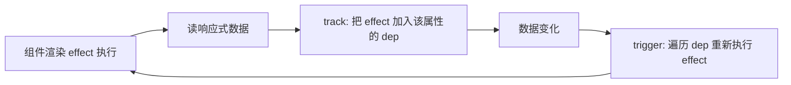

# Vue 常见面试题与最佳实践

> 配套文档《核心知识点详解.md》见同目录。本文件覆盖 Vue 高频面试题（含参考答案与易错点）+ 手写题 + 工程最佳实践 Checklist，按"基础概念 / 响应式原理 / 模板指令 / 组件通信 / Composition API / 性能与内置组件 / 手写题 / 场景题"八个维度组织。
>
> 答案要点可直接背诵，手写题给出可直接复制的实现。Vue 面试重头戏在响应式原理与 Composition API 两块。

---

## 一、基础概念（8 题）

### 1.1 Vue 是什么？为什么称"渐进式"？

Vue 是渐进式 JS 框架，核心只管视图层，按需叠加路由 / 状态 / 构建 / SSR：

```
只用视图层 → + Vue Router → + Pinia → + Vite → Nuxt SSR
```

不像 Angular 全家桶强行整套，学习曲线平缓，可从 CDN 直接 `<script src>` 写起。

### 1.2 Vue 与 React 的根本区别？

| 维度 | Vue | React |
|---|---|---|
| 心智模型 | 数据驱动 + 自动依赖追踪 | 函数式 UI = f(state) |
| 模板 | 模板指令 | JSX |
| 状态 | 可变，直接改 ref.value | 不可变，setState 触发 |
| 重渲染 | 只重渲染依赖该数据的组件 | 父渲染子默认全渲染 |
| 复用 | composable | 自定义 Hook |

一句话：**Vue 是"自动追踪依赖"，React 是"不可变重渲染"**。

### 1.3 SFC（单文件组件）三段式？

```vue
<script setup>...</script>   <!-- 逻辑 -->
<template>...</template>      <!-- 模板 -->
<style scoped>...</style>     <!-- 样式（scoped 加作用域哈希） -->
```

`<script setup>` 是 Vue 3 推荐写法，编译后产物更优、TS 支持更好。

### 1.4 v-html 有什么风险？

直接输出 HTML 字符串，**XSS 风险**：

```html
<div v-html="userInput"></div>  <!-- 用户输入含 <script> 会执行 -->
```

只在信任的内容上用，用户输入必须先转义或用 DOMPurify 过滤。

### 1.5 v-once 与 v-memo？

- `v-once`：元素只渲染一次，之后状态变也不更新。静态内容优化。
- `v-memo="deps"`：依赖不变时跳过更新，类似 React.memo。

```html
<div v-memo="[item.id, selected]">...</div>
```

### 1.6 Vue 是 MVVM 吗？

早期标榜 MVVM（ViewModel 即 Vue 实例），现在文档已淡化。本质仍是单向数据流：数据向下（props），事件向上（emit）。v-model 双向只是 props + emit 的语法糖。

### 1.7 Vue 3 为什么放弃 IE？

Proxy 无法 polyfill，强行支持 IE 会牺牲：
- 响应式无法监听新增属性 / 数组索引。
- 整套机制要降级到 defineProperty，性能与 API 都受限。

Vue 团队选择"为 0.x% 用户付全价"不划算，明确放弃。

### 1.8 scoped 样式原理？

```vue
<style scoped>
.title { color: red; }
</style>
```

编译时给该组件的 DOM 加 `data-v-xxx` 属性，CSS 选择器变成 `.title[data-v-xxx]`，只匹配本组件元素。

子组件根节点也会带父的 scoped 属性（穿透一层），但深层子元素不会。

---

## 二、响应式原理（10 题）

### 2.1 Vue 2 vs Vue 3 响应式实现？

| 维度 | Vue 2 | Vue 3 |
|---|---|---|
| API | Object.defineProperty | Proxy |
| 监听对象 | 已有属性 | 新增/删除 |
| 数组 | 重写 7 方法 | 原生支持索引/length |
| 初始化 | 递归遍历 | 惰性（访问时才代理） |
| Map/Set | 不支持 | 支持 |
| IE | 支持 | 不支持 |

### 2.2 Object.defineProperty 的三大局限？

1. 只劫持已有属性，新增属性不响应（要 `Vue.set`）。
2. 数组索引/length 不响应（重写 push/pop/splice 等方法绕过）。
3. 深度监听需递归遍历，大对象初始化慢。

### 2.3 Proxy 怎么实现响应式？

```js
new Proxy(target, {
  get(t, k, r) { track(t, k); return Reflect.get(t, k, r); },
  set(t, k, v, r) { Reflect.set(t, k, v, r); trigger(t, k); return true; },
  deleteProperty(t, k) { Reflect.deleteProperty(t, k); trigger(t, k); return true; },
});
```

代理整个对象而非单个属性，新增/删除/数组索引全覆盖。

### 2.4 依赖收集与触发更新流程？



<!-- -->

- 每个响应式属性对应一个 `dep`（依赖集合）。
- `effect` 是"用到该数据的副作用"（渲染函数、computed、watch）。
- 读时 track：注册 effect 到 dep。
- 写时 trigger：遍历 dep 重跑所有 effect。

### 2.5 ref vs reactive？

| 维度 | ref | reactive |
|---|---|---|
| 类型 | 任意 | 对象 |
| 访问 | `.value`（模板自动解包） | 直接 |
| 解构 | 解构丢响应 | 解构丢响应 |
| 重新赋值 | 可 `ref.value = newObj` | 不可（要整体替换 reactive） |
| 推荐 | 基础类型 / 整体替换 | 结构稳定的对象 |

口诀：基础类型 / 替换整个对象用 ref，结构稳定的对象用 reactive。

### 2.6 为什么 ref 要 .value？

```js
const count = ref(0);
count.value;  // 必须 .value
```

基础类型无法被 Proxy 代理（只能代理对象），所以 ref 把基础类型包装成 `{ value: x }` 的对象，对 `value` 属性做响应式劫持。模板里自动解包是为了方便。

### 2.7 解构 reactive 为什么丢响应？

```js
const state = reactive({ a: 1, b: 2 });
const { a, b } = state;  // a/b 是普通变量，丢了响应
```

解构后 `a` 是值的拷贝（原始类型），不再与 `state.a` 关联。修复：

```js
const { a, b } = toRefs(state);  // 转成 ref，保持响应
```

### 2.8 reactive 重新赋值整个对象为什么不响应？

```js
const state = reactive({ a: 1 });
state = { a: 2 };  // 错：把变量重新指向新对象，原响应式代理丢了
state = reactive({ a: 2 });  // 也丢（旧引用被覆盖）
```

修复：用 ref 或 `Object.assign`：

```js
const state = ref({ a: 1 });
state.value = { a: 2 };  // ref 可以整体替换

const state = reactive({ a: 1 });
Object.assign(state, { a: 2 });  // 修改原代理对象
```

### 2.9 ref 解包规则？

- 模板里：自动解包，直接 `{{ count }}` 不用 `.value`。
- script 里：必须 `.value` 访问。
- reactive 内的 ref：自动解包，`reactive({ count: ref(0) }).count` 直接是 0。
- 数组 / Map 中的 ref：不自动解包，要 `arr[0].value`。

### 2.10 shallowRef / shallowReactive 用途？

```js
const big = shallowReactive({ list: hugeArray });
big.list.push(x);  // 不触发更新（浅响应，list 内部变化不监听）
big.list = [];      // 触发（顶层属性变化）

const obj = shallowRef({ a: 1 });
obj.value.a = 2;     // 不触发（浅）
obj.value = { a: 2 }; // 触发（替换 .value）
```

大对象 / 大数组用浅响应避免递归代理的性能开销。

---

## 三、模板指令（8 题）

### 3.1 v-if vs v-show？

| 维度 | v-if | v-show |
|---|---|---|
| 实现 | 销毁/重建 DOM | display:none 切换 |
| 初始开销 | 低（false 不渲染） | 高（始终渲染） |
| 切换开销 | 高 | 低 |
| 适用 | 很少切换 | 频繁切换 |
| 配合权限 | 适合（不渲染就不挂载） | 不适合（DOM 仍在） |

### 3.2 v-for 为什么必须有 key？为什么不能用 index？

key 是 diff 时识别元素身份的依据。用 index 在增删时：

```
list: [A, B, C] → 删 A → [B, C]
index key: B 复用 A 的位置、C 复用 B 的位置、最后一个销毁
id key:    A 销毁、B 还是 B、C 还是 C
```

index key 导致状态错位、动画乱跳、性能损耗（多销毁重建）。**唯一稳定 id 是 key**。

### 3.3 v-for 与 v-if 能写同一元素吗？

不行。v-for 优先级高于 v-if，会让每个元素都判断一次 v-if，性能差且语义混乱。用 computed 过滤后再渲染：

```html
<li v-for="item in activeList" :key="item.id">{{ item.name }}</li>
```

```js
const activeList = computed(() => list.value.filter(i => i.active));
```

### 3.4 v-model 原理？组件 v-model？

```html
<input v-model="text" />
<!-- 等价 -->
<input :value="text" @input="text = $event.target.value" />
```

组件 v-model：

```vue
<!-- 父 -->
<MyInput v-model="text" />

<!-- 子 -->
<script setup>
const props = defineProps(["modelValue"]);
const emit = defineEmits(["update:modelValue"]);
</script>
```

Vue 3 支持多 v-model：`v-model:title="t" v-model:content="c"`。

### 3.5 v-model 修饰符？

```html
<input v-model.lazy="text" />     <!-- 失焦才更新 -->
<input v-model.number="age" />    <!-- 自动转 Number -->
<input v-model.trim="name" />    <!-- 去首尾空格 -->
```

组件可自定义修饰符：

```vue
<MyInput v-model.capitalize="text" />
<!-- 子 -->
const props = defineProps({ modelValue: String, modelModifiers: { default: () => ({}) } });
```

### 3.6 事件修饰符有哪些？

```html
<button @click.stop="fn">阻止冒泡</button>
<button @click.prevent="fn">阻止默认</button>
<button @click.once="fn">只触发一次</button>
<form @submit.prevent>阻止提交</form>
<input @keyup.enter="fn">键修饰符</input>
<div @scroll.passive="fn">不阻止滚动（性能）</div>
```

### 3.7 v-bind 表达式？

```html
<div :class="{ active: isActive, error: hasError }"></div>
<div :class="[base, isActive ? 'on' : 'off']"></div>
<div :style="{ color: color, fontSize: size + 'px' }"></div>

```

### 3.8 插值表达式限制？

`{{ }}` 只能放**表达式**，不能放语句：

```html
<span>{{ ok ? "yes" : "no" }}</span>  <!-- 表达式，可以 -->
<span>{{ if (ok) { return "yes" } }}</span>  <!-- 语句，不行 -->
```

复杂逻辑用 computed 或方法。

---

## 四、组件通信（6 题）

### 4.1 Vue 组件通信方式总览？

| 场景 | 方式 |
|---|---|
| 父 → 子 | props |
| 子 → 父 | emit |
| 双向 | v-model |
| 兄弟 | 状态提升 / Pinia |
| 跨层 | provide / inject |
| 全局 | Pinia |
| 父访问子方法 | ref + defineExpose |

### 4.2 props 单向数据流？

子组件不能直接改 props（与 React 同理，避免数据流混乱）。要改父状态，emit 事件通知父，父改完传新 props 下来。

```vue
<!-- 子 -->
<script setup>
const props = defineProps(["count"]);
const emit = defineEmits(["update:count"]);
const inc = () => emit("update:count", props.count + 1);
</script>
```

### 4.3 provide/inject 响应式怎么保证？

```js
// 父
const theme = ref("dark");
provide("theme", theme);  // 直接传 ref，保持响应

// 后代
const theme = inject("theme", "light");  // 拿到 ref，模板自动解包
```

直接传 ref / reactive 对象保持响应式；传普通值会"快照"不响应。

### 4.4 defineExpose 干什么？

`<script setup>` 默认组件实例对外不暴露任何东西（不像 Options API 全暴露）。要给父通过 ref 调用方法/属性，必须 `defineExpose`：

```vue
<script setup>
const count = ref(0);
const inc = () => count.value++;
defineExpose({ count, inc });
</script>
```

### 4.5 跨层通信选 provide 还是状态库？

- provide/inject：应用配置、主题、用户信息等"准静态"数据，3 层以内。
- 状态库（Pinia）：高频变化、多个组件订阅、需要持久化/调试工具。

provide 不适合高频变化——所有 inject 它的地方都重渲染，无精细订阅。

### 4.6 子组件想监听 props 变化怎么做？

```js
watch(() => props.value, (n, o) => { /* ... */ });
```

或用 computed 派生：

```js
const doubled = computed(() => props.value * 2);
```

---

## 五、Composition API（8 题）

### 5.1 为什么 Vue 3 引入 Composition API？

Options API 痛点：

- 相关逻辑被选项切碎（data/methods/computed/mounted 各放一点）。
- 类型推断弱（this 复杂、TS 支持差）。
- 复用靠 mixin，命名冲突 + 来源不清。

Composition API 把相关逻辑聚合到 setup，复用靠 composable（自定义 Hook）。

### 5.2 `<script setup>` 相比 setup 函数？

| 维度 | setup 函数 | script setup |
|---|---|---|
| return | 必须手动 | 自动暴露 |
| 组件导入 | 要注册 | 直接用 |
| props/emits | 选项式 | defineProps/defineEmits |
| 编译产物 | 一般 | 更优 |
| TS | 一般 | 更好 |

`<script setup>` 是编译语法糖，推荐所有新项目用。

### 5.3 computed 缓存机制？

```js
const fullName = computed(() => `${first.value} ${last.value}`);
```

- 惰性：不被读取时不计算。
- 缓存：依赖（first/last）不变时复用上次结果。
- 失效：依赖变时下次读取重算。

内部依赖响应式追踪——访问 first/last 时 track，computed 自身也是一个 effect。

### 5.4 watch vs watchEffect？

| 维度 | watch | watchEffect |
|---|---|---|
| 执行时机 | 依赖变化时 | 立即 + 变化时 |
| 依赖声明 | 显式 | 自动追踪 |
| 旧值 | 提供 | 不提供 |
| 适用 | 需旧值 / 精确控制 | 启动副作用 |

```js
watch(count, (n, o) => { /* 有新旧值 */ });
watchEffect(() => { fetch(count.value); });  // 自动追踪 count
```

### 5.5 composable（自定义 Hook）规则？

- 文件名 / 函数名以 `use` 开头（约定俗成，便于识别）。
- 内部可调用 ref/reactive/computed/watch/生命周期。
- 返回响应式数据（ref/reactive）或普通值。

```js
export function useMouse() {
  const x = ref(0), y = ref(0);
  onMounted(() => window.addEventListener("mousemove", update));
  onUnmounted(() => window.removeEventListener("mousemove", update));
  return { x, y };
}
```

### 5.6 composable vs mixin？

| 维度 | mixin | composable |
|---|---|---|
| 来源 | 不清（隐式混入） | 显式 import |
| 命名冲突 | 会覆盖，难调试 | 不冲突（作用域隔离） |
| 类型 | 弱 | 强（TS 推断） |
| 灵活 | 固定 | 可组合 |

mixin 已被 Vue 3 弃用，新项目一律用 composable。

### 5.7 setup 中能用 this 吗？

不能。setup 在组件实例创建前执行，此时没有 this。这正是 Composition API 设计目的——摆脱 this 心智负担。

### 5.8 多个 composable 怎么管理副作用？

每个 composable 内部用 onMounted/onUnmounted 注册清理，Vue 会自动管理：

```js
function useEvent(target, event, cb) {
  onMounted(() => target.addEventListener(event, cb));
  onUnmounted(() => target.removeEventListener(event, cb));
}
```

多个 composable 各自管理，互不干扰。

---

## 六、性能与内置组件（6 题）

### 6.1 大列表性能优化？

1. 虚拟滚动（`vue-virtual-scroller`）。
2. 列表项用 `v-memo` 跳过未变项更新。
3. 稳定 id 作为 key。
4. 分页加载。
5. 列表项数据用 shallowRef 减少深层代理开销。

### 6.2 v-once 何时用？

```html
<header v-once>{{ heavyContent }}</header>
```

只渲染一次，之后状态变也不更新。适合完全静态的内容（如文章标题、不变说明文字）。性能提升明显。

### 6.3 KeepAlive 缓存什么？

```vue
<KeepAlive :include="['UserList', 'Settings']" :max="10">
  <component :is="current" />
</KeepAlive>
```

缓存组件实例，切走不销毁，状态保留。配合 include/exclude/max 控制缓存范围。

常用于 tab 切换保留列表滚动位置、表单填写状态。

### 6.4 Teleport 解决什么？

```vue
<Teleport to="body">
  <div class="modal">...</div>
</Teleport>
```

把内容渲染到指定 DOM 节点（如 body），避免：
- 父容器 overflow:hidden 裁剪 Modal。
- z-index 层叠上下文导致 Modal 在下层。
- 父 transform/filter 影响 fixed 定位。

类似 React 的 Portals，但事件仍按组件树冒泡。

### 6.5 Transition 工作原理？

```vue
<Transition name="fade">
  <p v-if="show">hello</p>
</Transition>
```

v-if 切换时自动加 6 个 class：

```
fade-enter-from → fade-enter-active → fade-enter-to
fade-leave-from → fade-leave-active → fade-leave-to
```

配合 CSS transition / animation 实现声明式动画。也支持 JS 钩子（`@before-enter` 等）。

### 6.6 Suspense 处理什么？

```vue
<Suspense>
  <template #default><AsyncComponent /></template>
  <template #fallback><Spinner /></template>
</Suspense>
```

处理异步组件（`() => import()`）和 async setup 的加载状态。`#default` 是异步内容，`#fallback` 是加载中状态。

---

## 七、手写题（5 题）

### 7.1 手写 composable：useMouse

```js
import { ref, onMounted, onUnmounted } from "vue";

export function useMouse() {
  const x = ref(0), y = ref(0);
  const update = (e) => { x.value = e.clientX; y.value = e.clientY; };
  onMounted(() => window.addEventListener("mousemove", update));
  onUnmounted(() => window.removeEventListener("mousemove", update));
  return { x, y };
}
```

### 7.2 手写 composable：useDebounce

```js
import { ref, watch } from "vue";

export function useDebounce(source, delay = 300) {
  const debounced = ref(source.value);
  let timer;
  watch(source, (val) => {
    clearTimeout(timer);
    timer = setTimeout(() => (debounced.value = val), delay);
  });
  return debounced;
}
```

### 7.3 手写 composable：useLocalStorage

```js
import { ref, watch } from "vue";

export function useLocalStorage(key, initial) {
  const val = ref(() => {
    try { return JSON.parse(localStorage.getItem(key)) ?? initial; }
    catch { return initial; }
  }());
  watch(val, (v) => localStorage.setItem(key, JSON.stringify(v)), { deep: true });
  return val;
}
```

### 7.4 手写简化响应式（ref + effect）

```js
let activeEffect = null;
function effect(fn) {
  activeEffect = fn;
  fn();
  activeEffect = null;
}
function ref(val) {
  const deps = new Set();
  return {
    get value() {
      if (activeEffect) deps.add(activeEffect);
      return val;
    },
    set value(v) {
      val = v;
      deps.forEach(f => f());
    },
  };
}

const count = ref(0);
effect(() => console.log("count is", count.value));  // 立即输出 0
count.value = 1;  // 触发输出 1
```

这是 Vue 响应式的最简模型——effect + ref + 依赖集合。

### 7.5 手写 composable：useFetch

```js
import { ref, watch, isRef, unref } from "vue";

export function useFetch(url) {
  const data = ref(null);
  const error = ref(null);
  const loading = ref(false);
  const doFetch = async () => {
    loading.value = true;
    try {
      const res = await fetch(unref(url));
      data.value = await res.json();
    } catch (e) {
      error.value = e;
    } finally {
      loading.value = false;
    }
  };
  if (isRef(url)) watch(url, doFetch, { immediate: true });
  else doFetch();
  return { data, error, loading };
}
```

支持 url 是 ref（响应变化重新请求）或普通字符串。

---

## 八、场景题（5 题）

### 8.1 父子双向联动怎么做？

```vue
<!-- 父 -->
<Child v-model="text" />

<!-- 子 -->
<script setup>
const props = defineProps(["modelValue"]);
const emit = defineEmits(["update:modelValue"]);
</script>
<template>
  <input :value="modelValue" @input="emit('update:modelValue', $event.target.value)" />
</template>
```

v-model 是 props + emit 的语法糖。

### 8.2 跨层组件通信怎么做？

按复杂度递进：

1. 父子：props + emit。
2. 兄弟：状态提升到共同父。
3. 三层以内：provide / inject。
4. 跨多组件 / 高频变化：Pinia。
5. 兄弟直接：事件总线（mitt 库），不推荐。

### 8.3 表单状态太多怎么办？

- 简单：多个 ref。
- 字段联动：reactive 整体 + computed 派生。
- 复杂表单：`vee-validate` / 自定义 composable，含校验/异步提交。

### 8.4 路由切换保留状态怎么做？

```vue
<RouterView v-slot="{ Component }">
  <KeepAlive>
    <component :is="Component" />
  </KeepAlive>
</RouterView>
```

或仅缓存特定路由：

```vue
<KeepAlive :include="['UserList', 'Settings']">
  <component :is="Component" />
</KeepAlive>
```

### 8.5 大型应用性能优化？

1. 路由懒加载 `() => import(...)`。
2. 大列表虚拟滚动 + v-memo。
3. 静态内容 v-once。
4. 大对象 shallowReactive / shallowRef。
5. 组件按需 import + tree-shaking。
6. 生产构建压缩 + 代码分割。

---

## 九、生产环境最佳实践 Checklist

### 9.1 组件设计

- SFC 三段式（script setup + template + scoped）
- props 类型声明 + 默认值 + 校验
- 单一职责
- 组件组合优于继承

### 9.2 响应式

- 基础类型用 ref，对象用 reactive
- 解构 reactive 用 toRefs
- 整体替换对象用 ref
- 大对象用 shallowReactive

### 9.3 Composition API

- 用 `<script setup>` 而非 setup 函数
- 逻辑复用抽 composable
- 副作用用 watchEffect
- 需旧值用 watch

### 9.4 模板

- v-for 加稳定 key
- 频繁切换用 v-show
- v-for 与 v-if 不同元素
- 静态内容 v-once

### 9.5 性能

- 大列表虚拟滚动
- 路由懒加载
- shallowReactive 大对象
- KeepAlive 缓存切换组件

### 9.6 工程

- Vue 3 + Vite + Pinia + Vue Router
- TypeScript + lang="ts"
- 路由守卫统一鉴权
- onErrorCaptured 兜底错误

---

## 十、一句话总纲

> Vue 面试的三个层次：**第一层问"是什么"**（指令、生命周期、SFC、ref/reactive 用法），**第二层问"为什么"**（defineProperty 局限、Proxy 响应式、依赖收集与触发、computed 缓存），**第三层问"怎么对比"**（Vue 自动追踪 vs React 不可变重渲染、Composition API vs Hooks、v-model vs 受控组件）。能讲清"为什么 Vue 重渲染比 React 自动""为什么解构 reactive 丢响应""为什么 v-for 不能用 index key"，就是高级前端对 Vue 的认知。
