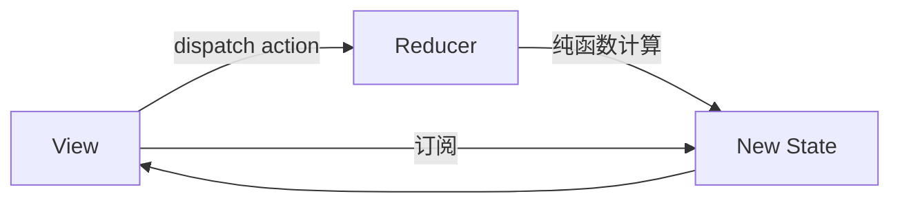

# 状态管理常见面试题与最佳实践

> 配套文档《核心知识点详解.md》见同目录。本文件覆盖状态管理高频面试题（含参考答案与易错点）+ 手写题 + 工程最佳实践 Checklist，按"基础概念 / Redux / Zustand / MobX 与 Pinia / 服务端状态 / 选型决策 / 手写题 / 场景题"八个维度组织。
>
> 答案要点可直接背诵，手写题给出可直接复制的实现。重点在 Redux 理论与 Zustand 实践两块。

---

## 一、基础概念（8 题）

### 1.1 为什么需要状态管理？

解决单组件 state 解决不了的问题：

- **Props 钻取**：深层组件要的状态在根，中间层被迫层层透传。
- **兄弟通信**：兄弟共享数据要提升到共同父，父臃肿。
- **跨页持久**：路由切换组件卸载，state 丢失。
- **多视图同步**：列表 + 详情 + 通知中心共享同一份数据。

### 1.2 何时该上状态管理？

| 场景 | 方案 |
|---|---|
| 父子 / 三层以内 | props + emit / Context |
| 兄弟共享 / 跨层 | 状态库（Zustand/Redux/Pinia） |
| 跨页持久 | 状态库 + 持久化中间件 |
| 服务端 API 数据 | React Query / SWR |
| 复杂表单 | react-hook-form / vee-validate |

**不要为状态而状态**——简单应用强行上 Redux 反而增加心智负担。

### 1.3 客户端状态 vs 服务端状态？

- **客户端状态**：UI 开关、表单草稿、主题、登录态。前端是真源，用 Zustand/Redux/Pinia。
- **服务端状态**：列表、详情、用户信息。服务端是真源，前端只是缓存。用 React Query/SWR。

**关键区分**：把 API 数据塞 Redux 是常见误用。API 数据本质是服务端状态的本地缓存，归 React Query 管。

### 1.4 单向数据流是什么？

数据流只有一个方向：View → Action → Store/Reducer → 新 State → View 重渲染。

任何状态变化都通过 action 描述，store 收到 action 后通过 reducer 计算新状态，订阅者重渲染。这样"谁改了状态"有迹可循，便于调试与时间旅行。

### 1.5 状态规范化是什么？

扁平存储 + id 引用，避免深层嵌套：

```js
// 坏：嵌套
{ posts: [{ id: 1, author: { id: 1, name: "a" } }] }

// 好：扁平 + 引用
{ posts: { 1: { id: 1, authorId: 1 } }, users: { 1: { name: "a" } } }
```

好处：更新 O(1)、避免重复数据、引用一致、查询快。Redux 推荐规范化，可用 `normalizr` 库转换。

### 1.6 派生数据应该存 store 还是 selector？

selector / computed。派生数据存成 state 要同步两处，且失效难管理。

```js
// Redux：reselect memo 化 selector
const visibleTodos = createSelector(
  state => state.todos,
  state => state.filter,
  (todos, filter) => filter === "all" ? todos : todos.filter(t => t.done)
);
```

派生数据的特点：**输入变就重算，输入不变复用上次**。selector 天然符合。

### 1.7 Context 能替代状态库吗？

不能。Context 局限：

- 值变化让**所有**消费者重渲染，无 selector 精细订阅。
- 无中间件 / devtools / 持久化。
- 嵌套多个 Context 难维护。

适合主题/配置等准静态数据，业务状态用状态库。口诀：**Context 传配置，状态库存业务**。

### 1.8 时间旅行是什么？

重放任意 action 序列还原任意时刻状态。Redux DevTools 支持"前进/后退到任意 action"。

前提：

- reducer 是纯函数（相同输入相同输出）。
- 状态不可变（每次返回新对象）。

MobX/Zustand 直接改状态，难做严格时间旅行（Zustand 配 devtools 可部分还原）。

---

## 二、Redux（10 题）

### 2.1 Redux 三大原则？

1. **单一数据源**：整个应用只有一个 store 树。
2. **状态只读**：只能通过 dispatch action 改变。
3. **纯函数变更**：reducer 是 `(state, action) => newState`，无副作用。

### 2.2 Redux 数据流？



<!-- -->

View → dispatch(action) → reducer(state, action) → newState → View 重渲染。单向。

### 2.3 为什么 reducer 必须是纯函数？

- **可预测**：相同输入永远相同输出，易测试。
- **时间旅行**：可重放任意 action 序列还原状态。
- **并发安全**：render 阶段可重入（React 18 并发模式要求）。
- **可缓存**：相同输入可 memo 化。

副作用（异步、日志、随机）放中间件，不进 reducer。

### 2.4 action 是什么？为什么要 type？

action 是描述"发生了什么"的纯对象：

```js
{ type: "ADD_TODO", payload: { id: 1, text: "learn redux" } }
```

- `type` 是唯一必填字段，标识事件类型。
- `payload` 是数据，可选。

action 只描述事件，不描述怎么改——后者由 reducer 决定。这样视图与逻辑解耦。

### 2.5 redux-thunk vs redux-saga？

| 维度 | thunk | saga |
|---|---|---|
| 异步方式 | action 是函数 | generator 描述副作用 |
| 学习曲线 | 平缓 | 陡 |
| 测试 | 难（mock dispatch） | 易（generator 逐 yield 测） |
| 控制 | 弱 | 强（取消 / 串并联 / 竞态） |
| 适用 | 简单异步 | 复杂异步流 |

```js
// thunk：action 是函数
const fetchUser = id => dispatch => {
  api.get(id).then(user => dispatch({ type: "done", payload: user }));
};

// saga：generator
function* fetchUser(action) {
  try {
    const user = yield call(api.get, action.payload);
    yield put({ type: "done", payload: user });
  } catch (e) {
    yield put({ type: "error", payload: e });
  }
}
```

### 2.6 Redux Toolkit 解决了什么？

减少模板代码：

- `createSlice` 自动生成 action creators + reducer。
- 内置 Immer：可直接"改" state，底层转不可变更新。
- `configureStore` 默认装好 thunk + devtools + 中间件合并。
- `createAsyncThunk` 处理异步，自动 dispatch pending/fulfilled/rejected。

新项目用 Redux 一律用 RTK。

### 2.7 react-redux 的 useSelector 怎么避免全量重渲染？

```js
const todos = useSelector(state => state.todos);  // 只订阅 todos
```

selector 返回的状态变化才让组件重渲染。返回新对象（如 `state.todos.filter(...)`）每次引用不同会无限重渲染，要 `shallowEqual` 比较：

```js
import { shallowEqual } from "react-redux";
const visible = useSelector(state => state.todos.filter(t => t.done), shallowEqual);
```

或用 `reselect` 的 `createSelector` 做 memo 化。

### 2.8 多个 reducer 怎么组合？

`combineReducers`：

```js
const rootReducer = combineReducers({
  todos: todosReducer,
  users: usersReducer,
});
// store.getState() => { todos: {...}, users: {...} }
```

每个 reducer 只管自己的子树，互不干扰。RTK 的 `configureStore({ reducer: {...} })` 内部就是 combineReducers。

### 2.9 Redux 状态为什么不可变？

- 靠引用变化判断"是否变了"，引用相同就不重渲染。
- 不可变才能做时间旅行（保存历史快照）。
- 共享引用安全（多人读同一份不会互相改）。

直接改 `state.todos.push(x)` 引用没变，订阅者不重渲染。要返回新数组 `[...state.todos, x]`。RTK 内置 Immer 让你写"看起来像直接改"的代码，底层自动转不可变。

### 2.10 Redux 的痛点？

- 模板代码多（action/reducer/常量/selector）。
- 异步要额外中间件。
- 不可变更新繁琐（深层嵌套要展开多层）。
- 学习曲线陡，对简单应用过重。

RTK + Immer 缓解了大部分痛点，但心智仍是 Flux 范式。

---

## 三、Zustand（8 题）

### 3.1 Zustand 与 Redux 的根本区别？

| 维度 | Redux | Zustand |
|---|---|---|
| 范式 | Flux + reducer 纯函数 | 直接修改 |
| 模板 | 多 | 少 |
| 不可变 | 必须 | 不强制 |
| 学习曲线 | 陡 | 平缓 |
| 体积 | 大 | 极小（~1KB） |
| 适用 | 大型团队 + 时间旅行 | 中小型 + 快速上手 |

Zustand 没有 action/reducer 概念，直接在 store 里写修改函数。

### 3.2 Zustand 基本用法？

```js
import { create } from "zustand";

const useStore = create((set) => ({
  count: 0,
  inc: () => set(state => ({ count: state.count + 1 })),
}));

const count = useStore(s => s.count);  // 精细订阅
const inc = useStore(s => s.inc);
```

要点：`create` 返回钩子，`useStore(selector)` 只订阅 selector 返回的部分。

### 3.3 selector 返回新对象为什么要 shallow？

```js
// 坏：每次返回新对象，无限重渲染
const { count, name } = useStore(s => ({ count: s.count, name: s.name }));

// 好：shallow 浅比较字段
import { shallow } from "zustand/shallow";
const { count, name } = useStore(s => ({ count: s.count, name: s.name }), shallow);
```

默认用 `Object.is` 比较，新对象每次引用不同被判"变了"。shallow 浅比较字段才避免。

### 3.4 Zustand 切片组合？

```js
const createCountSlice = (set) => ({
  count: 0,
  inc: () => set(s => ({ count: s.count + 1 })),
});
const createAuthSlice = (set) => ({
  user: null,
  login: (u) => set({ user: u }),
});

const useStore = create((...a) => ({
  ...createCountSlice(...a),
  ...createAuthSlice(...a),
}));
```

按业务模块拆分，组合成单 store，比 Redux 多 reducer 更直观。

### 3.5 Zustand 中间件？

```js
import { devtools, persist } from "zustand/middleware";

const useStore = create(
  devtools(
    persist(
      (set) => ({ count: 0, inc: () => set(s => ({ count: s.count + 1 })) }),
      { name: "app-storage" }
    ),
    { name: "AppStore" }
  )
);
```

- `devtools`：接入 Redux DevTools 调试。
- `persist`：自动持久化到 localStorage/sessionStorage。
- 自定义中间件：`logging`、`subscribeWithSelector` 等。

### 3.6 Zustand 异步？

直接在 set 函数里 await，无 thunk：

```js
const useStore = create((set) => ({
  user: null,
  loading: false,
  fetchUser: async (id) => {
    set({ loading: true });
    const user = await api.get(id);
    set({ user, loading: false });
  },
}));
```

### 3.7 Zustand 跨框架使用？

不强绑 React，可独立用：

```js
const store = create(...);
store.getState();          // 同步读
store.setState({ x: 1 }); // 同步改
store.subscribe(cb);      // 订阅
```

Electron 主进程 / 任意 JS 都能用同一套 store，通过 IPC 同步主从。

### 3.8 Zustand 何时该用？

- 中小型应用。
- 快速上手、低心智负担。
- 不想写 action/reducer 模板。
- 需要跨框架（React + Electron 主进程共享状态）。

大型团队需要严格审计 + 时间旅行时仍用 Redux RTK。

---

## 四、MobX 与 Pinia（6 题）

### 4.1 MobX 与 Redux 的根本区别？

| 维度 | Redux | MobX |
|---|---|---|
| 范式 | 不可变 + 显式 dispatch | 可变 + 自动追踪 |
| 心智 | 函数式 | 面向对象 |
| 模板 | 多 | 少 |
| 调试 | 时间旅行 | 难 |
| 性能 | 全量 diff + selector memo | 自动只更新依赖组件 |

MobX 像 Vue 响应式——`observable` 装数据，`observer` 装组件，数据变组件自动更新。

### 4.2 MobX 基本用法？

```js
import { makeAutoObservable } from "mobx";
import { observer } from "mobx-react-lite";

class CounterStore {
  count = 0;
  constructor() { makeAutoObservable(this); }
  inc() { this.count++; }
}

const store = new CounterStore();
const Counter = observer(() => <button onClick={() => store.inc()}>{store.count}</button>);
```

直接改 `store.count`，组件自动更新。代价是失去时间旅行调试。

### 4.3 MobX 的边界？

- 直接改数据，"谁改了状态"难追踪。
- 不可变性丢失，调试时无法重放。
- 装饰器语法历史包袱（现可用 `makeAutoObservable` 替代）。

适合快速原型与 OOP 风格团队，不适合需要严格审计的大型项目。

### 4.4 Pinia 替代 Vuex 解决了什么？

- 去掉 mutation（Vuex 必须 `commit` mutation 再 `dispatch` action，繁琐）。
- TypeScript 一等公民。
- Composition API 风格定义 store。
- 模块化天然（每个 store 独立），无需 modules 嵌套。
- DevTools 集成 + 时间旅行。

### 4.5 Pinia 基本用法？

```js
import { defineStore } from "pinia";

export const useCounterStore = defineStore("counter", () => {
  const count = ref(0);
  const double = computed(() => count.value * 2);
  function inc() { count.value++; }
  return { count, double, inc };
});
```

可直接改 `counter.count`，无需 mutation。也可 `counter.$patch({ count: 1 })` 批量改。Vue 3 新项目一律用 Pinia。

### 4.6 Pinia vs Vuex？

| 维度 | Vuex | Pinia |
|---|---|---|
| mutation | 必须经 | 去掉 |
| 模块 | modules 嵌套 | 天然多 store |
| TS | 弱 | 强 |
| API | Options | Composition + Options 双模 |
| 状态 | 是官方 | 是官方 |

---

## 五、服务端状态（5 题）

### 5.1 React Query 是状态管理库吗？

不是。它管的是"API 数据的本地缓存"，与 Zustand/Redux 互补不冲突。

```js
const { data, isLoading, error } = useQuery(["user", id], () => api.get(id));
```

内置：缓存、失效、重试、乐观更新、后台刷新、加载/错误/成功三态。

### 5.2 React Query 与 Zustand 怎么配合？

```
React Query 管服务端状态（API 数据）
  +
Zustand 管客户端状态（UI/主题/表单草稿）
```

现代 React 应用的标准分工——API 数据不塞 Redux/Zustand，UI 状态不塞 React Query。

### 5.3 React Query 的 query key 怎么设计？

```js
useQuery(["users", "list", { page, filter }], fetchUsers);
useQuery(["users", "detail", id], () => fetchUser(id));
```

层级化：实体 → 子资源 → 参数。同 key 共享缓存，参数变就重新请求。

### 5.4 乐观更新怎么做？

```js
const m = useMutation(updateTodo, {
  onMutate: async (newTodo) => {
    await queryClient.cancelQueries(["todos"]);
    const prev = queryClient.getQueryData(["todos"]);
    queryClient.setQueryData(["todos"], old => [...old, newTodo]);  // 先改 UI
    return { prev };
  },
  onError: (err, newTodo, ctx) => {
    queryClient.setQueryData(["todos"], ctx.prev);  // 失败回滚
  },
  onSettled: () => queryClient.invalidateQueries(["todos"]),  // 成功后重取
});
```

先改 UI（用户立刻看到反馈），失败回滚，成功后后台刷新。

### 5.5 SWR vs React Query？

| 维度 | SWR | React Query |
|---|---|---|
| 体积 | 极小（~4KB） | 中（~13KB） |
| 功能 | 基础缓存 + 重取 | 全功能（乐观/devtools/infinite） |
| 学习曲线 | 平缓 | 中等 |
| DevTools | 弱 | 强 |

简单场景 SWR 够用，复杂 API 交互用 React Query。

---

## 六、选型决策（5 题）

### 6.1 简单项目该上 Redux 吗？

不该。简单项目 props + Context 够用。强行上 Redux 增加心智负担、模板代码、学习曲线。

### 6.2 中型 React 项目选什么？

Zustand。低心智、selector 精细订阅、slice 组合、可持久化、可跨框架。配合 React Query 管 API 数据是中型项目最佳实践。

### 6.3 大型团队需要审计的选什么？

Redux Toolkit。严格 Flux 范式 + 纯函数 reducer + 时间旅行，便于多人协作、bug 重现、状态审计。

### 6.4 Vue 3 项目选什么？

Pinia。Vue 官方推荐，Composition API 风格、TS 友好、天然模块化。不要再用 Vuex。

### 6.5 API 数据塞 Redux 还是 React Query？

React Query。API 数据是服务端状态的本地缓存，React Query 自带缓存/失效/重试/乐观更新，塞 Redux 要手写所有这些逻辑，且失效难管理。

---

## 七、手写题（5 题）

### 7.1 手写 mini Redux（createStore）

```js
function createStore(reducer, initialState) {
  let state = initialState;
  const listeners = [];
  return {
    getState: () => state,
    dispatch: (action) => {
      state = reducer(state, action);
      listeners.forEach(f => f());
      return action;
    },
    subscribe: (fn) => {
      listeners.push(fn);
      return () => {
        const i = listeners.indexOf(fn);
        if (i >= 0) listeners.splice(i, 1);
      };
    },
  };
}
```

### 7.2 手写 combineReducers

```js
function combineReducers(reducers) {
  return (state = {}, action) => {
    const next = {};
    let changed = false;
    for (const key in reducers) {
      const prev = state[key];
      const cur = reducers[key](prev, action);
      next[key] = cur;
      if (cur !== prev) changed = true;
    }
    return changed ? next : state;  // 引用没变就不返回新对象
  };
}
```

注意"无变化返回原 state"——避免无谓重渲染。

### 7.3 手写 bindActionCreators

```js
function bindActionCreators(creators, dispatch) {
  return Object.fromEntries(
    Object.entries(creators).map(([key, creator]) => [
      key,
      (...args) => dispatch(creator(...args)),
    ])
  );
}
```

把 action creators 包成可直接调用的函数。

### 7.4 手写 redux-thunk 中间件

```js
const thunk = ({ dispatch, getState }) => next => action => {
  if (typeof action === "function") {
    return action(dispatch, getState);  // action 是函数就执行
  }
  return next(action);  // 否则放行
};
```

### 7.5 手写简化 Zustand create

```js
function createStore createState) {
  const listeners = new Set();
  const setState = (partial) => {
    state = typeof partial === "function" ? partial(state) : { ...state, ...partial };
    listeners.forEach(f => f(state));
  };
  let state = createState(setState);
  const useStore = (selector = s => s) => {
    const [, force] = useReducer(c => c + 1, 0);
    useSyncExternalStore(
      cb => { listeners.add(cb); return () => listeners.delete(cb); },
      () => selector(state)
    );
    return selector(state);
  };
  useStore.getState = () => state;
  useStore.setState = setState;
  return useStore;
}
```

实际 Zustand 用 `useSyncExternalStore` 订阅外部 store，selector 变化才触发组件重渲染。

---

## 八、场景题（5 题）

### 8.1 全局主题切换怎么做？

```js
// Zustand
const useTheme = create(persist(
  (set) => ({
    theme: "light",
    toggle: () => set(s => ({ theme: s.theme === "light" ? "dark" : "light" })),
  }),
  { name: "theme" }
));

// 组件
const theme = useTheme(s => s.theme);
return <div className={theme}>...</div>;
```

切 class 即换肤，CSS 变量更优。也可用 Context，但状态库能配合 localStorage 持久化。

### 8.2 用户登录态怎么管理？

```js
// Zustand + persist
const useAuth = create(persist(
  (set) => ({
    token: null,
    user: null,
    setAuth: (token, user) => set({ token, user }),
    logout: () => set({ token: null, user: null }),
  }),
  { name: "auth", partialize: s => ({ token: s.token }) }  // 只持久化 token，user 重新拉
));
```

注意：token 持久化但 user 信息每次登录后重新拉（防止过期）。

### 8.3 跨页表单草稿怎么存？

```js
const useDraft = create(persist(
  (set) => ({
    form: {},
    setField: (k, v) => set(s => ({ form: { ...s.form, [k]: v } })),
    clear: () => set({ form: {} }),
  }),
  { name: "draft" }
));
```

路由切换组件卸载也不丢，提交成功后 `clear()`。注意敏感数据不要持久化。

### 8.4 大型应用 store 怎么拆？

按业务域拆 slice：

```js
// slices/userSlice.js
export const createUserSlice = (set) => ({...});
// slices/cartSlice.js
export const createCartSlice = (set) => ({...});
// store.js
export const useStore = create((...a) => ({
  ...createUserSlice(...a),
  ...createCartSlice(...a),
}));
```

按业务域（user/cart/order）而非技术分层（actions/reducers）。Redux 用 `combineReducers` + 模块化 RTK slice。

### 8.5 跨进程共享状态（Electron）怎么做？

主进程持 store，渲染进程订阅：

```js
// 主进程
const store = createElectronStore();
ipcMain.handle("state:get", () => store.getState());
store.subscribe(state => win.webContents.send("state:update", state));

// 渲染进程
const useStore = create(() => ({}));
window.electron.on("state:update", state => useStore.setState(state));
```

主进程是真源，渲染进程订阅镜像。敏感操作只在主进程做。

---

## 九、生产环境最佳实践 Checklist

### 9.1 状态分类

- 区分客户端状态 vs 服务端状态
- API 数据用 React Query/SWR
- 表单状态用 react-hook-form，不塞全局
- 路由参数用 URL，不重复存 store

### 9.2 Zustand 实践

- selector 精细订阅
- 返回新对象用 shallow 比较
- 按业务模块拆 slice
- 持久化敏感数据加密或单独管理
- 跨进程共享用 ipc 同步

### 9.3 Redux 实践

- 用 RTK，不用裸 createStore
- reducer 内置 Immer 直接改
- 异步用 createAsyncThunk
- selector 用 reselect memo 化
- slice 按业务模块拆

### 9.4 通用

- 状态规范化（扁平 + id 引用）
- 派生数据用 selector/computed
- 不把组件局部状态塞全局
- DevTools + 时间旅行调试开启
- 状态变化有日志可追溯

---

## 十、一句话总纲

> 状态管理面试的三个层次：**第一层问"是什么"**（Redux 三原则、Zustand selector、Pinia vs Vuex），**第二层问"为什么"**（为什么 reducer 纯函数、为什么 Context 不能替代状态库、为什么 API 数据不塞 Redux），**第三层问"怎么选"**（小型 Context、中型 Zustand、大型 Redux RTK、Vue 用 Pinia、API 用 React Query）。能讲清"派生数据为什么用 selector""时间旅行依赖什么""客户端 vs 服务端状态的边界"，就是高级前端对状态管理的认知。
