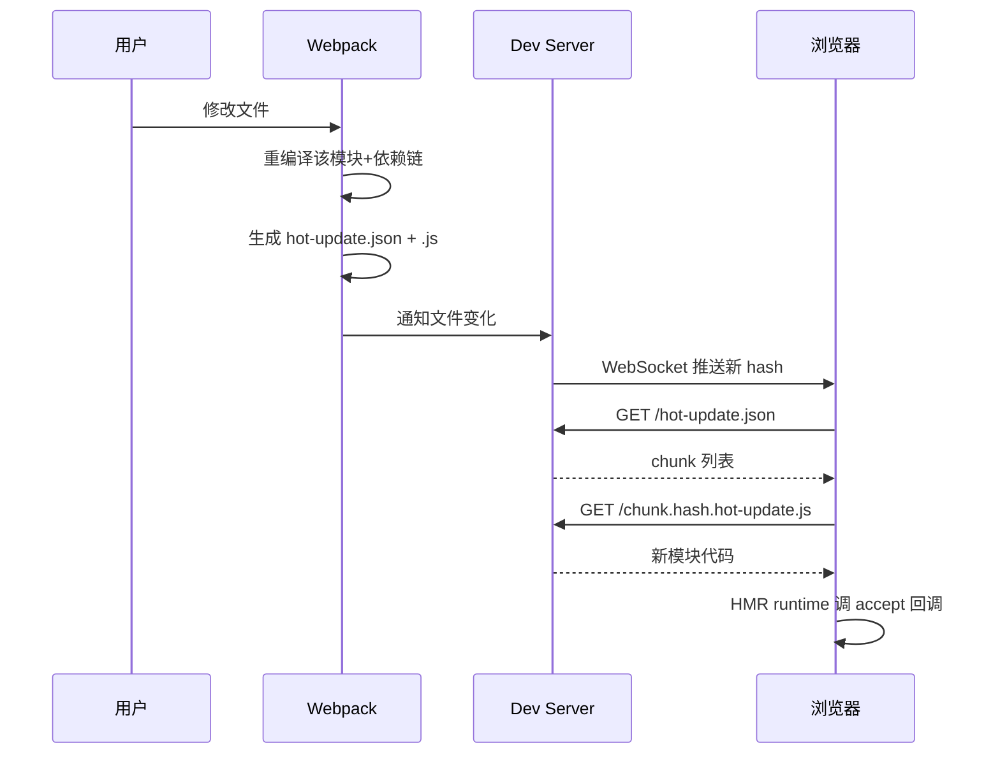
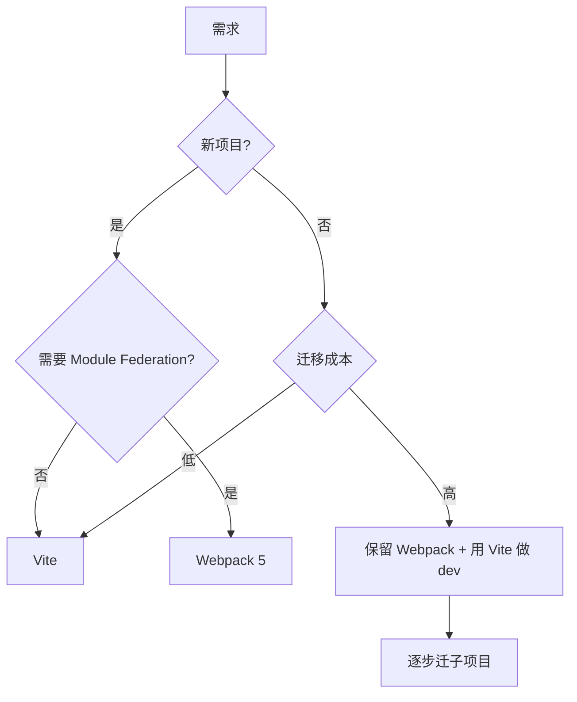

# Webpack 专题 · 常见面试题与最佳实践

> 本文档位于 `知识库/前端/04工程化与构建/01Webpack 专题/`，是 Webpack 的面试题集与生产最佳实践。配套核心知识见《核心知识点详解.md》。
>
> 15 道高频题 + 8 个生产场景 + 完整 Checklist，覆盖核心概念、构建流程、Tree Shaking、Code Splitting、HMR、优化策略、与 Vite 对比等面试常考点。

---

## 一、核心概念类（高频）

### 1. Webpack 的五大核心概念是什么？

**核心答案**：Entry（入口）、Output（输出）、Loader（加载器）、Plugin（插件）、Mode（模式）。

| 概念 | 作用 | 关键配置 |
|---|---|---|
| Entry | 构建依赖图的起点 | `entry: "./src/index.js"` |
| Output | 输出文件命名与路径 | `output: { path, filename, publicPath }` |
| Loader | 转换非 JS 资源为 JS 模块 | `module: { rules: [...] }` |
| Plugin | 构建流程任意阶段扩展 | `plugins: [...]` |
| Mode | 自动应用优化 | `mode: "development" \| "production"` |

**展开**：

- **Entry** 决定从哪个文件开始扫描依赖图。多入口输出多 bundle。
- **Output** 决定产物命名、路径、CDN 前缀。
- **Loader** 链式调用，从右到左、从下到上。如 `["style-loader", "css-loader", "sass-loader"]`：sass 先跑、style 最后跑。
- **Plugin** 比 Loader 强大得多——能访问整个 Compilation 对象、修改资源、注入环境变量、生成 HTML 等。
- **Mode** 是 v4+ 的语法糖，自动启用对应优化。

```js
module.exports = {
  mode: "production",
  entry: "./src/index.tsx",
  output: {
    path: path.resolve(__dirname, "dist"),
    filename: "[name].[contenthash:8].js",
    publicPath: "/",
    clean: true,
  },
  module: {
    rules: [
      { test: /\.tsx?$/, use: "babel-loader", exclude: /node_modules/ },
      { test: /\.css$/, use: ["style-loader", "css-loader"] },
      { test: /\.(png|jpg)$/, type: "asset/resource" },
    ],
  },
  plugins: [new HtmlWebpackPlugin({ template: "./index.html" })],
};
```

---

### 2. Loader 与 Plugin 的区别？

**核心答案**：Loader 是"模块代码转换器"，只能处理单个模块的源码；Plugin 是"构建流程扩展器"，能访问整个 Compilation 在任意阶段做事。

| 维度 | Loader | Plugin |
|---|---|---|
| 定位 | 模块代码转换 | 构建流程扩展 |
| 接口 | 导出函数（接收 source 返回 source） | 导出类（实现 apply 方法） |
| 作用范围 | 单个模块 | 整个 Compilation |
| 触发时机 | 编译阶段（make） | 全生命周期钩子 |
| 能力 | 转换代码 | 修改资源、生成文件、注入变量、优化 |

**Loader 示例**：

```js
// my-loader.js
module.exports = function (source) {
  // 接收模块源码，返回转换后源码
  return source.replace(/console\.log\(.*?\);?/g, "");
};
```

**Plugin 示例**：

```js
// my-plugin.js
class MyPlugin {
  apply(compiler) {
    compiler.hooks.emit.tapAsync("MyPlugin", (compilation, cb) => {
      // 修改输出资源
      compilation.assets["version.txt"] = {
        source: () => "1.0.0",
        size: () => 5,
      };
      cb();
    });
  }
}
```

**类比**：Loader 像"工厂流水线的某个工位"——只处理一个零件；Plugin 像"工厂经理"——能在任意阶段介入、调度、修改全局。

---

### 3. Webpack 的构建流程分几个阶段？

**核心答案**：三大阶段——初始化（Init）、编译（Make）、输出（Seal + Emit）。


<!-- -->

**1. 初始化（Init）**：

- 合并 CLI 参数与 `webpack.config.js`。
- 创建全局唯一的 Compiler 实例。
- 触发 `beforeRun` / `run` 钩子。

**2. 编译（Make）**：

- 从 Entry 出发，对每个模块：
  - 用 Loader 链转换源码（如 babel-loader 把 TS 转 JS）。
  - 解析 `import/export`/`require` 找到依赖。
  - 递归处理依赖（深度优先）。
- 构建 Module Graph（模块依赖图）。

**3. 输出（Seal + Emit）**：

- **Seal**：把模块组装成 chunk（入口 chunk + 异步 chunk + 公共 chunk）。
- 优化：Tree Shaking 删死代码、Scope Hoisting 合并模块、minify 压缩。
- **Emit**：把最终 chunk 写入 `output.path`，触发 `emit`/`done` 钩子。

**Compiler 与 Compilation 区别**：

- **Compiler**：全局唯一，整个 Webpack 实例，全生命周期复用。`webpack(config)` 返回 Compiler。
- **Compilation**：每次构建创建一个，包含本次的模块图、chunk、资源。watch 模式下每次文件变化都新建一个 Compilation。

---

### 4. Webpack 的 HMR 是怎么工作的？

**核心答案**：通过 WebSocket 推送变化通知，浏览器拉取 hot-update 资源，调用 `module.hot.accept` 回调应用更新。



<!-- -->

**关键步骤**：

1. Webpack 监听文件变化，重编译该模块及其依赖链。
2. 生成 `hot-update.json`（记录哪些 chunk 变了）和 `hot-update.js`（新模块代码）。
3. Dev Server 通过 WebSocket 推送新 hash 给浏览器。
4. 浏览器 HMR runtime 拉取 hot-update 资源。
5. 调用业务代码注册的 `module.hot.accept` 回调应用更新。

**业务代码接收 HMR**：

```js
if (module.hot) {
  module.hot.accept("./App", () => {
    const NextApp = require("./App").default;
    render(NextApp);
  });
}
```

**框架级 HMR**：React 用 `react-refresh`（@pmmmwh/react-refresh-webpack-plugin）自动注入 HMR 接收，保留组件 state；Vue 用 `vue-loader` 类似。

**与 Vite HMR 区别**：

| 维度 | Webpack | Vite |
|---|---|---|
| 改文件 | 重编译该模块+依赖链 | 只编译该模块 |
| 通知 | WebSocket push hash | WebSocket push 路径 |
| 加载 | 拉取 hot-update chunk | 拉取新模块 |
| 速度 | 随项目规模变慢 | 与规模解耦 |

---

## 二、Tree Shaking 类（高频）

### 5. Tree Shaking 的原理和触发条件是什么？

**核心答案**：Tree Shaking 利用 ESM 静态分析，识别未被 import 的 export 并删除。触发条件：production 模式 + ESM + package.json `sideEffects` 声明。

```js
// math.js
export function add(a, b) { return a + b; }
export function multiply(a, b) { return a * b; }  // 未使用 → 删

// main.js
import { add } from "./math";
console.log(add(1, 2));
```

构建后 `multiply` 没被 import，被 Webpack 标记为 unused export 并删除。

**三个触发条件**：

1. **mode: "production"**：开发模式不开启（保留方便调试）。
2. **ESM**：源码必须用 `import/export`（CJS 的 `require/module.exports` 是动态的，无法静态分析）。
3. **package.json `sideEffects`**：声明哪些文件有副作用。

```json
{
  "sideEffects": false
}
```

**sideEffects 的意义**：

- `false`：所有文件无副作用，可大胆删除整个未使用文件。
- `["*.css", "./src/polyfill.js"]`：列出有副作用的文件，其余可删。
- 不声明：默认 `true`（保守，不删整个文件，只删单个 export）。

**副作用示例**：

```js
// polyfill.js
window.__VERSION = "1.0";  // 副作用：修改 window
import "./polyfill";  // 即使没使用其 export，文件本身的副作用要保留
```

**验证**：

```bash
# Webpack stats 显示 unused exports
npx webpack --json --profile > stats.json | jq '.modules[].reasons'

# BundleAnalyzer 可视化
plugins: [new BundleAnalyzerPlugin()]
```

---

### 6. Tree Shaking 与 sideEffects 怎么配合？

**核心答案**：`sideEffects` 控制"未引用的整个文件"是否删；Tree Shaking 删"被引用文件中未被使用的 export"。

```js
// utils.js
export function a() {}
export function b() {}  // 未被使用

// polyfill.js
window.__x = 1;  // 副作用，无 export
```

```json
// package.json
{
  "sideEffects": false  // 承诺所有文件无副作用
}
```

构建结果：

- `utils.js` 的 `b` 被 Tree Shaking 删除（单个 export 删）。
- `polyfill.js` 整个文件被删（因为无副作用 + 未被 import）。

若 `sideEffects: ["./src/polyfill.js"]`：

- `polyfill.js` 保留（有副作用）。
- `utils.js` 的 `b` 仍被删。

**最佳实践**：

```json
{
  "sideEffects": [
    "*.css",
    "*.scss",
    "./src/polyfills.js"
  ]
}
```

CSS 必须列入——`import "./styles.css"` 没用任何 export，但 CSS Loader 注入样式有副作用。

---

## 三、Code Splitting 类（高频）

### 7. Code Splitting 有哪几种方式？

**核心答案**：三种方式——入口配置、动态 import、splitChunks 自动拆分。

```js
// 方式 1：多入口
entry: { main: "./main.js", admin: "./admin.js" }

// 方式 2：动态 import
import(/* webpackChunkName: "page" */ "./Page").then(Page => {
  // ...
});

// 方式 3：splitChunks
optimization: {
  splitChunks: {
    chunks: "all",
    cacheGroups: {
      vendors: { test: /[\\/]node_modules[\\/]/, name: "vendors" },
    },
  },
}
```

**适用场景**：

| 方式 | 场景 | 优劣 |
|---|---|---|
| 多入口 | MPA | 简单但不能共享依赖 |
| 动态 import | SPA 路由按需加载 | 灵活，最佳实践 |
| splitChunks | 自动抽公共依赖 | 配置驱动，无需手动 |

**最佳实践**：路由懒加载 + splitChunks 拆 vendor。

```jsx
// React Router 路由懒加载
const Page = lazy(() => import("./Page"));

<Route path="/page" element={
  <Suspense fallback={<Spinner />}>
    <Page />
  </Suspense>
} />;
```

```js
// splitChunks 按业务域拆 vendor
optimization: {
  splitChunks: {
    chunks: "all",
    cacheGroups: {
      reactVendor: { test: /[\\/]node_modules[\\/](react|react-dom)/, name: "react-vendor" },
      echartsVendor: { test: /[\\/]node_modules[\\/]echarts/, name: "echarts-vendor" },
      default: { minChunks: 2, reuseExistingChunk: true },
    },
  },
}
```

---

### 8. splitChunks 的 cacheGroups 怎么配置？

**核心答案**：用 `cacheGroups` 定义多个分组规则，每组按 `test` 匹配模块，输出独立 chunk。

```js
optimization: {
  splitChunks: {
    chunks: "all",        // 同步+异步都拆
    minSize: 20000,       // 最小 20KB 才拆
    maxSize: 244000,      // 超过 244KB 进一步拆
    minChunks: 1,         // 至少被引用 1 次
    maxAsyncRequests: 30, // 异步 chunk 最大请求数
    maxInitialRequests: 30,// 入口 chunk 最大请求数
    automaticNameDelimiter: "~",
    cacheGroups: {
      // 第三方 react 单独拆
      reactVendor: {
        test: /[\\/]node_modules[\\/](react|react-dom|react-router)/,
        name: "react-vendor",
        chunks: "all",
        priority: 10,
      },
      // echarts 大依赖单独拆
      echartsVendor: {
        test: /[\\/]node_modules[\\/](echarts|zrender)/,
        name: "echarts-vendor",
        chunks: "all",
        priority: 10,
      },
      // 其他 node_modules
      vendors: {
        test: /[\\/]node_modules[\\/]/,
        name: "vendors",
        chunks: "all",
        priority: -10,
      },
      // 业务公共代码
      default: {
        minChunks: 2,
        priority: -20,
        reuseExistingChunk: true,  // 复用已存在的 chunk
      },
    },
  },
}
```

**关键字段**：

- `chunks`：`initial`(同步)/`async`(异步)/`all`(全部)。推荐 `all` 让 vendor 也能被异步 chunk 共享。
- `minSize`：小于此值不拆（避免过多小 chunk）。
- `priority`：组优先级，正值高于 0 优先于默认组，负值低于默认组。
- `test`：正则匹配模块路径。
- `reuseExistingChunk`：已被某 chunk 包含的模块不再拆出。

---

## 四、性能优化类（高频）

### 9. Webpack 构建慢怎么优化？

**核心答案**：从六个维度优化——缓存、多线程、缩小范围、Dll/持久化缓存、Resolve 优化、Loader 优化。

```js
// 1. 持久化缓存（v5）
cache: {
  type: "filesystem",
  cacheLocation: path.resolve(__dirname, ".cache/webpack"),
  buildDependencies: { config: [__filename] },
}

// 2. 多线程编译
module: {
  rules: [{
    test: /\.tsx?$/,
    use: [
      "thread-loader",  // 把后续 loader 放线程池
      { loader: "babel-loader", options: { cacheDirectory: true } },
    ],
  }],
}

// 3. 缩小范围
{ test: /\.js$/, exclude: /node_modules/, use: "babel-loader" }

// 4. resolve 优化
resolve: {
  extensions: [".tsx", ".ts", ".js"],  // 列表短而准
  alias: { "@": path.resolve("src") },
  modules: [path.resolve("node_modules")],  // 限定查找路径
  mainFields: ["module", "main"],  // ESM 优先
}

// 5. externals 用 CDN
externals: { react: "React", "react-dom": "ReactDOM" }

// 6. IgnorePlugin 忽略子模块
plugins: [
  new webpack.IgnorePlugin({
    resourceRegExp: /^\.\/locale$/,
    contextRegExp: /moment$/,
  }),
]
```

**效果对比**：

| 优化手段 | 提速 |
|---|---|
| 持久化缓存（v5） | 50-90% |
| babel-loader cacheDirectory | 30-50% |
| thread-loader | 20-40%（CPU 密集型才有） |
| exclude node_modules | 10-30% |
| externals + CDN | 减少打包体积 |

---

### 10. 怎么减小产物体积？

**核心答案**：Tree Shaking + Code Splitting + 压缩 + externals + IgnorePlugin 多管齐下。

```js
// 1. production 模式自动开 Tree Shaking + terser 压缩
mode: "production"

// 2. package.json sideEffects 声明
{ "sideEffects": ["*.css", "./src/polyfills.js"] }

// 3. 动态 import 拆 chunk
import("./Page").then(...)

// 4. splitChunks 拆 vendor
optimization: { splitChunks: { chunks: "all" } }

// 5. CSS 提取 + 压缩
plugins: [new MiniCssExtractPlugin({ filename: "[name].[contenthash:8].css" })]
optimization: { minimizer: [new CssMinimizerPlugin()] }

// 6. externals 用 CDN
externals: { react: "React", "react-dom": "ReactDOM" }

// 7. IgnorePlugin 忽略 moment locale（省 200KB）
plugins: [new webpack.IgnorePlugin({ resourceRegExp: /^\.\/locale$/, contextRegExp: /moment$/ })]

// 8. ContextReplacementPlugin 只加载特定 locale
plugins: [
  new webpack.ContextReplacementPlugin(/moment[/\\]locale$/, /zh-cn|en/),
]
```

**包体分析**：

```js
const { BundleAnalyzerPlugin } = require("webpack-bundle-analyzer");
plugins: [
  new BundleAnalyzerPlugin({
    analyzerMode: "static",
    openAnalyzer: true,
  }),
]
```

可视化看哪些依赖体积大，针对性优化（替换 echarts/lodash 全量导入为按需导入）。

---

### 11. devtool 怎么选？

**核心答案**：开发用 `eval-cheap-module-source-map`（快+TS 友好），生产用 `hidden-source-map`（不外露源码）或不上 source map。

| devtool | 速度 | 质量 | 用途 |
|---|---|---|---|
| `eval` | 最快 | 行级 | 初步开发 |
| `eval-cheap-source-map` | 快 | 行级 | 简单 JS 开发 |
| `eval-cheap-module-source-map` | 快 | 行级 | TS 开发（推荐） |
| `eval-source-map` | 中 | 行+列 | 高质量开发 |
| `source-map` | 慢 | 行+列 | 生产 |
| `hidden-source-map` | 慢 | 行+列 | 生产（不外露） |
| `nosources-source-map` | 慢 | 行+列 | 生产（只给 stack trace） |

**为什么 dev 用 `eval-cheap-module-source-map`**：

- `eval`：每个模块用 `eval` 包裹，源码改动只重 eval 该模块，HMR 极快。
- `cheap`：只映射行不映射列（够用）。
- `module-source-map`：保留 loader 链源码（TS → babel → 实际源码映射准确）。

**为什么生产用 `hidden-source-map`**：

- 生成 `.map` 文件但不在 bundle 末尾加 `//# sourceMappingURL` 注释。
- 浏览器看不到 source map，需手动配置 Sentry/监控服务上传。
- 既能在错误监控看到 stack trace，又不暴露源码给用户。

---

## 五、配置类（高频）

### 12. webpack.config.js 怎么按环境分离？

**核心答案**：用 `webpack-merge` 把公共配置与 dev/prod 配置合并。

```
config/
├── webpack.common.js   # 公共配置
├── webpack.dev.js      # dev 专属
├── webpack.prod.js     # prod 专属
└── webpack.analyze.js  # 包体分析
```

```js
// webpack.common.js
const { merge } = require("webpack-merge");
module.exports = {
  entry: "./src/index.tsx",
  output: { filename: "[name].[contenthash:8].js", clean: true },
  resolve: { extensions: [".tsx", ".ts", ".js"] },
  module: { rules: [/* 通用 rules */] },
  plugins: [/* 通用 plugin */],
};

// webpack.dev.js
const { merge } = require("webpack-merge");
const common = require("./webpack.common");
module.exports = merge(common, {
  mode: "development",
  devtool: "eval-cheap-module-source-map",
  devServer: {
    port: 3000,
    open: true,
    hot: true,
    historyApiFallback: true,
    proxy: { "/api": "http://localhost:8080" },
  },
});

// webpack.prod.js
const { merge } = require("webpack-merge");
const common = require("./webpack.common");
const MiniCssExtractPlugin = require("mini-css-extract-plugin");
module.exports = merge(common, {
  mode: "production",
  devtool: "hidden-source-map",
  optimization: {
    minimize: true,
    splitChunks: { chunks: "all" },
    runtimeChunk: "single",
  },
  plugins: [new MiniCssExtractPlugin({ filename: "[name].[contenthash:8].css" })],
});
```

```json
// package.json
{
  "scripts": {
    "dev": "webpack serve --config config/webpack.dev.js",
    "build": "webpack --config config/webpack.prod.js",
    "analyze": "webpack --config config/webpack.analyze.js"
  }
}
```

**要点**：

- 公共配置只放两套都需要的（entry、resolve、通用 rules）。
- dev 专属：devtool、devServer、HMR 插件。
- prod 专属：minimize、splitChunks、CSS 提取、隐藏 source map。
- 用 `merge` 而非 `{ ...common, ...dev }`——`merge` 智能合并 rules/plugins 等数组。

---

### 13. externals 与 ProvidePlugin 怎么用？

**核心答案**：`externals` 让 Webpack 不打包某依赖（用 CDN）；`ProvidePlugin` 自动注入全局变量（如 jQuery）。

**externals 用 CDN**：

```js
// webpack.config.js
externals: {
  react: "React",         // import React → 全局 React
  "react-dom": "ReactDOM",
  lodash: "_",
}
```

```html
<!-- index.html -->
<script src="https://unpkg.com/react@18/umd/react.production.min.js"></script>
<script src="https://unpkg.com/react-dom@18/umd/react-dom.production.min.js"></script>
```

```js
// 业务代码照常 import
import React from "react";  // 运行时取 window.React
```

效果：react/react-dom 不打包进 bundle，体积减少 100KB+，加载从 CDN（缓存友好）。

**ProvidePlugin 自动 import**：

```js
const webpack = require("webpack");
plugins: [
  new webpack.ProvidePlugin({
    $: "jquery",        // 用 $ 自动 import jquery
    jQuery: "jquery",
    React: "react",
  }),
]
```

```js
// 业务代码直接用 $ 而无需 import
$(".btn").on("click", () => {});
```

注意：`ProvidePlugin` 让 jQuery 等被自动 import，仍会打包进 bundle（不是从 CDN）。如果要走 CDN，用 `externals` + `ProvidePlugin` 配合。

---

## 六、Webpack 5 新特性（高频）

### 14. Webpack 5 有哪些重要新特性？

**核心答案**：持久化缓存、资源模块、Module Federation、更好的 Tree Shaking、Node Polyfill 移除。

| 新特性 | 说明 |
|---|---|
| 持久化缓存 | `cache: { type: "filesystem" }` 二次构建提速 50-90% |
| 资源模块 | 内置 `asset/resource`/`asset/inline`/`asset/source` 替代 file-loader/url-loader |
| Module Federation | 多 Webpack 应用运行时共享模块（微前端） |
| Tree Shaking 增强 | 支持嵌套模块、CommonJS tree shaking（部分） |
| Node Polyfill 移除 | 不再自动 polyfill `process`/`Buffer`/`setImmediate` 等 |
| Asset Modules | 统一资源处理 API |
| WebAssembly 异步模块 | 支持 async WebAssembly 模块 |

**Module Federation 示例**：

```js
// host (app1) webpack.config.js
new ModuleFederationPlugin({
  remotes: { app2: "app2@http://localhost:3001/remoteEntry.js" },
})

// remote (app2) webpack.config.js
new ModuleFederationPlugin({
  name: "app2",
  filename: "remoteEntry.js",
  exposes: { "./Button": "./src/Button" },
  shared: ["react", "react-dom"],
})
```

```js
// host 业务代码
import Button from "app2/Button";  // 运行时从 app2 拉
```

**为什么移除 Node Polyfill**：

- Webpack v4 自动 polyfill `Buffer`、`process` 等，导致浏览器产物体积大且很多项目根本不用。
- v5 让用户自己决定是否 polyfill（按需），减小产物体积、明确意图。

```js
// 需 polyfill 时手动配置
const nodePolyfill = require("node-polyfill-webpack-plugin");
plugins: [new nodePolyfill()];
```

---

## 七、迁移与对比类（高频）

### 15. Webpack 与 Vite 怎么选？老项目怎么迁？

**核心答案**：新项目无 Module Federation 需求选 Vite；老 Webpack 项目评估迁移成本，渐进迁或保留。



<!-- -->

**选型决策**：

| 场景 | 推荐 |
|---|---|
| 新项目无 MF | Vite |
| 新项目有 MF（微前端） | Webpack 5 |
| 老 Webpack 项目 | 渐进迁移或保留 |
| 复杂 Loader 链 | Webpack |
| Electron 渲染进程 | Vite（dev 快） |

**迁移步骤**：

1. **入口与别名**

```js
// Webpack
resolve: { alias: { "@": "src" } }

// Vite
resolve: { alias: { "@": path.resolve(__dirname, "src") } }
// + tsconfig.paths 同步
```

2. **环境变量**

```bash
# Webpack DefinePlugin 注入 process.env
# Vite .env + import.meta.env
```

业务代码所有 `process.env.X` 改成 `import.meta.env.VITE_X`。

3. **CSS**

```ts
// Webpack css-loader + style-loader + sass-loader
// Vite 内置 CSS、CSS Modules、SCSS、PostCSS
css: {
  preprocessorOptions: { scss: { additionalData: `@import "@/styles/vars.scss";` } },
  modules: { localsConvention: "camelCase" },
}
```

4. **插件替换**

| Webpack | Vite |
|---|---|
| html-webpack-plugin | 内置 + `transformIndexHtml` |
| copy-webpack-plugin | `vite-plugin-static-copy` |
| mini-css-extract-plugin | 内置 |
| webpack-bundle-analyzer | `rollup-plugin-visualizer` |
| fork-ts-checker | `vite-plugin-checker` |

5. **dev server proxy**

```ts
// Webpack devServer.proxy → Vite server.proxy
server: {
  proxy: { "/api": { target: "http://localhost:3000", changeOrigin: true } },
}
```

**常见坑**：

- **CJS 依赖问题**：老 CJS 库在 dev（ESM）能跑、build（Rollup）报错。修复：`optimizeDeps.include` 显式声明、`build.commonjsOptions` 调整。
- **require is not defined**：源码用 `require`。修复：改 `import`。
- **二次预构建卡顿**：动态 import 依赖未声明。修复：`optimizeDeps.include`。
- **CSS URL 解析**：SCSS 里 `url(./logo.png)` dev/build 行为不一致。修复：用 `~@/assets/...` 或绝对路径。
- **HTML template**：`html-webpack-plugin` template 选项。修复：在 `index.html` 直接写、用 `vite-plugin-html` 插件。

---

## 八、生产最佳实践

### 8.1 推荐生产配置

```js
// webpack.prod.js
const { merge } = require("webpack-merge");
const common = require("./webpack.common");
const MiniCssExtractPlugin = require("mini-css-extract-plugin");
const CssMinimizerPlugin = require("css-minimizer-webpack-plugin");
const TerserPlugin = require("terser-webpack-plugin");
const BundleAnalyzerPlugin = require("webpack-bundle-analyzer").BundleAnalyzerPlugin;
const CompressionPlugin = require("compression-webpack-plugin");

module.exports = merge(common, {
  mode: "production",
  devtool: "hidden-source-map",
  output: {
    filename: "[name].[contenthash:8].js",
    chunkFilename: "[name].[contenthash:8].chunk.js",
    publicPath: "/",
    clean: true,
  },
  optimization: {
    minimize: true,
    minimizer: [
      new TerserPlugin({
        terserOptions: {
          compress: { drop_console: true, drop_debugger: true },
          format: { comments: false },
        },
        extractComments: false,
      }),
      new CssMinimizerPlugin(),
    ],
    splitChunks: {
      chunks: "all",
      cacheGroups: {
        reactVendor: { test: /[\\/]node_modules[\\/](react|react-dom|react-router)/, name: "react-vendor" },
        echartsVendor: { test: /[\\/]node_modules[\\/]echarts/, name: "echarts-vendor" },
        defaultVendors: { test: /[\\/]node_modules[\\/]/, name: "vendors", priority: -10 },
      },
    },
    runtimeChunk: "single",
  },
  plugins: [
    new MiniCssExtractPlugin({ filename: "[name].[contenthash:8].css" }),
    new CompressionPlugin({ algorithm: "brotliCompress", ext: ".br", threshold: 10240 }),
    new BundleAnalyzerPlugin({ analyzerMode: "static", openAnalyzer: false }),
  ],
  performance: {
    maxAssetSize: 244000,
    maxEntrypointSize: 244000,
    hints: "warning",
  },
});
```

### 8.2 推荐 dev 配置

```js
// webpack.dev.js
const { merge } = require("webpack-merge");
const common = require("./webpack.common");
const ReactRefreshWebpackPlugin = require("@pmmmwh/react-refresh-webpack-plugin");

module.exports = merge(common, {
  mode: "development",
  devtool: "eval-cheap-module-source-map",
  cache: { type: "filesystem" },
  output: { filename: "[name].js" },
  devServer: {
    port: 3000,
    open: true,
    hot: true,
    compress: true,
    historyApiFallback: true,
    client: { overlay: { errors: true, warnings: false } },
    static: { directory: path.join(__dirname, "public"), watch: true },
    proxy: {
      "/api": { target: "http://localhost:8080", changeOrigin: true, pathRewrite: { "^/api": "" } },
    },
  },
  plugins: [new ReactRefreshWebpackPlugin()],
});
```

### 8.3 推荐目录结构

```
project/
├── config/
│   ├── webpack.common.js
│   ├── webpack.dev.js
│   ├── webpack.prod.js
│   └── webpack.analyze.js
├── public/                 # 静态资源（不参与构建）
│   └── favicon.ico
├── src/
│   ├── assets/             # 参与构建的资源
│   ├── components/
│   ├── pages/
│   ├── hooks/
│   ├── services/
│   ├── stores/
│   ├── utils/
│   ├── types/
│   ├── App.tsx
│   └── index.tsx
├── .babelrc / babel.config.js
├── postcss.config.js
├── tsconfig.json
└── package.json
```

### 8.4 babel.config.js 模板

```js
// babel.config.js
module.exports = {
  presets: [
    ["@babel/preset-env", { targets: { node: "current" }, modules: false }],
    ["@babel/preset-react", { runtime: "automatic" }],
    "@babel/preset-typescript",
  ],
  plugins: [
    "@babel/plugin-proposal-class-properties",
    "@babel/plugin-proposal-optional-chaining",
    process.env.NODE_ENV === "development" && "react-refresh/babel",
  ].filter(Boolean),
};
```

### 8.5 postcss.config.js 模板

```js
// postcss.config.js
module.exports = {
  plugins: [
    require("autoprefixer"),
    require("postcss-preset-env"),
    process.env.NODE_ENV === "production" && require("cssnano")({ preset: "default" }),
  ].filter(Boolean),
};
```

### 8.6 Docker 部署

```dockerfile
# 多阶段构建
FROM node:20-alpine AS builder
WORKDIR /app
RUN npm install -g pnpm
COPY pnpm-lock.yaml package.json ./
RUN pnpm install --frozen-lockfile --prod=false
COPY . .
RUN pnpm build

FROM nginx:alpine
COPY --from=builder /app/dist /usr/share/nginx/html
COPY nginx.conf /etc/nginx/conf.d/default.conf
EXPOSE 80
CMD ["nginx", "-g", "daemon off;"]
```

### 8.7 CI/CD

```yaml
# .github/workflows/ci.yml
name: CI
on: [push, pull_request]
jobs:
  build:
    runs-on: ubuntu-latest
    steps:
      - uses: actions/checkout@v4
      - uses: pnpm/action-setup@v2
      - uses: actions/setup-node@v4
        with: { node-version: 20, cache: pnpm }
      - run: pnpm install --frozen-lockfile
      - run: pnpm lint
      - run: pnpm typecheck
      - run: pnpm test
      - run: pnpm build
      - uses: actions/upload-artifact@v4
        with: { name: dist, path: dist }
```

### 8.8 微前端（Module Federation）完整模板

```js
// host/webpack.config.js
const ModuleFederationPlugin = require("webpack/lib/container/ModuleFederationPlugin");
module.exports = {
  plugins: [
    new ModuleFederationPlugin({
      name: "host",
      remotes: {
        app1: "app1@http://localhost:3001/remoteEntry.js",
        app2: "app2@http://localhost:3002/remoteEntry.js",
      },
      shared: {
        react: { singleton: true, requiredVersion: "^18.0.0" },
        "react-dom": { singleton: true, requiredVersion: "^18.0.0" },
      },
    }),
  ],
};
```

```js
// host 业务代码
const RemoteButton = React.lazy(() => import("app1/Button"));
<Suspense fallback="loading">
  <RemoteButton />
</Suspense>;
```

---

## 九、最佳实践 Checklist

### 9.1 配置

- `mode` 与 `NODE_ENV` 一致
- `devtool` dev `eval-cheap-module-source-map`、prod `hidden-source-map`
- `output.filename` 用 `[contenthash]` 长期缓存
- `output.clean: true` 构建前清空
- `resolve.alias` 与 tsconfig.paths 同步
- `resolve.extensions` 列表短而准
- 配置按环境分离（common/dev/prod）

### 9.2 性能（dev）

- `cache: { type: "filesystem" }` 持久化缓存
- `babel-loader` `cacheDirectory: true`
- 大项目用 `thread-loader`
- `exclude: /node_modules/` 避免转译
- `resolve.modules` 限定查找路径
- `externals` 用 CDN

### 9.3 性能（prod）

- `mode: "production"` 自动开 Tree Shaking + terser
- `package.json` `sideEffects` 声明
- `splitChunks` 拆 vendor
- `optimization.runtimeChunk: "single"`
- `MiniCssExtractPlugin` + `CssMinimizerPlugin`
- `CompressionPlugin` 预生成 gzip/brotli
- `BundleAnalyzerPlugin` 分析包体

### 9.4 代码质量

- Tree Shaking：production + sideEffects + ESM
- 动态 import 按路由拆 chunk
- 路由懒加载 + Suspense
- `webpack-bundle-analyzer` 定期分析
- `webpack-bundle-stats` 与历史对比

### 9.5 部署

- `publicPath` 与部署路径一致
- 资源哈希命名
- gzip/brotli 预压缩
- `externals` 用 CDN
- `workbox-webpack-plugin` PWA

### 9.6 安全

- 不在客户端代码硬编码密钥
- `DefinePlugin` 注入非敏感环境变量
- `hidden-source-map` 不外露源码
- CDN 资源加 SRI（subresource integrity）

### 9.7 微前端（如有 MF 需求）

- `shared` 用 `singleton: true` 共享 React
- remoteEntry 用稳定版本号
- 版本兼容性检查
- remoteEntry 失败时的 fallback
- CDN 部署 remoteEntry.js

---

## 十、一句话总纲

> Webpack 的本质是 **"一切皆模块，按依赖图打包成 bundle"**：用 Loader 链把非 JS 资源转换成 JS 模块、用 Plugin 在构建生命周期注入任意扩展、用 Tree Shaking（依赖 ESM 静态分析 + sideEffects）删死代码、用 splitChunks 拆 vendor 长期缓存、用持久化缓存提速二次构建、用 Module Federation 实现运行时微前端共享。能答出"五大核心概念""构建三阶段""Loader 与 Plugin 区别""Tree Shaking 触发条件""Code Splitting 三种方式""为什么启动比 Vite 慢""devtool 选型"，就是高级前端对 Webpack 的认知。
