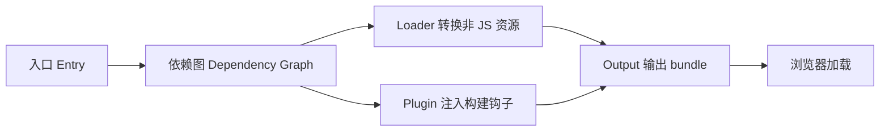
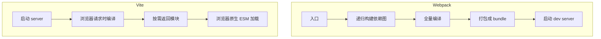
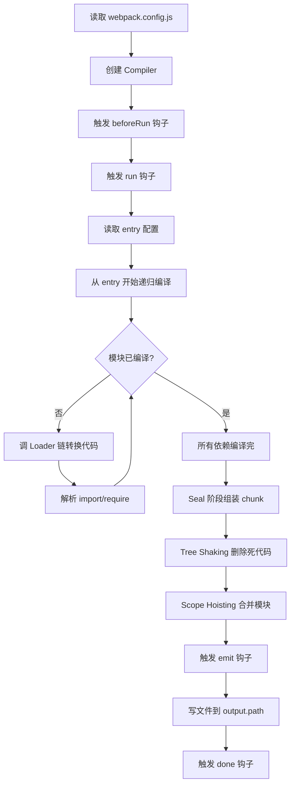
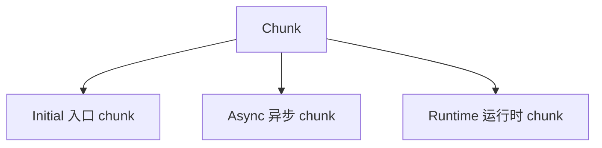
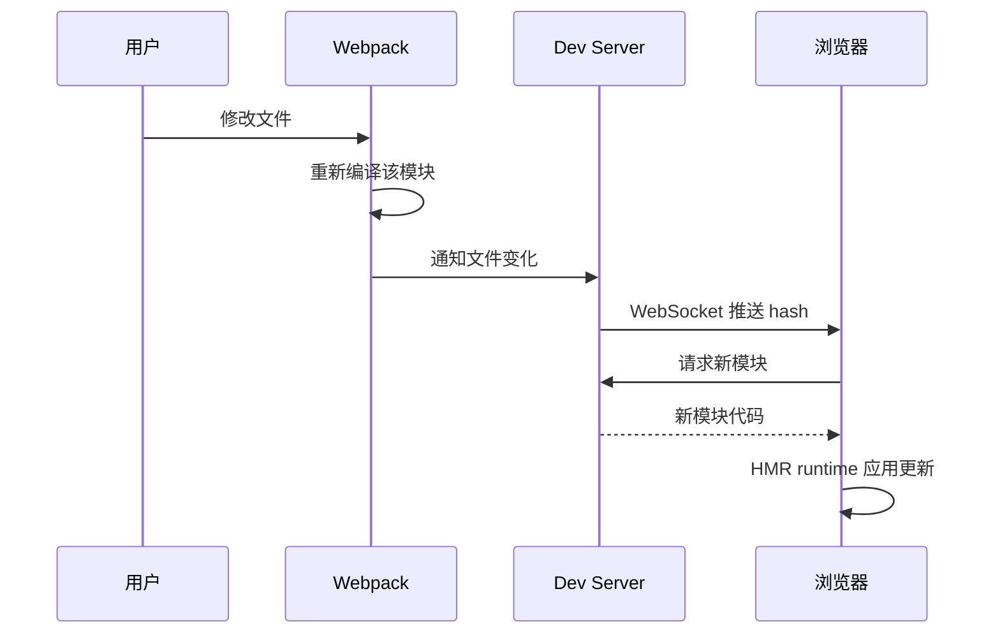
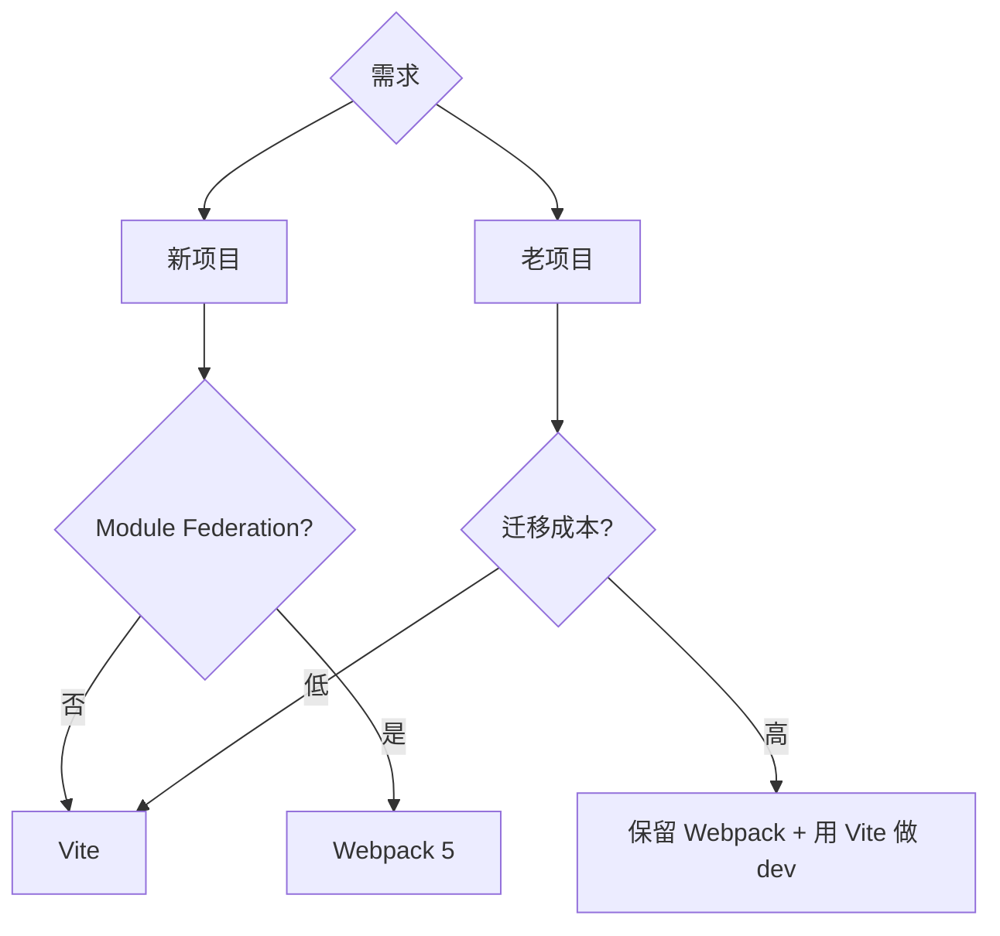

# Webpack 专题 · 核心知识点详解

> 本文档位于 `知识库/前端/04工程化与构建/01Webpack 专题/`，是 Webpack 的核心知识库。配套面试题见《常见面试题与最佳实践.md》。
>
> 读完应能解释清楚"Webpack 的五大核心概念""构建流程三阶段""Loader 与 Plugin 的区别""Tree Shaking 原理""Code Splitting 策略""为什么 Webpack 启动比 Vite 慢"。

---

## 一、Webpack 是什么

### 1.1 定位

Webpack 是由 Tobias Koppers 开发的**模块打包器（module bundler）**，定位为"把任何资源视为模块，按依赖图打包成少量 bundle"。



<!-- -->

- **入口**：构建依赖图的起点。
- **依赖图**：从入口递归扫描 `import/require`，构建完整模块依赖图。
- **Loader**：把非 JS 资源（CSS、PNG、TS）转成 JS 模块。
- **Plugin**：在构建生命周期各阶段注入自定义逻辑。
- **Output**：把打包后的模块输出为 bundle 文件。

### 1.2 设计哲学

- **一切皆模块**：JS、CSS、图片、字体、HTML 都视为模块，能 `import`。
- **按依赖图打包**：从入口递归扫描，构建完整依赖图，输出少量 bundle。
- **Loader 与 Plugin 分离**：Loader 做资源转换，Plugin 做构建流程扩展。

### 1.3 与 Vite 的根本区别



<!-- -->

- **Webpack**：先打包再启动，启动时间随项目规模增长。
- **Vite**：先启动再按需编译，启动时间与项目规模无关。

---

## 二、五大核心概念

### 2.1 Entry（入口）

```js
// webpack.config.js
module.exports = {
  entry: "./src/index.js",  // 单入口

  // 多入口（MPA）
  entry: {
    main: "./src/main.js",
    admin: "./src/admin.js",
  },
};
```

- **单入口**：SPA 应用，输出单个 bundle。
- **多入口**：MPA 或 Code Splitting，输出多个 bundle，每个独立依赖图。

### 2.2 Output（输出）

```js
output: {
  path: path.resolve(__dirname, "dist"),
  filename: "[name].[contenthash:8].js",  // 入口名+内容哈希
  chunkFilename: "[name].[contenthash:8].chunk.js",  // 异步 chunk
  assetModuleFilename: "assets/[hash:8][ext][query]",  // 资源文件
  publicPath: "/",  // 资源 URL 前缀
  clean: true,      // 构建前清空 dist
}
```

- **filename**：入口 chunk 命名，`[name]` 是 entry key、`[contenthash]` 内容哈希。
- **chunkFilename**：异步加载的 chunk 命名。
- **publicPath**：CDN 或子路径部署时的资源前缀。
- **clean**：构建前清空输出目录（替代 clean-webpack-plugin）。

### 2.3 Loader（加载器）

```js
module: {
  rules: [
    {
      test: /\.tsx?$/,
      use: "ts-loader",  // 或 babel-loader
      exclude: /node_modules/,
    },
    {
      test: /\.css$/,
      use: ["style-loader", "css-loader", "postcss-loader"],  // 从右往左
    },
    {
      test: /\.(png|jpg|gif)$/,
      type: "asset/resource",  // Webpack 5 资源模块
    },
    {
      test: /\.svg$/,
      use: ["@svgr/webpack", "url-loader"],
    },
  ],
}
```

- **作用**：把非 JS 资源（CSS/图片/TS）转成 JS 模块。
- **执行顺序**：从右到左、从下到上链式调用。
- **Webpack 5 资源模块**：内置 `asset/resource`、`asset/inline`、`asset/source`，替代 file-loader/url-loader。

### 2.4 Plugin（插件）

```js
const HtmlWebpackPlugin = require("html-webpack-plugin");
const MiniCssExtractPlugin = require("mini-css-extract-plugin");

plugins: [
  new HtmlWebpackPlugin({ template: "./index.html" }),
  new MiniCssExtractPlugin({ filename: "[name].[contenthash:8].css" }),
  new webpack.DefinePlugin({ "process.env.NODE_ENV": JSON.stringify("production") }),
];
```

- **作用**：在构建生命周期各阶段（compile、emit、done 等）注入自定义逻辑。
- **能力范围**：打包优化、资源管理、环境变量注入、HTML 生成等。
- **vs Loader**：Loader 只做"模块代码转换"，Plugin 做"构建流程任意阶段扩展"。

### 2.5 Mode（模式）

```js
module.exports = {
  mode: "development",  // 或 "production" / "none"
};
```

- **development**：开发模式，开启 devtool、NamedChunks、NamedModules。
- **production**：生产模式，自动开启 Tree Shaking、minify、splitChunks。
- **none**：禁用所有优化。

---

## 三、构建流程

### 3.1 三阶段


<!-- -->

1. **初始化（Init）**：合并 CLI 参数与配置文件，创建 Compiler、触发 `beforeRun`/`run` 钩子。
2. **编译（Make）**：从入口开始，递归调用 Loader 编译模块，构建依赖图。
3. **输出（Seal + Emit）**：把模块组装成 chunk，优化 Tree Shaking/Scope Hoisting，输出文件到磁盘。

### 3.2 详细流程



<!-- -->

- **Make 阶段**：从 entry 出发，对每个模块调 Loader 链转换源码，解析其依赖递归处理。
- **Seal 阶段**：组装 chunk（入口 chunk + 异步 chunk + 公共 chunk），优化 Tree Shaking。
- **Emit 阶段**：把最终 chunk 写入磁盘，触发 emit/done 钩子。

### 3.3 Compiler 与 Compilation

- **Compiler**：全局唯一，代表整个 Webpack 实例，全生命周期内复用。`webpack(config)` 返回一个 Compiler。
- **Compilation**：每次构建（watch 模式下每次文件变化）创建一个 Compilation，包含本次构建的模块图、chunk、资源。

```js
class MyPlugin {
  apply(compiler) {
    compiler.hooks.run.tap("MyPlugin", (compilation) => {
      // 每次构建开始
    });
    compiler.hooks.emit.tapAsync("MyPlugin", (compilation, cb) => {
      // 输出前修改资源
      compilation.assets["my.txt"] = { source: () => "hello", size: () => 5 };
      cb();
    });
  }
}
```

---

## 四、Loader 详解

### 4.1 Loader 是什么

Loader 是一个**导出函数的模块**，接收源码字符串，返回转换后的字符串。

```js
// 自定义 Loader：在源码前注入注释
module.exports = function (source) {
  return `/* built at ${new Date().toISOString()} */\n${source}`;
};
```

### 4.2 Loader 链式调用

```js
module: {
  rules: [
    {
      test: /\.scss$/,
      use: [
        "style-loader",       // 4. 把 CSS 插入 DOM
        "css-loader",         // 3. 处理 CSS 的 import/url
        "postcss-loader",     // 2. PostCSS 处理（autoprefixer 等）
        "sass-loader",        // 1. SCSS → CSS
      ],
    },
  ],
}
```

执行顺序：**从右到左、从下到上**。`sass-loader` 先跑、`style-loader` 最后跑。

### 4.3 常用 Loader

| Loader | 作用 |
|---|---|
| `babel-loader` | JS/JSX 转译（ES6+ → ES5） |
| `ts-loader` / `@babel/preset-typescript` | TS → JS |
| `css-loader` | 解析 CSS 的 `@import` 和 `url()` |
| `style-loader` | 把 CSS 注入 DOM `<style>` |
| `postcss-loader` | PostCSS 处理（autoprefixer、Tailwind） |
| `sass-loader` / `less-loader` | SCSS/Less → CSS |
| `file-loader` (v4) / `asset/resource` (v5) | 文件输出 + URL 返回 |
| `url-loader` (v4) / `asset/inline` (v5) | 小文件转 base64 |
| `raw-loader` / `asset/source` (v5) | 文件原内容作为字符串 |
| `@svgr/webpack` | SVG → React 组件 |
| `imports-loader` | 注入全局变量（如 jQuery） |

### 4.4 Webpack 5 资源模块

```js
module: {
  rules: [
    {
      test: /\.(png|jpg|gif)$/,
      type: "asset",  // 自动选择 resource 或 inline
      parser: { dataUrlCondition: { maxSize: 8 * 1024 } },  // <8KB inline
    },
    {
      test: /\.(woff|woff2)$/,
      type: "asset/resource",  // 永远输出文件
      generator: { filename: "fonts/[hash:8][ext]" },
    },
  ],
}
```

- `asset/resource`：输出文件，返回 URL。
- `asset/inline`：转 base64 内联。
- `asset/source`：原文件内容作为字符串。
- `asset`：自动选择（默认 8KB 阈值）。

### 4.5 Loader pitch 阶段

Loader 有两个执行阶段：**pitch**（前置）和 **normal**（正常）。pitch 先于 normal 跑，且从左到右；normal 从右到左。

```js
module.exports = function (source) {
  // normal 阶段
  return source + "// normal";
};

module.exports.pitch = function (remaining, preceding, data) {
  // pitch 阶段，从左到右
  // data 可在 normal 阶段取到
  data.value = "pitch";
  // 返回非 undefined 会跳过后续 loader
};
```

---

## 五、Plugin 详解

### 5.1 Plugin 是什么

Plugin 是一个**带 `apply` 方法的类**，`apply` 接收 Compiler，通过钩子（hooks）注册构建流程任意阶段的回调。

```js
class MyPlugin {
  apply(compiler) {
    compiler.hooks.emit.tapAsync("MyPlugin", (compilation, cb) => {
      console.log("即将输出");
      cb();
    });
  }
}
```

### 5.2 常用钩子

| 钩子 | 阶段 | 用途 |
|---|---|---|
| `beforeRun` / `run` | 构建前 | 初始化 |
| `compile` | 开始编译 | 修改入口 |
| `compilation` | 创建 Compilation | 自定义模块处理 |
| `make` | 解析模块 | 添加自定义模块 |
| `emit` | 输出前 | 修改输出资源 |
| `afterEmit` | 输出后 | 后处理 |
| `done` | 完成 | 通知、统计 |

### 5.3 钩子类型（tapable）

```js
// SyncHook 同步
compiler.hooks.run.tap("MyPlugin", (compilation) => {});

// AsyncSeriesHook 异步串行
compiler.hooks.emit.tapAsync("MyPlugin", (compilation, cb) => { cb(); });
compiler.hooks.emit.tapPromise("MyPlugin", (compilation) => Promise.resolve());

// AsyncParallelHook 异步并行
compiler.hooks.run.tapPromise("MyPlugin", async (compilation) => {});
```

- `tap`：同步钩子。
- `tapAsync`：异步回调钩子（接 `cb`）。
- `tapPromise`：异步 Promise 钩子（返回 Promise）。

### 5.4 常用 Plugin

| Plugin | 作用 |
|---|---|
| `HtmlWebpackPlugin` | 生成 HTML 并注入 bundle |
| `MiniCssExtractPlugin` | 提取 CSS 到独立文件 |
| `CssMinimizerPlugin` | 压缩 CSS |
| `TerserPlugin` | 压缩 JS（默认开启） |
| `DefinePlugin` | 注入环境变量 |
| `ProvidePlugin` | 自动 import（如 jQuery） |
| `CopyWebpackPlugin` | 复制静态文件 |
| `CleanWebpackPlugin` (v4) / `output.clean` (v5) | 清空输出目录 |
| `BundleAnalyzerPlugin` | 包体分析可视化 |
| `HotModuleReplacementPlugin` | HMR（v4 内置） |
| `IgnorePlugin` | 忽略特定模块（如 moment locale） |
| `ContextReplacementPlugin` | 替换模块上下文（动态 import） |

---

## 六、Tree Shaking

### 6.1 原理

```js
// math.js
export function add(a, b) { return a + b; }
export function multiply(a, b) { return a * b; }  // 未使用

// main.js
import { add } from "./math";
console.log(add(1, 2));
```

构建后 `multiply` 被删除——因为 `export` 静态可分析，Webpack 能识别未被 import 的 export 并删除。

### 6.2 触发条件

1. **生产模式**：`mode: "production"`。
2. **ESM**：源码用 `import/export`（CJS 不支持静态分析）。
3. **package.json `sideEffects`**：声明哪些文件有副作用。

```json
{
  "sideEffects": false  // 所有文件无副作用，可大胆删
}
```

```json
{
  "sideEffects": ["./src/polyfill.js", "*.css"]  // 这些有副作用，保留
}
```

### 6.3 副作用

```js
// math.js 有副作用（修改全局）
window.__MATH_VERSION = "1.0";
export function add(a, b) { return a + b; }
```

即使 `add` 没被 import，文件本身有副作用（修改 window），不能整体删除。`sideEffects: false` 是承诺"无副作用"，Webpack 才会删整个文件。

### 6.4 验证

```bash
# 看哪些 export 被标记为 unused
npx webpack --json --profile > stats.json

# 用 BundleAnalyzer 可视化
const { BundleAnalyzerPlugin } = require("webpack-bundle-analyzer");
plugins: [new BundleAnalyzerPlugin()]
```

---

## 七、Code Splitting

### 7.1 三种方式

```js
// 1. 入口配置
entry: { main: "./main.js", admin: "./admin.js" }

// 2. 动态 import
const Page = lazy(() => import(/* webpackChunkName: "page" */ "./Page"));

// 3. splitChunks 自动拆分
optimization: {
  splitChunks: {
    chunks: "all",  // 同步+异步都拆
    cacheGroups: {
      vendors: {
        test: /[\\/]node_modules[\\/]/,
        name: "vendors",
        chunks: "all",
      },
    },
  },
}
```

### 7.2 splitChunks 配置

```js
optimization: {
  splitChunks: {
    chunks: "all",          // initial(同步)/async(异步)/all(全部)
    minSize: 20000,         // 最小 20KB 才拆
    maxSize: 244000,        // 超过 244KB 进一步拆
    minChunks: 1,           // 至少被引用 1 次
    maxAsyncRequests: 30,   // 异步 chunk 最大请求数
    maxInitialRequests: 30,// 入口 chunk 最大请求数
    automaticNameDelimiter: "~",
    cacheGroups: {
      vendors: {
        test: /[\\/]node_modules[\\/]/,
        priority: -10,
        name: "vendors",
      },
      default: {
        minChunks: 2,
        priority: -20,
        reuseExistingChunk: true,
      },
    },
  },
}
```

### 7.3 chunk 类型



<!-- -->

- **Initial**：入口对应的 chunk（如 `main.js`）。
- **Async**：动态 import 拆出的 chunk（如 `page.[hash].chunk.js`）。
- **Runtime**：Webpack 运行时代码，可单独拆出（`optimization.runtimeChunk`）。

```js
optimization: {
  runtimeChunk: "single",  // 把 runtime 拆成单文件，长期缓存
}
```

---

## 八、HMR（热模块替换）

### 8.1 原理



<!-- -->

- **Webpack**：监听文件变化，重编译该模块及其依赖，生成 hot-update.json 和 hot-update.js。
- **Dev Server**：通过 WebSocket 通知浏览器新 hash。
- **浏览器**：拉取 hot-update 资源，调 HMR runtime 应用更新。
- **accept**：业务代码注册 `module.hot.accept` 决定如何应用更新。

```js
if (module.hot) {
  module.hot.accept("./App", () => {
    // App 变了，重新渲染
    const NextApp = require("./App").default;
    render(NextApp);
  });
}
```

### 8.2 框架级 HMR

React 用 `react-refresh`（@pmmmwh/react-loader），自动注入 HMR 接收，保留组件 state。Vue 用 `vue-loader` 类似。

### 8.3 与 Vite HMR 对比

| 维度 | Webpack | Vite |
|---|---|---|
| 改文件 | 重编译该模块+依赖链 | 只编译该模块 |
| 通知 | WebSocket push hash | WebSocket push 路径 |
| 加载 | 拉取 hot-update chunk | 拉取新模块 |
| 速度 | 随项目规模变慢 | 与规模解耦 |

---

## 九、优化策略

### 9.1 构建速度优化

```js
// 1. 开发期缓存
module: {
  rules: [
    {
      test: /\.tsx?$/,
      use: [{
        loader: "babel-loader",
        options: { cacheDirectory: true },  // 缓存编译结果
      }],
    },
  ],
}

// 2. 多线程编译
module: {
  rules: [{
    test: /\.tsx?$/,
    use: "thread-loader",  // 把 babel/ts loader 放线程池
  }],
}

// 3. exclude 排除
{ test: /\.js$/, exclude: /node_modules/, use: "babel-loader" }

// 4. resolve.alias 缩短依赖解析
resolve: { alias: { "@": path.resolve("src") } }

// 5. dll 预编译（v4）/ 持久化缓存（v5）
// v5 推荐用 cache: { type: "filesystem" }
cache: { type: "filesystem", buildDependencies: { config: ["./webpack.config.js"] } }
```

### 9.2 产物体积优化

```js
// 1. Tree Shaking（production 默认开）
mode: "production"

// 2. splitChunks 拆 vendor 长期缓存
optimization: {
  splitChunks: {
    chunks: "all",
    cacheGroups: {
      reactVendor: {
        test: /[\\/]node_modules[\\/](react|react-dom)[\\/]/,
        name: "react-vendor",
      },
    },
  },
}

// 3. CSS 提取 + 压缩
plugins: [new MiniCssExtractPlugin()]
optimization: { minimizer: [new CssMinimizerPlugin()] }

// 4. 动态 import 按路由拆 chunk
const Page = lazy(() => import("./Page"));

// 5. IgnorePlugin 忽略大依赖的子模块
plugins: [
  new webpack.IgnorePlugin({
    resourceRegExp: /^\.\/locale$/,
    contextRegExp: /moment$/,
  }),  // 忽略 moment 的 locale，省 200KB
]

// 6. externals 用 CDN
externals: { react: "React", "react-dom": "ReactDOM" }
```

### 9.3 Webpack 5 持久化缓存

```js
cache: {
  type: "filesystem",
  cacheLocation: path.resolve(__dirname, ".cache/webpack"),
  buildDependencies: {
    config: [__filename],  // config 变化时缓存失效
  },
}
```

第二次构建从缓存读取，构建速度可提升 50-90%。

### 9.4 Module Federation（v5）

```js
// app1 (host) webpack.config.js
new ModuleFederationPlugin({
  remotes: {
    app2: "app2@http://localhost:3001/remoteEntry.js",
  },
})

// app2 (remote) webpack.config.js
new ModuleFederationPlugin({
  name: "app2",
  filename: "remoteEntry.js",
  exposes: {
    "./Button": "./src/Button",
  },
  shared: ["react", "react-dom"],
})
```

```js
// app1 业务代码
import Button from "app2/Button";  // 直接 import 远程模块
```

Module Federation 让多个独立 Webpack 应用在运行时共享模块——微前端方案之一。

---

## 十、Dev Server 配置

### 10.1 webpack-dev-server

```js
const { merge } = require("webpack-merge");

module.exports = merge(commonConfig, {
  mode: "development",
  devtool: "eval-cheap-module-source-map",
  devServer: {
    port: 3000,
    open: true,
    hot: true,  // HMR
    compress: true,  // gzip
    historyApiFallback: true,  // SPA fallback
    proxy: {
      "/api": {
        target: "http://localhost:8080",
        changeOrigin: true,
        pathRewrite: { "^/api": "" },
      },
    },
    static: {
      directory: path.join(__dirname, "public"),
      watch: true,
    },
    client: {
      overlay: { errors: true, warnings: false },  // 编译错误覆盖层
    },
  },
  plugins: [new ReactRefreshWebpackPlugin()],
});
```

### 10.2 devtool 选项

| devtool | 速度 | 质量 | 用途 |
|---|---|---|---|
| `eval` | 最快 | 行级 | 初步开发 |
| `eval-cheap-source-map` | 快 | 行级 | 推荐开发 |
| `eval-cheap-module-source-map` | 快 | 行级 | 推荐 TS |
| `source-map` | 慢 | 行+列 | 生产 |
| `cheap-source-map` | 中 | 行级 | 兼顾 |
| `hidden-source-map` | 慢 | 行+列 | 生产（不暴露 source map） |
| `nosources-source-map` | 慢 | 行+列 | 生产（不暴露源码） |

- **开发**：`eval-cheap-module-source-map`（最快 + TS 友好）。
- **生产**：`source-map` 或 `hidden-source-map`（不外露给浏览器）。

---

## 十一、配置文件组织

### 11.1 环境分离

```
config/
├── webpack.common.js
├── webpack.dev.js
├── webpack.prod.js
└── webpack.analyze.js
```

```js
// webpack.common.js
const { merge } = require("webpack-merge");
module.exports = {
  entry: "./src/index.tsx",
  output: { filename: "[name].[contenthash:8].js" },
  resolve: { extensions: [".tsx", ".ts", ".js"] },
  module: { rules: [/* 通用 rules */] },
  plugins: [/* 通用 plugin */],
};

// webpack.dev.js
const { merge } = require("webpack-merge");
const common = require("./webpack.common");
module.exports = merge(common, {
  mode: "development",
  devtool: "eval-cheap-module-source-map",
  devServer: { /* dev server 配置 */ },
});

// webpack.prod.js
const { merge } = require("webpack-merge");
const common = require("./webpack.common");
module.exports = merge(common, {
  mode: "production",
  devtool: "hidden-source-map",
  optimization: { minimize: true },
  plugins: [new MiniCssExtractPlugin()],
});
```

```json
// package.json
{
  "scripts": {
    "dev": "webpack serve --config config/webpack.dev.js",
    "build": "webpack --config config/webpack.prod.js",
    "analyze": "webpack --config config/webpack.analyze.js"
  }
}
```

---

## 十二、与 Vite 对比

### 12.1 全维度对比

| 维度 | Webpack | Vite |
|---|---|---|
| 启动速度 | 慢（分钟级） | 快（秒级） |
| HMR 速度 | 随项目规模变慢 | 与规模解耦 |
| 开发期打包 | 全量打包 | 不打包 |
| 生产打包 | 自身 | Rollup |
| 配置复杂度 | 高 | 低 |
| 插件生态 | 庞大（Loader + Plugin） | Rollup + Vite 专属 |
| Tree Shaking | 良好 | Rollup 原生最佳 |
| Code Splitting | 强（splitChunks） | 强（Rollup manualChunks） |
| Module Federation | 原生支持 | 不支持 |
| CSS Modules | 内置 | 内置 |
| HMR 状态保留 | 框架级 | 框架级 |
| 老浏览器兼容 | 内置 | 需 plugin-legacy |

### 12.2 选型建议



<!-- -->

- **新项目无 MF 需求**：选 Vite。
- **新项目有 MF 需求**：Webpack 5。
- **老 Webpack 项目**：渐进迁移，或保留 Webpack build + 用 Vite 做 dev。
- **复杂 Loader 链**：Webpack。

---

## 十三、常见陷阱与修复

### 13.1 CSS 中 url() 路径错误

```css
/* 错：相对于源文件的路径 */
background: url("./logo.png");

/* 对：相对于 publicPath */
background: url("/assets/logo.png");
```

`css-loader` 默认把 `url()` 当模块处理，路径相对当前文件。publicPath 与 file-loader 输出路径要一致。

### 13.2 第三方依赖 CJS 与 ESM 不兼容

```js
// 错：some-lib 是 CJS，import 报错
import { foo } from "some-lib";
```

修复：用 `@babel/plugin-transform-modules-commonjs` 或换 ESM 版本，或 `optimizeDeps.include` 显式声明。

### 13.3 import 路径大小写

```js
// 在 Windows 能跑，部署到 Linux 报错
import Button from "./Components/Button";  // 实际目录是 components
```

修复：开启 `resolve.extensionAlias` 或用 `case-sensitive-paths-webpack-plugin`。

### 13.4 splitChunks 公共 chunk 过大

```js
// 错：所有 vendor 拆一个 chunk，太大
cacheGroups: { vendors: { test: /node_modules/ } }

// 对：按业务拆
cacheGroups: {
  reactVendor: { test: /react|react-dom/, name: "react-vendor" },
  echartsVendor: { test: /echarts/, name: "echarts-vendor" },
}
```

### 13.5 dev 与 build 行为不一致

dev 期用 `eval-cheap-source-map`，build 期用 `hidden-source-map`。某些依赖在 dev（无 minify）能跑、build（minify）报错——多半是 minify 把全局变量改名了。修复：`terserOptions.keep_classnames: true`。

---

## 十四、最佳实践 Checklist

### 14.1 配置

- `mode` 与 NODE_ENV 一致
- `devtool` dev 用 `eval-cheap-module-source-map`、prod 用 `hidden-source-map`
- `output.filename` 用 `[contenthash]` 长期缓存
- `output.clean: true` 构建前清空
- `resolve.alias` 与 tsconfig.paths 同步
- `resolve.extensions` 列表短而准

### 14.2 性能

- dev 用 `cache: { type: "filesystem" }` 持久化缓存
- babel-loader `cacheDirectory: true`
- `thread-loader` 多线程编译大项目
- `exclude: /node_modules/` 避免转译
- production 用 `terser` + `css-minimizer`
- `splitChunks` 拆 vendor
- `optimization.runtimeChunk: "single"`

### 14.3 代码质量

- Tree Shaking：`mode: "production"` + `sideEffects: false`
- 动态 import 按路由拆 chunk
- 路由懒加载 + Suspense
- `BundleAnalyzerPlugin` 分析包体

### 14.4 部署

- publicPath 与部署路径一致
- 资源哈希命名
- gzip/brotli 预压缩
- CDN 外部化大依赖（externals）
- PWA（WorkboxWebpackPlugin）

---

## 十五、一句话总纲

> Webpack 的本质是 **"一切皆模块，按依赖图打包成 bundle"**：dev 期全量打包让启动随项目规模变慢、用 Loader 链转换非 JS 资源、用 Plugin 在构建生命周期注入扩展、用 Tree Shaking（依赖 ESM 静态分析 + sideEffects）删死代码、用 splitChunks 拆 vendor 长期缓存、用 Module Federation 实现运行时微前端共享。能答出"五大核心概念""构建三阶段""Loader 与 Plugin 区别""Tree Shaking 触发条件""Code Splitting 三种方式""为什么启动比 Vite 慢"，就是高级前端对 Webpack 的认知。
