# Vite 专题 · 核心知识点详解

> 本文档位于 `知识库/前端/04工程化与构建/02Vite 专题/`，是 Vite 的核心知识库。配套面试题见《常见面试题与最佳实践.md》。
>
> 读完应能解释清楚"为什么 Vite 启动比 Webpack 快两个数量级""预构建解决了什么问题""为什么生产构建换成 Rollup""HMR 边界是什么"，并能在工程中独立配置 alias、代理、环境变量、插件、库模式。

---

## 一、Vite 是什么

### 1.1 定位

Vite 是由 Evan You（Vue 作者）开发的**新一代前端构建工具**，定位为"开发服务器 + 生产构建器"一体化方案。

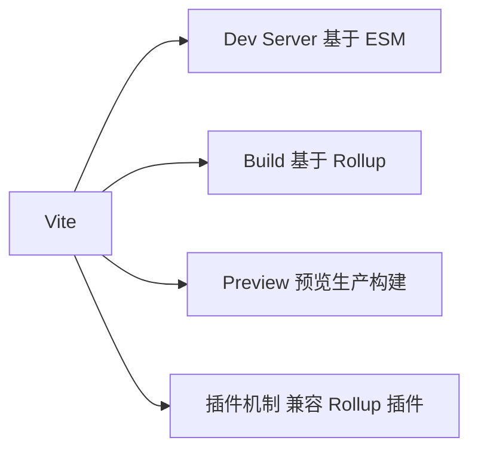

<!-- -->

- **Dev**：基于浏览器原生 ESM 的开发服务器，启动速度与项目规模**解耦**。
- **Build**：生产构建基于 Rollup，输出优化后的静态资源。
- **Preview**：本地预览生产构建产物，验证打包后行为。
- **插件**：兼容 Rollup 插件生态，并扩展 Vite 专属 API。

### 1.2 设计动机：传统构建的痛点

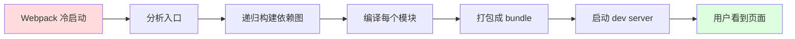

<!-- -->

传统 Webpack 冷启动慢的根因：

- **打包式启动**：必须先构建完整依赖图、编译所有模块、打包成 bundle，才能启动 dev server。
- **启动时间随项目规模线性增长**：项目越大，冷启动越慢，分钟级启动在中大型项目常见。
- **HMR 慢**：改动一个文件，理论上只需更新该模块，但 Webpack 仍需重新构建该模块及其依赖链。

Vite 的核心思路是**"开发期不打包，按需编译"**。

### 1.3 Vite 的速度哲学

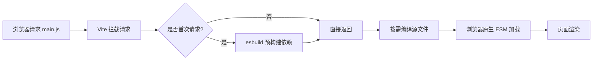

<!-- -->

- **依赖预构建**：第三方依赖（node_modules）用 esbuild 预构建成 ESM，速度比 Webpack 快 10-100 倍。
- **源码按需编译**：源文件（src）只在浏览器请求时才编译，未访问的文件不处理。
- **原生 ESM**：开发期直接利用浏览器 ESM 加载，Vite 只做"中间人"拦截、转译、按需返回。

---

## 二、核心原理：基于 ESM 的 Dev Server

### 2.1 浏览器原生 ESM

现代浏览器原生支持 `<script type="module">`，能直接通过 HTTP 请求加载 ES 模块：

```html
<script type="module" src="/main.js"></script>
```

浏览器看到 `import` 语句时，会自动发起 HTTP 请求获取依赖模块。Vite 就是利用这一点——**让浏览器自己来"打包"模块依赖图**，Vite 只需在请求到达时返回正确内容。

### 2.2 Vite Dev Server 工作流程

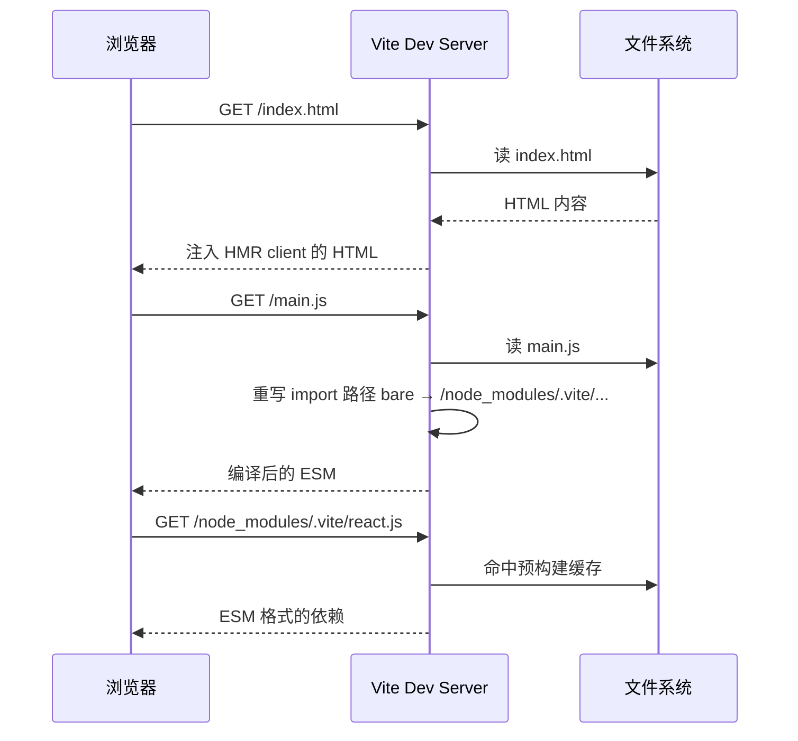

<!-- -->

关键步骤：

1. **HTML 注入**：Vite 在返回的 `index.html` 中注入 HMR client（`/@vite/client`），建立 WebSocket 连接。
2. **源码重写**：源文件中的 `import React from "react"`（bare import）被重写成 `import React from "/node_modules/.vite/react.js"`，让浏览器能直接请求到预构建产物。
3. **按需编译**：每个源文件首次请求时才被 esbuild/自研 parser 编译，结果缓存到内存。
4. **依赖走预构建产物**：`node_modules` 依赖已被 esbuild 预构建成 ESM 格式缓存到 `.vite` 目录。

### 2.3 启动速度对比

| 工具 | 冷启动方式 | 中型项目启动 |
|---|---|---|
| Webpack | 全量构建依赖图 | 30s - 2min |
| Vite | 启动 server + 预构建依赖 | 1s - 3s |

Vite 的启动时间几乎**与项目规模无关**——因为它不需要遍历依赖图，只在浏览器请求时才处理。

### 2.4 HMR 原理

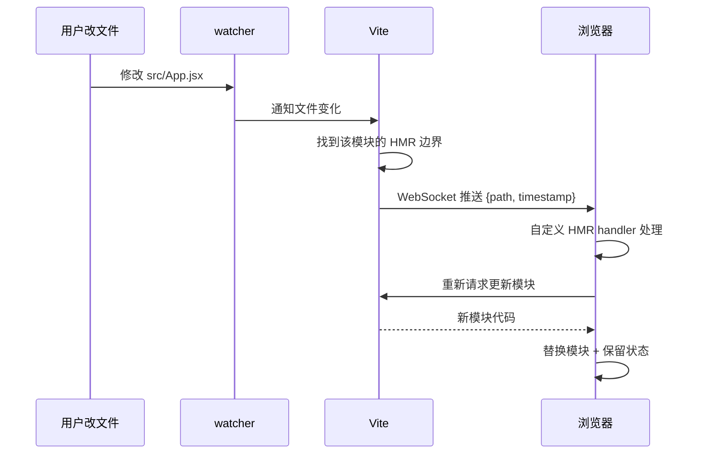

<!-- -->

- **HMR 边界**：一个模块被修改后，Vite 沿着导入链向上找到最近一个"接受了 HMR"的模块（`import.meta.hot.accept`），在此边界内替换而不刷新整页。
- **状态保留**：边界内组件的 state 默认会被重置，但通过 React Refresh / Vue HMR 等可保留组件状态。
- **精细失效**：只重载受影响的模块，而非整个 bundle——所以 HMR 速度与项目规模**也解耦**。

```js
// 自定义 HMR 接收
import { foo } from "./foo";

if (import.meta.hot) {
  import.meta.hot.accept("./foo", (newMod) => {
    // foo 变了，但页面不刷新
    console.log("foo updated", newMod.foo);
  });
}
```

---

## 三、预构建（Dependency Pre-Bundling）

### 3.1 为什么需要预构建

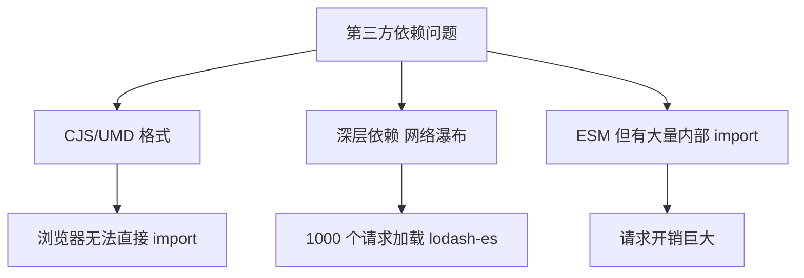

<!-- -->

第三方依赖存在三类问题：

1. **格式问题**：很多依赖是 CJS/UMD 格式，浏览器原生 ESM 无法直接 `import`。
2. **请求瀑布**：如 `lodash-es` 内部有 600+ 个小模块，浏览器逐个请求会形成请求瀑布。
3. **重复请求**：多入口共享同一依赖时，浏览器会重复请求同一模块。

### 3.2 预构建做的事


<!-- -->

- **入口扫描**：Vite 从 `index.html` 入口递归扫描 `import`，找出所有 bare import（`react`、`vue` 等）。
- **esbuild 打包**：用 esbuild（Go 编写，速度极快）把每个依赖及其传递依赖打包成单个 ESM 文件。
- **缓存**：预构建产物缓存到 `node_modules/.vite/deps`，浏览器请求时直接返回。
- **源码重写**：源文件中 `import React from "react"` 被重写到 `/node_modules/.vite/deps/react.js`。

### 3.3 为什么用 esbuild 而不是 Webpack/Rollup

| 维度 | esbuild | Webpack | Rollup |
|---|---|---|---|
| 语言 | Go | JS | JS |
| 速度 | 10-100x | 1x | 0.5-2x |
| 产物 | ESM/CJS | 任意 | ESM 优先 |
| 插件 | 简单 | 丰富 | 丰富 |

预构建阶段只做"格式转换 + 合并打包"，不需要复杂的插件生态，所以选最快者——esbuild。

### 3.4 触发重新预构建

预构建缓存失效条件：

- `package.json` 的 `dependencies` 字段变化。
- `lockfile`（pnpm-lock.yaml / package-lock.json）变化。
- `vite.config.ts` 中 `optimizeDeps` 配置变化。

强制重新预构建：

```bash
# 删除缓存
rm -rf node_modules/.vite

# 或启动时加参数
vite --force
```

### 3.5 显式声明预构建依赖

某些依赖（如动态 import、CSS 中的 URL）无法被入口扫描发现，需显式声明：

```js
// vite.config.ts
export default defineConfig({
  optimizeDeps: {
    include: ["lodash-es", "dayjs", "echarts/core"],
    exclude: ["@electron/remote"],  // 不预构建（如 Electron-only 依赖）
  },
});
```

---

## 四、生产构建：基于 Rollup

### 4.1 为什么生产不直接用 ESM

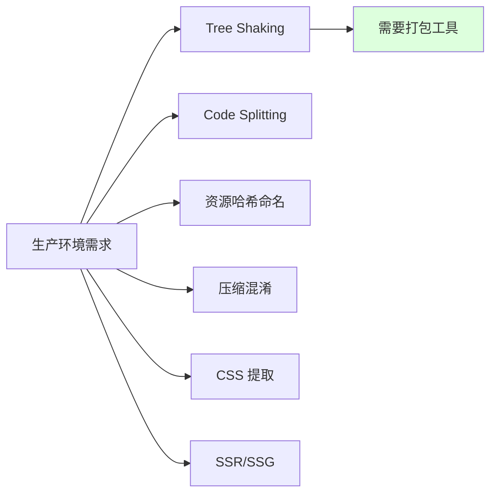

<!-- -->

开发期 Vite 不打包，但生产必须有打包步骤，因为：

- **加载性能**：成千上万个 ESM 请求在生产环境会形成瀑布，必须打包成少量 chunk。
- **Tree Shaking**：删除未使用代码，减小产物体积。
- **Code Splitting**：按路由/动态 import 拆分 chunk，按需加载。
- **资源优化**：压缩、哈希命名、CSS 提取、图片转 base64 等。

### 4.2 为什么选 Rollup 而不是 Webpack

| 维度 | Rollup | Webpack |
|---|---|---|
| 产物 | ESM 优先，干净简洁 | 多格式，但 ESM 支持弱 |
| Tree Shaking | 原生支持，效果最佳 | 需配置，效果次之 |
| 插件 | 插件 API 简洁 | Loader + Plugin 复杂 |
| 速度 | 中等 | 慢 |
| 输出体积 | 小 | 大 |

Vite 选 Rollup 因为它**输出 ESM 干净、Tree Shaking 效果最好**——契合现代浏览器 ESM 优先的趋势。Vite 也用 esbuild 做压缩（minify），保持速度。

### 4.3 构建流程

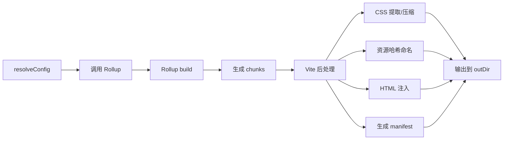

<!-- -->

1. **resolveConfig**：合并默认配置、用户配置、命令参数。
2. **Rollup build**：调用 Rollup API，根据入口构建模块图。
3. **chunk 生成**：Rollup 输出多个 chunk（入口 chunk + 异步 chunk + 公共 chunk）。
4. **Vite 后处理**：CSS 提取、资源哈希、HTML 注入、生成 manifest。
5. **输出**：写入 `dist`（或自定义 `outDir`）。

### 4.4 Base 目录与部署

```js
export default defineConfig({
  base: "/my-app/",  // 部署在子路径时必填
  build: {
    outDir: "dist",
    assetsDir: "assets",  // 资源子目录
  },
});
```

`base` 决定所有静态资源的 URL 前缀。部署到 `https://example.com/my-app/` 时必须设 `base: "/my-app/"`，否则资源 404。

### 4.5 资源哈希与缓存

Vite 默认对 JS/CSS/图片等资源文件名加内容哈希：

```
dist/assets/index-a1b2c3d4.js
dist/assets/index-e5f6g7h8.css
```

哈希基于文件内容，内容变则哈希变，内容不变则哈希不变——浏览器可永久缓存，发版时只有变化的文件被重新下载。

---

## 五、配置详解：vite.config.ts

### 5.1 配置文件结构

```ts
import { defineConfig, loadEnv } from "vite";
import react from "@vitejs/plugin-react";
import path from "node:path";

export default defineConfig(({ command, mode }) => {
  const env = loadEnv(mode, process.cwd(), "");
  return {
    // 1. 基础
    root: process.cwd(),
    base: "/",
    publicDir: "public",

    // 2. 解析
    resolve: {
      alias: {
        "@": path.resolve(__dirname, "src"),
      },
      extensions: [".ts", ".tsx", ".js", ".jsx", ".json"],
    },

    // 3. 插件
    plugins: [react()],

    // 4. Dev Server
    server: {
      port: 5173,
      open: true,
      proxy: {
        "/api": {
          target: "http://localhost:3000",
          changeOrigin: true,
          rewrite: (p) => p.replace(/^\/api/, ""),
        },
      },
    },

    // 5. 构建
    build: {
      outDir: "dist",
      sourcemap: false,
      target: "es2018",
      chunkSizeWarningLimit: 500,
      rollupOptions: {
        output: {
          manualChunks: {
            "react-vendor": ["react", "react-dom"],
            "utils-vendor": ["lodash-es", "dayjs"],
          },
        },
      },
    },

    // 6. 环境变量
    envPrefix: ["VITE_", "APP_"],

    // 7. 预构建
    optimizeDeps: {
      include: ["lodash-es"],
    },

    // 8. CSS
    css: {
      preprocessorOptions: {
        scss: { additionalData: `@import "@/styles/vars.scss";` },
      },
    },

    // 9. SSR
    ssr: {
      external: ["fs", "path"],
    },
  };
});
```

### 5.2 command 与 mode

```ts
export default defineConfig(({ command, mode }) => {
  // command: "serve" (vite) | "build" (vite build)
  // mode: "development" | "production" | "staging" | 自定义
  if (command === "serve") {
    return devConfig;  // dev 专属配置
  }
  return buildConfig;  // build 专属配置
});
```

- **command**：`vite` 命令为 `serve`，`vite build` 为 `build`——可借此区分 dev/prod 配置。
- **mode**：默认 `serve` 时为 `development`，`build` 时为 `production`；可用 `--mode staging` 覆盖。

### 5.3 环境变量

Vite 默认加载项目根的 `.env`、`.env.[mode]`、`.env.local`、`.env.[mode].local`。

```bash
# .env
VITE_API_BASE=https://api.example.com

# .env.staging
VITE_API_BASE=https://staging-api.example.com
```

```ts
// 客户端代码访问
const apiBase = import.meta.env.VITE_API_BASE;
```

- **客户端可见前缀**：默认只有 `VITE_` 开头的变量暴露给客户端代码（防泄漏敏感信息）。
- **自定义前缀**：`envPrefix: ["VITE_", "APP_"]` 让 `APP_` 也可见。
- **process.env 不可用**：客户端代码不能用 `process.env`（除非在 `define` 里手动替换）。

```ts
// 在配置文件中访问所有变量（不限前缀）
export default defineConfig(({ mode }) => {
  const env = loadEnv(mode, process.cwd(), "");  // 空字符串 = 全部变量
  return {
    define: {
      __APP_VERSION__: JSON.stringify(env.npm_package_version),
    },
  };
});
```

### 5.4 resolve.alias 与路径别名

```ts
resolve: {
  alias: {
    "@": path.resolve(__dirname, "src"),
    "components": path.resolve(__dirname, "src/components"),
  },
}
```

```ts
// 别名生效
import Button from "@/components/Button";
import Card from "components/Card";
```

别名让 import 路径更稳定、更短，重构目录时只改配置不动业务代码。

---

## 六、插件机制

### 6.1 插件 API

Vite 插件基于 Rollup 插件接口扩展，新增 Vite 专属钩子：

```ts
import type { Plugin } from "vite";

export function myPlugin(): Plugin {
  return {
    name: "my-plugin",
    // Rollup 钩子
    resolveId(source, importer) { /* 解析 import */ },
    load(id) { /* 加载模块 */ },
    transform(code, id) { /* 转换代码 */ },

    // Vite 专属钩子
    config(config, { command, mode }) { /* 修改 vite config */ },
    configResolved(resolvedConfig) { /* 读取最终 config */ },
    configureServer(server) { /* 配置 dev server 中间件 */ },
    transformIndexHtml(html) { /* 修改 index.html */ },
    handleHotUpdate(ctx) { /* 自定义 HMR */ },
  };
}
```

### 6.2 钩子执行顺序

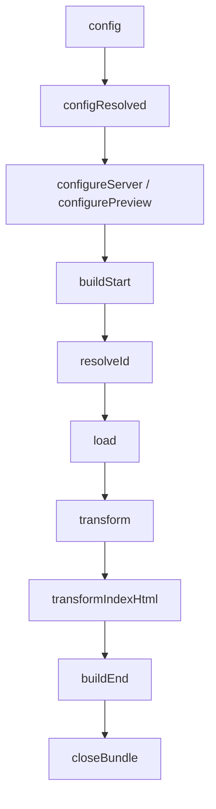

<!-- -->

- **config**：最早执行，用于修改用户传入的 vite config。
- **configureServer**：dev 期配置中间件，可挂自定义路由。
- **transformIndexHtml**：转换 HTML，注入 script、meta 等。
- **resolveId / load / transform**：Rollup 标准钩子，处理模块解析与转换。
- **handleHotUpdate**：自定义 HMR 逻辑。

### 6.3 enforce 与 apply 控制顺序

```ts
export default {
  plugins: [
    { name: "a", enforce: "pre", apply: "build" },
    { name: "b", enforce: "post", apply: "serve" },
    { name: "c" },  // normal，dev+build 都跑
  ],
};
```

- **enforce**：`pre` 在 Vite 核心插件前跑，`post` 在其后跑，默认 normal。
- **apply**：`build` 只在构建时跑，`serve` 只在 dev 时跑，默认两者都跑。

### 6.4 常用官方插件

| 插件 | 作用 |
|---|---|
| `@vitejs/plugin-react` | React Fast Refresh、JSX 转换 |
| `@vitejs/plugin-vue` | Vue SFC 编译 |
| `@vitejs/plugin-legacy` | 老浏览器兼容（生成 polyfill chunk） |
| `vite-plugin-pwa` | PWA 离线缓存 |
| `vite-plugin-compression` | gzip/brotli 压缩 |
| `vite-plugin-svg-icons` | SVG 雪精灵 |
| `vite-plugin-static-copy` | 复制静态文件 |

### 6.5 虚拟模块

插件可声明"虚拟模块"，让业务代码 import 不存在的文件：

```ts
export function virtualEnvPlugin(): Plugin {
  const virtualModuleId = "virtual:env";
  const resolvedVirtualModuleId = "\0" + virtualModuleId;
  return {
    name: "virtual-env",
    resolveId(id) {
      if (id === virtualModuleId) return resolvedVirtualModuleId;
    },
    load(id) {
      if (id === resolvedVirtualModuleId) {
        return `export default ${JSON.stringify({ nodeEnv: process.env.NODE_ENV })}`;
      }
    },
  };
}
```

```ts
// 业务代码
import env from "virtual:env";
console.log(env.nodeEnv);
```

---

## 七、常见场景配置

### 7.1 路径别名（TS 同步）

```ts
// vite.config.ts
resolve: {
  alias: { "@": path.resolve(__dirname, "src") }
}

// tsconfig.json
{
  "compilerOptions": {
    "paths": { "@/*": ["src/*"] }
  }
}
```

两边都要配置：Vite 负责运行时解析，TS 负责类型检查。

### 7.2 代理后端 API

```ts
server: {
  proxy: {
    "/api": {
      target: "http://localhost:3000",
      changeOrigin: true,
      rewrite: (p) => p.replace(/^\/api/, ""),
    },
    "/ws": {
      target: "ws://localhost:3000",
      ws: true,  // WebSocket 代理
    },
  },
}
```

业务代码 `fetch("/api/users")` → 实际请求 `http://localhost:3000/users`，避免跨域。

### 7.3 多入口（MPA）

```ts
// 默认 SPA：仅 index.html
// MPA：rollupOptions.input 指定多个 HTML
build: {
  rollupOptions: {
    input: {
      main: path.resolve(__dirname, "index.html"),
      about: path.resolve(__dirname, "about/index.html"),
      admin: path.resolve(__dirname, "admin/index.html"),
    },
  },
}
```

### 7.4 库模式（Library Mode）

打包可发布的 npm 库：

```ts
// vite.config.ts
export default defineConfig({
  build: {
    lib: {
      entry: path.resolve(__dirname, "src/index.ts"),
      name: "MyLib",  // UMD 全局变量名
      fileName: (format) => `my-lib.${format}.js`,
      formats: ["es", "umd"],
    },
    rollupOptions: {
      external: ["react", "react-dom"],  // 不打包 peer deps
      output: {
        globals: { react: "React", "react-dom": "ReactDOM" },
      },
    },
  },
});
```

```json
// package.json
{
  "name": "my-lib",
  "main": "./dist/my-lib.umd.js",
  "module": "./dist/my-lib.es.js",
  "exports": {
    ".": {
      "import": "./dist/my-lib.es.js",
      "require": "./dist/my-lib.umd.js"
    }
  },
  "peerDependencies": { "react": ">=17" }
}
```

### 7.5 静态资源处理

```ts
// 显式 import（推荐）
import logoUrl from "@/assets/logo.png";
;

// public 目录（不参与构建）
// public/favicon.ico → 访问 /favicon.ico
;

// 内联为 base64（小于 4KB 默认）
import smallIcon from "@/assets/icon.png";  // 小图自动 base64

// 修改阈值
build: { assetsInlineLimit: 4096 }
```

### 7.6 SSR 配置

```ts
export default defineConfig({
  server: { middlewareMode: true },  // 作为中间件
  build: {
    ssr: "src/entry-server.ts",  // SSR 入口
    outDir: "dist/server",
  },
  ssr: {
    external: ["express"],  // 不打包 SSR-only 依赖
  },
});
```

---

## 八、性能优化

### 8.1 dev 期优化

```ts
export default defineConfig({
  optimizeDeps: {
    include: ["lodash-es"],  // 显式预构建未发现的依赖
    exclude: ["electron"],  // 排除不用的
  },
  server: {
    fs: { strict: false },  // 允许访问工作区外文件
    hmr: { overlay: false },  // 关闭错误覆盖层
  },
});
```

- **预构建 include**：动态 import 的依赖手动加入，避免首次访问时二次预构建。
- **关闭 HMR overlay**：错误覆盖层在某些场景（如 Electron）干扰开发，可关。

### 8.2 build 期优化

```ts
build: {
  target: "es2018",  // 升级 target，少 transpile
  minify: "esbuild",  // esbuild 比 terser 快 10x
  cssCodeSplit: true,  // 拆分 CSS
  rollupOptions: {
    output: {
      manualChunks: {
        "react-vendor": ["react", "react-dom"],
        "echarts-vendor": ["echarts"],
      },
      chunkFileNames: (chunkInfo) => {
        // 业务 chunk 用语义化命名
        return chunkInfo.name === "index"
          ? "assets/[name]-[hash].js"
          : "assets/[name]-[hash].js";
      },
    },
  },
}
```

- **target 升级**：现代浏览器都支持 ES2018+，少 transpile 让产物更小。
- **esbuild minify**：比 terser 快 10 倍，体积略大但可接受。
- **manualChunks**：把 vendor 拆出来，长期缓存不变。

### 8.3 包体分析

```bash
# 安装
pnpm add -D rollup-plugin-visualizer
```

```ts
// vite.config.ts
import { visualizer } from "rollup-plugin-visualizer";

export default {
  plugins: [
    visualizer({
      filename: "dist/stats.html",
      open: true,
      gzipSize: true,
      brotliSize: true,
    }),
  ],
};
```

生成可视化包体报告，找出体积大的依赖。

### 8.4 大列表性能

```jsx
// 虚拟滚动（react-virtuoso / react-window）
import { Virtuoso } from "react-virtuoso";

<Virtuoso
  totalCount={100000}
  itemContent={(i) => <Row id={i} />}
/>;

// 或 useDeferredValue 降低过滤优先级
const deferred = useDeferredValue(query);
const filtered = useMemo(() => list.filter(x => x.includes(deferred)), [deferred]);
```

---

## 九、与 Electron 集成

### 9.1 主进程/渲染进程分工

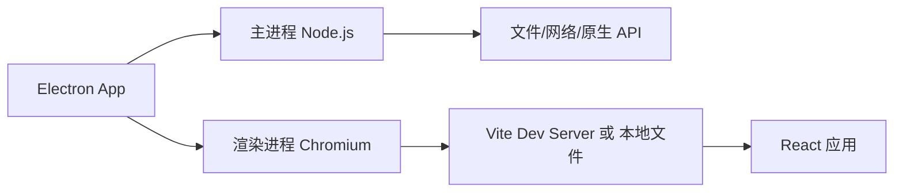

<!-- -->

- **主进程**：Node.js 环境，访问 fs、net、原生 API。
- **渲染进程**：Chromium 环境，跑 React 应用，通过 IPC 与主进程通信。

### 9.2 开发期：Vite Dev Server

```ts
// vite.config.ts
export default defineConfig({
  server: {
    port: 5173,
    // Electron 渲染进程加载 http://localhost:5173
  },
  // Electron-only 依赖不预构建（走 Node）
  optimizeDeps: {
    exclude: ["electron"],
  },
  resolve: {
    alias: {
      // 主进程代码别名
      "@main": path.resolve(__dirname, "electron/main"),
    },
  },
});
```

主进程加载 `http://localhost:5173` 作为渲染进程入口：

```ts
// electron/main/index.ts
import { BrowserWindow } from "electron";

function createWindow() {
  const win = new BrowserWindow({ webPreferences: { preload: "..." } });
  if (process.env.NODE_ENV === "development") {
    win.loadURL("http://localhost:5173");
    win.webContents.openDevTools();
  } else {
    win.loadFile("dist/index.html");
  }
}
```

### 9.3 生产期：本地文件 + Node 集成

生产构建时：

- 渲染进程：`vite build` 输出到 `dist/renderer`。
- 主进程：用 esbuild 或 tsup 把 `electron/main/*.ts` 编译成 `dist/main/*.js`。
- 启动：`electron .` 加载 `dist/main/index.js`，主进程创建窗口加载 `dist/renderer/index.html`。

```ts
// electron/main/index.ts
import { BrowserWindow, ipcMain } from "electron";
import path from "node:path";

function createWindow() {
  const win = new BrowserWindow({
    webPreferences: {
      preload: path.join(__dirname, "preload.js"),
      contextIsolation: true,
      nodeIntegration: false,
    },
  });
  win.loadFile(path.join(__dirname, "../renderer/index.html"));
}

ipcMain.handle("dialog:open", async () => {
  // 主进程处理原生调用
});
```

### 9.4 安全要点

```ts
webPreferences: {
  contextIsolation: true,    // 渲染进程与 preload 隔离
  nodeIntegration: false,    // 渲染进程不开 Node
  sandbox: true,             // 沙箱
  preload: "..."             // 只通过 preload 暴露受限 API
}
```

- **不开 nodeIntegration**：渲染进程有 Node 等于任意执行 JS，安全性差。
- **contextIsolation + preload**：用 `contextBridge.exposeInMainWorld` 暴露白名单 API。

---

## 十、与 Webpack 对比

### 10.1 全维度对比

| 维度 | Vite | Webpack |
|---|---|---|
| 启动速度 | 极快（1-3s） | 慢（30s-2min） |
| HMR 速度 | 与项目规模解耦 | 随规模变慢 |
| 开发期打包 | 不打包 | 全量打包 |
| 生产打包 | Rollup | 自身 |
| 配置复杂度 | 简洁 | 复杂 |
| 插件生态 | Rollup 生态 + Vite 专属 | 庞大（Loader + Plugin） |
| Tree Shaking | Rollup 原生 | 需配置 |
| 老浏览器兼容 | 需 plugin-legacy | 内置 |
| SSR 支持 | 内置 | 需配置 |
| Module Federation | 不支持（v5.1 实验） | 原生支持 |

### 10.2 选型建议

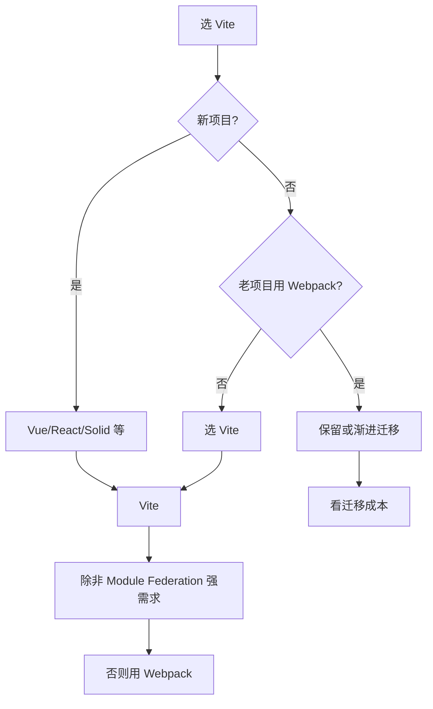

<!-- -->

- **新项目**：默认 Vite，除非有 Module Federation 等强需求。
- **老 Webpack 项目**：评估迁移成本，渐进迁移（Vite 也支持兼容 Webpack 配置的插件）。
- **特殊场景**：Module Federation 微前端、复杂 Loader 链仍可能选 Webpack。

---

## 十一、常见陷阱与修复

### 11.1 require is not defined

```js
// 错：浏览器无 require
const fs = require("fs");

// 好：用 ESM
import fs from "fs";  // 仅 Electron 主进程或 SSR 可用
```

Vite 是 ESM 优先，所有源码必须 ESM 写法。需要 Node API 的代码必须在主进程/SSR 环境。

### 11.2 window is not defined

```js
// 错：SSR 时无 window
const w = window.innerWidth;

// 好：守卫
const w = typeof window !== "undefined" ? window.innerWidth : 0;
```

SSR / 主进程环境无 `window`，访问前必守卫。

### 11.3 预构建未生效导致二次延迟

```js
// 错：动态 import 的依赖没被预构建
const mod = await import("lodash-es");  // 首次访问触发二次预构建
```

```ts
// 好：显式声明
optimizeDeps: { include: ["lodash-es"] }
```

动态 import、CSS 中 URL 引用的依赖可能不被入口扫描发现，需手动 include。

### 11.4 公共路径 base 错误

```
# 部署到子路径 /my-app/ 但 base 默认 /
GET /assets/index.js → 404
```

修复：`base: "/my-app/"`。

### 11.5 类型声明文件 import 失败

```ts
// 错：.d.ts 文件不能被 import
import types from "./types.d.ts";
```

`.d.ts` 只是类型声明，运行时不存在，不能 import。`declare module` 应该写在被 TS 自动加载的 `.d.ts` 里。

### 11.6 dev 与 build 行为不一致

某些依赖在 dev（ESM 原生）能跑，build（Rollup）报错——多半是 CJS 依赖没声明 `external` 或 `interop` 配置缺失。

修复：在 `optimizeDeps.include` 显式声明、build 时 `build.commonjsOptions` 调整。

---

## 十二、最佳实践 Checklist

### 12.1 项目结构

- `index.html` 在项目根（Vite 自动找）
- `public/` 放不参与构建的静态资源
- `src/` 放源码，别名 `@/`
- `.env` / `.env.development` / `.env.production` 分环境

### 12.2 配置

- `resolve.alias` 与 `tsconfig.paths` 同步
- `server.proxy` 配置后端 API
- `envPrefix` 自定义可见变量前缀
- `build.target` 升级到 ES2018+ 减小产物
- `build.minify: "esbuild"` 用 esbuild 压缩

### 12.3 性能

- `optimizeDeps.include` 显式声明动态 import 依赖
- `manualChunks` 拆分 vendor 长期缓存
- `rollup-plugin-visualizer` 分析包体
- 大列表用虚拟滚动
- 路由懒加载 `() => import("...")`

### 12.4 部署

- `base` 与部署路径一致
- 资源哈希命名（默认开启）
- gzip/brotli 预压缩（vite-plugin-compression）
- PWA 离线缓存（vite-plugin-pwa）
- 老浏览器用 plugin-legacy

### 12.5 Electron 集成

- `optimizeDeps.exclude: ["electron"]`
- 主进程用 tsup/esbuild 单独打包
- `contextIsolation: true` + `nodeIntegration: false`
- preload 用 `contextBridge.exposeInMainWorld` 暴露白名单 API

---

## 十三、一句话总纲

> Vite 的本质是 **"开发期不打包，按需编译；生产期用 Rollup 打包"**：dev 期基于浏览器原生 ESM 让启动与项目规模解耦、用 esbuild 预构建依赖解决 CJS 转换与请求瀑布、用 WebSocket 推送 HMR 实现状态保留热更新；build 期用 Rollup 输出干净 ESM 与最佳 Tree Shaking。能答出"为什么 Vite 启动快两个数量级""预构建解决什么问题""为什么生产换成 Rollup""HMR 边界是什么"，就是高级前端对 Vite 的认知。
