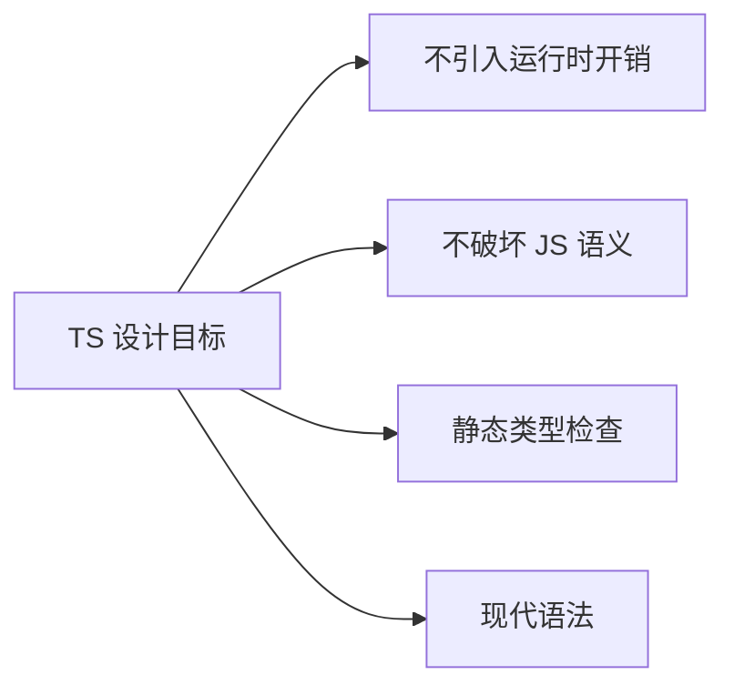
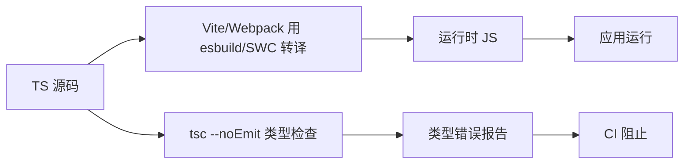
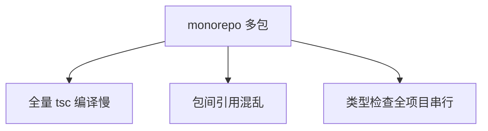

# TypeScript 工程化 · 核心知识点详解

> 本文档位于 `知识库/前端/04工程化与构建/03TypeScript 工程化/`，是 TypeScript 工程化的核心知识库。配套面试题见《常见面试题与最佳实践.md》。
>
> 读完应能解释清楚"TS 与 JS 的关系""tsconfig 各字段作用""类型检查与编译为何要分离""Project References 解决什么""类型与运行时的差异"，并能在工程中正确配置 tsconfig、声明文件、构建工具集成。

---

## 一、TypeScript 是什么

### 1.1 定位

TypeScript 是由 Microsoft 开发的**JavaScript 超集，添加了静态类型系统**，定位为"编译时类型检查 + 现代语法降级"。


<!-- -->

- **静态类型**：编译时检查类型，运行时无类型信息（被擦除）。
- **JS 超集**：合法 JS 都是合法 TS，TS 添加类型与语法扩展。
- **编译降级**：TS 编译为 JS，可降级到 ES5/ES2015+ 适配老环境。

### 1.2 与 JavaScript 的关系

| 维度 | JavaScript | TypeScript |
|---|---|---|
| 类型 | 动态（运行时） | 静态（编译时） |
| 类型信息 | 运行时存在 | 编译后擦除 |
| 学习曲线 | 低 | 中 |
| 工程化 | 弱 | 强（重构、IDE 提示） |
| 生态 | 最大 | JS 超集，包含 JS 生态 |

**关键认知**：TS 编译后**完全等价于 JS**，运行时无任何 TS 痕迹——类型、interface、enum 等被擦除。

### 1.3 设计目标



<!-- -->

- **不引入运行时开销**：类型在编译时擦除，运行时与纯 JS 一样快。
- **不破坏 JS 语义**：合法 JS 必须是合法 TS，行为一致。
- **静态类型检查**：编译时发现类型错误，提前暴露 bug。
- **现代语法**：async/await、可选链、nullish 等通过编译降级。

---

## 二、tsconfig.json 配置详解

### 2.1 配置文件结构

```json
{
  "compilerOptions": {
    "target": "ES2022",
    "module": "ESNext",
    "moduleResolution": "Bundler",
    "lib": ["ES2022", "DOM", "DOM.Iterable"],
    "jsx": "react-jsx",
    "strict": true,
    "esModuleInterop": true,
    "skipLibCheck": true,
    "forceConsistentCasingInFileNames": true,
    "resolveJsonModule": true,
    "isolatedModules": true,
    "noEmit": true,
    "baseUrl": ".",
    "paths": { "@/*": ["src/*"] }
  },
  "include": ["src", "vite.config.ts"],
  "exclude": ["node_modules", "dist"],
  "references": [{ "path": "./tsconfig.node.json" }]
}
```

### 2.2 核心字段

#### target

```json
"target": "ES2022"
```

指定编译产物的 JS 语法版本。常用值：

- `ES5`：兼容老浏览器（IE11）。
- `ES2015`/`ES2017`：现代浏览器基线。
- `ES2022`：现代浏览器（含 top-level await、类字段）。
- `ESNext`：最新特性。

**注意**：`target` 只影响语法降级（如 async/await → generator），不补 polyfill（`Promise`、`Array.prototype.flat` 等运行时 API 仍需 `core-js`）。

#### module 与 moduleResolution

```json
"module": "ESNext",
"moduleResolution": "Bundler"
```

- `module`：输出模块格式，`CommonJS`/`ESNext`/`NodeNext`。
- `moduleResolution`：模块解析策略：
  - `node`：老 Node 解析（CJS + extensions）。
  - `node16`/`nodenext`：支持 ESM + 子路径 exports。
  - `bundler`：模拟打包器解析（Vite/Webpack），最宽松。

**Vite/Webpack 项目**：`module: "ESNext"` + `moduleResolution: "Bundler"`。

**Node 项目**：`module: "NodeNext"` + `moduleResolution: "NodeNext"`。

#### lib

```json
"lib": ["ES2022", "DOM", "DOM.Iterable"]
```

指定可用的全局类型声明：

- `ES2022`：ES2022 标准库（Promise、Array 等）。
- `DOM`：浏览器 DOM API（document、window 等）。
- `DOM.Iterable`：DOM 集合可迭代（`for...of NodeList`）。

**Node 项目**：用 `@types/node` 提供 Node API，不用 `DOM`。

#### strict

```json
"strict": true
```

开启所有严格检查（推荐）：

- `strictNullChecks`：null/undefined 必须显式处理。
- `strictFunctionTypes`：函数参数逆变检查。
- `strictBindCallApply`：bind/call/apply 类型安全。
- `strictPropertyInitialization`：类属性必须初始化。
- `noImplicitAny`：禁止隐式 any。
- `noImplicitThis`：禁止 this 隐式 any。
- `alwaysStrict`：输出 `"use strict"`。

#### jsx

```json
"jsx": "react-jsx"
```

JSX 处理方式：

- `preserve`：保留 JSX，不转换（让 Babel/SWC 处理）。
- `react`：转 `React.createElement`（需 import React）。
- `react-jsx`：转 `_jsx`（React 17+，无需 import React）。
- `react-jsxdev`：dev 版本带 `__source`/`__self`。

**React 17+ 项目**：`jsx: "react-jsx"`。

#### esModuleInterop

```json
"esModuleInterop": true
```

允许 CJS 模块用 ESM 方式 import：

```ts
// 不开 esModuleInterop
import * as React from "react";  // 必须用 *

// 开 esModuleInterop
import React from "react";  // 可以默认导入
```

让 CJS 模块的 `module.exports` 能被默认 import，消除兼容痛点。

#### skipLibCheck

```json
"skipLibCheck": true
```

跳过 `.d.ts` 文件的类型检查（推荐）——加速编译。第三方库的 `.d.ts` 偶有错误，跳过避免被卡。

#### isolatedModules

```json
"isolatedModules": true
```

假设每个文件被独立编译（Babel/SWC/esbuild 都是这样）：

- 禁止 `const enum`（被内联到使用方，独立编译无法看到）。
- 禁止 `export { type X }` 在命名空间（要 `export type`）。
- 强制类型导入用 `import type`。

**Vite/esbuild 项目**：必开。esbuild 不做类型检查只转译，TS 的某些特性无法支持。

#### noEmit

```json
"noEmit": true
```

让 tsc 只做类型检查不输出文件——配合 Vite/Webpack（它们自己打包），tsc 只做"类型警察"。

```json
// package.json
{
  "scripts": {
    "typecheck": "tsc --noEmit",
    "dev": "vite",     // Vite 用 esbuild 转译 TS，不做类型检查
    "build": "vite build"
  }
}
```

#### paths

```json
"baseUrl": ".",
"paths": {
  "@/*": ["src/*"],
  "@components/*": ["src/components/*"]
}
```

路径别名，与 Vite/Webpack 的 alias 同步。

### 2.3 推荐基础配置

```json
// tsconfig.json
{
  "compilerOptions": {
    "target": "ES2022",
    "module": "ESNext",
    "moduleResolution": "Bundler",
    "lib": ["ES2022", "DOM", "DOM.Iterable"],
    "jsx": "react-jsx",
    "strict": true,
    "esModuleInterop": true,
    "skipLibCheck": true,
    "forceConsistentCasingInFileNames": true,
    "resolveJsonModule": true,
    "isolatedModules": true,
    "noEmit": true,
    "allowImportingTsExtensions": true,
    "noUnusedLocals": true,
    "noUnusedParameters": true,
    "noFallthroughCasesInSwitch": true,
    "useDefineForClassFields": true,
    "verbatimModuleSyntax": true,
    "baseUrl": ".",
    "paths": { "@/*": ["src/*"] },
    "types": ["vite/client", "node"]
  },
  "include": ["src", "vite.config.ts"],
  "exclude": ["node_modules", "dist"]
}
```

---

## 三、类型声明文件（.d.ts）

### 3.1 什么是 .d.ts

`.d.ts` 是**类型声明文件**，只包含类型信息，不含运行时代码。运行时不存在，编译时用于类型检查。

```ts
// module.d.ts
declare module "my-lib" {
  export function add(a: number, b: number): number;
  export const version: string;
}
```

```ts
// 使用
import { add, version } from "my-lib";
add(1, 2);  // 类型安全
```

### 3.2 全局声明

```ts
// globals.d.ts
declare const __APP_VERSION__: string;
declare interface Window {
  api: {
    openFile: () => Promise<string>;
    readFile: (path: string) => Promise<string>;
  };
}
```

```ts
// 使用
const v = __APP_VERSION__;
const path = await window.api.openFile();
```

### 3.3 模块声明

```ts
// 对没类型定义的第三方包声明
declare module "third-party-no-types" {
  const x: any;
  export default x;
}

// 通配模块（如 CSS）
declare module "*.css" {
  const content: Record<string, string>;
  export default content;
}

declare module "*.png" {
  const src: string;
  export default src;
}

declare module "*.svg" {
  const src: string;
  export default src;
}
```

### 3.4 三斜线指令

```ts
/// <reference types="vite/client" />
/// <reference path="./types/custom.d.ts" />
```

引入其他 `.d.ts` 文件或类型包。老式用法，现代项目用 `tsconfig.types` 字段或 `import` 替代。

### 3.5 vite-env.d.ts

Vite 项目根必备的类型声明文件：

```ts
// src/vite-env.d.ts
/// <reference types="vite/client" />

// 自定义环境变量
interface ImportMetaEnv {
  readonly VITE_API_BASE: string;
  readonly VITE_APP_TITLE: string;
}

interface ImportMeta {
  readonly env: ImportMetaEnv;
}

// 静态资源 import
declare module "*.png" { const src: string; export default src; }
declare module "*.jpg" { const src: string; export default src; }
declare module "*.svg" { const src: string; export default src; }
declare module "*.css" { const content: Record<string, string>; export default content; }
declare module "*.scss" { const content: Record<string, string>; export default content; }
```

### 3.6 发布库的类型

**方式 1：build 时生成**：

```bash
pnpm add -D vite-plugin-dts
```

```ts
// vite.config.ts
import dts from "vite-plugin-dts";
export default {
  plugins: [dts({ insertTypesEntry: true, rollupTypes: true })],
};
```

构建时自动生成 `dist/index.d.ts`。

**方式 2：手写**：

```
my-lib/
├── dist/
│   ├── index.js
│   └── index.d.ts   ← 手写或生成
└── package.json
```

```json
// package.json
{
  "main": "./dist/index.js",
  "types": "./dist/index.d.ts",
  "exports": {
    ".": {
      "types": "./dist/index.d.ts",
      "import": "./dist/index.js"
    }
  }
}
```

---

## 四、类型与运行时的差异

### 4.1 类型擦除

```ts
// TS 源码
interface User { name: string; age: number; }
const u: User = { name: "Tom", age: 18 };

// 编译后（类型擦除）
const u = { name: "Tom", age: 18 };
// interface 在运行时不存在！
```

类型只在编译时存在，运行时完全擦除——`instanceof User` 会报错（User 在运行时不存在）。

### 4.2 enum 的运行时存在

```ts
enum Color { Red, Green, Blue }
const c: Color = Color.Red;

// 编译后（enum 保留为对象）
var Color;
(function (Color) {
  Color[Color["Red"] = 0] = "Red";
  // ...
})(Color || (Color = {});
const c = Color.Red;
```

`enum` 是少数在运行时保留的 TS 特性——所以 `enum Color.Red` 在运行时存在。

**const enum** 编译时内联（运行时不存在）：

```ts
const enum Color { Red, Green, Blue }
const c = Color.Red;  // 编译为 const c = 0;
```

但 `isolatedModules: true` 禁止 `const enum`（独立编译无法内联）。

### 4.3 类型守卫

```ts
function isUser(x: unknown): x is User {
  return typeof x === "object" && x !== null && "name" in x && "age" in x;
}

const data: unknown = JSON.parse(str);
if (isUser(data)) {
  data.name;  // 类型 User
}
```

`x is User` 是 TS 类型谓词，告诉编译器函数返回 true 时 x 是 User 类型——但**运行时只是返回 boolean**，类型推导在编译期完成。

### 4.4 类型断言不转换运行时

```ts
const x = "hello" as unknown as number;  // 类型骗过编译器
// 运行时 x 仍是字符串 "hello"
x.toFixed();  // 运行时崩溃
```

`as` 只是告诉编译器"我知道这是 X 类型"，运行时完全不做转换。

---

## 五、类型检查与编译分离

### 5.1 为什么分离



<!-- -->

- **转译**：esbuild/SWC 速度极快（不检查类型，只去掉类型、降级语法）。
- **类型检查**：tsc 全项目类型检查，慢。
- **dev 期**：只转译不检查，速度快。
- **CI/prod**：分离跑 `tsc --noEmit` 做类型检查。

### 5.2 推荐 scripts

```json
// package.json
{
  "scripts": {
    "dev": "vite",                    // 转译不检查
    "build": "tsc --noEmit && vite build",  // 先类型检查再打包
    "typecheck": "tsc --noEmit",      // 独立类型检查
    "lint:types": "tsc --noEmit"      // CI 跑
  }
}
```

### 5.3 isolatedModules

`isolatedModules: true` 强制每个文件可独立编译（esbuild/SWC 都是这样），禁止：

```ts
// 禁止：const enum（独立编译无法内联）
const enum Color { Red }  // 报错

// 禁止：不导出 type-only
export { SomeType };  // 报错，必须 export type

// 强制：类型导入用 import type
import { type User } from "./types";  // 或
import type { User } from "./types";
```

### 5.4 verbatimModuleSyntax

```json
"verbatimModuleSyntax": true
```

更严格：所有类型导入必须用 `import type`，运行时导入只导入值。配合 esbuild 让产物更干净（不会保留类型导入）。

```ts
// 强制
import type { User } from "./types";     // 只导入类型
import { addUser } from "./api";        // 只导入值

// 不能
import { User, addUser } from "./types";  // User 是类型，要分两个 import
```

---

## 六、Project References

### 6.1 解决什么



<!-- -->

Monorepo 多个 TS 包，全量 `tsc` 编译慢、依赖关系不清晰——`Project References` 让每个包有独立 tsconfig，tsc 智能增量编译。

### 6.2 配置

```json
// tsconfig.json (根)
{
  "files": [],
  "references": [
    { "path": "./packages/shared" },
    { "path": "./packages/ui" },
    { "path": "./packages/web" }
  ]
}
```

```json
// packages/shared/tsconfig.json
{
  "compilerOptions": {
    "composite": true,         // 必须开启
    "declaration": true,       // 生成 .d.ts
    "outDir": "dist",
    "rootDir": "src"
  },
  "include": ["src"]
}
```

```json
// packages/ui/tsconfig.json
{
  "extends": "../../tsconfig.base.json",
  "compilerOptions": {
    "composite": true,
    "outDir": "dist"
  },
  "references": [
    { "path": "../shared" }    // 引用 shared 包
  ],
  "include": ["src"]
}
```

### 6.3 增量编译

```bash
# 只编译变动的包及依赖它的包
tsc --build

# 强制全量
tsc --build --force

# 监听模式
tsc --build --watch
```

`tsc --build` 模式：

1. 检查每个 referenced 项目的产物是否过期。
2. 只重编译过期项目及其下游。
3. 自动按依赖顺序编译。

### 6.4 composite 与 declaration

- `composite: true`：开启 project reference 支持，强制 `declaration`。
- `declaration: true`：生成 `.d.ts` 文件，让其他包能 import 类型。
- `declarationMap: true`：生成 `.d.ts.map`，IDE 跳转回源码。

---

## 七、与构建工具集成

### 7.1 Vite 集成

Vite 内置 esbuild 转译 TS，dev 期不做类型检查。

```ts
// vite.config.ts
import { defineConfig } from "vite";
import tsconfigPaths from "vite-tsconfig-paths";

export default defineConfig({
  plugins: [
    // 自动同步 tsconfig paths 到 Vite alias
    tsconfigPaths(),
  ],
  esbuild: {
    // esbuild 转译选项
    target: "es2022",
    legalComments: "none",
    logLevel: "info",
  },
  optimizeDeps: {
    esbuildOptions: { target: "es2022" },
  },
});
```

```json
// package.json
{
  "scripts": {
    "dev": "vite",
    "build": "tsc --noEmit && vite build",
    "typecheck": "tsc --noEmit"
  }
}
```

### 7.2 Webpack 集成

Webpack 用 babel-loader 或 ts-loader 转译 TS。

```js
// babel-loader（推荐，配合 @babel/preset-typescript）
module: {
  rules: [{
    test: /\.tsx?$/,
    exclude: /node_modules/,
    use: {
      loader: "babel-loader",
      options: {
        presets: [
          ["@babel/preset-env", { targets: { node: "current" } }],
          ["@babel/preset-react", { runtime: "automatic" }],
          "@babel/preset-typescript",
        ],
      },
    },
  }],
}

// ts-loader（更接近 tsc，但慢）
{ test: /\.tsx?$/, loader: "ts-loader", options: { transpileOnly: true } }
```

`transpileOnly: true` 跳过类型检查只转译——速度接近 esbuild，类型检查交给 `tsc --noEmit`。

### 7.3 ts-node / tsx（运行时执行 TS）

```bash
# ts-node：Node 直接跑 TS
pnpm add -D ts-node
npx ts-node script.ts

# tsx：基于 esbuild，更快
pnpm add -D tsx
npx tsx script.ts

# tsx watch
npx tsx watch script.ts
```

```json
// package.json
{
  "scripts": {
    "script:run": "tsx scripts/build.ts",
    "script:watch": "tsx watch scripts/build.ts"
  }
}
```

### 7.4 配合 SWC

SWC（Rust 编写）比 esbuild 还快，常用于 Next.js、大型项目。

```js
// webpack 配置
module: {
  rules: [{
    test: /\.tsx?$/,
    use: {
      loader: "swc-loader",
      options: {
        jsc: {
          parser: { syntax: "typescript", jsx: true },
          target: "es2022",
        },
      },
    },
  }],
}
```

---

## 八、类型体操（高级）

### 8.1 条件类型

```ts
type IsString<T> = T extends string ? true : false;

type A = IsString<"hello">;  // true
type B = IsString<123>;      // false
```

### 8.2 映射类型

```ts
type Readonly<T> = { readonly [K in keyof T]: T[K] };
type Partial<T> = { [K in keyof T]?: T[K] };
type Nullable<T> = { [K in keyof T]: T[K] | null };
```

### 8.3 infer

```ts
type ReturnType<T> = T extends (...args: any[]) => infer R ? R : never;
type ElementOf<T> = T extends (infer E)[] ? E : never;

function fn(): string { return "x"; }
type R = ReturnType<typeof fn>;  // string

type Item = ElementOf<number[]>;  // number
```

### 8.4 模板字面量类型

```ts
type EventName = `on${Capitalize<string>}`;
type Path = `/${string}`;

const handler: EventName = "onClick";     // OK
const path: Path = "/users";              // OK
```

### 8.5 内置工具类型

```ts
// 常用
type A = Pick<User, "name" | "age">;
type B = Omit<User, "id">;
type C = Partial<User>;
type C2 = Required<Partial<User>>;
type D = Record<"a" | "b", string>;
type E = Readonly<User>;
type F = ReturnType<typeof fn>;
type G = Parameters<typeof fn>;
type H = Awaited<Promise<Promise<string>>>;  // string
type I = NonNullable<string | null>;          // string
type J = Exclude<"a" | "b" | "c", "a">;        // "b" | "c"
type K = Extract<"a" | "b" | "c", "a" | "c">;  // "a" | "c"
```

### 8.6 自定义工具类型

```ts
// 深度 Partial
type DeepPartial<T> = {
  [K in keyof T]?: T[K] extends object ? DeepPartial<T[K]> : T[K];
};

// 深度 Readonly
type DeepReadonly<T> = {
  readonly [K in keyof T]: T[K] extends object ? DeepReadonly<T[K]> : T[K];
};

// 路径类型
type PathKeys<T> = T extends object
  ? { [K in keyof T & string]: T[K] extends object
      ? K | `${K}/${PathKeys<T[K]>}`
      : K
    }[keyof T & string]
  : never;
```

---

## 九、性能优化

### 9.1 tsc 编译慢的优化

```json
// tsconfig.json
{
  "compilerOptions": {
    "skipLibCheck": true,              // 跳过 .d.ts 检查
    "incremental": true,              // 增量编译
    "composite": true,                // 配合 project references
    "assumeChangesOnlyAffectDirectDependencies": true
  }
}
```

```bash
# 增量编译
tsc --noEmit --incremental --tsBuildInfoFile .tsbuildinfo

# 项目引用
tsc --build
```

### 9.2 类型检查与转译分离

```json
// package.json
{
  "scripts": {
    "dev": "vite",                  // 只转译
    "build": "tsc --noEmit && vite build",  // CI 跑类型检查
    "typecheck": "tsc --noEmit"     // 独立命令
  }
}
```

### 9.3 类型导入优化

```ts
// 用 import type，让打包器擦除类型导入
import type { User } from "./types";  // 运行时不存在
import { getUser } from "./api";       // 只导入值
```

```json
// tsconfig.json
{
  "compilerOptions": {
    "verbatimModuleSyntax": true  // 强制所有类型导入用 import type
  }
}
```

### 9.4 避免大 union

```ts
// 慢：上千个 union 字面量
type Route = "/a" | "/b" | /* ... 1000 个 */;

// 快：用模板字面量
type Route = `/${string}`;
```

### 9.5 类型检查分包（Monorepo）

```json
// 根 tsconfig.json
{
  "files": [],
  "references": [
    { "path": "./packages/shared" },
    { "path": "./packages/ui" },
    { "path": "./packages/web" }
  ]
}
```

```bash
# 只检查变动的包
tsc --build
```

---

## 十、常见陷阱与修复

### 10.1 Cannot use import statement outside a module

```ts
// 错：模块配置不一致
"module": "CommonJS"  // package.json 没 "type": "module"
```

修复：tsconfig `module: "ESNext"` + package.json `"type": "module"`（ESM 项目）。

### 10.2 Cannot find module './types' or its type declarations

```ts
// 错：.d.ts 不能 import
import types from "./types.d.ts";
```

修复：`.d.ts` 只是声明，不能 import；要么 `declare module` 在被自动加载的 `.d.ts` 里，要么把类型放 `.ts` 用 `export type`。

### 10.3 Property 'X' does not exist on type 'Window'

```ts
// 错：扩展了 window 但没声明
window.api.openFile();
```

修复：

```ts
// globals.d.ts
declare interface Window {
  api: { openFile: () => Promise<string> };
}
```

### 10.4 类型导入在运行时残留

```ts
// 错：类型与值混在一起
import { User, getUser } from "./api";
// esbuild 可能保留 User 导入（运行时无意义）
```

修复：

```ts
import type { User } from "./api";
import { getUser } from "./api";
```

或开 `verbatimModuleSyntax: true` 强制。

### 10.5 enum 在 isolatedModules 报错

```ts
// 错：const enum 在 isolatedModules 下禁用
const enum Color { Red }
```

修复：用普通 `enum` 或字面量 union：

```ts
type Color = "Red" | "Green" | "Blue";
const Color = { Red: "Red", Green: "Green", Blue: "Blue" } as const;
```

### 10.6 JSX 报错 'React' must be in scope

```ts
// 错：jsx 配置错
"jsx": "react"  // 要求 import React
```

修复：React 17+ 用 `jsx: "react-jsx"`，无需 import React。

---

## 十一、最佳实践 Checklist

### 11.1 配置

- `target` 与项目浏览器/Node 版本一致
- `module` + `moduleResolution` 与打包器/Node 一致
- `lib` 包含所需环境 API
- `strict: true`
- `esModuleInterop: true`
- `skipLibCheck: true`
- `isolatedModules: true`（Vite/esbuild 项目）
- `noEmit: true`（配合 Vite/Webpack）
- `paths` 与 Vite/Webpack alias 同步
- `verbatimModuleSyntax: true`（强制类型导入）

### 11.2 类型声明

- `src/vite-env.d.ts` 声明环境变量与资源
- 第三方无类型包用 `declare module`
- `globals.d.ts` 扩展 window/globalThis
- 发布库时生成 `.d.ts`（vite-plugin-dts）

### 11.3 类型与运行时

- 类型导入用 `import type`
- 不依赖运行时类型信息（类型被擦除）
- enum 谨慎用，考虑字面量 union
- 类型断言 `as` 不滥用

### 11.4 工程化

- dev 只转译不检查（Vite/Webpack + esbuild/SWC）
- CI 跑 `tsc --noEmit` 类型检查
- `typecheck` 独立 scripts
- `tsconfig.json` 配置提交 git

### 11.5 Monorepo

- 根 tsconfig 用 references
- 各包 `composite: true` + `declaration: true`
- `tsc --build` 增量编译
- 共享 `tsconfig.base.json` 继承

### 11.6 性能

- `skipLibCheck: true`
- `incremental: true` 或 `tsc --build`
- 类型导入用 `import type` 减少打包产物
- 避免超大 union 类型
- 类型检查与转译分离

---

## 十二、一句话总纲

> TypeScript 工程化的本质是 **"静态类型检查 + 编译时类型擦除"**：tsconfig 控制编译行为（target/module/strict/lib/jsx）；类型声明 `.d.ts` 让无类型包也能类型安全；类型与运行时分离——类型只在编译时存在、enum/const enum 例外；类型检查与转译分离——Vite/Webpack 用 esbuild/SWC 快速转译，CI 跑 `tsc --noEmit` 类型检查；Project References 让 Monorepo 增量编译。能答出"TS 与 JS 关系""tsconfig 各字段作用""类型检查与编译为何分离""类型与运行时的差异""isolatedModules 解决什么""Project References 怎么用""怎么发库的类型"，就是高级前端对 TS 工程化的认知。
