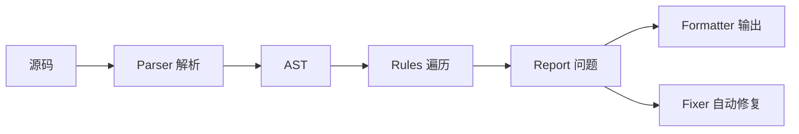
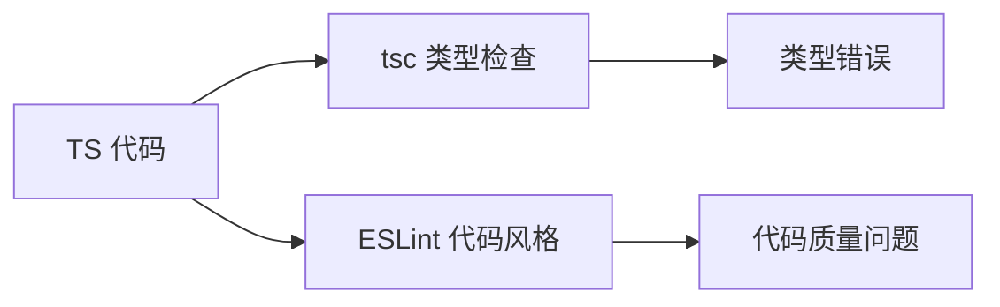
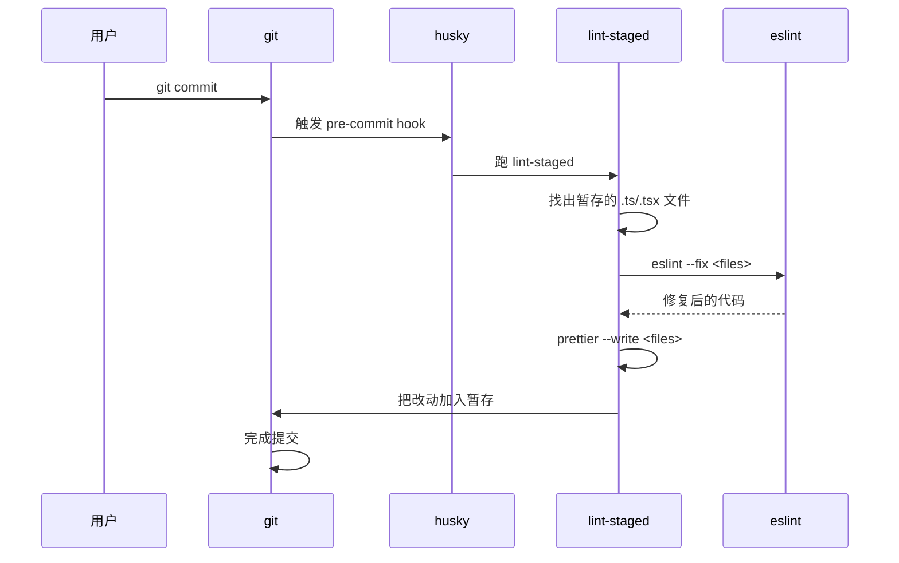
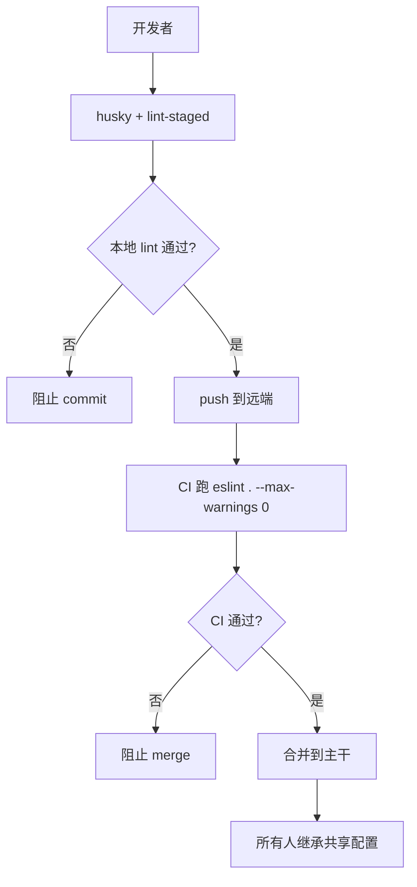

# ESLint 专题 · 常见面试题与最佳实践

> 本文档位于 `知识库/前端/04工程化与构建/04ESLint 专题/`，是 ESLint 的面试题集与生产最佳实践。配套核心知识见《核心知识点详解.md》。
>
> 15 道高频题 + 8 个生产场景 + 完整 Checklist，覆盖原理、Flat Config、TS 集成、Prettier 配合、自定义规则、Monorepo 共享等面试常考点。

---

## 一、原理类（高频）

### 1. ESLint 的工作原理是什么？

**核心答案**：四步——Parser 解析源码成 AST → Rules 遍历 AST 节点 → Report 报告问题 → Fixer 自动修复。



<!-- -->

**详细步骤**：

1. **Parser**：把源码解析成 AST。默认 Espree（标准 JS），TS 用 `@typescript-eslint/parser`。
2. **Rules**：每条规则是一个对象，提供 `create(context)` 返回 AST 节点访问器。ESLint 用访问者模式遍历 AST，到对应节点调规则回调。
3. **Report**：规则发现问题调 `context.report({ node, message, fix })`。
4. **Fixer**：若规则声明 `fixable` 且 `--fix` 开启，ESLint 调 `fix(fixer)` 返回补丁，自动改源码。

```js
// 规则示例
export default {
  meta: { type: "problem", fixable: "code" },
  create(context) {
    return {
      MemberExpression(node) {
        if (node.object.name === "console") {
          context.report({ node, message: "禁用 console", fix: fixer => fixer.remove(node.parent) });
        }
      },
    };
  },
};
```

---

### 2. ESLint 9 的 Flat Config 与老 .eslintrc 有什么区别？

**核心答案**：Flat Config 用单根 JS 文件、对象引用插件、数组顺序合并；.eslintrc 是 JSON-like、字符串引用、extends 继承。

| 维度 | .eslintrc | Flat Config |
|---|---|---|
| 文件 | `.eslintrc.{js,json,yaml}` | `eslint.config.js` |
| 加载 | 从文件向上查找 | 单一根配置 |
| 插件 | `plugins: ["react"]` 字符串 | `plugins: { react }` 对象 |
| 继承 | `extends: ["..."]` | 数组展开 `...configs` |
| 覆盖 | `overrides: [...]` | `files: [...]` 数组项 |
| 全局 | `env: { browser: true }` | `languageOptions.globals` |
| Parser | `parser: "..."` | `languageOptions.parser` |
| 合并语义 | extends 复杂合并 | 后项覆盖前项，直观 |

**为什么换**：

- `.eslintrc` 继承链深难追踪、字符串引用难做 tree-shake、向上查找文件慢。
- Flat Config 让配置扁平、可程序化生成、ESLint 内部能优化加载。

**示例对比**：

```js
// .eslintrc.js (老)
module.exports = {
  root: true,
  env: { browser: true, es2022: true },
  extends: ["eslint:recommended", "plugin:@typescript-eslint/recommended"],
  plugins: ["@typescript-eslint"],
  parser: "@typescript-eslint/parser",
  rules: { "no-console": "error" },
  overrides: [{ files: ["*.test.ts"], rules: { "no-console": "off" } }],
};
```

```js
// eslint.config.js (新)
import js from "@eslint/js";
import tseslint from "typescript-eslint";

export default [
  { ignores: ["dist/**"] },
  js.configs.recommended,
  ...tseslint.configs.recommended,
  {
    files: ["**/*.{ts,tsx}"],
    languageOptions: {
      parserOptions: { ecmaFeatures: { jsx: true } },
      globals: { window: "readonly" },
    },
    rules: { "no-console": "error" },
  },
  { files: ["**/*.test.ts"], rules: { "no-console": "off" } },
];
```

---

### 3. ESLint 与 Prettier 怎么分工？为什么不重复？

**核心答案**：ESLint 管代码质量与潜在 bug；Prettier 管纯格式（缩进、引号、换行）。两者有重叠，用 `eslint-config-prettier` 关闭 ESLint 格式规则让 Prettier 接管。

| 工具 | 关注点 | 示例规则 |
|---|---|---|
| ESLint | 代码质量、潜在 bug | `no-unused-vars`、`react-hooks/rules-of-hooks` |
| Prettier | 纯格式 | 缩进、引号、行宽、换行 |
| 重叠 | 引号、分号、缩进 | ESLint 的 `quotes`/`semi` 与 Prettier |

**为什么分两工具**：

- ESLint 的格式规则不如 Prettier 智能（Prettier 有 AST 重排能力）。
- Prettier 不关心代码语义，避免争论"哪种风格好看"。
- ESLint 聚焦"潜在 bug 与团队约定"。

**配合方式**：

```bash
pnpm add -D prettier eslint-config-prettier
```

```js
// eslint.config.js
import prettier from "eslint-config-prettier";
export default [
  // ...其他配置
  prettier,  // 必须放最后，关闭所有格式规则
];
```

```json
// .prettierrc
{
  "semi": true,
  "singleQuote": false,
  "trailingComma": "all",
  "printWidth": 100,
  "tabWidth": 2
}
```

**工作流**：

- 保存时：Prettier 格式化 + ESLint 自动修复非格式问题。
- 提交前：husky + lint-staged 跑两工具。
- CI：`prettier --check` + `eslint --max-warnings 0` 卡 PR。

---

## 二、配置类（高频）

### 4. 怎么禁用某规则？规则等级有哪些？

**核心答案**：规则等级三档——`off`(0) / `warn`(1) / `error`(2)；用 `"rule-name": "off"` 禁用。

```js
// eslint.config.js
export default [{
  rules: {
    "no-console": "off",           // 关闭
    "no-unused-vars": "warn",      // 警告
    "react/jsx-key": "error",     // 报错
    "semi": ["error", "always"],   // 报错 + 配置项
    "@typescript-eslint/no-explicit-any": ["warn", { ignoreRestArgs: true }],
  },
}];
```

- `off`/`0`：完全禁用，不检查。
- `warn`/`1`：警告但不让 lint 命令失败（除非 `--max-warnings 0`）。
- `error`/`2`：报错，lint 命令返回非零退出码。

**配置项数组形式**：`["error", { option1: value1 }]`，第二位是规则配置对象。

**临时禁用（注释）**：

```js
// 单行
// eslint-disable-next-line no-console
console.log("debug");

// 多行
/* eslint-disable no-console */
console.log("debug 1");
console.log("debug 2");
/* eslint-enable no-console */

// 整个文件
/* eslint-disable no-console */
```

**注意**：注释禁用应少用，只在确实需要时（如调试、第三方代码）。CI 可开 `--report-unused-disable-directives` 检查无意义禁用注释。

---

### 5. 文件级别的 overrides 在 Flat Config 怎么写？

**核心答案**：Flat Config 用数组项的 `files` 字段匹配文件类型，按顺序合并配置。

```js
// .eslintrc (老)
overrides: [
  { files: ["*.test.ts"], rules: { "@typescript-eslint/no-explicit-any": "off" } },
  { files: ["scripts/**"], rules: { "no-console": "off" } },
]
```

```js
// Flat Config (新)
export default [
  // 全局规则
  { rules: { "no-console": "error" } },

  // 测试文件
  {
    files: ["**/*.test.ts", "**/*.spec.ts"],
    rules: {
      "@typescript-eslint/no-explicit-any": "off",
      "no-console": "off",
    },
  },

  // scripts 目录
  {
    files: ["scripts/**"],
    rules: { "no-console": "off" },
    languageOptions: {
      globals: { process: "readonly" },  // scripts 通常用 Node
    },
  },

  // 配置文件本身
  {
    files: ["*.config.js", "vite.config.ts"],
    rules: { "no-console": "off" },
  },
];
```

**关键**：数组项按顺序合并，后项覆盖前项。`files` 用 glob 模式匹配。

---

### 6. ignore 文件怎么配置？eslintignore 还用吗？

**核心答案**：v9 起 `eslintignore` 弃用，统一在 `eslint.config.js` 用 `ignores` 字段。

```js
// eslint.config.js
export default [
  // 全局 ignore
  {
    ignores: [
      "dist/**",
      "node_modules/**",
      "coverage/**",
      "*.config.js",
      "public/**",
      "eslint-rules/**",
    ],
  },
  // 其他配置...
];
```

**为什么弃用 eslintignore**：

- 一个工具一个配置文件，避免分散。
- ignores 可与其他配置项组合（如 `{ files, ignores, rules }`）。
- 老格式文件名混乱（`.eslintignore`/`.eslintignore.js`）。

**配置项内 ignore**：

```js
export default [
  {
    files: ["src/**"],
    ignores: ["src/generated/**"],  // 在 src 内排除 generated
    rules: { ... },
  },
];
```

---

## 三、TypeScript 集成类（高频）

### 7. 怎么集成 TypeScript？类型感知规则是什么？

**核心答案**：用 `typescript-eslint` 包提供解析器与规则；类型感知规则需 `parserOptions.project` 指定 tsconfig。

```js
// eslint.config.js
import js from "@eslint/js";
import tseslint from "typescript-eslint";

export default [
  js.configs.recommended,
  ...tseslint.configs.recommended,        // 基础 TS 规则（无类型）
  ...tseslint.configs.recommendedTypeChecked,  // 类型感知规则
  {
    languageOptions: {
      parserOptions: {
        project: "./tsconfig.json",      // 关键：让规则能读类型
        tsconfigRootDir: import.meta.dirname,
      },
    },
  },
];
```

**两类规则**：

| 规则类型 | 需要 project | 示例 |
|---|---|---|
| 基础规则 | 否 | `@typescript-eslint/no-explicit-any`、`@typescript-eslint/consistent-type-imports` |
| 类型感知规则 | 是 | `@typescript-eslint/no-floating-promises`、`@typescript-eslint/no-misused-promises`、`@typescript-eslint/no-unsafe-*` |

**类型感知规则示例**：

```js
async function fetchUser() { return { id: 1 }; }

// 错：Promise 没 await（no-floating-promises）
fetchUser();

// 错：Promise 当事件 handler（no-misused-promises）
button.onClick = fetchUser;  // 应是 () => void，不是 () => Promise
```

**性能注意**：类型感知规则慢，因为每次 lint 要全项目读 tsconfig 类型。建议：

- 普通 `lint` 命令不开 project。
- 单独 `lint:types` 命令开 project，CI 跑。
- 或只在 `src/**` 开 project。

```json
// package.json
{
  "scripts": {
    "lint": "eslint .",
    "lint:types": "eslint . --rule @typescript-eslint/no-floating-promises:error",
    "typecheck": "tsc --noEmit"
  }
}
```

---

### 8. ESLint 与 tsc 怎么分工？

**核心答案**：ESLint 管代码风格与潜在 bug；tsc 管类型检查。两者重叠部分用 `@typescript-eslint` 替代 ESLint 同名规则。



<!-- -->

| 工具 | 关注点 | 示例 |
|---|---|---|
| tsc | 类型安全 | `Type 'string' is not assignable to type 'number'` |
| ESLint | 代码风格、潜在 bug | `no-unused-vars`、`no-console` |
| `@typescript-eslint` | TS 专属质量 | `no-explicit-any`、`no-non-null-assertion` |

**重叠规则替代**：

```js
// 用 @typescript-eslint 替代 ESLint 同名
rules: {
  "no-unused-vars": "off",
  "@typescript-eslint/no-unused-vars": "error",

  "no-redeclare": "off",
  "@typescript-eslint/no-redeclare": "error",

  "no-shadow": "off",
  "@typescript-eslint/no-shadow": "error",
}
```

`tseslint.configs.recommended` 自动处理这些替代，无需手动。

**分工的 CI 流程**：

```yaml
- run: pnpm lint        # ESLint（快）
- run: pnpm typecheck  # tsc --noEmit（类型检查）
- run: pnpm lint:types # 类型感知 ESLint 规则（慢）
```

---

## 四、与构建工具集成类（高频）

### 9. ESLint 怎么集成到 Vite/Webpack？

**核心答案**：Vite 用 `vite-plugin-checker`（dev 期 overlay 显示错误，不阻塞编译）；Webpack 用 `eslint-webpack-plugin`。

**Vite 集成**：

```bash
pnpm add -D vite-plugin-checker
```

```js
// vite.config.ts
import checker from "vite-plugin-checker";
export default {
  plugins: [
    checker({
      eslint: {
        lintCommand: 'eslint . --max-warnings 0',
        useFlatConfig: true,
      },
      overlay: {
        initialIsOpen: false,
      },
    }),
  ],
};
```

dev 期编译时跑 ESLint，错误显示在浏览器 overlay，但不阻塞 Vite 编译——代码仍能跑。

**Webpack 集成**：

```bash
pnpm add -D eslint-webpack-plugin
```

```js
// webpack.config.js
const ESLintPlugin = require("eslint-webpack-plugin");
module.exports = {
  plugins: [
    new ESLintPlugin({
      extensions: ["js", "jsx", "ts", "tsx"],
      fix: false,         // dev 可设 true 自动修
      failOnError: false, // dev 不阻塞，prod 设 true
    }),
  ],
};
```

**为什么不阻塞**：

- dev 期 lint 失败仍要能跑代码、看 UI。
- prod 期 build 前 lint（CI 跑）。

**推荐生产做法**：

- dev：lint 在 overlay 显示，不阻塞。
- pre-commit：lint-staged 跑改动文件。
- CI：完整 `eslint . --max-warnings 0` 卡 PR。

---

### 10. husky + lint-staged 怎么用？

**核心答案**：husky 管理 git hooks，lint-staged 跑改动文件的 lint。

```bash
pnpm add -D husky lint-staged
pnpm exec husky install
pnpm exec husky add .husky/pre-commit "pnpm exec lint-staged"
```

```json
// package.json
{
  "scripts": {
    "prepare": "husky install"
  },
  "lint-staged": {
    "*.{ts,tsx}": [
      "eslint --fix",
      "prettier --write"
    ],
    "*.{css,md,json}": [
      "prettier --write"
    ]
  }
}
```

```bash
# .husky/pre-commit
pnpm exec lint-staged
```

**工作流**：



<!-- -->

**注意**：

- `lint-staged` 自动把改动后的代码加回暂存，但若 lint 命令退出码非零（如 `--max-warnings 0` 触发），提交被阻止。
- 大项目避免全量 lint，只 lint 改动文件。
- `prepare` 脚本让 `npm install` 后自动装 husky。

**推荐配合 commit-msg 校验 commit message**：

```bash
pnpm exec husky add .husky/commit-msg 'pnpm exec commitlint --edit $1'
```

```js
// commitlint.config.js
export default {
  extends: ["@commitlint/config-conventional"],
};
```

---

## 五、自定义规则类（高频）

### 11. 怎么写一个自定义 ESLint 规则？

**核心答案**：规则是一个对象，含 `meta`（元数据）和 `create(context)`（返回 AST 访问器）。

```js
// rules/no-todo-comment.js
export default {
  meta: {
    type: "suggestion",          // problem | suggestion | layout
    docs: {
      description: "禁止 TODO 注释，必须用 issue 追踪",
      category: "Best Practices",
    },
    fixable: null,              // 是否可自动修复
    schema: [],                 // 配置项 schema
    messages: {
      noTodo: "TODO 注释禁止使用，请用 issue 追踪",
    },
  },
  create(context) {
    return {
      // AST 节点类型 → 回调
      Comment(node) {
        if (node.value.trim().toUpperCase().startsWith("TODO")) {
          context.report({
            node,
            messageId: "noTodo",
          });
        }
      },
    };
  },
};
```

**本地使用**：

```js
// eslint.config.js
import noTodo from "./rules/no-todo-comment.js";

export default [
  {
    plugins: {
      local: { rules: { "no-todo-comment": noTodo } },
    },
    rules: {
      "local/no-todo-comment": "error",
    },
  },
];
```

**调试 AST**：

- https://eslint.org/play 在线看 AST 节点结构。
- https://astexplorer.net 选 espree parser，看任意代码 AST。

**带 fix 的规则**：

```js
// rules/no-console-log.js
export default {
  meta: {
    type: "problem",
    fixable: "code",
    schema: [],
  },
  create(context) {
    return {
      MemberExpression(node) {
        if (
          node.object.type === "Identifier" && node.object.name === "console" &&
          node.property.type === "Identifier" && node.property.name === "log"
        ) {
          context.report({
            node,
            message: "禁止 console.log，改用 console.warn/error",
            fix(fixer) {
              return fixer.replaceText(node.property, "warn");
            },
          });
        }
      },
    };
  },
};
```

---

### 12. 怎么把规则发布成插件？

**核心答案**：发布一个 npm 包，导出 `rules` 与 `configs` 字段，业务项目用 `import` 引入。

```
eslint-plugin-myteam/
├── package.json
├── index.js
└── rules/
    ├── no-todo-comment.js
    └── require-i18n-key.js
```

```js
// index.js
module.exports = {
  rules: {
    "no-todo-comment": require("./rules/no-todo-comment"),
    "require-i18n-key": require("./rules/require-i18n-key"),
  },
  configs: {
    recommended: {
      plugins: ["myteam"],
      rules: {
        "myteam/no-todo-comment": "error",
        "myteam/require-i18n-key": "warn",
      },
    },
  },
};
```

```json
// package.json
{
  "name": "eslint-plugin-myteam",
  "version": "1.0.0",
  "main": "index.js",
  "peerDependencies": { "eslint": ">=8" }
}
```

```bash
npm publish
```

业务项目用：

```bash
pnpm add -D eslint-plugin-myteam
```

```js
import myteam from "eslint-plugin-myteam";
export default [
  { plugins: { myteam } },
  ...myteam.configs.recommended,  // 启用预设
  {
    rules: {
      "myteam/require-i18n-key": "error",  // 单独提升
    },
  },
];
```

---

## 六、Monorepo 与团队类（高频）

### 13. Monorepo 怎么共享 ESLint 配置？

**核心答案**：发布一个 `@org/eslint-config` 包，业务包用 `workspace:*` 引用、import 共享配置。

```
myrepo/
├── packages/
│   ├── eslint-config/
│   │   ├── package.json
│   │   ├── index.js
│   │   └── react.js
│   ├── web/
│   │   ├── eslint.config.js
│   │   └── package.json
│   └── api/
└── pnpm-workspace.yaml
```

```js
// packages/eslint-config/index.js
import js from "@eslint/js";
import tseslint from "typescript-eslint";
import prettier from "eslint-config-prettier";

const baseConfig = [
  { ignores: ["dist/**", "node_modules/**", "coverage/**"] },
  js.configs.recommended,
  ...tseslint.configs.recommended,
  {
    files: ["**/*.{ts,tsx}"],
    languageOptions: {
      parserOptions: { ecmaFeatures: { jsx: true } },
    },
  },
  prettier,
];

// 命名导出便于业务包组合
export const reactConfig = [
  ...baseConfig,
  // ...react.configs.recommended
];

export const nodeConfig = [
  ...baseConfig,
  // node 专属规则
];

export default baseConfig;
```

```json
// packages/eslint-config/package.json
{
  "name": "@myrepo/eslint-config",
  "version": "1.0.0",
  "main": "index.js",
  "type": "module",
  "exports": {
    ".": "./index.js",
    "./react": "./react.js",
    "./node": "./node.js"
  },
  "dependencies": {
    "@eslint/js": "^9",
    "typescript-eslint": "^8",
    "eslint-config-prettier": "^9"
  },
  "peerDependencies": { "eslint": ">=8" }
}
```

```yaml
# pnpm-workspace.yaml
packages:
  - "packages/*"
```

业务包用：

```js
// packages/web/eslint.config.js
import baseConfig, { reactConfig } from "@myrepo/eslint-config";

export default [
  ...reactConfig,
  {
    // 业务专属
    rules: { "@typescript-eslint/no-explicit-any": "off" },
  },
];
```

```json
// packages/web/package.json
{
  "dependencies": {
    "@myrepo/eslint-config": "workspace:*"
  }
}
```

`workspace:*` 让 pnpm 软链本地包，改共享配置立即生效。

---

### 14. 怎么强制全团队统一规范？

**核心答案**：共享配置包 + CI 卡 PR + husky 提交前 lint 三层保障。



<!-- -->

**1. 共享配置包**：`@myrepo/eslint-config` 提供基础规则，业务包继承。

**2. 本地 husky**：提交前 `lint-staged` 跑改动文件，失败阻止 commit。

**3. CI 强制**：GitHub Actions 跑 `eslint . --max-warnings 0`，失败阻止 merge。

```yaml
# .github/workflows/lint.yml
name: Lint
on: [pull_request]
jobs:
  lint:
    runs-on: ubuntu-latest
    steps:
      - uses: actions/checkout@v4
      - uses: pnpm/action-setup@v2
      - run: pnpm install --frozen-lockfile
      - run: pnpm lint
      - run: pnpm typecheck
```

**4. 文档化**：在 `CONTRIBUTING.md` 写清楚：

- 怎么本地跑 lint。
- 怎么自定义规则（需 PR 修改共享配置）。
- 规则调整的决策机制（团队 review）。

**5. 警告渐进收紧**：

- 新规则先 `"warn"` 一周，让团队适应。
- CI 不卡 warn（除非 `--max-warnings 0`）。
- 适应后改 `"error"`，CI 开始卡。

---

## 七、性能优化类（高频）

### 15. ESLint 慢怎么排查与优化？

**核心答案**：用 `--cache` 缓存、缩小 `files` 范围、类型感知规则限定在 src、`TIMING=10` 找慢规则。

**常见慢的原因**：

1. **类型感知规则**：每次 lint 全项目读 tsconfig 类型。
2. **大文件全量扫描**：dist/node_modules 没排除。
3. **继承深**：`extends` 多层继承解析慢。
4. **插件多**：每插件都装且解析。

**排查工具**：

```bash
# 显示每条规则耗时
TIMING=10 npx eslint .

# 显示文件级耗时
ESLINT_DEBUG=1 npx eslint .
```

**优化手段**：

```js
// 1. 全局 ignore
export default [
  { ignores: ["dist/**", "node_modules/**", "coverage/**", "*.config.js"] },
];

// 2. files 缩小到 src
{ files: ["src/**/*.{ts,tsx}"] },

// 3. 类型感知只在 src
{
  files: ["src/**"],
  languageOptions: {
    parserOptions: { project: "./tsconfig.json" },
  },
  rules: { "@typescript-eslint/no-floating-promises": "error" },
}
```

```json
// package.json
{
  "scripts": {
    "lint": "eslint . --cache --cache-location .eslintcache --max-warnings 0",
    "lint:fix": "eslint . --cache --fix"
  }
}
```

**CI 优化**：

```yaml
- run: pnpm install --frozen-lockfile
- uses: actions/cache@v3
  with:
    path: .eslintcache
    key: eslint-${{ runner.os }}-${{ hashFiles('pnpm-lock.yaml') }}
- run: pnpm lint
```

CI 也用 cache，第二次跑提速 50%+。

**lint-staged 优化**：

```json
{
  "lint-staged": {
    "*.{ts,tsx}": "eslint --fix --cache --max-warnings 0"
  }
}
```

只 lint 改动文件，不跑全量。

---

## 八、生产最佳实践

### 8.1 推荐 eslint.config.js 模板

```js
// eslint.config.js
import js from "@eslint/js";
import tseslint from "typescript-eslint";
import react from "eslint-plugin-react";
import reactHooks from "eslint-plugin-react-hooks";
import reactRefresh from "eslint-plugin-react-refresh";
import jsxA11y from "eslint-plugin-jsx-a11y";
import importPlugin from "eslint-plugin-import";
import prettier from "eslint-config-prettier";
import globals from "globals";

export default [
  // 全局 ignore
  {
    ignores: [
      "dist/**",
      "node_modules/**",
      "coverage/**",
      "*.config.js",
      "public/**",
    ],
  },

  // 基础预设
  js.configs.recommended,
  ...tseslint.configs.recommended,

  // 全局变量与 parser options
  {
    languageOptions: {
      ecmaVersion: 2022,
      sourceType: "module",
      globals: {
        ...globals.browser,
        ...globals.node,
      },
    },
  },

  // TS/TSX 文件
  {
    files: ["**/*.{ts,tsx}"],
    plugins: {
      react,
      "react-hooks": reactHooks,
      "react-refresh": reactRefresh,
      "jsx-a11y": jsxA11y,
      import: importPlugin,
    },
    languageOptions: {
      parserOptions: {
        ecmaFeatures: { jsx: true },
        project: "./tsconfig.json",
        tsconfigRootDir: import.meta.dirname,
      },
    },
    rules: {
      ...react.configs.flat.recommended.rules,
      ...reactHooks.configs.recommended.rules,
      ...reactRefresh.configs.recommended.rules,
      ...jsxA11y.flatConfigs.recommended.rules,
      ...importPlugin.configs.recommended.rules,
      "react/react-in-jsx-scope": "off",
      "react/prop-types": "off",
      "@typescript-eslint/consistent-type-imports": ["error", { prefer: "type-imports" }],
      "import/order": ["error", {
        groups: ["builtin", "external", "internal", "parent", "sibling", "index"],
        "newlines-between": "always",
        alphabetize: { order: "asc" },
      }],
    },
    settings: {
      react: { version: "detect" },
      "import/resolver": {
        typescript: { project: "./tsconfig.json" },
      },
    },
  },

  // 测试文件
  {
    files: ["**/*.test.{ts,tsx}", "**/*.spec.{ts,tsx}"],
    rules: {
      "@typescript-eslint/no-explicit-any": "off",
      "no-console": "off",
    },
  },

  // scripts 目录
  {
    files: ["scripts/**", "*.config.{js,ts}"],
    rules: { "no-console": "off" },
    languageOptions: {
      globals: { ...globals.node },
    },
  },

  // 关闭与 Prettier 冲突的规则
  prettier,
];
```

### 8.2 推荐 package.json scripts

```json
{
  "scripts": {
    "lint": "eslint . --cache --cache-location .eslintcache --max-warnings 0",
    "lint:fix": "eslint . --fix --cache",
    "lint:types": "eslint . --rule @typescript-eslint/no-floating-promises:error",
    "format": "prettier --write \"**/*.{ts,tsx,css,md,json,yml}\"",
    "format:check": "prettier --check \"**/*.{ts,tsx,css,md,json,yml}\"",
    "typecheck": "tsc --noEmit",
    "prepare": "husky install"
  },
  "lint-staged": {
    "*.{ts,tsx}": ["eslint --fix --cache", "prettier --write"],
    "*.{css,md,json,yml}": ["prettier --write"]
  }
}
```

### 8.3 .vscode/settings.json

```json
{
  "editor.formatOnSave": true,
  "editor.defaultFormatter": "esbenp.prettier-vscode",
  "editor.codeActionsOnSave": {
    "source.fixAll.eslint": "explicit",
    "source.organizeImports": "explicit"
  },
  "eslint.useFlatConfig": true,
  "eslint.validate": [
    "javascript",
    "typescript",
    "typescriptreact",
    "javascriptreact",
    "json"
  ],
  "[typescript]": {
    "editor.defaultFormatter": "esbenp.prettier-vscode"
  }
}
```

### 8.4 .prettierrc

```json
{
  "semi": true,
  "singleQuote": false,
  "trailingComma": "all",
  "printWidth": 100,
  "tabWidth": 2,
  "useTabs": false,
  "arrowParens": "always",
  "endOfLine": "lf",
  "overrides": [
    {
      "files": ["*.md", "*.mdx"],
      "options": { "proseWrap": "preserve" }
    },
    {
      "files": ["*.json"],
      "options": { "tabWidth": 2 }
    }
  ]
}
```

### 8.5 .prettierignore

```
dist/
node_modules/
coverage/
*.lock
pnpm-lock.yaml
package-lock.json
```

### 8.6 husky + lint-staged 完整模板

```bash
# 安装
pnpm add -D husky lint-staged
pnpm exec husky init

# 创建 pre-commit hook
echo "pnpm exec lint-staged" > .husky/pre-commit

# 创建 commit-msg hook
pnpm add -D @commitlint/cli @commitlint/config-conventional
pnpm exec husky add .husky/commit-msg 'pnpm exec commitlint --edit $1'
```

```js
// commitlint.config.js
export default {
  extends: ["@commitlint/config-conventional"],
  rules: {
    "type-enum": [
      2,
      "always",
      ["feat", "fix", "docs", "style", "refactor", "test", "chore", "perf", "ci"],
    ],
    "subject-max-length": [2, "always", 72],
  },
};
```

### 8.7 CI/CD

```yaml
# .github/workflows/lint.yml
name: Lint
on: [push, pull_request]
jobs:
  lint:
    runs-on: ubuntu-latest
    steps:
      - uses: actions/checkout@v4
      - uses: pnpm/action-setup@v2
      - uses: actions/setup-node@v4
        with: { node-version: 20, cache: pnpm }
      - run: pnpm install --frozen-lockfile
      - uses: actions/cache@v4
        with:
          path: .eslintcache
          key: eslint-${{ runner.os }}-${{ hashFiles('pnpm-lock.yaml') }}
      - run: pnpm lint
      - run: pnpm typecheck
      - run: pnpm format:check
```

### 8.8 Monorepo 配置

```js
// packages/eslint-config/index.js
import js from "@eslint/js";
import tseslint from "typescript-eslint";
import prettier from "eslint-config-prettier";

export const baseConfig = [
  { ignores: ["dist/**", "node_modules/**"] },
  js.configs.recommended,
  ...tseslint.configs.recommended,
  prettier,
];

export const reactConfig = [
  ...baseConfig,
  // 引入 react 等配置
];

export default baseConfig;
```

```js
// packages/web/eslint.config.js
import { reactConfig } from "@myrepo/eslint-config";

export default [
  ...reactConfig,
  {
    rules: {
      // 业务专属
    },
  },
];
```

---

## 九、最佳实践 Checklist

### 9.1 配置

- 用 `eslint.config.js`（Flat Config）
- `ignores` 排除 dist/node_modules/配置
- `files` 限定源码范围
- `extends`/数组展开继承共享配置
- `prettier` 配置放最后

### 9.2 规则

- `js.configs.recommended` 启用基础
- `tseslint.configs.recommended` 启用 TS
- React/Vue/Next 启用对应 recommended
- `react-hooks` 启用（rules-of-hooks + exhaustive-deps）
- 类型感知规则按需开（project）
- `eslint-config-prettier` 关闭格式规则

### 9.3 工具链

- `husky` + `lint-staged` 提交前自动 lint
- `vite-plugin-checker`/`eslint-webpack-plugin` dev 集成
- VS Code ESLint 扩展 + formatOnSave
- `eslint-config-prettier` 关闭格式规则

### 9.4 性能

- `--cache` + `.eslintcache`
- `files` 缩小范围
- 类型感知规则限定在 src
- `TIMING=10` 定期监控慢规则
- `lint-staged` 只跑改动文件

### 9.5 团队规范

- 发布 `@org/eslint-config` 共享配置
- Monorepo 各包继承共享配置
- CI 强制 `eslint --max-warnings 0` 卡 PR
- 新规则先 warn 渐进收紧
- `CONTRIBUTING.md` 文档化规则

### 9.6 自定义

- 自定义规则用 `eslint-plugin-X` 包
- AST 调试用 ESLint Playground
- `fixable` 提供自动修复
- `meta.docs` 写清楚规则目的

### 9.7 安全

- `eslint --report-unused-disable-directives` 检查无意义禁用
- 注释禁用少用，PR review 严格审查
- 第三方 eslint-config 审查后再用

---

## 十、一句话总纲

> ESLint 的本质是 **"用 Parser 解析 AST、用 Rules 遍历检查、用 Fixer 自动修复"**：v9 起用 Flat Config 替代 .eslintrc——单根配置、对象引用插件、数组顺序合并；与 Prettier 分工——ESLint 管代码质量（如 `no-unused-vars`、`rules-of-hooks`）、Prettier 管纯格式；与 TS 集成——`@typescript-eslint` 提供解析器与规则、类型感知规则需 `parserOptions.project`；Monorepo 共享——`@org/eslint-config` 包让全团队统一规范。能答出"ESLint 工作原理""Flat Config 与 .eslintrc 区别""与 Prettier 怎么分工""类型感知规则怎么开""怎么自定义规则""Monorepo 怎么共享配置""怎么排查慢规则"，就是高级前端对 ESLint 的认知。
