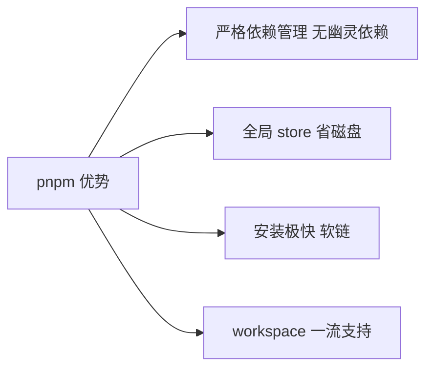
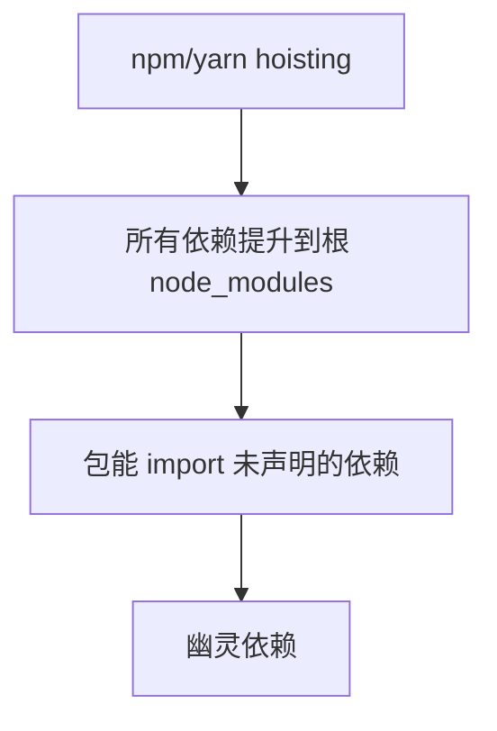
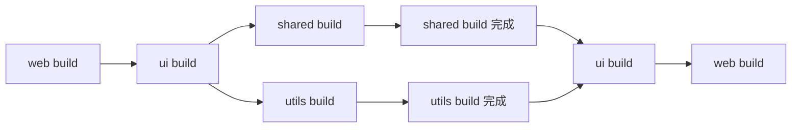
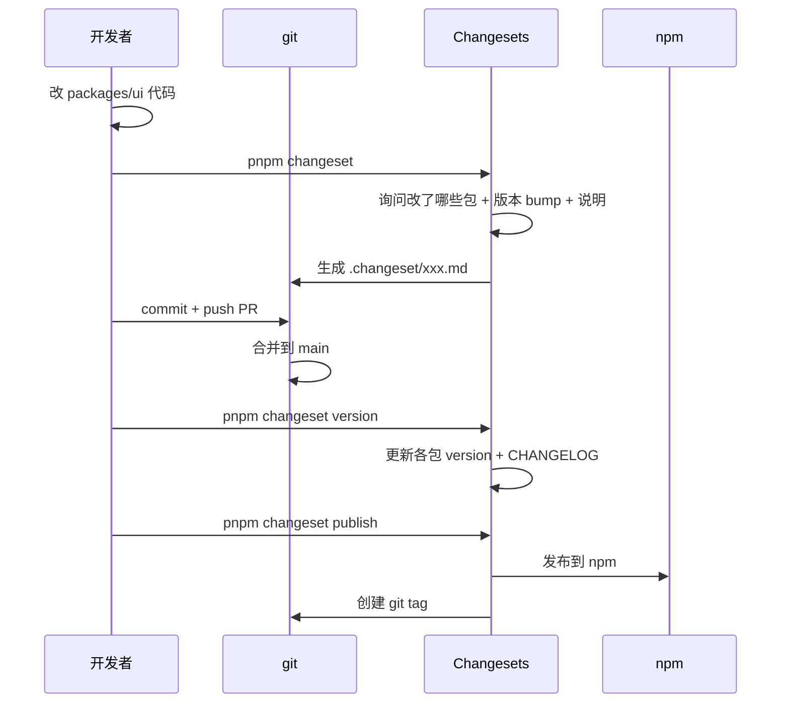

# Monorepo · 常见面试题与最佳实践

> 本文档位于 `知识库/前端/04工程化与构建/05Monorepo/`，是 Monorepo 的面试题集与生产最佳实践。配套核心知识见《核心知识点详解.md》。
>
> 15 道高频题 + 8 个生产场景 + 完整 Checklist，覆盖 pnpm workspace、依赖管理、Turborepo/Nx、Changesets、共享配置、CI/CD 等面试常考点。

---

## 一、概念与选型类（高频）

### 1. Monorepo 与 Polyrepo 怎么选？

**核心答案**：多包共享代码、统一发版、跨包重构选 Monorepo；完全独立、合规隔离选 Polyrepo。

| 维度 | Polyrepo | Monorepo |
|---|---|---|
| 代码共享 | 难（需发包） | 易（workspace 软链） |
| 跨包变更 | 多 PR 多版本对齐 | 单 PR 原子提交 |
| 重构 | 跨仓库难 | 改 API 自动找出引用 |
| CI | 各仓库独立 | 统一一份 |
| 仓库大小 | 小 | 大（需 sparse-checkout） |
| 权限隔离 | 天然 | 需 CODEOWNERS |

**适合 Monorepo 的场景**：

- 组件库 + 文档站 + 示例
- 多个应用共享 utils/types/ui
- 微前端共享协议层
- 前端 + 后端 + CLI 一体化

**不适合**：

- 完全独立的业务项目
- 外包团队各管各的
- 合规要求物理隔离

---

### 2. pnpm 与 npm/yarn workspace 有什么区别？为什么选 pnpm？

**核心答案**：pnpm 用软链 + 全局 store 避免幽灵依赖、磁盘占用小、安装快；npm/yarn 默认 hoisting 导致幽灵依赖。

| 维度 | npm | yarn (v1) | yarn (v2+) | pnpm |
|---|---|---|---|---|
| workspace | v7+ | ✓ | ✓ | ✓ |
| hoisting | 默认 | 默认 | 可配 | 严格（默认） |
| 幽灵依赖 | 有 | 有 | 可避免 | 默认避免 |
| 磁盘占用 | 全量复制 | 全量复制 | 全量复制 | 软链 + 全局缓存 |
| 安装速度 | 慢 | 中 | 中 | 极快 |
| Monorepo 支持 | 弱 | 中 | 中 | 强 |

**pnpm 三个核心优势**：



<!-- -->

**1. 严格依赖**：每个包只能 import 自己 dependencies 声明的依赖。

```json
// packages/ui/package.json
{ "dependencies": { "react": "^18" } }

// packages/ui/src/index.tsx
import _ from "lodash";  // 报错！未声明
```

```json
// 修复
{ "dependencies": { "react": "^18", "lodash": "^4" } }
```

**2. 全局 store**：所有版本依赖只在全局存一份（如 `~/.pnpm-store`），项目内用软链——磁盘占用减少 80%+。

**3. 安装快**：软链 + 全局缓存，不重复下载。

---

### 3. Turborepo 与 Nx 怎么选？

**核心答案**：简单 JS/TS Monorepo 选 Turborepo（配置简单、速度快）；复杂场景、需要 generator/插件选 Nx。

| 维度 | Turborepo | Nx |
|---|---|---|
| 配置简单 | 极简 | 中等 |
| 速度 | 极快 | 快 |
| 缓存 | 本地 + 远程 | 本地 + 远程 |
| 代码生成 | 弱 | 强 |
| 依赖图 | 弱 | 强 |
| 插件 | 弱 | 强 |
| 学习曲线 | 低 | 中 |
| 适用 | JS/TS Monorepo | JS/TS + 多语言 |

**Turborepo 适合**：

- 纯 JS/TS 项目
- 中小团队
- 不需要复杂代码生成
- 已有 pnpm workspace

**Nx 适合**：

- 需要代码生成（创建新包、新组件自动注册）
- 需要可视化依赖图
- 多语言（含 Go/Rust）
- 大型复杂 Monorepo

**示例**：

```bash
# Turborepo 配置极简
{
  "pipeline": {
    "build": { "dependsOn": ["^build"], "outputs": ["dist/**"] }
  }
}

# Nx 配置更丰富
{
  "tasksRunnerOptions": {
    "default": { "runner": "nx/tasks-runners/default" }
  },
  "targetDefaults": {
    "build": { "dependsOn": ["^build"], "outputs": ["{projectRoot}/dist"] }
  }
}
```

```bash
# Nx 还能 generator
nx g @nx/react:library --name=ui --directory=packages/ui

# 可视化依赖图
nx graph
```

---

## 二、workspace 与依赖管理类（高频）

### 4. pnpm workspace 怎么配置？

**核心答案**：根目录 `pnpm-workspace.yaml` 指定包路径，子包用 `workspace:*` 引用本地包。

```yaml
# pnpm-workspace.yaml
packages:
  - "packages/*"
  - "apps/*"
  - "tools/*"
```

```json
// packages/ui/package.json
{
  "name": "@myrepo/ui",
  "version": "1.0.0",
  "main": "./dist/index.js",
  "module": "./dist/index.esm.js",
  "types": "./dist/index.d.ts",
  "dependencies": {
    "@myrepo/utils": "workspace:*",
    "@myrepo/shared": "workspace:^1.0.0",
    "react": "^18.0.0"
  },
  "peerDependencies": {
    "react": ">=17"
  }
}
```

**workspace:* 含义**：

- `workspace:*`：任意本地版本（发版时替换为当前版本）。
- `workspace:^1.0.0`：限定版本范围。
- `workspace:~1.0.0`：限定补丁版本。

发版时 pnpm 自动把 `workspace:*` 替换为真实版本号（如 `^1.2.3`）。

**目录结构**：

```
my-monorepo/
├── package.json          # 根
├── pnpm-workspace.yaml
├── pnpm-lock.yaml
├── tsconfig.base.json
├── turbo.json
├── packages/             # 库
│   ├── shared/
│   ├── ui/
│   └── utils/
├── apps/                 # 应用
│   ├── web/
│   └── admin/
└── tools/
```

**常用命令**：

```bash
# 安装所有依赖
pnpm install

# 在所有包跑命令
pnpm -r build

# 在指定包跑命令
pnpm --filter @myrepo/ui build

# 给某包装依赖
pnpm add lodash --filter @myrepo/ui

# 给根包装 dev 依赖（不进子包）
pnpm add -D typescript -w
```

---

### 5. 什么是幽灵依赖？怎么避免？

**核心答案**：幽灵依赖是包能 import 自己未声明的依赖（因 npm/yarn hoisting 把传递依赖提升到根）。pnpm 默认严格模式避免。



<!-- -->

**示例**：

```json
// packages/ui/package.json
{ "dependencies": { "react": "^18" } }
```

```ts
// packages/ui/src/index.tsx
import _ from "lodash";  // npm/yarn 下能跑！lodash 是 react 的传递依赖被提升了
```

**问题**：

- react 升级去掉 lodash 依赖 → ui 立即崩溃。
- ui 发版给别人用，别人没装 lodash → 用不了。
- 依赖图不清晰，审计难。

**pnpm 解决**：

```
packages/ui/node_modules/
├── react/        ← 软链到全局 store
├── react-dom/    ← 软链到全局 store
└── .pnpm/        ← 依赖的真实位置（含传递依赖）
```

pnpm 每个包有独立 `node_modules`，只软链自己 `dependencies` 声明的依赖——彻底避免幽灵依赖。

```ts
// packages/ui/src/index.tsx (pnpm 下)
import _ from "lodash";  // 报错！未声明
```

**.npmrc 配置**：

```ini
# 严格 peer deps（推荐）
strict-peer-dependencies=true

# 不开 shamefully-hoist（避免幽灵依赖）
shamefully-hoist=false

# node-linker 模式
node-linker=isolated  # 默认，推荐
# node-linker=hoisted # 兼容老工具，会引入幽灵依赖
```

---

### 6. workspace:* 与发布时怎么处理版本？

**核心答案**：开发期 `workspace:*` 软链本地包；发版时 pnpm 自动替换为真实版本号（如 `^1.2.3`）。

```json
// 开发期 - packages/ui/package.json
{
  "dependencies": {
    "@myrepo/utils": "workspace:*"
  }
}
```

```bash
# 发版时
pnpm changeset publish
# 自动把 workspace:* 替换为 ^1.2.3（utils 当前版本）
```

**版本号写法**：

| 写法 | 含义 | 发版后替换为 |
|---|---|---|
| `workspace:*` | 任意本地版本 | `^1.2.3`（当前版本 + ^） |
| `workspace:^` | 用包当前版本 | `^1.2.3` |
| `workspace:~` | 用包当前版本 | `~1.2.3` |
| `workspace:^1.0.0` | 限定版本范围 | `^1.0.0`（不变） |
| `workspace:1.0.0` | 精确版本 | `1.0.0`（不变） |

**注意**：

- 开发期软链让本地改动立即生效。
- 发版前要先 `pnpm changeset version` 更新各包版本。
- `pnpm publish -r` 会按拓扑顺序发布（先发被依赖的包）。

---

## 三、构建与缓存类（高频）

### 7. Turborepo 怎么配置任务依赖？

**核心答案**：`turbo.json` 的 `pipeline` 字段，每个任务配 `dependsOn`、`outputs`、`inputs`。

```json
// turbo.json
{
  "$schema": "https://turbo.build/schema.json",
  "globalDependencies": ["tsconfig.base.json", ".env"],
  "globalEnv": ["NODE_ENV"],
  "pipeline": {
    "build": {
      "dependsOn": ["^build"],          // 上游包先 build
      "outputs": ["dist/**"],
      "inputs": ["src/**", "package.json", "tsconfig.json"]
    },
    "test": {
      "dependsOn": ["build"],
      "inputs": ["src/**", "test/**", "vitest.config.ts"]
    },
    "lint": {
      "inputs": ["src/**", ".eslintrc.cjs"]
    },
    "dev": {
      "cache": false,
      "persistent": true
    }
  }
}
```

**关键配置**：

- **dependsOn**：
  - `["^build"]`：上游包的 build 先跑（`^` 表示上游）。
  - `["build"]`：本包的 build 先跑（同包内）。
  - `["^build", "build"]`：上游 build + 自己 build 先跑。
- **outputs**：缓存命中的产物路径，下次跳过执行直接恢复。
- **inputs**：缓存 key 的输入文件，变了就重跑。
- **cache: false**：dev 不缓存（持久运行）。
- **persistent: true**：长期运行的任务（dev server、watch）。

**任务依赖图**：



<!-- -->

`^build` 让 turbo 按 `workspace:*` 引用关系拓扑排序：

1. 先 build `shared`、`utils`（无依赖）。
2. 再 build `ui`（依赖 shared、utils）。
3. 最后 build `web`（依赖 ui）。

---

### 8. Turborepo 缓存怎么工作？怎么用远程缓存？

**核心答案**：缓存 key 基于输入（源码、依赖、env），相同输入跳过执行直接恢复 `outputs`。远程缓存让 CI 与团队共享。

**本地缓存**：

```bash
# 默认在 .turbo/cache
turbo build
# 命中缓存 → 秒级恢复 dist/

# 强制重跑
turbo build --force

# 清缓存
rm -rf .turbo
```

**缓存 key**：

- 源码 hash（`inputs` 配置的文件）。
- 依赖 hash（package.json dependencies）。
- 环境变量（`globalEnv`）。
- 全局依赖（`globalDependencies`）。

任一变化 → 缓存失效 → 重新执行。

**远程缓存（Vercel 免费）**：

```bash
turbo login
turbo link
# 后续 turbo build 自动用远程缓存
```

**自托管远程缓存**：

```bash
TURBO_API=https://cache.example.com \
TURBO_TOKEN=xxx \
turbo build
```

```yaml
# .github/workflows/ci.yml
env:
  TURBO_TOKEN: ${{ secrets.TURBO_TOKEN }}
  TURBO_TEAM: my-team
```

**缓存收益**：

- 本地：第二次 build 几秒。
- CI：团队成员改 A 包，CI 只重跑 A 及下游（其他包命中远程缓存）。
- 跨分支：feature 分支与 main 改动少时，缓存复用率高。

---

### 9. 怎么只跑受影响的包？

**核心答案**：用 `--filter` 或 `affected` 命令，基于 git diff 找出受影响包。

**Turborepo filter**：

```bash
# 只跑 @myrepo/web 包及依赖
turbo build --filter=@myrepo/web...

# 只跑依赖 @myrepo/ui 的包
turbo build --filter=...@myrepo/ui

# 只跑自 main 以来变动的包及下游
turbo build --filter=...[origin/main]

# 只跑变动的包（不含下游）
turbo build --filter=[origin/main]

# 排除某些包
turbo build --filter=!@myrepo/docs
```

**CI 增量构建**：

```yaml
# .github/workflows/ci.yml
- run: pnpm install --frozen-lockfile
- run: pnpm turbo build --filter=...[origin/main]
- run: pnpm turbo test --filter=...[origin/main]
- run: pnpm turbo lint --filter=...[origin/main]
```

**Nx affected**：

```bash
# 只跑受 main 影响的包
nx affected:build
nx affected:test
nx affected:lint

# 看受影响的包
nx affected:apps
nx affected:libs
```

**收益**：

- 改一个包只跑它及下游，CI 时间从 10 分钟降到 1 分钟。
- 大型 Monorepo 必备能力。

---

## 四、版本与发布类（高频）

### 10. Changesets 工作流是什么？

**核心答案**：开发期用 `pnpm changeset` 记录变更，合并到 main 后 `changeset version` 应用版本与 CHANGELOG，最后 `changeset publish` 发布到 npm。



<!-- -->

**初始化**：

```bash
pnpm add -D @changesets/cli
pnpm changeset init
```

```json
// .changeset/config.json
{
  "changelog": "@changesets/cli/changelog",
  "commit": false,
  "fixed": [],
  "linked": [],
  "access": "public",
  "baseBranch": "main",
  "updateInternalDependencies": "patch",
  "ignore": ["@myrepo/docs"]
}
```

**核心命令**：

```bash
# 1. 记录变更（开发期）
pnpm changeset
# 交互式选择：哪些包变 + 版本 bump（patch/minor/major）+ 说明

# 2. 应用变更（合并到 main 后）
pnpm changeset version
# 更新 package.json version + CHANGELOG.md

# 3. 发布
pnpm changeset publish
# 发布到 npm + 创建 git tag
```

**.changeset 文件示例**：

```markdown
<!-- .changeset/loud-tigers-jump.md -->
---
"@myrepo/ui": minor
"@myrepo/utils": patch
---

Add new Button component with primary variant.
```

每个 changeset 是一个 markdown 文件，记录：

- 哪些包要发版。
- 版本 bump 类型（patch/minor/major）。
- 变更说明（写入 CHANGELOG）。

---

### 11. 怎么自动化 Changesets 发布？

**核心答案**：用 `changesets/action` 在 GitHub Actions 自动创建 "Version Packages" PR，合并后自动发布。

```yaml
# .github/workflows/release.yml
name: Release
on:
  push:
    branches: [main]
jobs:
  release:
    runs-on: ubuntu-latest
    steps:
      - uses: actions/checkout@v4
        with: { fetch-depth: 0 }
      - uses: pnpm/action-setup@v2
      - uses: actions/setup-node@v4
        with:
          node-version: 20
          cache: pnpm
          registry-url: "https://registry.npmjs.org"
      - run: pnpm install --frozen-lockfile
      - name: Create Release PR or Publish
        uses: changesets/action@v1
        with:
          publish: pnpm changeset publish
          version: pnpm changeset version
          title: "chore: version packages"
          commit: "chore: version packages"
        env:
          GITHUB_TOKEN: ${{ secrets.GITHUB_TOKEN }}
          NPM_TOKEN: ${{ secrets.NPM_TOKEN }}
          NODE_AUTH_TOKEN: ${{ secrets.NPM_TOKEN }}
```

**工作流**：


<!-- -->

**关键点**：

- `changesets/action` 自动判断：有未应用 changeset → 创建 Version PR；已应用 → publish。
- `version` PR 自动 bump 版本 + 生成 CHANGELOG + 更新 `workspace:*` 引用版本。
- 合并 Version PR 后自动 publish + 创建 tag。
- `NPM_TOKEN` 在 npm 创建，配 GitHub Secret。

---

## 五、共享配置类（高频）

### 12. 怎么共享 tsconfig 配置？

**核心答案**：根放 `tsconfig.base.json`，各包 `extends` 继承；Monorepo 还可发布 `@org/tsconfig` npm 包跨仓库共享。

```json
// tsconfig.base.json（根）
{
  "compilerOptions": {
    "target": "ES2022",
    "module": "ESNext",
    "moduleResolution": "Bundler",
    "strict": true,
    "esModuleInterop": true,
    "skipLibCheck": true,
    "forceConsistentCasingInFileNames": true,
    "resolveJsonModule": true,
    "isolatedModules": true,
    "verbatimModuleSyntax": true
  }
}
```

```json
// packages/ui/tsconfig.json
{
  "extends": "../../tsconfig.base.json",
  "compilerOptions": {
    "jsx": "react-jsx",
    "lib": ["ES2022", "DOM"],
    "outDir": "dist",
    "rootDir": "src",
    "composite": true,
    "declaration": true
  },
  "references": [{ "path": "../shared" }],
  "include": ["src"]
}
```

**根 tsconfig 用 references**：

```json
// tsconfig.json（根）
{
  "files": [],
  "references": [
    { "path": "./packages/shared" },
    { "path": "./packages/ui" },
    { "path": "./apps/web" }
  ]
}
```

```bash
# 增量编译所有包
tsc --build

# 监听
tsc --build --watch
```

**跨仓库共享（发布 npm 包）**：

```json
// packages/tsconfig/package.json
{
  "name": "@myrepo/tsconfig",
  "version": "1.0.0",
  "files": ["base.json", "react.json", "node.json"]
}
```

```json
// 其他仓库的 tsconfig.json
{
  "extends": "@myrepo/tsconfig/base.json"
}
```

---

### 13. 怎么共享 ESLint 与 Vite 配置？

**核心答案**：发布 `@myrepo/eslint-config` 与 `@myrepo/vite-config` npm 包，业务包 import 复用。

**ESLint 共享配置**：

```js
// packages/eslint-config/index.js
import js from "@eslint/js";
import tseslint from "typescript-eslint";
import react from "eslint-plugin-react";
import prettier from "eslint-config-prettier";

export const baseConfig = [
  { ignores: ["dist/**", "node_modules/**"] },
  js.configs.recommended,
  ...tseslint.configs.recommended,
  prettier,
];

export const reactConfig = [
  ...baseConfig,
  {
    files: ["**/*.{ts,tsx}"],
    plugins: { react },
    languageOptions: {
      parserOptions: { ecmaFeatures: { jsx: true } },
    },
    rules: { ...react.configs.flat.recommended.rules },
  },
];

export default baseConfig;
```

```json
// packages/eslint-config/package.json
{
  "name": "@myrepo/eslint-config",
  "version": "1.0.0",
  "main": "index.js",
  "type": "module",
  "exports": {
    ".": "./index.js",
    "./react": "./react.js"
  },
  "dependencies": {
    "@eslint/js": "^9",
    "typescript-eslint": "^8",
    "eslint-plugin-react": "^7",
    "eslint-config-prettier": "^9"
  },
  "peerDependencies": { "eslint": ">=8" }
}
```

业务包用：

```js
// apps/web/eslint.config.js
import { reactConfig } from "@myrepo/eslint-config";
export default [
  ...reactConfig,
  {
    rules: { "@typescript-eslint/no-explicit-any": "off" },
  },
];
```

**Vite 共享配置**：

```ts
// packages/vite-config/index.ts
import { defineConfig } from "vite";
import react from "@vitejs/plugin-react";
import tsconfigPaths from "vite-tsconfig-paths";
import { compression } from "vite-plugin-compression";

export function createViteConfig(options = {}) {
  return defineConfig({
    plugins: [
      react(),
      tsconfigPaths(),
      ...(options.compression ? [compression({ algorithm: "brotliCompress" })] : []),
    ],
    resolve: { alias: options.alias || {} },
    build: {
      target: "es2018",
      minify: "esbuild",
      chunkSizeWarningLimit: 1000,
      rollupOptions: {
        output: {
          manualChunks: options.manualChunks || {
            "react-vendor": ["react", "react-dom"],
          },
        },
      },
    },
  });
}
```

```ts
// apps/web/vite.config.ts
import { createViteConfig } from "@myrepo/vite-config";
export default createViteConfig({
  alias: { "@": "/src" },
  compression: true,
});
```

---

## 六、CI/CD 类（高频）

### 14. Monorepo 的 CI 怎么配置？

**核心答案**：pnpm install + turbo build/test/lint，配合远程缓存与增量构建。

```yaml
# .github/workflows/ci.yml
name: CI
on: [push, pull_request]
jobs:
  check:
    runs-on: ubuntu-latest
    steps:
      - uses: actions/checkout@v4
        with: { fetch-depth: 0 }  # 让 turbo 能 diff
      - uses: pnpm/action-setup@v2
      - uses: actions/setup-node@v4
        with: { node-version: 20, cache: pnpm }
      - run: pnpm install --frozen-lockfile
      - uses: actions/cache@v4
        with:
          path: .turbo
          key: turbo-${{ runner.os }}-${{ github.sha }}
          restore-keys: |
            turbo-${{ runner.os }}-
      - name: Build (incremental)
        run: pnpm turbo build --filter=...[origin/main]
        env:
          TURBO_TOKEN: ${{ secrets.TURBO_TOKEN }}
          TURBO_TEAM: my-team
      - name: Lint
        run: pnpm turbo lint --filter=...[origin/main]
      - name: Test
        run: pnpm turbo test --filter=...[origin/main]
      - name: Typecheck
        run: pnpm turbo typecheck --filter=...[origin/main]
```

**关键点**：

- `fetch-depth: 0`：让 turbo 能拿到 git 历史做 diff。
- `cache: pnpm`：缓存 pnpm store。
- `actions/cache`：缓存 turbo 本地缓存。
- `TURBO_TOKEN` + `TURBO_TEAM`：用远程缓存。
- `--filter=...[origin/main]`：只跑受影响包及下游。

**Matrix 策略（多 Node 版本）**：

```yaml
jobs:
  check:
    strategy:
      matrix:
        node-version: [18, 20, 22]
    runs-on: ubuntu-latest
    steps:
      - uses: actions/checkout@v4
      - uses: pnpm/action-setup@v2
      - uses: actions/setup-node@v4
        with: { node-version: ${{ matrix.node-version }}, cache: pnpm }
      - run: pnpm install --frozen-lockfile
      - run: pnpm test
```

---

### 15. 怎么部署 Monorepo 的应用？

**核心答案**：用 Docker 多阶段构建，根据 `--filter` 只构建目标应用及依赖。

**Dockerfile（web 应用）**：

```dockerfile
# Dockerfile
FROM node:20-alpine AS builder
WORKDIR /app
RUN npm install -g pnpm

# 先 copy 整个 monorepo 让 pnpm install 能解析所有 workspace
COPY pnpm-workspace.yaml pnpm-lock.yaml package.json ./
COPY packages ./packages
COPY apps ./apps

# 装依赖
RUN pnpm install --frozen-lockfile

# 只 build 目标应用及依赖
RUN pnpm turbo build --filter=@myrepo/web...

# 运行时镜像
FROM nginx:alpine
COPY --from=builder /app/apps/web/dist /usr/share/nginx/html
COPY nginx.conf /etc/nginx/conf.d/default.conf
EXPOSE 80
CMD ["nginx", "-g", "daemon off;"]
```

**docker-compose.yml**：

```yaml
services:
  web:
    build:
      context: .
      dockerfile: apps/web/Dockerfile
    ports: ["80:80"]

  admin:
    build:
      context: .
      dockerfile: apps/admin/Dockerfile
    ports: ["81:80"]

  api:
    build:
      context: .
      dockerfile: apps/api/Dockerfile
    ports: ["3000:3000"]
```

**注意**：

- Docker 构建上下文必须是 monorepo 根，让 pnpm 能解析 workspace。
- 用 `--filter` 只构建目标应用及依赖，减小构建产物。
- 用 BuildKit cache mount 加速 pnpm install。

```dockerfile
# 加速 pnpm install
RUN --mount=type=cache,id=pnpm,target=/root/.local/share/pnpm/store \
    pnpm install --frozen-lockfile
```

---

## 七、生产最佳实践

### 7.1 推荐 pnpm-workspace.yaml

```yaml
packages:
  - "packages/*"
  - "apps/*"
  - "tools/*"
  - "docs"
```

### 7.2 推荐根 package.json

```json
{
  "name": "my-monorepo",
  "version": "0.0.0",
  "private": true,
  "type": "module",
  "scripts": {
    "build": "turbo build",
    "dev": "turbo dev",
    "test": "turbo test",
    "lint": "turbo lint",
    "typecheck": "turbo typecheck",
    "clean": "turbo clean && rm -rf node_modules",
    "format": "prettier --write \"**/*.{ts,tsx,css,md,json}\"",
    "changeset": "changeset",
    "version-packages": "changeset version",
    "release": "turbo build && changeset publish"
  },
  "devDependencies": {
    "@changesets/cli": "^2.27.0",
    "prettier": "^3.0.0",
    "turbo": "^2.0.0",
    "typescript": "^5.4.0"
  },
  "packageManager": "pnpm@9.0.0",
  "engines": {
    "node": ">=20"
  }
}
```

### 7.3 推荐 .npmrc

```ini
strict-peer-dependencies=true
auto-install-peers=true
shamefully-hoist=false
node-linker=isolated
```

### 7.4 推荐 turbo.json

```json
{
  "$schema": "https://turbo.build/schema.json",
  "globalDependencies": ["tsconfig.base.json", ".env", "pnpm-workspace.yaml"],
  "globalEnv": ["NODE_ENV", "CI"],
  "pipeline": {
    "build": {
      "dependsOn": ["^build"],
      "outputs": ["dist/**", ".next/**", "!.next/cache/**"],
      "inputs": ["src/**", "package.json", "tsconfig.json", "vite.config.ts"]
    },
    "test": {
      "dependsOn": ["build"],
      "inputs": ["src/**", "test/**", "vitest.config.ts", "jest.config.ts"]
    },
    "lint": {
      "inputs": ["src/**", ".eslintrc.cjs", "eslint.config.js"]
    },
    "typecheck": {
      "dependsOn": ["^build"],
      "inputs": ["src/**", "tsconfig.json"]
    },
    "dev": {
      "cache": false,
      "persistent": true
    },
    "clean": {
      "cache": false
    }
  }
}
```

### 7.5 推荐目录结构

```
my-monorepo/
├── package.json
├── pnpm-workspace.yaml
├── pnpm-lock.yaml
├── .npmrc
├── tsconfig.base.json
├── tsconfig.json                # 根 references
├── turbo.json
├── .changeset/
│   ├── config.json
│   └── README.md
├── .github/workflows/
│   ├── ci.yml
│   └── release.yml
├── packages/                    # 库
│   ├── eslint-config/
│   │   ├── package.json
│   │   └── index.js
├── tsconfig-config/
│   │   ├── package.json
│   │   └── base.json
│   ├── vite-config/
│   │   ├── package.json
│   │   └── index.ts
│   ├── shared/                  # 共享类型/工具
│   │   ├── package.json
│   │   ├── tsconfig.json
│   │   └── src/
│   ├── ui/                      # UI 组件库
│   │   ├── package.json
│   │   ├── tsconfig.json
│   │   └── src/
│   └── utils/                   # 工具函数
│       ├── package.json
│       ├── tsconfig.json
│       └── src/
├── apps/                        # 应用
│   ├── web/                     # 主站
│   │   ├── package.json
│   │   ├── tsconfig.json
│   │   ├── vite.config.ts
│   │   └── src/
│   ├── admin/                   # 后台
│   │   ├── package.json
│   │   ├── vite.config.ts
│   │   └── src/
│   └── docs/                    # 文档站
│       ├── package.json
│       └── src/
└── tools/
    └── build/                   # 构建脚本
        └── src/
```

### 7.6 推荐包 package.json 模板

```json
// packages/ui/package.json
{
  "name": "@myrepo/ui",
  "version": "1.0.0",
  "description": "Shared UI components for my repo",
  "type": "module",
  "main": "./dist/index.js",
  "module": "./dist/index.esm.js",
  "types": "./dist/index.d.ts",
  "exports": {
    ".": {
      "types": "./dist/index.d.ts",
      "import": "./dist/index.esm.js",
      "require": "./dist/index.cjs.js"
    }
  },
  "files": ["dist"],
  "scripts": {
    "build": "vite build",
    "dev": "vite build --watch",
    "lint": "eslint . --max-warnings 0",
    "test": "vitest run",
    "typecheck": "tsc --noEmit",
    "clean": "rm -rf dist .turbo"
  },
  "dependencies": {
    "@myrepo/utils": "workspace:*",
    "@myrepo/shared": "workspace:*"
  },
  "peerDependencies": {
    "react": ">=17",
    "react-dom": ">=17"
  },
  "devDependencies": {
    "@myrepo/eslint-config": "workspace:*",
    "@myrepo/tsconfig": "workspace:*",
    "@myrepo/vite-config": "workspace:*",
    "react": "^18.0.0",
    "react-dom": "^18.0.0"
  },
  "publishConfig": {
    "access": "public"
  }
}
```

### 7.7 推荐 GitHub Actions CI

```yaml
# .github/workflows/ci.yml
name: CI
on:
  push:
    branches: [main]
  pull_request:
    branches: [main]
jobs:
  check:
    runs-on: ubuntu-latest
    steps:
      - uses: actions/checkout@v4
        with: { fetch-depth: 0 }
      - uses: pnpm/action-setup@v2
        with: { version: 9 }
      - uses: actions/setup-node@v4
        with:
          node-version: 20
          cache: pnpm
      - run: pnpm install --frozen-lockfile
      - uses: actions/cache@v4
        with:
          path: .turbo
          key: turbo-${{ runner.os }}-${{ github.ref }}-${{ github.sha }}
          restore-keys: |
            turbo-${{ runner.os }}-${{ github.ref }}-
            turbo-${{ runner.os }}-
      - run: pnpm turbo build lint typecheck test --filter=...[origin/main]
        env:
          TURBO_TOKEN: ${{ secrets.TURBO_TOKEN }}
          TURBO_TEAM: ${{ secrets.TURBO_TEAM }}
```

### 7.8 推荐 Release 工作流

```yaml
# .github/workflows/release.yml
name: Release
on:
  push:
    branches: [main]
jobs:
  release:
    runs-on: ubuntu-latest
    permissions:
      contents: write
      pull-requests: write
      id-token: write
    steps:
      - uses: actions/checkout@v4
        with: { fetch-depth: 0 }
      - uses: pnpm/action-setup@v2
      - uses: actions/setup-node@v4
        with:
          node-version: 20
          cache: pnpm
          registry-url: "https://registry.npmjs.org"
      - run: pnpm install --frozen-lockfile
      - name: Create Release PR or Publish
        uses: changesets/action@v1
        with:
          publish: pnpm release
          version: pnpm version-packages
          title: "chore: version packages"
          commit: "chore: version packages"
        env:
          GITHUB_TOKEN: ${{ secrets.GITHUB_TOKEN }}
          NPM_TOKEN: ${{ secrets.NPM_TOKEN }}
          NODE_AUTH_TOKEN: ${{ secrets.NPM_TOKEN }}
```

---

## 八、最佳实践 Checklist

### 8.1 包管理

- 用 pnpm（不用 npm/yarn）
- `pnpm-workspace.yaml` 配置 packages
- 包间引用用 `workspace:*`
- `.npmrc` 配置 `strict-peer-dependencies=true`
- 不开 `shamefully-hoist`（避免幽灵依赖）
- `packageManager` 字段固定 pnpm 版本

### 8.2 目录结构

- `packages/` 放库
- `apps/` 放应用
- `tools/` 放脚本
- 共享配置放根：`tsconfig.base.json`、`eslint.config.js`、`.prettierrc`

### 8.3 构建工具

- 用 Turborepo 或 Nx
- `turbo.json` 配置 pipeline
- `dependsOn: ["^build"]` 拓扑排序
- `outputs` 配置缓存路径
- `inputs` 配置缓存 key 输入
- 启用远程缓存

### 8.4 TS 配置

- `tsconfig.base.json` 共享基础
- 各包 `extends` 继承
- 各包 `composite: true` + `declaration: true`
- 根 tsconfig 用 `references`
- `tsc --build` 增量编译
- `verbatimModuleSyntax: true` 强制类型导入

### 8.5 ESLint 配置

- `@myrepo/eslint-config` 共享配置包
- 各包 `import` 共享配置
- 业务包覆盖业务专属规则
- CI 跑 `turbo lint`

### 8.6 发布

- `changesets` 管理版本
- `.changeset/config.json` 配置
- GitHub Actions 自动 release PR + publish
- `access: "public"` 公开发布
- `publishConfig` 配置 npm registry

### 8.7 CI/CD

- `pnpm install --frozen-lockfile`
- `turbo build --filter=...[origin/main]` 增量
- `turbo run typecheck lint test`
- 远程缓存加速
- Matrix 多 Node 版本测试

### 8.8 文档

- `README.md` 根介绍 + 快速开始
- `CONTRIBUTING.md` 贡献指南
- 每个包 `README.md` 自描述
- `apps/docs/` 集中文档站（如 Docusaurus）
- 包间依赖图（`nx graph` 或手动）

### 8.9 安全

- `CODEOWNERS` 配置包级 reviewer
- 分支保护规则（main 不能直接 push）
- PR review 必须至少 1 个 approve
- NPM_TOKEN 用 GitHub Secret，不硬编码
- npm 包加 2FA（发布需双因素认证）

---

## 九、一句话总纲

> Monorepo 的本质是 **"多包同仓库 + workspace 软链 + 任务编排"**：pnpm workspace 用 `workspace:*` 软链本地包、严格依赖管理避免幽灵依赖；Turborepo/Nx 做任务编排 + 缓存 + 增量构建（按拓扑顺序、只跑变动包）；Changesets 管理版本与发布（变更追踪 + 自动 CHANGELOG + 发版 PR）；共享配置（tsconfig/eslint/vite）让全团队一致；`--filter` 与远程缓存让 CI 速度与项目规模解耦。能答出"Monorepo 与 Polyrepo 取舍""pnpm 为什么避免幽灵依赖""Turborepo 与 Nx 怎么选""Changesets 工作流""Project References 与 workspace 配合""共享配置怎么组织""怎么只跑受影响包"，就是高级前端对 Monorepo 的认知。
