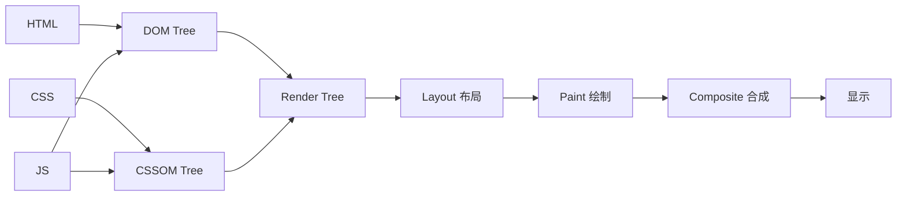
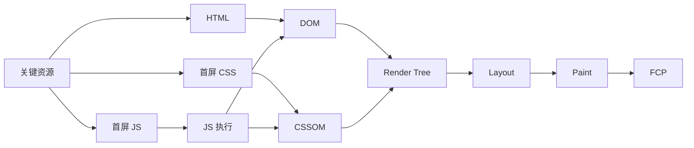
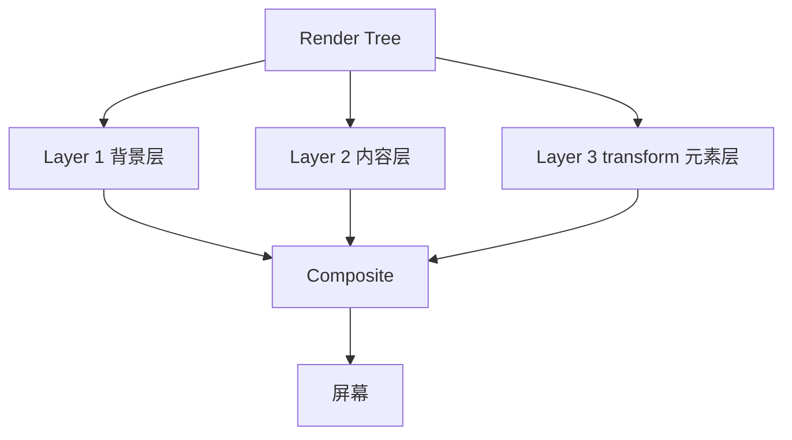
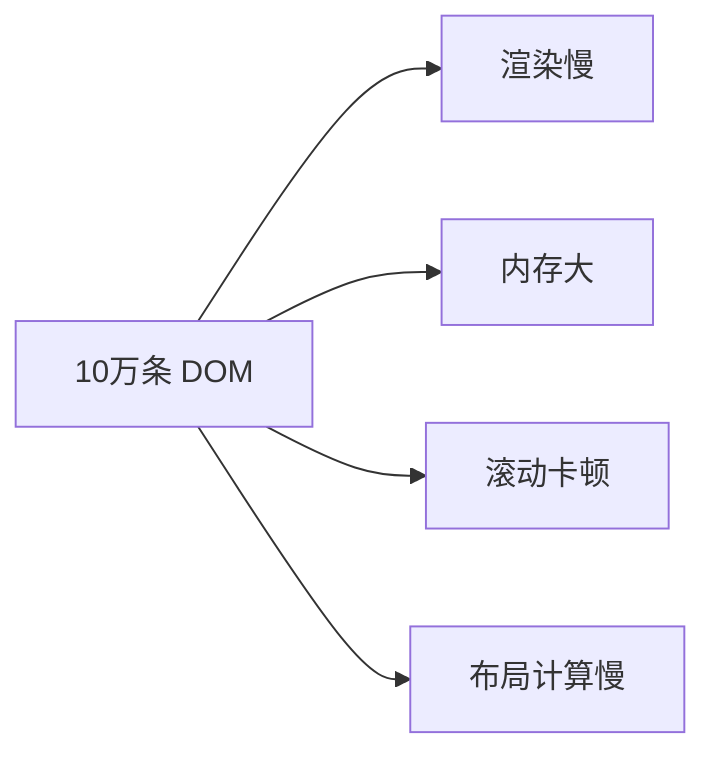
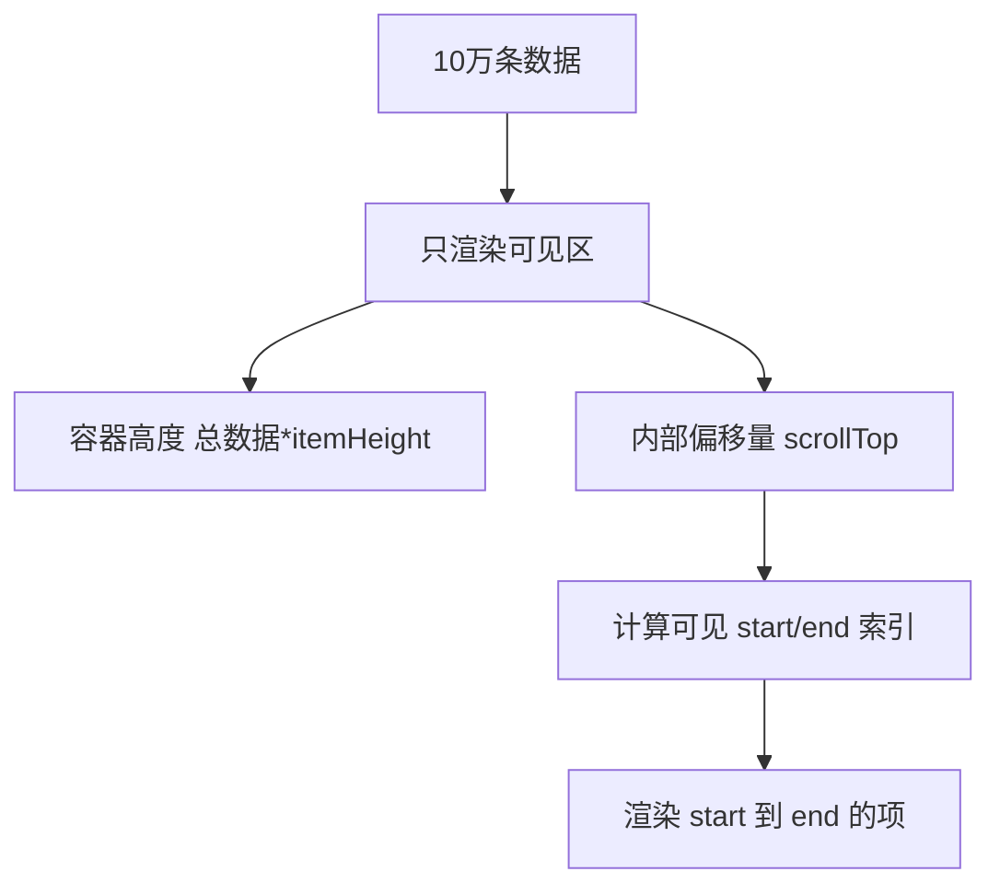
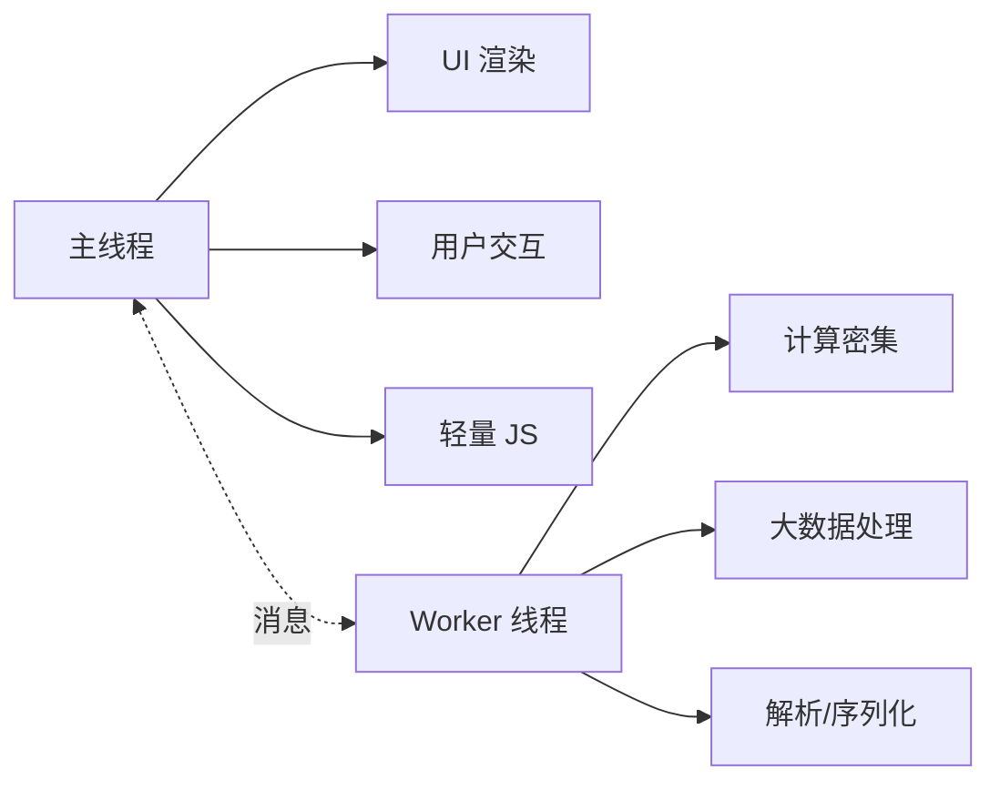

# 渲染原理 · 核心知识点详解

> 本文档位于 `知识库/前端/05运行时与性能/01渲染原理/`，是浏览器渲染原理的核心知识库。配套面试题见《常见面试题与最佳实践.md》。
>
> 读完应能解释清楚"浏览器渲染流水线""关键渲染路径""回流与重绘的区别""合成层与 GPU 加速""为什么 transform 比 top 快""RAF 与 RIC 的区别"，并能据此优化动画与列表性能。

---

## 一、浏览器渲染流水线

### 1.1 完整流水线



<!-- -->

浏览器从 HTML/CSS/JS 到屏幕像素的完整流程：

1. **解析 HTML → DOM**：字节流解码 → 字符 → 标签化 → 节点 → DOM 树。
2. **解析 CSS → CSSOM**：选择器匹配 → 优先级计算 → CSSOM 树。
3. **合成 Render Tree**：DOM + CSSOM → Render Tree（只含可见节点，`display: none` 不入）。
4. **Layout（布局/回流）**：计算每个节点的几何位置（盒模型）。
5. **Paint（绘制）**：把节点绘制成位图（文字、颜色、阴影、图片）。
6. **Composite（合成）**：把各图层合成为最终图像，显示到屏幕。

### 1.2 关键渲染路径



<!-- -->

**关键渲染路径（Critical Rendering Path，CRP）**：首屏渲染必须经过的最小资源集合。

- **HTML**：必须，阻塞渲染。
- **CSS**：必须，阻塞渲染（无 CSS 不会渲染，避免 FOUC）。
- **JS**：可能阻塞——JS 能改 DOM/CSSOM，浏览器必须停下渲染等 JS 跑完。

**关键资源**：

- HTML 本身。
- `<head>` 内的 CSS（媒体查询匹配的）。
- 同步加载的 JS（无 `defer`/`async`）。

**优化目标**：减少关键资源数量、大小、长度。

---

## 二、回流与重绘

### 2.1 定义

```mermaid
flowchart LR
  A[DOM 改动] --> B{影响布局?}
  B -- 是 --> C[Layout 回流]
  C --> D[Paint 重绘]
  D --> E[Composite 合成]
  B -- 否 --> F{影响绘制?]
  F -- 是 --> D
  F -- 否 --> E
```

<!-- -->

- **回流（Reflow / Layout）**：几何属性变化（width、height、position、margin 等），触发重新布局。
- **重绘（Repaint）**：视觉属性变化（color、background、box-shadow 等），不改变几何，只重绘像素。
- **合成（Composite）**：transform、opacity 等变化，只重新合成图层，不回流不重绘。

**性能开销**：回流 > 重绘 > 合成。

### 2.2 触发回流的操作

```js
// 1. 改几何属性
el.style.width = "100px";
el.style.height = "200px";
el.style.margin = "10px";
el.style.padding = "5px";
el.style.left = "50px";
el.style.top = "50px";

// 2. 读布局信息（强制同步布局）
el.offsetTop;
el.offsetHeight;
el.clientWidth;
el.clientHeight;
el.scrollWidth;
el.scrollHeight;
el.getBoundingClientRect();
window.getComputedStyle(el);

// 3. DOM 结构变化
document.body.appendChild(el);
document.body.removeChild(el);
el.innerHTML = "...";

// 4. 窗口变化
window.resize;
```

### 2.3 强制同步布局（Layout Thrashing）

```js
// 错：读写交替，每次读都强制重新计算布局
for (let i = 0; i < items.length; i++) {
  items[i].style.left = items[i].offsetLeft + 10 + "px";  // 写 + 读交替
}
// 每次读 offsetLeft 强制浏览器立即计算布局（防止读到旧值）
```

```js
// 对：先读完再写
const offsets = items.map(el => el.offsetLeft);  // 一次性读完
items.forEach((el, i) => {
  el.style.left = offsets[i] + 10 + "px";         // 批量写
});
```

**关键认知**：浏览器会批量优化样式变更（一次回流处理多次变更），但读布局属性会**立即触发回流**（同步布局），打破批量优化。

### 2.4 现代浏览器的优化

```js
// 浏览器优化：批量 + RAF 调度
el.style.width = "100px";   // 不立即回流，标记 dirty
el.style.height = "200px";  // 仍不回流
// 浏览器在当前 JS task 结束、下一帧前统一回流一次
```

但仍需注意：

- 读布局属性会强制同步（立即回流）。
- 多次小回流合并为一次（不能消除，但减少次数）。
- 跨帧的回流无法合并。

---

## 三、合成层与 GPU 加速

### 3.1 图层（Layer）



<!-- -->

浏览器把页面分成多个**图层（Layer）**，每层独立绘制，最后合成器把所有图层合成为最终图像。

**图层来源**：

- **隐式图层**：浏览器自动为某些元素创建独立图层（如 `position: fixed`、`transform`、`opacity < 1`、video、canvas）。
- **显式图层**：开发者通过 `will-change` 提示创建图层。

### 3.2 合成层（Compositing Layer）

满足以下条件会被提升为合成层（GPU 加速）：

```css
/* 1. 3D 变换 */
.transform-3d { transform: translateZ(0); }

/* 2. opacity < 1 但有动画 */
.fade { opacity: 0.5; transition: opacity 0.3s; }

/* 3. transform/opacity 动画 */
.animated { animation: slide 1s; }
@keyframes slide { from { transform: translateX(0); } to { transform: translateX(100px); } }

/* 4. will-change */
.will-change { will-change: transform; }

/* 5. video/canvas/iframe */
video, canvas, iframe { /* 自动提升 */ }

/* 6. position: fixed + 受限条件 */
.fixed { position: fixed; }

/* 7. CSS filter */
.blur { filter: blur(5px); }

/* 8. 兄弟元素是合成层且重叠 */
.overlapping { z-index: 1; }  /* 父级是合成层 */
```

### 3.3 GPU 加速原理


<!-- -->

合成层渲染流程：

1. **主线程绘制**：把图层绘制成位图（一次）。
2. **上传 GPU**：把位图作为纹理上传到 GPU。
3. **合成器线程**：独立线程计算各层 transform，组合最终图像。
4. **GPU 渲染**：GPU 直接绘制合成结果。

**为什么 transform 比 top 快**：

- `top: 100px` 触发回流（重新布局）+ 重绘。
- `transform: translateY(100px)` 只触发合成（GPU 直接重排纹理，不回流不重绘）。

```css
/* 慢：每帧回流 */
.animate-slow { transition: top 1s; top: 0; }
.animate-slow.active { top: 100px; }

/* 快：每帧只合成 */
.animate-fast { transition: transform 1s; transform: translateY(0); }
.animate-fast.active { transform: translateY(100px); }
```

### 3.4 will-change 优化

```css
/* 提前提示浏览器：这个元素会变化，提前创建图层 */
.smooth-anim {
  will-change: transform, opacity;
}
```

**注意**：

- `will-change` 创建图层消耗内存（每层是位图）。
- 不要全局开，只对真正需要动画的元素开。
- 动画结束后移除（用 JS 动态加/移）。

```js
el.addEventListener("mouseenter", () => {
  el.style.willChange = "transform";
});
el.addEventListener("transitionend", () => {
  el.style.willChange = "auto";  // 用完移除
});
```

### 3.5 层数过多陷阱

```css
/* 错：每个元素都开 will-change，造成内存爆炸 */
* { will-change: transform; }

/* 错：动画结束不清理，图层永不释放 */
.fade { will-change: opacity; transition: opacity 1s; }
```

**症状**：

- 内存占用大（每层是位图）。
- 合成时间长（层数过多，合成器线程慢）。
- 移动端可能崩溃。

**修复**：

- 只对真动画元素开 will-change。
- 动画结束移除 will-change。
- 用 transform/opacity 动画，不用 top/left/width。
- 限制图层层数（< 30 层为佳）。

---

## 四、requestAnimationFrame 与 requestIdleCallback

### 4.1 requestAnimationFrame

```js
// 在浏览器下一次重绘前调用
function animate() {
  // 更新动画
  requestAnimationFrame(animate);
}
requestAnimationFrame(animate);
```

**为什么用 RAF**：

- **同步帧率**：浏览器决定何时调用（通常 60FPS = 16.6ms/帧），避免高频空跑。
- **后台节流**：tab 切到后台时 RAF 暂停（节省电）。
- **统一调度**：所有动画对齐到帧，减少掉帧。
- **优于 setTimeout**：setTimeout 不感知渲染帧，可能与帧错开导致掉帧。

```js
// 错：setTimeout 不感知帧，可能掉帧
function loop() {
  update();
  setTimeout(loop, 16);  // 可能与帧错开
}

// 对：RAF 同步帧
function loop() {
  update();
  requestAnimationFrame(loop);
}
requestAnimationFrame(loop);
```

### 4.2 requestIdleCallback

```js
// 在浏览器空闲时调用（不阻塞关键任务）
requestIdleCallback((deadline) => {
  while (deadline.timeRemaining() > 0 && tasks.length) {
    const task = tasks.shift();
    task();
  }
  if (tasks.length) requestIdleCallback(handler);
});
```

**用途**：

- 数据预取、预计算。
- 不影响交互的低优先级任务（日志、统计、虚拟列表预渲染）。

**与 RAF 区别**：

| 维度 | RAF | RIC |
|---|---|---|
| 触发时机 | 下一帧渲染前 | 浏览器空闲 |
| 帧率同步 | 是（60FPS） | 否（空闲才跑） |
| 适用 | 动画、UI 更新 | 低优先级任务 |
| 后台 | 暂停 | 不调用 |

```js
// 用 RIC 做日志上报，不影响动画
function sendLog(msg) {
  requestIdleCallback(() => fetch("/log", { body: msg }));
}

// 用 RAF 做动画
function move() {
  el.style.transform = `translateX(${x++}px)`;
  if (x < 100) requestAnimationFrame(move);
}
requestAnimationFrame(move);
```

### 4.3 长任务拆分

```js
// 错：长任务阻塞主线程 100ms
function process(items) {
  items.forEach(item => heavyWork(item));
}

// 对：拆分到多帧
function processChunked(items, chunkSize = 10) {
  let i = 0;
  function processChunk(deadline) {
    while (i < items.length && (deadline?.timeRemaining() > 0 || performance.now() - startTime < 16)) {
      heavyWork(items[i]);
      i++;
    }
    if (i < items.length) {
      requestIdleCallback(processChunk);
      // 或 requestAnimationFrame(processChunk);
    }
  }
  const startTime = performance.now();
  requestIdleCallback(processChunk);
}
```

```js
// 现代方案：scheduler.postTask（Chrome 94+）
const scheduler = {
  postTask: (cb, opts = {}) => {
    if ("scheduler" in window) {
      return window.scheduler.postTask(cb, opts);
    }
    return new Promise(resolve => requestIdleCallback(() => resolve(cb())));
  },
};

// 按优先级调度
scheduler.postTask(() => updateUI(), { priority: "user-visible" });
scheduler.postTask(() => prefetchData(), { priority: "background" });
```

---

## 五、关键渲染路径优化

### 5.1 减少 CSS 阻塞

```html
<!-- 错：所有 CSS 都阻塞 -->
<link rel="stylesheet" href="/all.css">

<!-- 对：按媒体加载 -->
<link rel="stylesheet" href="/print.css" media="print">
<link rel="stylesheet" href="/mobile.css" media="(max-width: 768px)">

<!-- 对：首屏 CSS 内联 -->
<style>
  /* critical.css 内联到 head */
  body { margin: 0; }
  .hero { ... }
</style>

<!-- 对：非关键 CSS 异步加载 -->
<link rel="preload" href="/non-critical.css" as="style" onload="this.rel='stylesheet'">
<noscript><link rel="stylesheet" href="/non-critical.css"></noscript>
```

### 5.2 减少 JS 阻塞

```html
<!-- 默认：阻塞解析与渲染 -->
<script src="/app.js"></script>

<!-- async：下载不阻塞，下载完立即执行（阻塞解析） -->
<!-- 适合独立脚本（统计、广告） -->
<script src="/analytics.js" async></script>

<!-- defer：下载不阻塞，HTML 解析完按顺序执行 -->
<!-- 适合应用主脚本 -->
<script src="/app.js" defer></script>

<!-- type=module：默认 defer 行为 -->
<script type="module" src="/app.js"></script>
```

| 属性 | 下载 | 执行 | 顺序 |
|---|---|---|---|
| 默认 | 阻塞解析 | 阻塞解析 | 文档顺序 |
| `async` | 不阻塞 | 阻塞（下载完立即） | 任意顺序 |
| `defer` | 不阻塞 | 不阻塞（解析完执行） | 文档顺序 |
| `type="module"` | 不阻塞 | defer 行为 | 文档顺序 |

### 5.3 预连接与预取

```html
<!-- 预连接：提前建立 TCP+TLS -->
<link rel="preconnect" href="https://cdn.example.com">
<link rel="preconnect" href="https://api.example.com" crossorigin>

<!-- DNS 预解析：仅 DNS 查询 -->
<link rel="dns-prefetch" href="//cdn.example.com">

<!-- 预加载：当前页必须但晚到的高优先级资源 -->
<link rel="preload" href="/fonts/inter.woff2" as="font" type="font/woff2" crossorigin>
<link rel="preload" href="/critical.css" as="style">

<!-- 预取：下一页可能用的低优先级资源 -->
<link rel="prefetch" href="/next-page.js">

<!-- 预渲染：整页预渲染 -->
<link rel="prerender" href="/next-page.html">
```

### 5.4 减少关键资源大小

- **HTML**：精简首屏结构、移除注释、压缩。
- **CSS**：内联 critical、异步加载 non-critical、移除未使用 CSS（PurgeCSS）。
- **JS**：代码分割、tree shaking、按路由懒加载。
- **字体**：`font-display: swap`、子集化、`preload` 关键字体。

---

## 六、CSS 性能优化

### 6.1 选择器性能

```css
/* 慢：复杂选择器，从右向左匹配 */
.nav > ul > li > a > span.icon { color: red; }

/* 快：类选择器直接匹配 */
.icon { color: red; }
```

浏览器从右向左匹配选择器——`.icon` 先匹配所有元素再过滤，越右边的越具体越好。

### 6.2 属性优先级

```css
/* 性能从优到劣 */
/* 1. transform/opacity（只合成，最佳） */
.animated { transform: translateX(100px); opacity: 0.5; }

/* 2. visibility（只重绘） */
.toggle { visibility: hidden; }

/* 3. color/background（重绘） */
.color { color: red; background: #fff; }

/* 4. width/height/margin（回流+重绘，最差） */
.resize { width: 200px; }
```

### 6.3 contain 属性

```css
/* 限制浏览器回流范围 */
.widget {
  contain: layout;          /* 内部布局不影响外部 */
  /* contain: paint; */     /* 内部绘制不溢出 */
  /* contain: strict; */    /* layout + paint + size */
}

/* 大列表用 contain 提升性能 */
.list-item {
  contain: layout style paint;
}
```

`contain` 让浏览器知道该元素的内部变化不会影响外部，可以隔离回流范围。

### 6.4 content-visibility

```css
/* 离屏内容自动跳过渲染（Chrome 85+） */
.long-list-item {
  content-visibility: auto;
  contain-intrinsic-size: 100px;  /* 占位高度 */
}
```

`content-visibility: auto` 让浏览器跳过不可见区域的渲染、布局、绘制——极大提升长列表性能。

---

## 七、JS 执行性能

### 7.1 V8 优化

```js
// 1. 保持对象形状稳定（hidden class）
class User {
  constructor(name, age) {
    this.name = name;  // 始终以这个顺序初始化
    this.age = age;
  }
}

// 错：动态添加属性（破坏 hidden class）
const u = {};
u.name = "Tom";  // 创建 hidden class 1
u.age = 18;      // 创建 hidden class 2

// 2. 单态函数（参数类型一致）
function add(a, b) { return a + b; }
add(1, 2);       // 整数版本
add(1.5, 2.5);   // 浮点版本（多态）
add("a", "b");   // 字符串版本（多态）
// 单态比多态快 5-10x

// 3. 避免 arguments.callee、with、eval（禁优化）
```

### 7.2 数组优化

```js
// 1. 避免越界访问（数组变成稀疏数组，性能下降）
const arr = [1, 2, 3];
arr[100] = 4;  // 4-99 是 hole，变稀疏数组

// 2. 预分配大小
const arr = new Array(100);  // 比 push 快

// 3. 类型一致（数字数组比混合快）
const nums = [1, 2, 3];      // PACKED_SMI_ELEMENTS
const mixed = [1, "a", {}];  // PACKED_ELEMENTS（慢）

// 4. 用 for 循环而非 forEach（极小差异，热点代码注意）
for (let i = 0; i < arr.length; i++) { ... }  // 快
arr.forEach(x => ...);                            // 慢但可读
```

### 7.3 防抖与节流

```js
// 防抖：等待静止后才执行（搜索框、resize）
function debounce(fn, delay) {
  let timer;
  return (...args) => {
    clearTimeout(timer);
    timer = setTimeout(() => fn(...args), delay);
  };
}

// 节流：固定间隔最多一次（scroll、mousemove）
function throttle(fn, interval) {
  let last = 0;
  return (...args) => {
    const now = Date.now();
    if (now - last >= interval) {
      last = now;
      fn(...args);
    }
  };
}

// 用 RAF 节流（同步帧）
function rafThrottle(fn) {
  let ticking = false;
  return (...args) => {
    if (!ticking) {
      requestAnimationFrame(() => {
        fn(...args);
        ticking = false;
      });
      ticking = true;
    }
  };
}

window.addEventListener("scroll", rafThrottle(handler));
```

---

## 八、虚拟滚动

### 8.1 为什么需要



<!-- -->

- **DOM 节点过多**：浏览器要为每个节点维护 RenderObject、Layout、Paint。
- **滚动卡顿**：滚动时大量节点重新布局。
- **内存爆炸**：每个 DOM 节点占内存。

### 8.2 虚拟滚动原理



<!-- -->

**核心思路**：

1. 用一个外层容器占满总高度（10 万条 × itemHeight），让滚动条像真有那么多。
2. 监听 scrollTop，计算当前可见的索引范围。
3. 只渲染可见项（10-20 个），用 transform 偏移到正确位置。

### 8.3 实现示例

```jsx
function VirtualList({ items, itemHeight, visibleCount }) {
  const [scrollTop, setScrollTop] = useState(0);

  const onScroll = (e) => setScrollTop(e.target.scrollTop);

  const startIndex = Math.floor(scrollTop / itemHeight);
  const endIndex = Math.min(
    startIndex + visibleCount + 5,  // 多渲染 5 个做缓冲
    items.length
  );

  const visibleItems = items.slice(startIndex, endIndex);

  return (
    <div
      style={{ height: visibleCount * itemHeight, overflow: "auto" }}
      onScroll={onScroll}
    >
      <div style={{ height: items.length * itemHeight, position: "relative" }}>
        {visibleItems.map((item, i) => (
          <div
            key={startIndex + i}
            style={{
              position: "absolute",
              top: (startIndex + i) * itemHeight,
              height: itemHeight,
            }}
          >
            {item.content}
          </div>
        ))}
      </div>
    </div>
  );
}
```

### 8.4 成熟库

- **react-window**：轻量（6KB），API 简单。
- **react-virtuoso**：功能强（不定高度、分组、自动测量）。
- **@tanstack/react-virtual**：框架无关（v3 起改名）。
- **vue-virtual-scroller**：Vue 生态。

```jsx
import { FixedSizeList } from "react-window";

<FixedSizeList
  height={500}
  width={300}
  itemCount={100000}
  itemSize={50}
>
  {({ index, style }) => (
    <div style={style}>Item {index}</div>
  )}
</FixedSizeList>;
```

---

## 九、Web Worker

### 9.1 何时用



<!-- -->

- **CPU 密集**：图像处理、加密、压缩、AI 推理。
- **大数据处理**：CSV 解析、JSON 大对象、搜索过滤。
- **后台任务**：IndexedDB 操作、WebSocket 消息处理。

### 9.2 用法

```js
// main.js
const worker = new Worker("./worker.js");

worker.postMessage({ data: largeArray });
worker.onmessage = (e) => console.log("结果", e.data);

// worker.js
self.onmessage = (e) => {
  const result = heavyCompute(e.data.data);
  self.postMessage(result);
};
```

### 9.3 内联 Worker

```js
// 用 Blob URL 避免单独文件
const workerCode = `
  self.onmessage = (e) => {
    const result = compute(e.data);
    self.postMessage(result);
  };
`;
const blob = new Blob([workerCode], { type: "application/javascript" });
const worker = new Worker(URL.createObjectURL(blob));
```

### 9.4 SharedArrayPath + Atomics

```js
// 多线程共享内存（高级）
const buffer = new SharedArrayBuffer(1024);
const view = new Int32Array(buffer);

// main
worker.postMessage(buffer);

// worker
Atomics.add(view, 0, 1);  // 原子操作
Atomics.notify(view, 0);   // 通知等待者
```

### 9.5 注意事项

- **不能访问 DOM**：Worker 无 `window`、`document`，只有 `self`。
- **数据传递开销**：postMessage 默认结构化克隆，大对象慢。用 `Transferable`（ArrayBuffer）零拷贝。
- **不能跨域**：Worker 文件需同源（除非用 `importScripts`）。
- **适可而止**：Worker 启动有开销，小任务别用。

```js
// 用 Transferable 零拷贝
const buffer = new ArrayBuffer(1024 * 1024);
worker.postMessage(buffer, [buffer]);  // 转移所有权，main 失去访问
```

---

## 十、性能预算

### 10.1 设定预算

```js
// 性能预算示例
const budget = {
  // 资源
  js: "200 KB",
  css: "50 KB",
  images: "300 KB",
  fonts: "100 KB",
  total: "500 KB",

  // 时间
  fcp: "1.5s",
  lcp: "2.5s",
  tbt: "200ms",
  cls: "0.1",

  // 请求数
  requests: 30,
};
```

### 10.2 CI 集成

```js
// 用 Lighthouse CI 或 bundle-budget
module.exports = {
  budgets: [
    {
      type: "bundle",
      maximumWarning: "180 KB",
      maximumError: "220 KB",
    },
    {
      type: "resource",
      resourceType: "script",
      maximumWarning: "100 KB",
      maximumError: "150 KB",
    },
  ],
};
```

```yaml
# .github/workflows/budget.yml
- uses: treosh/lighthouse-ci-action@v9
  with:
    urls: |
      http://localhost:3000
    budgetPath: ./lighthouse-budget.json
```

```json
// lighthouse-budget.json
{
  "resourceCounts": [
    { "resourceType": "script", "budget": 10 },
    { "resourceType": "stylesheet", "budget": 3 }
  ],
  "resourceSizes": [
    { "resourceType": "script", "budget": 200 },
    { "resourceType": "stylesheet", "budget": 50 }
  ],
  "timings": [
    { "metric": "first-contentful-paint", "budget": 1500 },
    { "metric": "largest-contentful-paint", "budget": 2500 },
    { "metric": "cumulative-layout-shift", "budget": 0.1 }
  ]
}
```

---

## 十一、常见陷阱与修复

### 11.1 动画掉帧

```js
// 错：用 width/height/top/left 做动画（每帧回流）
el.style.left = "100px";

// 对：用 transform/opacity（只合成）
el.style.transform = "translateX(100px)";
```

### 11.2 滚动卡顿

```js
// 错：scroll 事件没节流
window.addEventListener("scroll", () => {
  // 每帧触发几十次
});

// 对：RAF 节流
let ticking = false;
window.addEventListener("scroll", () => {
  if (!ticking) {
    requestAnimationFrame(() => {
      update();
      ticking = false;
    });
    ticking = true;
  }
});

// 或用 passive listener
window.addEventListener("scroll", handler, { passive: true });
```

### 11.3 大列表慢

```jsx
// 错：渲染 10 万 DOM
items.map(item => <Row key={item.id} data={item} />);

// 对：虚拟滚动
<VirtualList items={items} itemHeight={50} />;
```

### 11.4 内存泄漏

```js
// 错：定时器永不清理
setInterval(() => { ... }, 1000);

// 对：组件卸载时清理
useEffect(() => {
  const id = setInterval(() => { ... }, 1000);
  return () => clearInterval(id);
}, []);
```

### 11.5 主线程阻塞

```js
// 错：大计算阻塞主线程
function process(items) {
  items.forEach(item => heavyWork(item));  // 阻塞 5 秒
}

// 对：拆分到多帧
function processChunked(items) {
  let i = 0;
  function chunk() {
    const start = performance.now();
    while (i < items.length && performance.now() - start < 16) {
      heavyWork(items[i]);
      i++;
    }
    if (i < items.length) requestIdleCallback(chunk);
  }
  chunk();
}

// 或：放到 Worker
const worker = new Worker("./worker.js");
worker.postMessage(items);
```

---

## 十二、最佳实践 Checklist

### 12.1 关键渲染路径

- 内联 critical CSS
- 异步加载 non-critical CSS
- `defer` 加载 JS（应用主脚本）
- `async` 加载独立 JS（统计、广告）
- 预连接重要域名
- 预加载关键字体

### 12.2 回流与重绘

- 动画用 transform/opacity（不用 top/left/width）
- 批量读写避免强制同步布局
- 用 `contain` 限制回流范围
- 用 `content-visibility: auto` 优化长列表
- 复杂动画用 will-change

### 12.3 帧调度

- 动画用 requestAnimationFrame
- 低优先级任务用 requestIdleCallback
- 长任务拆分到多帧（< 50ms/帧）
- scroll/resize 节流（RAF 节流）
- 事件监听加 `passive: true`

### 12.4 DOM 优化

- 大列表用虚拟滚动
- 减少 DOM 嵌套层级
- 用 DocumentFragment 批量插入
- 离线 DOM 操作（display: none → 改 → display: block）

### 12.5 JS 性能

- 对象形状稳定（构造器初始化所有属性）
- 函数单态（参数类型一致）
- 数组类型一致（不要混合类型）
- 避免稀疏数组
- CPU 密集任务用 Web Worker

### 12.6 监控

- 设定性能预算
- CI 集成 Lighthouse
- 上报 Core Web Vitals（LCP/FID/CLS/INP）
- RUM（真实用户监控）

---

## 十三、一句话总纲

> 渲染原理的本质是 **"HTML→DOM、CSS→CSSOM、合成 Render Tree→Layout→Paint→Composite"**：回流改几何（重新布局）、重绘改视觉（只重绘）、合成只动 transform/opacity（GPU 加速）；关键渲染路径决定首屏——内联 critical CSS、defer JS、preload 字体；用 RAF 同步帧、RIC 跑低优先级任务、长任务拆到多帧；虚拟滚动只渲染可见项、Web Worker 把 CPU 密集移出主线程。能答出"渲染流水线六步""回流重绘合成区别""为什么 transform 比 top 快""RAF 与 RIC 区别""强制同步布局怎么避免""虚拟滚动原理"，就是高级前端对渲染原理的认知。
