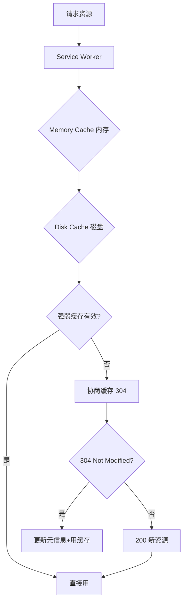
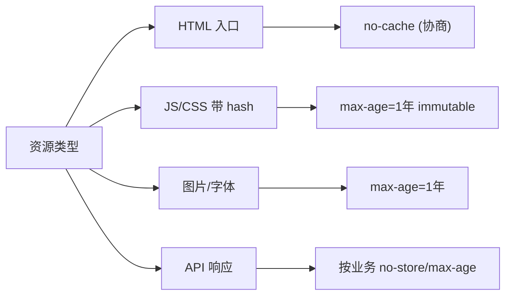
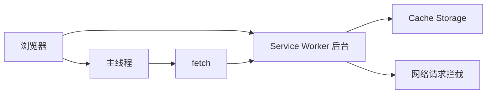
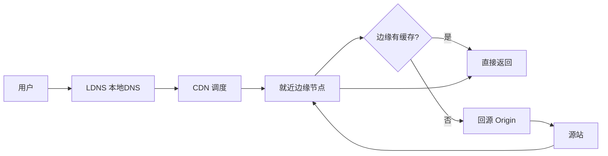
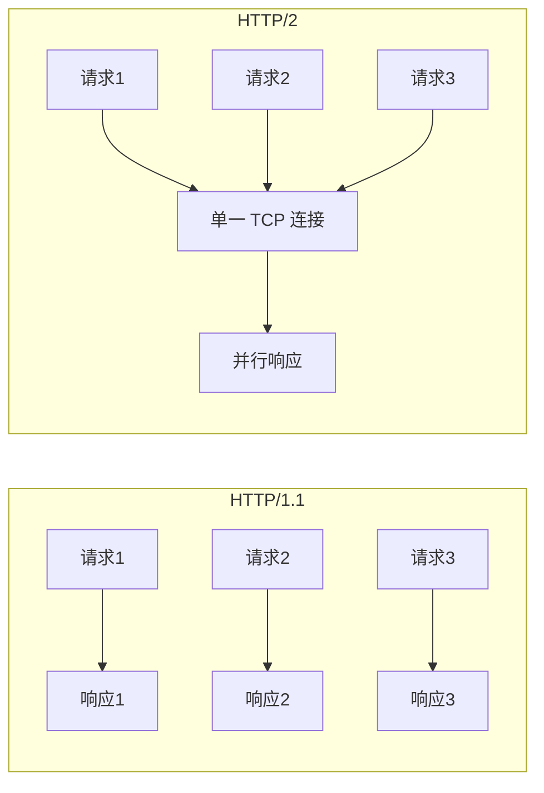
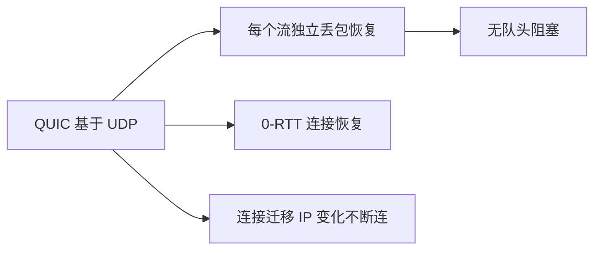
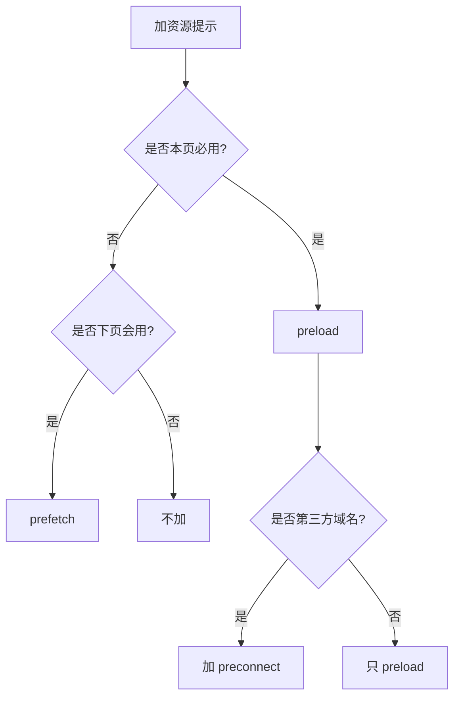
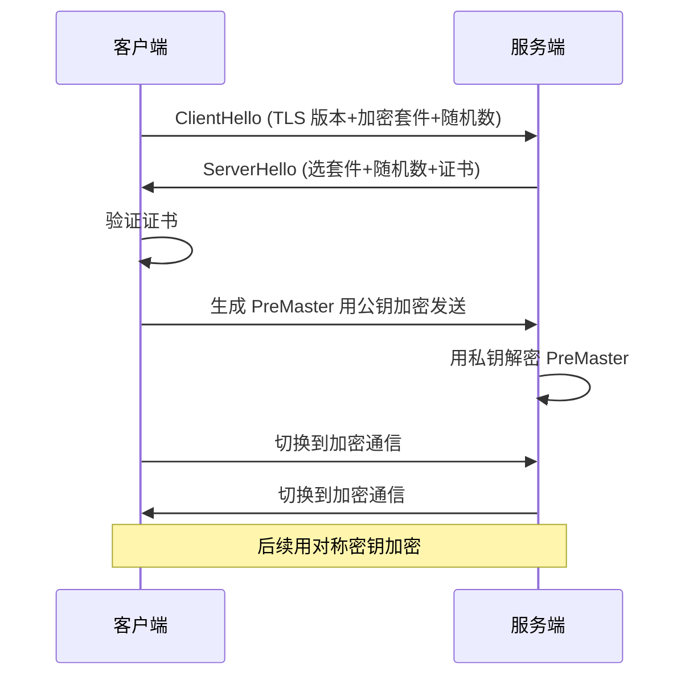

# 网络与缓存 · 核心知识点详解

> 本文档位于 `知识库/前端/05运行时与性能/02网络与缓存/`，是网络与缓存的核心知识库。配套面试题见《常见面试题与最佳实践.md》。
>
> 读完应能解释清楚"强缓存 vs 协商缓存""Cache-Control 各字段含义""Service Worker 缓存策略""CDN 回源与边缘节点""HTTP/2 多路复用与队头阻塞""preload vs prefetch vs preconnect"。

---

## 一、HTTP 缓存（核心高频）

### 1.1 缓存位置与优先级



<!-- -->

浏览器缓存分四层：

| 缓存 | 位置 | 时效 | 用途 |
|---|---|---|---|
| Service Worker | 浏览器进程 | 长期 | 离线、定制缓存 |
| Memory Cache | 内存 | 短（页面关闭即清） | 当前文档已加载资源 |
| Disk Cache | 磁盘 | 长（按 Cache-Control） | 跨会话资源 |
| Push Cache | HTTP/2 推送 | 极短（会话级） | HTTP/2 推送的资源 |

### 1.2 强缓存 vs 协商缓存

| 维度 | 强缓存 | 协商缓存 |
|---|---|---|
| 触发条件 | 未过期 | 已过期 |
| 是否请求服务器 | 否 | 是（带验证字段） |
| 状态码 | 200 (from cache) | 304 |
| 控制字段 | Cache-Control / Expires | ETag / Last-Modified |
| 速度 | 快 | 中（需 RTT） |
| 一致性 | 差（过期前看不到更新） | 好 |

**强缓存字段**：

- `Cache-Control: max-age=31536000`（1 年，最高优先级）。
- `Expires: Wed, 21 Oct 2025 07:28:00 GMT`（绝对时间，HTTP/1.0）。

**协商缓存字段**：

- `ETag` / `If-None-Match`：基于内容 hash，最精确。
- `Last-Modified` / `If-Modified-Since`：基于时间戳，1 秒粒度。

### 1.3 Cache-Control 字段详解

| 字段 | 取值 | 含义 |
|---|---|---|
| `max-age` | 秒数 | 资源最大有效时间 |
| `s-maxage` | 秒数 | 共享缓存（CDN）有效时间，覆盖 max-age |
| `public` | - | 允许 CDN 等中间缓存 |
| `private` | - | 只允许浏览器缓存，CDN 不能缓存 |
| `no-cache` | - | **协商缓存**：每次必须向服务器验证 |
| `no-store` | - | **不缓存**：完全不存 |
| `must-revalidate` | - | 过期后必须重新验证，不能用旧缓存 |
| `immutable` | - | 资源永不变，过期前不需要重新验证 |
| `stale-while-revalidate` | 秒数 | 过期后允许先用旧值 + 后台刷新 |
| `stale-if-error` | 秒数 | 服务器错误时允许用旧值 |

**易混淆**：

- `no-cache` ≠ 不缓存，而是"每次必须验证"——验证通过仍用缓存。
- `no-store` 才是"完全不缓存"。
- `max-age=0` 相当于 `no-cache`（每次验证）。

### 1.4 ETag vs Last-Modified

| 维度 | ETag | Last-Modified |
|---|---|---|
| 精度 | 内容 hash，字节级 | 1 秒 |
| 计算 | 服务端 hash | 文件 mtime |
| 优先级 | 高 | 低（ETag 存在时优先） |
| 性能 | 服务端 hash开销 | 几乎无 |
| 限制 | 大文件 hash 慢 | 1 秒内改多次不准 |

**请求示例**：

```
# 首次请求
GET /index.html HTTP/1.1

# 响应
HTTP/1.1 200 OK
Cache-Control: max-age=0, must-revalidate
ETag: "abc123"
Last-Modified: Wed, 21 Oct 2025 07:28:00 GMT

# 二次请求（协商）
GET /index.html HTTP/1.1
If-None-Match: "abc123"
If-Modified-Since: Wed, 21 Oct 2025 07:28:00 GMT

# 响应（未变）
HTTP/1.1 304 Not Modified
```

### 1.5 缓存策略最佳实践



<!-- -->

**HTML**：

```
Cache-Control: no-cache
```

- HTML 是入口，文件名不会带 hash，必须每次验证。

**JS / CSS / 图片（带 hash）**：

```
Cache-Control: public, max-age=31536000, immutable
```

- 文件名带 hash（如 `app.a1b2c3.js`），内容变 hash 变，URL 变。
- 缓存一年安全。
- `immutable` 防止用户主动刷新时也走协商缓存。

**API 响应**：

```
# 用户数据：不缓存
Cache-Control: no-store

# 公开数据：短时缓存
Cache-Control: public, max-age=60

# 频率受限 API：长缓存
Cache-Control: public, max-age=3600, stale-while-revalidate=86400
```

---

## 二、Service Worker 缓存

### 2.1 Service Worker 是什么



<!-- -->

- 后台运行的脚本（脱离主线程）。
- 可拦截页面所有 fetch 请求。
- 拥有独立的 Cache Storage。
- 必须在 HTTPS 环境（localhost 例外）。

### 2.2 缓存策略

| 策略 | 适用 | 逻辑 |
|---|---|---|
| Cache First | 静态资源 | 缓存有就用，无则请求并缓存 |
| Network First | API / 关键资源 | 优先网络，失败用缓存 |
| Stale While Revalidate | 图片 / 字体 | 立即返回缓存，同时后台更新 |
| Cache Only | 离线资源 | 只用缓存，无则失败 |
| Network Only | 强实时数据 | 只用网络 |

**实现示例**：

```js
// sw.js
const CACHE_NAME = "v1";
const PRECACHE = ["/", "/main.js", "/styles.css"];

// 安装时预缓存
self.addEventListener("install", e => {
  e.waitUntil(
    caches.open(CACHE_NAME).then(c => c.addAll(PRECACHE))
  );
  self.skipWaiting();
});

// 激活时清理旧缓存
self.addEventListener("activate", e => {
  e.waitUntil(
    caches.keys().then(keys => Promise.all(
      keys.filter(k => k !== CACHE_NAME).map(k => caches.delete(k))
    ))
  );
  self.clients.claim();
});

// 拦截请求
self.addEventListener("fetch", e => {
  const { request } = e;
  const url = new URL(request.url);

  // 静态资源：Cache First
  if (request.method === "GET" && url.pathname.startsWith("/assets/")) {
    e.respondWith(cacheFirst(request));
  }
  // API：Network First
  else if (url.pathname.startsWith("/api/")) {
    e.respondWith(networkFirst(request));
  }
  // 图片：Stale While Revalidate
  else if (request.destination === "image") {
    e.respondWith(swr(request));
  }
});

async function cacheFirst(req) {
  const cached = await caches.match(req);
  return cached || fetchAndCache(req);
}

async function networkFirst(req) {
  try {
    return await fetch(req);
  } catch {
    return await caches.match(req) || Response.error();
  }
}

async function swr(req) {
  const cached = await caches.match(req);
  const fetchPromise = fetchAndCache(req);  // 后台更新
  return cached || fetchPromise;
}

async function fetchAndCache(req) {
  const res = await fetch(req);
  const cache = await caches.open(CACHE_NAME);
  cache.put(req, res.clone());
  return res;
}
```

### 2.3 Workbox（推荐方案）

Google 出的 Service Worker 工具库，封装好常用策略：

```js
import { registerRoute } from "workbox-routing";
import { CacheFirst, NetworkFirst, StaleWhileRevalidate } from "workbox-strategies";
import { ExpirationPlugin } from "workbox-expiration";
import { CacheableResponsePlugin } from "workbox-cacheable-response";

// JS/CSS：长期缓存
registerRoute(
  ({ request }) => ["script", "style"].includes(request.destination),
  new CacheFirst({
    cacheName: "static-resources",
    plugins: [
      new CacheableResponsePlugin({ statuses: [0, 200] }),
      new ExpirationPlugin({ maxEntries: 50, maxAgeSeconds: 60 * 60 * 24 * 365 }),
    ],
  })
);

// 图片：SWR
registerRoute(
  ({ request }) => request.destination === "image",
  new StaleWhileRevalidate({
    cacheName: "images",
    plugins: [new ExpirationPlugin({ maxEntries: 60, maxAgeSeconds: 30 * 24 * 60 * 60 })],
  })
);

// API：Network First
registerRoute(
  ({ url }) => url.pathname.startsWith("/api/"),
  new NetworkFirst({
    cacheName: "api",
    networkTimeoutSeconds: 3,
    plugins: [new ExpirationPlugin({ maxEntries: 50, maxAgeSeconds: 5 * 60 })],
  })
);
```

### 2.4 缓存更新机制

```js
// 监听 SW 更新，提示用户刷新
let refreshing = false;
navigator.serviceWorker.addEventListener("controllerchange", () => {
  if (refreshing) return;
  refreshing = true;
  window.location.reload();
});

// 主动检查更新
setInterval(() => {
  navigator.serviceWorker.getRegistration().then(reg => {
    reg.update();
  });
}, 60 * 60 * 1000);  // 每小时
```

---

## 三、CDN

### 3.1 CDN 工作原理



<!-- -->

- 用户请求 `cdn.example.com/...`。
- DNS 解析返回最近的边缘节点 IP。
- 边缘节点有缓存 → 直接返回。
- 边缘无缓存 → 回源站拉取，缓存后返回。

### 3.2 缓存层级

```
用户 → 边缘节点 → 中间节点 → 源站
       (L1)       (L2)       (Origin)
```

- **L1 边缘**：离用户最近，缓存命中率高。
- **L2 中间**：多个 L1 共享，减少回源。
- **Origin 源站**：原始服务器。

### 3.3 缓存刷新

- **被动刷新**：缓存过期后下次回源。
- **主动刷新**：通过 API 通知 CDN 失效。

```bash
# 阿里云 CDN 刷新
curl -X POST https://cdn.aliyun.com/refresh \
  -d '{"paths":["/assets/app.js"]}'
```

**注意**：

- 刷新有延迟（1~5 分钟生效）。
- 带 hash 的资源不刷新，直接发新版（URL 变 → 新缓存）。
- HTML 不放 CDN 缓存（每次回源 / 协商）。

### 3.4 CDN 优化要点

- **预热**：发版前主动预热新资源到 CDN。
- **HTTPS**：开启 HTTPS，HSTS 强制 HTTPS。
- **HTTP/2 / HTTP/3**：CDN 支持，开启多路复用。
- **Brotli 压缩**：比 gzip 小 15-25%。
- **图片优化**：CDN 按需转换格式（WebP / AVIF）和尺寸。
- **边缘计算**：CDN Workers 跑轻量逻辑。

---

## 四、HTTP/2 与 HTTP/3

### 4.1 HTTP/1.1 vs HTTP/2 vs HTTP/3

| 维度 | HTTP/1.1 | HTTP/2 | HTTP/3 |
|---|---|---|---|
| 传输 | TCP | TCP | QUIC（UDP） |
| 多路复用 | 否（管道化有队头阻塞） | 是 | 是 |
| 队头阻塞 | 应用层 + TCP 层 | TCP 层 | 无 |
| 头部压缩 | 否 | HPACK | QPACK |
| 服务器推送 | 否 | 是（已废弃） | 否 |
| 加密 | 可选 | 必选 TLS | 必选 |
| 连接复用 | keep-alive | 单连接多流 | 单连接多流 |

### 4.2 HTTP/2 多路复用



<!-- -->

- 一个 TCP 连接并行多个流。
- 每个流可独立请求 / 响应。
- 头部 HPACK 压缩（重复字段去重）。
- 服务器推送（Server Push）——已废弃，被 `preload` 替代。

### 4.3 HTTP/2 队头阻塞（TCP 层）


<!-- -->

虽然应用层多路复用，但 TCP 层丢包会阻塞所有流。

### 4.4 HTTP/3 与 QUIC



<!-- -->

- 基于 UDP，避免 TCP 队头阻塞。
- 每个流独立丢包恢复。
- 0-RTT 握手（首次 1-RTT，后续 0-RTT）。
- 连接迁移：IP 变化（如切 WiFi）不断连。

---

## 五、资源预加载

### 5.1 preload / prefetch / preconnect / dns-prefetch

| 标签 | 用途 | 时机 | 优先级 |
|---|---|---|---|
| `preload` | 预加载本页关键资源 | 当前页必用 | 高（仅次于 CSS） |
| `prefetch` | 预取下页可能用资源 | 空闲时 | 低 |
| `preconnect` | 预连接域名 | 早期建立连接 | 高 |
| `dns-prefetch` | DNS 预解析 | 早期解析 DNS | 中 |
| `modulepreload` | 预加载 ES Module | 当前页必用 | 高 |

```html
<!-- preload：当前页关键资源（必用） -->
<link rel="preload" href="/fonts/MyFont.woff2" as="font"
      type="font/woff2" crossorigin>
<link rel="preload" href="/img/hero.webp" as="image"
      fetchpriority="high">

<!-- prefetch：下一页可能用（空闲时） -->
<link rel="prefetch" href="/next-page.js">

<!-- preconnect：第三方域名预热（DNS+TCP+TLS） -->
<link rel="preconnect" href="https://cdn.example.com" crossorigin>
<link rel="preconnect" href="https://api.example.com">

<!-- dns-prefetch：只解析 DNS -->
<link rel="dns-prefetch" href="//www.google-analytics.com">

<!-- modulepreload：预加载 ESM -->
<link rel="modulepreload" href="/modules/app.js">
```

### 5.2 fetchpriority（新规范）

```html
<!-- 关键图片高优先级 -->


<!-- 非关键图片低优先级 -->


<!-- 脚本低优先级 -->
<script src="analytics.js" fetchpriority="low" defer></script>
```

### 5.3 资源提示的取舍



<!-- -->

**关键原则**：

- preload 必须用，否则浪费带宽。
- prefetch 用于下一页预测（如鼠标 hover 链接时预取）。
- preconnect 用于第三方域名（DNS + TCP + TLS 全建立）。
- dns-prefetch 仅 DNS，比 preconnect 轻量。

---

## 六、请求优化

### 6.1 减少请求数

| 方法 | 示例 | 效果 |
|---|---|---|
| 内联关键资源 | critical CSS | 减少 1 请求 |
| 图片精灵图 | 多图合一 | 多 → 1 |
| Data URL | `src="data:image/png;base64,..."` | 减少 HTTP |
| Bundle 打包 | Webpack/Vite 合并 JS | N → 1 |
| HTTP/2 多路复用 | 不必合并 | 多请求共享连接 |

**注意**：HTTP/2 时代不用过度合并，单文件大反而影响缓存命中率。

### 6.2 减少请求大小

| 方法 | 节省比例 | 用法 |
|---|---|---|
| gzip | 70% | 服务端开启 |
| Brotli | 80% | 服务端开启（优于 gzip） |
| 图片格式 | 50-70% | WebP / AVIF 替代 JPG/PNG |
| 字体子集 | 90% | 只保留用到的字符 |
| Tree Shaking | 30-60% | 删除未用代码 |
| 代码压缩 | 30-50% | Terser / esbuild minify |

### 6.3 减少传输距离

- **CDN**：边缘节点近用户。
- **HTTP/3 + 0-RTT**：握手更快。
- **DNS 预解析**：减少 DNS 查询时间。
- **preconnect**：提前建立连接。

### 6.4 减少等待时间

- **HTTP 缓存**：直接用本地缓存。
- **Service Worker**：离线缓存。
- **stale-while-revalidate**：过期也先用旧值。
- **资源 hint**：preload 提前加载。

### 6.5 第三方优化

```html
<!-- 1. 域名预热 -->
<link rel="preconnect" href="https://cdn.third-party.com">
<link rel="dns-prefetch" href="//www.analytics.com">

<!-- 2. defer 异步 -->
<script defer src="https://analytics.com/ga.js"></script>

<!-- 3. Partytown 移到 Worker -->
<script type="text/partytown" src="..."></script>

<!-- 4. 自建代理 -->
<!-- 不直接连第三方，由自己服务器代理 -->
```

---

## 七、网络协议与 HTTPS

### 7.1 HTTPS 握手



<!-- -->

**TLS 1.2**：2-RTT 握手。

**TLS 1.3**：1-RTT 握手，0-RTT 恢复。

### 7.2 HSTS

```
Strict-Transport-Security: max-age=31536000; includeSubDomains; preload
```

- 强制 HTTPS，防止 SSL Strip 攻击。
- `preload`：加入浏览器内置 HSTS 列表，首次访问也走 HTTPS。

### 7.3 关键 Header

| Header | 用途 |
|---|---|
| `Cache-Control` | 缓存策略 |
| `ETag` | 协商缓存验证 |
| `Content-Encoding` | gzip / br 压缩 |
| `Content-Security-Policy` | 内容安全策略 |
| `Strict-Transport-Security` | HSTS |
| `X-Content-Type-Options` | nosniff 防类型嗅探 |
| `X-Frame-Options` | 防 clickjacking |
| `Referrer-Policy` | 控制 Referer 泄露 |
| `Cross-Origin-Embedder-Policy` | 跨域嵌入策略 |
| `Cross-Origin-Opener-Policy` | 跨域开窗策略 |

---

## 八、监控与分析

### 8.1 Network 面板

- **Size vs Transfer**：Size 是解压后大小，Transfer 是实际传输大小。
- **Time**：总时间 = 等待 + 下载。
- **Waterfall**：看请求依赖关系。
- **Status**：200 / 304 / from cache / from Service Worker。

### 8.2 Resource Timing

```js
// 单个资源耗时分解
const [entry] = performance.getEntriesByType("resource").filter(
  e => e.name.includes("main.js")
);
console.table({
  DNS: entry.domainLookupEnd - entry.domainLookupStart,
  TCP: entry.connectEnd - entry.connectStart,
  TLS: entry.connectEnd - entry.secureConnectionStart,
  TTFB: entry.responseStart - entry.requestStart,
  下载: entry.responseEnd - entry.responseStart,
  总耗时: entry.responseEnd - entry.startTime,
});
```

### 8.3 服务端监控

- **CDN 命中率**：目标 > 95%。
- **回源率**：5% 以下正常。
- **P95 TTFB**：边缘节点 < 100ms。
- **错误率**：5xx < 0.1%。

---

## 九、参考与延伸

### 9.1 工具

- **Lighthouse**：性能审计 + 缓存建议。
- **WebPageTest**：多地点多设备测试。
- **Cache-Control 测试**：浏览器 Network 面板。
- **Service Worker**：DevTools → Application → Service Workers。
- **Cache Storage**：DevTools → Application → Cache Storage。

### 9.2 阅读延伸

- MDN HTTP Caching：https://developer.mozilla.org/zh-CN/docs/Web/HTTP/Caching
- web.dev 缓存策略：https://web.dev/http-cache/
- Service Worker API：https://developer.mozilla.org/zh-CN/docs/Web/API/Service_Worker_API
- HTTP/3 详解：https://http3-explained.haxx.se/
- Workbox 官方文档：https://developer.chrome.com/docs/workbox/
