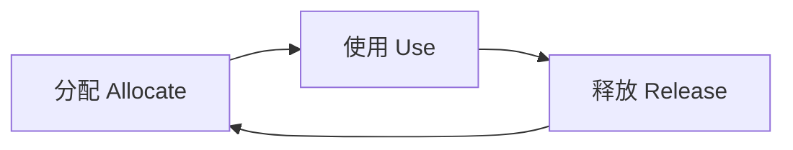
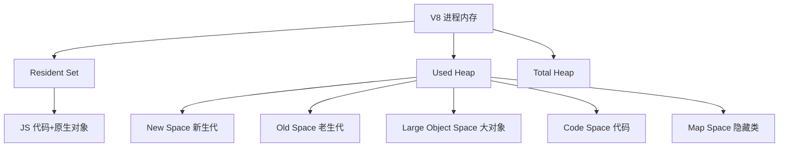
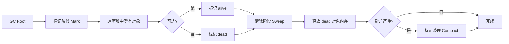
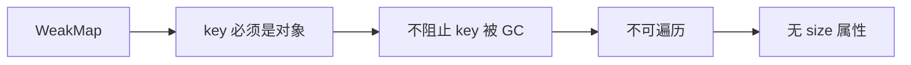
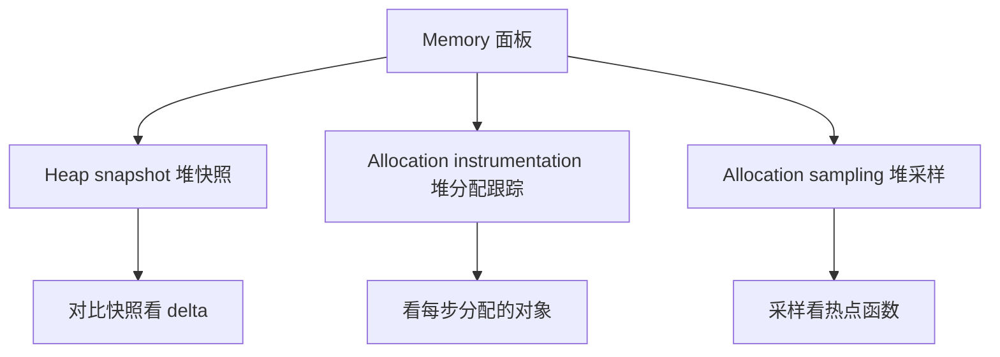

# 内存与泄漏 · 核心知识点详解

> 本文档位于 `知识库/前端/05运行时与性能/03内存与泄漏/`，是内存与泄漏的核心知识库。配套面试题见《常见面试题与最佳实践.md》。
>
> 读完应能解释清楚"V8 内存模型与分代回收""标记清除算法流程""5 类典型内存泄漏""Chrome DevTools 怎么抓泄漏""WeakMap/WeakSet 与 FinalizationRegistry 的弱引用机制"。

---

## 一、JavaScript 内存模型

### 1.1 内存生命周期



<!-- -->

- **分配**：调用变量/对象时，引擎自动分配内存。
- **使用**：读写变量、调用方法。
- **释放**：变量不再被引用时，GC 自动回收。

JS 是自动垃圾回收的语言——开发者不手动 `free`，但**泄漏的本质是：本该释放的内存仍被引用，GC 无法回收**。

### 1.2 栈（Stack）vs 堆（Heap）

| 维度 | 栈 | 堆 |
|---|---|---|
| 存储内容 | 原始值（number/string/boolean） | 引用类型对象（Object/Array/Function） |
| 大小 | 固定（编译期确定） | 动态 |
| 分配 | 编译器自动 | 引导式（运行时） |
| 回收 | 函数返回自动 | GC 标记清除 |
| 速度 | 快（指针移动） | 慢（需查找） |
| 限制 | 1MB~8MB（看引擎） | 受系统物理内存限制 |

**示例**：

```js
function demo() {
  let n = 42;          // 栈：原始值
  const obj = { a: 1 }; // 堆：对象，栈里存引用
  return obj;
}
const result = demo();  // result 持有堆对象的引用
// 函数返回后，n 与 obj 的栈帧弹出，但堆对象仍被 result 引用
```

### 1.3 V8 内存结构



<!-- -->

- **New Space（新生代）**：1~8MB，存活短的对象。分 Eden + 两个 From/To 区，用 Scavenge 算法。
- **Old Space（老生代）**：存活时间长的对象，标记清除 + 标记整理。
- **Large Object Space**：大于 1MB 的对象直接放这里，不参与 Scavenge。
- **Code Space**：JIT 编译的代码。
- **Map Space**：对象的隐藏类（Hidden Class / Shape）。

**关键阈值**（Node.js 默认 64 位机器）：

- New Space：16MB
- Old Space：1.4GB（可通过 `--max-old-space-size` 调整）

---

## 二、V8 垃圾回收算法

### 2.1 分代假说

> "大多数对象朝生夕死，少数对象长期存活。"

这是分代回收的基础——不同生命周期的对象用不同算法。

### 2.2 新生代：Scavenge（复制算法）


<!-- -->

**步骤**：

1. 新对象进入 **From** 区（活动区）。
2. From 区满，触发 Scavenge。
3. GC 根可达的对象标记为活，复制到 **To** 区（空闲区），并紧凑排列。
4. From 区清空，From/To 交换角色。
5. 经历过 2 次 Scavenge 仍存活的对象 → 晋升到老生代。

**特点**：

- 时间复杂度与活对象成正比（死对象直接被忽略）。
- 牺牲一半空间换速度（内存利用率 50%）。
- 适合"朝生夕死"的新对象。

### 2.3 老生代：Mark-Sweep + Mark-Compact



<!-- -->

**Mark-Sweep（标记清除）**：

- **Mark**：从 GC Root 出发，可达对象标记 alive。
- **Sweep**：遍历堆，未标记对象释放。

**问题**：内存碎片——释放的内存不连续，下次分配大对象可能找不到合适位置。

**Mark-Compact（标记整理）**：

- 在 Sweep 基础上，把活对象向内存一端移动，紧凑排列。
- 牺牲时间换连续空间。

**GC Root 包括**：

- 全局对象（`window`、`global`）。
- 当前执行栈的局部变量。
- 闭包引用的变量。
- DOM 树根节点。
- `setTimeout` / `setInterval` 回调引用。

### 2.4 增量标记与并发回收


<!-- -->

- **STW（Stop-The-World）**：GC 期间暂停 JS。新生代 Scavenge 用，因为时间短（1~10ms）。
- **Incremental Marking**：把 Mark 拆成多个小步，与 JS 交替执行，减少单次停顿。
- **Concurrent**：Mark 阶段在辅助线程跑，主线程继续 JS。
- **Parallel**：Sweep 阶段多线程并行。

**调优**：

- Node 启动加 `--trace-gc` 看每次 GC 耗时。
- 大量短生命周期对象 → 新生代 Scavenge 频繁 → 考虑对象池复用。
- 老生代涨太快 → 检查泄漏。

```bash
node --trace-gc app.js
# [12345:0x1] 1234 ms: Scavenge 8.2 (12.0) -> 4.1 (12.0) MB, 1.2 / 0.0 ms
# [12345:0x1] 5678 ms: Mark-sweep 32.1 (40.0) -> 18.5 (40.0) MB, 12.3 / 0.0 ms
```

---

## 三、典型内存泄漏模式

### 3.1 意外的全局变量

```js
// 坏：忘记 let/const/var，隐式全局
function leak() {
  leaked = "I'm global";  // 等价 window.leaked
  this.too = "也是全局";  // 非严格模式下 this 是 window
}

// 严格模式修复
"use strict";
function noLeak() {
  // 未声明的赋值直接报错
}
```

**修复**：

```js
"use strict";  // 文件顶部
// 或 babel/typescript 强制
```

### 3.2 被遗忘的定时器

```js
// 坏：定时器引用大对象，组件销毁后定时器还在跑
function Component() {
  const hugeData = new Array(1e6).fill(0);
  setInterval(() => {
    console.log(hugeData.length);  // 闭包持有 hugeData
  }, 1000);
  // 没清理定时器！
}
```

**修复**：

```jsx
function Component() {
  const hugeData = useRef(new Array(1e6).fill(0));
  useEffect(() => {
    const id = setInterval(() => {
      console.log(hugeData.current.length);
    }, 1000);
    return () => clearInterval(id);  // 关键：清理
  }, []);
}
```

### 3.3 被遗忘的事件监听

```js
// 坏：addEventListener 没对应 removeEventListener
function setup() {
  const handler = () => { /*...*/ };
  document.addEventListener("scroll", handler);
  // 组件销毁时没移除
}
```

**修复**：

```jsx
useEffect(() => {
  const handler = () => { /*...*/ };
  window.addEventListener("resize", handler);
  return () => window.removeEventListener("resize", handler);
}, []);
```

### 3.4 闭包持有不必要引用

```js
// 坏：只需要 id，却把整个 element 闭包进去
function setup(elements) {
  elements.forEach(el => {
    el.addEventListener("click", () => {
      console.log(el.id);  // el 永远不释放
    });
  });
}
```

**修复**：

```js
function setup(elements) {
  elements.forEach(el => {
    const id = el.id;  // 只闭包 id（字符串）
    el.addEventListener("click", () => {
      console.log(id);
    });
  });
}
```

### 3.5 脱离 DOM 的引用（Detached DOM）

```js
// 坏：变量引用了 DOM 节点，然后又 removeChild
function leak() {
  const button = document.createElement("button");
  document.body.appendChild(button);
  document.body.removeChild(button);
  // button 还在闭包/全局变量里，DOM 树外但 JS 还引用 → 泄漏
  button.click = () => {}; // 持续引用
}
```

**修复**：

```js
function noLeak() {
  const button = document.createElement("button");
  document.body.appendChild(button);
  button.addEventListener("click", handler);
  // 移除前先解绑所有引用
  button.removeEventListener("click", handler);
  document.body.removeChild(button);
  // button 变量出栈，无引用
}
```

### 3.6 Map / Set 缓存无限增长

```js
// 坏：缓存只增不减
const cache = new Map();
function getUser(id) {
  if (!cache.has(id)) {
    cache.set(id, fetchUser(id));
  }
  return cache.get(id);
}
// 长时间运行 cache 越来越大
```

**修复方案 1：LRU 缓存**：

```js
class LRUCache {
  constructor(max = 100) {
    this.max = max;
    this.cache = new Map();
  }
  get(key) {
    if (!this.cache.has(key)) return undefined;
    const val = this.cache.get(key);
    this.cache.delete(key);
    this.cache.set(key, val); // 移到末尾
    return val;
  }
  set(key, val) {
    if (this.cache.has(key)) this.cache.delete(key);
    else if (this.cache.size >= this.max) {
      this.cache.delete(this.cache.keys().next().value);
    }
    this.cache.set(key, val);
  }
}
```

**修复方案 2：WeakMap**：

```js
// WeakMap 的 key 必须是对象，且不阻止 GC
const cache = new WeakMap();
function getUserData(user) {
  if (!cache.has(user)) {
    cache.set(user, computeExpensive(user));
  }
  return cache.get(user);
}
// user 被回收时，cache 里的对应条目自动消失
```

### 3.7 console.log 引用

```js
// 坏：DevTools 打开后，console.log 持有对象引用
function debug() {
  const obj = { huge: new Array(1e6) };
  console.log(obj);  // 浏览器 DevTools 控制台持有引用
}
```

**修复**：

- 生产环境移除 `console.log`（用 babel 插件）。
- 只 log 必要字段：`console.log(obj.id)` 而非整个对象。

---

## 四、WeakRef / FinalizationRegistry（ES2021+）

### 4.1 WeakRef：弱引用对象

```js
let target = { name: "I'm target" };
const ref = new WeakRef(target);

// 解引用
const obj = ref.deref();  // 可能返回 undefined（已被 GC）
if (obj) {
  console.log(obj.name);
}

target = null;  // 释放强引用
// 此时 GC 可能回收对象，ref.deref() 返回 undefined
```

**适用场景**：

- 缓存：缓存对象可被 GC 回收。
- 监听器：可被 GC 回收的 observer。

**注意**：WeakRef 不保证对象一定被回收，也不保证 `deref` 一定返回 undefined——不要用于关键业务逻辑。

### 4.2 FinalizationRegistry：GC 回调

```js
const registry = new FinalizationRegistry(heldValue => {
  console.log(`对象被 GC 回收了: ${heldValue}`);
});

let obj = { data: "important" };
registry.register(obj, "my-obj-id");  // 注册 heldValue

obj = null;  // 等待 GC，回调被触发
```

**适用场景**：

- 资源清理（关闭文件句柄、断开 WebSocket）。
- 缓存失效时通知。

**注意**：回调时机不确定，可能根本不触发（页面关闭前没 GC）。**不能依赖它做关键资源清理**。

### 4.3 WeakMap / WeakSet



<!-- -->

**对比**：

| 类型 | key 类型 | 阻止 GC | 可遍历 | size |
|---|---|---|---|---|
| Map | 任意 | 是 | 是 | 有 |
| WeakMap | 对象 | 否 | 否 | 无 |
| Set | 任意 | 是 | 是 | 有 |
| WeakSet | 对象 | 否 | 否 | 无 |

**典型用途**：

```js
// 1. 给 DOM 节点附加数据
const metadata = new WeakMap();
function bindData(el, data) {
  metadata.set(el, data);
}
// el 被 remove 后，metadata 自动消失

// 2. 私有属性
const _private = new WeakMap();
class MyClass {
  constructor() {
    _private.set(this, { secret: 42 });
  }
  getSecret() {
    return _private.get(this).secret;
  }
}

// 3. 监听器去重
const listeners = new WeakSet();
function addListener(fn) {
  listeners.add(fn);
}
```

---

## 五、内存泄漏检测

### 5.1 Chrome DevTools Memory 面板



<!-- -->

**抓泄漏流程**：

1. **打开 Memory 面板** → 选 "Heap snapshot"。
2. **基线快照**：操作前点 "Take heap snapshot"。
3. **执行操作**：跑可能泄漏的代码（如打开关闭弹窗 10 次）。
4. **强制 GC**：DevTools 设置 → "Collect garbage"。
5. **再次快照**：操作后再拍快照。
6. **对比**：选第二个快照，过滤 "Objects allocated between Snapshot 1 and 2"。
7. **看 Retainers**：找有大量引用的对象，看是谁持有它。

### 5.2 关键字段

- **Shallow Size**：对象自身大小（不含引用对象）。
- **Retained Size**：对象被回收后能释放的总大小（含其引用链）。
- **Distance**：到 GC Root 的最短引用距离。
- **Retainers**：所有引用该对象的路径。

**示例分析**：

```
Memory leak finder:
- Object type: Array
- Shallow: 1.2MB
- Retained: 8.5MB   ← 这个数组间接持有 8.5MB
- Distance: 5
- Retainers:
  - window.cache.<object>  ← 全局 cache 引用
  - closure.foo.<array>    ← 闭包 foo 引用
```

→ 修复方向：清空 cache / 解除闭包。

### 5.3 Performance 监控内存增长

```js
// 浏览器：看 usedJSHeapSize 趋势
setInterval(() => {
  const mem = performance.memory;  // Chrome only
  console.log({
    usedJSHeap: (mem.usedJSHeapSize / 1024 / 1024).toFixed(1) + "MB",
    totalJSHeap: (mem.totalJSHeapSize / 1024 / 1024).toFixed(1) + "MB",
    limit: (mem.jsHeapSizeLimit / 1024 / 1024).toFixed(1) + "MB",
  });
}, 1000);
```

**判断泄漏的简单规则**：

- 内存随操作持续增长 → 可疑泄漏。
- 强制 GC 后不下降 → 高度可疑泄漏。
- 周期性操作（开/关弹窗）每次残留 1MB+ → 泄漏。

### 5.4 Node.js 内存分析

```bash
# 1. 启动加 --inspect，连接 Chrome DevTools
node --inspect app.js

# 2. 拍堆快照（同浏览器流程）
v8.writeHeapSnapshot();  // 代码中调用，生成 .heapsnapshot

# 3. 用 Chrome DevTools 打开 .heapsnapshot 文件
```

```js
// 主动写堆快照
const v8 = require("v8");
const fs = require("fs");

setInterval(() => {
  const fileName = `/tmp/heap-${Date.now()}.heapsnapshot`;
  v8.writeHeapSnapshot(fileName);
  console.log(`快照已保存: ${fileName}`);
}, 60000);
```

**Node 内存限制**：

```bash
# 默认老生代 ~1.4GB，可调大
node --max-old-space-size=4096 app.js  # 4GB
```

---

## 六、内存优化模式

### 6.1 对象池

```js
class ObjectPool {
  constructor(factory, reset, max = 100) {
    this.factory = factory;
    this.reset = reset;
    this.max = max;
    this.pool = [];
  }
  acquire() {
    return this.pool.pop() ?? this.factory();
  }
  release(obj) {
    if (this.pool.length < this.max) {
      this.reset(obj);
      this.pool.push(obj);
    }
  }
}

// 用法：粒子系统
const particlePool = new ObjectPool(
  () => ({ x: 0, y: 0, vx: 0, vy: 0, life: 0 }),
  p => Object.assign(p, { x: 0, y: 0, vx: 0, vy: 0, life: 0 })
);

const p = particlePool.acquire();
// ... 使用
particlePool.release(p);  // 复用而非 GC
```

### 6.2 字符串拼接优化

```js
// 慢：每次拼接都创建新字符串
let s = "";
for (let i = 0; i < 10000; i++) {
  s += "x";  // 每次都分配新内存
}

// 快：数组 join
const arr = [];
for (let i = 0; i < 10000; i++) arr.push("x");
const s = arr.join("");

// 更快：直接用字符串字面量重复
const s = "x".repeat(10000);
```

### 6.3 数组预分配

```js
// 慢：动态扩容
const arr = [];
for (let i = 0; i < 1e6; i++) arr.push(i);

// 快：预分配
const arr = new Array(1e6);
for (let i = 0; i < 1e6; i++) arr[i] = i;
```

### 6.4 类型化数组

```js
// 普通数组：每元素一个对象 + 桶
const nums = [1, 2, 3, 4, 5];

// 类型化数组：连续内存，零 GC
const nums = new Int32Array(5);
nums[0] = 1; // ...

// 适用：大量数值（图像、音频、3D 顶点）
```

### 6.5 避免频繁 JSON.parse/stringify

```js
// 坏：每次 deep copy
function process(data) {
  const copy = JSON.parse(JSON.stringify(data));
  // ...
}

// 好：浅拷贝 + 必要字段
function process(data) {
  const { id, name } = data;
  // ...
}

// 或 structuredClone（深拷贝，但不泄漏）
const copy = structuredClone(data);
```

---

## 七、常见陷阱

### 7.1 setTimeout 闭包泄漏

```js
// 坏：闭包持有 element，定时器没清理
function setup(element) {
  setTimeout(() => {
    element.classList.add("done");
  }, 60000);
  // 即使 element 已被 remove，定时器还在持有引用
}

// 好：先检查元素是否还在 DOM
function setup(element) {
  const id = setTimeout(() => {
    if (!document.contains(element)) return;
    element.classList.add("done");
  }, 60000);
  return () => clearTimeout(id);
}
```

### 7.2 Promise 未取消

```js
// 坏：组件卸载后 Promise 还在跑，setState 报错 + 内存不释放
function Component() {
  const [data, setData] = useState(null);
  useEffect(() => {
    fetch("/api/data").then(r => r.json()).then(setData);
    // 没有取消机制
  }, []);
}

// 好：AbortController
function Component() {
  const [data, setData] = useState(null);
  useEffect(() => {
    const ctrl = new AbortController();
    fetch("/api/data", { signal: ctrl.signal })
      .then(r => r.json())
      .then(setData)
      .catch(err => {
        if (err.name !== "AbortError") throw err;
      });
    return () => ctrl.abort();
  }, []);
}
```

### 7.3 WeakRef 误用

```js
// 坏：用 WeakRef 持有业务关键对象
function cache(user) {
  const ref = new WeakRef(user);
  // ... 后续 ref.deref() 可能是 undefined
  // 业务逻辑崩溃！
}

// 好：WeakRef 只用于"丢失也可重建"的缓存
const cache = new Map();
function getExpensive(user) {
  let ref = cache.get(user.id);
  let val = ref?.deref();
  if (!val) {
    val = compute(user);
    cache.set(user.id, new WeakRef(val));
  }
  return val;
}
```

### 7.4 监听器没传同一引用

```js
// 坏：每次绑新的函数，removeEventListener 无效
function setup() {
  window.addEventListener("resize", () => {
    console.log("resized");
  });
  // 后续 removeEventListener(() => {}) 引用不同，移不掉
}

// 好：保存引用
function setup() {
  const handler = () => console.log("resized");
  window.addEventListener("resize", handler);
  return () => window.removeEventListener("resize", handler);
}
```

---

## 八、参考与延伸

### 8.1 工具

- **Chrome DevTools Memory 面板**：堆快照、分配跟踪、采样。
- **`performance.memory`**：浏览器内存使用 API（Chrome only）。
- **`v8.writeHeapSnapshot()`**：Node.js 写堆快照。
- **`--trace-gc` / `--trace-gc-verbose`**：Node.js 启动参数看 GC。
- **clinic.js / 0x**：Node.js 火焰图 + 内存分析。
- **heapdump / v8-profiler**：生产环境堆快照。

### 8.2 阅读延伸

- V8 垃圾回收官方文档：https://v8.dev/blog
- Chrome DevTools Memory：https://developer.chrome.com/docs/devtools/memory-problems/
- MDN 内存管理：https://developer.mozilla.org/zh-CN/docs/Web/JavaScript/Memory_Management
- 《深入理解 V8 JavaScript 引擎》系列
- Google Web Fundamentals: Memory
