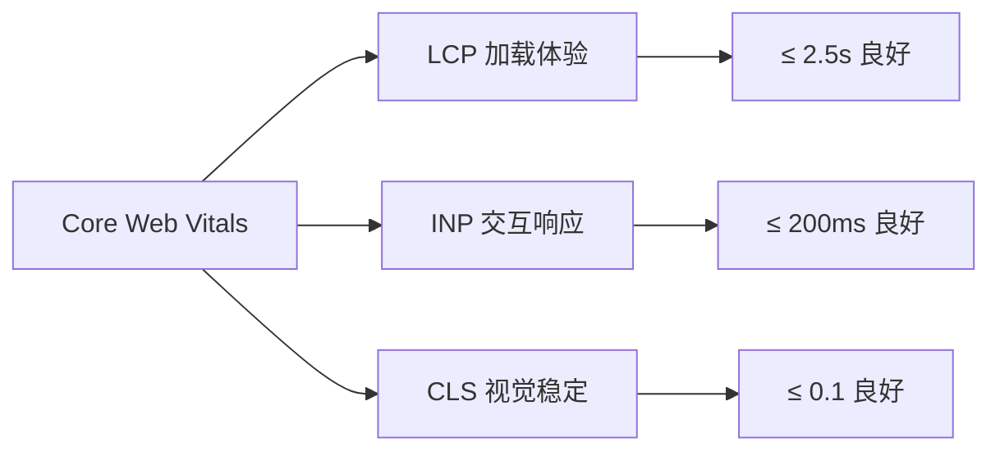
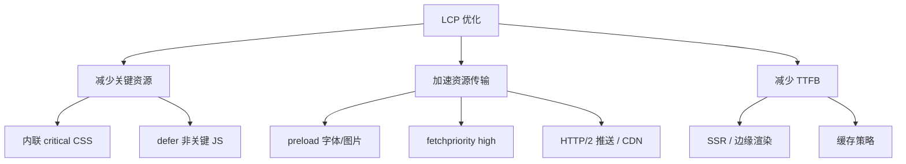
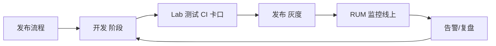
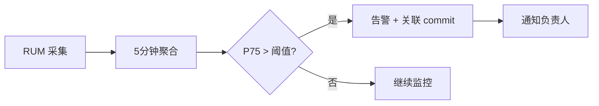
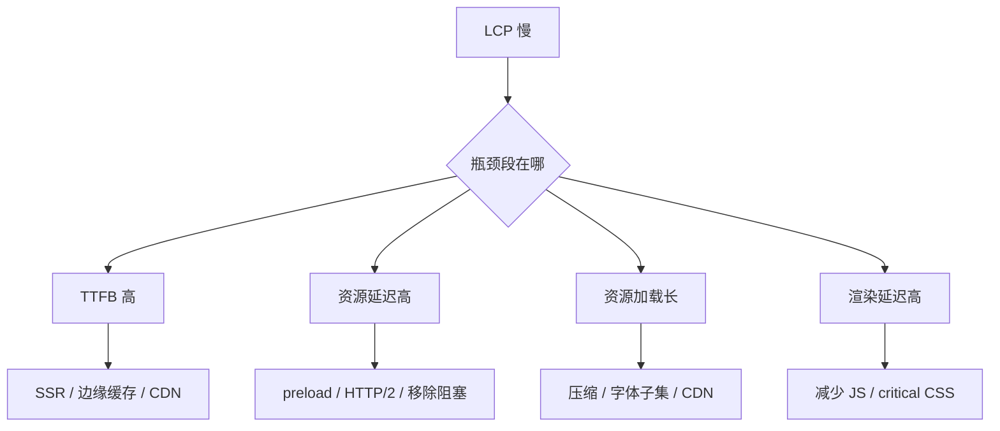
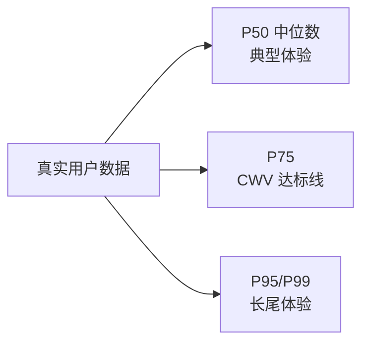

# 性能指标与监控 · 常见面试题与最佳实践

> 本文档位于 `知识库/前端/05运行时与性能/04性能指标与监控/`，是性能指标与监控的面试题集与生产最佳实践。配套核心知识见《核心知识点详解.md》。
>
> 15 道高频题 + 6 个生产场景 + 完整 Checklist，覆盖 Core Web Vitals、RUM vs Lab、Performance API、Lighthouse CI、性能预算、自定义监控埋点等面试常考点。

---

## 一、Core Web Vitals 类（高频）

### 1. Core Web Vitals 三大指标分别代表什么？阈值是多少？

**核心答案**：LCP（加载）、INP（交互）、CLS（视觉稳定）。

| 指标 | 全称 | 含义 | 良好 | 需改进 | 差 |
|---|---|---|---|---|---|
| **LCP** | Largest Contentful Paint | 最大内容绘制时间 | ≤ 2.5s | 2.5-4s | > 4s |
| **INP** | Interaction to Next Paint | 交互到下一帧绘制 | ≤ 200ms | 200-500ms | > 500ms |
| **CLS** | Cumulative Layout Shift | 累计布局偏移 | ≤ 0.1 | 0.1-0.25 | > 0.25 |



<!-- -->

**详细**：

- **LCP（2023+ 取代 FCP）**：测量"主要内容何时可见"。视口内最大元素（图片/文本块/视频封面）的渲染时间。
- **INP（2024+ 取代 FID）**：测量"交互响应有多快"。页面全生命周期内所有交互的最慢响应（P98）。
- **CLS**：测量"视觉是否跳动"。整个页面生命周期内布局偏移的累计分数。

**评分逻辑**：Chrome 用户体验报告（CrUX）基于真实用户数据，按 75 分位（P75）判定。P75 良好 = 该指标达标。

---

### 2. INP 为什么取代了 FID？

**核心答案**：FID 只测首次交互的输入延迟，忽略主线程长任务期间的持续卡顿；INP 测量所有交互的完整响应时间（输入延迟 + 处理时间 + 下次绘制）。


<!-- -->

**对比**：

| 维度 | FID | INP |
|---|---|---|
| 测量对象 | 首次交互 | 所有交互 |
| 测量阶段 | 仅输入延迟 | 输入延迟+处理+下次绘制 |
| 统计 | 实际值 | P98 最差值 |
| 反映 | 首屏响应 | 全生命周期响应 |

**为什么 FID 不够**：

- 用户首次点击后，后续交互卡顿 FID 测不到。
- 长任务（如 100ms 的 JS 执行）期间用户点击，FID 高但只算一次。
- INP 用 P98 反映"最差的真实体验"，更接近用户感知。

**优化 INP 的关键**：

- 拆分长任务（`scheduler.yield()`、`setTimeout(0)`、Web Worker）。
- 减少 JS 主线程占用——骨架屏 + 延迟加载非关键脚本。
- 用 `requestIdleCallback` 处理低优先级任务。
- 避免在交互回调里同步触发回流/重绘。

---

### 3. CLS 怎么计算？如何避免布局偏移？

**核心答案**：CLS = 所有布局偏移分数之和（影响分数 × 距离分数）。避免方式：给图片/广告预留尺寸、字体 `font-display: optional`、避免在已渲染内容上方插入元素。

**计算公式**：

```
布局偏移分数 = 影响分数 × 距离分数
影响分数 = 不稳定元素影响的视口面积比 (0~1)
距离分数 = 元素移动距离 / 视口最大边长 (0~1)
CLS = 所有会话窗口内的偏移分数累加
```

**示例**：

- 图片高 200px，向下偏移 100px，视口 800x600。
- 影响分数 = 200/600 ≈ 0.33（垂直方向占比）
- 距离分数 = 100/600 ≈ 0.17
- 单次偏移分数 ≈ 0.056

**常见导致 CLS 高的场景与对策**：

| 场景 | 原因 | 对策 |
|---|---|---|
| 图片无尺寸 | 加载后撑高布局 | `` 或 `aspect-ratio` |
| 字体闪烁 | FOUT/FOIT 后尺寸变 | `font-display: optional` + 预加载 |
| 动态广告 | 内容插入推开下方 | 预留固定高度容器 |
| 顶部通知 | 后插入顶部元素 | 用 transform 而非改 height |
| 异步内容 | SSR 占位错位 | 骨架屏占位 |

```html
<!-- 坏：图片无尺寸，加载后撑高布局 -->


<!-- 好：浏览器提前知道尺寸 -->

```

**字体优化**：

```css
@font-face {
  font-family: "MyFont";
  src: url("/fonts/MyFont.woff2") format("woff2");
  font-display: optional; /* 3s 内未加载就不加载，避免后续偏移 */
}
```

---

### 4. LCP 优化有哪些手段？

**核心答案**：减少关键资源大小与加载时间——优先级标记、预加载、内联关键 CSS、字体子集、避免第三方阻塞、用 SSR 减少客户端渲染。



<!-- -->

**关键代码**：

```html
<!-- LCP 图片优先级 -->
<link rel="preload" as="image" href="hero.webp"
      fetchpriority="high">

<!-- 关键字体预加载 -->
<link rel="preload" as="font" href="/fonts/MyFont.woff2"
      type="font/woff2" crossorigin>

<!-- 非关键 JS defer -->
<script defer src="analytics.js"></script>

<!-- critical CSS 内联 -->
<style>/* 首屏必要样式内联 */</style>
<link rel="preload" href="full.css" as="style" onload="this.rel='stylesheet'">
```

**衡量 LCP 分解**：

```js
// LCP 由四部分组成
new PerformanceObserver(list => {
  const entry = list.getEntries().at(-1);
  console.log({
    TTFB: entry.responseStart - entry.startTime,
    资源加载延迟: entry.loadTime - entry.responseStart,
    资源加载时间: entry.loadTime - entry.requestTime,
    元素渲染延迟: entry.renderTime - entry.loadTime,
  });
}).observe({ type: "largest-contentful-paint", buffered: true });
```

**针对性优化**：

- 资源加载延迟高 → preload / CDN / HTTP/2 多路复用。
- 资源加载时间长 → 图片压缩（WebP/AVIF）、字体子集、视频封面优化。
- 元素渲染延迟高 → 减少 JS 阻塞，critical CSS 内联。
- TTFB 高 → SSR / 边缘渲染 / 服务端缓存。

---

## 二、监控方式类

### 5. RUM 和 Lab 测试有什么区别？

**核心答案**：RUM 在真实用户浏览器采集数据，反映真实分布；Lab 在受控环境跑 Lighthouse，反映标准化基线。

| 维度 | RUM（Real User Monitoring） | Lab（Lighthouse） |
|---|---|---|
| 数据来源 | 真实用户浏览器 | 受控 Chrome 实例 |
| 设备/网络 | 真实分布（P75/P95） | 模拟（中端机型+4G） |
| 反映 | 真实体验 | 标准化基线 |
| 用途 | 线上监控、告警 | 上线前回归、CI 卡口 |
| 指标 | LCP/CLS/INP + 自定义 | Lighthouse 6 项 + CWV |
| 局限 | 受用户设备影响大 | 不能反映真实长尾 |



<!-- -->

**实战组合**：

- **CI 阶段**：Lighthouse 跑 P75 性能分 < 80 阻断 PR。
- **预发布**：Lab 在多种模拟设备下回归。
- **线上**：RUM 采集 P75 LCP，超过 4s 告警。
- **复盘**：对比 Lab vs RUM 差异，定位环境敏感问题（如用户网络）。

---

### 6. 怎么实现一个自定义 RUM 上报？

**核心答案**：用 `web-vitals` 库采集指标，`navigator.sendBeacon` 在页面卸载时上报，避免影响用户体验；服务端聚合 P75 后告警。

```js
import { onLCP, onINP, onCLS, onFCP, onTTFB } from "web-vitals";

function report(metric) {
  const body = JSON.stringify({
    name: metric.name,         // LCP / INP / CLS / FCP / TTFB
    value: metric.value,       // 数值
    rating: metric.rating,     // "good" | "needs-improvement" | "poor"
    id: metric.id,             // 会话 ID
    page: location.pathname,   // 页面路径
    userAgent: navigator.userAgent,
    ts: Date.now(),
  });

  // sendBeacon 优先：页面卸载也能发出
  if (navigator.sendBeacon) {
    navigator.sendBeacon("/api/metrics", body);
  } else {
    fetch("/api/metrics", { method: "POST", body, keepalive: true });
  }
}

onLCP(report);
onINP(report);
onCLS(report);
onFCP(report);
onTTFB(report);
```

**服务端聚合（关键）**：

```sql
-- 计算 P75 LCP（每个页面）
SELECT
  page,
  PERCENTILE_CONT(0.75) WITHIN GROUP (ORDER BY value) AS p75_lcp
FROM metrics
WHERE name = 'LCP'
  AND ts > NOW() - INTERVAL '24 hours'
GROUP BY page
HAVING PERCENTILE_CONT(0.75) WITHIN GROUP (ORDER BY value) > 4000
-- 告警：P75 > 4s 触发告警
```

**采样率控制**：

```js
// 避免高流量站点上报量过大
if (Math.random() < 0.1) {  // 10% 采样
  onLCP(report);
  // ...
}
```

**关键陷阱**：

- `sendBeacon` 有 64KB 限制，大数据量用 `fetch + keepalive`。
- INP 在页面关闭时才上报最终值——必须用 `visibilitychange` 触发。
- 不要在主线程同步上报——用 `requestIdleCallback` 推迟。

```js
// 正确：页面隐藏时上报 INP 最终值
document.addEventListener("visibilitychange", () => {
  if (document.visibilityState === "hidden") {
    report(currentINP);
  }
});
```

---

### 7. Performance API 有哪些常用接口？

**核心答案**：`performance.now()` 高精度计时、`PerformanceObserver` 监听条目、`getEntriesByType` 查询历史、`mark/measure` 自定义测量。

| API | 用途 | 示例 |
|---|---|---|
| `performance.now()` | 高精度时间戳 | `const t = performance.now()` |
| `performance.mark()` | 打标记 | `mark("start")` |
| `performance.measure()` | 测区间 | `measure("total", "start", "end")` |
| `PerformanceObserver` | 监听新条目 | `observe({ type: "LCP" })` |
| `getEntriesByType()` | 查询历史条目 | `getEntriesByType("navigation")` |
| `Navigation Timing` | 页面加载各阶段 | `entry.responseEnd - entry.startTime` |
| `Resource Timing` | 资源加载时间 | `getEntriesByType("resource")` |
| `Long Task API` | 长任务监听 | `observe({ type: "longtask" })` |

**示例：测函数耗时**：

```js
performance.mark("fn-start");
expensiveFn();
performance.mark("fn-end");
performance.measure("fn-duration", "fn-start", "fn-end");

const [m] = performance.getEntriesByName("fn-duration");
console.log(`耗时: ${m.duration}ms`);
```

**示例：监听长任务**：

```js
new PerformanceObserver(list => {
  for (const entry of list.getEntries()) {
    console.warn(`长任务 ${entry.duration}ms，从 ${entry.startTime}ms 开始`);
  }
}).observe({ type: "longtask", buffered: true });
```

**示例：导航各阶段分解**：

```js
const [nav] = performance.getEntriesByType("navigation");
console.table({
  DNS: nav.domainLookupEnd - nav.domainLookupStart,
  TCP: nav.connectEnd - nav.connectStart,
  TLS: nav.connectEnd - nav.secureConnectionStart,
  TTFB: nav.responseStart - nav.requestStart,
  下载: nav.responseEnd - nav.responseStart,
  DOM 解析: nav.domInteractive - nav.responseEnd,
  onload: nav.loadEventEnd - nav.loadEventStart,
});
```

---

### 8. Lighthouse 怎么集成到 CI？

**核心答案**：用 `@lhci/cli`，在 PR 时跑 Lighthouse，对比基线分数，性能分下降则阻断合并。

```yaml
# .github/workflows/lighthouse.yml
name: Lighthouse CI
on: [pull_request]
jobs:
  lighthouse:
    runs-on: ubuntu-latest
    steps:
      - uses: actions/checkout@v4
      - uses: actions/setup-node@v4
        with: { node-version: 20 }
      - run: npm ci
      - run: npm run build
      - run: npx http-server dist -p 8080 &
      - run: npx @lhci/cli autorun
        env:
          LHCI_GITHUB_APP_TOKEN: ${{ secrets.LHCI_TOKEN }}
```

**`lighthouserc.json` 配置**：

```json
{
  "ci": {
    "collect": {
      "url": ["http://localhost:8080/"],
      "numberOfRuns": 3,
      "settings": {
        "preset": "desktop"
      }
    },
    "assert": {
      "assertions": {
        "categories:performance": ["warn", { "minScore": 0.85 }],
        "categories:accessibility": ["error", { "minScore": 0.9 }],
        "largest-contentful-paint": ["error", { "maxNumericValue": 2500 }],
        "cumulative-layout-shift": ["error", { "maxNumericValue": 0.1 }]
      }
    },
    "upload": {
      "target": "lhci",
      "serverBaseUrl": "https://lhci.example.com"
    }
  }
}
```

**关键策略**：

- `numberOfRuns: 3` 以上取中位数，避免单次抖动。
- 性能分用 `warn` 不阻断（业务先上线），CWV 指标用 `error` 阻断。
- 上传到 LHCI Server 后可视化趋势。

---

## 三、性能预算与告警类

### 9. 什么是性能预算（Performance Budget）？怎么落地？

**核心答案**：给关键性能指标设上限（如 LCP < 2.5s、JS 包 < 200KB），CI 自动卡口，超限阻断 PR。

**预算维度**：

| 维度 | 示例预算 |
|---|---|
| 体积 | JS ≤ 200KB（gzip）、CSS ≤ 50KB |
| 加载 | LCP ≤ 2.5s、TTFB ≤ 600ms |
| 交互 | INP ≤ 200ms |
| 稳定 | CLS ≤ 0.1 |
| 数量 | 首屏请求数 ≤ 20、图片 ≤ 5 |
| 第三方 | 第三方 JS ≤ 50KB |

**`bundlewatch` 配置（包大小预算）**：

```json
// bundlewatch.json
{
  "files": [
    { "path": "dist/assets/main-*.js", "maxSize": "200KB" },
    { "path": "dist/assets/main-*.css", "maxSize": "50KB" }
  ],
  "defaultCompression": "gzip"
}
```

```yaml
# CI 集成
- run: npx bundlewatch
  env:
    BUNDLEWATCH_GITHUB_TOKEN: ${{ secrets.GITHUB_TOKEN }}
```

**Size Limit（替代方案）**：

```json
{
  "size-limit": [
    { "path": "dist/main.js", "limit": "200 KB", "gzip": true }
  ]
}
```

**关键原则**：

- 预算随业务迭代调整——只降不升（"性能预算只降不升"）。
- 超出预算 PR 阻断，但允许"主动提高预算"并说明原因（接受债务）。
- 预算要拆到模块级——每个 Route 的预算独立。

---

### 10. 怎么设计线上性能告警？

**核心答案**：RUM 数据聚合 P75/P95 → 超阈值告警 → 区分页面/版本 → 关联发布时间定位回归。



<!-- -->

**告警规则**：

```yaml
# Prometheus 风格告警规则
groups:
- name: web-vitals
  rules:
  - alert: HighLCP
    expr: histogram_quantile(0.75, lcp_bucket{page="/"}) > 4000
    for: 10m
    labels: { severity: warning }
    annotations:
      summary: "首页 LCP P75 超过 4s"
      description: "当前 P75 = {{ $value }}ms，阈值 4000ms"

  - alert: HighCLS
    expr: histogram_quantile(0.75, cls_bucket) > 0.25
    for: 10m
    labels: { severity: critical }
    annotations:
      summary: "CLS P75 超过 0.25"
```

**避免误报**：

- **窗口**：连续 10 分钟超阈值才告警（避免单次抖动）。
- **分位**：用 P75 不用平均（长尾才反映真实体验）。
- **白名单**：发版窗口（前后 5 分钟）不告警。
- **聚合维度**：按页面 × 设备类型 × 网络分别告警。

**告警内容必须包含**：

- 当前值 / 阈值。
- 影响范围（页面 + 用户比例）。
- 最近一次发版 commit + 链接。
- RUM 趋势图 + Lab 对照数据。

---

## 四、性能瓶颈分析类

### 11. 怎么定位 LCP 慢的根因？

**核心答案**：用 LCP 分解 + Performance 面板 + 火焰图，分别看 TTFB、资源加载延迟、资源加载时间、元素渲染延迟，定位瓶颈段。



<!-- -->

**实操步骤**：

1. **看 LCP 元素是谁**：DevTools → Performance → 找 LCP 标记的元素。
2. **看 LCP 分解**：用 `PerformanceObserver` 打印四段耗时。
3. **看资源瀑布**：Network 面板 → 看 LCP 资源是否被阻塞。
4. **看主线程**：Performance 录制 → 找 LCP 渲染前的长任务。
5. **看第三方**：Lighthouse "Reduce third-party usage"。

```js
// LCP 分解打印
new PerformanceObserver(list => {
  for (const entry of list.getEntries()) {
    if (!entry.url) continue; // 文本 LCP 无 URL
    console.table({
      元素: entry.element?.tagName,
      URL: entry.url,
      TTFB: entry.responseStart - entry.startTime,
      加载延迟: entry.loadTime - entry.responseStart,
      加载时间: entry.loadTime - entry.requestTime,
      渲染延迟: entry.renderTime - entry.loadTime,
    });
  }
}).observe({ type: "largest-contentful-paint", buffered: true });
```

---

### 12. 怎么定位 INP 慢？

**核心答案**：用 `web-vitals` 的 INP 回调 + 长任务监听 + 火焰图，定位交互回调里的长任务。

**关键工具**：

```js
// 1. 监听 INP 最差交互
onINP(({ value, attribution }) => {
  console.log({
    INP: value,
    交互目标: attribution.eventTarget,
    交互类型: attribution.eventType,
    输入延迟: attribution.inputDelay,
    处理时长: attribution.processingDuration,
    下次绘制延迟: attribution.nextPaintTime,
  });
});

// 2. 监听长任务
new PerformanceObserver(list => {
  for (const entry of list.getEntries()) {
    console.warn(`长任务 ${entry.duration}ms @ ${entry.startTime}`);
  }
}).observe({ type: "longtask", buffered: true });

// 3. 标记长任务的脚本来源
new PerformanceObserver(list => {
  for (const entry of list.getEntries()) {
    console.log("长任务来源:", entry.attribution?.[0]?.name);
  }
}).observe({ type: "longtask", buffered: true });
```

**常见根因与对策**：

| 根因 | 现象 | 对策 |
|---|---|---|
| 长任务 | INP 高、长任务多 | 拆任务（`scheduler.yield`） |
| 重 DOM 操作 | 交互后卡 | 增量更新、虚拟列表 |
| 同步回流 | 交互后画面不动 | 改 transform、批量 DOM |
| 第三方脚本 | 偶发卡顿 | Web Worker、延迟加载 |
| 大监听回调 | scroll/click 卡 | passive、debounce |

---

## 五、综合与陷阱类

### 13. 平均值、中位数、P75 哪个反映性能？

**核心答案**：用 P75（或更高分位）。

| 指标 | 优点 | 缺点 |
|---|---|---|
| 平均值 | 计算简单 | 被极端长尾拉高/拉低 |
| 中位数（P50） | 反映"典型"体验 | 忽略长尾 |
| **P75** | Chrome CWV 官方使用 | 数据量要够 |
| P95/P99 | 反映"最差"体验 | 易抖动 |



<!-- -->

**官方标准**：CrUX 用 P75——即"75% 的用户达到良好"。如果用 P50，等于"只要一半用户爽就行"，掩盖了大量不爽用户体验。

---

### 14. Lab 测出来很好，RUM 测出来差，怎么办？

**核心答案**：检查模拟条件 vs 真实条件差异——设备、网络、第三方脚本、用户行为。

**常见原因**：

| 类别 | Lab 模拟 | 真实环境 |
|---|---|---|
| 设备 | 桌面高速 CPU | 中低端 Android |
| 网络 | 模拟 4G 稳定 | 弱网/丢包/切换 |
| 第三方 | Lighthouse 不模拟广告 | 真实广告脚本跑 |
| 用户行为 | 直接访问 | 已有缓存/已登录 |
| 地理位置 | 数据中心测 | 跨国跨运营商 |

**对策**：

1. **跑 Lighthouse Mobile 模拟**：`preset: "mobile"` 模拟中端 Android + 慢网络。
2. **测真实设备**：用 WebPageTest 多地点多设备。
3. **拆 RUM 维度**：按设备类型 / 网络 / 地区分组看，找长尾原因。
4. **Lighthouse CI 加第三方脚本**：模拟真实广告 + A/B 测试脚本。

---

### 15. 单页应用（SPA）的性能监控有什么特别？

**核心答案**：SPA 路由切换不走页面卸载，需要监听路由变化重置指标、手动触发上报。

**关键差异**：

| 维度 | MPA | SPA |
|---|---|---|
| 页面卸载 | 触发 visibilitychange | 不触发 |
| Navigation Timing | 有效 | 仅首次 |
| LCP | 整页生命周期 | 每路由独立 |
| INP/CLS | 整页累计 | 每路由独立 |

**SPA 适配 RUM**：

```js
import { onLCP, onCLS, onINP } from "web-vitals";

let currentRoute = location.pathname;

function report(metric, route = currentRoute) {
  fetch("/api/metrics", {
    method: "POST",
    body: JSON.stringify({ ...metric, route }),
    keepalive: true,
  });
}

// 路由切换时上报当前路由的 CLS / INP
function onRouteChange(newRoute) {
  // 触发 CLS / INP 上报
  report({ name: "CLS-route", value: currentCLS }, currentRoute);
  report({ name: "INP-route", value: currentINP }, currentRoute);

  // 重置指标
  currentCLS = 0;
  currentINP = 0;
  currentRoute = newRoute;
}

// React Router 示例
useLocation().pathname !== currentRoute &&
  onRouteChange(useLocation().pathname);
```

**SPA LCP 特殊性**：

- 路由切换后 LCP 元素可能变化（首屏 LCP 是 hero 图，路由后变成其他）。
- 需要监听 `largest-contentful-paint` 重新计算每路由的 LCP。

---

## 六、生产场景实战

### 场景 1：上线后 LCP 突然升高

**症状**：发版后 1 小时 RUM LCP P75 从 1.8s → 3.2s。

**排查步骤**：

1. **看发版内容**：本次 PR 是否新增资源 / 改了 LCP 元素。
2. **看 RUM 维度拆分**：是否特定地区/设备异常。
3. **看 Lighthouse 回归**：本地跑确认是否复现。
4. **看 CDN 缓存命中率**：新资源未预热，导致 cold cache。
5. **看第三方脚本**：是否新接入埋点/广告。

**典型根因**：

- 新版 Hero 图未做 preload / fetchpriority。
- 新接入的 A/B 测试脚本阻塞了主线程。
- CDN 边缘节点未预热，新图 cold load。
- 字体改了但没改 preload 配置。

**修复**：

```html
<!-- 1. 给新 Hero 图加 preload -->
<link rel="preload" as="image" href="new-hero.webp" fetchpriority="high">

<!-- 2. 第三方脚本 defer -->
<script defer src="new-analytics.js"></script>

<!-- 3. 字体 preload -->
<link rel="preload" as="font" href="/fonts/NewFont.woff2"
      type="font/woff2" crossorigin>
```

---

### 场景 2：INP 间歇性卡顿

**症状**：大部分时间 INP 200ms，偶发 800ms+。

**排查**：

1. **抓 P95/P99 INP 时的用户**：看用户路径、设备。
2. **看长任务来源**：用 Long Task API + `attribution`。
3. **看第三方脚本调度**：广告 / 埋点 / 客服脚本。
4. **看是否在长任务中点击**：用户刚好在 JS 跑时点。

**修复**：

```js
// 1. 让出主线程
async function handleClick() {
  // 拆任务：让浏览器先响应下一次绘制
  await scheduler.yield?.();
  doExpensiveWork();
}

// 2. 把非关键计算放 Web Worker
const worker = new Worker("heavy.js");
worker.postMessage(data);
worker.onmessage = ({ data }) => updateUI(data);

// 3. 第三方脚本调度：错峰执行
setTimeout(() => loadAnalytics(), 2000); // 2s 后再加载埋点
```

---

### 场景 3：CLS 高，原因不明

**症状**：CLS P75 = 0.18，但肉眼看不出哪里在跳。

**排查**：

```js
// 抓每次布局偏移的元素
new PerformanceObserver(list => {
  for (const entry of list.getEntries()) {
    if (!entry.hadRecentInput) {
      console.log({
        偏移分数: entry.value,
        来源元素: entry.sources?.[0]?.node?.nodeName,
        起始位置: entry.sources?.[0]?.previousRect,
        终止位置: entry.sources?.[0]?.currentRect,
      });
    }
  }
}).observe({ type: "layout-shift", buffered: true });
```

**常见隐蔽原因**：

- 异步加载的字体导致文字重排。
- 第三方广告/推荐位插入。
- 滚动到视口内的图片懒加载时撑开布局。
- 顶部 cookie 通知 bar 推开内容。

---

### 场景 4：首屏渲染慢，但 JS 已经拆包

**症状**：bundle 已经按路由拆分，但 LCP 还是 3s+。

**排查**：

1. **看 TTFB**：服务端慢。
2. **看 LCP 元素是不是图片**：图片本身大 / 未优化格式。
3. **看 critical CSS 是否内联**：CSS 文件阻塞首次绘制。
4. **看字体加载策略**：FOIT 等字体加载完才显示。
5. **看是否 SSR**：CSR 必须等 JS 跑完才能渲染。

**关键优化**：

```html
<!-- 1. 内联 critical CSS -->
<style>/* 首屏必要样式 */</style>
<link rel="preload" href="rest.css" as="style"
      onload="this.rel='stylesheet'">

<!-- 2. 字体 font-display: swap -->
@font-face { font-display: swap; }

<!-- 3. 图片 fetchpriority -->


<!-- 4. SSR / 流式渲染 -->
<!-- 服务端直接吐 HTML，避免客户端等 JS -->
```

---

### 场景 5：CI 中 Lighthouse 跑分不稳定

**症状**：同 PR 跑 3 次 Lighthouse，性能分 65 / 78 / 82。

**对策**：

```json
{
  "ci": {
    "collect": {
      "numberOfRuns": 5,        // 跑 5 次
      "settings": {
        "preset": "desktop",
        "throttlingMethod": "simulate"  // 用模拟不用真实节流
      }
    }
  }
}
```

- 用 `simulate` 节流（基于模型计算），不用 `devtools`（真实节流抖动大）。
- `numberOfRuns: 5` 取中位数。
- CI 机器性能固定（用专门 runner）。
- 预算用 `warn` 不用 `error`（避免抖动阻断）。

---

### 场景 6：第三方脚本拖累性能

**症状**：Lighthouse 报告 "Reduce third-party usage"，第三方 JS 80KB。

**对策**：

```html
<!-- 1. 延迟加载非关键第三方 -->
<script defer src="https://analytics.example.com/tracker.js"></script>

<!-- 2. 用 Partytown 把第三方移到 Web Worker -->
<script type="text/partytown" src="https://analytics.example.com/tracker.js"></script>

<!-- 3. 关键第三方用域名预热 -->
<link rel="preconnect" href="https://cdn.third-party.com">
<link rel="dns-prefetch" href="https://api.third-party.com">

<!-- 4. 服务端代理第三方请求，绕过第三方域名握手 -->
```

**Partytown 配置**：

```html
<script src="https://cdn.jsdelivr.net/npm/@builder.io/partytown/lib/partytown.js"></script>

<!-- 所有 type="text/partytown" 的脚本跑在 Web Worker -->
<script type="text/partytown">
  // Google Analytics 代码
  window.dataLayer = ...
</script>
```

---

## 七、生产环境 Checklist

### 7.1 上线前必查

- Lighthouse 性能分 ≥ 85
- Lighthouse 可访问性 ≥ 90
- LCP P75 ≤ 2.5s（模拟中端设备 + 慢网）
- INP P75 ≤ 200ms
- CLS ≤ 0.1
- JS bundle gzip ≤ 200KB
- CSS bundle gzip ≤ 50KB
- 首屏请求数 ≤ 20
- 关键图片用 WebP/AVIF
- 字体 `font-display: swap` 或 `optional`
- 第三方脚本 defer / Partytown

### 7.2 监控告警

- RUM 上报 LCP/INP/CLS + 自定义指标
- P75 超阈值告警（连续 10 分钟）
- 按页面 / 设备 / 网络分组监控
- 发布前后 5 分钟不告警（避免冷启动误报）
- Lighthouse CI 跑分对比基线
- 告警携带发版 commit + 链接

### 7.3 性能预算

- bundlewatch / size-limit 卡包大小
- 预算随业务只降不升
- 超预算 PR 阻断或告警
- 预算拆到路由级

### 7.4 第三方治理

- 第三方脚本清单（domain + 大小 + 用途）
- 非关键第三方延迟加载
- 关键第三方用 Partytown
- 第三方域名 preconnect / dns-prefetch
- 每月复审第三方清单，下线无用脚本

### 7.5 容灾与降级

- 第三方 CDN 挂了不影响核心功能
- RUM 上报失败不抛错（try-catch + 静默）
- 告警有兜底通道（如告警系统挂了有备援）
- 关键指标有降级阈值（如 RUM 挂了切 Lab 兜底）

---

## 八、面试速记卡

| 问题 | 一句话答案 |
|---|---|
| CWV 三大指标？ | LCP（加载≤2.5s）、INP（交互≤200ms）、CLS（稳定≤0.1） |
| INP vs FID？ | FID 测首次输入延迟，INP 测所有交互完整响应（P98） |
| RUM vs Lab？ | RUM 真实用户分布，Lab 受控环境基线 |
| LCP 优化？ | preload 关键资源、内联 critical CSS、SSR、字体子集 |
| INP 优化？ | 拆长任务（scheduler.yield）、Web Worker、延迟第三方 |
| CLS 优化？ | 图片预留尺寸、字体 optional、避免上方插入 |
| 为什么用 P75？ | 反映"75% 用户达标"，掩盖长尾 |
| Lighthouse CI 怎么跑？ | lhci autorun + 断言配置 + 上传 Server |
| 性能预算？ | 给体积/指标设上限，CI 阻断超限 PR |
| 怎么定位 LCP 慢？ | LCP 分解（TTFB+资源+渲染）+ 火焰图 |
