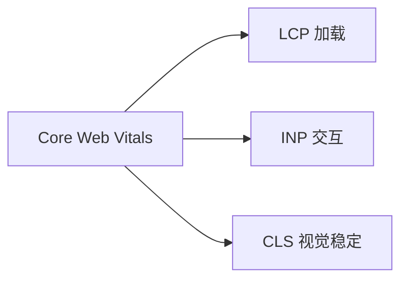
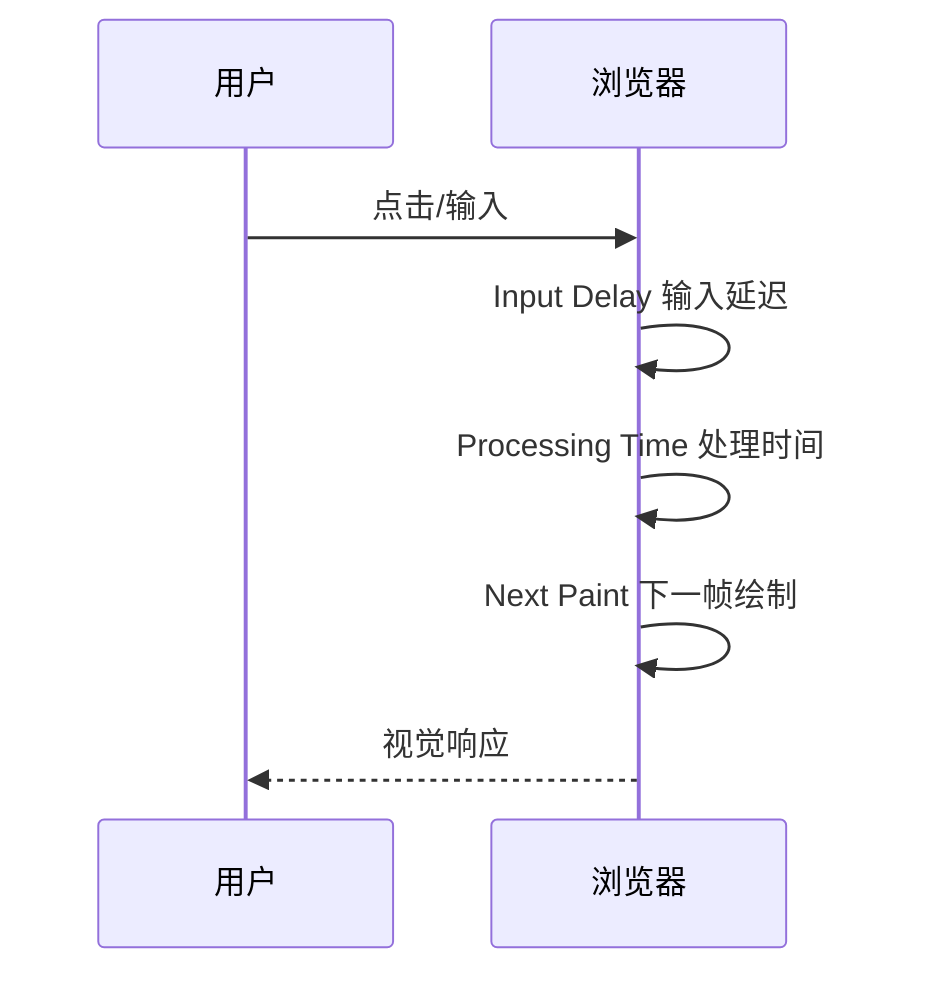
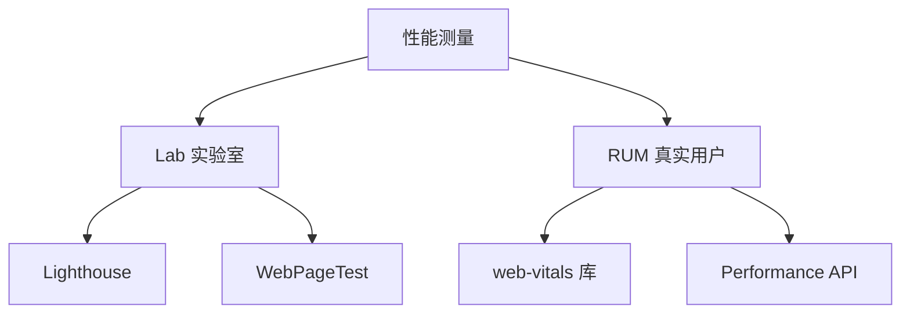

# 性能指标与监控 · 核心知识点详解

> 本文档位于 `知识库/前端/05运行时与性能/04性能指标与监控/`，是性能指标与监控的核心知识库。配套面试题见《常见面试题与最佳实践.md》。
>
> 读完应能解释清楚"Core Web Vitals 各指标含义与阈值""RUM 与 Lab 测的区别""Performance API 怎么用""Lighthouse 跑什么""怎么把性能预算集成到 CI"。

---

## 一、Core Web Vitals

### 1.1 三大核心指标



<!-- -->

Google 定义的三个核心性能指标，反映用户真实体验：

| 指标 | 全称 | 测量 | 良好 | 需改进 | 差 |
|---|---|---|---|---|---|
| **LCP** | Largest Contentful Paint | 最大内容绘制时间 | ≤ 2.5s | 2.5-4s | > 4s |
| **INP** | Interaction to Next Paint | 交互到下一帧绘制 | ≤ 200ms | 200-500ms | > 500ms |
| **CLS** | Cumulative Layout Shift | 累计布局偏移 | ≤ 0.1 | 0.1-0.25 | > 0.25 |

### 1.2 LCP（Largest Contentful Paint）


<!-- -->

- **定义**：视口内最大元素（图片/视频/文本块）完成渲染的时间。
- **代表**：用户感知的"主要内容已加载"。
- **测量**：从 navigationStart 到最大元素绘制。
- **2023+**：取代 FCP 作为加载性能核心指标。

**常见 LCP 元素**：

- `` 图片
- `<video>` 视频封面
- 块级文本元素（h1、p）
- 背景图元素
- `<svg>` 内的 `<image>`

**优化手段**：

- 图片优先级（`fetchpriority="high"`、`preload`）。
- 字体子集化 + preload。
- 内联 critical CSS。
- 减少关键资源大小。
- 用 CDN。

### 1.3 INP（Interaction to Next Paint）



<!-- -->

- **定义**：用户交互（点击、按键、输入）到下一帧绘制的时间。
- **代表**：用户感知的"交互响应速度"。
- **2024+**：取代 FID 成为响应性核心指标。
- **测量**：所有交互的最大值（或近似 P98）。

**与 FID 区别**：

| 维度 | FID | INP |
|---|---|---|
| 测量 | 仅首次输入延迟 | 所有交互完整时长 |
| 关注 | 输入延迟（input delay） | 输入延迟 + 处理 + 绘制 |
| 严格度 | 较松 | 更严格 |

**优化手段**：

- 拆分长任务（< 50ms/帧）。
- 用 Web Worker 移出 CPU 密集。
- 缓存计算结果。
- 避免同步 reflow。
- 用 `scheduler.yield()`（Chrome 129+）。

### 1.4 CLS（Cumulative Layout Shift）


<!-- -->

- **定义**：页面生命周期内累计的意外布局偏移分数。
- **代表**：用户感知的"视觉稳定性"。
- **公式**：`impact fraction × distance fraction`。

**常见来源**：

- 图片/视频无尺寸（导致后加载时挤开内容）。
- 字体晚到（FOUT/FOIT 切换）。
- 动态注入 DOM（广告、弹窗）。
- 异步加载的组件占位不当。

**优化手段**：

```html
<!-- 图片设宽高 -->


<!-- 设 aspect-ratio -->


<!-- 字体用 font-display: swap + size-adjust -->
@font-face {
  font-family: "Inter";
  src: url(...) format("woff2");
  font-display: swap;
  size-adjust: 100%;  /* 匹配 fallback 字体度量 */
}

<!-- 动态内容预留占位 -->
<div style="min-height: 250px;">广告位</div>
```

### 1.5 其他重要指标

| 指标 | 全称 | 含义 |
|---|---|---|
| **FCP** | First Contentful Paint | 首次内容绘制 |
| **TTFB** | Time to First Byte | 首字节响应时间 |
| **FID** | First Input Delay | 首次输入延迟（被 INP 取代） |
| **TBT** | Total Blocking Time | 总阻塞时间（Lab） |
| **TTI** | Time to Interactive | 可交互时间 |
| **Speed Index** | - | 视觉填充速度 |
| **SI** | - | Lighthouse 综合分 |

**TTFB**：

- 浏览器发请求到收到首字节的时间。
- 反映服务器响应速度 + 网络延迟。
- 良好 < 800ms，需改进 800-1800ms。

**FCP**：

- 首次绘制任何内容（文字、图片、SVG）。
- 良好 < 1.8s。

**TBT**：

- FCP 与 TTI 之间，主线程被阻塞的总时长。
- 阻塞 = 任务 > 50ms 的部分。
- Lab 指标（模拟），INP 是 field 指标（真实用户）。

---

## 二、RUM vs Lab

### 2.1 两种测量方式



<!-- -->

- **Lab（实验室测量）**：固定环境、模拟设备跑分。
- **RUM（Real User Monitoring）**：真实用户浏览器上报。

| 维度 | Lab | RUM |
|---|---|---|
| 环境 | 受控（Lighthouse 配置） | 真实（各种设备/网络） |
| 数据量 | 单次 | 海量 |
| 真实性 | 模拟 | 真实 |
| 适合 | 开发期诊断 | 生产监控 |
| 指标 | LCP/CLS/TBT/SI | LCP/INP/CLS |

### 2.2 为什么需要 RUM

- **Lab 不反映真实用户**：用户的设备、网络千差万别。
- **RUM 看到 P75/P95**：长尾用户体验，Lab 看不到。
- **Google 排名用 RUM**：搜索排名基于真实用户 CWV。

### 2.3 推荐组合

- **开发期**：Lighthouse + WebPageTest。
- **生产期**：web-vitals 库 + 自建 RUM / Sentry / Datadog。
- **CI**：Lighthouse CI 卡 PR。

---

## 三、Performance API

### 3.1 Performance Observer

```js
// 监听 CWV
const observer = new PerformanceObserver((list) => {
  list.getEntries().forEach((entry) => {
    console.log(entry.name, entry.value);
  });
});

observer.observe({ type: "largest-contentful-paint", buffered: true });
observer.observe({ type: "layout-shift", buffered: true });
observer.observe({ type: "first-input", buffered: true });
observer.observe({ type: "event", buffered: true });  // INP
```

### 3.2 web-vitals 库

```bash
pnpm add web-vitals
```

```js
import { onLCP, onINP, onCLS, onFCP, onTTFB } from "web-vitals";

onLCP(console.log);
onINP(console.log);
onCLS(console.log);
onFCP(console.log);
onTTFB(console.log);

// 上报到服务器
function report(metric) {
  fetch("/api/metrics", {
    method: "POST",
    body: JSON.stringify({
      name: metric.name,
      value: metric.value,
      rating: metric.rating,  // "good" | "needs-improvement" | "poor"
      id: metric.id,
      delta: metric.delta,
    }),
  });
}

onLCP(report);
onINP(report);
onCLS(report);
```

### 3.3 Performance API 类型

```js
// 1. navigation 导航
const [nav] = performance.getEntriesByType("navigation");
console.log(nav.domContentLoadedEventEnd);  // DOMContentLoaded 完成时间
console.log(nav.loadEventEnd);              // load 完成
console.log(nav.responseEnd);               // 响应结束
console.log(nav.transferSize);              // 传输字节数

// 2. resource 资源
const resources = performance.getEntriesByType("resource");
resources.forEach(r => {
  console.log(r.name, r.duration, r.transferSize);
});

// 3. paint 绘制
performance.getEntriesByType("paint").forEach(p => {
  console.log(p.name, p.startTime);  // "first-paint" / "first-contentful-paint"
});

// 4. long task
new PerformanceObserver((list) => {
  list.getEntries().forEach(t => {
    console.warn("长任务", t.duration);
  });
}).observe({ type: "longtask", buffered: true });

// 5. mark & measure
performance.mark("start");
// ... 代码 ...
performance.mark("end");
performance.measure("my-measure", "start", "end");
const [m] = performance.getEntriesByName("my-measure");
console.log("耗时", m.duration);
```

### 3.4 User Timing API

```js
// 自定义标记测量业务代码
function loadPage() {
  performance.mark("load-start");

  fetchData().then(() => {
    performance.mark("fetch-end");
    performance.measure("fetch", "load-start", "fetch-end");
    render();
    performance.mark("render-end");
    performance.measure("render", "fetch-end", "render-end");
  });
}

// 监听 measure
new PerformanceObserver((list) => {
  list.getEntries().forEach(m => {
    console.log(m.name, m.duration);
  });
}).observe({ type: "measure", buffered: true });
```

### 3.5 Resource Timing API

```js
// 看每个资源的加载详情
const resources = performance.getEntriesByType("resource");
resources.forEach(r => {
  console.log({
    name: r.name,                    // URL
    duration: r.duration,            // 总耗时
    transferSize: r.transferSize,    // 传输字节
    decodedBodySize: r.decodedBodySize, // 解压后大小
    initiatorType: r.initiatorType,   // 发起者类型
    tcp: r.connectEnd - r.connectStart,
    ttfb: r.responseStart - r.requestStart,
    download: r.responseEnd - r.responseStart,
  });
});
```

---

## 四、Lighthouse

### 4.1 Lighthouse 是什么

Lighthouse 是 Google 开源的**自动化性能审计工具**，跑 5 个维度评分：

| 维度 | 内容 |
|---|---|
| **Performance** | LCP、TBT、CLS、Speed Index |
| **Accessibility** | 无障碍（ARIA、对比度） |
| **Best Practices** | HTTPS、错误处理 |
| **SEO** | 元数据、可索引性 |
| **PWA** | Service Worker、Manifest |

### 4.2 命令行用法

```bash
# 全局安装
npm install -g lighthouse

# 跑一个 URL
lighthouse https://example.com --view

# 输出 JSON
lighthouse https://example.com --output json --output-path report.json

# 模拟移动设备
lighthouse https://example.com --emulated-form-factor=mobile

# 只跑某类别
lighthouse https://example.com --only-categories=performance

# 桌面配置
lighthouse https://example.com --preset=desktop
```

### 4.3 CI 集成

```yaml
# .github/workflows/lighthouse.yml
name: Lighthouse
on: [push, pull_request]
jobs:
  lighthouse:
    runs-on: ubuntu-latest
    steps:
      - uses: actions/checkout@v4
      - uses: actions/setup-node@v4
        with: { node-version: 20 }
      - run: npm ci
      - run: npm run build
      - run: npm run serve &  # 启动本地服务
      - uses: treosh/lighthouse-ci-action@v9
        with:
          urls: |
            http://localhost:3000
          budgetPath: ./lighthouse-budget.json
          uploadArtifacts: true
```

```json
// lighthouse-budget.json
{
  "resourceCounts": [
    { "resourceType": "script", "budget": 10 },
    { "resourceType": "stylesheet", "budget": 3 }
  ],
  "resourceSizes": [
    { "resourceType": "script", "budget": 200 },
    { "resourceType": "stylesheet", "budget": 50 }
  ],
  "timings": [
    { "metric": "first-contentful-paint", "budget": 1500 },
    { "metric": "largest-contentful-paint", "budget": 2500 },
    { "metric": "cumulative-layout-shift", "budget": 0.1 }
  ]
}
```

### 4.4 Chrome DevTools

- **Lighthouse 面板**：跑审计 + 评分。
- **Performance 面板**：录制运行时性能。
- **Coverage 面板**：看 JS/CSS 使用率（找未用代码）。
- **Network 面板**：看资源加载瀑布。
- **Memory 面板**：堆快照、内存分析。

---

## 五、性能预算

### 5.1 设定预算

```js
// 性能预算示例
const budget = {
  // 资源
  js: "200 KB",
  css: "50 KB",
  images: "300 KB",
  fonts: "100 KB",
  total: "500 KB",

  // 时间
  fcp: "1.5s",
  lcp: "2.5s",
  tbt: "200ms",
  cls: "0.1",
  inp: "200ms",

  // 请求数
  requests: 30,
};
```

### 5.2 包大小预算

```js
// 用 webpack-bundle-analyzer / rollup-plugin-visualizer 分析
// 配置 performance 预算
module.exports = {
  performance: {
    maxAssetSize: 244000,        // 单文件最大
    maxEntrypointSize: 244000,  // 入口最大
    hints: "warning",
    assetFilter: (filename) => !filename.endsWith(".map"),
  },
};

// Vite 用 rollup-plugin-visualizer + 手动阈值检查
import { visualizer } from "rollup-plugin-visualizer";
plugins: [
  visualizer({
    filename: "dist/stats.html",
    gzipSize: true,
    brotliSize: true,
  }),
];
```

### 5.3 CI 集成

```yaml
# .github/workflows/budget.yml
- name: Check bundle size
  run: |
    ACTUAL=$(stat -c%s dist/assets/index.js)
    LIMIT=200000
    if [ $ACTUAL -gt $LIMIT ]; then
      echo "Bundle too large: $ACTUAL > $LIMIT"
      exit 1
    fi

- name: Lighthouse CI
  uses: treosh/lighthouse-ci-action@v9
  with:
    urls: http://localhost:3000
    budgetPath: ./lighthouse-budget.json
```

### 5.4 size-limit

```bash
pnpm add -D size-limit @size-limit/preset-app
```

```json
// package.json
{
  "size-limit": [
    { "path": "dist/index.js", "limit": "200 KB" },
    { "path": "dist/index.css", "limit": "50 KB" }
  ]
}
```

```json
{
  "scripts": {
    "size": "size-limit"
  }
}
```

```yaml
# CI
- run: pnpm build
- run: pnpm size
```

---

## 六、自建 RUM 上报

### 6.1 基础架构


<!-- -->

### 6.2 web-vitals 上报

```js
import { onLCP, onINP, onCLS, onFCP, onTTFB } from "web-vitals";

function send(metric) {
  // 用 sendBeacon 不阻塞页面
  const data = JSON.stringify({
    name: metric.name,
    value: metric.value,
    rating: metric.rating,
    id: metric.id,
    delta: metric.delta,
    page: location.pathname,
    sessionId: getSessionId(),
    userAgent: navigator.userAgent,
    timestamp: Date.now(),
  });

  if (navigator.sendBeacon) {
    navigator.sendBeacon("/api/metrics", data);
  } else {
    fetch("/api/metrics", { method: "POST", body: data, keepalive: true });
  }
}

onLCP(send);
onINP(send);
onCLS(send);
onFCP(send);
onTTFB(send);

// 页面隐藏时强制发送
window.addEventListener("visibilitychange", () => {
  if (document.visibilityState === "hidden") {
    // 触发所有未上报的 metric
  }
});
```

### 6.3 错误 + 性能综合上报

```js
// 统一上报通道
class Reporter {
  queue = [];

  add(type, data) {
    this.queue.push({ type, data, timestamp: Date.now() });
    if (document.visibilityState === "hidden") {
      this.flush();
    }
  }

  flush() {
    if (!this.queue.length) return;
    const data = JSON.stringify(this.queue);
    navigator.sendBeacon("/api/telemetry", data);
    this.queue = [];
  }
}

const reporter = new Reporter();

// 错误上报
window.addEventListener("error", (e) => {
  reporter.add("error", {
    message: e.message,
    filename: e.filename,
    line: e.lineno,
    col: e.colno,
    stack: e.error?.stack,
  });
});

window.addEventListener("unhandledrejection", (e) => {
  reporter.add("unhandledrejection", {
    reason: e.reason?.message || String(e.reason),
    stack: e.reason?.stack,
  });
});

// 性能上报
onLCP(m => reporter.add("lcp", m));
onINP(m => reporter.add("inp", m));
onCLS(m => reporter.add("cls", m));

// 页面隐藏时发送
window.addEventListener("visibilitychange", () => {
  if (document.visibilityState === "hidden") reporter.flush();
});
```

### 6.4 后端聚合

```js
// Express 后端接收
app.post("/api/telemetry", (req, res) => {
  const events = req.body;  // 数组

  // 写入时序数据库（如 InfluxDB / TimescaleDB）
  events.forEach(event => {
    db.write("telemetry", {
      ...event,
      timestamp: new Date(event.timestamp),
    });
  });

  res.status(204).end();
});
```

```sql
-- 聚合查询 P75 LCP
SELECT
  PERCENTILE_CONT(0.75) WITHIN GROUP (ORDER BY value) as p75_lcp
FROM telemetry
WHERE type = 'lcp'
  AND timestamp > NOW() - INTERVAL '24 hours';
```

---

## 七、常见指标优化建议

### 7.1 LCP 优化

| 来源 | 优化 |
|---|---|
| 图片慢 | preload 关键图、用 WebP/AVIF、CDN |
| 字体慢 | font-display: swap、子集化、preload |
| CSS 阻塞 | 内联 critical、异步加载 non-critical |
| JS 阻塞 | defer、async、代码分割 |
| TTFB 慢 | CDN、SSR/SSG、HTTP/2 |

### 7.2 INP 优化

| 来源 | 优化 |
|---|---|
| 长任务 | 拆分（< 50ms）、用 scheduler.yield |
| 主线程忙 | Web Worker 移出 CPU 密集 |
| JS 阻塞 | defer、按需 import |
| 同步 reflow | 用 transform、缓存读值 |
| 第三方脚本 | 延迟加载、Partytown |

### 7.3 CLS 优化

| 来源 | 优化 |
|---|---|
| 图片无尺寸 | width/height + aspect-ratio |
| 字体 FOUT | font-display: swap + size-adjust |
| 动态 DOM | 预留占位（min-height） |
| 广告 | 固定 slot 大小 |
| 异步组件 | suspense fallback + 占位 |

---

## 八、常见陷阱与修复

### 8.1 Lab 与 RUM 差异大

- Lab 用桌面配置，但生产用户多移动端 → 跑移动配置。
- Lab 用快网络，但生产用户网络慢 → 跑 Slow 4G。
- Lab 单次，但 RUM 有 P75/P95 → 看 RUM。

### 8.2 上报阻塞页面

```js
// 错：fetch 上报阻塞页面卸载
fetch("/api/metrics", { method: "POST", body: data });

// 对：sendBeacon 不阻塞
navigator.sendBeacon("/api/metrics", data);

// 或 keepalive（兼容更好）
fetch("/api/metrics", { method: "POST", body: data, keepalive: true });
```

### 8.3 监听不到 INP

```js
// INP 是 Chrome 2023+ 的指标，需要 web-vitals v3+
import { onINP } from "web-vitals";
onINP(console.log);

// 老版本只能用 FID（已废弃）
import { onFID } from "web-vitals";
onFID(console.log);
```

### 8.4 CLS 计算异常

```js
// 用户主动交互后的偏移不计入 CLS
window.addEventListener("click", () => {
  // 500ms 内的偏移被排除
});
```

### 8.5 上报数据量大

- 不要每个事件都上报，批量。
- 用 sessionStorage 缓存，卸载时一次性发。
- 用 visibilitychange 触发而非 unload。

---

## 九、最佳实践 Checklist

### 9.1 指标

LCP ≤ 2.5s（P75）
INP ≤ 200ms（P75）
CLS ≤ 0.1（P75）
FCP ≤ 1.8s
TTFB ≤ 800ms

### 9.2 监控

web-vitals 库采集 CWV
sendBeacon 上报
自建 RUM 或用 Sentry/Datadog
P75 / P95 长尾监控
visibilitychange 触发上报

### 9.3 Lab

Lighthouse 定期跑
移动 + 桌面配置都跑
CI 集成 Lighthouse CI
性能预算卡 PR

### 9.4 预算

JS ≤ 200KB
CSS ≤ 50KB
总资源 ≤ 500KB
请求 ≤ 30 个
size-limit 卡包大小

### 9.5 报告

实时 dashboard（Grafana）
性能回归告警
按页面分组统计
按设备分组统计

---

## 十、一句话总纲

> 性能指标与监控的本质是 **"Core Web Vitals（LCP/INP/CLS）+ RUM 真实用户监控 + Lab 实验室诊断"**：LCP 反映加载（≤2.5s）、INP 反映交互（≤200ms，2024 取代 FID）、CLS 反映视觉稳定（≤0.1）；RUM 用 web-vitals 库采集真实用户指标、用 sendBeacon 上报不阻塞页面；Lab 用 Lighthouse 在受控环境跑分诊断；性能预算（JS/CSS/请求大小）用 size-limit 在 CI 卡 PR。能答出"LCP/INP/CLS 阈值""RUM 与 Lab 区别""web-vitals 怎么用""sendBeacon 为什么重要""性能预算怎么集成 CI"，就是高级前端对性能监控的认知。
