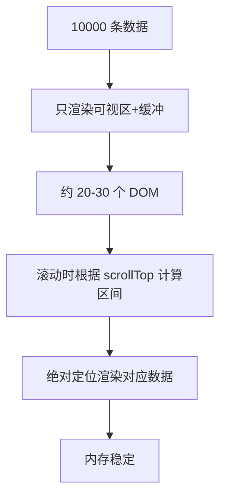
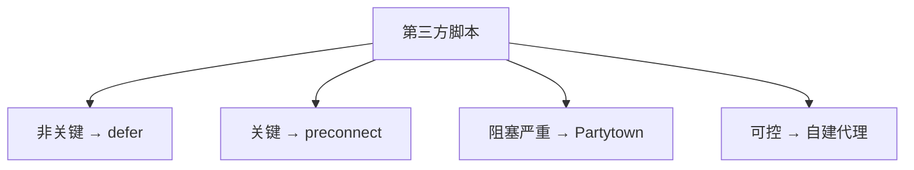

# 性能优化实战 · 常见面试题与最佳实践

> 本文档位于 `知识库/前端/05运行时与性能/05性能优化实战/`，是性能优化实战的面试题集与生产最佳实践。配套核心知识见《核心知识点详解.md》。
>
> 15 道高频题 + 6 个生产场景 + 完整 Checklist，覆盖图片优化、字体加载、代码分割、虚拟列表、Critical CSS、第三方治理、构建优化等面试常考点。

---

## 一、图片优化类（高频）

### 1. WebP、AVIF、JPG 怎么选？

**核心答案**：AVIF > WebP > JPG，用 `<picture>` 多 source 兜底。

| 格式 | 压缩率 | 透明通道 | 动画 | 浏览器支持 | 适用 |
|---|---|---|---|---|---|
| JPG | 中 | 否 | 否 | 100% | 老照片 |
| PNG | 低 | 是 | 否 | 100% | 图标 / 透明 |
| WebP | 高（-30% vs JPG） | 是 | 是 | 96%+ | 主流 |
| AVIF | 极高（-50% vs JPG） | 是 | 是 | 92%+ | 新项目 |
| SVG | 矢量 | 是 | 是 | 100% | 图标 |

```html
<picture>
  <source type="image/avif" srcset="/hero.avifs">
  <source type="image/webp" srcset="/hero.webp">
  
</picture>
```

**关键认知**：

- AVIF 比 WebP 再小 20-30%，但编码慢。
- SVG 用于图标 / 简单图形 / 矢量插画。
- 动画用 MP4 / WebM，不要用 GIF。

---

### 2. 响应式图片怎么实现？

**核心答案**：`srcset` + `sizes` 按视口加载不同尺寸；`<picture>` 按媒体查询切换。

```html
<!-- srcset + sizes：浏览器选最佳尺寸 -->


<!-- picture + media：按设备条件切换 -->
<picture>
  <source media="(max-width: 768px)" srcset="hero-mobile.webp">
  <source media="(min-width: 769px)" srcset="hero.webp">
  
</picture>
```

**区别**：

| 方法 | 用途 |
|---|---|
| `srcset` + `sizes` | 同一张图不同尺寸 |
| `<picture>` + `media` | 不同图（手机版 vs 桌面版） |
| `<picture>` + `type` | 不同格式（AVIF / WebP / JPG） |

**最佳实践**：

```html
<picture>
  <source type="image/avif" srcset="hero-400.avif 400w, hero-800.avif 800w"
          sizes="(max-width: 600px) 400px, 800px">
  <source type="image/webp" srcset="hero-400.webp 400w, hero-800.webp 800w"
          sizes="(max-width: 600px) 400px, 800px">
  
</picture>
```

---

### 3. 图片懒加载怎么实现？

**核心答案**：原生 `loading="lazy"` + `decoding="async"`；老浏览器用 IntersectionObserver。

```html
<!-- 原生懒加载 -->

```

**兼容方案**：

```js
const images = document.querySelectorAll('img[data-src]');
const observer = new IntersectionObserver(entries => {
  entries.forEach(entry => {
    if (entry.isIntersecting) {
      const img = entry.target;
      img.src = img.dataset.src;
      img.removeAttribute("data-src");
      observer.unobserve(img);
    }
  });
}, {
  rootMargin: "200px 0px",  // 提前 200px 加载
  threshold: 0,
});

images.forEach(img => observer.observe(img));
```

**关键参数**：

- `loading="lazy"`：浏览器原生懒加载。
- `decoding="async"`：解码不阻塞主线程。
- `rootMargin: "200px"`：提前 200px 触发，避免用户看到空白。
- `fetchpriority="high"`：LCP 图片用，**取消** lazy。

**LQIP（Low Quality Image Placeholder）**：

```html
<!-- 极小占位图（base64 内联）+ 真图懒加载 -->

```

---

### 4. 怎么优化 SVG？

**核心答案**：用 SVGO 去 metadata / 简化路径，再用 SVG 雪碧图合并多图标。

**SVGO 优化**：

```bash
# CLI
npx svgo input.svg -o output.svg

# 配置 svgo.config.js
module.exports = {
  plugins: [
    "removeDimensions",      // 去 width/height（用 CSS 控制）
    "removeViewBox",          // 视情况保留 viewBox
    "removeMetadata",
    "removeComments",
    "collapseGroups",
    "mergePaths",
    "convertColors",
  ],
};
```

**SVG 雪碧图**：

```html
<!-- 单文件多图标，按需 use -->
<svg xmlns="http://www.w3.org/2000/svg" style="display:none">
  <symbol id="icon-home" viewBox="0 0 24 24">
    <path d="..."/>
  </symbol>
  <symbol id="icon-user" viewBox="0 0 24 24">
    <path d="..."/>
  </symbol>
</svg>

<!-- 使用 -->
<svg width="24" height="24"><use href="#icon-home"/></svg>
```

**React 用 SVGR**：

```js
// vite.config.js
import { svgr } from "vite-plugin-svgr";

export default {
  plugins: [svgr()],
};

// 组件
import HomeIcon from "./icons/home.svg?react";
<HomeIcon width={24} height={24} />
```

---

## 二、字体优化类

### 5. font-display 各值什么含义？

**核心答案**：控制字体加载期间文字显示行为——block 隐藏文字，swap 立即用回退。

| `font-display` | 行为 | 触发现象 |
|---|---|---|
| `auto` | 浏览器决定（多数 block） | FOIT |
| `block` | 等字体 3s，期间不显示文字 | FOIT |
| `swap` | 立即用回退字体，加载完切换 | FOUT |
| `fallback` | 100ms 等待，3s 切换 | 短 FOIT + FOUT |
| `optional` | 100ms 等待，网络慢则不加载 | 短 FOIT + 不加载 |

**FOIT vs FOUT**：

| 现象 | 含义 | 触发 |
|---|---|---|
| FOIT | 字体加载期间文字不可见 | `block` / `auto` |
| FOUT | 先用回退字体，加载完切换 | `swap` |

**推荐**：

```css
@font-face {
  font-family: "Inter";
  src: url("/fonts/inter.woff2") format("woff2"),
       url("/fonts/inter.woff") format("woff");
  font-display: swap;       /* 正文 */
  font-weight: 400;
}

@font-face {
  font-family: "HeadingFont";
  src: url("/fonts/heading.woff2") format("woff2");
  font-display: optional;    /* 标题：网络慢则不用 */
}
```

---

### 6. 怎么减少字体文件大小？

**核心答案**：用 woff2 + 字体子集化（只保留用到的字符）。

**格式优化**：

| 格式 | 压缩率 | 浏览器支持 |
|---|---|---|
| TTF | 低 | 100% |
| WOFF | 中 | 100% |
| **WOFF2** | 高 | 96%+ |

只用 woff2 + woff 兜底。

**字体子集化**：

```bash
# 1. glyphhanger：按页面内容提取字符
npx glyphhanger --url=https://example.com --subset=*.woff2

# 2. fonttools（Python）
pyftsubset Inter.ttf \
  --text="Hello, World! 你好世界" \
  --output-file=Inter-subset.woff2 \
  --flavor=woff2
```

**效果**：

| 场景 | 全字体 | 子集后 |
|---|---|---|
| 英文 | 100KB | 15KB |
| 中文 | 5MB | 100KB |

**可变字体（Variable Font）**：

```css
@font-face {
  font-family: "Inter Variable";
  src: url("/fonts/inter-variable.woff2") format("woff2-variations");
  font-weight: 100 900;  /* 一个文件覆盖所有字重 */
}

/* 用法 */
.light { font-weight: 300; }
.bold { font-weight: 700; }
```

- 一个文件替代多个静态字体文件。
- 字重自由调整。
- 体积比多文件总和小 50%+。

**字体 preload**：

```html
<link rel="preload" as="font" href="/fonts/inter.woff2"
      type="font/woff2" crossorigin>
```

**注意**：`crossorigin` 必须加，否则 preload 失效。

---

## 三、代码分割类（高频）

### 7. React 怎么实现路由级代码分割？

**核心答案**：`React.lazy` + `Suspense`，按路由动态 import。

```jsx
import { lazy, Suspense } from "react";
import { BrowserRouter, Routes, Route } from "react-router-dom";

const Home = lazy(() => import("./pages/Home"));
const About = lazy(() => import("./pages/About"));
const User = lazy(() => import("./pages/User"));

function App() {
  return (
    <BrowserRouter>
      <Suspense fallback={<div>Loading...</div>}>
        <Routes>
          <Route path="/" element={<Home />} />
          <Route path="/about" element={<About />} />
          <Route path="/user" element={<User />} />
        </Routes>
      </Suspense>
    </BrowserRouter>
  );
}
```

**预加载优化**：

```jsx
// 用户 hover 链接时预加载
function Link({ to, children }) {
  const handleEnter = () => {
    // 触发 chunk 下载
    import(`./pages/${to.charAt(0).toUpperCase() + to.slice(1)}.jsx`);
  };
  return <Link to={to} onMouseEnter={handleEnter}>{children}</Link>;
}
```

**Vue Router 写法**：

```js
const routes = [
  { path: "/", component: () => import("./pages/Home.vue") },
  { path: "/about", component: () => import("./pages/About.vue") },
];
```

---

### 8. Tree Shaking 失效了，怎么排查？

**核心答案**：检查 ① 是否用 ESM ② package.json sideEffects ③ 是否有副作用代码。

**排查清单**：

1. **用 ESM 而非 CJS**：

```js
// 坏：CJS 不能 Tree Shake
const _ = require("lodash");

// 好：ESM 可以 Tree Shake
import _ from "lodash-es";  // 注意是 lodash-es 不是 lodash
import { get } from "lodash-es";
```

2. **package.json 标记 sideEffects**：

```json
{
  "name": "my-lib",
  "sideEffects": false  // 模块无副作用
}

// 或部分有副作用
{
  "sideEffects": ["./src/polyfill.js", "*.css"]
}
```

3. **避免顶层副作用**：

```js
// 坏：模块顶层有副作用，Tree Shake 不动
window.myGlobal = "value";
console.log("module loaded");

// 好：包装成函数
export function init() {
  window.myGlobal = "value";
  console.log("module loaded");
}
```

4. ** production 模式**：

```bash
# Webpack production 默认开启
webpack --mode=production

# Vite 默认 production Tree Shake
vite build
```

**验证 Tree Shake 是否生效**：

```bash
# 用 webpack-bundle-analyzer
npx webpack-bundle-analyzer dist/stats.json

# 看打包结果是否包含未用的代码
```

---

### 9. Vite 怎么手动分包？

**核心答案**：用 `rollupOptions.output.manualChunks` 把第三方库拆成独立 chunk。

```js
// vite.config.js
export default {
  build: {
    rollupOptions: {
      output: {
        manualChunks: {
          // 把 react 系列单独打包
          "react-vendor": ["react", "react-dom", "react-router-dom"],
          // 图表库单独打包
          "chart-vendor": ["echarts", "d3", "chart.js"],
          // 工具库
          "utils": ["lodash-es", "dayjs"],
        },
        // 文件名带 hash
        chunkFileNames: "assets/[name]-[hash].js",
        assetFileNames: "assets/[name]-[hash][extname]",
      },
    },
  },
};
```

**函数式配置（更灵活）**：

```js
manualChunks(id) {
  if (id.includes("node_modules")) {
    if (id.includes("react")) return "react-vendor";
    if (id.includes("echarts") || id.includes("d3")) return "chart-vendor";
    return "vendor";
  }
}
```

**分包策略**：

- 把不常变的第三方独立成 vendor chunk。
- 业务代码单独打包，hash 频繁变化。
- 路由级代码自动按 import() 分包。

**Webpack 等价配置**：

```js
module.exports = {
  optimization: {
    splitChunks: {
      chunks: "all",
      cacheGroups: {
        vendor: {
          test: /[\\/]node_modules[\\/]/,
          name: "vendors",
          chunks: "all",
        },
      },
    },
  },
};
```

---

## 四、虚拟列表类

### 10. 虚拟列表原理是什么？什么时候用？

**核心答案**：只渲染视口内 + 缓冲区，滚动时动态替换，DOM 数量恒定（约 20-30 个）。



<!-- -->

**核心算法**：

```jsx
function VirtualList({ items, itemHeight, visibleCount }) {
  const [scrollTop, setScrollTop] = useState(0);
  const totalHeight = items.length * itemHeight;

  // 计算可见区间（带缓冲）
  const startIndex = Math.max(0, Math.floor(scrollTop / itemHeight) - 5);
  const endIndex = Math.min(
    items.length,
    Math.ceil((scrollTop + visibleCount * itemHeight) / itemHeight) + 5
  );

  return (
    <div
      style={{ height: visibleCount * itemHeight, overflowY: "auto" }}
      onScroll={(e) => setScrollTop(e.target.scrollTop)}
    >
      {/* 总高度占位 */}
      <div style={{ height: totalHeight, position: "relative" }}>
        {/* 只渲染可见项 */}
        {items.slice(startIndex, endIndex).map((item, i) => (
          <div
            key={startIndex + i}
            style={{
              position: "absolute",
              top: (startIndex + i) * itemHeight,
              height: itemHeight,
            }}
          >
            {item.content}
          </div>
        ))}
      </div>
    </div>
  );
}
```

**何时用**：

| 场景 | 是否需要虚拟列表 |
|---|---|
| 100 条以下 | 不需要 |
| 100-1000 条 | 可选 |
| 1000+ 条 | 必须 |
| 表格 + 虚拟滚动 | 推荐 |
| 不定高度 | 用 VariableSizeList |

**成熟方案**：

```jsx
// react-window（推荐，轻量）
import { FixedSizeList, VariableSizeList } from "react-window";

<FixedSizeList
  height={600}
  itemCount={100000}
  itemSize={35}
  width="100%"
>
  {({ index, style }) => <div style={style}>Row {index}</div>}
</FixedSizeList>
```

---

### 11. react-window 的 FixedSizeList 和 VariableSizeList 区别？

**核心答案**：FixedSizeList 等高，性能好；VariableSizeList 不等高，需提供 itemSize 函数。

| 类型 | 行高 | 性能 | 适用 |
|---|---|---|---|
| FixedSizeList | 固定 | 高 | 等高列表 |
| VariableSizeList | 不定 | 中 | 不等高列表 |

```jsx
// FixedSizeList
import { FixedSizeList } from "react-window";

<FixedSizeList
  height={600}
  itemCount={1000}
  itemSize={50}  // 固定 50px
  width="100%"
>
  {Row}
</FixedSizeList>

// VariableSizeList
import { VariableSizeList } from "react-window";

const getItemSize = (index) => {
  return items[index].description ? 100 : 50;  // 不等高
};

<VariableSizeList
  height={600}
  itemCount={1000}
  itemSize={getItemSize}  // 函数返回每行高度
  width="100%"
>
  {Row}
</VariableSizeList>
```

**关键注意**：

- VariableSizeList 性能略低（需算累计偏移）。
- 内容动态变化时调用 `ref.resetAfterIndex(0)` 重算高度。
- 不等高但已知的场景，可以缓存高度数组。

---

## 五、Critical CSS 与第三方类

### 12. Critical CSS 怎么提取？

**核心答案**：用 puppeteer 渲染首屏，提取用到的 CSS 规则，内联到 HTML。


<!-- -->

**工具**：

```bash
# 1. critical（Node）
npx critical index.html critical.css --inline --width 1440 --height 900

# 2. critters（Vite/Webpack 插件）
import { Critters } from "critters-webpack-plugin";
// 自动提取并内联
```

**手动实现**：

```js
// 用 Puppeteer + penthouse
const penthouse = require("penthouse");

const critical = await penthouse({
  url: "http://localhost:3000",
  css: "./dist/main.css",
  width: 1440,
  height: 900,
});

fs.writeFileSync("critical.css", critical);
```

**使用**：

```html
<head>
  <!-- 1. 内联 Critical CSS -->
  <style>
    body { margin: 0; }
    .hero { width: 100%; height: 60vh; }
    /* ... 首屏必要样式 */
  </style>

  <!-- 2. 剩余 CSS 异步加载 -->
  <link rel="preload" href="/full.css" as="style"
        onload="this.rel='stylesheet'">
  <noscript><link rel="stylesheet" href="/full.css"></noscript>
</head>
```

**注意事项**：

- Critical CSS 大小控制在 14KB（HTTP/2 首包大小）。
- 内联后 HTML 文件变大，但减少一次 CSS 请求，整体首屏更快。
- 不要内联所有 CSS——影响 HTML 缓存。

---

### 13. 怎么治理第三方脚本对性能的影响？

**核心答案**：延迟加载、域名预热、自建代理、Partytown 移到 Worker。



<!-- -->

**4 种治理手段**：

```html
<!-- 1. 域名预热 -->
<link rel="preconnect" href="https://www.google-analytics.com" crossorigin>
<link rel="dns-prefetch" href="//connect.facebook.net">

<!-- 2. defer 异步加载 -->
<script defer src="https://www.google-analytics.com/analytics.js"></script>

<!-- 3. 动态加载（页面 onload 后延迟 3s） -->
<script>
  window.addEventListener("load", () => {
    setTimeout(() => {
      const s = document.createElement("script");
      s.src = "https://www.example.com/sdk.js";
      document.body.appendChild(s);
    }, 3000);
  });
</script>

<!-- 4. Partytown（移到 Web Worker） -->
<script src="https://cdn.jsdelivr.net/npm/@builder.io/partytown/lib/partytown.min.js"></script>
<script type="text/partytown" src="https://www.google-analytics.com/analytics.js"></script>
```

**自建代理**：

```js
// 前端同域请求
fetch("/proxy/analytics", { method: "POST", body: data });

// 服务端代理转发
app.post("/proxy/analytics", async (req, res) => {
  await fetch("https://www.google-analytics.com/collect", {
    method: "POST",
    body: JSON.stringify(req.body),
  });
  res.sendStatus(200);
});
```

**监控**：

```js
// 监控第三方脚本加载耗时
const thirdParty = performance
  .getEntriesByType("resource")
  .filter(e => !e.name.includes(location.hostname));

console.table(thirdParty.map(e => ({
  domain: new URL(e.name).hostname,
  duration: e.duration,
  size: e.transferSize,
})));
```

---

## 六、构建优化类

### 14. 怎么分析 Bundle 体积？

**核心答案**：用 webpack-bundle-analyzer 或 rollup-plugin-visualizer 生成可视化报告。

**Vite**：

```js
// vite.config.js
import { visualizer } from "rollup-plugin-visualizer";

export default {
  plugins: [
    visualizer({
      filename: "dist/stats.html",
      gzipSize: true,
      brotliSize: true,
    }),
  ],
};
```

**Webpack**：

```js
const BundleAnalyzerPlugin = require("webpack-bundle-analyzer").BundleAnalyzerPlugin;

module.exports = {
  plugins: [new BundleAnalyzerPlugin()],
};
```

**优化方向**：

| 发现 | 优化 |
|---|---|
| 大依赖 | 找替代品 / 按需导入 |
| 重复代码 | 抽公共模块 |
| 未用代码 | Tree Shaking / 删除 |
| 大图片 | 压缩 / 改格式 |
| 第三方 chunk 过大 | 手动分包 |

**示例**：

```js
// 发现 lodash 全量打包 70KB
import _ from "lodash";  // 坏

// 按需导入 4KB
import get from "lodash/get";

// 或换 lodash-es
import { get } from "lodash-es";  // Tree Shake 后 1KB
```

---

### 15. 生产环境用 Brotli 还是 gzip？

**核心答案**：Brotli 优先（压缩率 -20% vs gzip），gzip 兜底。

| 算法 | 压缩率 | 浏览器支持 | 应用 |
|---|---|---|---|
| gzip | 70% | 100% | 全部 |
| Brotli | 80% | 96%+ | 现代浏览器 |

**Nginx 配置**：

```nginx
# 启用 Brotli（需安装 ngx_brotli）
brotli on;
brotli_comp_level 6;
brotli_types text/plain text/css application/javascript application/json
            image/svg+xml;

# gzip 兜底
gzip on;
gzip_comp_level 6;
gzip_types text/plain text/css application/javascript application/json
          image/svg+xml;
```

**预压缩**：

```bash
# 构建时预压缩（避免运行时压缩开销）
npx gzip-all dist/assets/*.js
npx brotli dist/assets/*.js
```

```js
// vite-plugin-compression
import { compression } from "vite-plugin-compression";

export default {
  plugins: [
    compression({ algorithm: "brotli" }),
    compression({ algorithm: "gzip" }),
  ],
};
```

**关键认知**：

- Brotli 仅 HTTPS 可用。
- Brotli 字典针对 Web 资源优化，压缩率比 gzip 高 15-25%。
- 静态资源预压缩 > 运行时压缩（节省 CPU）。

---

## 七、生产场景实战

### 场景 1：LCP 是图片，但加载慢

**症状**：LCP 元素是 Hero 图，LCP 4s+。

**优化步骤**：

1. **preload 高优先级**：

```html
<link rel="preload" as="image" href="/hero.webp" fetchpriority="high">
```

2. **改用 WebP/AVIF**：

```html
<picture>
  <source type="image/avif" srcset="/hero.avifs">
  <source type="image/webp" srcset="/hero.webp">
  
</picture>
```

3. **响应式图片**：

```html

```

4. **CDN 按需转格式**：

```
https://cdn.example.com/hero.jpg?format=webp&width=800&quality=80
```

5. **预连接 CDN**：

```html
<link rel="preconnect" href="https://cdn.example.com">
```

---

### 场景 2：首屏字体加载慢，LCP 慢

**症状**：LCP 元素是文字，但字体加载慢，期间空白或回退字体闪烁。

**优化**：

```html
<head>
  <!-- 1. preload 关键字体 -->
  <link rel="preload" as="font" href="/fonts/inter.woff2"
        type="font/woff2" crossorigin>

  <!-- 2. preconnect 字体 CDN -->
  <link rel="preconnect" href="https://fonts.gstatic.com" crossorigin>

  <style>
    @font-face {
      font-family: "Inter";
      src: url("/fonts/inter.woff2") format("woff2");
      font-display: swap;  /* 立即用回退，加载完切换 */
    }
    body { font-family: "Inter", system-ui, sans-serif; }
  </style>
</head>
```

**字体子集化**：

```bash
# 只保留首屏用到的字符
npx glyphhanger --url=https://example.com --subset=inter.woff2
```

效果：200KB → 15KB。

---

### 场景 3：长列表卡顿

**症状**：10000 条数据，渲染卡顿 3s+。

**用 react-window**：

```jsx
import { FixedSizeList } from "react-window";

function Row({ index, style }) {
  return <div style={style}>{items[index].name}</div>;
}

<FixedSizeList
  height={600}
  itemCount={items.length}
  itemSize={50}
  width="100%"
>
  {Row}
</FixedSizeList>
```

**配合 React.memo**：

```jsx
const Row = React.memo(({ index, style, data }) => {
  return <div style={style}>{data[index].name}</div>;
});

<FixedSizeList
  height={600}
  itemCount={items.length}
  itemSize={50}
  itemData={items}
  width="100%"
>
  {Row}
</FixedSizeList>
```

---

### 场景 4：第三方脚本拖累 LCP

**症状**：Lighthouse 显示 "Reduce third-party usage"，第三方 JS 80KB。

**优化步骤**：

```html
<!-- 1. preconnect 关键第三方 -->
<link rel="preconnect" href="https://www.google-analytics.com" crossorigin>

<!-- 2. defer 非关键第三方 -->
<script defer src="https://www.google-analytics.com/analytics.js"></script>

<!-- 3. 用 Partytown 把第三方移到 Worker -->
<script src="https://cdn.jsdelivr.net/npm/@builder.io/partytown/lib/partytown.min.js"></script>
<script type="text/partytown">
  // GA 代码跑在 Worker，不占主线程
</script>

<!-- 4. 页面 onload 后延迟加载非关键 -->
<script>
  window.addEventListener("load", () => {
    setTimeout(() => {
      const s = document.createElement("script");
      s.src = "https://www.example.com/sdk.js";
      document.body.appendChild(s);
    }, 3000);
  });
</script>
```

**自建代理**：

```js
// 绕过第三方域名握手
fetch("/proxy/analytics", { method: "POST", body: data });
```

---

### 场景 5：Bundle 太大，首屏慢

**症状**：主 bundle 1MB，首屏加载 3s。

**分析**：

```js
// vite.config.js
import { visualizer } from "rollup-plugin-visualizer";

export default {
  plugins: [visualizer()],
};
```

打开 dist/stats.html，按大小排序看哪些依赖占体积。

**优化方向**：

```js
// 1. 拆分 vendor
export default {
  build: {
    rollupOptions: {
      output: {
        manualChunks: {
          "react-vendor": ["react", "react-dom"],
          "chart-vendor": ["echarts"],
          "utils": ["lodash-es", "dayjs"],
        },
      },
    },
  },
};

// 2. 按需导入
import { get } from "lodash-es";  // 1KB
// 替代 import _ from "lodash"; // 70KB

// 3. 路由级分割
const Home = lazy(() => import("./pages/Home"));

// 4. 重型组件按需加载
const Editor = lazy(() => import("./components/Editor"));

// 5. 开启 Brotli 压缩
import { compression } from "vite-plugin-compression";
export default {
  plugins: [compression({ algorithm: "brotli" })],
};
```

---

### 场景 6：动画卡顿

**症状**：列表滚动 / 轮播动画掉帧。

**优化**：

```css
/* 1. 用 transform/opacity 而非 left/top */
.animate {
  transition: transform 0.3s;
}
.animate.active {
  transform: translateX(100px);
}

/* 2. will-change 提前创建合成层 */
.heavy {
  will-change: transform;
}

/* 3. contain: layout 隔离回流 */
.widget {
  contain: layout style paint;
}

/* 4. content-visibility 跳过不可见渲染 */
.list-item {
  content-visibility: auto;
  contain-intrinsic-size: 100px;
}
```

**JS 优化**：

```js
// 1. 用 requestAnimationFrame
function animate() {
  element.style.transform = `translateX(${x++}px)`;
  requestAnimationFrame(animate);
}
animate();

// 2. 用 requestIdleCallback 处理非关键任务
requestIdleCallback(deadline => {
  while (deadline.timeRemaining() > 0) {
    doLowPriorityTask();
  }
});

// 3. 节流滚动事件
const onScroll = throttle(() => { /*...*/ }, 16);  // 60fps

// 4. passive 监听
window.addEventListener("scroll", handler, { passive: true });
```

---

## 八、生产环境 Checklist

### 8.1 图片

用 AVIF / WebP 替代 JPG/PNG
响应式 srcset + sizes
LCP 图片 preload + fetchpriority="high"
视口外图片 `loading="lazy"` + `decoding="async"`
图片 `width` `height` 避免布局偏移
SVG 用 SVGO 优化
CDN 按需转格式

### 8.2 字体

用 woff2 格式
`font-display: swap`（正文）
关键字体 preload + `crossorigin`
字体子集化
第三方字体域名 preconnect

### 8.3 代码分割

路由级 lazy import
重型组件 lazy import
第三方库按需导入
Tree Shaking（package.json sideEffects: false）
manualChunks 分包

### 8.4 Critical CSS

Critical CSS 内联（< 14KB）
剩余 CSS preload + 异步切换
用 Critters 自动化

### 8.5 第三方治理

第三方清单（domain + 大小 + 用途）
非关键第三方 defer / 延迟加载
关键第三方 preconnect
主线程阻塞用 Partytown
监控第三方加载耗时
定期清理无用第三方

### 8.6 构建与压缩

Bundle 分析（webpack-bundle-analyzer / visualizer）
开启 Brotli（优于 gzip）
静态资源预压缩
Production 模式构建
移除 dev 工具 / source map

### 8.7 运行时

长列表用虚拟滚动
动画用 transform/opacity
滚动事件节流 + passive
防抖搜索框
重型计算移到 Web Worker
CSS containment 隔离

---

## 九、面试速记卡

| 问题 | 一句话答案 |
|---|---|
| 图片格式选型？ | AVIF > WebP > JPG，用 `<picture>` 多 source 兜底 |
| 响应式图片？ | `srcset` + `sizes` 按视口加载不同尺寸 |
| 图片懒加载？ | 原生 `loading="lazy"`，兼容老浏览器用 IntersectionObserver |
| font-display? | block 隐藏文字 / swap 立即用回退 / optional 网络慢不加载 |
| 减小字体? | woff2 + 字体子集化 + Variable Font |
| React 路由分割？ | `React.lazy(() => import())` + `Suspense` |
| Tree Shaking 失效？ | 用 ESM、加 sideEffects: false、避免顶层副作用 |
| Vite 分包？ | `rollupOptions.output.manualChunks` |
| 虚拟列表原理？ | 只渲染视口内+缓冲，绝对定位动态替换 |
| Critical CSS？ | 首屏必要 CSS 内联，剩余异步加载，控制在 14KB |
| 第三方治理？ | defer + preconnect + Partytown + 自建代理 |
| Bundle 分析？ | webpack-bundle-analyzer / rollup-plugin-visualizer |
| Brotli vs gzip? | Brotli 压缩率高 15-25%（仅 HTTPS），gzip 兜底 |
| 动画卡顿？ | 用 transform/opacity + RAF + will-change |
| 长列表？ | react-window FixedSizeList / VariableSizeList |
