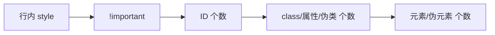
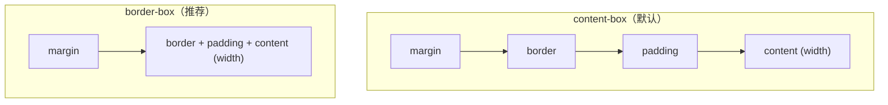
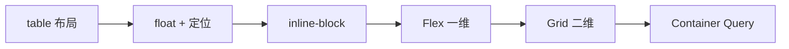

# CSS 核心知识点详解

> 本文档位于 `知识库/前端/基础语言层/CSS/`，系统梳理 CSS3 从选择器、盒模型、布局体系到动画与响应式的核心内容，配合 Mermaid 图与代码示例辅助理解。建议结合同目录 `HTML/核心知识点详解.md` 阅读。
>
> 适合已掌握 HTML 基础、希望系统建立 CSS 工程化与面试视角的同学。所有代码可直接放入 `<style>` 验证。

---

## 一、CSS 引入与优先级

### 1.1 三种引入方式

| 方式 | 写法 | 优先级 | 适用场景 |
|---|---|---|---|
| 行内 | `<div style="...">` | 最高（除非 !important） | 极少用，难维护 |
| 内部 | `<style>...</style>` | 同外部 | 单页 demo |
| 外部 | `<link rel="stylesheet">` | 同内部 | 生产推荐 |

### 1.2 优先级计算（特异性 Specificity）



<!-- -->

口诀 `(a, b, c, d)`：

- `a` = 是否行内（0 或 1）
- `b` = ID 选择器个数
- `c` = class / 属性 / 伪类个数
- `d` = 元素 / 伪元素个数

从左到右逐位比较，左边大的胜出。

```css
#nav .item a { }      /* (0,1,1,1) 胜出 */
.list .item a { }     /* (0,0,2,1) */
a { }                 /* (0,0,0,1) */
```

> `!important` 是核武器：能不用就不用。一旦用开，后面只能用更多 `!important` 去覆盖，工程失控。

### 1.3 来源与层叠顺序

同一规则不同来源时的优先级（从高到低）：

1. 用户样式表中的 `!important`
2. 作者样式表（你写的 CSS）中的 `!important`
3. 作者样式表普通规则
4. 用户样式表普通规则
5. 浏览器默认样式（user agent）

---

## 二、选择器

### 2.1 基础与组合

| 选择器 | 含义 |
|---|---|
| `*` | 通用 |
| `div` | 标签 |
| `.box` | class |
| `#nav` | id |
| `a, b` | 并集 |
| `a b` | 后代（任意层级） |
| `a > b` | 直接子代 |
| `a + b` | 相邻兄弟（同父下一个 b） |
| `a ~ b` | 通用兄弟（同父后续所有 b） |

### 2.2 伪类（状态）

| 伪类 | 触发条件 |
|---|---|
| `:hover` | 鼠标悬停 |
| `:focus` | 获得焦点 |
| `:focus-within` | 自己或后代获焦 |
| `:active` | 鼠标按下 |
| `:checked` | 表单选中 |
| `:disabled` | 禁用 |
| `:nth-child(n)` | 第 n 个子元素 |
| `:nth-of-type(n)` | 同类型第 n 个 |
| `:first-child` / `:last-child` | 首/末 |
| `:not(...)` | 取反 |
| `:is(...)` / `:where(...)` | 分组匹配 |
| `:has(...)` | 父选择（2023+） |

`:is` 与 `:where` 区别：`:is` 参与特异性计算（取参数中最高），`:where` 特异性恒为 0，便于写"可被轻易覆盖"的基础样式。

```css
:is(header, main, aside) a { color: blue; }   /* 特异性 = a 的特异性 */
:where(header, main, aside) a { color: blue; } /* 特异性 = 0 */
```

### 2.3 伪元素（虚拟节点）

```css
.box::before { content: ""; }   /* 在元素内容前插一个虚拟节点 */
.box::after  { content: ""; }   /* 在内容后 */
.box::first-letter { }          /* 首字母 */
.box::selection { }             /* 选中文字 */
```

伪元素必须有 `content` 属性才能显示（哪怕是空字符串）。

### 2.4 属性选择器

```css
[type="text"] { }            /* 精确 */
[href^="https"] { }           /* 开头 */
[href$=".pdf"] { }           /* 结尾 */
[class*="card"] { }          /* 包含 */
```

---

## 三、盒模型

### 3.1 两种盒模型



<!-- -->

```css
/* 全局推荐 */
*, *::before, *::after { box-sizing: border-box; }
```

- `content-box`：`width` 只算内容区，加 padding/border 会让盒子变大，布局易错位。
- `border-box`：`width` 包含 content+padding+border，所见即所得，尺寸好控制。

### 3.3 块级 / 行内 / 行内块

| 类型 | 换行 | 设宽高 | 典型 |
|---|---|---|---|
| 块级 block | 独占一行 | 可设 | div/p/h1 |
| 行内 inline | 不换行 | 不可设 | span/a |
| 行内块 inline-block | 不换行 | 可设 | img/button |
| 弹性 flex | 看父 display | — | 容器 |

行内元素设宽高无效，但 padding 上下会"撑开"却不影响布局（视觉溢出）。

### 3.4 margin 合并

相邻块级元素上下 margin 会合并（取大值），常见坑：

- 父子间：父无 border/padding/overflow 时，子的 margin-top 会"穿透"到父外。
- 解决方案：父加 `overflow: hidden` / `padding-top: 1px` / `display: flow-root`（推荐）。

### 3.5 BFC（块级格式化上下文）

BFC 是一块独立渲染区域，内部元素不影响外部。触发条件：

- `overflow` 不为 `visible`
- `float` 不为 `none`
- `display: flow-root` / `flex` / `grid` / `inline-block` / `table-cell`
- `position: absolute` / `fixed`

应用：清除浮动、阻止 margin 合并、阻止文字环绕浮动元素。

---

## 四、布局体系

### 4.1 布局演进



<!-- -->

现在主流：**Flex 处理一维线性排列，Grid 处理二维网格，定位处理脱离文档流。** float 已退居只做文字环绕。

### 4.2 Flex 布局

```css
.parent {
  display: flex;
  justify-content: space-between;  /* 主轴对齐 */
  align-items: center;            /* 交叉轴对齐 */
  gap: 16px;
  flex-wrap: wrap;
}
.child { flex: 1; }   /* = flex: 1 1 0%，等分剩余空间 */
```

容器属性：

| 属性 | 作用 |
|---|---|
| `flex-direction` | row / column |
| `justify-content` | 主轴对齐 |
| `align-items` | 交叉轴对齐 |
| `flex-wrap` | 是否换行 |
| `gap` | 项之间间距（替代 margin 拼接） |

子项属性：

| 属性 | 作用 |
|---|---|
| `flex-grow` | 剩余空间分配比 |
| `flex-shrink` | 空间不足时的压缩比 |
| `flex-basis` | 基础尺寸 |
| `order` | 视觉顺序 |
| `align-self` | 单独对齐 |

`flex: 1` 等价 `1 1 0%`；`flex: none` 等价 `0 0 auto`（不伸不缩）。

> Flex 的 `justify-content` 在主轴，`align-items` 在交叉轴——方向取决于 `flex-direction`，不是固定水平/垂直。

### 4.3 Grid 布局

```css
.grid {
  display: grid;
  grid-template-columns: repeat(3, 1fr);
  grid-template-rows: 80px auto;
  gap: 16px;
}
.item { grid-column: 1 / 3; }   /* 跨 1~3 列 */
```

常用：

- `repeat(3, 1fr)`：3 等分。
- `minmax(200px, 1fr)`：最小 200 最大 1 份。
- `auto-fit` + `minmax`：响应式无媒体查询自动排列。

```css
grid-template-columns: repeat(auto-fit, minmax(240px, 1fr));
```

### 4.4 定位 position

| 值 | 参考系 | 脱离文档流 |
|---|---|---|
| `static` | 默认 | 否 |
| `relative` | 自身原位置 | 否 |
| `absolute` | 最近非 static 祖先 | 是 |
| `fixed` | 视口 | 是 |
| `sticky` | 滚动到阈值前 relative，到后变 fixed | 否 |

`sticky` 是吸顶/吸底利器：

```css
.header { position: sticky; top: 0; }
```

注意：父级若有 `overflow: hidden` 会"提前释放"sticky，常见坑。

### 4.5 居中方案速查

```css
/* 1. Flex 万能 */
.parent { display: flex; justify-content: center; align-items: center; }

/* 2. Grid 简写 */
.parent { display: grid; place-items: center; }

/* 3. 绝对定位 + transform（不知子尺寸） */
.child { position: absolute; top: 50%; left: 50%; transform: translate(-50%, -50%); }

/* 4. 绝对定位 + margin auto（已知尺寸） */
.child { position: absolute; inset: 0; margin: auto; width: 100px; height: 100px; }
```

---

## 五、文本与字体

```css
.text {
  font-family: -apple-system, "PingFang SC", "Microsoft YaHei", sans-serif;
  font-size: 16px;
  font-weight: 500;
  line-height: 1.5;
  letter-spacing: 0.02em;
  text-align: justify;
  text-decoration: underline;
  text-indent: 2em;
  white-space: nowrap;      /* 不换行 */
  text-overflow: ellipsis; /* 配合 overflow: hidden 截断 */
  word-break: break-all;   /* 长串英文强制断行 */
}
```

### 5.1 单行/多行截断

```css
/* 单行 */
.ellipsis { white-space: nowrap; overflow: hidden; text-overflow: ellipsis; }

/* 多行（2 行） */
.lines-2 {
  display: -webkit-box;
  -webkit-line-clamp: 2;
  -webkit-box-orient: vertical;
  overflow: hidden;
}
```

### 5.2 字体栈建议

```css
font-family: system-ui, -apple-system, "Segoe UI", "PingFang SC",
             "Microsoft YaHei", "Helvetica Neue", sans-serif;
```

`system-ui` 让各平台用自身系统字体，渲染最清晰、零下载。

---

## 六、颜色与背景

```css
.box {
  color: #1a1a1f;
  background: #fff url(bg.jpg) no-repeat center / cover;
  /* background 简写：颜色 图像 重复 位置 / 尺寸 */
  opacity: 0.8;              /* 整体（含子元素）透明 */
}
.box { background: rgba(0,0,0,0.5); }  /* 仅背景透明 */
```

### 6.1 渐变

```css
.linear { background: linear-gradient(135deg, #6366f1 0%, #8b5cf6 100%); }
.radial { background: radial-gradient(circle at top, #fff, #000); }
.conic  { background: conic-gradient(#6366f1, #8b5cf6, #6366f1); }
```

### 6.2 现代颜色函数

```css
color: oklch(0.6 0.2 270);            /* 感知均匀，调色更自然 */
color: color-mix(in srgb, #6366f1 50%, white);  /* 颜色混合 */
color: hsl(245 70% 60% / 0.8);         /* HSL 带透明度 */
```

---

## 七、变换、过渡、动画

### 7.1 transform 变换

```css
.box {
  transform: translate(20px, 10px) rotate(45deg) scale(1.2) skew(10deg);
  transform-origin: top left;
}
```

transform 不触发布局，GPU 合成层加速，性能优于改 top/left。

### 7.2 transition 过渡

```css
.btn {
  transition: background 0.3s ease, transform 0.2s;
}
.btn:hover { background: #6366f1; transform: translateY(-2px); }
```

`transition` 必须写在**起始状态**元素上，否则 hover 进入有过渡、移出没有。

### 7.3 keyframes 动画

```css
@keyframes spin {
  from { transform: rotate(0deg); }
  to   { transform: rotate(360deg); }
}
.loader { animation: spin 1s linear infinite; }
```

```css
.loader {
  animation: spin 1s linear infinite;
}
@media (prefers-reduced-motion: reduce) {
  .loader { animation: none; }  /* 尊重用户减少动效偏好 */
}
```

### 7.4 性能要点

- 优先改 `transform` / `opacity`，二者走合成器线程不触发布局。
- 避免动画 `width/height/top/left/margin`，触发回流。
- 频繁动画元素给 `will-change: transform`，但不要常驻。

---

## 八、响应式设计

### 8.1 媒体查询

```css
/* 视口 >= 768px 时应用 */
@media (min-width: 768px) { .grid { grid-template-columns: 1fr 1fr; } }

/* 移动优先：默认小屏，逐步增强 */
.card { padding: 12px; }
@media (min-width: 768px)  { .card { padding: 20px; } }
@media (min-width: 1200px) { .card { padding: 32px; } }
```

### 8.2 单位选择

| 单位 | 含义 | 用法 |
|---|---|---|
| `px` | 绝对像素 | 边框、固定图标 |
| `%` | 相对父级 | 流式布局 |
| `em` | 相对父字号 | 谨慎，易乘积放大 |
| `rem` | 相对根字号 | 排版首选 |
| `vw` / `vh` | 视口宽/高 1% | 全屏布局 |
| `vmin` / `vmax` | 视口较小/较大边 | 横竖屏适配 |
| `clamp(min, val, max)` | 限制范围 | 流体字号 |

```css
h1 { font-size: clamp(1.5rem, 4vw, 2.5rem); }  /* 自适应但有上下限 */
```

### 8.3 容器查询（2023+）

```css
.card-container { container-type: inline-size; }
@container (min-width: 400px) {
  .card { display: grid; grid-template-columns: 1fr 2fr; }
}
```

与媒体查询区别：组件**根据自身容器**而非视口适配，真正实现组件级响应式。

### 8.4 移动适配要点

- viewport meta 写好（HTML 已讲）。
- 触摸目标 ≥ 44×44px（Apple HIG）。
- `:hover` 在触屏会"粘连"，用 `@media (hover: hover)` 限定。
- 安全区域：`padding: env(safe-area-inset-bottom)`。

---

## 九、CSS 变量与函数

### 9.1 自定义属性

```css
:root {
  --brand: #6366f1;
  --radius: 8px;
}
.btn {
  background: var(--brand);
  border-radius: var(--radius, 4px);  /* 带默认值 */
}
```

特点：

- 可继承、可被 JS 读写（`getComputedStyle` / `style.setProperty`）。
- 主题切换：改 `:root` 变量即全局换肤。

```css
:root[data-theme="dark"] {
  --brand: #a5b4fc;
  --bg: #18181b;
}
```

### 9.2 常用函数

| 函数 | 用途 |
|---|---|
| `calc(a + b)` | 运算 |
| `var(--x, fallback)` | 取变量 |
| `min(...)` / `max(...)` | 取最小/最大 |
| `clamp(min, v, max)` | 钳制 |
| `color-mix(...)` | 颜色混合 |
| `attr(name)` | 取 HTML 属性（仅 content 中稳定支持） |

```css
.aside { width: calc(100% - 200px); }
```

---

## 十、现代特性速览

| 特性 | 说明 |
|---|---|
| `:has(...)` | 父选择器，能根据子元素状态选父 |
| Container Query | 组件级响应式 |
| `@layer` | 显式层叠层，控制来源优先级 |
| Subgrid | 子网格继承父网格轨道 |
| `:user-valid` / `:user-invalid` | 用户交互后的校验状态 |
| Nesting 原生嵌套 | `& .child {}` 直接写在父规则里 |
| `accent-color` | 表单控件主题色 |
| `aspect-ratio` | 容器固定宽高比 |

```css
/* 原生嵌套 */
.card {
  padding: 16px;
  & .title { font-weight: 600; }
  &:hover { box-shadow: 0 4px 12px rgba(0,0,0,.1); }
}

/* :has 用例：表单必填时给 label 加红 */
label:has(+ input:required)::after { content: "*"; color: red; }
```

---

## 十一、预处理器与现代工程

### 11.1 Sass / Less / Stylus

提供变量、嵌套、mixin、继承，编译成普通 CSS：

```scss
$brand: #6366f1;
.btn {
  background: $brand;
  &:hover { background: darken($brand, 10%); }
  @include rounded;
}
```

现代 CSS 已有变量与原生嵌套，简单项目可不依赖预处理器；大型项目仍用 Sass 做工程化（mixin 复用、partial 拆分）。

### 11.2 命名方法论

| 方法 | 风格 | 优缺点 |
|---|---|---|
| BEM | `.block__elem--mod` | 长但清晰，无冲突 |
| OOCSS | 结构与皮肤分离 | 抽象成本高 |
| SMACSS | 按分类组织 | 适合大项目 |
| Utility-first | Tailwind/原子类 | 极致复用，类名长 |

```html
<!-- BEM 示例 -->
<div class="card card--featured">
  <h2 class="card__title">标题</h2>
  <button class="card__action">按钮</button>
</div>
```

### 11.3 工程化要点

- 用 PostCSS 自动加前缀（`autoprefixer`），别手写 `-webkit-`。
- CSS Modules / CSS-in-JS 解决全局污染，组件作用域隔离。
- Critical CSS 内联首屏，其余异步加载。

---

## 十二、最佳实践 Checklist

### 12.1 布局

- 全局 `box-sizing: border-box`。
- 优先 Flex / Grid，少用 float（仅文字环绕）。
- 不用 `table` 布局。
- 用 `gap` 替代 margin 拼接间距。

### 12.2 选择器

- 不滥用 ID 选择器（特异性高难覆盖）。
- 不滥用 `!important`。
- 避免深层嵌套（`.a .b .c .d`），≤3 层。
- 用 `:where()` 写可被覆盖的基础样式。

### 12.3 性能

- 动画用 `transform` / `opacity`。
- 大列表加 `content-visibility: auto`。
- 图片用 webp + 合理尺寸。
- 避免空 `@import`（串行加载）。

### 12.4 主题与可访问

- 颜色用变量统一管理。
- 暗色主题用 `prefers-color-scheme`。
- 对比度 ≥ 4.5:1。
- 动效尊重 `prefers-reduced-motion`。
- 焦点样式不删（`:focus-visible`）。

---

## 十三、高频面试要点

1. **CSS 盒模型？** content-box（默认）与 border-box，差别是 width 是否含 padding/border，生产用 border-box。
2. **选择器优先级？** 行内 > ID > class/属性/伪类 > 元素/伪元素，同优先级后写胜出，`!important` 凌驾之上。
3. **BFC 是什么？触发条件？** 块级格式化上下文，独立渲染区，内部不影响外部。触发：overflow 非 visible / float / display flex/grid 等。用途：清浮动、阻 margin 合并、阻环绕。
4. **Flex 1 等价什么？** `flex: 1 1 0%`，flex-grow 1 / flex-shrink 1 / flex-basis 0%。剩余空间按 grow 等分。
5. **居中方案？** Flex `justify-content/align-items`、Grid `place-items`、绝对定位 + transform、绝对定位 + margin auto（已知尺寸）。
6. **transition vs animation？** transition 需触发（hover 等）两态过渡；animation 用 @keyframes 自驱，可循环。
7. **回流 vs 重绘？** 改几何（width/top/margin）触发回流，重新布局；改外观（color/visibility）触发重绘，不布局。回流一定伴随重绘。改 transform/opacity 走合成层，两者都不触发。
8. **em vs rem？** em 相对父字号，嵌套会乘积放大；rem 相对根字号，统一可控，排版首选。
9. **响应式有哪些手段？** 媒体查询、容器查询、vw/vh/clamp、auto-fit grid、`<picture>` 响应式图片。
10. **CSS 变量与 Sass 变量区别？** CSS 变量是运行时值，可继承可被 JS 改；Sass 变量是编译时替换，编译后消失。前者适合主题切换，后者适合编译期常量。
11. **如何实现暗色主题？** `:root[data-theme="dark"]` 切换 CSS 变量 + `prefers-color-scheme` 自动跟随系统。
12. **清除浮动的方法？** 父加 `display: flow-root`（推荐）/ `overflow: hidden` / 末尾 `::after { content: ""; display: block; clear: both; }`。

---

## 十四、一句话总纲

> CSS 的本质是**按优先级给元素套样式**：会选（选择器）、会排（盒模型 + 布局）、会动（变换动画）、会适配（响应式）。布局问题先问"用 Flex 还是 Grid"，性能问题先问"是否触发了回流"。
