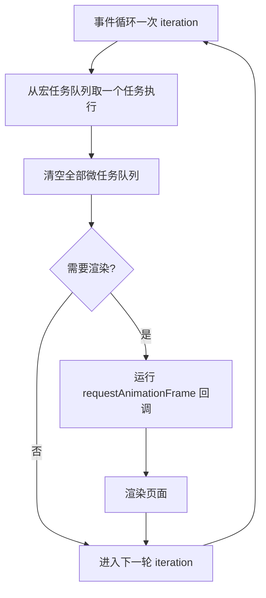
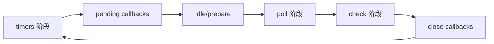

# 事件循环专题

> 本文档位于 `知识库/前端/基础语言层/JavaScript/`，是事件循环的深化专题。配套的概览章节见《核心知识点详解.md》第八章、《常见面试题与最佳实践.md》第四章。
>
> 本文从规范、调用栈、宏/微/渲染三大任务源、`await` 调度细节、浏览器与 Node 差异、实战陷阱到手写调度器逐层展开。读完应能解释清楚任意 `setTimeout` / `Promise` / `await` 输出题，并能在工程中主动规避"卡 UI"、"批处理失效"等问题。

---

## 一、先纠正一个根本误区

很多人说"事件循环是 JavaScript 的机制"——**错**。

事件循环是**宿主环境**（浏览器 / Node.js / Deno）的机制，不是 V8 / SpiderMonkey 引擎本身的。引擎只负责执行调用栈上的代码，"什么时候把回调塞回调用栈"由宿主决定。


<!-- -->

推论：

- 同一段 JS 代码在浏览器和 Node 里的事件循环行为**不完全一致**（见第六章）。
- Worker / iframe 各有独立的事件循环，互不干扰。

---

## 二、调用栈与执行上下文

### 2.1 调用栈（Call Stack）

调用栈是 LIFO 的栈结构，记录"当前执行到哪个函数"。

```js
function a() { b(); }
function b() { throw new Error("x"); }
a();
// Error 报错栈：b → a → 全局
```

JS 主线程**只有一个调用栈**，所以"同步代码"必须等栈空了才能切到下一个任务。这就是"长任务卡 UI"的根因。

### 2.2 执行上下文栈

每进一个函数就 push 一个执行上下文，退出就 pop。执行上下文分三类：

- **全局执行上下文**：程序启动时创建，整个生命周期唯一。
- **函数执行上下文**：每次调用函数创建。
- **eval 执行上下文**：`eval` 内代码（不用）。

每个执行上下文包含：

- **词法环境**（LexicalEnvironment）：管 `let/const`，含 TDZ。
- **变量环境**（VariableEnvironment）：管 `var`、函数声明。
- **this 绑定**。

> 这就是为什么 `let` 在 TDZ 抛错而 `var` 不抛——它们存在不同的环境记录里。

### 2.3 栈溢出

递归无终止条件会 Stack Overflow：

```js
function f() { f(); }
f();  // RangeError: Maximum call stack size exceeded
```

V8 默认栈大小约 1MB，深度约 1 万层。深递归改用循环 + 自己维护栈，或用蹦床函数（trampoline）。

---

## 三、宏任务、微任务、渲染——三大任务源

### 3.1 任务源分类



<!-- -->

三个任务源：

| 任务源 | 触发时机 | 典型 |
|---|---|---|
| 宏任务 | 事件循环每轮取一个 | setTimeout / setInterval / I/O / UI 事件 / postMessage |
| 微任务 | 每个宏任务后清空全部 | Promise.then / queueMicrotask / MutationObserver |
| 渲染 | 浏览器按需（~60fps） | requestAnimationFrame / 实际绘制 |

### 3.2 微任务的本质：在"同一个任务"里

理解微任务的钥匙：**微任务在当前宏任务结束、下一个宏任务开始前清空**。它本质上是"当前任务的收尾工作"，不是新任务。

推论：

- 微任务里再产生微任务，会在本轮清空阶段继续执行（**可能造成无限循环卡死**）。
- 微任务里改 DOM，浏览器**还没渲染**，所以连续读 offsetHeight 不会触发布局抖动到下一帧——但也意味着用户看不到中间状态。

```js
document.body.style.background = "red";
Promise.resolve().then(() => {
  document.body.style.background = "blue";  // 用户根本看不到红色
});
```

### 3.3 渲染时机的真实规则

不是每轮事件循环都渲染。浏览器策略：

- 屏幕刷新率（通常 60Hz，每帧 ~16.67ms）决定渲染节奏。
- 如果当前帧时间还有剩，跳过渲染进下一轮。
- 如果连续多帧没渲染（任务太重），用户看到"掉帧"。

`requestAnimationFrame` 回调在"决定要渲染这一帧后、实际绘制前"执行，是动画的最佳时机。

`requestIdleCallback` 在"渲染完后还剩空闲时间"执行，用于低优先任务（如预取数据）。它的回调带 `deadline` 参数告诉你剩多少时间。

```js
requestIdleCallback((deadline) => {
  while (deadline.timeRemaining() > 0 && tasks.length) {
    tasks.pop()();
  }
});
```

### 3.4 宏任务队列不止一个

HTML 规范允许多个宏任务队列，按"任务源"分类。浏览器实现里通常合并成一个，但**不同源的优先级可能不同**：

- 用户交互（click/scroll）通常优先级高，保证响应。
- 网络回调（fetch 完成）次之。
- 计时器（setTimeout）通常最低。

实践中不要依赖"同源任务"的顺序，只依赖"宏任务之间必夹清空微任务"这条铁律。

---

## 四、经典输出题（深化版）

### 4.1 基础题：1 4 3 2

```js
console.log(1);
setTimeout(() => console.log(2), 0);
Promise.resolve().then(() => console.log(3));
console.log(4);
// 输出：1 4 3 2
```

执行：同步 1 → 同步 4 → 同步栈空 → 清微任务 3 → 取一个宏任务 2。

### 4.2 微任务嵌套：清空顺序

```js
Promise.resolve().then(() => {
  console.log("A");
  Promise.resolve().then(() => console.log("B"));
});
Promise.resolve().then(() => console.log("C"));
// 输出：A C B
```

A 进微队列先执行，执行时 push 了 B，但 B 排在 C 之后（C 已经在队列里）。清空顺序按入队顺序 FIFO。

### 4.3 async/await 输出

```js
async function a() {
  console.log("a start");
  await b();
  console.log("a end");      // 这行相当于 .then 回调，进微任务
}
async function b() {
  console.log("b");
}
console.log("script start");
a();
console.log("script end");
// 输出：script start → a start → b → script end → a end
```

`await b()` 暂停 a，`b()` 同步执行完，`await` 之后的代码 `a end` 进微任务。同步栈继续走 `script end`，再清微任务 `a end`。

### 4.4 await 一个非 Promise 值

```js
async function f() {
  console.log(1);
  await 42;            // 非 Promise
  console.log(2);
}
f();
console.log(3);
// 输出：1 3 2
```

`await 42` 等价 `await Promise.resolve(42)`，依然让后续代码进微任务。**任何 await 都会切出微任务**，无论等待的是不是 Promise。

### 4.5 多个 setTimeout(0) 顺序

```js
setTimeout(() => console.log("A"), 0);
setTimeout(() => console.log("B"), 0);
Promise.resolve().then(() => console.log("C"));
// 输出：C A B
```

A、B 两个宏任务按入队顺序执行，但中间夹一次微任务清空。实际输出：C（微任务）→ A（第一个宏任务）→ 清微任务（空）→ B。

### 4.6 陷阱：微任务中产生宏任务

```js
setTimeout(() => console.log("T1"), 0);
Promise.resolve().then(() => {
  console.log("P1");
  setTimeout(() => console.log("T2"), 0);
});
Promise.resolve().then(() => console.log("P2"));
// 输出：P1 P2 T1 T2
```

P1、P2 是同一轮清空的微任务。T2 是在 P1 执行时入队的**新宏任务**，排在 T1 之后（T1 已入队在前）。

### 4.7 综合大题

```js
console.log("1");
setTimeout(() => console.log("2"), 0);
async function async1() {
  console.log("3");
  await async2();
  console.log("4");
}
async function async2() {
  console.log("5");
}
async1();
new Promise((resolve) => {
  console.log("6");
  resolve();
}).then(() => console.log("7"));
console.log("8");
// 输出：1 3 5 6 8 4 7 2
```

拆解：

- 同步：1 → 进 async1 同步 3 → await async2 同步 5 → async1 暂停（4 进微队列）→ new Promise 同步 6 → resolve → .then(7) 入微队列 → 同步 8
- 微任务清空：4 → 7
- 宏任务：2

---

## 五、await 的微任务调度细节

### 5.1 await x 到底等价于什么

近似等价：

```js
async function f() {
  const v = await x;
  // 后续代码
}

// 近似于
function f() {
  return Promise.resolve(x).then((v) => {
    /* 后续代码 */
  });
}
```

`await` 暂停函数，把后续代码包成一个微任务回调。

### 5.2 await thenable 对象

```js
const thenable = {
  then(resolve) {
    console.log("then 调用");
    resolve("value");
  },
};
async function f() {
  const v = await thenable;
  console.log(v);
}
f();
console.log("end");
// 输出：then 调用 → end → value
```

`await thenable` 会调用其 `then` 方法，相当于包了一层 `Promise.resolve(thenable)`。

### 5.3 V8 的历史优化

老版 V8（2017 前）await 会插入**两次**微任务（先 resolve 再 then），后来规范简化为一次，性能更优。所以同一段代码在不同浏览器版本输出顺序曾不一样——但**只在 await Promise 已经 resolve 的情况下**有差异，普通场景不受影响。

现代浏览器已统一为一次微任务，可以放心按一次计算。

### 5.4 陷阱：await 中 try/catch

```js
async function f() {
  try {
    await Promise.reject("err");
    console.log("不会执行");
  } catch (e) {
    console.log(e);  // "err"
  }
}
f();
```

await 拒绝会变成 throw，被外层 try/catch 捕获。等价于：

```js
Promise.reject("err").then(v => console.log(v)).catch(e => console.log(e));
```

---

## 六、Node.js 事件循环（与浏览器差异）

### 6.1 六个阶段

Node 的事件循环分六个阶段，每轮依次经过：



<!-- -->

| 阶段 | 执行什么 |
|---|---|
| timers | `setTimeout` / `setInterval` 到期回调 |
| pending callbacks | 系统级回调（TCP errno） |
| idle / prepare | 内部使用 |
| poll | I/O 事件（fs、net）、取新 I/O 回调 |
| check | `setImmediate` 回调 |
| close callbacks | `close` 事件（socket.on('close')) |

### 6.2 微任务在 Node 中的位置

**Node 11 之前**：每个阶段结束后才清空微任务（与浏览器不同！）。
**Node 11 之后**：与浏览器对齐——**每个宏任务执行完立刻清空微任务**。

所以现代 Node 与浏览器的行为基本一致，仅在极少数边界情况（同阶段多个 setTimeout）还有差异。

### 6.3 process.nextTick 优先级

```js
Promise.resolve().then(() => console.log("micro"));
process.nextTick(() => console.log("nextTick"));
// 输出：nextTick micro
```

`process.nextTick` 是 Node 独有的微任务，优先级**高于** Promise.then。它本质不是事件循环的一部分，而是在每个阶段切换前清空。**滥用会饿死 I/O**（永远轮不到 poll 阶段）。

### 6.4 setImmediate vs setTimeout(0)

```js
setTimeout(() => console.log("T"), 0);
setImmediate(() => console.log("I"));
// 顺序不定（取决于进入循环时 timers 阶段时机）
```

但在 I/O 回调里：

```js
fs.readFile("file", () => {
  setTimeout(() => console.log("T"), 0);
  setImmediate(() => console.log("I"));
});
// 总是 I 先于 T（因为已经在 check 阶段附近）
```

记忆：`setImmediate` 是 check 阶段，`setTimeout` 是 timers 阶段，I/O 回调后下一站是 check，所以 I 先。

### 6.5 浏览器与 Node 对照表

| 特性 | 浏览器 | Node |
|---|---|---|
| 宏任务执行后清微任务 | 是 | 11+ 是，旧版否 |
| 微任务优先级 | Promise 同级 | nextTick > Promise |
| setImmediate | 无原生（polyfill） | check 阶段 |
| process.nextTick | 无 | 独立最高 |

---

## 七、实战陷阱与应用

### 7.1 长任务卡 UI

任何同步代码超过 ~50ms 就会卡 UI（用户感知到点击无响应）。

```js
// 坏：100 万次同步循环
for (let i = 0; i < 1e6; i++) doSomething();

// 好：分块到多帧
function chunked(tasks) {
  if (tasks.length === 0) return;
  const start = performance.now();
  while (tasks.length && performance.now() - start < 16) {
    tasks.pop()();
  }
  requestIdleCallback(() => chunked(tasks));
}
```

### 7.2 微任务死循环

```js
function loop() {
  Promise.resolve().then(loop);
}
loop();
// 页面卡死，因为微任务永远清不完，下一个宏任务（含渲染）永远轮不到
```

微任务里持续产生微任务会饿死所有宏任务——这是为什么不能用微任务做轮询动画。

### 7.3 用 rAF 做动画而不是 setTimeout

```js
// 坏：可能掉帧或过度渲染
setInterval(animate, 16);

// 好：跟随屏幕刷新率
function animate() {
  update();
  requestAnimationFrame(animate);
}
requestAnimationFrame(animate);
```

`requestAnimationFrame` 在渲染前调用，与屏幕刷新同步，不会过度计算。

### 7.4 批量更新与 nextTick

Vue 的 `nextTick` 本质是把多次数据变化合并到一次 DOM 更新（一个微任务后执行）：

```js
this.a = 1;
this.b = 2;
// 不立即更新 DOM，而是注册一个微任务在下次清空时统一更新
this.$nextTick(() => {
  console.log("DOM 已更新");
});
```

React 的 batching 类似——多次 setState 合并为一次重渲染。

理解事件循环才能看懂这些框架"为什么这么设计"。

### 7.5 Promise 链与错误吞噬

```js
Promise.resolve()
  .then(() => { throw new Error("A"); })  // 抛错
  .then(() => console.log("B"));           // 不执行，但错误"漂"到下一个 .then
// 未捕获的 rejection → unhandledrejection 事件
```

链中任何 then 抛错会跳过中间 then，被最近的 catch 捕获。**没有 catch 就报 unhandledrejection**。

### 7.6 状态读取触发布局抖动

```js
// 坏：交替读写布局属性，强制同步布局
for (const el of elements) {
  el.style.height = el.offsetHeight + 10 + "px";  // 每次读都触发回流
}

// 好：先全读后全写
const heights = elements.map(e => e.offsetHeight);
elements.forEach((e, i) => (e.style.height = heights[i] + 10 + "px"));
```

读写交替会触发"布局抖动"（layout thrashing），性能比单次回流差 N 倍。

---

## 八、手写与场景

### 8.1 实现 nextTick（浏览器版）

```js
const nextTick = (() => {
  // 优先 MessageChannel > Promise > setTimeout
  if (typeof MessageChannel !== "undefined") {
    const ch = new MessageChannel();
    const queue = [];
    ch.port1.onmessage = () => {
      const tasks = queue.splice(0);
      tasks.forEach(fn => fn());
    };
    return (fn) => {
      queue.push(fn);
      ch.port2.postMessage(null);
    };
  }
  if (typeof Promise !== "undefined") {
    return (fn) => Promise.resolve().then(fn);
  }
  return (fn) => setTimeout(fn, 0);
})();
```

Vue 3 实现思路类似——优先用更接近"宏任务但比 setTimeout 快"的机制。

### 8.2 实现任务调度器（按优先级）

```js
class Scheduler {
  constructor() {
    this.microtasks = [];
    this.macrotasks = [];
    this.running = false;
  }
  micro(fn) { this.microtasks.push(fn); this.flush(); }
  macro(fn) { this.macrotasks.push(fn); this.flush(); }
  flush() {
    if (this.running) return;
    this.running = true;
    Promise.resolve().then(() => this.drain());
  }
  drain() {
    while (this.microtasks.length) this.microtasks.shift()();
    if (this.macrotasks.length) {
      this.macrotasks.shift()();
      Promise.resolve().then(() => this.drain());
    } else {
      this.running = false;
    }
  }
}
```

模拟了"宏任务间清微任务"的核心规则。

### 8.3 模拟事件循环输出

给定一组任务，模拟执行顺序：

```js
function simulateEventLoop(tasks) {
  const output = [];
  const microQueue = [];
  const macroQueue = [...tasks];
  while (macroQueue.length) {
    macroQueue.shift()(microQueue);  // 宏任务可能往微队列塞任务
    while (microQueue.length) microQueue.shift()();
  }
  return output;
}
```

实际事件循环远比这复杂，但这个模型足以预测 90% 的输出题。

### 8.4 实现可取消的 setTimeout

```js
function cancellableTimeout(fn, ms) {
  let timer = setTimeout(fn, ms);
  return () => clearTimeout(timer);
}
const cancel = cancellableTimeout(() => console.log("hi"), 1000);
cancel();  // 取消，不执行
```

### 8.5 实现 Promise 超时

```js
function withTimeout(promise, ms) {
  const timeout = new Promise((_, reject) =>
    setTimeout(() => reject(new Error("timeout")), ms)
  );
  return Promise.race([promise, timeout]);
}
await withTimeout(fetch(url), 3000);
```

`Promise.race` 是事件循环"第一个完成即结束"特性的标准应用。

---

## 九、最佳实践 Checklist

### 9.1 同步代码

- 单次同步执行不超过 50ms，否则分块
- 深递归改循环，避免栈溢出
- 长任务用 `requestIdleCallback` 拆分

### 9.2 微任务

- 微任务里不再产生持续微任务（避免死循环）
- 不依赖"微任务里改 DOM 用户能看到"——渲染还没发生
- 批量更新用 `queueMicrotask` 或 `Promise.resolve().then` 合并

### 9.3 宏任务

- 高频事件（scroll/resize/input）用节流而非 setTimeout
- 动画用 `requestAnimationFrame` 而非 `setInterval`
- setTimeout(fn, 0) 实际最小 4ms（嵌套 5 次后），不要假设精确 0ms

### 9.4 异步与错误

- fetch 配 AbortController 支持取消
- Promise 链尾必须有 catch，避免 unhandledrejection
- 全局监听 `unhandledrejection` 兜底

### 9.5 性能

- 避免布局抖动（先读后写，不交替）
- 大列表用虚拟滚动 + `content-visibility: auto`
- 用 `performance.now()` 测量，不靠 Date.now()

---

## 十、面试高频要点

1. **事件循环是谁的机制？** 宿主环境（浏览器/Node），不是 V8 引擎本身。引擎只管调用栈，调度由宿主负责。
2. **宏任务 vs 微任务？** 微任务在每个宏任务后清空全部；宏任务每轮只取一个。微任务本质是当前任务的收尾。
3. **微任务里改 DOM 用户能看到吗？** 不能，渲染还没发生。微任务里改的 DOM 状态在下一帧才可见。
4. **`requestAnimationFrame` 在事件循环哪一步？** 渲染前。浏览器决定要渲染这一帧后、实际绘制前调用。
5. **`requestIdleCallback` 何时执行？** 渲染完后还剩空闲时间。带 `deadline` 参数告诉你剩多少时间。
6. **`await 42` 会切出微任务吗？** 会。任何 await 都让后续代码进微任务，无论等待的是不是 Promise。
7. **Node 与浏览器事件循环最大区别？** Node 有六阶段、有 `process.nextTick`（优先级高于 Promise）、有 `setImmediate`（check 阶段）。Node 11+ 微任务清空时机已对齐浏览器。
8. **`setImmediate` vs `setTimeout(0)` 在 I/O 回调里谁先？** setImmediate 先（I/O 回调后下一站是 check 阶段）。
9. **`setTimeout(fn, 0)` 真的是 0ms 吗？** 不是。HTML 规范下嵌套 5 次后最小 4ms；被后台标签页节流到 1000ms。
10. **为什么不能用微任务做动画？** 微任务会饿死宏任务（含渲染），导致永远不到下一帧，页面卡死。动画必须用 rAF 或宏任务。
11. **微任务死循环会怎样？** 微任务队列永远清不完，下一个宏任务（含 UI 渲染、点击响应）永远轮不到，页面冻结。
12. **`process.nextTick` 滥用会怎样？** 它在每个阶段切换前清空，如果 nextTick 回调里持续 nextTick，永远轮不到 I/O（poll 阶段饿死）。
13. **Vue 的 nextTick 是什么？** 把多次数据变化合并到一次 DOM 更新。本质是注册一个微任务，在下次清空时统一 patch。
14. **布局抖动是什么？** 交替读写布局属性（offsetHeight / style.height），每次读都强制浏览器同步计算布局。修复：先全读后全写。

---

## 十一、一句话总纲

> 事件循环的内核只有一句话：**"同步栈空了就清微任务，清完微任务取一个宏任务，宏任务后又清微任务"——如此循环**。所有输出题都是这条规则的展开，所有"卡 UI"问题都是"主线程被同步代码或微任务死循环霸占"。理解了这一点，再去看 Vue 的 nextTick、React 的 batching、rAF 动画、setTimeout 节流，全是这条规则的应用。
