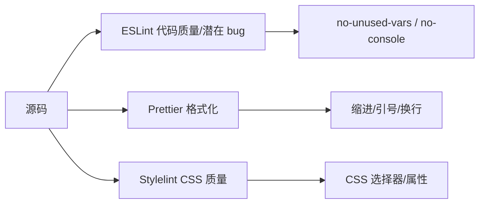
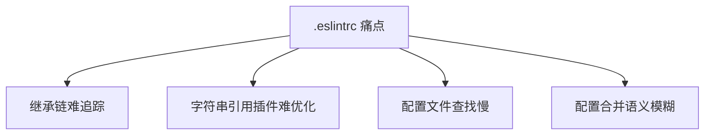
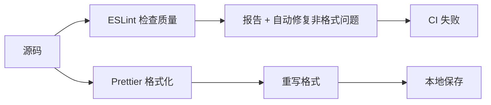
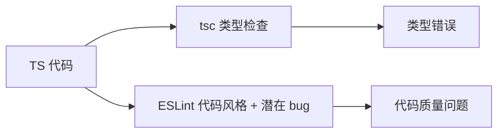

# ESLint 专题 · 核心知识点详解

> 本文档位于 `知识库/前端/工程化与构建/ESLint 专题/`，是 ESLint 的核心知识库。配套面试题见《常见面试题与最佳实践.md》。
>
> 读完应能解释清楚"ESLint 的工作原理""ESLint 9 Flat Config 与 .eslintrc 的区别""ESLint 与 Prettier 怎么分工""如何自定义规则""Monorepo 里怎么共享配置"。

---

## 一、ESLint 是什么

### 1.1 定位

ESLint 是由 Nicholas C. Zakas 创建的**可插拔的 JavaScript/TypeScript 代码检查器（linter）**，定位为"在运行前发现代码问题、强制统一风格"。


<!-- -->

- **Parser**：把源码解析成 AST（抽象语法树）。
- **Rules**：遍历 AST，按规则检查每个节点。
- **Report**：发现问题后报告，可附带 fixer。
- **Formatter**：把问题格式化输出（stylish、json、html）。

### 1.2 设计目标

- **可插拔**：每条规则独立，可单独开关。
- **可配置**：规则等级 `off/warn/error`、配置项自定义。
- **可扩展**：`extends` 继承他人配置。
- **可修复**：自动修复（fix）简单问题（如缩进、引号）。

### 1.3 与 Prettier、Stylelint 的分工



<!-- -->

| 工具 | 关注点 | 示例 |
|---|---|---|
| ESLint | 代码质量、潜在 bug、约定 | `no-unused-vars`、`react-hooks/rules-of-hooks` |
| Prettier | 格式化（纯风格） | 缩进、引号、换行、行宽 |
| Stylelint | CSS 质量 | 选择器、属性、值 |

**关键认知**：ESLint 与 Prettier 有重叠（都管引号、缩进），实际项目用 `eslint-config-prettier` 关闭 ESLint 的格式规则，让 Prettier 接管格式。

---

## 二、核心概念

### 2.1 规则（Rules）

```js
// .eslintrc.js
module.exports = {
  rules: {
    "no-unused-vars": "warn",           // 警告：未使用变量
    "no-console": ["error", { allow: ["warn", "error"] }],  // 报错但允许 warn/error
    "react/jsx-key": "error",           // 报错：React 列表必须有 key
    "semi": ["error", "always"],        // 强制分号
    "@typescript-eslint/no-explicit-any": "warn",  // TS：警告 any
  },
};
```

- **等级**：`"off"`(0) / `"warn"`(1) / `"error"`(2)。
- **配置项**：`["error", { allow: ["warn"] }]`，第二位是配置对象。
- **规则名前缀**：插件规则带插件名前缀（如 `@typescript-eslint/...`、`react/...`）。

### 2.2 配置（Config）

```js
// .eslintrc.js（老格式）
module.exports = {
  root: true,                  // 在此停止向上查找
  env: { browser: true, es2022: true, node: true },  // 全局变量
  parserOptions: { ecmaVersion: 2022, sourceType: "module" },
  extends: ["eslint:recommended", "plugin:react/recommended"],
  plugins: ["react", "@typescript-eslint"],
  rules: { /* ... */ },
  overrides: [
    { files: ["*.test.ts"], rules: { "@typescript-eslint/no-explicit-any": "off" } },
  ],
  ignorePatterns: ["dist/", "node_modules/"],
};
```

```js
// eslint.config.js（v9+ Flat Config）
import js from "@eslint/js";
import tseslint from "typescript-eslint";
import react from "eslint-plugin-react";

export default [
  js.configs.recommended,
  ...tseslint.configs.recommended,
  {
    files: ["**/*.{ts,tsx}"],
    plugins: { react },
    rules: { ...react.configs.recommended.rules },
    languageOptions: {
      parserOptions: { ecmaFeatures: { jsx: true } },
    },
  },
  {
    files: ["**/*.test.ts"],
    rules: { "@typescript-eslint/no-explicit-any": "off" },
  },
  { ignores: ["dist/", "node_modules/"] },
];
```

### 2.3 解析器（Parser）

```js
// .eslintrc.js
module.exports = {
  parser: "@typescript-eslint/parser",  // TS 源码解析器
  parserOptions: {
    ecmaVersion: 2022,
    sourceType: "module",
    ecmaFeatures: { jsx: true },
  },
};
```

```js
// eslint.config.js (Flat)
export default [{
  languageOptions: {
    parser: tseslint.parser,
    parserOptions: { ecmaFeatures: { jsx: true } },
  },
}];
```

- **默认**：Espree（ESLint 自带，支持标准 JS）。
- **TS**：`@typescript-eslint/parser`（支持 TS 语法、类型信息）。
- **JSX/TSX**：parserOptions 配 `ecmaFeatures.jsx: true`。
- **类型感知**：`parserOptions.project` 指定 tsconfig，让规则能读类型（如 `no-floating-promises`）。

### 2.4 插件（Plugins）

```js
// .eslintrc.js
module.exports = {
  plugins: ["react", "@typescript-eslint", "jsx-a11y"],
  extends: ["plugin:react/recommended"],  // 启用插件预设
  rules: {
    "react/jsx-key": "error",  // 用插件名/规则名引用
    "jsx-a11y/alt-text": "error",
  },
};
```

```js
// eslint.config.js (Flat)
import react from "eslint-plugin-react";
export default [
  { plugins: { react } },  // 不再需要先 install 才能 extends
  ...react.configs.flat.recommended,
];
```

插件是一组规则、配置、处理器（processor）的集合。v9 Flat Config 中插件直接 import，无需 `plugins: ["name"]` 字符串引用。

### 2.5 共享配置（Shared Config / extends）

```js
// 共享配置包：eslint-config-airbnb
module.exports = {
  extends: ["airbnb", "airbnb/hooks", "airbnb-typescript"],
};
```

```js
// 自己发布共享配置
// my-eslint-config/index.js
module.exports = {
  extends: ["eslint:recommended", "plugin:@typescript-eslint/recommended"],
  rules: { "no-console": "error" },
};

// 业务项目使用
module.exports = {
  extends: ["my-eslint-config"],
};
```

`extends` 让配置可继承——团队/公司可发布自己的 `eslint-config-xxx` 包，统一全团队规范。

---

## 三、ESLint 9 Flat Config

### 3.1 为什么要 Flat Config



<!-- -->

老 `.eslintrc` 格式问题：

- **继承链深**：`extends` 多层继承，难追踪最终生效的规则。
- **字符串引用插件**：`plugins: ["react"]` 让 ESLint 用 require 解析，难做 tree-shake、难预热。
- **文件查找**：从被 lint 的文件向上查找 `.eslintrc.*`，大项目慢。
- **配置合并**：rules 数组合并语义模糊（覆盖 vs 追加）。

### 3.2 Flat Config 结构

```js
// eslint.config.js
import js from "@eslint/js";
import tseslint from "typescript-eslint";
import react from "eslint-plugin-react";
import reactHooks from "eslint-plugin-react-hooks";
import prettier from "eslint-config-prettier";

export default [
  // 1. 全局 ignore
  { ignores: ["dist/**", "node_modules/**", "*.config.js"] },

  // 2. 基础预设
  js.configs.recommended,
  ...tseslint.configs.recommended,

  // 3. 针对文件类型配置
  {
    files: ["**/*.{ts,tsx}"],
    plugins: {
      react,
      "react-hooks": reactHooks,
    },
    languageOptions: {
      parserOptions: {
        ecmaFeatures: { jsx: true },
        project: "./tsconfig.json",  // 类型感知
      },
      globals: { window: "readonly", document: "readonly" },
    },
    rules: {
      ...react.configs.recommended.rules,
      ...reactHooks.configs.recommended.rules,
      "react/react-in-jsx-scope": "off",
      "react/prop-types": "off",
    },
  },

  // 4. 测试文件覆盖
  {
    files: ["**/*.test.{ts,tsx}", "**/*.spec.{ts,tsx}"],
    rules: {
      "@typescript-eslint/no-explicit-any": "off",
      "no-console": "off",
    },
  },

  // 5. 关闭与 Prettier 冲突的规则
  prettier,
];
```

### 3.3 关键差异

| 维度 | .eslintrc | Flat Config |
|---|---|---|
| 文件 | `.eslintrc.{js,json,yaml}` | `eslint.config.js` |
| 加载 | 从文件向上查找 | 单一根配置 |
| 插件 | `plugins: ["react"]` 字符串 | `plugins: { react }` 对象 |
| 继承 | `extends: ["..."]` | 数组展开 `...configs` |
| 覆盖 | `overrides: [...]` | `files: [...]` 数组项 |
| 全局 | `env: { browser: true }` | `languageOptions.globals` |
| Parser | `parser: "..."` | `languageOptions.parser` |

### 3.4 配置合并语义

```js
// Flat Config 数组按顺序合并
export default [
  { rules: { "no-console": "error" } },
  { rules: { "no-console": "warn" } },  // 后者覆盖
];

// 等价于最终 rules["no-console"] = "warn"
```

数组后出现的配置覆盖前面的——比 `.eslintrc` 的 extends 合并更直观。

### 3.5 兼容老配置

```bash
# 用 @eslint/eslintrc 兼容 .eslintrc
pnpm add @eslint/eslintrc
```

```js
// eslint.config.js
import { FlatCompat } from "@eslint/eslintrc";
const compat = new FlatCompat();

export default [
  ...compat.extends("airbnb", "airbnb/hooks"),
  ...compat.plugins("react", "jsx-a11y"),
];
```

老项目迁移时可用 `FlatCompat` 桥接老 extends/plugins，但建议最终迁到原生 Flat。

---

## 四、常见规则集

### 4.1 官方推荐

```js
import js from "@eslint/js";
export default [js.configs.recommended];
```

包含 `no-unused-vars`、`no-undef`、`no-cond-assign` 等核心规则。

### 4.2 TypeScript

```js
import tseslint from "typescript-eslint";
export default [
  ...tseslint.configs.recommended,  // 基础 TS 规则
  ...tseslint.configs.recommendedTypeChecked,  // 类型感知规则
];
```

- `recommended`：基础规则，无需类型信息。
- `recommendedTypeChecked`：需 `parserOptions.project`，规则更严格（如 `no-floating-promises`）。

### 4.3 React

```js
import react from "eslint-plugin-react";
import reactHooks from "eslint-plugin-react-hooks";
import reactRefresh from "eslint-plugin-react-refresh";

export default [
  ...react.configs.flat.recommended,
  ...reactHooks.configs.recommended,
  ...reactRefresh.configs.recommended,
];
```

- `eslint-plugin-react`：React 最佳实践（`jsx-key`、`no-array-index-key`）。
- `eslint-plugin-react-hooks`：Hooks 规则（`rules-of-hooks`、`exhaustive-deps`）。
- `eslint-plugin-react-refresh`：HMR 友好的导出（只允许组件导出）。

### 4.4 Next.js

```js
import next from "next-eslint-config-next";
export default [next.coreWebVitals];
```

Next.js 内置配置，包含 React、JSX a11y、Next 特定规则。

### 4.5 a11y（无障碍）

```js
import jsxA11y from "eslint-plugin-jsx-a11y";
export default [jsxA11y.flatConfigs.recommended];
```

检查 `img` 必须有 `alt`、`button` 必须有可访问名等。

---

## 五、与 Prettier 配合

### 5.1 分工



<!-- -->

- **ESLint**：检查潜在 bug、代码质量、React/Vue/TS 规则。
- **Prettier**：纯格式化（缩进、引号、换行），不关心代码语义。

### 5.2 关闭冲突规则

```bash
pnpm add -D eslint-config-prettier
```

```js
// eslint.config.js
import prettier from "eslint-config-prettier";
export default [
  // ...其他配置
  prettier,  // 必须放在最后，关闭所有格式相关规则
];
```

`eslint-config-prettier` 把所有"格式相关"规则关掉（如 `quotes`、`semi`、`indent`），让 Prettier 接管。

### 5.3 推荐工作流

```json
// package.json
{
  "scripts": {
    "lint": "eslint . --max-warnings 0",
    "lint:fix": "eslint . --fix",
    "format": "prettier --write \"src/**/*.{ts,tsx,css,md}\"",
    "format:check": "prettier --check \"src/**/*.{ts,tsx,css,md}\""
  }
}
```

```json
// .vscode/settings.json
{
  "editor.formatOnSave": true,
  "editor.defaultFormatter": "esbenp.prettier-vscode",
  "editor.codeActionsOnSave": {
    "source.fixAll.eslint": "explicit"
  }
}
```

保存时：

1. Prettier 格式化（OnSave）。
2. ESLint 自动修复可修问题（source.fixAll.eslint）。

### 5.4 lint-staged + husky

```json
// package.json
{
  "scripts": {
    "prepare": "husky install"
  },
  "lint-staged": {
    "*.{ts,tsx}": ["eslint --fix", "prettier --write"],
    "*.{css,md,json}": ["prettier --write"]
  }
}
```

```bash
# .husky/pre-commit
pnpm lint-staged
```

提交前自动 lint 改动的文件，避免推送问题代码。

---

## 六、TypeScript 集成

### 6.1 基础集成

```js
// eslint.config.js
import js from "@eslint/js";
import tseslint from "typescript-eslint";

export default [
  js.configs.recommended,
  ...tseslint.configs.recommended,
];
```

`@typescript-eslint` 是 ESLint 处理 TS 的官方工具集：

- `@typescript-eslint/parser`：TS 解析器。
- `@typescript-eslint/eslint-plugin`：TS 专属规则。

### 6.2 类型感知规则

```js
export default [
  ...tseslint.configs.recommendedTypeChecked,
  {
    languageOptions: {
      parserOptions: {
        project: "./tsconfig.json",  // 指定 tsconfig
        tsconfigRootDir: import.meta.dirname,
      },
    },
  },
];
```

启用 `project` 后能用类型感知规则：

- `no-floating-promises`：Promise 必须被 await/catch。
- `no-misused-promises`：禁止把 Promise 当函数传给事件。
- `no-unsafe-assignment`：禁止给 unknown 赋值。
- `strict-boolean-expressions`：禁止隐式布尔转换。

### 6.3 与 TS 编译检查的关系



<!-- -->

- **tsc**：类型检查（编译时），关注类型安全。
- **ESLint**：代码风格 + 潜在 bug（如未使用变量、可疑比较），与类型正交。

**两者重叠的规则**：`no-unused-vars`、`no-redeclare` 等 ESLint 有同名规则，TS 用 `@typescript-eslint/no-unused-vars` 替代以兼容类型。

### 6.4 性能：lint 与 type-check 分离

```json
// package.json
{
  "scripts": {
    "lint": "eslint . --max-warnings 0",                // 不开类型感知
    "lint:types": "eslint . --ext .ts --rule @typescript-eslint/no-floating-promises:error",
    "typecheck": "tsc --noEmit"
  }
}
```

类型感知规则慢（每次跑要读 tsconfig 全项目类型）：

- 普通 lint：跑得快（无类型感知）。
- 类型感知 lint：慢，单独命令、CI 跑。
- `tsc --noEmit`：完整类型检查，作为最终保障。

---

## 七、自定义规则

### 7.1 简单规则

```js
// no-console-log.js
export default {
  meta: {
    type: "problem",
    docs: { description: "禁止 console.log" },
    fixable: "code",
    schema: [],
  },
  create(context) {
    return {
      MemberExpression(node) {
        if (
          node.object.name === "console" &&
          node.property.name === "log"
        ) {
          context.report({
            node,
            message: "禁止使用 console.log，请用 console.warn/error",
            fix(fixer) {
              return fixer.replaceText(node.property, "warn");
            },
          });
        }
      },
    };
  },
};
```

### 7.2 在配置中用本地规则

```js
// eslint.config.js
import noConsoleLog from "./eslint-rules/no-console-log.js";

export default [
  {
    plugins: {
      local: { rules: { "no-console-log": noConsoleLog } },
    },
    rules: {
      "local/no-console-log": "error",
    },
  },
];
```

### 7.3 发布插件

```
eslint-plugin-myteam/
├── package.json
├── index.js
└── rules/
    ├── no-console-log.js
    └── require-translation-key.js
```

```js
// index.js
module.exports = {
  rules: {
    "no-console-log": require("./rules/no-console-log"),
    "require-translation-key": require("./rules/require-translation-key"),
  },
  configs: {
    recommended: {
      plugins: ["myteam"],
      rules: {
        "myteam/no-console-log": "error",
        "myteam/require-translation-key": "warn",
      },
    },
  },
};
```

```json
// package.json
{
  "name": "eslint-plugin-myteam",
  "main": "index.js",
  "peerDependencies": { "eslint": ">=8" }
}
```

业务项目用：

```js
import myteam from "eslint-plugin-myteam";
export default [
  { plugins: { myteam } },
  ...myteam.configs.recommended,
];
```

### 7.4 AST 调试

- **ESLint Playground**：https://eslint.org/play 在线调试 AST 与规则。
- **AST Explorer**：https://astexplorer.net 选 espree parser 看任意代码 AST。

调试时把代码贴进去，看 AST 节点结构，确定规则要监听哪种节点类型。

---

## 八、与构建工具集成

### 8.1 Vite 集成

```bash
pnpm add -D vite-plugin-checker
```

```js
// vite.config.ts
import checker from "vite-plugin-checker";

export default {
  plugins: [
    checker({
      eslint: {
        lintCommand: 'eslint . --max-warnings 0',
        useFlatConfig: true,
      },
      overlay: { initialIsOpen: false },
    }),
  ],
};
```

Vite dev 期在 overlay 显示 ESLint 错误，不阻塞编译。

### 8.2 Webpack 集成

```bash
pnpm add -D eslint-webpack-plugin
```

```js
// webpack.config.js
const ESLintPlugin = require("eslint-webpack-plugin");
module.exports = {
  plugins: [
    new ESLintPlugin({
      extensions: ["js", "jsx", "ts", "tsx"],
      fix: false,  // dev 可开
    }),
  ],
};
```

### 8.3 命令行

```bash
# 检查
npx eslint .

# 修复
npx eslint . --fix

# 指定文件类型
npx eslint . --ext .ts,.tsx

# 输出格式
npx eslint . --format json > report.json
npx eslint . --format stylish

# 跑特定规则
npx eslint . --rule 'no-console:error'

# 不忽略（包含 dist/node_modules）
npx eslint . --no-ignore

# 仅检查暂存文件
npx eslint $(git diff --name-only --cached --diff-filter=d | grep -E '\.(ts|tsx)$')
```

### 8.4 IDE 集成

VS Code 装 `dbaeumer.vscode-eslint` 扩展。

```json
// .vscode/settings.json
{
  "eslint.useFlatConfig": true,
  "editor.codeActionsOnSave": {
    "source.fixAll.eslint": "explicit"
  },
  "eslint.validate": [
    "javascript",
    "typescript",
    "typescriptreact",
    "javascriptreact"
  ]
}
```

---

## 九、性能优化

### 9.1 缓存

```bash
npx eslint . --cache
```

```json
// package.json
{
  "scripts": {
    "lint": "eslint . --cache --cache-location .eslintcache --max-warnings 0"
  }
}
```

`.eslintcache` 缓存上次结果，未变文件跳过——CI 与本地都提速。

### 9.2 限定范围

```js
// eslint.config.js
export default [
  { ignores: ["dist/**", "node_modules/**", "*.config.js", "coverage/**"] },
  { files: ["src/**/*.{ts,tsx}"] },  // 只检查 src
];
```

只检查源码，跳过构建产物、配置、依赖。

### 9.3 类型感知按需启用

```js
// 不全局开启 project，只在特定文件开启
export default [
  ...tseslint.configs.recommended,  // 全局非类型感知
  {
    files: ["src/**/*.{ts,tsx}"],  // 只在 src 内开启类型感知
    languageOptions: {
      parserOptions: { project: "./tsconfig.json" },
    },
    rules: {
      "@typescript-eslint/no-floating-promises": "error",
    },
  },
];
```

### 9.4 并行 lint

```bash
# 大项目可并行
npx eslint . --cache --max-warnings 0 &

# 或用 eslint-nibble 按文件并行
```

### 9.5 监控 lint 时间

```bash
# 显示每条规则耗时
TIMING=10 npx eslint .
```

找出最慢的规则，针对性优化（关掉或用替代）。

---

## 十、Monorepo 共享配置

### 10.1 共享配置包

```
myrepo/
├── packages/
│   ├── eslint-config/      # 共享 ESLint 配置包
│   │   ├── package.json
│   │   └── index.js
│   ├── web/                # 业务包
│   │   ├── eslint.config.js
│   │   └── package.json
│   └── api/
└── pnpm-workspace.yaml
```

```js
// packages/eslint-config/index.js
import js from "@eslint/js";
import tseslint from "typescript-eslint";
import react from "eslint-plugin-react";
import prettier from "eslint-config-prettier";

export default [
  { ignores: ["dist/**", "node_modules/**"] },
  js.configs.recommended,
  ...tseslint.configs.recommended,
  {
    files: ["**/*.{ts,tsx}"],
    plugins: { react },
    rules: { ...react.configs.flat.recommended.rules },
    languageOptions: {
      parserOptions: { ecmaFeatures: { jsx: true } },
    },
  },
  prettier,
];
```

```json
// packages/eslint-config/package.json
{
  "name": "@myrepo/eslint-config",
  "version": "1.0.0",
  "main": "index.js",
  "type": "module",
  "dependencies": {
    "@eslint/js": "^9.0.0",
    "typescript-eslint": "^8.0.0",
    "eslint-plugin-react": "^7.34.0",
    "eslint-config-prettier": "^9.0.0"
  },
  "peerDependencies": { "eslint": ">=8.0.0" }
}
```

### 10.2 业务包使用

```js
// packages/web/eslint.config.js
import baseConfig from "@myrepo/eslint-config";

export default [
  ...baseConfig,
  {
    // 业务专属
    rules: { "@typescript-eslint/no-explicit-any": "off" },
  },
];
```

```json
// packages/web/package.json
{
  "dependencies": { "@myrepo/eslint-config": "workspace:*" }
}
```

### 10.3 pnpm-workspace.yaml

```yaml
packages:
  - "packages/*"
```

`workspace:*` 让 pnpm 把本地包软链到 node_modules，改共享配置立即生效。

---

## 十一、常见陷阱与修复

### 11.1 Parsing error: = expected

```js
// 错：用了 TS 语法但没用 TS parser
parser: "espree",
// const x: number = 1;  // Parsing error
```

修复：`parser: "@typescript-eslint/parser"` 或 Flat Config 用 `tseslint.parser`。

### 11.2 'X' is not defined (no-undef)

```js
// 错：用了浏览器全局但未声明 env
console.log(window.innerWidth);  // window 未定义
```

修复：

```js
// .eslintrc
env: { browser: true }

// Flat Config
languageOptions: { globals: { window: "readonly" } }
```

或用 `globals` 包：

```js
import globals from "globals";
export default [{
  languageOptions: { globals: { ...globals.browser, ...globals.node } },
}];
```

### 11.3 别名路径找不到

```js
import Button from "@/components/Button";
// 'X' not found (import/no-unresolved)
```

修复：装 `eslint-import-resolver-alias` 或 `eslint-import-resolver-typescript`：

```js
// eslint.config.js
import importPlugin from "eslint-plugin-import";

export default [
  {
    plugins: { import: importPlugin },
    settings: {
      "import/resolver": {
        typescript: { project: "./tsconfig.json" },
        alias: { map: [["@", "./src"]], extensions: [".ts", ".tsx"] },
      },
    },
  },
];
```

### 11.4 React 17+ 不需要 import React

```jsx
// 错：ESLint 报 'React' must be in scope
export const App = () => <div />;  // JSX 没引 React
```

修复：关 `react/react-in-jsx-scope`：

```js
rules: { "react/react-in-jsx-scope": "off" }
```

React 17+ 用 `automatic` runtime，无需 import React。

### 11.5 大型项目 lint 慢

```bash
# 全量 lint 几分钟
npx eslint .
```

修复：

- `--cache` 用缓存。
- 缩小 `files` 范围，跳过 dist/node_modules。
- 类型感知规则只在 src 内开。
- 用 `TIMING=10` 找最慢规则。
- CI 分 lint 与 type-check 两步。

---

## 十二、最佳实践 Checklist

### 12.1 配置

- 用 `eslint.config.js`（Flat Config，v9+）
- `ignores` 排除 dist/node_modules/配置文件
- `files` 限定源码范围
- `extends`/数组展开继承共享配置
- `prettier` 配置放最后关闭冲突规则

### 12.2 规则

- `js.configs.recommended` 启用基础
- `tseslint.configs.recommended` 启用 TS 基础
- React/Vue/Next 启用对应 recommended
- `react-hooks` 启用（rules-of-hooks + exhaustive-deps）
- 类型感知规则按需开（project）

### 12.3 工具链

- `eslint-config-prettier` 关闭格式规则
- `husky` + `lint-staged` 提交前自动 lint
- `vite-plugin-checker`/`eslint-webpack-plugin` 集成
- VS Code ESLint 扩展 + formatOnSave

### 12.4 性能

- `--cache` + `.eslintcache`
- `files` 缩小范围
- 类型感知规则限定在 src
- `TIMING=10` 定期监控慢规则

### 12.5 团队规范

- 发布 `@org/eslint-config` 共享配置
- Monorepo 各包继承共享配置
- CI 强制 `eslint --max-warnings 0` 卡 PR
- 文档记录规则调整原因

### 12.6 自定义

- 自定义规则用 `eslint-plugin-X` 包
- AST 调试用 ESLint Playground
- `fixable` 提供自动修复
- `meta.docs` 写清楚规则目的

---

## 十三、一句话总纲

> ESLint 的本质是 **"用 Parser 把源码解析成 AST、用 Rules 遍历 AST 检查、用 Fixer 自动修复"**：v9 起用 Flat Config 替代 .eslintrc——单根配置、对象引用插件、数组顺序合并；与 Prettier 分工——ESLint 管代码质量（如 `no-unused-vars`、`rules-of-hooks`）、Prettier 管纯格式；与 TS 集成——`@typescript-eslint` 提供解析器与规则，类型感知规则需 `parserOptions.project`；Monorepo 共享——`@org/eslint-config` 包让全团队统一规范。能答出"ESLint 工作原理""Flat Config 与 .eslintrc 区别""与 Prettier 怎么分工""类型感知规则怎么开""怎么自定义规则""Monorepo 怎么共享配置"，就是高级前端对 ESLint 的认知。
