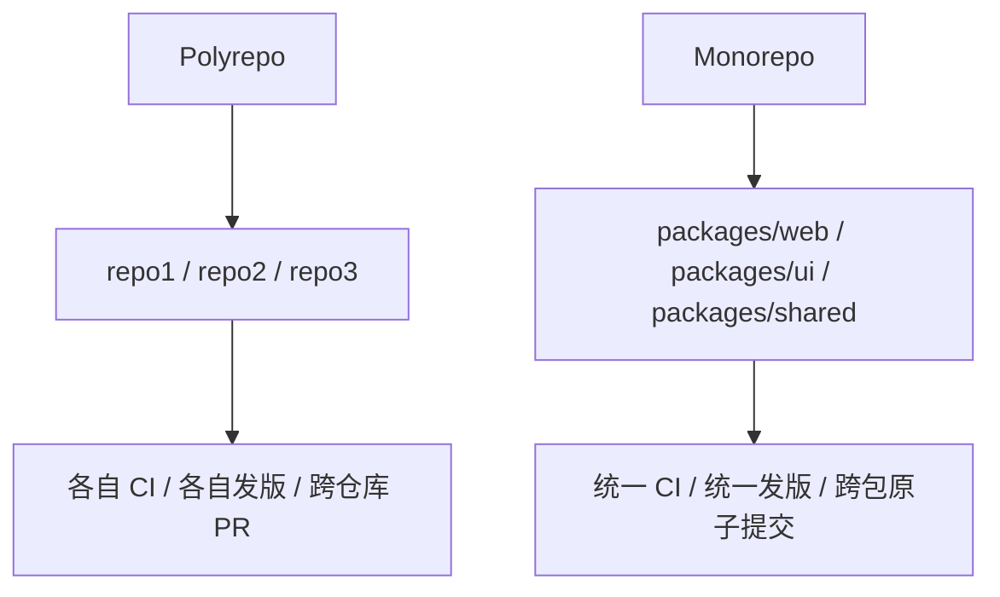
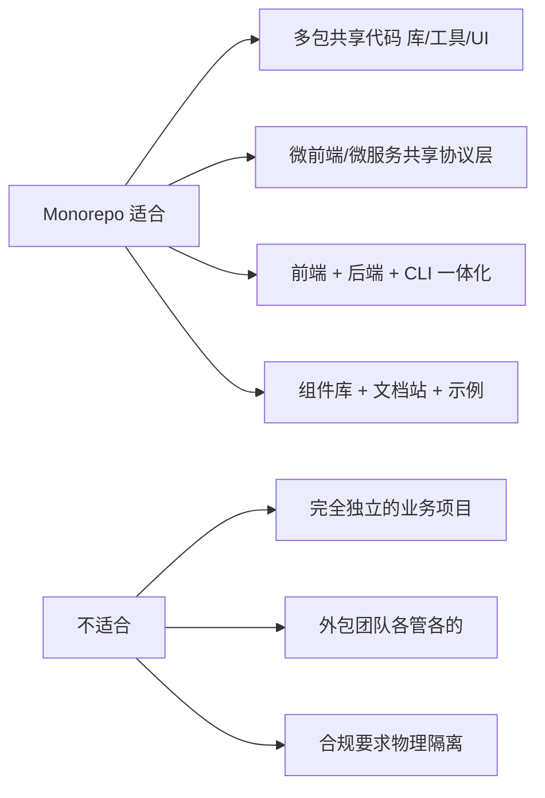
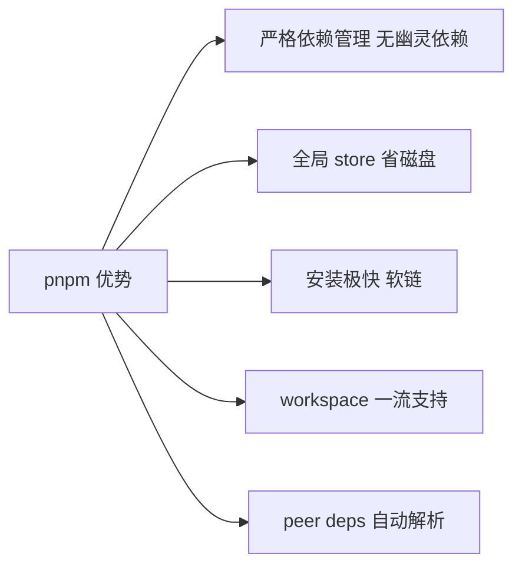
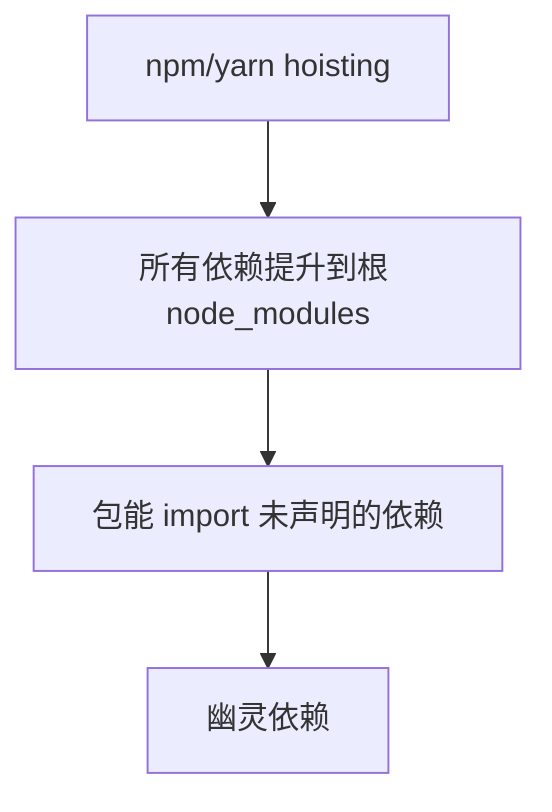
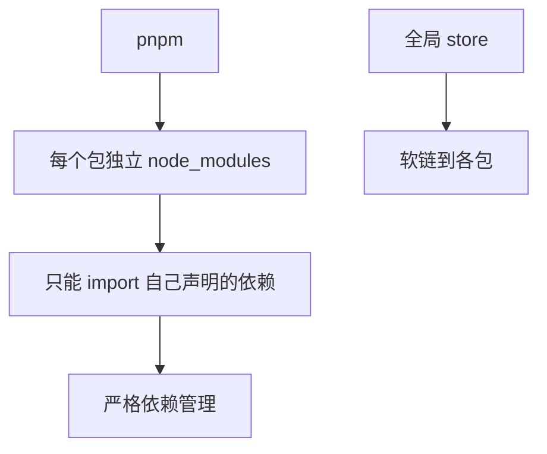
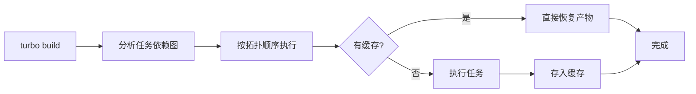
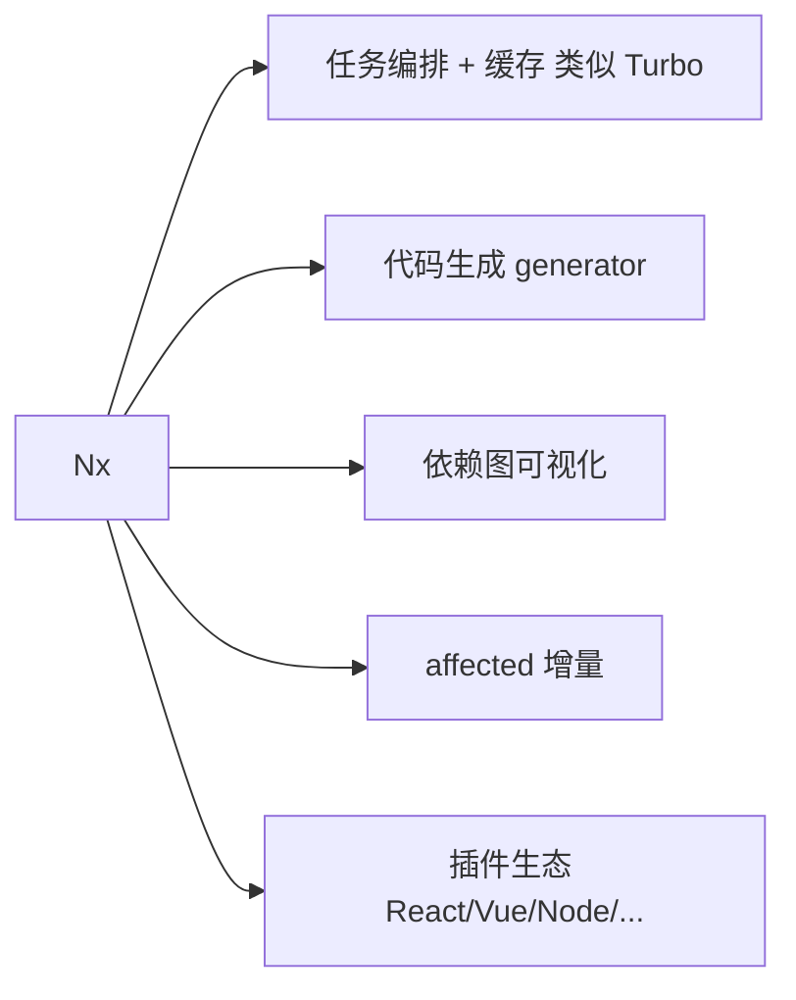
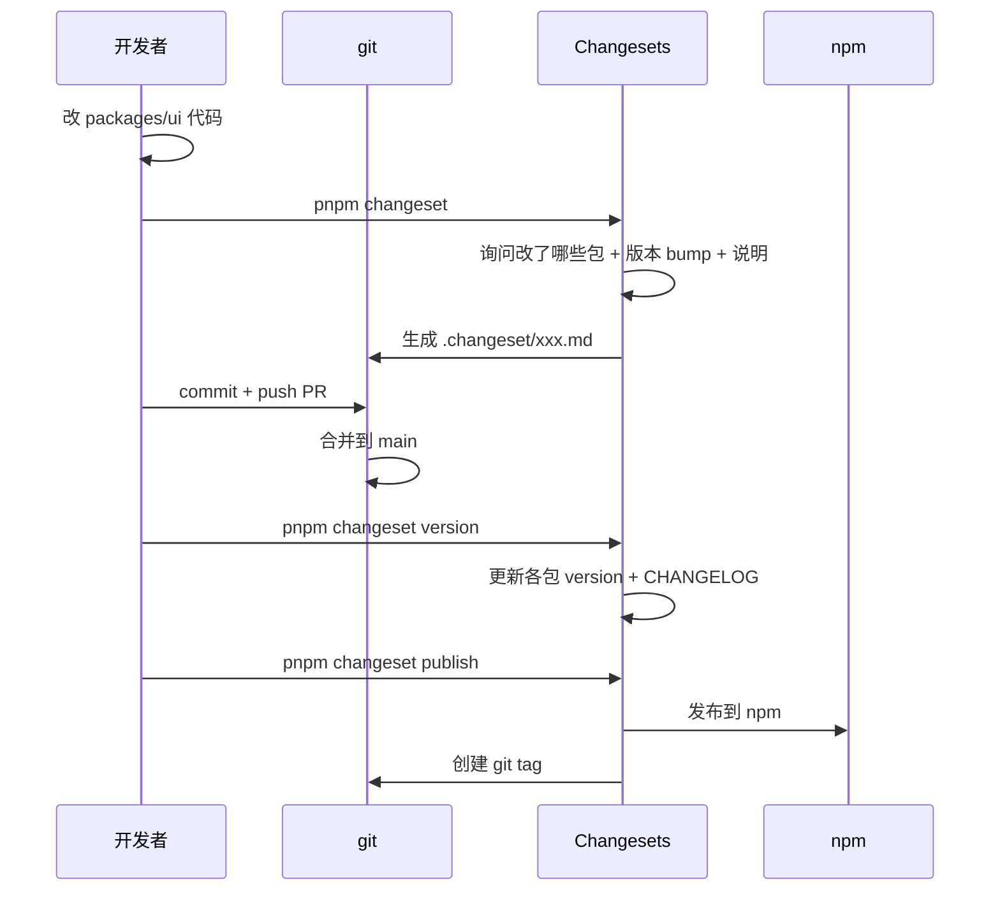

# Monorepo · 核心知识点详解

> 本文档位于 `知识库/前端/工程化与构建/Monorepo/`，是 Monorepo 的核心知识库。配套面试题见《常见面试题与最佳实践.md》。
>
> 读完应能解释清楚"Monorepo 与 Polyrepo 的取舍""pnpm workspace 与 yarn workspace 的区别""hoisting 与幽灵依赖""Turborepo 与 Nx 怎么选""Changesets 怎么管理发布"。

---

## 一、Monorepo 是什么

### 1.1 定义

Monorepo（Mono Repository）是**多个项目/包放在同一个 Git 仓库**的管理方式，与 Polyrepo（每个项目独立仓库）相对。



<!-- -->

- **Polyrepo**：每个项目独立仓库，跨仓库变更需多 PR、版本对齐难。
- **Monorepo**：所有项目在一个仓库，跨包变更一次提交、共享配置、统一 CI。

### 1.2 适合场景



<!-- -->

- **适合**：多包共享代码、统一发版、跨包重构、组件库生态。
- **不适合**：完全独立的业务、合规要求物理隔离、团队不共享代码。

### 1.3 Monorepo 的优势

| 优势 | 说明 |
|---|---|
| 代码共享 | utils/types/ui 跨包复用，零成本 |
| 原子提交 | 跨包变更一次 PR，避免版本对齐 |
| 统一配置 | ESLint/Prettier/TS/CI 一份配置 |
| 重构友好 | 改 API 自动找出所有引用 |
| 依赖管理 | 第三方依赖集中升级 |
| 团队协作 | 多人跨包协作透明 |

### 1.4 Monorepo 的挑战

| 挑战 | 解法 |
|---|---|
| 仓库大、克隆慢 | shallow clone + sparse-checkout |
| 构建慢（全量） | 增量构建 + 缓存（Turborepo/Nx） |
| 依赖复杂 | workspace + 严格依赖（pnpm） |
| 发版复杂 | Changesets/Lerna 发布工具 |
| IDE 性能 | 排除无关包、用 turborepo generator |

---

## 二、包管理器选型

### 2.1 npm/yarn/pnpm 对比

| 维度 | npm | yarn (v1) | yarn (v2+) | pnpm |
|---|---|---|---|---|
| workspace | v7+ | ✓ | ✓ | ✓ |
| hoisting | 默认 | 默认 | 可配 | 严格（默认） |
| 幽灵依赖 | 有 | 有 | 可避免 | 默认避免 |
| 磁盘占用 | 全量复制 | 全量复制 | 全量复制 | 软链 + 全局缓存 |
| 安装速度 | 慢 | 中 | 中 | 极快 |
| Monorepo 支持 | 弱 | 中 | 中 | 强 |

### 2.2 为什么选 pnpm



<!-- -->

- **严格依赖**：每个包只能 import 自己 dependencies 声明的依赖，避免幽灵依赖。
- **全局 store**：所有版本依赖只在全局存一份，项目内用软链——磁盘占用减少 80%+。
- **安装快**：软链 + 全局缓存，不重复下载。
- **workspace**：一等公民支持，配置简单。

### 2.3 安装 pnpm

```bash
# 用 corepack（Node 16+ 内置）
corepack enable
corepack prepare pnpm@latest --activate

# 或全局安装
npm install -g pnpm

# 用 npm 安装项目依赖
pnpm install
```

---

## 三、pnpm workspace

### 3.1 workspace 配置

```yaml
# pnpm-workspace.yaml
packages:
  - "packages/*"
  - "apps/*"
  - "tools/*"
```

指定哪些目录是子包，pnpm 会自动识别 `package.json`。

### 3.2 目录结构

```
my-monorepo/
├── package.json          # 根 package.json
├── pnpm-workspace.yaml
├── pnpm-lock.yaml
├── tsconfig.base.json
├── turbo.json            # Turborepo 配置
├── .github/workflows/    # CI
├── packages/             # 库
│   ├── shared/
│   │   ├── package.json
│   │   ├── tsconfig.json
│   │   └── src/
│   ├── ui/
│   │   ├── package.json
│   │   └── src/
│   └── utils/
│       ├── package.json
│       └── src/
├── apps/                 # 应用
│   ├── web/
│   │   ├── package.json
│   │   └── src/
│   └── admin/
│       ├── package.json
│       └── src/
└── tools/                # 工具脚本
    └── build/
```

### 3.3 包间引用

```json
// packages/ui/package.json
{
  "name": "@myrepo/ui",
  "version": "1.0.0",
  "dependencies": {
    "@myrepo/utils": "workspace:*",     // 引用本地包
    "@myrepo/shared": "workspace:^1.0.0",
    "react": "^18.0.0"
  }
}
```

`workspace:*` 让 pnpm 软链本地包，开发期改动立即生效；发版时自动替换为真实版本号。

### 3.4 常用命令

```bash
# 安装所有依赖
pnpm install

# 在所有包跑命令
pnpm -r build              # 所有包 build
pnpm -r --filter @myrepo/ui test  # 只在 ui 包跑 test

# 给某个包装依赖
pnpm add lodash --filter @myrepo/ui

# 给所有包装某依赖
pnpm add lodash -r

# 给根包装 dev 依赖（不进子包）
pnpm add -D typescript -w

# 跑指定包的 script
pnpm --filter @myrepo/ui build

# 列出所有包
pnpm ls -r --depth -1
```

### 3.5 workspace:* 版本号

| 写法 | 含义 |
|---|---|
| `workspace:*` | 任意本地版本（发版时替换为当前版本） |
| `workspace:^1.0.0` | 限定版本范围 |
| `workspace:~1.0.0` | 限定补丁版本 |
| `workspace:^` | 用包当前版本，加 ^ 前缀 |

发版时 pnpm 自动把 `workspace:*` 替换为真实版本号（如 `^1.2.3`）。

---

## 四、依赖管理：hoisting 与幽灵依赖

### 4.1 hoisting（提升）



<!-- -->

npm/yarn 默认把所有依赖（包括传递依赖）提升到根 `node_modules`，让所有包都能 import——但导致**幽灵依赖**：包能 import 自己没声明的依赖。

```json
// packages/ui/package.json
{ "dependencies": { "react": "^18" } }

// packages/ui/src/index.tsx
import _ from "lodash";  // 居然能跑！因为 lodash 是 react 的传递依赖被提升了
```

`lodash` 不在 ui 的 `dependencies` 但能 import——一旦 react 升级去掉 lodash 依赖，ui 立即崩溃。

### 4.2 pnpm 严格模式



<!-- -->

pnpm 默认每个包有独立 `node_modules`，只软链自己 `dependencies` 声明的依赖——彻底避免幽灵依赖。

```
packages/ui/node_modules/
├── react/        ← 软链到全局 store
├── react-dom/    ← 软链到全局 store
└── .pnpm/        ← 依赖的真实位置（含传递依赖）
```

### 4.3 隔离的好处

- **不依赖传递依赖**：包只 import 自己声明的，发版给别人用也安全。
- **升级安全**：改 react 不会意外影响 lodash 可见性。
- **明确依赖**：依赖图清晰，便于审计。

### 4.4 配置选项

```yaml
# .npmrc
# 严格模式（默认 true）
strict-peer-dependencies=true

# 允许 hoisting（不推荐，会引入幽灵依赖）
shamefully-hoist=false

# hoist 模式（更宽松但仍避免幽灵依赖）
node-linker=isolated  # 默认，推荐
# node-linker=hoisted # 兼容老工具
```

---

## 五、构建工具：Turborepo

### 5.1 Turborepo 是什么

Turborepo 是 Vercel 开发的**高性能 Monorepo 构建系统**，定位为"任务编排 + 缓存 + 增量构建"。



<!-- -->

- **任务编排**：按包间依赖拓扑排序执行任务。
- **本地缓存**：相同输入跳过执行，直接恢复产物。
- **远程缓存**：CI 共享缓存，团队提速。
- **增量构建**：只构建变动的包及下游。

### 5.2 turbo.json 配置

```json
{
  "$schema": "https://turbo.build/schema.json",
  "globalDependencies": ["tsconfig.base.json", ".env"],
  "globalEnv": ["NODE_ENV"],
  "pipeline": {
    "build": {
      "dependsOn": ["^build"],          // 上游包先 build
      "outputs": ["dist/**"],            // 缓存的产物路径
      "inputs": ["src/**", "package.json", "tsconfig.json"]
    },
    "test": {
      "dependsOn": ["build"],
      "inputs": ["src/**", "test/**", "vitest.config.ts"]
    },
    "lint": {
      "inputs": ["src/**", ".eslintrc.cjs"]
    },
    "dev": {
      "cache": false,                   // dev 不缓存
      "persistent": true                // 长期运行
    }
  }
}
```

### 5.3 任务依赖

```json
{
  "pipeline": {
    "build": {
      "dependsOn": ["^build"]    // ^ 表示上游包的 build 先跑
    }
  }
}
```

`^build` 让 turbo 自动按 `workspace:*` 引用关系拓扑排序：先 build `shared`，再 build 依赖它的 `ui`，再 build 依赖 `ui` 的 `web`。

### 5.4 缓存

```bash
# 本地缓存默认在 .turbo/cache
# 命中缓存秒级返回

# 远程缓存（Vercel 免费）
turbo login
turbo link

# 自托管远程缓存
TURBO_API=https://cache.example.com turbo build
```

缓存 key 基于输入（源码、依赖、env），相同输入直接恢复 `outputs` 目录的产物。

### 5.5 增量构建

```bash
# 只构建变动的包及下游
turbo build

# 强制全量
turbo build --force

# 并行度
turbo build --concurrency=4

# 只跑某包及依赖
turbo build --filter=@myrepo/web...

# 只跑变动的
turbo build --filter=...[HEAD~1]
```

### 5.6 与 pnpm 配合

```json
// 根 package.json
{
  "scripts": {
    "build": "turbo build",
    "dev": "turbo dev",
    "test": "turbo test",
    "lint": "turbo lint",
    "clean": "turbo clean && rm -rf node_modules"
  }
}
```

```bash
pnpm build          # 等价 turbo build
pnpm --filter @myrepo/web dev  # 跑单个包
```

---

## 六、构建工具：Nx

### 6.1 Nx 是什么

Nx 是 Nrwl 开发的**可扩展构建系统**，定位为"任务编排 + 缓存 + 代码生成 + 依赖图可视化"。



<!-- -->

Nx 比 Turborepo 功能多——除了任务编排与缓存，还有：

- **代码生成**：generator 创建新包、新组件，自动注册。
- **依赖图可视化**：`nx graph` 看包间依赖。
- **affected 命令**：只跑受影响包。
- **插件生态**：React/Vue/Node/Express 等官方插件。

### 6.2 配置

```json
// nx.json
{
  "extends": "nx/presets/core.json",
  "tasksRunnerOptions": {
    "default": {
      "runner": "nx/tasks-runners/default",
      "options": {
        "cacheableOperations": ["build", "test", "lint"],
        "runtimeCache": { "type": "local" }
      }
    }
  },
  "targetDefaults": {
    "build": {
      "dependsOn": ["^build"],
      "outputs": ["{projectRoot}/dist"]
    }
  },
  "defaultBase": "main"
}
```

### 6.3 generator

```bash
# 创建新包
nx g @nx/react:library --name=ui --directory=packages/ui

# 创建新组件
nx g @nx/react:component --name=Button --project=@myrepo/ui
```

generator 自动创建文件、更新 tsconfig references、注册到根。

### 6.4 affected 命令

```bash
# 只跑受 main 分支影响的包
nx affected:build
nx affected:test

# 看受影响的包
nx affected:apps
nx affected:libs

# 可视化依赖图
nx graph
```

### 6.5 Turborepo vs Nx

| 维度 | Turborepo | Nx |
|---|---|---|
| 配置简单 | 极简 | 中等 |
| 速度 | 极快 | 快 |
| 缓存 | 本地 + 远程 | 本地 + 远程 |
| 代码生成 | 弱 | 强 |
| 依赖图 | 弱 | 强 |
| 插件 | 弱 | 强 |
| 学习曲线 | 低 | 中 |
| 适用 | JS/TS Monorepo | JS/TS + 多语言 |

**选型**：

- 简单 JS/TS Monorepo：Turborepo（配置简单、速度快）。
- 复杂 Monorepo、需要 generator/插件：Nx。
- 多语言（含 Go/Rust）：Nx。

---

## 七、Lerna（已淘汰）

### 7.1 Lerna 历史

Lerna 是早期 Monorepo 工具，由 Babel 团队开发。提供：

- bootstrap：安装依赖 + 软链本地包。
- publish：批量发版。
- run：在所有包跑命令。

**问题**：

- 慢（基于 yarn/npm）。
- 不支持增量构建、缓存。
- 维护停滞（2021 年被 Nx 接管）。

### 7.2 现代替代

| Lerna 功能 | 现代替代 |
|---|---|
| bootstrap | `pnpm install` |
| publish | `changeset` / `pnpm publish -r` |
| run | `turbo run` / `nx run-many` |
| version | `changeset version` |

**新项目不要用 Lerna**——用 pnpm + Turborepo 或 Nx。

---

## 八、版本与发布管理

### 8.1 Changesets

```bash
pnpm add -D @changesets/cli
pnpm changeset init
```

```json
// .changeset/config.json
{
  "changelog": "@changesets/cli/changelog",
  "commit": false,
  "fixed": [],
  "linked": [],
  "access": "public",
  "baseBranch": "main",
  "updateInternalDependencies": "patch",
  "ignore": ["@myrepo/docs"]
}
```

### 8.2 工作流



<!-- -->

**核心命令**：

```bash
# 1. 记录变更（开发期）
pnpm changeset
# 交互式选择：哪些包变 + 版本 bump（patch/minor/major）+ 说明

# 2. 应用变更（合并到 main 后）
pnpm changeset version
# 更新 package.json version + CHANGELOG.md

# 3. 发布
pnpm changeset publish
# 发布到 npm + 创建 git tag
```

### 8.3 .changeset 文件

```markdown
<!-- .changeset/loud-tigers-jump.md -->
---
"@myrepo/ui": minor
"@myrepo/utils": patch
---

Add new Button component with primary variant.
```

每个 changeset 是一个 markdown 文件，记录：

- 哪些包要发版。
- 版本 bump 类型。
- 变更说明（写入 CHANGELOG）。

### 8.4 自动化发布（GitHub Actions）

```yaml
# .github/workflows/release.yml
name: Release
on:
  push:
    branches: [main]
jobs:
  release:
    runs-on: ubuntu-latest
    steps:
      - uses: actions/checkout@v4
        with: { fetch-depth: 0 }
      - uses: pnpm/action-setup@v2
      - uses: actions/setup-node@v4
        with: { node-version: 20, cache: pnpm, registry-url: "https://registry.npmjs.org" }
      - run: pnpm install --frozen-lockfile
      - name: Create Release PR
        uses: changesets/action@v1
        with:
          publish: pnpm changeset publish
          version: pnpm changeset version
        env:
          GITHUB_TOKEN: ${{ secrets.GITHUB_TOKEN }}
          NPM_TOKEN: ${{ secrets.NPM_TOKEN }}
          NODE_AUTH_TOKEN: ${{ secrets.NPM_TOKEN }}
```

合并到 main 时：

1. 有未应用的 changeset → 创建 "Version Packages" PR。
2. 合并 Version PR → changeset 自动发布到 npm + 创建 tag。

### 8.5 pnpm publish 替代

简单场景可用 pnpm 原生发布：

```bash
# 给所有包 bump 版本
pnpm version patch -r --no-git-tag-version

# 发布
pnpm publish -r --filter "@myrepo/*" --access public
```

但无 CHANGELOG 自动生成、无变更追踪——只适合个人项目或私有 monorepo。

---

## 九、共享配置

### 9.1 共享 tsconfig

```json
// tsconfig.base.json
{
  "compilerOptions": {
    "target": "ES2022",
    "module": "ESNext",
    "moduleResolution": "Bundler",
    "strict": true,
    "esModuleInterop": true,
    "skipLibCheck": true,
    "forceConsistentCasingInFileNames": true,
    "resolveJsonModule": true,
    "isolatedModules": true,
    "verbatimModuleSyntax": true
  }
}
```

```json
// packages/ui/tsconfig.json
{
  "extends": "../../tsconfig.base.json",
  "compilerOptions": {
    "jsx": "react-jsx",
    "lib": ["ES2022", "DOM"],
    "outDir": "dist",
    "rootDir": "src",
    "composite": true,
    "declaration": true
  },
  "references": [{ "path": "../shared" }],
  "include": ["src"]
}
```

### 9.2 共享 ESLint 配置

```js
// packages/eslint-config/index.js
import js from "@eslint/js";
import tseslint from "typescript-eslint";
import prettier from "eslint-config-prettier";

export const baseConfig = [
  { ignores: ["dist/**", "node_modules/**"] },
  js.configs.recommended,
  ...tseslint.configs.recommended,
  prettier,
];

export const reactConfig = [
  ...baseConfig,
  // ...react configs
];

export default baseConfig;
```

```js
// packages/ui/eslint.config.js
import { reactConfig } from "@myrepo/eslint-config";
export default [...reactConfig];
```

### 9.3 共享 Vite 配置

```js
// packages/vite-config/index.ts
import { defineConfig } from "vite";
import react from "@vitejs/plugin-react";
import tsconfigPaths from "vite-tsconfig-paths";
import { compression } from "vite-plugin-compression";

export function createViteConfig(options = {}) {
  return defineConfig({
    plugins: [
      react(),
      tsconfigPaths(),
      ...(options.compression ? [compression({ algorithm: "brotliCompress" })] : []),
    ],
    resolve: { alias: options.alias || {} },
    build: {
      target: "es2018",
      minify: "esbuild",
      chunkSizeWarningLimit: 1000,
    },
  });
}
```

```js
// apps/web/vite.config.ts
import { createViteConfig } from "@myrepo/vite-config";
export default createViteConfig({
  alias: { "@": "/src" },
  compression: true,
});
```

---

## 十、常见陷阱与修复

### 10.1 幽灵依赖

```ts
// packages/ui/src/index.tsx
import _ from "lodash";  // 在 pnpm 报错：找不到 lodash
```

修复：在 ui 的 package.json 加 `"lodash": "^4"`。

### 10.2 循环依赖

```
packages/ui 依赖 packages/utils
packages/utils 依赖 packages/ui   ← 循环！
```

修复：把循环部分抽到第三个包，或重新设计职责边界。

### 10.3 类型找不到

```ts
// packages/web 引用 packages/ui 的类型
import { Button } from "@myrepo/ui";  // TS 报错找不到类型
```

修复：

- ui 的 package.json 配 `"types": "./dist/index.d.ts"`。
- ui 的 tsconfig 开 `"declaration": true` + `"composite": true`。
- web 的 tsconfig `references: [{ "path": "../../packages/ui" }]`。

### 10.4 dev 时改动 ui 不生效

```bash
# 错：只跑了 web 的 dev，没编译 ui
pnpm --filter @myrepo/web dev

# 对：同时跑 ui 的 watch + web 的 dev
pnpm --filter @myrepo/ui --filter @myrepo/web dev

# 或用 turbo dev（自动并行 + 监听）
turbo dev
```

### 10.5 缓存导致构建异常

```bash
# 清除 turbo 缓存
rm -rf .turbo

# 清除各包 dist
turbo clean

# 强制重新构建
turbo build --force
```

### 10.6 包名冲突

```json
// 错：两个包 name 都叫 "utils"
packages/utils/package.json: { "name": "utils" }
tools/utils/package.json: { "name": "utils" }
```

修复：用 scope 命名 `@myrepo/utils`、`@myrepo/tools-utils`。

---

## 十一、最佳实践 Checklist

### 11.1 包管理

- 用 pnpm（不用 npm/yarn）
- `pnpm-workspace.yaml` 配置 packages
- 包间引用用 `workspace:*`
- `.npmrc` 配置 `strict-peer-dependencies=true`
- 不开 `shamefully-hoist`（避免幽灵依赖）

### 11.2 目录结构

- `packages/` 放库
- `apps/` 放应用
- `tools/` 放脚本
- 共享配置放根：`tsconfig.base.json`、`eslint.config.js`、`.prettierrc`

### 11.3 构建工具

- 用 Turborepo 或 Nx
- `turbo.json` 配置 pipeline
- `dependsOn: ["^build"]` 拓扑排序
- `outputs` 配置缓存路径
- 启用远程缓存

### 11.4 TS 配置

- `tsconfig.base.json` 共享基础
- 各包 `extends` 继承
- 各包 `composite: true` + `declaration: true`
- 根 tsconfig 用 `references`
- `tsc --build` 增量编译

### 11.5 ESLint 配置

- `@myrepo/eslint-config` 共享配置包
- 各包 `import` 共享配置
- 业务包覆盖业务专属规则

### 11.6 发布

- `changesets` 管理版本
- `.changeset/config.json` 配置
- GitHub Actions 自动 release PR + publish
- `access: "public"` 公开发布

### 11.7 CI/CD

- `pnpm install --frozen-lockfile`
- `turbo build --filter=...[origin/main]` 增量
- `turbo run typecheck lint test`
- 远程缓存加速

### 11.8 文档

- `README.md` 根介绍 + 快速开始
- `CONTRIBUTING.md` 贡献指南
- 每个包 `README.md` 自描述
- `packages/docs/` 集中文档站（如 Docusaurus）

---

## 十二、一句话总纲

> Monorepo 的本质是 **"多包同仓库 + workspace 软链 + 任务编排"**：pnpm workspace 用 `workspace:*` 软链本地包、严格依赖管理避免幽灵依赖；Turborepo/Nx 做任务编排 + 缓存 + 增量构建（按拓扑顺序、只跑变动包）；Changesets 管理版本与发布（变更追踪 + 自动 CHANGELOG + 发版 PR）；共享配置（tsconfig/eslint/vite）让全团队一致。能答出"Monorepo 与 Polyrepo 取舍""pnpm 为什么避免幽灵依赖""Turborepo 与 Nx 怎么选""Changesets 工作流""Project References 与 workspace 配合""共享配置怎么组织"，就是高级前端对 Monorepo 的认知。
