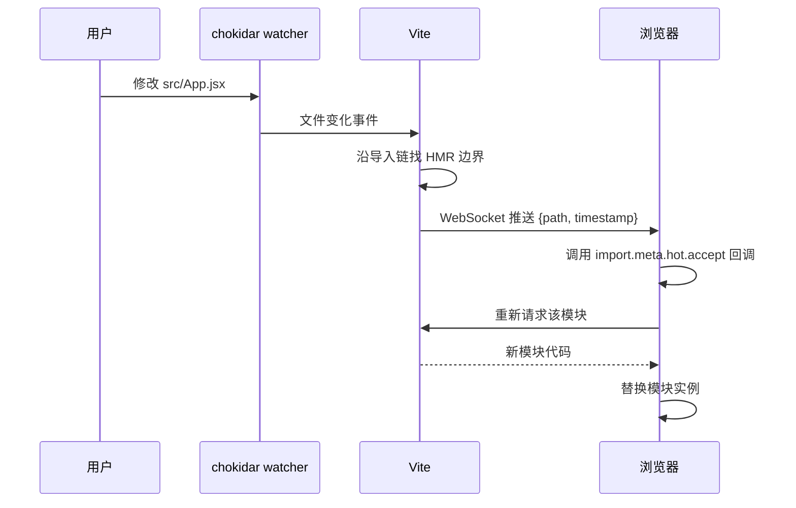
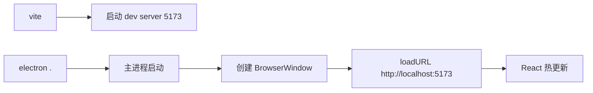
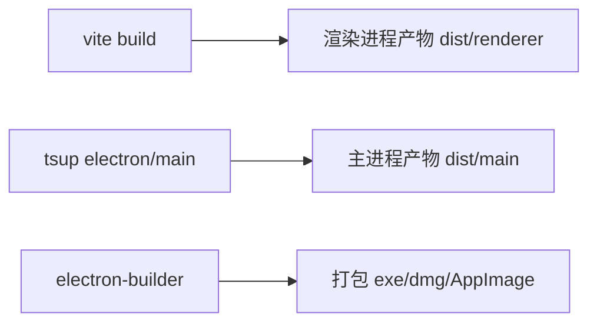

# Vite 专题 · 常见面试题与最佳实践

> 本文档位于 `知识库/前端/工程化与构建/Vite 专题/`，是 Vite 的面试题集与生产最佳实践。配套核心知识见《核心知识点详解.md》。
>
> 15 道高频题 + 8 个生产场景 + 完整 Checklist，覆盖原理、配置、性能、Electron 集成、迁移 Webpack 等面试常考点。

---

## 一、原理类（高频）

### 1. 为什么 Vite 启动比 Webpack 快两个数量级？

**核心答案**：Vite 开发期**不打包**，利用浏览器原生 ESM 按需加载。

| 阶段 | Webpack | Vite |
|---|---|---|
| 启动 | 全量构建依赖图 → 编译所有模块 → 打包成 bundle → 启动 server | 启动 server → 立即可用 |
| 模块处理 | 启动时编译全部 | 浏览器请求时才编译 |
| 启动时间 | 与项目规模线性相关（分钟级） | 与项目规模无关（秒级） |

**展开**：

- Webpack 冷启动必须先把所有入口的依赖图遍历完，编译每个模块，最后打包成 bundle 才能启动 dev server。项目越大，启动越慢。
- Vite 直接启动 HTTP server，浏览器请求 `main.js` 时才编译该文件，遇到 `import` 才请求依赖。未访问的文件不处理，启动时间几乎与项目规模无关。
- 唯一的"启动开销"是预构建依赖（用 esbuild，速度极快），但这只针对 `node_modules`，且首次预构建后缓存。

---

### 2. Vite 预构建（optimizeDeps）解决什么问题？

**核心答案**：解决第三方依赖的三类问题——格式转换、请求瀑布、重复请求。

1. **格式问题**：很多 npm 包是 CJS/UMD，浏览器原生 ESM 无法直接 `import`。esbuild 把它们转成 ESM。
2. **请求瀑布**：像 `lodash-es` 内部有 600+ 个小模块，浏览器逐个请求会形成瀑布。预构建把它们合并成单文件。
3. **重复请求**：多入口共享同一依赖时，浏览器会重复请求同一模块。预构建合并后只请求一次。

**深入**：

- 预构建产物缓存到 `node_modules/.vite/deps/`。
- 缓存失效条件：`package.json` 的 `dependencies` 变、lockfile 变、`optimizeDeps` 配置变。
- 强制重新预构建：`vite --force` 或删除 `node_modules/.vite`。
- 动态 import 或 CSS URL 引用的依赖可能不被入口扫描发现，需要 `optimizeDeps.include` 显式声明。

```ts
export default defineConfig({
  optimizeDeps: {
    include: ["lodash-es", "echarts/core"],
    exclude: ["electron"],  // Electron-only 依赖不预构建
  },
});
```

---

### 3. 为什么 Vite 生产构建用 Rollup 而不是 esbuild 或 Webpack？

**核心答案**：Rollup 输出 ESM 干净、Tree Shaking 效果最好，契合现代浏览器趋势。

| 维度 | Rollup | esbuild | Webpack |
|---|---|---|---|
| 产物 | ESM 优先 | ESM/CJS | 多格式但 ESM 弱 |
| Tree Shaking | 原生支持最佳 | 一般 | 需配置 |
| 插件生态 | 丰富 | 简单 | 庞大 |
| 速度 | 中等 | 极快 | 慢 |

**展开**：

- esbuild 速度极快但插件能力弱、Tree Shaking 不如 Rollup 精细，所以 dev 期用 esbuild（预构建），生产期用 Rollup。
- Webpack 的 ESM 输出支持弱，且插件体系（Loader + Plugin）复杂。
- Vite 仍用 esbuild 做 minify（比 terser 快 10x），兼顾速度与质量。
- Rollup 插件可直接在 Vite 复用，生态无缝衔接。

---

### 4. Vite 的 HMR 是怎么工作的？HMR 边界是什么？

**核心答案**：通过 WebSocket 推送变更模块，沿导入链向上找"接受 HMR 的模块"作为边界，边界内热替换不刷新。



<!-- -->

- **HMR 边界**：被修改模块向上找，遇到调用 `import.meta.hot.accept` 的模块就停。在该边界内热替换，边界外不刷新。
- **状态保留**：React 通过 `@vitejs/plugin-react` 的 React Refresh 自动注入 HMR 接收，保留组件 state。Vue 通过 `@vitejs/plugin-vue` 类似。
- **失败回退**：找不到 HMR 边界 → 整页刷新。

```js
// 自定义 HMR 接收
if (import.meta.hot) {
  import.meta.hot.accept("./foo", (newMod) => {
    // foo 更新了，自定义处理
  });
}
```

---

### 5. Vite 插件机制与 Rollup 插件的关系？

**核心答案**：Vite 插件基于 Rollup 插件接口扩展，兼容 Rollup 插件并新增 Vite 专属钩子。

| 钩子类别 | 钩子 | 触发时机 |
|---|---|---|
| Rollup 通用 | `resolveId` / `load` / `transform` | 模块解析与转换 |
| Vite 专属 | `config` | 修改 vite config |
| Vite 专属 | `configResolved` | 读取最终 config |
| Vite 专属 | `configureServer` | 配置 dev server 中间件 |
| Vite 专属 | `transformIndexHtml` | 转换 HTML |
| Vite 专属 | `handleHotUpdate` | 自定义 HMR |

```ts
export function myPlugin(): Plugin {
  return {
    name: "my-plugin",
    enforce: "pre",       // 在 Vite 核心插件前
    apply: "build",       // 仅 build 时
    config(config) { /* 修改 config */ },
    transform(code, id) { /* 转换代码 */ return { code, map: null }; },
    transformIndexHtml(html) { /* 注入 script */ return html + "<script>...</script>"; },
  };
}
```

**控制顺序**：

- `enforce: "pre"` 在 Vite 核心插件前跑，`"post"` 在其后跑。
- `apply: "build"` 只在构建时跑，`"serve"` 只在 dev 时跑。

---

## 二、配置类（高频）

### 6. 怎么配置路径别名？为什么 Vite 与 tsconfig 要同步？

**核心答案**：Vite 配置 `resolve.alias` 负责运行时解析；`tsconfig.json` 配 `paths` 负责类型检查与 IDE 跳转。两边必须同步。

```ts
// vite.config.ts
import path from "node:path";
export default defineConfig({
  resolve: {
    alias: {
      "@": path.resolve(__dirname, "src"),
    },
  },
});
```

```json
// tsconfig.json
{
  "compilerOptions": {
    "baseUrl": ".",
    "paths": { "@/*": ["src/*"] }
  }
}
```

**为什么必须同步**：

- 只配 Vite：TS 报错"找不到模块"，IDE 无法跳转。
- 只配 TS：IDE 提示 OK，但运行时 Vite 解析失败，浏览器报 404。
- 两边路径必须完全一致（包括 `/` 通配符位置）。

**进阶**：用 `vite-tsconfig-paths` 插件自动同步：

```ts
import tsconfigPaths from "vite-tsconfig-paths";
export default {
  plugins: [tsconfigPaths()],  // 自动读取 tsconfig paths
};
```

---

### 7. 怎么代理后端 API？生产怎么处理跨域？

**核心答案**：dev 期用 `server.proxy` 转发请求到后端；生产用 Nginx 反向代理或后端 CORS。

```ts
// vite.config.ts - dev 期代理
server: {
  proxy: {
    "/api": {
      target: "http://localhost:3000",
      changeOrigin: true,
      rewrite: (p) => p.replace(/^\/api/, ""),
    },
    "/ws": { target: "ws://localhost:3000", ws: true },  // WebSocket
  },
}
```

```nginx
# nginx.conf - 生产反向代理
location /api/ {
  proxy_pass http://backend:3000/;
  proxy_set_header Host $host;
  proxy_set_header X-Real-IP $remote_addr;
}

# 静态资源
location / {
  root /var/www/my-app;
  try_files $uri $uri/ /index.html;  # SPA fallback
}
```

**为什么 dev 需要 proxy**：

- dev 期前端 5173，后端 3000，跨域。
- 用 proxy 让请求"看起来"是同源 `/api/...`，避免 CORS 预检与 cookie 跨域问题。
- 还能 rewrite 路径、加 header。

**生产则用反向代理**，让用户访问 `https://example.com/api/...` 被转发到后端服务。

---

### 8. 环境变量怎么管理？哪些变量暴露给客户端？

**核心答案**：Vite 自动加载 `.env.[mode]`，仅 `VITE_` 前缀变量暴露给客户端，防泄漏敏感信息。

```bash
# .env
VITE_API_BASE=https://api.example.com
DB_PASSWORD=secret123     # 不会暴露给客户端

# .env.staging
VITE_API_BASE=https://staging-api.example.com
```

```ts
// 客户端代码
const apiBase = import.meta.env.VITE_API_BASE;  // ✓
const dbPwd = import.meta.env.DB_PASSWORD;       // undefined
```

**深入**：

- 加载顺序：`.env` < `.env.local` < `.env.[mode]` < `.env.[mode].local`（后者覆盖前者）。
- `mode` 默认 `serve` 为 `development`、`build` 为 `production`，可用 `--mode staging` 覆盖。
- `envPrefix` 自定义可见前缀：`envPrefix: ["VITE_", "APP_"]` 让 `APP_` 也暴露。
- **配置文件内可访问所有变量**（用 `loadEnv`）：

```ts
export default defineConfig(({ mode }) => {
  const env = loadEnv(mode, process.cwd(), "");  // 空前缀 = 全部
  return {
    define: {
      __APP_VERSION__: JSON.stringify(env.npm_package_version),
    },
  };
});
```

**敏感信息处理**：

- 数据库密码、API secret 等不放 `.env`，应放在服务器环境变量或密钥管理服务。
- 客户端代码可见的变量视为"可被任何人看到"，绝不能放敏感数据。

---

### 9. 怎么打包 npm 库？library mode 配置要点？

**核心答案**：`build.lib` 指定入口与格式，`external` 排除 peer deps，`package.json` 配 `exports` 字段。

```ts
// vite.config.ts
export default defineConfig({
  build: {
    lib: {
      entry: path.resolve(__dirname, "src/index.ts"),
      name: "MyLib",
      fileName: (format) => `my-lib.${format}.js`,
      formats: ["es", "umd"],
    },
    rollupOptions: {
      external: ["react", "react-dom"],
      output: {
        globals: { react: "React", "react-dom": "ReactDOM" },
      },
    },
  },
});
```

```json
// package.json
{
  "name": "my-lib",
  "main": "./dist/my-lib.umd.js",
  "module": "./dist/my-lib.es.js",
  "types": "./dist/index.d.ts",
  "exports": {
    ".": {
      "import": "./dist/my-lib.es.js",
      "require": "./dist/my-lib.umd.js",
      "types": "./dist/index.d.ts"
    }
  },
  "peerDependencies": { "react": ">=17" },
  "files": ["dist"]
}
```

**要点**：

- **formats**：`es` 给现代打包器（Vite/Webpack/Rollup），`umd` 给浏览器直接 `<script>`，`cjs` 给 Node。
- **external**：peer deps（react 等）不打包，由使用者自己提供。
- **types**：用 `vite-plugin-dts` 生成 `.d.ts`，让消费者有类型提示。
- **exports**：Node 12+ 字段，告诉打包器根据调用方式选对应产物。

```ts
// 生成类型
import dts from "vite-plugin-dts";
export default {
  plugins: [dts({ insertTypesEntry: true, rollupTypes: true })],
};
```

---

### 10. 多页面应用（MPA）怎么配置？

**核心答案**：`rollupOptions.input` 指定多个 HTML 入口。

```ts
build: {
  rollupOptions: {
    input: {
      main: path.resolve(__dirname, "index.html"),
      about: path.resolve(__dirname, "about/index.html"),
      admin: path.resolve(__dirname, "admin/index.html"),
    },
  },
}
```

**目录结构**：

```
project/
├── index.html          # /  → main 入口
├── about/
│   └── index.html      # /about/ → about 入口
├── admin/
│   └── index.html      # /admin/ → admin 入口
└── src/
    ├── main.tsx
    ├── about.tsx
    └── admin.tsx
```

**注意**：

- 每个 HTML 独立入口，独立打包，公共依赖会自动抽到 vendor chunk。
- 路由仍可由各入口内部 router 处理，但页面间跳转是真页面刷新（非 SPA 路由）。
- 适合门户、营销站等多入口场景；管理后台仍建议 SPA。

---

## 三、性能类（高频）

### 11. 怎么优化 Vite 项目的构建产物？

**核心答案**：从 target、minify、chunks、tree shaking、压缩、动态加载六个维度优化。

```ts
build: {
  target: "es2018",        // 升级 target，少 transpile
  minify: "esbuild",       // 比 terser 快 10x
  cssCodeSplit: true,      // CSS 拆分
  chunkSizeWarningLimit: 1000,
  rollupOptions: {
    output: {
      manualChunks: {
        "react-vendor": ["react", "react-dom"],
        "echarts-vendor": ["echarts"],
        "utils-vendor": ["lodash-es", "dayjs"],
      },
    },
  },
}
```

**展开**：

| 维度 | 配置 | 效果 |
|---|---|---|
| target | `build.target: "es2018"` | 减少 transpile，产物更小 |
| minify | `minify: "esbuild"` | 压缩快 10x，体积略大于 terser |
| Code Splitting | `manualChunks` 拆 vendor | 长期缓存，发版只更新业务 chunk |
| CSS 拆分 | `cssCodeSplit: true`（默认） | 异步 chunk 的 CSS 单独提取 |
| 动态加载 | `() => import("./page")` | 按路由拆 chunk，按需加载 |
| 预压缩 | `vite-plugin-compression` | gzip/brotli 预生成 |

**包体分析**：

```ts
import { visualizer } from "rollup-plugin-visualizer";
plugins: [
  visualizer({ open: true, gzipSize: true, brotliSize: true }),
]
```

**路由懒加载**：

```jsx
const Page = lazy(() => import("./Page"));
<Route path="/page" element={<Suspense fallback="..."><Page /></Suspense>} />
```

---

### 12. dev 期启动慢、HMR 慢怎么排查？

**核心答案**：检查预构建是否完整、有没有大量动态 import、有没有触发二次预构建。

**常见原因**：

1. **二次预构建**：动态 import 的依赖没声明 `include`，运行时触发二次预构建导致卡顿。
2. **大量小模块**：某些库（如 lodash-es 未预构建）每文件一个请求。
3. **大依赖扫描**：每次保存触发依赖图重扫。
4. **插件开销**：自定义插件 `transform` 钩子慢。

**排查工具**：

```bash
# 详细日志
DEBUG=vite:* vite

# 性能分析
vite --debug
```

**修复**：

```ts
// 显式声明动态 import 依赖
optimizeDeps: {
  include: ["lodash-es", "echarts/core", "dayjs/locale/zh-cn"],
}

// 大依赖单独处理
optimizeDeps: {
  esbuildOptions: { target: "esnext" },
}

// 排除大依赖（如果用 CDN）
build: { rollupOptions: { external: ["monaco-editor"] } }
```

---

## 四、Electron 集成类（高频）

### 13. Vite + Electron 怎么集成？dev 与 build 流程差异？

**核心答案**：dev 期渲染进程加载 `http://localhost:5173`；build 期分别打包主进程（tsup/esbuild）与渲染进程（Vite）。

```ts
// vite.config.ts
export default defineConfig({
  server: { port: 5173 },
  optimizeDeps: { exclude: ["electron"] },  // 不预构建
  resolve: {
    alias: { "@main": path.resolve(__dirname, "electron/main") },
  },
});
```

```ts
// electron/main/index.ts
import { BrowserWindow } from "electron";
import path from "node:path";

function createWindow() {
  const win = new BrowserWindow({
    webPreferences: {
      preload: path.join(__dirname, "preload.js"),
      contextIsolation: true,
      nodeIntegration: false,
    },
  });
  if (process.env.NODE_ENV === "development") {
    win.loadURL("http://localhost:5173");
    win.webContents.openDevTools();
  } else {
    win.loadFile(path.join(__dirname, "../renderer/index.html"));
  }
}
```

**dev 流程**：



<!-- -->

**build 流程**：



<!-- -->

**目录结构**：

```
project/
├── electron/
│   ├── main/         # 主进程
│   ├── preload/      # preload 脚本
│   └── tsup.config.ts
├── src/              # 渲染进程（React）
├── vite.config.ts
└── package.json
```

**package.json 脚本**：

```json
{
  "scripts": {
    "dev": "concurrently \"vite\" \"wait-on tcp:5173 && electron .\"",
    "build": "vite build && tsup -d electron && electron-builder"
  }
}
```

---

### 14. Electron 渲染进程怎么安全访问 Node API？

**核心答案**：`contextIsolation: true` + `nodeIntegration: false` + preload 用 `contextBridge` 暴露白名单 API。

**反模式（危险）**：

```ts
// 错：开 nodeIntegration 让渲染进程直接用 Node
webPreferences: { nodeIntegration: true }
// 渲染进程：require("fs").readFileSync(...)  # 任意 JS 可执行任意 Node API
```

**安全模式**：

```ts
// electron/preload/index.ts
import { contextBridge, ipcRenderer } from "electron";

contextBridge.exposeInMainWorld("api", {
  // 只暴露白名单方法
  openFile: () => ipcRenderer.invoke("dialog:openFile"),
  readFile: (path: string) => ipcRenderer.invoke("fs:readFile", path),
  // 不暴露任意 ipcRenderer.on（防双向通信被劫持）
});

declare global {
  interface Window {
    api: { openFile: () => Promise<string>; readFile: (p: string) => Promise<string> };
  }
}
```

```ts
// electron/main/index.ts
import { ipcMain, dialog } from "electron";
import fs from "node:fs/promises";

ipcMain.handle("dialog:openFile", async () => {
  const { filePaths } = await dialog.showOpenDialog({ properties: ["openFile"] });
  return filePaths[0];
});

ipcMain.handle("fs:readFile", async (e, path: string) => {
  // 校验 path 是否在白名单目录
  if (!isSafePath(path)) throw new Error("forbidden");
  return fs.readFile(path, "utf-8");
});
```

**渲染进程使用**：

```tsx
const path = await window.api.openFile();
const content = await window.api.readFile(path);
```

**关键点**：

- `contextIsolation: true` 让渲染进程与 preload 隔离，防原型污染。
- `nodeIntegration: false` 让渲染进程无 Node，任意 JS 都不能直接读文件。
- 主进程对接 IPC 时**校验参数**（路径、命令等），防注入。

---

## 五、迁移与对比类（高频）

### 15. 从 Webpack 迁移 Vite 怎么做？踩过哪些坑？

**核心答案**：分四步——配置转换、依赖梳理、插件替换、测试验证。

**迁移步骤**：

1. **入口与别名**

```ts
// Webpack config
resolve: { alias: { "@": "src" } }

// Vite
resolve: { alias: { "@": path.resolve(__dirname, "src") } }
// + tsconfig.paths 同步
```

2. **环境变量**

```bash
# Webpack 用 DefinePlugin 注入 process.env
# Vite 用 .env + import.meta.env
```

业务代码所有 `process.env.X` 改成 `import.meta.env.VITE_X`。

3. **CSS 处理**

```ts
// Webpack 需 css-loader + style-loader
// Vite 内置 CSS、CSS Modules、SCSS、PostCSS
css: {
  preprocessorOptions: {
    scss: { additionalData: `@import "@/styles/vars.scss";` },
  },
  modules: { localsConvention: "camelCase" },
}
```

4. **代理与 dev server**

```ts
// Webpack devServer.proxy → Vite server.proxy
server: {
  proxy: { "/api": { target: "http://localhost:3000", changeOrigin: true } },
}
```

5. **插件替换**

| Webpack | Vite |
|---|---|
| html-webpack-plugin | 内置 + `transformIndexHtml` |
| copy-webpack-plugin | `vite-plugin-static-copy` |
| mini-css-extract-plugin | 内置（生产自动提取） |
| fork-ts-checker-webpack-plugin | `vite-plugin-checker` |
| webpack-bundle-analyzer | `rollup-plugin-visualizer` |

**常见坑**：

1. **CJS 依赖问题**：老 CJS 库在 dev（ESM）能跑、build（Rollup）报错。
   - 修复：`optimizeDeps.include` 显式声明、`build.commonjsOptions` 调整。
2. **require is not defined**：源码用了 `require`。
   - 修复：改成 `import`。
3. **globals 依赖**：jQuery 等 UMD 全局依赖未声明。
   - 修复：`build.rollupOptions.output.globals` 或换 ESM 替代品。
4. **二次预构建卡顿**：动态 import 的依赖未声明。
   - 修复：`optimizeDeps.include`。
5. **CSS 中 URL 解析**：SCSS 里的 `url(./logo.png)` 在 dev/build 行为不一致。
   - 修复：用 `~@/assets/...` 或绝对路径。
6. **HTML 处理**：`html-webpack-plugin` 的 template 选项。
   - 修复：在 `index.html` 直接写、用 `vite-plugin-html` 插件。

**渐进迁移**：

- 大项目可保留 Webpack 做 build、用 Vite 做 dev（Vite 也支持生产构建，但若老项目 build 配置极复杂，可分开）。
- 子项目逐步迁，避免大爆炸式重构。

---

## 六、生产最佳实践

### 6.1 项目初始化模板

```bash
# React + TS
pnpm create vite my-app -- --template react-ts

# Vue + TS
pnpm create vite my-app -- --template vue-ts

# Svelte + TS
pnpm create vite my-app -- --template svelte-ts

# 自带工具链（推荐新项目）
pnpm create vite@latest my-app -- --template react-ts
cd my-app
pnpm add -D @vitejs/plugin-react eslint prettier
```

### 6.2 推荐 vite.config.ts 模板

```ts
import { defineConfig, loadEnv } from "vite";
import react from "@vitejs/plugin-react";
import tsconfigPaths from "vite-tsconfig-paths";
import { visualizer } from "rollup-plugin-visualizer";
import { compression } from "vite-plugin-compression";
import path from "node:path";

export default defineConfig(({ command, mode }) => {
  const env = loadEnv(mode, process.cwd(), "");
  const isBuild = command === "build";

  return {
    base: env.VITE_BASE || "/",
    plugins: [
      react(),
      tsconfigPaths(),
      isBuild && compression({ algorithm: "brotliCompress", ext: ".br" }),
      isBuild && visualizer({ filename: "dist/stats.html", gzipSize: true }),
    ].filter(Boolean),

    resolve: {
      alias: { "@": path.resolve(__dirname, "src") },
    },

    server: {
      port: 5173,
      open: true,
      proxy: {
        "/api": {
          target: env.VITE_API_TARGET || "http://localhost:3000",
          changeOrigin: true,
          rewrite: (p) => p.replace(/^\/api/, ""),
        },
      },
    },

    build: {
      target: "es2018",
      minify: "esbuild",
      sourcemap: mode !== "production",
      chunkSizeWarningLimit: 1000,
      rollupOptions: {
        output: {
          manualChunks: {
            "react-vendor": ["react", "react-dom", "react-router-dom"],
            "utils-vendor": ["lodash-es", "dayjs", "axios"],
          },
        },
      },
    },

    optimizeDeps: {
      include: ["lodash-es", "dayjs", "axios"],
    },
  };
});
```

### 6.3 推荐目录结构

```
project/
├── public/                  # 不参与构建的静态资源
│   └── favicon.ico
├── src/
│   ├── assets/              # 参与构建的资源（图片/字体/样式）
│   ├── components/          # 通用组件
│   ├── pages/               # 页面级组件
│   ├── hooks/               # 自定义 Hook
│   ├── services/            # API 调用
│   ├── stores/              # Zustand/Redux
│   ├── utils/               # 工具函数
│   ├── types/               # 全局 .d.ts
│   ├── App.tsx
│   ├── main.tsx             # 入口
│   └── vite-env.d.ts        # Vite 类型声明
├── .env
├── .env.development
├── .env.production
├── index.html               # Vite 自动找的入口
├── vite.config.ts
├── tsconfig.json
└── package.json
```

### 6.4 vite-env.d.ts 必备

```ts
// src/vite-env.d.ts
/// <reference types="vite/client" />

// 自定义环境变量类型
interface ImportMetaEnv {
  readonly VITE_API_BASE: string;
  readonly VITE_APP_TITLE: string;
}

interface ImportMeta {
  readonly env: ImportMetaEnv;
}

// 静态资源 import 类型
declare module "*.png" { const src: string; export default src; }
declare module "*.svg" { const src: string; export default src; }
declare module "*.css" { const src: string; export default src; }
```

### 6.5 测试与 CI

```ts
// vitest.config.ts
import { defineConfig } from "vitest/config";
import react from "@vitejs/plugin-react";
import tsconfigPaths from "vite-tsconfig-paths";

export default defineConfig({
  plugins: [react(), tsconfigPaths()],
  test: {
    environment: "jsdom",
    globals: true,
    setupFiles: "./src/test/setup.ts",
    coverage: {
      provider: "v8",
      reporter: ["text", "html", "lcov"],
    },
  },
});
```

```yaml
# .github/workflows/ci.yml
name: CI
on: [push, pull_request]
jobs:
  test:
    runs-on: ubuntu-latest
    steps:
      - uses: actions/checkout@v4
      - uses: pnpm/action-setup@v2
      - uses: actions/setup-node@v4
        with: { node-version: 20, cache: pnpm }
      - run: pnpm install --frozen-lockfile
      - run: pnpm lint
      - run: pnpm typecheck
      - run: pnpm test
      - run: pnpm build
      - uses: actions/upload-artifact@v4
        with: { name: dist, path: dist }
```

### 6.6 Docker 部署

```dockerfile
# Dockerfile
FROM node:20-alpine AS builder
WORKDIR /app
RUN npm install -g pnpm
COPY pnpm-lock.yaml package.json ./
RUN pnpm install --frozen-lockfile
COPY . .
RUN pnpm build

FROM nginx:alpine
COPY --from=builder /app/dist /usr/share/nginx/html
COPY nginx.conf /etc/nginx/conf.d/default.conf
EXPOSE 80
CMD ["nginx", "-g", "daemon off;"]
```

```nginx
# nginx.conf
server {
  listen 80;
  root /usr/share/nginx/html;
  index index.html;

  # SPA fallback
  location / {
    try_files $uri $uri/ /index.html;
  }

  # API 代理
  location /api/ {
    proxy_pass http://backend:3000/;
  }

  # 静态资源缓存
  location /assets/ {
    expires 1y;
    add_header Cache-Control "public, immutable";
  }

  # brotli/gzip
  location ~* \.(js|css|svg)$ {
    brotli on;
    gzip on;
  }
}
```

### 6.7 与 Monorepo 集成

```ts
// packages/app/vite.config.ts
import { defineConfig } from "vite";
import tsconfigPaths from "vite-tsconfig-paths";

export default defineConfig({
  plugins: [tsconfigPaths()],
  // Monorepo 内部包不预构建
  optimizeDeps: {
    include: ["@myorg/ui", "@myorg/utils"],
    exclude: ["@myorg/electron-only"],
  },
  // 链接到本地源码（开发期调试）
  resolve: {
    preserveSymlinks: false,  // 让 Vite 解析软链到真实路径
  },
});
```

### 6.8 性能预算与监控

```ts
// .lighthouserc.js
module.exports = {
  ci: {
    collect: {
      url: ["http://localhost:5173/"],
      numberOfRuns: 3,
    },
    assert: {
      assertions: {
        "categories:performance": ["error", { minScore: 0.9 }],
        "first-contentful-paint": ["error", { maxNumericValue: 1500 }],
        "largest-contentful-paint": ["error", { maxNumericValue: 2500 }],
        "total-blocking-time": ["error", { maxNumericValue: 200 }],
        "cumulative-layout-shift": ["error", { maxNumericValue: 0.1 }],
      },
    },
  },
};
```

---

## 七、最佳实践 Checklist

### 7.1 配置

- `vite.config.ts` 用 `defineConfig` 包裹获得类型提示
- `resolve.alias` 与 `tsconfig.paths` 同步（或用 `vite-tsconfig-paths`）
- `envPrefix` 自定义可见变量前缀
- `build.target` 升级到 ES2018+（除非需兼容老浏览器）
- `build.minify: "esbuild"` 用 esbuild 压缩
- `server.proxy` 配置后端 API
- `optimizeDeps.include` 显式声明动态 import 依赖

### 7.2 性能

- `manualChunks` 拆分 vendor 长期缓存
- `vite-plugin-compression` 预生成 gzip/brotli
- `rollup-plugin-visualizer` 分析包体
- 路由懒加载 `() => import("...")`
- 大列表用虚拟滚动（react-virtuoso / react-window）
- 图片用 `import x from "*.png"` 让 Vite 处理（哈希/压缩）

### 7.3 类型与代码质量

- `src/vite-env.d.ts` 声明环境变量类型
- 静态资源 import 类型声明
- `vite-plugin-checker` 接入 ESLint + TS 检查
- `vitest` 单元测试
- `@testing-library/react` 组件测试

### 7.4 部署

- `base` 与部署路径一致
- 资源哈希命名（默认开启）
- Nginx 静态资源 `Cache-Control: public, immutable`
- Nginx SPA fallback `try_files $uri $uri/ /index.html`
- PWA 离线缓存（如需）
- 老浏览器用 `@vitejs/plugin-legacy`

### 7.5 安全

- 客户端代码不出现敏感变量（DB 密码、API secret）
- `.env` 加 `.gitignore`
- `.env.production` 不放生产密钥，用 CI/CD 注入
- CSP 头限制脚本来源

### 7.6 Electron 集成

- `optimizeDeps.exclude: ["electron"]`
- 主进程用 tsup/esbuild 单独打包
- `contextIsolation: true`
- `nodeIntegration: false`
- `sandbox: true`（如可用）
- preload 用 `contextBridge.exposeInMainWorld` 暴露白名单 API
- 主进程 IPC handler 校验参数

---

## 八、一句话总纲

> Vite 的核心是 **"dev 期不打包、按需编译 + 预构建依赖；build 期用 Rollup + esbuild minify"**：dev 期利用浏览器原生 ESM 让启动与项目规模解耦、用 esbuild 预构建解决 CJS 转换与请求瀑布、用 WebSocket 推送 HMR 实现状态保留热更新；build 期用 Rollup 输出干净 ESM 与最佳 Tree Shaking。能答出"为什么 Vite 启动快两个数量级""预构建解决什么问题""为什么生产换成 Rollup""HMR 边界是什么""dev/build 流程差异""Electron 安全集成"，就是高级前端对 Vite 的认知。
