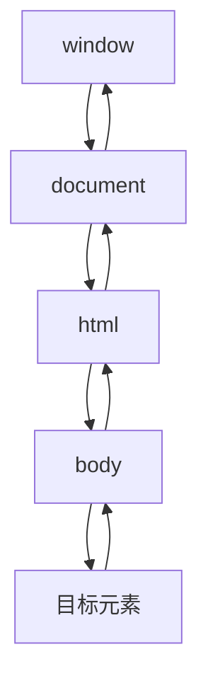
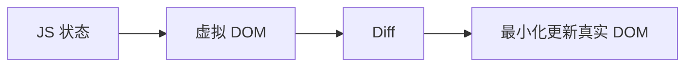

# DOM 专题 · 常见面试题与最佳实践

> 本文档位于 `知识库/前端/常见问题/DOM专题/`，是 DOM 的面试题集与生产最佳实践。配套核心知识见《核心知识点详解.md》。
>
> 15 道高频题 + 生产场景 + 完整 Checklist，覆盖节点操作、事件机制、DOM 性能、虚拟 DOM 等面试常考点。

---

## 一、基础概念类

### 1. 什么是 DOM？DOM 树是怎么构建的？

**核心答案**：DOM 是浏览器把 HTML 解析成的可变对象树，JS 通过它读写页面。构建流程：字节流 → 字符 → Token → 节点 → DOM 树。


<!-- -->

**关键认知**：

- DOM 是 JS 与 HTML 的"桥梁"：HTML 是静态文本，DOM 是可变的树形对象。
- 改 DOM 不改变 `.html` 文件，只改变内存中的树。
- 遇到 `<script>` 会暂停解析去执行 JS（同步脚本阻塞渲染）。

---

### 2. `querySelectorAll` 和 `getElementsBy*` 有什么区别？

**核心答案**：前者返回**静态 NodeList**（快照），后者返回**动态 HTMLCollection**（实时）。功能上前者更强大（CSS 选择器），性能上前者查询略慢但语义清晰。

```js
const snap = document.querySelectorAll(".item");   // 静态快照
const live = document.getElementsByClassName("item"); // 动态实时

const li = document.createElement("li");
li.className = "item";
document.body.appendChild(li);

snap.length;  // 不变（2）
live.length;  // 变（3）
```

**实际建议**：默认用 `querySelectorAll`；性能敏感的循环查询里，能用 `getElementById` 就用它。

---

### 3. `innerHTML`、`textContent`、`createElement` 有什么区别？哪个安全？

**核心答案**：`innerHTML` 解析 HTML 字符串（快但危险）；`textContent` 当纯文本（安全）；`createElement` 最可控（慢）。**用户输入绝不能拼进 `innerHTML`**（XSS 风险）。

```js
// 安全
box.textContent = userInput;

// 危险 ⚠️
box.innerHTML = `<p>${userInput}</p>`;
```

| 方式 | 速度 | 安全性 | 用途 |
|---|---|---|---|
| `innerHTML` | 快 | ⚠️ XSS 风险 | 批量静态 HTML |
| `textContent` | 中 | ✅ 安全 | 设纯文本 |
| `createElement` | 慢 | ✅ 安全 | 动态复杂结构 |

---

## 二、节点操作类

### 4. `childNodes` 和 `children` 有什么区别？

**核心答案**：`childNodes` 返回所有子节点（**含文本节点、注释**）；`children` 只返回**元素子节点**。

```js
ul.childNodes;    // 含文本节点（换行/空格也是文本）
ul.children;      // 只有元素节点
ul.firstChild;    // 可能是文本节点
ul.firstElementChild;  // 一定是元素节点
```

**为什么重要**：HTML 里的换行和缩进会生成文本节点，用 `childNodes` 容易拿到"看不见的空文本"，操作节点时容易出错。

---

### 5. 批量创建节点时怎么避免多次重排？

**核心答案**：用 `DocumentFragment`（文档片段）先在内存里攒，再一次插入；或先 `display:none` 离线操作再显示。

```js
// 错：1000 次 appendChild → 1000 次重排
const list = document.querySelector("ul");
for (let i = 0; i < 1000; i++) {
  const li = document.createElement("li");
  li.textContent = i;
  list.appendChild(li);
}

// 对：DocumentFragment 一次插入
const frag = document.createDocumentFragment();
for (let i = 0; i < 1000; i++) {
  const li = document.createElement("li");
  li.textContent = i;
  frag.appendChild(li);
}
list.appendChild(frag);   // 只触发 1 次重排
```

**其他手段**：

- 批量写样式用 `classList` / `cssText`。
- 离线操作：`display:none` → 改 → `display:block`。
- 动画用 `transform`/`opacity`（只合成）。

---

## 三、事件机制类（重点）

### 6. 事件传播分几个阶段？`target` 和 `currentTarget` 有什么区别？

**核心答案**：三个阶段——**捕获 → 目标 → 冒泡**。`target` 是真正触发事件的元素；`currentTarget` 是绑定监听器的元素。



<!-- -->

```js
list.addEventListener("click", (e) => {
  e.target;         // 点到的 <li>（真正触发）
  e.currentTarget;  // <ul>（绑定监听的元素）
});
```

**默认行为**：`addEventListener` 默认在**冒泡阶段**触发；`addEventListener(..., true)` 在**捕获阶段**触发。

**`target` vs `currentTarget`（必考）**：委托场景下 `target` 是子元素，`currentTarget` 是父元素。

---

### 7. 什么是事件委托？有什么好处？怎么实现？

**核心答案**：把子元素的事件绑定到父元素上，利用**冒泡**统一处理。好处：监听器少（省内存）、动态元素无需重绑、集中管理。

```js
// 父元素绑一次
document.querySelector("ul").addEventListener("click", (e) => {
  const li = e.target.closest("li");   // 向上找到 li
  if (!li) return;                     // 空白处忽略
  console.log(li.textContent);
});
```

**配合 `closest()`**：从当前元素向上找匹配选择器的祖先（含自身），委托时定位目标最常用。

**为什么动态元素无需重绑**：因为事件绑定在父元素上，新加的子元素触发的 click 会冒泡到父元素被捕获。

---

### 8. `preventDefault()` 和 `stopPropagation()` 有什么区别？

**核心答案**：`preventDefault()` 阻止**默认行为**（跳转/提交/刷新）；`stopPropagation()` 阻止**事件继续传播**（冒泡/捕获）。

```js
// 阻止表单提交（默认行为）
form.addEventListener("submit", (e) => {
  e.preventDefault();        // 页面不刷新
});

// 阻止冒泡（父元素收不到）
btn.addEventListener("click", (e) => {
  e.stopPropagation();       // 事件不向上传播
});

// 阻止冒泡 + 阻止同元素后续监听器
e.stopImmediatePropagation();
```

**关键区别**：阻止默认行为**不会**阻止冒泡；反之亦然。两者独立。

---

### 9. `DOMContentLoaded` 和 `load` 事件有什么区别？

**核心答案**：`DOMContentLoaded` 在 **DOM 树构建完成**后触发（不必等样式/图片）；`load` 在**所有资源加载完**后触发。

```js
document.addEventListener("DOMContentLoaded", () => {
  // DOM 就绪，可操作节点
});
window.addEventListener("load", () => {
  // 图片/样式/脚本全部加载完成
});
```

**实际意义**：尽早操作 DOM 用 `DOMContentLoaded`（更快）；需要测量图片尺寸、依赖资源完整加载用 `load`。

---

### 10. `mouseenter` 和 `mouseover` 有什么区别？

**核心答案**：`mouseenter`/`mouseleave` **不冒泡**；`mouseover`/`mouseout` **冒泡**。

```js
// mouseenter：进入元素（含子元素）才触发，不冒泡
el.addEventListener("mouseenter", () => {});

// mouseover：进入元素或子元素都会触发，会冒泡
el.addEventListener("mouseover", () => {});
```

**实际影响**：做"鼠标移入面板显示、移出隐藏"用 `mouseenter`/`mouseleave`，避免进出子元素时反复触发。

---

## 四、属性与样式类

### 11. `getAttribute` 和直接访问属性有什么区别？

**核心答案**：`getAttribute` 返回**原始字符串**（HTML 里的值）；直接 `.属性` 返回**处理后的值**（相对地址变绝对、当前值 vs 初始值）。

```js
// href
a.getAttribute("href");   // "/page"（原始值）
a.href;                   // "https://example.com/page"（绝对地址）

// value
input.value;               // 当前输入值（可能被用户改过）
input.getAttribute("value"); // 初始值（HTML 里写的）
```

**常见坑**：想读"用户在输入框输入了什么"用 `input.value`；想读"初始占位值"用 `getAttribute("value")`。

---

### 12. `classList` 和 `className` 有什么区别？

**核心答案**：`classList` 是操作类名的现代 API（`add/remove/toggle/contains`），比字符串拼接安全可读。

```js
// classList（推荐）
el.classList.add("active");
el.classList.remove("active");
el.classList.toggle("active");
el.classList.contains("active");

// className（老式，整体覆盖）
el.className = "box active";
```

**为什么推荐 classList**：不会误删其他类、语义清晰、便于判断存在性。

---

## 五、性能类

### 13. 为什么操作 DOM 慢？怎么优化？

**核心答案**：操作 DOM 会触发**重排（Reflow）**和**重绘（Repaint）**，且 JS 引擎与渲染引擎跨边界有开销。优化方向：批量插入、合并样式、缓存查询、避免循环读写。

**优化手段**：

```js
// ① DocumentFragment 批量插入（见第 5 题）

// ② 合并样式，用 class
el.className = "active";

// ③ 缓存查询结果
const el = document.querySelector(".item");  // 循环外用
for (let i = 0; i < 100; i++) el.style.left = i + "px";

// ④ 读布局属性会强制同步回流
el.offsetHeight;        // 强制立即重排
```

**原则**：**批量写、批量读，不要在循环里读写交替**。

---

### 14. 什么是虚拟 DOM？它和真实 DOM 什么关系？

**核心答案**：虚拟 DOM 是用 JS 对象模拟 DOM 树，先在内存里 Diff 算差异，再批量最小化更新真实 DOM。



<!-- -->

```js
// React 的 JSX 本质是创建虚拟 DOM 对象
const vnode = { type: "ul", props: {}, children: [...] };
```

**为什么有虚拟 DOM**：跨平台（渲染到 DOM/Canvas/Native）、性能（避免全量重建）、声明式（框架负责怎么改）。

**虚拟 DOM 一定比直接操作 DOM 快吗？不一定**。它的价值是"让框架替你聪明地操作 DOM"——在大规模、高频、不可控更新下，把"每次全量重建"变成"增量最小更新"。极简精确场景直接操作反而更快。

---

## 六、综合实践类

### 15. 用原生 JS 实现一个"点击列表项删除该项"（考察事件委托 + 节点删除）

**核心答案**：父元素绑定一次 click，用 `closest` 定位 `li`，`remove()` 删除。

```html
<ul id="list">
  <li>苹果 <button>删除</button></li>
  <li>香蕉 <button>删除</button></li>
</ul>
```

```js
document.getElementById("list").addEventListener("click", (e) => {
  // 点到删除按钮
  const btn = e.target.closest("button");
  if (!btn) return;
  btn.closest("li").remove();   // 删除所在 li
});
```

**考察点**：事件委托（绑定在父）、`closest`（定位）、节点删除（`remove`）。

---

## 七、生产最佳实践

### 7.1 查询与缓存

- DOM 查询结果缓存到变量，别在循环里反复查询。
- 热路径用 `getElementById`，一般用 `querySelectorAll`。
- 明确 NodeList（静态）与 HTMLCollection（动态）差异。

### 7.2 节点操作

- 批量插入用 `DocumentFragment`。
- 设纯文本用 `textContent`，别拼 `innerHTML`（防 XSS）。
- 增删节点用现代 API：`append`/`prepend`/`after`/`before`/`remove`/`replaceWith`。

### 7.3 事件

- 多用事件委托（监听器少、动态生效）。
- 委托时用 `closest()` 定位目标。
- 需要移除监听时，绑定具名函数（便于 `removeEventListener`）。
- 事件处理器清理：组件卸载时移除监听/定时器（防内存泄漏）。

### 7.4 样式

- 批量改样式用 `classList`，样式放 CSS 里。
- 动画用 `transform`/`opacity`（只合成）。
- 读计算样式用 `getComputedStyle`（`el.style` 只读内联）。

### 7.5 防 XSS

- 用户输入永远别拼 `innerHTML`。
- 需要渲染富文本用成熟的 sanitize 库（如 DOMPurify）。

---

## 八、Checklist

- 我能说清 DOM 是什么、DOM 树怎么构建。
- 我知道 `querySelectorAll`（静态）与 `getElementsBy*`（动态）的区别。
- 我知道 `innerHTML`/`textContent`/`createElement` 与 XSS 红线。
- 我知道 `childNodes` 与 `children` 的区别。
- 我能用 DocumentFragment 批量插入。
- 我能讲清事件三阶段（捕获/目标/冒泡）。
- 我能分清 `target` 与 `currentTarget`。
- 我能用事件委托 + `closest` 实现动态列表处理。
- 我能分清 `preventDefault` 与 `stopPropagation`。
- 我知道 `DOMContentLoaded` 与 `load` 的区别。
- 我知道为什么操作 DOM 慢、怎么优化。
- 我能说清虚拟 DOM 的本质（不是更快，是让框架聪明地操作）。

---

## 九、一句话总纲

> DOM 是浏览器把 HTML 解析成的可变对象树，JS 通过它读写页面。掌握"查"（`querySelectorAll` 静态 vs `getElementsBy*` 动态）、"改"（`createElement`+`appendChild`、`classList`、`textContent` 防 XSS）、"事件"（捕获→目标→冒泡、`target` vs `currentTarget`、事件委托+`closest`）、"性能"（DocumentFragment 批量插入、缓存查询、避免循环读写、`transform` 动画）。虚拟 DOM 不是比操作 DOM 快，而是让框架替你增量更新。能把这些讲清楚，DOM 这一关就过了。
