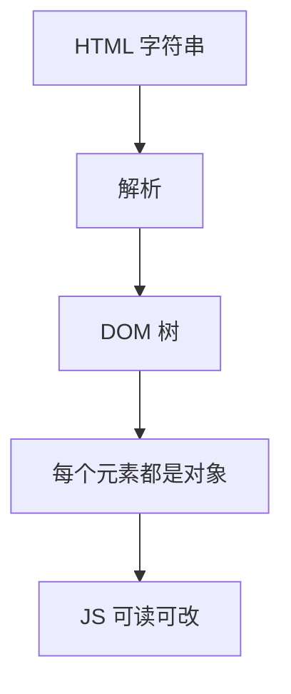
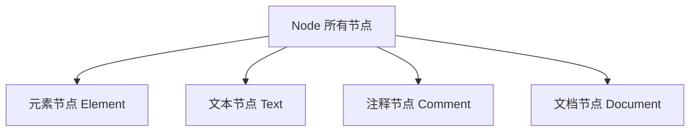
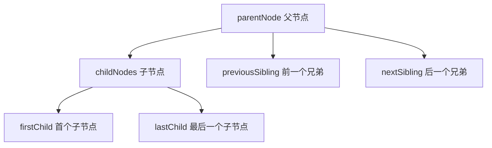
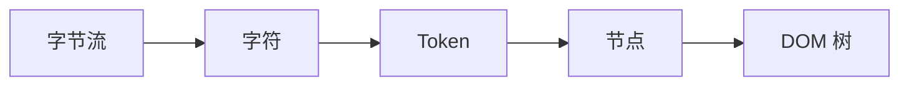
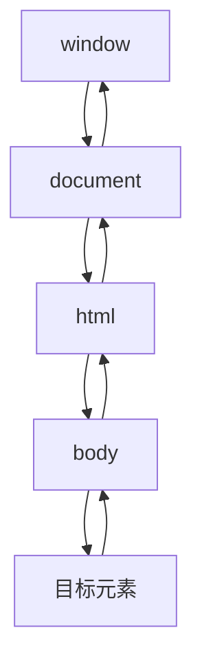
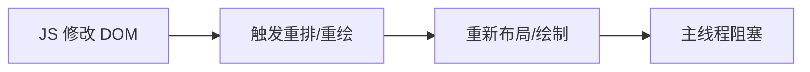
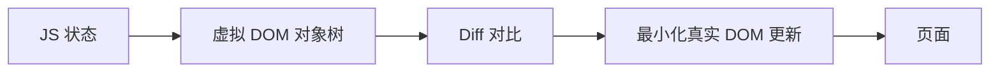

# DOM 专题 · 核心知识点详解

> 本文档位于 `知识库/前端/常见问题/DOM专题/`，系统梳理 DOM 的树结构、节点查询与操作、属性与样式、事件机制、性能优化与框架虚拟 DOM，配合 Mermaid 图与代码示例辅助理解。配套面试题见《常见面试题与最佳实践.md》。
>
> 读完应能解释清楚"DOM 树是什么""节点查询与创建的 API""捕获与冒泡、事件委托""为什么操作 DOM 慢、怎么优化""虚拟 DOM 是什么、和真实 DOM 什么关系"。

---

## 一、DOM 是什么

### 1.1 定义

**DOM（Document Object Model，文档对象模型）**：浏览器把 HTML 文档解析成的一棵**树形对象结构**，每个标签、文本、属性都变成树上的一个"节点对象"。JavaScript 通过操作这棵树来改变页面。



<!-- -->

```html
<!-- 原始 HTML -->
<ul id="list">
  <li class="item">苹果</li>
  <li class="item">香蕉</li>
</ul>
```

```js
// 通过 DOM 操作页面：document 是整棵树的入口
const list = document.getElementById("list");
const firstLi = list.firstElementChild;
firstLi.textContent = "草莓";   // 页面上的"苹果"立刻变"草莓"
```

### 1.2 关键认知

- **DOM 是 JS 与 HTML 之间的"桥梁"**：HTML 是静态文本，DOM 是浏览器维护的可变对象树。
- **DOM 不是 HTML 源码本身**：改 DOM 不改变 `.html` 文件，只改变浏览器内存里的树。
- **每个浏览器都实现 DOM 标准**：`document` 是全局入口，`window.document` 指向当前文档。
- **DOM 是分层的**：`document` → `documentElement`（`<html>`）→ `body`/`head` → …→ 文本节点。

---

## 二、DOM 树与节点

### 2.1 节点类型



<!-- -->

| 类型 | `nodeType` | 例子 | 说明 |
|---|---|---|---|
| 元素节点 | `1` | `<div>`、`<p>` | 最常见的节点，代表标签 |
| 文本节点 | `3` | `"苹果"` | 元素里的文字 |
| 注释节点 | `8` | `<!-- 注释 -->` | 注释 |
| 文档节点 | `9` | `document` | 整棵树的根 |

```js
const div = document.querySelector("div");
div.nodeType;          // 1（元素）
div.firstChild.nodeType; // 3（如果第一个子节点是文本）
div.nodeName;          // "DIV"
div.tagName;           // "DIV"（元素才有的属性）
```

### 2.2 节点间关系



<!-- -->

```js
const ul = document.querySelector("ul");
ul.parentNode;        // <body>（父节点）
ul.childNodes;        // 所有子节点（含文本节点）
ul.children;          // 只有元素子节点（推荐）
ul.firstElementChild; // 第一个元素子节点
ul.lastElementChild;  // 最后一个元素子节点
ul.previousElementSibling;  // 前一个元素兄弟
ul.nextElementSibling;      // 后一个元素兄弟
```

**关键区别**：

- `childNodes` 包含**文本节点和注释**；`children` 只包含**元素节点**。
- `firstChild` 可能拿到文本（换行/空格）；`firstElementChild` 一定拿到元素。
- **操作样式和布局用元素节点相关的 `Element` 系列属性**（`children`、`firstElementChild` 等）。

### 2.3 DOM 树的构建过程（简要）



<!-- -->

浏览器拿到 HTML 字节流后：**解码成字符 → 分词成 Token → 构建节点 → 组成树**。遇到 `<script>` 会暂停解析去执行 JS（这就是同步脚本阻塞渲染的原因），细节见「渲染原理」专题。

---

## 三、节点查询

### 3.1 查询 API 大全

```js
// —— 最常用 ——
document.getElementById("id");        // 按 id（最快）
document.querySelector(".item");      // CSS 选择器，返回第一个匹配
document.querySelectorAll(".item");   // CSS 选择器，返回静态 NodeList

// —— 按标签 / 类 / name ——
document.getElementsByTagName("li");  // 动态 HTMLCollection
document.getElementsByClassName("item"); // 动态 HTMLCollection
document.getElementsByName("email");  // 按 name（表单常用）

// —— 特定上下文 ——
document.documentElement;  // <html>
document.body;             // <body>
document.head;             // <head>
```

### 3.2 querySelector vs getElementsBy*

| API | 返回 | 是否动态 | 匹配方式 |
|---|---|---|---|
| `querySelector(All)` | NodeList（`All` 为静态快照） | **静态** | CSS 选择器（强大） |
| `getElementsByTagName/Class` | HTMLCollection | **动态** | 标签/类名 |
| `getElementById` | 单个元素 | — | id |

```js
// 动态 vs 静态的关键差异
const live = document.getElementsByClassName("item");
const snap = document.querySelectorAll(".item");

const li = document.createElement("li");
li.className = "item";
document.body.appendChild(li);

live.length;  // 3（动态：自动感知新增）
snap.length;  // 2（静态快照：不会变）
```

**实际建议**：功能上 `querySelectorAll` 足够，语义更清晰；**性能敏感**（如渲染循环里反复查询）时，能用 `getElementById` 就用它（原生哈希查找）。

---

## 四、节点操作

### 4.1 创建

```js
// 创建元素
const li = document.createElement("li");
li.textContent = "苹果";         // 设文本（防 XSS，比 innerHTML 安全）

// 创建文本节点
const text = document.createTextNode("苹果");

// 创建片段（批量插入性能神器）
const frag = document.createDocumentFragment();
```

### 4.2 插入

```js
const list = document.querySelector("ul");

// 追加到末尾
list.appendChild(li);

// 插入到某个节点之前
list.insertBefore(li, list.firstElementChild);

// 更现代的 insertAdjacentHTML / insertAdjacentElement
li.insertAdjacentHTML("beforebegin", "<hr>");
// 位置：beforebegin / afterbegin / beforeend / afterend

// 统一 API：after / before / prepend / append（现代浏览器）
list.append(li);            // 末尾
list.prepend(li);           // 开头
li.after(anotherLi);        // 在其后
li.before(anotherLi);       // 在其前
```

### 4.3 删除与替换

```js
// 删除
li.remove();            // 现代 API（推荐）
list.removeChild(li);   // 传统 API

// 替换
list.replaceChild(newLi, li);
li.replaceWith(newLi);  // 现代 API
```

### 4.4 克隆

```js
const clone = li.cloneNode();       // 浅克隆（不克隆子节点）
const deepClone = li.cloneNode(true); // 深克隆（克隆子节点）
```

### 4.5 innerHTML vs textContent vs createElement

```js
// innerHTML：解析 HTML 字符串（快，但危险）
list.innerHTML = "<li>苹果</li><li>香蕉</li>";

// textContent：当作纯文本（安全）
li.textContent = "<b>苹果</b>";   // 显示字面量，不会被解析成标签

// createElement + appendChild：最安全、最可控、最慢
const li = document.createElement("li");
li.textContent = "苹果";
list.appendChild(li);
```

| 方式 | 速度 | 安全性 | 用途 |
|---|---|---|---|
| `innerHTML` | 快 | ⚠️ 有 XSS 风险 | 批量静态 HTML |
| `textContent` | 中 | ✅ 安全 | 设纯文本 |
| `createElement` | 慢 | ✅ 安全 | 动态复杂结构 |

**红线**：**永远不要把用户输入直接拼进 `innerHTML`**——这是 XSS 攻击的主要来源。

---

## 五、属性与样式操作

### 5.1 属性（Attribute）

```js
// 读
img.getAttribute("src");     // 读取属性
img.src;                     // 直接访问属性（更常用）

// 写
img.setAttribute("src", "/a.png");
img.src = "/a.png";

// 移除
img.removeAttribute("alt");

// 判断
img.hasAttribute("src");     // true
```

**关键区别：`getAttribute` 与直接 `.属性`**：

- `input.value` 是**当前值**（可能被用户改过）；`input.getAttribute("value")` 是**初始值**。
- `a.href` 返回**绝对地址**；`a.getAttribute("href")` 返回**原始字符串**。

### 5.2 data-* 自定义属性

```html
<div id="card" data-id="42" data-user-role="admin">卡片</div>
```

```js
const card = document.getElementById("card");
card.dataset.id;         // "42"
card.dataset.userRole;   // "admin"（data-user-role → userRole，横杠转驼峰）
card.dataset.newKey = "v";  // 写入 data-new-key="v"
```

**用途**：在元素上挂少量业务数据，配合事件委托读取，不用额外建 Map。

### 5.3 class 操作（classList）

```js
const el = document.querySelector(".box");

el.classList.add("active");        // 添加类
el.classList.remove("active");     // 移除类
el.classList.toggle("active");     // 切换
el.classList.contains("active");   // 判断

// 对比老写法
el.className = "box active";       // 直接覆盖整个 class 字符串
el.className += " active";         // 追加
```

**`classList` 是操作类名的标准方式**，比字符串拼接安全、可读。

### 5.4 内联样式

```js
const el = document.querySelector(".box");

el.style.color = "red";            // 单个样式
el.style.fontSize = "16px";        // CSS 属性名转小驼峰
el.style.cssText = "color:red;font-size:16px";  // 一次设置多个

// 读取计算后样式（含样式表/继承的值）
getComputedStyle(el).color;
```

**注意**：`el.style.xxx` 只能读/写**内联样式**；读样式表算出的值要用 `getComputedStyle`。频繁写 `style` 属性会触发重排重绘——性能敏感时用 `classList` 切换类，把样式放在 CSS 里。

---

## 六、事件机制（重点）

### 6.1 事件三阶段：捕获 → 目标 → 冒泡



<!-- -->

```js
// 点击一个按钮时，事件按"捕获"从根向下，到目标，再按"冒泡"向上
document.addEventListener("click", (e) => {
  console.log("捕获阶段", e.target.tagName);
}, true);   // true = 捕获阶段触发

document.addEventListener("click", (e) => {
  console.log("冒泡阶段", e.target.tagName);
});         // 默认 false = 冒泡阶段触发
```

**三阶段**：

1. **捕获（Capturing）**：`window` → 目标元素的祖先，向下走。
2. **目标（Target）**：事件到达目标元素本身。
3. **冒泡（Bubbling）**：目标元素向上回传，一直到 `window`。

**实际影响**：

- 默认监听器在**冒泡阶段**触发。
- `addEventListener(..., true)` 让监听器在**捕获阶段**先触发。
- 想让事件在父层"拦截"（如提前处理），用捕获阶段；想统一处理子元素事件，用冒泡 + 事件委托。

### 6.2 事件对象 Event

```js
btn.addEventListener("click", (e) => {
  e.target;              // 真正触发事件的元素（子元素）
  e.currentTarget;       // 绑定监听器的元素（this）
  e.type;                // "click"
  e.preventDefault();    // 阻止默认行为（跳转/提交/刷新）
  e.stopPropagation();   // 阻止冒泡（+捕获）
  e.stopImmediatePropagation(); // 阻止冒泡 + 阻止后续同元素监听器
  e.clientX / e.clientY; // 鼠标坐标（视口）
});
```

**`target` vs `currentTarget`（高频考点）**：

```html
<ul id="list"><li>苹果</li></ul>
```

```js
list.addEventListener("click", (e) => {
  e.target;         // 点到的 <li>（真正触发的元素）
  e.currentTarget;  // <ul>（绑定监听的元素）
});
```

### 6.3 事件委托（Event Delegation）

```js
// 错：给每个 li 单独绑定，新增 li 还要重新绑定
document.querySelectorAll("li").forEach((li) => {
  li.addEventListener("click", () => console.log(li.textContent));
});

// 对：在父元素上绑一次，利用冒泡
document.querySelector("ul").addEventListener("click", (e) => {
  const li = e.target.closest("li");   // 向上找到 li
  if (!li) return;                     // 点到 ul 空白处就忽略
  console.log(li.textContent);
});
```

**事件委托的好处**：

- **监听器少**：1 个代替 N 个，内存省。
- **动态元素无需重绑**：后面新增的 `<li>` 自动生效。
- **统一处理**：过滤、防抖等集中管理。

**配套 API `closest()`**：从当前元素向上找匹配选择器的祖先（含自身），委托时定位目标最常用。

### 6.4 常见事件

| 类别 | 事件 |
|---|---|
| 鼠标 | `click`、`dblclick`、`mousedown/up/move`、`mouseenter/leave`、`contextmenu` |
| 键盘 | `keydown`、`keyup`、`keypress` |
| 表单 | `input`、`change`、`submit`、`focus`、`blur` |
| 滚动/触摸 | `scroll`、`touchstart/move/end`、`wheel` |
| 窗口 | `load`、`resize`、`hashchange`、`beforeunload` |
| 生命周期 | `DOMContentLoaded`、`load` |

```js
// DOMContentLoaded：DOM 就绪即可操作，不必等图片加载
document.addEventListener("DOMContentLoaded", () => {
  // 此时 DOM 已构建，样式/图片可能还在加载
});
// load：全部资源加载完
window.addEventListener("load", () => {});
```

**注意**：`mouseenter`/`mouseleave` **不冒泡**（适合进出面板），`mouseover`/`mouseout` 冒泡（会触发父级的进入/离开）。

### 6.5 自定义事件

```js
// 创建并派发自定义事件
const evt = new CustomEvent("toast", { detail: { msg: "保存成功" } });
document.dispatchEvent(evt);

// 监听
document.addEventListener("toast", (e) => {
  console.log(e.detail.msg);   // 数据挂在 detail 上
});
```

**用途**：组件间解耦通信（尤其无框架的原生 JS 场景）。

---

## 七、DOM 性能优化

### 7.1 为什么操作 DOM 慢



<!-- -->

- 每次改动 DOM 都可能触发**重排（Reflow）**和**重绘（Repaint）**。
- JS 引擎（V8）和渲染引擎是两个世界，跨边界操作有开销。
- 频繁的 DOM 操作是页面卡顿的主要来源。

### 7.2 优化手段

**① 批量操作：DocumentFragment**

```js
// 错：循环里逐个 append，触发 N 次重排
const list = document.querySelector("ul");
for (let i = 0; i < 1000; i++) {
  const li = document.createElement("li");
  li.textContent = i;
  list.appendChild(li);       // 1000 次插入 → 1000 次重排
}

// 对：先在片段里攒，一次性插入
const frag = document.createDocumentFragment();
for (let i = 0; i < 1000; i++) {
  const li = document.createElement("li");
  li.textContent = i;
  frag.appendChild(li);
}
list.appendChild(frag);       // 只触发 1 次重排
```

**② 合并样式修改 / 用 class**

```js
// 错：多次写样式
el.style.width = "100px";
el.style.height = "200px";
el.style.margin = "10px";

// 对：一次类切换
el.className = "active";
```

**③ 离线操作**

```js
// 先脱离文档流操作，再插回
el.style.display = "none";
// ...大量修改...
el.style.display = "block";   // 只触发 1-2 次重排
```

**④ 缓存查询结果**

```js
// 错：循环里反复查询
for (let i = 0; i < 100; i++) {
  document.querySelector(".item").style.left = i + "px";
}

// 对：先缓存
const el = document.querySelector(".item");
for (let i = 0; i < 100; i++) {
  el.style.left = i + "px";
}
```

**⑤ 用 transform/opacity 做动画**（只合成，不重排）——见「渲染原理」专题。

**⑥ 事件委托 + 防抖节流**——减少监听器数量与触发频率。

### 7.3 读布局属性会强制同步回流

```js
// 读这些会强制浏览器立即重新布局，导致性能问题
el.offsetHeight;           // 强制同步回流
el.getBoundingClientRect(); // 强制同步回流
```

**原则**：**批量写、批量读，不要在循环里读写交替**。

---

## 八、虚拟 DOM 与真实 DOM

### 8.1 什么是虚拟 DOM



<!-- -->

**虚拟 DOM（Virtual DOM）**：用 JS 对象模拟 DOM 树结构，先在内存里算出差异，再**批量最小化**更新真实 DOM。

```jsx
// React 里你写的 JSX 本质是创建虚拟 DOM 对象
const vnode = {
  type: "ul",
  props: { id: "list" },
  children: [
    { type: "li", props: {}, children: ["苹果"] },
    { type: "li", props: {}, children: ["香蕉"] },
  ],
};
```

### 8.2 为什么要有虚拟 DOM

- **跨平台**：虚拟 DOM 是 JS 对象，可渲染到 DOM、Canvas、Native（React Native）。
- **性能**：避免"每次状态变化都重建整个页面"，Diff 后只改真正变化的部分。
- **声明式**：开发者描述"界面应该是什么样"，框架负责"怎么改成那样"。

### 8.3 虚拟 DOM 一定比直接操作 DOM 快吗

**不一定**。虚拟 DOM 的收益在于**避免无脑重建 + 跨平台 + 声明式**。对"精确知道要改哪"的极简场景，直接操作 DOM 反而更快。它解决的核心问题是**大规模、高频、不可控的更新**下，把"每次全量重建"变成"增量最小更新"。

> 一句话：**虚拟 DOM 不是"比操作 DOM 快"，而是"让框架替你聪明地操作 DOM"。**

### 8.4 真实 DOM 操作用在框架之外

即使在 React/Vue 项目里，仍会直接操作 DOM：获取坐标、焦点管理、测量尺寸、与第三方库（图表、富文本）集成——通过 `ref` / `nextTick`。

---

## 九、常见陷阱

### 9.1 NodeList 与 HTMLCollection 搞混

- `querySelectorAll` → **静态 NodeList**（快照）。
- `getElementsBy*` → **动态 HTMLCollection**（实时）。

### 9.2 在循环里访问 length

```js
// 错：每次循环都重新求 length（对动态集合尤其糟）
const items = document.getElementsByClassName("item");
for (let i = 0; i < items.length; i++) { ... }

// 对：缓存 length
const items = document.querySelectorAll(".item");
const len = items.length;
for (let i = 0; i < len; i++) { ... }
```

### 9.3 事件监听器重复绑定

```js
// 错：同一函数绑定两次 → 触发两次
function handler() { console.log("hi"); }
btn.addEventListener("click", handler);
btn.addEventListener("click", handler);   // 重复！两次都触发

// 对：移除旧监听再绑定，或用命名函数统一管理
btn.removeEventListener("click", handler);
btn.addEventListener("click", handler);
```

### 9.4 innerHTML 注入用户输入 → XSS

```js
// 错：把用户输入直接拼进 HTML
box.innerHTML = `<p>${userInput}</p>`;   // ⚠️ 用户输入可注入 <script>

// 对：用 textContent / createElement
box.textContent = userInput;
```

### 9.5 内存泄漏：未清理的事件/定时器

```js
// 错：定时器/监听器从不清理（组件销毁后仍占用）
setInterval(() => { ... }, 1000);

// 对：不再需要时清理
const id = setInterval(() => { ... }, 1000);
clearInterval(id);
```

### 9.6 拿不到元素：脚本放在 DOM 之前执行

```js
// 错：script 在 body 之前，此时 #box 还不存在
<script>document.getElementById("box").style.color = "red";</script>

// 对：等 DOM 就绪
document.addEventListener("DOMContentLoaded", () => {
  document.getElementById("box").style.color = "red";
});
```

---

## 十、一句话总纲

> DOM 是浏览器把 HTML 解析成的**可变对象树**，JS 通过它读写页面。掌握四件事：**查**（`querySelector(All)` 静态 vs `getElementsBy*` 动态）、**改**（`createElement` + `appendChild`、`classList`、`dataset`，用 `textContent` 防 XSS）、**事件**（捕获→目标→冒泡、`target` vs `currentTarget`、事件委托 + `closest`、`preventDefault`/`stopPropagation`）、**性能**（DocumentFragment 批量插入、合并样式、缓存查询、避免循环读写、`transform` 动画）。再理解**虚拟 DOM 是让框架替你聪明地操作 DOM**——不是更快，而是增量最小更新。能把"查改事件、委托优化、虚拟 DOM 的本质"讲清楚，DOM 这一关就过了。
