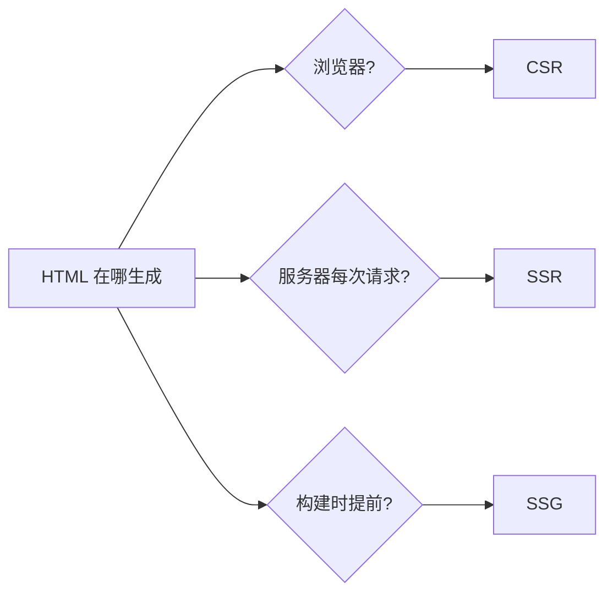
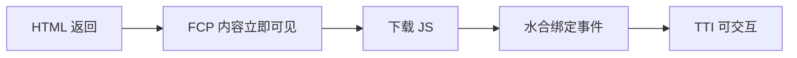
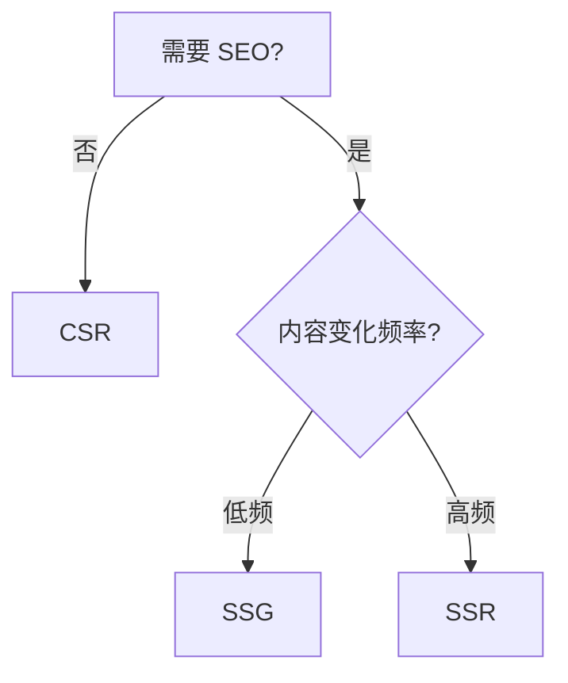

# 渲染模式（CSR / SSR / SSG）· 常见面试题与最佳实践

> 本文档位于 `知识库/前端/02框架与库/04渲染模式(CSR-SSR-SSG)/`，是渲染模式的面试题集与生产最佳实践。配套核心知识见《核心知识点详解.md》。
>
> 12 道高频题 + 生产场景 + 完整 Checklist，覆盖 CSR/SSR/SSG 概念、同构、水合、ISR、流式 SSR、选型等面试常考点。

---

## 一、概念类（必考）

### 1. 什么是 CSR、SSR、SSG？它们有什么区别？

**核心答案**：三者区别在"HTML 是谁、在什么时候生成的"——浏览器跑 JS 生成是 CSR，服务器按请求渲染是 SSR，构建时提前生成是 SSG。

| 模式 | 渲染位置 | 首次 HTML | 代表作 |
|---|---|---|---|
| CSR | 浏览器（客户端 JS） | 几乎空壳 | Vite / CRA |
| SSR | 服务器（每次请求） | 完整内容 | Next.js / Nuxt |
| SSG | 构建时（部署前） | 完整内容 | VitePress / Astro |



<!-- -->

**一句话**：CSR 首屏靠 JS 现渲染；SSR 每次请求服务器现渲染；SSG 部署前就渲染好存成静态文件。

---

### 2. SSR 和 SSG 有什么区别？

**核心答案**：渲染时机不同——SSR 每次请求时在服务器渲染，SSG 构建时就渲染好；SSR 适合内容实时变化，SSG 适合内容相对稳定。

```jsx
// SSR：每次请求都跑，数据实时
export async function getServerSideProps() {
  const data = await fetchData();  // 每次请求都执行
  return { props: { data } };
}

// SSG：构建时跑一次，数据固化
export async function getStaticProps() {
  const data = await fetchData();  // 构建时执行一次
  return { props: { data } };
}
```

| 维度 | SSR | SSG |
|---|---|---|
| 渲染时机 | 每次请求 | 构建时 |
| TTFB | 慢（每次算） | 最快（CDN 直出） |
| 服务器成本 | 高 | 零（纯静态） |
| 内容时效 | 实时 | 构建时固化 |
| 适合 | 个性化、实时数据 | 文档、博客、营销页 |

---

### 3. 什么是同构（Isomorphic）？什么是水合（Hydration）？

**核心答案**：同构是同一套组件代码在服务器和浏览器都能运行；水合是浏览器加载 JS 后，在服务器生成的现有 DOM 上绑定事件与状态，让它可交互。

```jsx
// 服务器：把组件渲染成 HTML 字符串
import { renderToString } from "react-dom/server";
const html = renderToString(<App />);

// 浏览器：不重建 DOM，直接接管现有 DOM（水合）
import { hydrateRoot } from "react-dom/client";
hydrateRoot(document.getElementById("root"), <App />);
```

**类比**：服务器渲染出的是"干 HTML"（能看不能点），浏览器加载 JS 后给它"注水"，才有交互能力。

**注意区别**：

| API | 作用 |
|---|---|
| `createRoot().render()` | 客户端渲染，从头建 DOM |
| `hydrateRoot()` | 水合，接管已有 DOM 不重建 |

---

## 二、原理与机制类（高频）

### 4. 为什么 SSR 首屏快，但 TTI 不一定快？

**核心答案**：SSR 的 HTML 直接带内容，FCP 很快；但交互要等浏览器下载 JS 并完成水合，这段"看得见、点不动"的窗口期导致 TTI 被推迟。



<!-- -->

- **FCP**：HTML 带内容 → 首屏很快。
- **TTI**：依赖 JS 下载 + 水合 → 大包体 JS 时 TTI 反而可能比 CSR 更晚被感知。
- **TBT（Total Blocking Time）**：水合阶段主线程被占用，期间用户点击无响应。
- **解决方案**：流式 SSR（先发可见部分）、选择性水合（局部先交互）、代码分割减小 JS 包。

---

### 5. 水合失败的常见原因？怎么避免？

**核心答案**：服务器与浏览器渲染的 HTML 不一致（mismatch）就会水合失败。常见来源：时间/随机数、依赖 `window` 的值、不同语言环境。

```jsx
// 错：服务器和浏览器渲染结果不一致
export default function Clock() {
  return <div>{new Date().toLocaleTimeString()}</div>;  // 两次渲染时间不同
}

// 对：不稳定内容只在浏览器渲染
export default function Clock() {
  const [now, setNow] = useState("");
  useEffect(() => setNow(new Date().toLocaleTimeString()), []);
  return <div>{now || "—"}</div>;
}
```

**避免手段**：

- 渲染结果必须两端一致（确定性渲染）。
- 浏览器专属的值（`window`、`document`、`localStorage`）放进 `useEffect`。
- 时间、随机数、用户代理等不稳定值延迟到客户端渲染。
- 若遇到 mismatch：优先修复根源，而不是用 `suppressHydrationWarning` 掩盖。

---

### 6. 什么是流式 SSR？什么是选择性水合？

**核心答案**：流式 SSR 不用等整页渲染完，边渲染边把 HTML 发给浏览器；选择性水合是哪个 Suspense 边界就绪就先水合哪个，不用等整棵树。

```jsx
// React 18：流式 SSR
import { renderToPipeableStream } from "react-dom/server";
const { pipe } = renderToPipeableStream(<App />);
pipe(res);  // 边渲染边发给客户端
```

**优点**：

- **流式**：慢的区块（大数据、慢接口）不阻塞快的区块，浏览器先看到已就绪部分。
- **选择性水合**：用户能更早与已就绪的部分交互，不必等全页。
- 两者配合，大幅改善 SSR 的 TTI 与 TBT。

---

### 7. 服务器直出的数据怎么传给浏览器？

**核心答案**：脱水（dehydrate）→ 传输 → 注水（rehydrate）。把服务器数据序列化塞进 HTML，浏览器读取反序列化。

```html
<!-- 服务器在 HTML 里塞数据 -->
<script>
  window.__INITIAL_DATA__ = { "posts": [...] };
</script>
```

```js
// 浏览器读取
const initialData = window.__INITIAL_DATA__;
```

**框架层面**：Next.js 的 `getServerSideProps` / `getStaticProps` 返回的 `props` 会自动执行这套流程。目的：避免客户端二次请求同样数据，也保证水合时两端数据一致。

---

## 三、选型与工程实践类（高频）

### 8. 什么场景选 CSR？什么场景选 SSR / SSG？

**核心答案**：看三个因素——要不要 SEO、内容变化频率、服务器成本承受力。



<!-- -->

| 场景 | 推荐 | 理由 |
|---|---|---|
| 博客/文档/官网 | SSG | 低频、强 SEO、零成本 |
| 后台管理系统 | CSR | 无需 SEO、交互复杂 |
| 电商详情页 | SSG + ISR | 量大但稳定，秒开 + 定时更新 |
| 新闻/个性化主页 | SSR | 实时 + SEO |
| 信息流/社交 | SSR + 客户端增强 | 首屏 SEO + 后续交互 |

---

### 9. 什么是 ISR？解决了什么问题？

**核心答案**：ISR（Incremental Static Regeneration）是 SSG 的增强——静态页 + 定时后台重建，兼顾速度与内容时效。

```jsx
// Next.js：ISR
export async function getStaticProps() {
  const data = await fetchData();
  return {
    props: { data },
    revalidate: 60,  // 60 秒后触发后台重建
  };
}
```

**流程**：

1. 构建时生成静态页，部署到 CDN（极快返回）。
2. 超过 `revalidate` 时间后，下一次访问触发后台重建。
3. 新内容替换旧缓存，用户感知不到重建过程。

**解决了**：SSG 内容时效差的痛点（改一次内容要全量重新构建部署）。

---

### 10. SSR 服务器压力大，怎么优化？

**核心答案**：从"少渲染、缓存渲染、更早发"三个方向——CDN 缓存、渲染结果缓存、流式 SSR、只对需要 SEO 的页面 SSR。

```js
// 1. 页面级缓存（Nginx / CDN）
// 缓存 SSR 输出的 HTML，TTFB 从几十 ms 降到个位数
Cache-Control: s-maxage=60, stale-while-revalidate

// 2. 应用层渲染缓存（Redis / LRU）
const key = req.url;
if (cache.has(key)) return cache.get(key);   // 直接返回渲染结果
const html = renderToString(<Page />);       // 没缓存才渲染
cache.set(key, html, 60_000);                // 缓存 60 秒
```

**其他手段**：

- **混合渲染**：只对需要 SEO 的页面 SSR，其余走 CSR。
- **流式 SSR**：先发首屏，降低等待。
- **边缘渲染（Edge / 边缘函数）**：渲染放到离用户更近的边缘节点。
- **按需水合**：减少水合工作量（见下题）。

---

### 11. 怎么减少水合的成本？

**核心答案**：水合成本 = 下载 JS + 遍历现有 DOM 绑定事件。手段：代码分割、Islands 架构、按需水合、减少客户端 JS。

- **代码分割**：路由级 `React.lazy` / `dynamic` 按需加载，减小首包。
- **Islands 架构（Astro）**：静态 HTML 为主体，只有交互组件才加载 JS：

```html
<!-- Astro：只有这个组件是客户端渲染 -->
<Counter client:load />
```

- **按需水合（Partial Hydration）**：部分交互区先水合，非交互区后水合或永不水合。
- **服务端状态 + SWR**：用 SWR / TanStack Query 接管客户端数据请求，避免重复请求。

```jsx
import useSWR from "swr";
function Profile() {
  const { data } = useSWR("/api/user", fetch);  // 缓存、轮询、乐观更新
  return <div>{data?.name}</div>;
}
```

---

### 12. 对比一下现代主流方案（Next.js / Nuxt / Astro）？

**核心答案**：Next.js（React 全栈，SSG/SSR/ISR 全支持）；Nuxt（Vue 生态，自动路由 + SSR）；Astro（内容优先，默认零 JS 的 SSG + Islands 混合）。

| 框架 | 生态 | 渲染模式 | 特点 |
|---|---|---|---|
| Next.js | React | SSG / SSR / ISR / CSR | 全栈，App Router + Server Components |
| Nuxt | Vue | SSR / SSG / CSR | 自动路由、自动导入，`nuxt generate` 即 SSG |
| Astro | 多框架 | SSG 优先 + Islands | 内容站神器，默认零 JS，可混用 React/Vue 组件 |
| Remix | React | 按需 SSR | 基于 Web 标准，渐进增强优先 |
| VitePress | Vue | SSG | 文档站 |

**选型建议**：

- 内容型站点（博客/文档）→ **Astro** 或 **VitePress**。
- 需要全栈（API + 页面 + 部署一体）→ **Next.js**。
- Vue 技术栈 → **Nuxt**。

---

## 四、生产最佳实践

### 4.1 首屏优化清单

- 需要 SEO 的页面用 SSG（内容稳定）或 SSR（内容实时）。
- SSR 尽量用流式输出 + 选择性水合。
- 客户端 JS 做路由级代码分割，减小首包。
- 首屏数据在服务器取好直出，避免二次请求（dehydrate/rehydrate）。
- 不稳定内容（时间、随机、window）放进 `useEffect`，保证两端一致。

### 4.2 服务器成本控制

- SSR 输出加 CDN / 应用层缓存。
- 只对需要 SEO 的页面 SSR，其余页面 CSR。
- 用边缘函数（Edge）把渲染推到离用户近的节点。
- 大流量场景用 SSG + ISR 替代纯 SSR。

### 4.3 SEO 清单

- 首选 SSG / SSR（爬虫能拿到完整 HTML）。
- CSR 至少保证 title/description meta 标签（`react-helmet` / Nuxt head）。
- CSR 可考虑构建时预渲染（prerender）供爬虫。
- 内容型页面避免纯客户端取数渲染。

### 4.4 水合安全清单

- 渲染结果必须两端一致（确定性渲染）。
- 浏览器 API 只在 `useEffect` / `onMounted` 里用。
- 用 `revalidate`/ISR 时注意数据版本与 HTML 一致。
- mismatch 先查根源，别用 `suppressHydrationWarning` 掩盖。

---

## 五、一句话总纲

> CSR 让浏览器跑 JS 渲染（交互强、首屏慢、SEO 差）；SSR 让服务器每次请求渲染完整 HTML（首屏快、SEO 好、费服务器）；SSG 构建时生成静态文件放 CDN（最快最稳、内容靠 ISR 补时效）。三者核心是**同构 + 水合**——同一套代码双端跑，服务器直出 HTML，浏览器 hydrate 接管交互。能答出"三者区别""为什么 SSR FCP 快但 TTI 不一定快""水合 mismatch 怎么避免""流式 SSR 与选择性水合""ISR 是什么""按 SEO + 内容频率 + 服务器成本选型"，就是对这个知识点的完整掌握。
