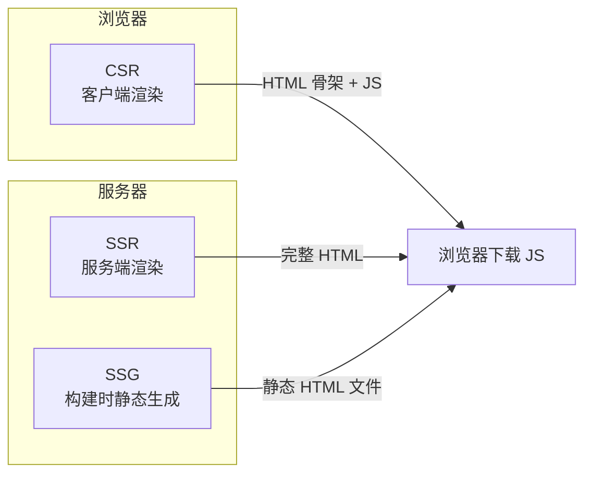
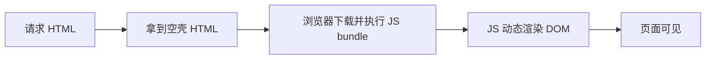
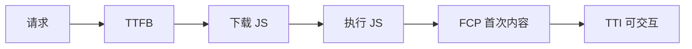
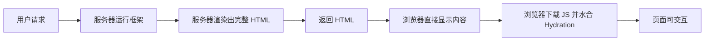
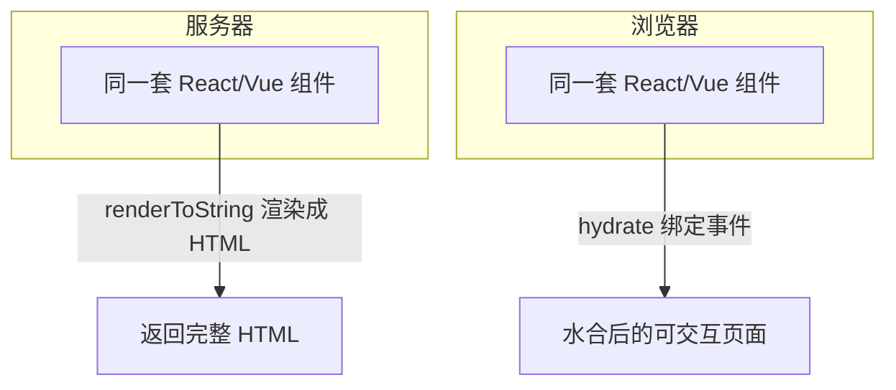
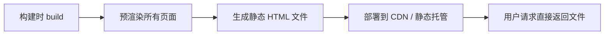
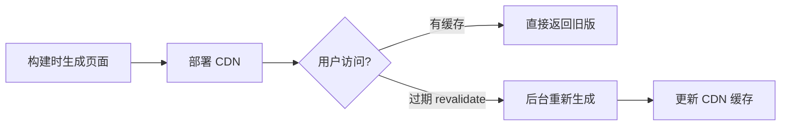
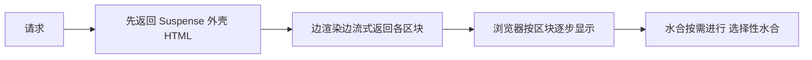
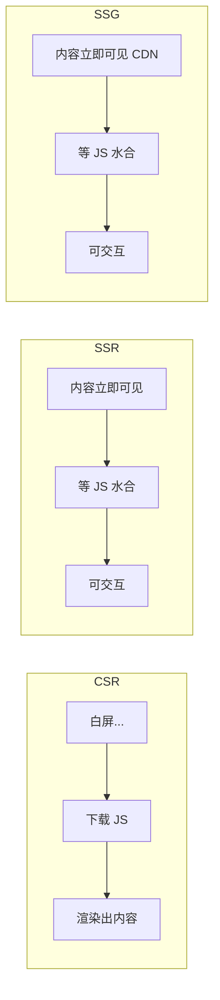
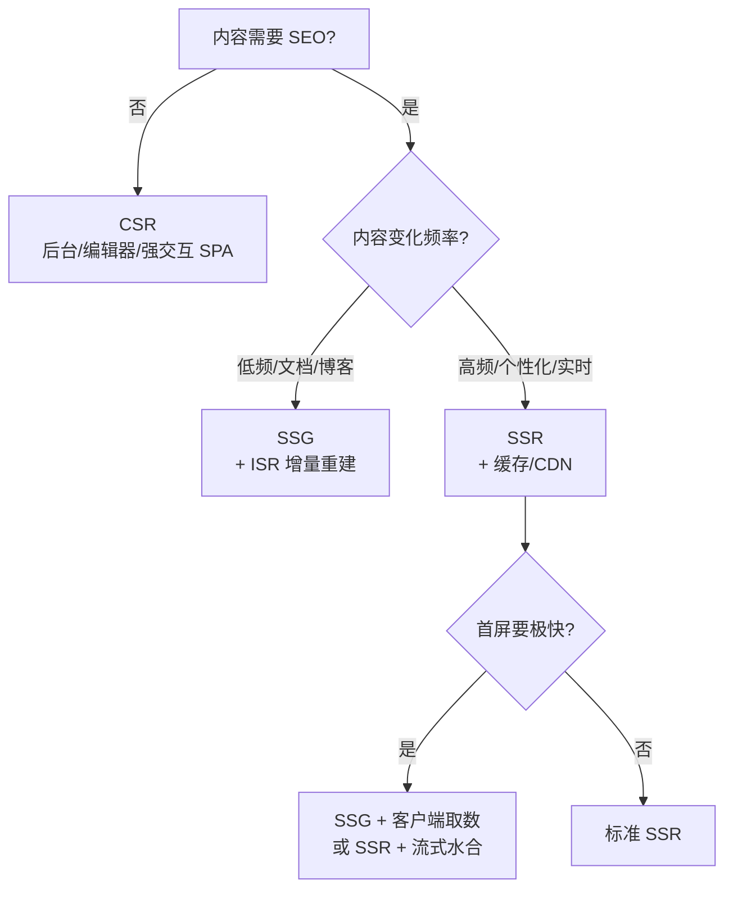

# 渲染模式（CSR / SSR / SSG）· 核心知识点详解

> 本文档位于 `知识库/前端/02框架与库/04渲染模式(CSR-SSR-SSG)/`，系统梳理前端三大渲染模式：CSR 客户端渲染、SSR 服务端渲染、SSG 静态站点生成。配套面试题见《常见面试题与最佳实践.md》。
>
> 读完应能解释清楚"什么是 CSR / SSR / SSG""三者的渲染流程与优缺点""什么是同构与水合（Hydration）""为什么 SSR 首屏快但 TTI 不一定快""SSG 与 SSR 怎么选""ISR 是什么""React 18 流式 SSR 与选择性水合"。

---

## 一、三种渲染模式总览

### 1.1 一张图看懂



<!-- -->

| 模式 | 渲染发生在 | 首次 HTML 内容 | 代表作 |
|---|---|---|---|
| CSR | 浏览器（客户端 JS） | 几乎空壳 | Create React App / Vite |
| SSR | 服务器（每次请求） | 完整内容 | Next.js / Nuxt / Remix |
| SSG | 构建时（部署前） | 完整内容 | VitePress / Astro / 静态博客 |

一句话区分：**看 HTML 是谁、在什么时候生成的**——浏览器生成是 CSR，服务器按请求生成是 SSR，构建时提前生成是 SSG。

---

## 二、CSR 客户端渲染（Client-Side Rendering）

### 2.1 渲染流程



<!-- -->

1. 服务器只返回一个几乎空的 `index.html`（含 `<div id="root">` 和一堆 `<script>`）。
2. 浏览器下载并解析执行 JS（框架代码 + 业务代码 + 路由 + 状态管理）。
3. JS 在浏览器端把组件树渲染成 DOM，页面才可见。
4. 后续路由切换、数据更新全部由 JS 在浏览器完成。

### 2.2 一次完整请求的生命周期

```html
<!-- index.html：CSR 的典型骨架 -->
<!doctype html>
<html>
  <head>
    <title>SPA</title>
  </head>
  <body>
    <div id="root"></div>          <!-- 空的挂载点 -->
    <script src="/assets/index.js"></script>
  </body>
</html>
```

```js
// 浏览器端：React 例子
import { createRoot } from "react-dom/client";
import App from "./App";

createRoot(document.getElementById("root")).render(<App />);
// 此时页面才真正有内容，之前的白屏是等 JS 下载执行
```

### 2.3 优缺点

**优点**：

- **交互流畅**：首次加载后是纯 SPA，路由切换无整页刷新，页面过渡平滑。
- **服务器压力小**：渲染在每台用户的浏览器上进行，服务器只出静态资源。
- **生态成熟**：React / Vue 等框架的开箱默认模式，开发体验好（热更新、调试友好）。
- **可做复杂交互**：富应用（后台、编辑器、仪表盘）天然合适。

**缺点**：

- **首屏慢**：白屏时间长——先下 HTML，再下 JS，执行完才有内容。
- **SEO 差**：搜索引擎爬虫（尤其是内容型）看到的 HTML 是空壳，无法索引正文。
- **TTI 与 FCP 差距大**：页面可能先显示了，但交互要等 JS 全跑完。



<!-- -->

CSR 的 TTFB → FCP 之间隔着"下载 + 执行整包 JS"，这是首屏慢的根源。

### 2.4 适用场景

- 后台管理系统、编辑器、聊天应用等**登录后使用**的产品（无需 SEO）。
- 用户对首屏不敏感、对交互复杂度要求高的应用。
- 纯静态托管也能跑（CDN 直接发文件）。

---

## 三、SSR 服务端渲染（Server-Side Rendering）

### 3.1 渲染流程



<!-- -->

1. 用户请求 URL，服务器收到请求。
2. 服务器上运行 React / Vue 组件，渲染成 HTML 字符串。
3. 返回**完整 HTML**（正文、样式、内容都在里面）。
4. 浏览器直接显示内容（首屏立即可见，SEO 也能抓到）。
5. 浏览器再下载 JS，做"水合"——把事件绑定到已有 DOM 上，页面才可交互。

### 3.2 一次请求的代码视角

```jsx
// Next.js 风格（服务端）：
// 在服务器执行，返回完整 HTML
export default function Home() {
  const data = fetchFromServer(); // 服务器上取数据
  return (
    <div>
      <h1>{data.title}</h1>   {/* 内容在 HTML 里 */}
      <p>{data.content}</p>
    </div>
  );
}
```

```js
// 传统 SSR：服务器拼字符串（早期 PHP / JSP 思路）
// Express + React 渲染成字符串
import { renderToString } from "react-dom/server";

app.get("/", (req, res) => {
  const html = renderToString(<Home />);  // 服务器把组件渲染成 HTML 字符串
  res.send(`
    <html>
      <body>
        <div id="root">${html}</div>  <!-- 完整内容在 HTML 里 -->
      </body>
    </html>
  `);
});
```

### 3.3 核心概念：同构（Isomorphic）与水合（Hydration）



<!-- -->

- **同构**：同一份组件代码既能在服务器渲染成 HTML，又能在浏览器跑——代码复用是 SSR 的基础。
- **水合（Hydration）**：服务器已生成完整 DOM，浏览器不再重新渲染，而是把事件处理器、状态"接"到现有 DOM 上。

### 3.4 优缺点

**优点**：

- **首屏快**：HTML 直接带内容，FCP 大幅提前，白屏消失。
- **SEO 友好**：爬虫抓到的 HTML 里有完整正文。
- **首屏数据立即可用**：数据在服务器取好，不用等二次请求。

**缺点**：

- **服务器压力大**：每次请求都要跑一遍框架渲染，高并发下需要缓存/扩容。
- **TTI 不一定快**：HTML 显示了，但交互要等 JS 下载 + 水合完成——可能出现"看得见、点不动"的窗口期。
- **实现复杂度高**：同构代码有约束（不能直接用 `window`、`document`），状态管理/数据获取都要考虑双端。
- **成本高**：需要 Node 服务器（或 Edge），不能纯静态托管。

### 3.5 框架

- **Next.js**（React）：Pages Router / App Router，支持 SSR / SSG / ISR。
- **Nuxt**（Vue）：`nuxt generate` 是 SSG，默认 SSR。
- **Remix**：基于 Web 标准的全栈框架，偏向"按需 SSR"。
- **NestJS + SSR**、**Express + React** 等自建方案。

---

## 四、SSG 静态站点生成（Static Site Generation）

### 4.1 渲染流程



<!-- -->

1. **构建时**（`next build` / `nuxt generate` / `vite build`）把每个页面预渲染成独立的 HTML 文件。
2. 产物是**纯静态文件**，直接部署到 CDN / GitHub Pages / Nginx。
3. 用户请求时服务器只是"发文件"，没有渲染计算。

```jsx
// Next.js 风格：构建时取数据并生成静态页
export async function getStaticProps() {
  const posts = await fetchPosts();  // 构建时跑一次
  return { props: { posts } };
}

// 构建后 /posts 就是一个静态 HTML 文件
export default function Posts({ posts }) {
  return (
    <ul>
      {posts.map(p => <li key={p.id}>{p.title}</li>)}
    </ul>
  );
}
```

### 4.2 优缺点

**优点**：

- **最快**：CDN 边缘直接返回文件，TTFB 极低，无服务器渲染成本。
- **最稳**：没有服务器可挂，不怕高并发，几乎零运维。
- **SEO 极好**：每个页面都是完整静态 HTML。
- **免费部署**：GitHub Pages / Vercel / Netlify 都支持。

**缺点**：

- **内容时效差**：数据在构建时固化，新内容要**重新构建再部署**才有。
- **大站点构建慢**：上万页面每次构建都是全量跑一遍。
- **不适合强个性化**：每个用户看到的内容不一样时，静态化没有意义。

### 4.3 ISR（Incremental Static Regeneration）—— SSG 的进化



<!-- -->

```jsx
// Next.js：ISR —— 静态页 + 定时后台重建
export async function getStaticProps() {
  const data = await fetchData();
  return {
    props: { data },
    revalidate: 60,  // 每 60 秒后台重新生成一次
  };
}
```

- 用户首次访问返回构建时的页面（极快）。
- 超过 `revalidate` 时间后，下一次访问触发后台重建，新内容替换旧缓存。
- **兼顾了 SSG 的速度与内容的时效性**，是目前内容型站点的主流方案。

### 4.4 框架

- **VitePress / VuePress**：Vue 生态文档站。
- **Astro**：`astro build` 默认输出纯静态，支持 islands 架构混合。
- **Next.js**（`generateStaticParams` / `getStaticProps`）。
- **Gatsby**（React）、**Docusaurus**（文档站）。
- **Hugo / Jekyll / Hexo**：传统静态博客生成器。

---

## 五、同构与数据获取

### 5.1 什么是同构（Isomorphic）

同一套代码（组件 + 路由 + 数据请求逻辑）在服务器和浏览器都能运行：

| 端 | 做什么 | 注意 |
|---|---|---|
| 服务器 | `renderToString` 渲染 HTML | 不能直接访问 `window`/`document`，不能用浏览器 API |
| 浏览器 | 水合、接管后续交互 | 不能依赖服务器专属 API（`fs`、`process.env` 部分场景） |

**同构代码约束**：

```js
// 错：服务端渲染时 window 不存在
export default function App() {
  const [w, setW] = useState(window.innerWidth);  // SSR 崩溃
  return <div>{w}</div>;
}

// 对：用 useEffect 延迟到浏览器执行
export default function App() {
  const [w, setW] = useState(0);
  useEffect(() => setW(window.innerWidth), []);  // 只在浏览器跑
  return <div>{w}</div>;
}
```

### 5.2 数据获取时机对比

| 模式 | 数据获取时机 | 首屏数据来源 |
|---|---|---|
| CSR | 组件挂载后（`useEffect`） | 浏览器二次请求 API |
| SSR | 每次请求，服务器端 | 服务器直出到 HTML |
| SSG | 构建时 | 构建产物里固化 |

```jsx
// CSR：组件挂载后取数据（首屏有 loading）
function Page() {
  const [data, setData] = useState(null);
  useEffect(() => {
    fetch("/api/data").then(r => r.json()).then(setData);
  }, []);
  if (!data) return <div>Loading...</div>;
  return <div>{data.title}</div>;
}
```

```jsx
// SSR：服务器把数据直接塞进 HTML（首屏无 loading）
// Next.js Pages Router 风格
export async function getServerSideProps() {
  const data = await fetchData();       // 服务器取
  return { props: { data } };           // 数据直出
}
export default function Page({ data }) {
  return <div>{data.title}</div>;       // 首屏就有内容
}
```

### 5.3 客户端数据获取增强

即使 SSR 直出了首屏数据，后续交互的数据仍常用：

- **SWR**（Vercel）：`useSWR(key, fetcher)`，带缓存、轮询、乐观更新。
- **TanStack Query（React Query）**：缓存、失效、重试、服务端状态管理。
- **SWR 的核心 API**：

```jsx
import useSWR from "swr";

function Profile() {
  const { data, error, isLoading } = useSWR("/api/user", fetch);
  if (isLoading) return <div>加载中...</div>;
  if (error) return <div>出错了</div>;
  return <div>{data.name}</div>;
}
```

---

## 六、水合（Hydration）详解

### 6.1 什么是水合

```mermaid
flowchart LR
  A[服务器返回的静态 HTML] --> B[浏览器下载 JS]
  B --> C[React 遍历现有 DOM]
  C --> D[给 DOM 接上事件处理器与状态]
  D --> E[页面从"能看"变为"能用"]
```

<!-- -->

- 服务器渲染完的 HTML 是**静态的**——能看不能点。
- 浏览器加载 JS 后，框架不重建 DOM，而是**在已有 DOM 上"附上"交互能力**（事件、状态、生命周期）。
- 这个过程叫 **Hydration（水合/注水）**：静态的"干 HTML"吸收了 JS 的"水"变得可交互。

### 6.2 React 中水合怎么写

```jsx
// 服务器：渲染成字符串
import { renderToString } from "react-dom/server";
const html = renderToString(<App />);

// 浏览器：水合（不重新渲染，直接接管现有 DOM）
import { hydrateRoot } from "react-dom/client";
hydrateRoot(document.getElementById("root"), <App />);
```

注意区别：

| API | 作用 |
|---|---|
| `createRoot().render()` | 客户端渲染：从头建 DOM |
| `hydrateRoot()` | 水合：接管已有 DOM，不重建 |

### 6.3 数据注水（dehydrate / rehydrate）

服务器取的数据怎么传给浏览器？——把数据序列化后塞进 HTML，浏览器再反序列化接上：

```html
<!-- 服务器在 HTML 里塞一段数据 -->
<script>
  window.__INITIAL_DATA__ = { "posts": [...] };
</script>
```

```js
// 浏览器读取
const initialData = window.__INITIAL_DATA__;
```

这就是 **dehydrate（脱水）→ 传输 → rehydrate（重新注水）** 的过程。框架层（Next.js / Nuxt）会自动处理。

### 6.4 水合失败的经典问题：HTML mismatch

```jsx
// 错：服务器和浏览器渲染结果不一致 → 水合警告/失败
export default function Clock() {
  const now = new Date().toLocaleTimeString();  // 服务器渲染的时间
  // 浏览器水合时再次渲染，时间变了 → 对不上
  return <div>{now}</div>;
}

// 对：不稳定内容只在浏览器渲染
export default function Clock() {
  const [now, setNow] = useState("");
  useEffect(() => setNow(new Date().toLocaleTimeString()), []);
  return <div>{now || "—"}</div>;
}
```

**水合的前提**：服务器与浏览器渲染的 HTML 必须完全一致。任何不一致（时间、随机数、依赖 `window` 的值）都会导致水合失败或闪烁。

### 6.5 流式 SSR 与选择性水合（React 18）



<!-- -->

- **流式 SSR（Streaming）**：不用等整页渲染完，先把 HTML 骨架和已就绪的部分发给浏览器，边渲染边发（`renderToPipeableStream`）。
- **选择性水合（Selective Hydration）**：不需要等整棵组件树的水合完成，哪个 Suspense 边界就绪就先水合哪个，用户能更早与页面交互。

```jsx
// React 18：流式 SSR
import { renderToPipeableStream } from "react-dom/server";
const { pipe } = renderToPipeableStream(<App />);
pipe(res);  // 边渲染边发给客户端
```

---

## 七、SEO 与性能视角

### 7.1 SEO 维度

| 模式 | 爬虫看到的 HTML | 对 SEO 的影响 |
|---|---|---|
| CSR | 空壳 + 一堆 script | 差（内容无法索引，除非用预渲染/动态渲染） |
| SSR | 完整内容 | 好（每次请求都直出） |
| SSG | 完整内容 | 最好（最稳定的静态 HTML） |

CSR 的 SEO 补救手段：

- **prerender 预渲染**：构建时用无头浏览器把页面渲染成静态 HTML 给爬虫。
- **dynamic rendering**：对爬虫返回预渲染版本，对用户返回 SPA（Google 已不推荐）。
- **Meta 标签注入**（`react-helmet`）：至少把 title/description 写上。

### 7.2 性能指标视角

| 指标 | CSR | SSR | SSG |
|---|---|---|---|
| TTFB（首字节） | 快（静态文件） | 慢（每次渲染） | 最快（CDN 直出） |
| FCP（首次内容） | 慢（等 JS） | 快（HTML 带内容） | 最快 |
| TTI（可交互） | 慢（等 JS 全跑完） | 中等（HTML 先显示，等水合） | 中等（有 JS 则水合） |
| 服务器成本 | 低 | 高 | 零 |

**关键认知**：

- SSR 的 FCP 快，但 TTI 不一定快——HTML 能看，但事件要等水合。
- SSR 可能发生 **TBT（Total Blocking Time）** 高：水合阶段主线程被占用，用户点按钮没反应。
- SSG 由于没有服务器渲染，TTFB 最优，是最容易拿到高分 Core Web Vitals 的模式。

### 7.3 首屏体验对比示意



<!-- -->

注意 SSR 与 SSG 的差别不在浏览器端，而在 **TTFB 与服务器成本**：SSG 直接把文件放 CDN，SSR 每次请求都要服务器算一遍。

---

## 八、如何选型

### 8.1 决策树



<!-- -->

### 8.2 场景对照表

| 场景 | 推荐 | 理由 |
|---|---|---|
| 博客 / 文档站 / 官网 | SSG | 内容低频、强 SEO、零成本部署 |
| 后台管理系统 | CSR | 登录后使用、无需 SEO、交互复杂 |
| 电商详情页 | SSG + ISR | 页面量大但内容相对稳定，秒开 + 定时更新 |
| 新闻门户 | SSR / ISR | 内容更新频繁且要 SEO |
| 用户主页（个性化） | SSR | 每人内容不同，静态化无意义 |
| 社交信息流 | SSR + 客户端增强 | 首屏 SEO + 后续交互 |
| 小工具页 | CSR | 简单、静态托管即可 |

### 8.3 混合使用（Hybrid）

现代框架支持**一页一模式**：

- **Next.js**：`static`（SSG）+ `dynamic`（SSR）+ `isr`（ISR）可以在同一个应用里共存，按页面粒度声明。
- **Astro**：默认全静态（SSG），个别组件用 `client:load` 做局部 CSR（Islands 架构）。

```jsx
// Next.js App Router：按页面声明渲染模式
export const dynamic = "force-static";        // 本页 SSG
// export const dynamic = "force-dynamic";     // 本页 SSR
// export const revalidate = 60;               // 本页 ISR
```

**Islands 架构（Astro）**：

```html
<!-- Astro：静态页 + 局部交互组件 -->
<Counter client:load />   <!-- 只有这个小组件是客户端渲染 -->
```

静态 HTML 为主体，只有需要交互的"岛屿"加载 JS——既快又省。

---

## 九、一句话总纲

> 渲染模式的区别在于** HTML 是谁、什么时候生成的**：CSR 由浏览器跑 JS 生成（首屏慢、SEO 差、交互强、服务器轻）；SSR 由服务器按请求渲染完整 HTML（首屏快、SEO 好、但每次请求费服务器、TTI 要看水合）；SSG 构建时生成静态文件放 CDN（最快最稳、但内容时效差，用 ISR 增量重建补救）。现代框架普遍"同构 + 水合"：同一套代码双端运行，服务器直出 HTML，浏览器 hydrate 接管交互——理解 **renderToString / hydrateRoot、脱水注水、HTML mismatch、流式 SSR 与选择性水合**，并能按"是否需要 SEO、内容变化频率、服务器成本"三者选型，就是对这个知识点的完整掌握。
