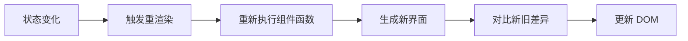
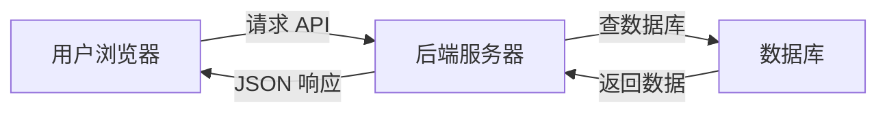
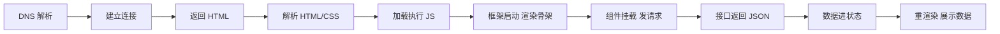

# 组件 · 状态 · 数据流 · 常见面试题与最佳实践

> 本文档位于 `知识库/前端/常见问题/组件状态与数据流/`，是组件、状态、数据获取的面试题集与最佳实践。配套核心知识见《核心知识点详解.md》。
>
> 7 道主线题 + 生产最佳实践 + 完整 Checklist，覆盖组件拆分、状态机制、接口调用、页面数据加载全链路。

---

## 一、主线七问

### 1. 什么是组件？

**核心答案**：组件是页面的基本构成单元——一个独立、可复用、自带结构/样式/行为的小块 UI。它像"函数"，输入 props + state，输出界面。

```jsx
// 组件 = 结构 + 样式 + 行为 的封装
function Avatar({ user }) {
  return ;
}
```

**展开说**：

- 结构：模板/JSX 描述长什么样。
- 样式：样式表描述怎么装饰。
- 行为：事件、状态、逻辑描述能做什么。

**本质**：组件是 `UI = f(state)` 里的函数——同样的输入（props + state），一定渲染出同样的界面。

---

### 2. 为什么要拆组件？

**核心答案**：为了可复用、可维护、可测试。大页面拆成小块，每个组件单一职责，一处改动不波及其他。

```jsx
// 拆：页面骨架 + 独立业务块
function UserPage() {
  return (
    <div>
      <UserHeader user={user} />
      <UserPosts posts={posts} />
      <UserActions onEdit={...} />
    </div>
  );
}
```

**不拆的痛点**：

- 改一处牵全身（一个逻辑变，整页受影响）。
- 无法复用（同样的卡片只能复制粘贴）。
- 无法测试（依赖太多无从下手）。
- 协作冲突（多人改同一个大文件）。

**拆的边界**：

- 一个组件同时管取数、复杂交互、多种布局 → 拆。
- 只有几行且只用一处 → 不必为拆而拆。
- 判断标准：**是否多个职责？是否要复用？**

---

### 3. 什么是状态（State）？和普通变量、普通数据有什么区别？

**核心答案**：状态是组件运行期间会变化的数据，是组件的"记忆"。和普通变量的核心区别：**状态变了会触发组件重渲染**。

```jsx
// 错：普通变量，变了页面不更新
let count = 0;
<button onClick={() => count++}>{count}</button>   // 页面永远不变

// 对：状态，变了页面跟着更新
const [count, setCount] = useState(0);
<button onClick={() => setCount(count + 1)}>{count}</button>
```

**状态 vs 数据**（最易混淆）：

- 数据：从后端拿的、展示用、不驱动界面逻辑变化的原始信息。
- 状态：影响界面渲染、会变化的信息。

**判断标准**："它变了之后界面需要跟着变吗？"需要 → 状态；不需要 → 普通数据。

```jsx
const [user, setUser] = useState(null);            // 数据（展示用）
const [isLoading, setIsLoading] = useState(true);  // 状态（决定渲染什么）
```

**状态种类**：本地状态（组件内）、全局状态（跨组件共享）、服务端状态（接口数据缓存）、URL 状态（路由参数）。

---

### 4. 状态变化以后，页面为什么跟着变化？

**核心答案**：因为界面是状态的投影——现代框架都是"状态驱动渲染"。状态变 → 框架重渲染 → 算出新界面 → 对比差异 → 更新 DOM。



<!-- -->

```jsx
function Counter() {
  const [count, setCount] = useState(0);
  console.log("重新渲染了", count);   // 每次 setCount 都会执行
  return <button onClick={() => setCount(count + 1)}>{count}</button>;
}
```

**React 视角**：`UI = f(state)`，每次 `setState` 组件函数重新执行，用新状态算新界面，Virtual DOM 对比后最小化改动真实 DOM。

**Vue 视角**：读取状态时收集依赖（谁用了它），修改时只通知真正依赖它的节点更新——精确到组件/节点级。

**一句话**：不是人手动改 DOM，而是框架用新状态**重新算了一遍界面**，只把变化的部分应用上去。

---

### 5. 前端为什么要调用接口？

**核心答案**：因为页面上展示的真实数据都存在后端（数据库/其他服务）里，前端自己造的数据刷新就丢、也无法多端共享。调接口就是为了把后端数据"读"进来或"写"进去。



<!-- -->

**三种目的**：

| 目的 | 方法 | 例子 |
|---|---|---|
| 读数据（展示） | GET | 拉取用户列表 |
| 写数据（变更） | POST/PUT/DELETE | 提交订单、更新资料 |
| 触发动作 | 任意 | 登录、支付 |

```js
// 读
fetch("/api/users").then(r => r.json()).then(render);
// 写
fetch("/api/orders", { method: "POST", body: JSON.stringify(order) });
```

**为什么数据放后端**：持久化（不丢）、共享（多端一致）、安全（权限在后端）、计算（复杂逻辑服务器做）。

---

### 6. 页面数据是怎么从后端获取的？

**核心答案**：组件挂载 → 发 HTTP 请求 → 后端返回 JSON → 解析 → 存状态 → 状态触发重渲染 → 界面展示数据。

```jsx
function UserList() {
  const [users, setUsers] = useState([]);              // ① 数据容器
  const [isLoading, setIsLoading] = useState(true);    // 加载态
  const [error, setError] = useState(null);            // 错误态

  useEffect(() => {                                    // ② 挂载后请求
    fetch("/api/users")                                // ③ 发请求
      .then(res => {
        if (!res.ok) throw new Error("请求失败");
        return res.json();                             // ④ 解析 JSON
      })
      .then(data => {
        setUsers(data);                                // ⑤ 进状态
        setIsLoading(false);
      })
      .catch(err => setError(err.message));            // ⑥ 失败处理
  }, []);

  if (isLoading) return <Spinner />;                   // ⑦ 状态驱动渲染
  if (error) return <ErrorBox msg={error} />;
  return <ul>{users.map(u => <li key={u.id}>{u.name}</li>)}</ul>;
}
```

**取数工具对比**：

| 方式 | 特点 |
|---|---|
| 原生 `fetch` / axios | 底层，手动管 loading/error/缓存 |
| SWR | 自动缓存、轮询、重试、聚焦刷新 |
| TanStack Query | 功能全，服务端状态管理标杆 |
| Server Components（Next） | 服务端直接取数直出 |

```jsx
// SWR：取数自动管理
const { data, error, isLoading } = useSWR("/api/users", fetch);
```

---

### 7. 一个页面从加载到展示数据，经历了什么？

**核心答案**：两大阶段——**骨架就绪**（HTML/CSS/JS 加载、框架启动、渲染骨架）→ **数据到达**（组件挂载取数、接口返回、进状态、重渲染、展示数据）。



<!-- -->

**阶段一：骨架就绪**

1. 输入网址 → DNS 解析域名。
2. 建立连接，请求 `index.html`。
3. 浏览器解析 HTML/CSS，下载执行 JS。
4. 框架启动，挂载根组件，出现页面骨架。

**阶段二：数据到达**

5. 组件挂载后发出 API 请求。
6. 后端处理查库返回 JSON。
7. 前端解析存入状态。
8. 状态变化触发重渲染。
9. 界面从 loading 变成真实数据。

**用户视角 vs 技术视角**：

| 用户看到 | 背后发生了什么 |
|---|---|
| 白屏 → 框架 | 资源加载 + 框架启动 |
| 转圈/骨架屏 | 组件挂载，正在请求接口 |
| 数据刷出来 | 返回 → 进状态 → 重渲染 |

---

## 二、进阶追问（加分项）

### 8. 为什么取数要放在 useEffect / onMounted 里，不能直接写在组件函数体里？

**核心答案**：组件函数体每次渲染都会执行，直接写会在每次渲染时重复发请求；`useEffect`（挂载后）只跑一次，避免重复请求和渲染死循环。

```jsx
// 错：每次渲染都发请求
function UserList() {
  fetch("/api/users").then(...);   // 渲染一次请求一次，还可能有竞态
  return <div>...</div>;
}

// 对：挂载后只请求一次
function UserList() {
  useEffect(() => {
    fetch("/api/users").then(...); // 只跑一次
  }, []);
  return <div>...</div>;
}
```

**补充**：

- 依赖数组 `[]` 表示"只在挂载时执行一次"。
- 有依赖时（如 `[userId]`），`userId` 变化才重新请求。
- 要清理：`useEffect` 返回的 cleanup 函数用于取消过期请求/清理定时器。

---

### 9. 接口请求失败怎么办？怎么处理竞态？

**核心答案**：三态处理（loading/error/data）+ 失败重试 + 竞态防护（取消旧请求或校验响应是否最新）。

```jsx
// 三态：永远不要只有"成功"一种处理
const { data, error, isLoading } = useSWR("/api/users", fetch);
if (isLoading) return <Skeleton />;
if (error) return <ErrorRetry onRetry={mutate} />;
return <DataView data={data} />;
```

```jsx
// 竞态防护：响应回来时校验请求是否还是最新的
useEffect(() => {
  let cancelled = false;                      // 取消标志
  fetch(`/api/user/${userId}`)
    .then(r => r.json())
    .then(data => {
      if (!cancelled) setUser(data);          // 过期响应不更新
    });
  return () => { cancelled = true; };         // 卸载/依赖变化时取消
}, [userId]);
```

**竞态场景**：快速切换 userId，先发的慢请求后返回，覆盖了新请求的结果 → 必须防护。

---

### 10. 状态应该放组件里还是全局？状态提升是什么？

**核心答案**：谁用就离谁近——单个组件用放本地；多个兄弟组件共享就**状态提升**到共同父组件；跨页面/多处深层次共享才用全局状态管理（Pinia/Redux）。

```jsx
// 状态提升：两个组件都要用，提到父组件
function Parent() {
  const [keyword, setKeyword] = useState("");   // 提升到这里
  return (
    <div>
      <SearchInput value={keyword} onChange={setKeyword} />
      <ResultList keyword={keyword} />
    </div>
  );
}
```

**判断标准**：

- 只有一个组件用 → 本地 `useState`。
- 父子/兄弟共享 → 提升到共同父组件（props 下发）。
- 跨多层、跨路由、多处用 → 全局状态管理。
- 纯接口数据 → SWR/TanStack Query（服务端状态，不进全局）。

---

## 三、生产最佳实践

### 3.1 组件拆分

- 单一职责：一个组件只做一件事。
- 页面骨架层只做组合，业务逻辑下沉到业务组件。
- 复用优先：多处使用的 UI 抽成独立组件。
- 不过度拆分：几行且唯一的组件不必拆。

### 3.2 状态管理

- 能用本地状态就不用全局状态（全局状态越少越好）。
- 兄弟共享用状态提升，别急着上 Redux/Pinia。
- 接口数据用 SWR/TanStack Query 管，不进全局 store。
- URL 能表达的（筛选、分页）优先放路由参数，可分享可回退。

### 3.3 取数与加载

- 取数放 `useEffect` / `onMounted`，别在渲染函数体里发请求。
- 永远三态：loading / error / data，给失败一个可重试的界面。
- 大列表用分页/虚拟滚动，别一次拉全量。
- 请求加超时、错误码统一处理。
- 接口数据做校验（字段缺失、类型不符兜底）。

### 3.4 性能

- 首屏数据能用 SSR/SSG 直出就别等客户端二次请求。
- 接口聚合（BFF）减少请求数。
- 接口缓存（SWR 的 `revalidate` 策略）避免重复请求。
- 列表项组件用 memo 减少无谓重渲染。

---

## 四、Checklist

- 我能说清组件是什么，及它的三部分（结构/样式/行为）。
- 我能说出拆组件的理由和"单一职责"的边界。
- 我能分清状态和普通变量（变不变触发渲染）。
- 我能分清状态和数据（变不变影响界面）。
- 我能讲清"状态变 → 重渲染 → 差异 → 更新 DOM"的机制。
- 我能说出前端调接口的三类目的（读/写/动作）。
- 我能把取数链路背出来：挂载 → 请求 → 解析 → 存状态 → 渲染。
- 我能画出"页面从加载到展示数据"的两阶段时间线。
- 我知道取数要放 `useEffect` / `onMounted` 及原因。
- 我知道三态处理与竞态防护。
- 我知道状态提升和"何时用全局状态"。

---

## 五、一句话总纲

> 组件是页面的积木，拆它是为了复用/维护/测试；状态是组件的记忆，变了就触发重渲染——因为界面是状态的投影；前端调接口是因为真实数据在后端；数据获取是"挂载 → 请求 → 解析 → 进状态 → 重渲染"；一个页面从加载到展示数据就是"骨架就绪 → 组件挂载取数 → 数据进状态 → loading 变真实内容"这两步。能把组件、状态、数据、渲染这四件事串成一条线，前端地基就打牢了。
