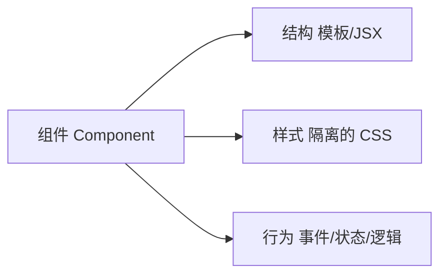
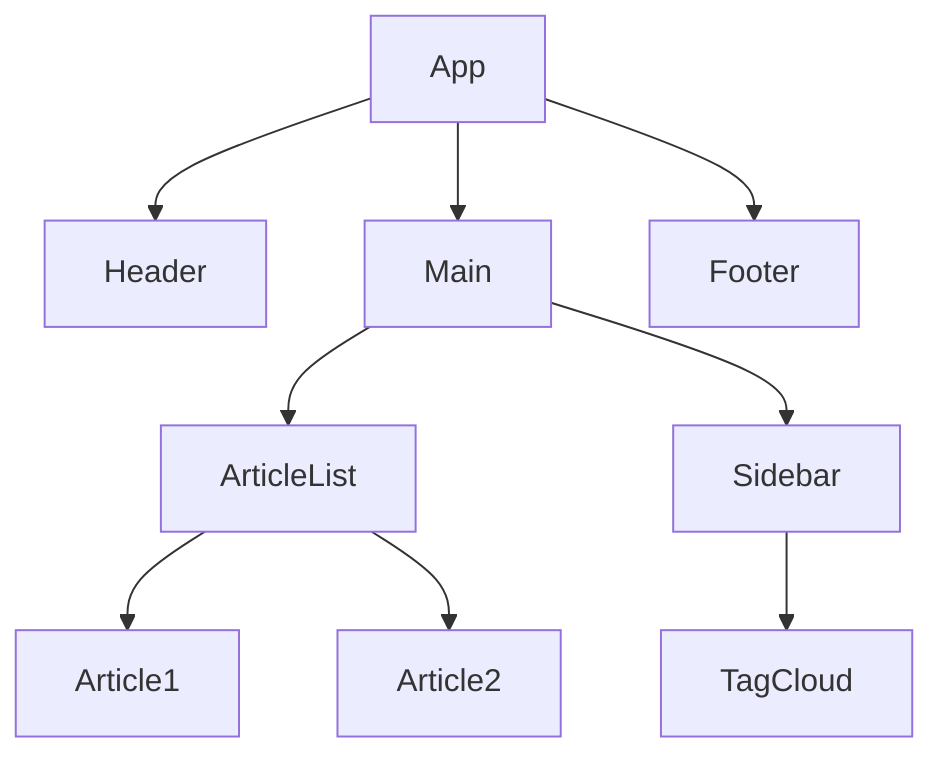
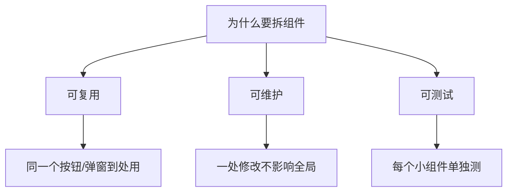
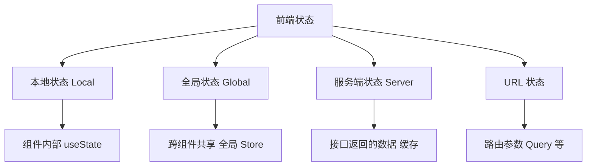
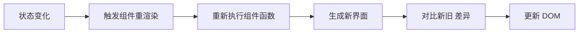
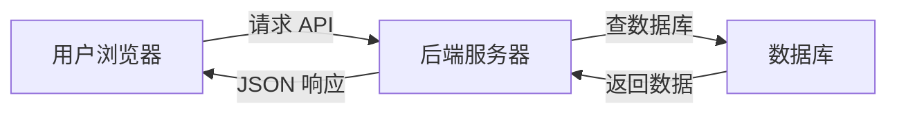
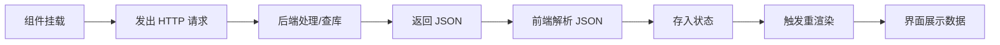

# 组件 · 状态 · 数据流 · 核心知识点详解

> 本文档位于 `知识库/前端/常见问题/组件状态与数据流/`，用一条主线回答七个连环问题：什么是组件、为什么要拆组件、什么是状态、状态变化后页面为什么跟着变、前端为什么要调用接口、页面数据怎么从后端获取、一个页面从加载到展示数据经历了什么。
>
> 读完应能把这七个问题串成一条完整的链路——**组件是页面的积木，状态是组件的记忆，数据是状态的来源，渲染是把状态变成界面，接口调用是让数据流动起来**。配套面试题见《常见面试题与最佳实践.md》。

---

## 一、什么是组件（Component）

### 1.1 组件的本质

**组件 = 一个独立、可复用、自带渲染与行为的 UI 单元。**

```jsx
// 一个最简单的组件：输入什么数据，渲染什么界面
function Avatar({ user }) {
  return ;
}
```

拆开看，一个组件通常包含三部分：



<!-- -->

| 组成部分 | 干什么 | 例子 |
|---|---|---|
| 结构（模板） | 描述"长什么样" | JSX / Vue 模板 / HTML |
| 样式 | 描述"怎么装饰" | CSS Modules / scoped CSS |
| 行为 | 描述"能做什么" | 事件处理、状态、生命周期 |

### 1.2 组件是"函数"

现代前端框架（React / Vue）把组件当函数看：

```jsx
// UI = f(state)
// 输入 props（外部传入的数据） + state（内部状态）
// 输出 界面（Virtual DOM / 真实 DOM）
function Counter({ initialCount }) {   // props：外部传进来的参数
  const [count, setCount] = useState(initialCount);  // state：内部记忆
  return <button onClick={() => setCount(count + 1)}>{count}</button>;
}
```

**关键认知**：组件的输出完全由输入决定（props + state），这让界面变得"可预测"。

### 1.3 组件的嵌套：组件树



<!-- -->

页面 = 一棵**组件树**。大组件包小组件，小组件由更小的组件组成。这棵树就是后面理解"状态在哪、数据怎么流"的地图。

---

## 二、为什么要拆组件

### 2.1 拆组件的三大理由



<!-- -->

| 理由 | 说明 | 例子 |
|---|---|---|
| **可复用** | 同一 UI 片段多处使用，只写一次 | 按钮、弹窗、分页器 |
| **可维护** | 大页面拆成小块，改动局部化 | 10 万行 vs 10 个 1 万行 |
| **可测试** | 小组件输入输出清晰，好写单测 | 给组件喂数据看渲染结果 |

### 2.2 不拆的痛点

```jsx
// 反面例子：一个文件堆了 500 行，既当布局又当业务又当交互
function HugePage() {
  // 头部的登录状态逻辑
  // 列表的取数逻辑
  // 弹窗的开关逻辑
  // 表单的校验逻辑
  // ...全都挤在一起
}
```

不拆的后果：

- **改一处牵全身**：一个逻辑变动可能影响整页。
- **无法复用**：同样的"用户卡片"要在别处用，只能复制粘贴。
- **无法测试**：整页渲染依赖太多，单测无从下手。
- **协作困难**：多人改同一个文件冲突不断。

### 2.3 怎么拆：单一职责

**拆的原则**：每个组件只做一件事，并且把这件事做好。

```jsx
// 合理拆分：页面骨架 + 独立业务块
function UserPage() {
  return (
    <div>
      <UserHeader user={user} />     {/* 用户信息头部 */}
      <UserPosts posts={posts} />    {/* 用户的帖子列表 */}
      <UserActions onEdit={...} />   {/* 操作区 */}
    </div>
  );
}
```

**拆的边界（不是越细越好）**：

- 一个组件如果**同时**管数据获取、复杂交互、多种布局 → 拆。
- 一个组件如果只有几行、且只有一处用 → 不必为拆而拆。
- 判断标准：**它是否承担了多个职责？它在别处是否还要用？**

---

## 三、什么是状态（State）

### 3.1 状态的本质

**状态（State）＝ 组件在运行期间会变化的数据，是组件的"记忆"。**

```jsx
function Counter() {
  const [count, setCount] = useState(0);   // count 就是状态：会变的数
  return <button onClick={() => setCount(count + 1)}>{count}</button>;
}
```

和普通变量的区别：

| 维度 | 普通变量 | 状态 State |
|---|---|---|
| 声明位置 | 函数里随便声明 | `useState` / `ref` / `data()` |
| 变了之后 | 页面不会重渲染 | **触发组件重新渲染** |
| 生命周期 | 组件渲染完就丢 | 组件存活期间一直保留 |
| 修改方式 | 直接赋值 | 通过 setter / 响应式赋值 |

```jsx
// 错：普通变量，变了页面不会更新
let count = 0;
<button onClick={() => count++}>{count}</button>   // 点烂了页面也不变

// 对：用状态，变了页面跟着更新
const [count, setCount] = useState(0);
<button onClick={() => setCount(count + 1)}>{count}</button>
```

### 3.2 状态有哪些种类



<!-- -->

| 种类 | 生命周期 | 存放位置 | 例子 |
|---|---|---|---|
| 本地状态 | 组件内 | `useState` / `ref` | 弹窗开关、输入框内容 |
| 全局状态 | 整个应用 | Pinia / Redux / Context | 登录用户、主题色 |
| 服务端状态 | 一次请求~缓存 | SWR / TanStack Query | 接口返回的列表、详情 |
| URL 状态 | 地址栏 | 路由 / 查询参数 | 当前页、筛选条件 |

### 3.3 状态 vs 数据

这是新手最容易混的一对：

- **数据（Data）**：从后端拿来的、不会让界面逻辑变化的原始信息。
- **状态（State）**：影响界面渲染的、会变化的信息。

判断一个东西算不算状态：**"它变了之后，界面需要跟着变吗？"**——需要就是状态，不需要就只是普通数据。

```jsx
// user.name 是数据（展示用），isLoading 是状态（决定界面渲染什么）
const [user, setUser] = useState(null);       // 数据
const [isLoading, setIsLoading] = useState(true);  // 状态

if (isLoading) return <Spinner />;
return <div>{user.name}</div>;
```

---

## 四、状态变化后页面为什么跟着变

### 4.1 核心机制：响应式渲染



<!-- -->

现代框架（React / Vue）的共同内核：

1. **状态一变**（`setCount` / `count.value = ...`）。
2. **框架标记**该组件"需要更新"。
3. **重新执行**组件渲染函数，用新状态算出新界面。
4. **对比新旧**差异（React 用 Virtual DOM Diff，Vue 用响应式依赖追踪）。
5. **只更新真正变化的那部分 DOM**。

### 4.2 React 视角：UI = f(state)

```jsx
function Counter() {
  const [count, setCount] = useState(0);
  console.log("我重新渲染了", count);
  return <button onClick={() => setCount(count + 1)}>{count}</button>;
}
```

- 每次 `setCount` → `Counter` 函数**重新执行** → 输出新的界面。
- 界面**始终是状态的函数**：同一个状态，一定渲染出同一个界面。
- React 通过 Virtual DOM 对比，把真实 DOM 改动降到最小。

### 4.3 Vue 视角：依赖追踪

```vue
<script setup>
import { ref } from "vue";
const count = ref(0);          // 响应式状态
</script>

<template>
  <button @click="count++">{{ count }}</button>
</template>
```

- Vue 在读取 `count` 时**收集依赖**（谁用了它），修改时通知依赖者更新。
- **精确到组件/节点级**：只有真正依赖这个状态的渲染才重跑。

### 4.4 一句话本质

> **界面是状态的投影**。状态变 → 框架重渲染 → 界面跟着变。这正是"为什么点按钮数字会变"的根本原因：不是 DOM 手动改的，而是框架用新状态**重新算了一遍界面**。

---

## 五、前端为什么要调用接口

### 5.1 前端的数据不是凭空来的

**前端界面上的大部分真实数据，都存在后端（数据库/其他服务）里。**



<!-- -->

前端要展示的"用户列表""订单详情""商品信息"，数据库里才有；前端自己造的数据刷新就丢，也无法和其他用户共享。

### 5.2 接口调用的三种目的

| 目的 | 方法 | 例子 |
|---|---|---|
| **读数据**（展示） | GET | 拉取商品列表、用户信息 |
| **写数据**（变更） | POST / PUT / DELETE | 提交订单、更新资料、删除条目 |
| **触发动作**（副作用） | 任意 | 登录、支付、发验证码 |

```js
// 读：请求数据 → 渲染
fetch("/api/users").then(res => res.json()).then(data => render(data));

// 写：把表单提交给后端
fetch("/api/orders", { method: "POST", body: JSON.stringify(order) });
```

### 5.3 为什么数据放后端

- **持久化**：数据库里不丢，刷新页面还在。
- **共享**：所有用户看到同一份数据（多端一致）。
- **安全**：权限校验、敏感逻辑放后端，前端代码用户都能看到。
- **计算**：复杂业务逻辑、聚合统计由服务器完成。

---

## 六、页面数据是怎么从后端获取的

### 6.1 完整数据链路



<!-- -->

### 6.2 代码视角：一次完整的获取

```jsx
function UserList() {
  const [users, setUsers] = useState([]);       // ① 状态：装数据的容器
  const [isLoading, setIsLoading] = useState(true);  // 加载状态
  const [error, setError] = useState(null);     // 错误状态

  useEffect(() => {                              // ② 组件挂载后发请求
    fetch("/api/users")                          // ③ 发起 HTTP 请求
      .then(res => {
        if (!res.ok) throw new Error("请求失败");
        return res.json();                       // ④ 解析 JSON
      })
      .then(data => {
        setUsers(data);                          // ⑤ 存入状态
        setIsLoading(false);
      })
      .catch(err => setError(err.message));      // ⑥ 失败处理
  }, []);

  // ⑦ 状态驱动渲染：三个状态分支
  if (isLoading) return <Spinner />;
  if (error) return <ErrorBox msg={error} />;
  return (
    <ul>
      {users.map(u => <li key={u.id}>{u.name}</li>)}
    </ul>
  );
}
```

**七个步骤对应前面所有概念**：

| 步骤 | 做什么 | 对应概念 |
|---|---|---|
| ① | 声明状态 | 什么是状态 |
| ② | 挂载后取数 | 生命周期 |
| ③④ | 发请求、解析 | 为什么要调接口 |
| ⑤ | 数据进状态 | 状态 vs 数据 |
| ⑥ | 处理失败 | 健壮性 |
| ⑦ | 状态驱动渲染 | 状态变→页面变 |

### 6.3 常见取数工具

| 方式 | 特点 |
|---|---|
| 原生 `fetch` / axios | 底层，手动管 loading/error/缓存 |
| SWR（Vercel） | 自动缓存、轮询、重试、聚焦刷新 |
| TanStack Query | 功能全，服务端状态管理标杆 |
| React Query + 框架 | Next.js 的 Server Components 可直接在服务端取数 |

```jsx
// SWR：把取数变成一个 hook，缓存/重试/刷新全自动
import useSWR from "swr";
function UserList() {
  const { data, error, isLoading } = useSWR("/api/users", fetch);
  if (isLoading) return <Spinner />;
  if (error) return <ErrorBox />;
  return <ul>{data.map(u => <li key={u.id}>{u.name}</li>)}</ul>;
}
```

### 6.4 渲染模式对取数的影响

结合昨天补充的 CSR / SSR / SSG：

| 模式 | 数据在哪取 | 首屏数据来源 |
|---|---|---|
| CSR | 浏览器 `useEffect` | 用户看到 loading，等二次请求 |
| SSR | 服务器端 | 数据直出进 HTML，首屏就有 |
| SSG | 构建时 | 构建产物固化，部署后不变 |

---

## 七、一个页面从加载到展示数据，经历了什么

### 7.1 全景时间线


<!-- -->

### 7.2 拆成两大阶段

**阶段一：页面骨架就绪（加载 HTML/CSS/JS）**

1. 输入网址 → DNS 把域名解析成 IP。
2. 浏览器与服务器建立 HTTP 连接，请求 `index.html`。
3. 服务器返回 HTML，浏览器边解析边下载 CSS、JS。
4. JS 执行，前端框架（React/Vue）启动，挂载根组件。
5. 页面出现**骨架**（结构在，数据还没到）。

**阶段二：数据到达（取数 → 状态 → 渲染）**

6. 组件挂载后发出 API 请求（`useEffect` / `onMounted`）。
7. 后端处理、查库、返回 JSON。
8. 前端解析 JSON，存入状态。
9. 状态变化触发组件重渲染。
10. 界面从"骨架/loading"变成"有真实数据的页面"。

### 7.3 用户视角 vs 技术视角

| 用户看到 | 背后发生了什么 |
|---|---|
| 白屏 → 页面框架 | HTML/CSS/JS 加载 + 框架启动 |
| 转圈/骨架屏 | 组件挂载，正在请求接口 |
| 数据刷出来 | 接口返回 → 进状态 → 重渲染 |
| 一点按钮数字就变 | 状态更新 → 重渲染 |

```jsx
// 用户感知的"数据加载"三态，在代码里就是三个状态分支
if (isLoading) return <Skeleton />;      // 骨架屏
if (error) return <ErrorRetry />;        // 失败可重试
return <DataView data={data} />;         // 数据视图
```

### 7.4 性能视角：这个流程哪些环节可优化

| 环节 | 优化手段 |
|---|---|
| DNS/连接 | CDN、HTTP/2、预连接 |
| 资源下载 | 代码分割、压缩、缓存 |
| 框架启动 | 减少首包 JS |
| 首次取数 | SSR/SSG 直出、接口聚合、缓存 |
| 渲染 | 虚拟列表、按需渲染 |

---

## 八、把这七个问题串成一句话

> **组件是页面的积木**（UI 单元，由结构/样式/行为组成）；**拆组件是为了复用、维护、测试**（每个组件单一职责）；**状态是组件的记忆**（运行期会变、变则触发渲染的数据，和普通变量、普通数据的区别要分清）；**状态一变页面就变，是因为界面是状态的投影**——框架重渲染、算差异、只改真正变的部分；**前端调接口，是因为真实数据存在后端**（持久化、共享、安全）；**数据获取 = 挂载时发请求 → 解析 JSON → 存状态 → 驱动重渲染**；**一个页面从加载到展示数据 = 骨架就绪（HTML/CSS/JS）→ 组件挂载取数 → 数据进状态 → 界面从 loading 变成真实内容**。能把这七步讲通顺，前端"组件-状态-数据"的地基就夯实了。
