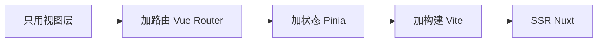
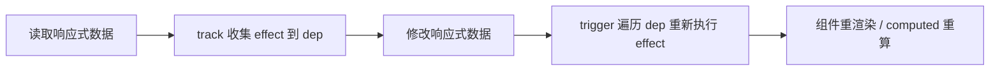

# Vue 核心知识点详解

> 本文档位于 `知识库/前端/框架与库/Vue/`，系统梳理 Vue 3 从设计哲学、模板语法、响应式原理、组件、Composition API 到内置组件与生态的核心内容，配合 Mermaid 图与代码示例辅助理解。配套的《常见面试题与最佳实践.md》见同目录。
>
> 适合已掌握 JavaScript 基础、希望对照 React 建立双框架视角的同学。所有代码基于 Vue 3 + Composition API，Options API 仅做对照。

---

## 一、Vue 的设计哲学

### 1.1 渐进式框架



<!-- -->

Vue 自称"渐进式"——核心只管视图，按需叠加路由/状态/构建/SSR，不像 Angular 全家桶强行整套。学习曲线平缓，能从 `<script src="vue.js">` 直接写起。

### 1.2 与 React 的根本区别

| 维度 | Vue | React |
|---|---|---|
| 心智模型 | 响应式：数据变 → 自动追踪依赖 → 更新 | 函数式：UI = f(state) |
| 模板 | 模板指令（v-if/v-for） | JSX（JS 超集） |
| 状态 | 可变，直接改 ref.value | 不可变，setState 触发 |
| 重渲染 | 只重渲染真正依赖该数据的组件 | 父渲染子默认全渲染 |
| 复用 | Composition API / mixin | 自定义 Hook |

一句话：**Vue 是"数据驱动 + 自动依赖追踪"，React 是"状态驱动 + 不可变重渲染"**。

### 1.3 MVVM 与单向数据流

Vue 早期标榜 MVVM（Model-View-ViewModel），ViewModel 即 Vue 实例。本质仍是单向数据流：

- 数据向下：props。
- 事件向上：emit。
- 双向只是 `:value` + `@input` 的语法糖（v-model）。

---

## 二、模板语法

### 2.1 文本插值

```html
<span>{{ msg }}</span>
<span>{{ msg + "!" }}</span>      <!-- 表达式 -->
<span>{{ ok ? "yes" : "no" }}</span>
```

`{{ }}` 内只能放**表达式**，不能放语句（if/for/await）。

### 2.2 指令一览

| 指令 | 作用 |
|---|---|
| `v-bind` (缩写 `:`) | 绑定属性 |
| `v-on` (缩写 `@`) | 绑定事件 |
| `v-model` | 双向绑定（input/select/组件） |
| `v-if` / `v-else` / `v-else-if` | 条件渲染（销毁/重建） |
| `v-show` | 条件显示（display:none 切换） |
| `v-for` | 列表渲染 |
| `v-html` | 输出 HTML（XSS 风险） |
| `v-text` | 输出纯文本 |
| `v-once` | 只渲染一次 |
| `v-memo` | 函数式记忆 |

### 2.3 v-if vs v-show

| 维度 | v-if | v-show |
|---|---|---|
| 实现 | 销毁/重建 DOM | display:none 切换 |
| 初始开销 | 低（false 不渲染） | 高（始终渲染） |
| 切换开销 | 高（销毁重建） | 低（仅样式） |
| 适用 | 很少切换 | 频繁切换 |

### 2.4 v-for 与 key

```html
<li v-for="item in list" :key="item.id">{{ item.name }}</li>
```

和 React 一样，**列表必须有稳定 key**。不用 index，原因同 React：增删时 diff 误判、状态错位。

`v-for` 与 `v-if` 不能写在同一元素（v-for 优先级高，会逐个判断 v-if），用 computed 过滤。

### 2.5 v-model 与修饰符

```html
<input v-model="text" />
<!-- 等价 -->
<input :value="text" @input="text = $event.target.value" />

<!-- 修饰符 -->
<input v-model.lazy="text" />     <!-- 失焦才更新 -->
<input v-model.number="age" />    <!-- 自动转 Number -->
<input v-model.trim="name" />     <!-- 去首尾空格 -->
```

组件上的 v-model：

```html
<MyInput v-model="text" />
<!-- 等价 props: modelValue, emits: update:modelValue -->
<MyInput v-model:title="title" />  <!-- 多 v-model -->
```

---

## 三、响应式原理（核心）

### 3.1 Vue 2：Object.defineProperty

```js
Object.defineProperty(obj, "key", {
  get() { /* 收集依赖 */ return val; },
  set(v) { val = v; /* 通知更新 */ },
});
```

局限：

- 只能劫持已有属性，**新增属性不响应**（要 `Vue.set`）。
- 数组索引/length 不响应（要重写 push/pop 等 7 个方法）。
- 深度监听需递归遍历，初始化慢。

### 3.2 Vue 3：Proxy

```js
const proxy = new Proxy(target, {
  get(t, k, receiver) {
    track(target, k);  // 收集依赖
    return Reflect.get(t, k, receiver);
  },
  set(t, k, v, receiver) {
    const r = Reflect.set(t, k, v, receiver);
    trigger(target, k);  // 触发更新
    return r;
  },
});
```

优势：

- 监听**新增/删除**属性（无需 `Vue.set`）。
- 监听数组索引/length。
- 惰性监听（访问到才递归），初始化快。
- 支持 Map/Set/WeakMap。

代价：Proxy 不能 polyfill，**不支持 IE**（Vue 3 直接放弃 IE）。

### 3.3 依赖收集与触发更新



<!-- -->

- 每个响应式属性对应一个 `dep`（依赖集合）。
- `effect` 是"用到该数据的副作用"（组件渲染函数、computed、watch）。
- 读时 track：把当前 effect 加入 dep。
- 写时 trigger：遍历 dep 重新执行所有 effect。

这就是 Vue 的"自动依赖追踪"——开发者不用声明依赖，访问即注册。

### 3.4 ref vs reactive

```js
import { ref, reactive } from "vue";

const count = ref(0);          // 任意类型，包装成对象
count.value++;                  // 模板里自动解包，直接用 count
const state = reactive({ a: 1 });  // 对象，直接访问
state.a = 2;
```

| 维度 | ref | reactive |
|---|---|---|
| 类型 | 任意 | 对象 |
| 访问 | `.value`（模板自动解包） | 直接 |
| 解构 | 解构丢响应（要 toRefs） | 解构丢响应 |
| 重新赋值 | 可以 `ref.value = newObj` | 不可以（要换 reactive 整体） |
| 推荐 | 基础类型、需要整体替换 | 嵌套对象 |

口诀：**基础类型 / 替换整个对象用 ref，结构稳定的对象用 reactive**。

### 3.5 解构丢失响应怎么办？

```js
const state = reactive({ a: 1, b: 2 });
const { a, b } = state;  // 失去响应（普通变量）

const { a, b } = toRefs(state);  // 转成 ref，保持响应
```

---

## 四、组件与 Props

### 4.1 单文件组件 SFC

```vue
<script setup>
import { ref } from "vue";
const count = ref(0);
</script>

<template>
  <button @click="count++">{{ count }}</button>
</template>

<style scoped>
button { color: red; }
</style>
```

`<script setup>` 是 Vue 3 推荐写法，更简洁、TS 支持更好、编译产物更优。

### 4.2 Props 声明

```vue
<script setup>
const props = defineProps({
  title: String,
  count: { type: Number, default: 0 },
  items: { type: Array, required: true },
  onChange: { type: Function, validator: v => typeof v === "function" },
});
</script>
```

Props 单向数据流，子组件不能直接改 props（与 React 同理）。

### 4.3 Emit 事件

```vue
<script setup>
const emit = defineEmits(["change", "submit"]);
function handle() {
  emit("change", value);
}
</script>
```

### 4.4 v-model 实现双向绑定

```vue
<!-- 父 -->
<MyInput v:modelValue="text" />

<!-- 子 MyInput.vue -->
<script setup>
const props = defineProps(["modelValue"]);
const emit = defineEmits(["update:modelValue"]);
const update = (e) => emit("update:modelValue", e.target.value);
</script>
<template>
  <input :value="props.modelValue" @input="update" />
</template>
```

v-model 就是 props + emit 的语法糖。

---

## 五、计算属性与侦听器

### 5.1 computed

```js
const fullName = computed(() => `${first.value} ${last.value}`);
```

特点：

- **惰性求值**：只有被读取时才计算。
- **缓存**：依赖不变时复用上次结果（与 React useMemo 类似但自动追踪依赖）。
- 可写版 `computed({ get, set })`。

vs 模板内表达式：模板里写复杂表达式每次渲染都算，computed 有缓存。

### 5.2 watch

```js
watch(count, (newVal, oldVal) => {
  console.log("count 从", oldVal, "变为", newVal);
}, { immediate: false, deep: false });

// 监听多个
watch([a, b], ([newA, newB]) => { /* ... */ });

// 监听 reactive 对象属性要用函数返回
watch(() => state.obj, (n, o) => {});
```

### 5.3 watchEffect

```js
watchEffect(() => {
  // 自动追踪内部访问的响应式数据
  fetchAPI(count.value);
});
```

- **立即执行**：定义时跑一次。
- **自动依赖**：不需要声明依赖。
- 适合"启动副作用 + 自动响应数据变化"。

### 5.4 watch vs watchEffect

| 维度 | watch | watchEffect |
|---|---|---|
| 何时执行 | 依赖变化时 | 立即 + 变化时 |
| 依赖声明 | 显式 | 自动 |
| 旧值 | 提供 | 不提供 |
| 适用 | 需要旧值/精确控制 | 启动副作用 |

---

## 六、生命周期

### 6.1 Options API vs Composition API 对照

| Options API | Composition API | 时机 |
|---|---|---|
| beforeCreate | setup() 开始 | 实例创建前 |
| created | setup() 中 | 实例创建后 |
| beforeMount | onBeforeMount | 挂载前 |
| mounted | onMounted | 挂载后 |
| beforeUpdate | onBeforeUpdate | 更新前 |
| updated | onUpdated | 更新后 |
| beforeUnmount | onBeforeUnmount | 卸载前 |
| unmounted | onUnmounted | 卸载后 |
| errorCaptured | onErrorCaptured | 子组件错误 |

### 6.2 Composition API 写法

```js
import { onMounted, onUnmounted } from "vue";

onMounted(() => console.log("挂载完成"));
onUnmounted(() => clearInterval(timer));
```

注意 Composition API 没有 onCreated——setup 本身就在 created 阶段。

---

## 七、Composition API（Vue 3 灵魂）

### 7.1 为什么有 Composition API

Options API 的痛点：

- 相关逻辑被选项分散（data/methods/computed/mounted 各放一点）。
- 类型推断弱（this 复杂）。
- 逻辑复用靠 mixin，命名冲突 + 来源不清。

Composition API 把相关逻辑聚到一个 setup 函数，复用靠 composable（自定义 Hook）。

### 7.2 setup 与 `<script setup>`

```js
// 老式 setup 函数
export default {
  setup() {
    const count = ref(0);
    const inc = () => count.value++;
    return { count, inc };  // 要手动 return
  },
};
```

```vue
<!-- 新式 script setup -->
<script setup>
const count = ref(0);
const inc = () => count.value++;
// 自动暴露给模板，不用 return
</script>
```

`<script setup>` 是编译语法糖，更简洁。

### 7.3 composable（自定义 Hook）

```js
// useMouse.js
import { ref, onMounted, onUnmounted } from "vue";

export function useMouse() {
  const x = ref(0);
  const y = ref(0);
  const update = (e) => { x.value = e.clientX; y.value = e.clientY; };
  onMounted(() => window.addEventListener("mousemove", update));
  onUnmounted(() => window.removeEventListener("mousemove", update));
  return { x, y };
}
```

```vue
<script setup>
import { useMouse } from "./useMouse";
const { x, y } = useMouse();
</script>
```

与 React 自定义 Hook 形态几乎一致，区别是 Vue 靠响应式自动追踪，React 靠依赖数组。

### 7.4 常用 Composition API

| API | 作用 |
|---|---|
| `ref` / `reactive` | 响应式状态 |
| `computed` | 计算属性 |
| `watch` / `watchEffect` | 侦听 |
| `toRef` / `toRefs` | 转 ref |
| `shallowRef` / `shallowReactive` | 浅响应（性能） |
| `readonly` | 只读代理 |
| `provide` / `inject` | 跨层传递 |
| `nextTick` | 等 DOM 更新后回调 |

---

## 八、组件通信

### 8.1 通信方式一览

| 场景 | 方式 |
|---|---|
| 父 → 子 | props |
| 子 → 父 | emit |
| 双向 | v-model |
| 兄弟 | 状态提升 / 状态库 |
| 跨层 | provide / inject |
| 全局 | Pinia / 事件总线（少用） |
| 访问实例 | ref（子暴露方法） |

### 8.2 provide / inject

```js
// 父
provide("theme", "dark");
provide("user", userRef);  // 可响应

// 任意后代
const theme = inject("theme", "light");  // 第二参是默认值
```

类似 React 的 Context，但 Vue 是依赖注入式，更显式。

### 8.3 子组件暴露方法给父

```vue
<!-- 子 -->
<script setup>
const count = ref(0);
defineExpose({ inc: () => count.value++ });  // 显式暴露
</script>
```

```vue
<!-- 父 -->
<script setup>
const childRef = ref();
childRef.value.inc();
</script>
<template>
  <Child ref="childRef" />
</template>
```

---

## 九、插槽

### 9.1 默认插槽

```vue
<!-- 子 Dialog.vue -->
<template>
  <div class="dialog"><slot /></div>
</template>

<!-- 父 -->
<Dialog><p>内容</p></Dialog>
```

### 9.2 具名插槽

```vue
<!-- 子 -->
<slot name="header" />
<slot />  <!-- 默认 -->

<!-- 父 -->
<Dialog>
  <template #header><h1>标题</h1></template>
  <p>主体</p>
</Dialog>
```

### 9.3 作用域插槽（子向父传数据）

```vue
<!-- 子 List.vue -->
<template>
  <div v-for="item in list">
    <slot :item="item" :index="i" />
  </div>
</template>

<!-- 父 -->
<List :list="items">
  <template #default="{ item, index }">
    <span>{{ index }}: {{ item.name }}</span>
  </template>
</List>
```

作用域插槽是 Vue 复用 UI 的强大武器，相当于 React 的 render props。

---

## 十、内置组件

### 10.1 Transition / TransitionGroup

```vue
<Transition name="fade">
  <p v-if="show">hello</p>
</Transition>

<style>
.fade-enter-active, .fade-leave-active { transition: opacity .3s; }
.fade-enter-from, .fade-leave-to { opacity: 0; }
</style>
```

声明式动画，配合 CSS 或 JS 钩子。

### 10.2 Teleport（传送门）

```vue
<Teleport to="body">
  <div class="modal">...</div>
</Teleport>
```

把内容渲染到指定 DOM 节点（如 body），类似 React Portals。

### 10.3 Suspense

```vue
<Suspense>
  <template #default><AsyncComponent /></template>
  <template #fallback><Spinner /></template>
</Suspense>
```

处理异步组件 / async setup 的加载状态。

### 10.4 KeepAlive

```vue
<KeepAlive>
  <component :is="current" />
</KeepAlive>
```

缓存组件实例，切走不销毁，状态保留。

### 10.5 component :is 动态组件

```vue
<component :is="currentTab" />
```

按数据动态渲染不同组件，比 React 的条件渲染更显式。

---

## 十一、Vue 3 新特性

| 特性 | 说明 |
|---|---|
| Composition API | 逻辑聚合与复用 |
| `<script setup>` | 更简洁的语法糖 |
| Proxy 响应式 | 替代 defineProperty |
| Teleport | 渲染到任意节点 |
| Suspense | 异步组件加载态 |
| Fragment | 模板多根节点 |
| 多 v-model | 组件多个双向绑定 |
| Pinia | 替代 Vuex 的官方状态库 |
| 更优 TS | 类型推断全面增强 |

---

## 十二、Vue Router 简介

```js
import { createRouter, createWebHistory } from "vue-router";

const router = createRouter({
  history: createWebHistory(),
  routes: [
    { path: "/", component: Home },
    { path: "/user/:id", component: User, props: true },
    { path: "/admin", component: Admin, meta: { requiresAuth: true } },
  ],
});
```

```vue
<script setup>
import { useRouter, useRoute } from "vue-router";
const router = useRouter();
const route = useRoute();
router.push("/user/1");
</script>
<template>
  <RouterLink to="/">首页</RouterLink>
  <RouterView />
</template>
```

核心：声明式路由表 + 编程导航 + 嵌套路由 + 守卫 + 动态参数 + meta 元信息。

---

## 十三、最佳实践 Checklist

### 13.1 组件设计

- SFC 三段式（script setup + template + scoped style）
- 单一职责
- props 类型声明 + 默认值 + 校验
- 组件组合优于继承

### 13.2 响应式

- 基础类型用 ref，对象用 reactive
- 解构 reactive 用 toRefs
- 新增属性直接赋值（Vue 3 支持，不需 Vue.set）
- 大对象用 shallowReactive 提升性能

### 13.3 Composition API

- 用 `<script setup>` 而非 setup 函数
- 逻辑复用抽 composable
- 副作用用 watchEffect 自动追踪
- 需要旧值用 watch

### 13.4 性能

- v-for 加稳定 key
- 频繁切换用 v-show
- 大列表虚拟滚动
- 路由懒加载 `() => import(...)`
- 静态内容用 v-once

### 13.5 工程

- Vue 3 + Vite + Pinia + Vue Router
- TypeScript + `<script setup lang="ts">`
- 路由守卫统一鉴权
- 错误边界 onErrorCaptured

---

## 十四、高频面试要点

1. **Vue 2 vs Vue 3 响应式区别？** 2 用 Object.defineProperty 劫持已有属性（无法监听新增/数组索引，需 Vue.set）；3 用 Proxy 代理整对象（新增/删除/数组都监听，惰性递归，支持 Map/Set）。代价是放弃 IE。
2. **ref vs reactive？** ref 包装任意类型为对象（`.value` 访问，模板自动解包）；reactive 直接代理对象。基础类型与需整体替换用 ref，结构稳定的对象用 reactive。
3. **computed 缓存机制？** 依赖不变时复用上次结果。内部依赖响应式追踪，访问时 track，依赖变时 invalidate。
4. **watch vs watchEffect？** watch 显式声明依赖、提供旧值、可控制 immediate；watchEffect 自动追踪、立即执行、无旧值。启动副作用用 watchEffect，需精确控制用 watch。
5. **v-if vs v-show？** v-if 销毁重建 DOM（初始低开销、切换高开销）；v-show 仅 display:none 切换（初始高开销、切换低开销）。频繁切换用 v-show，少切换用 v-if。
6. **v-for key 为什么必须？** diff 时识别元素身份。用 index 在增删时让 diff 误判，状态错位。原因同 React。
7. **v-model 原理？** `:value` + `@input` 的语法糖。组件上是 `:modelValue` + `@update:modelValue` 的语法糖。Vue 3 支持多 v-model。
8. **Composition API 解决了什么？** Options API 把相关逻辑切碎（data/methods/computed/mounted 各放一点），复用靠 mixin（命名冲突 + 来源不清）。Composition API 把相关逻辑聚合到 setup，复用靠 composable。
9. **provide/inject 是什么？** 依赖注入，父 provide 任意后代 inject。类似 React Context 但更显式。响应式数据（ref/reactive）注入后保持响应。
10. **Vue 怎么实现"自动依赖追踪"？** Proxy 的 get 拦截器在读取时把当前 effect 加入该属性的 dep（依赖集合），set 时遍历 dep 重新执行所有 effect。开发者不用声明依赖，访问即注册。
11. **Vue 与 React 重渲染策略区别？** Vue 用依赖追踪，只重渲染真正用到该数据的组件；React 父渲染子默认全渲染（除非 memo）。所以 Vue 大型应用无需手动 memo 优化，React 需要主动用 useMemo/useCallback。
12. **nextTick 干什么？** 等 DOM 更新后回调。Vue 更新 DOM 是异步的（nextTick 微任务），改完 state 立刻读 DOM 是旧值，要在 nextTick 内读。
13. **keep-alive 缓存什么？** 缓存组件实例，切走不销毁。常用于 tab 切换保留列表滚动位置/表单填写状态。配合 `include`/`exclude`/`max` 控制。
14. **Teleport 解决什么？** 把内容渲染到指定 DOM 节点（如 body），避免被父容器 overflow:hidden 裁剪、避免 z-index 层叠上下文问题。Modal/Tooltip 常用。

---

## 十五、一句话总纲

> Vue 的本质是 **"数据驱动 + 自动依赖追踪"**：响应式数据变 → Proxy 拦截 → 通知用到它的 effect 重新执行 → UI 自动更新。会写 Composition API（ref/reactive/computed/watch/composable）、理解 Proxy 响应式、能对照 React 讲清"自动追踪 vs 不可变重渲染"，就过了 Vue 的核心关。Vue 3 放弃 IE 换来 Proxy 响应式，是工程上对"为 0.x% 用户付全价"的明确拒绝。
