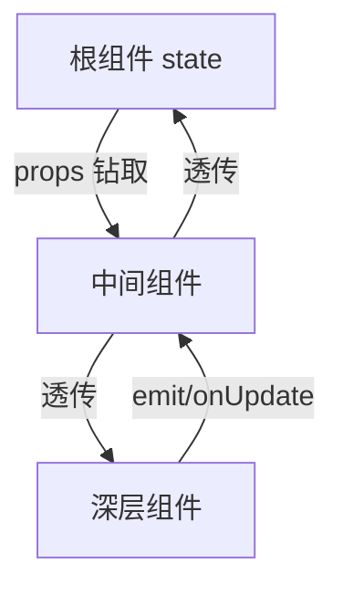
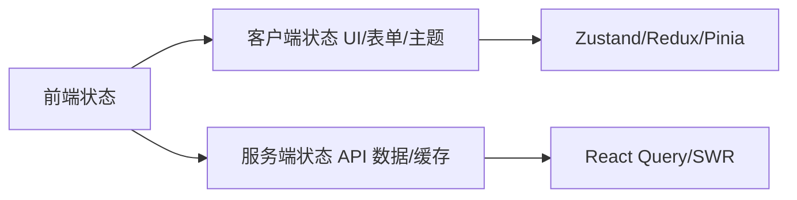
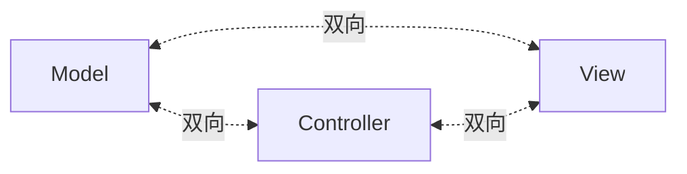
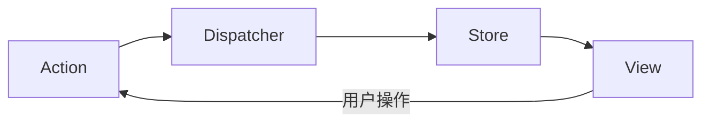
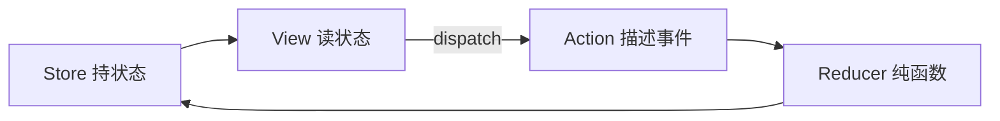
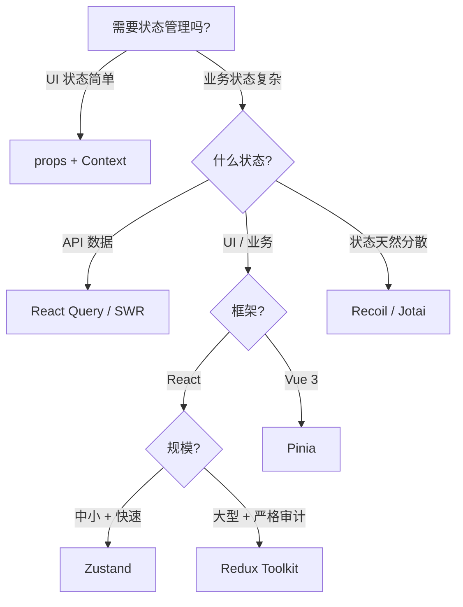

# 状态管理核心知识点详解

> 本文档位于 `知识库/前端/框架与库/状态管理/`，系统梳理前端状态管理从动机、Flux 范式、Redux、Zustand、Pinia、MobX 到服务端状态的核心内容，配合 Mermaid 图与代码示例辅助理解。配套的《常见面试题与最佳实践.md》见同目录。
>
> 重点放在 Redux（理论奠基）与 Zustand（你的技术栈实践），Vue 侧讲 Pinia，其他库做对比速览。所有 React 代码基于 18+ 函数组件范式。

---

## 一、为什么需要状态管理

### 1.1 组件状态的天花板

React/Vue 单组件 state 解决不了的问题：



<!-- -->

- **Props 钻取**：深层组件要的状态在根，中间层被迫层层透传 props + 回调。
- **兄弟通信**：两个兄弟要共享数据，得提升到共同父，父臃肿。
- **跨页持久**：路由切换组件卸载，state 丢失。
- **多视图同步**：列表页 + 详情页 + 通知中心都要同一份数据。

### 1.2 何时该上状态管理

| 场景 | 方案 |
|---|---|
| 仅父子 / 三层以内 | props + emit / Context |
| 兄弟共享 / 跨层 | 状态库（Zustand/Redux/Pinia） |
| 跨页持久 | 状态库 + 持久化中间件 |
| 服务端数据（API） | React Query / SWR（不算状态管理） |
| 表单复杂状态 | react-hook-form / vee-validate |

**不要为状态而状态**——简单应用强行上 Redux 反而增加心智负担。先 props/Context，复杂了再上库。

### 1.3 客户端状态 vs 服务端状态



<!-- -->

- **客户端状态**：UI 开关、表单草稿、主题、登录态——存在前端，前端是真源。用 Zustand/Redux/Pinia。
- **服务端状态**：列表、详情、用户信息——数据源在服务端，前端只是缓存。用 React Query/SWR，自带缓存/失效/重试/乐观更新。

**关键区分**：把 API 数据塞进 Redux 是常见误用。API 数据本质是"服务端状态的本地缓存"，归 React Query 管，Redux/Zustand 只管 UI 状态。

---

## 二、Flux 范式与 Redux 起源

### 2.1 MVC 双向绑定的混乱



<!-- -->

早期 MVC 允许 Model ↔ View ↔ Controller 多向数据流，大型应用数据流难以追踪："这个状态被谁改了？"无法回答。

### 2.2 Flux 单向数据流

Facebook 提出 Flux 范式：



<!-- -->

- **Action**：描述"发生了什么"的纯对象 `{ type, payload }`。
- **Dispatcher**：把 action 分发给所有 store。
- **Store**：持有状态 + 处理逻辑，**只能通过 action 改变**。
- **View**：订阅 store，状态变就重渲染；用户操作 dispatch action。

数据流单向：View → Action → Dispatcher → Store → View。任何状态变化都有迹可循。

### 2.3 Redux 简化 Flux

Dan Abramov 把 Flux 的多 store 简化成**单 store**，把 dispatcher 简化成**纯函数 reducer**：

```js
// reducer = (state, action) => newState
function counter(state = 0, action) {
  switch (action.type) {
    case "inc": return state + 1;
    case "set": return action.value;
    default: return state;
  }
}
```

三大原则：

1. **单一数据源**：整个应用只有一个 store 树。
2. **状态只读**：只能通过 dispatch action 改变。
3. **纯函数变更**：reducer 是 `(state, action) => newState`，无副作用。

---

## 三、Redux 核心

### 3.1 三大要素



<!-- -->

- **store**：`createStore(reducer)` 创建，持整个应用状态。
- **action**：`{ type: "INC", payload: 1 }`，描述事件。
- **reducer**：`(state, action) => newState`，纯函数。
- **dispatch**：`store.dispatch(action)` 触发状态变更。
- **subscribe**：`store.subscribe(cb)` 订阅状态变化。

### 3.2 基本使用

```js
import { createStore } from "redux";

// reducer
function todos(state = [], action) {
  switch (action.type) {
    case "add": return [...state, action.payload];
    case "toggle": return state.map(t =>
      t.id === action.payload ? { ...t, done: !t.done } : t
    );
    default: return state;
  }
}

const store = createStore(todos);
store.dispatch({ type: "add", payload: { id: 1, text: "learn redux", done: false } });
console.log(store.getState());
```

### 3.3 React 绑定：react-redux

```jsx
import { useSelector, useDispatch } from "react-redux";

function Todos() {
  const todos = useSelector(state => state.todos);  // 订阅
  const dispatch = useDispatch();
  return (
    <ul>
      {todos.map(t => <li key={t.id} onClick={() => dispatch({ type: "toggle", payload: t.id })}>{t.text}</li>)}
    </ul>
  );
}
```

`useSelector` 用 selector 函数订阅部分状态，变化才重渲染（精细订阅）。

### 3.4 中间件 middleware

dispatch 链路上的拦截器，最常见是处理异步 action：

```js
// redux-thunk：让 action 可以是函数
const thunk = ({ dispatch, getState }) => next => action => {
  if (typeof action === "function") return action(dispatch, getState);
  return next(action);
};

// 异步 action
const fetchUser = id => async dispatch => {
  dispatch({ type: "fetch_start" });
  const user = await api.get(id);
  dispatch({ type: "fetch_done", payload: user });
};
```

常用中间件：

- **redux-thunk**：简单异步，action 是函数。
- **redux-saga**：复杂异步，generator 描述副作用，可测试性好。
- **redux-logger**：打印 action 前后状态，调试用。

### 3.5 Redux 的痛点

- 模板代码多：每个状态都要 action + reducer + 常量 + selector。
- 异步要额外中间件。
- 不可变更新繁琐：深层嵌套对象要展开多层。
- 学习曲线陡，对简单应用过重。

这就是 Redux Toolkit 与 Zustand 出现的背景。

---

## 四、Redux Toolkit（RTK）

Redux 官方推荐的现代化封装，减少模板代码：

```js
import { createSlice, configureStore } from "@reduxjs/toolkit";

const todosSlice = createSlice({
  name: "todos",
  initialState: [],
  reducers: {
    add: (state, action) => { state.push(action.payload); },  // 直接改！
    toggle: (state, action) => {
      const t = state.find(t => t.id === action.payload);
      if (t) t.done = !t.done;
    },
  },
});

const store = configureStore({ reducer: { todos: todosSlice.reducer });
export const { add, toggle } = todosSlice.actions;
```

亮点：

- `createSlice` 自动生成 action creators + reducer。
- **内置 Immer**：可直接"改" state，底层转成不可变更新。
- `configureStore` 默认装好 thunk + devtools + 中间件合并。
- `createAsyncThunk` 处理异步（替代手写 thunk action）。

```js
export const fetchUser = createAsyncThunk("user/fetch", async (id) => {
  return await api.get(id);
});
// 自动 dispatch pending/fulfilled/rejected 三个 action
```

新项目用 Redux 一律用 RTK，不要用裸 createStore。

---

## 五、Zustand（你的技术栈重点）

### 5.1 设计哲学

Zustand（德语"状态"）走极简路线：

- 没有 action/reducer 概念，**直接在 store 里写修改函数**。
- 单 store，但支持切片组合。
- 用钩子订阅，selector 精细订阅避免全量重渲染。
- 体积极小（~1KB），API 极少。

与 Redux 对比：

| 维度 | Redux | Zustand |
|---|---|---|
| 范式 | Flux 单向 + reducer 纯函数 | 直接修改 |
| 模板 | 多（action/reducer/常量） | 少（一个 create） |
| 不可变 | 必须 | 不强制（推荐） |
| 学习曲线 | 陡 | 平缓 |
| 体积 | 大 | 极小 |
| 适用 | 大型团队 + 时间旅行 | 中小型 + 快速上手 |

### 5.2 基本用法

```js
import { create } from "zustand";

const useStore = create((set) => ({
  count: 0,
  inc: () => set(state => ({ count: state.count + 1 })),
  reset: () => set({ count: 0 }),
}));

function Counter() {
  const count = useStore(state => state.count);  // 精细订阅
  const inc = useStore(state => state.inc);
  return <button onClick={inc}>{count}</button>;
}
```

要点：

- `create` 接收一个函数，返回状态 + 修改方法。
- `set` 可以传函数（基于前状态）或对象。
- `useStore(selector)` 只订阅 selector 返回的部分，变化才重渲染。

### 5.3 selector 与性能

```js
// 坏：订阅整个 state，任何变化都重渲染
const state = useStore(s => s);

// 好：只订阅 count
const count = useStore(s => s.count);

// 多字段
const { count, name } = useStore(s => ({ count: s.count, name: s.name }));
// 返回新对象每次都不同 → 无限重渲染，需要 shallow 比较
```

返回新对象（如 `{ count, name }`）会让 Zustand 默认每次判定为"变了"，要用 `shallow` 比较：

```js
import { shallow } from "zustand/shallow";
const { count, name } = useStore(s => ({ count: s.count, name: s.name }), shallow);
```

### 5.4 切片组合（slice pattern）

大型 store 拆分模块：

```js
const createCountSlice = (set) => ({
  count: 0,
  inc: () => set(s => ({ count: s.count + 1 })),
});

const createAuthSlice = (set) => ({
  user: null,
  login: (u) => set({ user: u }),
  logout: () => set({ user: null }),
});

const useStore = create((...a) => ({
  ...createCountSlice(...a),
  ...createAuthSlice(...a),
}));
```

按业务模块拆分，组合成单 store，比 Redux 多 reducer 更直观。

### 5.5 中间件

```js
import { devtools, persist } from "zustand/middleware";

const useStore = create(
  devtools(
    persist(
      (set) => ({ count: 0, inc: () => set(s => ({ count: s.count + 1 })) }),
      { name: "app-storage" }
    ),
    { name: "AppStore" }
  )
);
```

- `devtools`：接入 Redux DevTools 调试。
- `persist`：自动持久化到 localStorage/sessionStorage。
- 自定义中间件：`logging`、`subscribeWithSelector` 等。

### 5.6 异步

直接在 set 函数里 await，无 thunk 概念：

```js
const useStore = create((set) => ({
  user: null,
  loading: false,
  fetchUser: async (id) => {
    set({ loading: true });
    const user = await api.get(id);
    set({ user, loading: false });
  },
}));
```

### 5.7 跨框架使用

Zustand 不强绑 React，可独立用：

```js
const store = create(...);
store.getState();          // 同步读
store.setState({ x: 1 });  // 同步改
store.subscribe(cb);       // 订阅
```

Electron 主进程 / 任意 JS 都能用同一套 store。

### 5.8 何时用 Zustand

- 中小型应用。
- 快速上手、低心智负担。
- 不想写 action/reducer 模板。
- 需要跨框架（React + Electron 主进程共享状态）。

---

## 六、MobX 与响应式状态

### 6.1 与 Redux 的根本区别

| 维度 | Redux | MobX |
|---|---|---|
| 范式 | 不可变 + 显式 dispatch | 可变 + 自动追踪 |
| 心智 | 函数式 | 面向对象 |
| 模板 | 多 | 少 |
| 调试 | 时间旅行（重放） | 难（直接改） |
| 性能 | 全量 diff | 自动只更新依赖组件 |

MobX 像 Vue 的响应式——`observable` 装饰数据，`observer` 装饰组件，数据变组件自动更新。

### 6.2 基本用法

```js
import { makeAutoObservable } from "mobx";
import { observer } from "mobx-react-lite";

class CounterStore {
  count = 0;
  constructor() { makeAutoObservable(this); }
  inc() { this.count++; }
}

const store = new CounterStore();

const Counter = observer(() => (
  <button onClick={() => store.inc()}>{store.count}</button>
));
```

直接改 `store.count`，组件自动更新——无需 action/reducer。代价是失去了时间旅行调试。

### 6.3 MobX 的边界

- 直接改数据，"谁改了状态"难追踪。
- 不可变性丢失，调试时无法重放。
- 装饰器语法历史包袱（现可用 `makeAutoObservable` 替代）。

适合快速原型与 OOP 风格团队，不适合需要严格审计的大型项目。

---

## 七、Pinia（Vue 官方推荐）

### 7.1 替代 Vuex 的官方方案

Pinia 是 Vue 团队成员开发，2020 起成为 Vue 官方推荐，特点：

- 去掉 mutation（Vuex 要 `commit` mutation 才能 `dispatch` action，繁琐）。
- TypeScript 一等公民。
- 支持 Composition API 风格定义 store。
- 模块化天然（每个 store 独立），无需 Vuex 的 modules 嵌套。
- DevTools 集成 + 时间旅行。

### 7.2 基本用法

```js
import { defineStore } from "pinia";

// Composition API 风格
export const useCounterStore = defineStore("counter", () => {
  const count = ref(0);
  const double = computed(() => count.value * 2);
  function inc() { count.value++; }
  return { count, double, inc };
});

// 组件内
const counter = useCounterStore();
counter.inc();
console.log(counter.double);
```

可直接改 `counter.count`（不像 Vuex 要 commit mutation）。也可 `counter.$patch({ count: 1 })` 批量改。

### 7.3 Pinia vs Vuex

| 维度 | Vuex | Pinia |
|---|---|---|
| mutation | 必须经过 | 去掉 |
| 模块 | modules 嵌套 | 天然多 store |
| TS | 弱 | 强 |
| API | Options | Composition + Options 双模 |
| DevTools | 集成 | 集成 |
| 状态 | 是官方 | 是官方 |

新 Vue 3 项目一律用 Pinia。

---

## 八、React Context 的边界

### 8.1 Context 是什么

```jsx
const ThemeCtx = createContext("light");
<ThemeCtx.Provider value="dark">
  <Page />
</ThemeCtx.Provider>;
const theme = useContext(ThemeCtx);
```

跨层传递，避免 props 钻取。**但不是状态管理库**。

### 8.2 Context 的局限

1. **值变化让所有消费者重渲染**——无法精细订阅部分字段。
2. **无中间件**——无 devtools / 持久化 / 异步处理。
3. **无 selector**——只能拿到整个 value。
4. **嵌套地狱**——多个 Context 嵌套难维护。

### 8.3 Context vs 状态库

| 场景 | 用什么 |
|---|---|
| 主题、用户、i18n 等准静态 | Context 够用 |
| 高频变化的业务状态 | 状态库（Zustand/Redux） |
| 需要时间旅行 / 持久化 / devtools | 状态库 |
| 需要精细订阅避免全量重渲染 | 状态库 |

口诀：**Context 传"配置"，状态库存"业务"**。

---

## 九、原子化状态：Recoil / Jotai

### 9.1 思想

不存"全局大对象"，把状态拆成最小粒度的"原子"（atom），组件订阅自己关心的 atom：

```js
// Jotai
const countAtom = atom(0);
const nameAtom = atom("alice");

const Count = () => {
  const [count, setCount] = useAtom(countAtom);
  return <button onClick={() => setCount(count + 1)}>{count}</button>;
};
```

每个 atom 独立，组件只订阅自己的 atom，互不干扰。无需 selector 优化。

### 9.2 派生 atom

```js
const doubleAtom = atom(get => get(countAtom) * 2);
```

派生 atom 自动追踪依赖，类似 Vue 的 computed。

### 9.3 适用场景

- 状态天然分散、彼此独立。
- 大量小组件各管一两个状态。
- 不喜欢"全局 store"心智。

Recoil 是 Facebook 出品（与 React 同源），Jotai 是社区版更轻量。但生态都不如 Zustand/Redux 主流。

---

## 十、服务端状态：React Query / SWR

### 10.1 不是状态管理库

React Query / SWR 解决的是"API 数据的本地缓存"，与 Zustand/Redux 互补不冲突：

```js
// React Query
const { data, isLoading, error } = useQuery(["user", id], () => api.get(id));
```

内置：

- 缓存（同一 query 共享数据）。
- 失效（按时间 / 手动 invalidate）。
- 重试（失败自动重试）。
- 乐观更新（先改 UI 再回滚）。
- 后台刷新（窗口聚焦自动重取）。
- 加载 / 错误 / 成功三态自动管理。

### 10.2 与状态库配合

```
React Query 管服务端状态（API 数据）
  +
Zustand/Redux 管客户端状态（UI/主题/表单草稿）
```

这是现代 React 应用的标准分工——API 数据不塞 Redux，UI 状态不塞 React Query。

### 10.3 SWR vs React Query

| 维度 | SWR | React Query |
|---|---|---|
| 体积 | 极小（~4KB） | 中（~13KB） |
| 功能 | 基础缓存 + 重取 | 全功能（乐观更新/devtools/infinite） |
| 学习曲线 | 平缓 | 中等 |
| DevTools | 弱 | 强 |
| 适用 | 简单场景 | 复杂 API 交互 |

简单项目 SWR 够用，复杂场景 React Query 更全。

---

## 十一、选型对比表

| 库 | 范式 | 心智负担 | 体积 | 适用框架 | 最佳场景 |
|---|---|---|---|---|---|
| Redux Toolkit | Flux + 纯函数 | 高 | 大 | React | 大型团队 + 时间旅行 |
| Zustand | 直接修改 | 低 | 极小 | React / 跨框架 | 中小型 + 快速上手 |
| MobX | 响应式 | 中 | 中 | React | OOP 风格 / 原型 |
| Pinia | 直接修改 + Composition | 低 | 小 | Vue 3 | Vue 官方推荐 |
| Recoil/Jotai | 原子化 | 低 | 小 | React | 状态天然分散 |
| Context | 跨层传值 | 低 | 0 | React | 主题/配置 |
| React Query/SWR | 服务端缓存 | 低 | 小 | React | API 数据管理 |

### 11.1 决策树



<!-- -->

---

## 十二、最佳实践 Checklist

### 12.1 状态分类

- 区分客户端状态 vs 服务端状态
- API 数据用 React Query/SWR，不入 Redux/Zustand
- 表单状态用 react-hook-form，不塞全局
- 路由参数用 URL，不重复存 store

### 12.2 Zustand 实践

- selector 精细订阅，避免全量重渲染
- 返回新对象用 shallow 比较
- 按业务模块拆 slice
- 持久化敏感数据加密或单独管理
- 跨进程共享（Electron）用 ipc 同步主从

### 12.3 Redux 实践

- 用 RTK，不用裸 createStore
- reducer 内置 Immer 直接改
- 异步用 createAsyncThunk
- selector 用 reselect 做 memo 化
- slice 按业务模块拆

### 12.4 通用

- 状态规范化（扁平 + id 引用，不深层嵌套）
- 派生数据用 selector / computed，不复制成 state
- 不要把组件局部状态塞全局
- DevTools + 时间旅行调试开启

---

## 十三、高频面试要点

1. **为什么需要状态管理？** 解决 props 钻取、兄弟通信、跨页持久、多视图同步。
2. **Redux 三大原则？** 单一数据源、状态只读、纯函数变更。
3. **Redux 数据流？** View → dispatch(action) → reducer(state, action) → newState → View 重渲染。单向。
4. **为什么 reducer 必须是纯函数？** 保证可预测可测试、可时间旅行（重放任意 action 序列）、并发安全（render 阶段可重入）。副作用放中间件。
5. **redux-thunk vs redux-saga？** thunk 让 action 是函数处理简单异步；saga 用 generator 描述副作用，可测试性强、可取消、可串并联，适合复杂异步流。
6. **Redux Toolkit 解决了什么？** 减少模板代码（createSlice 自动生成 action/reducer）、内置 Immer 直接改 state、内置 thunk + devtools、createAsyncThunk 处理异步。
7. **Zustand vs Redux？** Zustand 直接修改无 reducer 概念，模板少、体积小、上手快；Redux 严格单向 + 纯函数，适合大型团队 + 时间旅行。中小型用 Zustand，大型严格审计用 Redux。
8. **Zustand 的 selector 为什么返回新对象要 shallow？** 默认用 Object.is 比较，新对象每次引用不同被判"变了"导致无限重渲染。shallow 浅比较字段才避免。
9. **Context 能替代状态库吗？** 不能。Context 值变化让所有消费者重渲染，无 selector 精细订阅、无中间件/devtools/持久化。适合主题/配置等准静态数据，业务状态用库。
10. **客户端状态 vs 服务端状态？** 客户端状态是 UI/表单/主题，前端是真源，用 Zustand/Redux；服务端状态是 API 数据，服务端是真源，前端只是缓存，用 React Query/SWR。API 数据塞 Redux 是常见误用。
11. **MobX vs Redux？** MobX 可变 + 自动追踪依赖（像 Vue 响应式），无 action/reducer，性能自动只更新依赖组件；Redux 不可变 + 纯函数，时间旅行可重放，性能靠 selector memo 优化。MobX 适合 OOP/原型，Redux 适合严格审计。
12. **Pinia 替代 Vuex 解决了什么？** 去掉 mutation（Vuex 必须 commit mutation 再 dispatch action，繁琐）、TS 一等公民、天然模块化（无需 modules 嵌套）、Composition API 风格。Vue 3 新项目一律用 Pinia。
13. **派生数据应该存 store 还是 selector？** selector/computed。派生数据存成 state 要同步两处，且失效难管理。用 reselect（Redux）/ computed（Pinia）/ useMemo（Zustand 外层）派生。
14. **状态规范化是什么？** 扁平存储 + id 引用，而非深层嵌套。例如 `{ users: { 1: {...}, 2: {...} } }` 而非 `[{ id: 1, ... }]`。好处：更新 O(1)、避免重复、引用一致。Redux 推荐规范化。

---

## 十四、一句话总纲

> 状态管理的本质是 **"在组件树之外找个地方放共享状态"**：会分类（客户端 vs 服务端、UI vs API）、会选型（Context/Zustand/Redux/Pinia/React Query 各管一摊）、会优化（selector 精细订阅、派生数据用 selector、避免全量重渲染）。Redux 是 Flux 范式的现代封装（RTK + Immer），Zustand 是直接修改的极简方案，React Query 把"API 数据塞 Redux"的误用纠正过来——这三个层次都答上来，就是高级前端对状态管理的认知。
