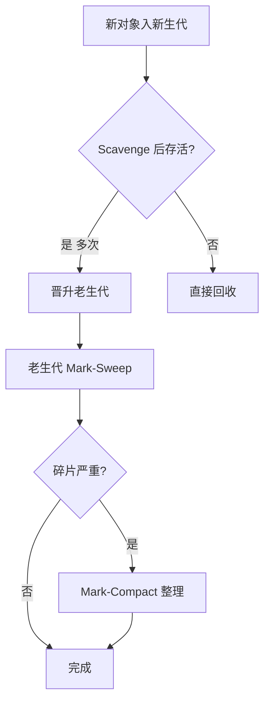

# 内存与泄漏 · 常见面试题与最佳实践

> 本文档位于 `知识库/前端/运行时与性能/内存与泄漏/`，是内存与泄漏的面试题集与生产最佳实践。配套核心知识见《核心知识点详解.md》。
>
> 15 道高频题 + 6 个生产场景 + 完整 Checklist，覆盖 V8 内存模型、GC 算法、典型泄漏模式、WeakMap/WeakRef、DevTools 抓泄漏、Node.js 内存调优等面试常考点。

---

## 一、内存模型类（高频）

### 1. JS 变量存在栈还是堆？

**核心答案**：原始值（number/string/boolean/null/undefined/symbol/bigint）存栈；引用类型（Object/Array/Function）存堆，栈里只存引用。

| 类型 | 存储位置 | 示例 |
|---|---|---|
| 原始值 | 栈 | `let n = 42` |
| 引用类型 | 堆（栈里存指针） | `const obj = { a: 1 }` |
| 闭包变量 | 堆（Environment Record） | `function f() { let x = 1; return () => x; }` |

**关键认知**：

- 函数返回后栈帧弹出，但闭包引用的变量保留在堆的 Environment Record 里。
- 字符串在 V8 中是堆上对象（短字符串可共享 Interned String），但变量栈里存指针。
- "栈里存引用"——所以 `const a = b = {}` 时 a 和 b 指向同一对象。

---

### 2. 栈溢出和内存泄漏是一回事吗？

**核心答案**：不是。栈溢出是栈空间耗尽（深递归），内存泄漏是堆未释放（引用残留）。

| 维度 | 栈溢出 Stack Overflow | 内存泄漏 Memory Leak |
|---|---|---|
| 位置 | 栈 | 堆 |
| 原因 | 递归太深 / 栈帧太多 | 引用未释放，GC 无法回收 |
| 表现 | 立即抛错 RangeError | 缓慢增长，最终 OOM |
| 修复 | 改递归为循环 / 尾递归 | 找到引用并解除 |
| 时效 | 即时 | 累积 |

**示例**：

```js
// 栈溢出
function recurse() { recurse(); }
recurse(); // RangeError: Maximum call stack

// 内存泄漏
const cache = [];
setInterval(() => {
  cache.push(new Array(1e6));
}, 1000);
// 1 小时后 OOM
```

---

## 二、GC 算法类

### 3. V8 的垃圾回收算法是什么？

**核心答案**：分代回收——新生代用 Scavenge（复制算法），老生代用 Mark-Sweep + Mark-Compact（标记清除 + 标记整理）。



<!-- -->

**Scavenge 流程**：

1. From 区活动对象 → 复制到 To 区，紧凑排列。
2. From 区清空。
3. From/To 角色互换。
4. 经历 2 次仍存活 → 晋升老生代。

**Mark-Sweep 流程**：

1. Mark：从 GC Root 出发，标记可达对象。
2. Sweep：遍历堆，释放未标记对象。
3. （可选）Compact：把活对象向一端移动，紧凑排列。

**分代假说**："大多数对象朝生夕死，少数长期存活"——这是分代回收的设计依据。

---

### 4. 什么对象能成为 GC Root？

**核心答案**：全局对象、当前调用栈的局部变量、闭包引用、定时器回调、DOM 树根、Worker 全局。

**常见 GC Root**：

- `window`（浏览器）/ `global`（Node）
- 当前执行栈中所有局部变量
- 闭包所引用的外层变量
- `setTimeout` / `setInterval` 已注册未触发的回调
- DOM 树根节点 `document`
- `Promise` 的 resolve/reject 回调
- Web Worker 的 `self`
- Module 缓存

**重要推论**：

- 闭包里的变量是 GC Root 可达的，只要闭包活着。
- `setInterval` 持有的回调闭包永远活着——这是定时器泄漏的根因。
- `addEventListener` 注册的回调也是 GC Root 可达。

---

### 5. 为什么老生代用 Mark-Sweep 不用 Scavenge？

**核心答案**：Scavenge 牺牲一半空间，老生代大对象多，浪费太严重；老生代对象存活率高，复制开销也大。

**对比**：

| 维度 | Scavenge（新生代） | Mark-Sweep（老生代） |
|---|---|---|
| 空间利用率 | 50%（From/To） | ~100% |
| 算法复杂度 | O(活对象) | O(全堆) |
| 适合存活率 | 低（死的多，复制的少） | 高（死的少，扫一遍即可） |
| 碎片 | 无（复制紧凑） | 有（需要 Mark-Compact 整理） |

**关键权衡**：

- 老生代 1.4GB，复制一半 = 浪费 700MB，不可接受。
- 老生代对象大多长期存活，复制开销大。
- Mark-Sweep 扫一遍即可，只在碎片严重时才 Compact。

---

## 三、典型泄漏类（高频）

### 6. 列举 5 种典型的内存泄漏

**核心答案**：

1. **意外的全局变量**：`leaked = 1` 未声明变成 `window.leaked`。
2. **被遗忘的定时器**：`setInterval` 没清理，闭包持有大对象。
3. **被遗忘的事件监听**：`addEventListener` 没对应 `removeEventListener`。
4. **闭包持有不必要引用**：闭包了整个 element 而非只 id。
5. **脱离 DOM 的引用**：removeChild 后变量还持有 DOM 节点。
6. **Map/Set 缓存无限增长**：cache 只增不减。
7. **console.log 引用**：DevTools 控制台持有对象。

**最常考的 5 个**：定时器、事件监听、闭包、Detached DOM、Map 缓存。

```js
// 1. 意外全局
function leak() { leaked = "global"; }

// 2. 定时器
function setup() {
  const huge = new Array(1e6);
  setInterval(() => console.log(huge.length), 1000);
  // 没清理
}

// 3. 事件监听
function setup() {
  window.addEventListener("resize", () => {});
  // 没 removeEventListener
}

// 4. 闭包
function setup(elements) {
  elements.forEach(el => {
    el.addEventListener("click", () => console.log(el.id));
    // el 闭包进回调，永远不释放
  });
}

// 5. Map 缓存
const cache = new Map();
function get(id) {
  if (!cache.has(id)) cache.set(id, fetch(id));
  return cache.get(id);
}
```

---

### 7. 闭包一定会导致内存泄漏吗？

**核心答案**：不一定。闭包持有引用是正常机制，泄漏发生在"闭包引用了不该引用的对象"且"闭包生命周期远长于对象"。

**判断标准**：

| 场景 | 是否泄漏 |
|---|---|
| 闭包持有局部变量且闭包短期存活 | 否 |
| 闭包持有 DOM 但 DOM 已 removeChild | 是 |
| 闭包持有大对象且定时器永不清理 | 是 |
| 闭包持有必要状态（如 React useState） | 否 |

**示例对比**：

```js
// 坏：闭包持有 element，组件销毁后定时器还在
function Component() {
  const element = document.querySelector("#x");
  setInterval(() => {
    element.style.color = "red";  // element 持续被引用
  }, 1000);
}

// 好：闭包只持有必要字段
function Component() {
  const id = document.querySelector("#x")?.id;
  setInterval(() => {
    document.getElementById(id)?.style.setProperty("color", "red");
  }, 1000);
}
```

**关键认知**：闭包本身不泄漏，**闭包的引用关系**才决定是否泄漏。

---

### 8. Detached DOM 是什么？怎么避免？

**核心答案**：DOM 节点从文档树 removeChild 后，JS 变量仍持有引用，导致节点不能被 GC——这种节点叫 Detached DOM。

```js
// 坏
function leak() {
  const div = document.createElement("div");
  document.body.appendChild(div);
  document.body.removeChild(div);
  // div 仍被闭包持有 → Detached DOM
  div.click = () => console.log("still here");
}
```

**典型场景**：

- 弹窗关闭后引用还在。
- 表格行删除后缓存引用。
- React 组件卸载后 useRef 持有 DOM。

**避免方法**：

```jsx
function Component() {
  const ref = useRef(null);
  useEffect(() => {
    return () => {
      // 组件卸载时清空 ref
      ref.current = null;
    };
  }, []);
  return <div ref={ref} />;
}
```

**检测**：DevTools Memory 面板 → Heap Snapshot → 搜 "Detached" → 看哪些 DOM 节点脱离了文档。

---

### 9. WeakMap 和 Map 有什么区别？

**核心答案**：WeakMap 的 key 必须是对象且不阻止 GC，不可遍历，无 size。

| 维度 | Map | WeakMap |
|---|---|---|
| key 类型 | 任意（含原始值） | 仅对象 |
| 阻止 GC | 是 | 否 |
| 可遍历 | 是 | 否 |
| size | 有 | 无 |
| 用途 | 一般映射 | 给对象附加数据/私有属性 |

**典型用途**：

```js
// 1. 给 DOM 节点附加元数据
const meta = new WeakMap();
meta.set(element, { bound: true });
// element 被移除后，meta 自动清理

// 2. 私有字段
const _private = new WeakMap();
class User {
  constructor(name) {
    _private.set(this, { name });
  }
  getName() {
    return _private.get(this).name;
  }
}

// 3. 监听器去重
const seen = new WeakSet();
function once(fn) {
  return function (...args) {
    if (seen.has(this)) return;
    seen.add(this);
    return fn.apply(this, args);
  };
}
```

**重要陷阱**：

```js
// 坏：WeakMap 不能用作"普通缓存"
const cache = new WeakMap();
cache.set("user_123", data);  // TypeError: Invalid value used as weak map key

// 好：key 必须是对象
const userCache = new WeakMap();
userCache.set(userObj, data);
```

---

### 10. WeakRef 和 FinalizationRegistry 怎么用？

**核心答案**：WeakRef 创建对象的弱引用（不阻止 GC），FinalizationRegistry 注册"对象被 GC 时"的回调。

**示例**：

```js
const registry = new FinalizationRegistry(heldValue => {
  console.log(`对象 ${heldValue} 被 GC 回收`);
});

function makeResource() {
  const resource = { data: "important" };
  registry.register(resource, "resource-1");
  return new WeakRef(resource);
}

let ref = makeResource();
console.log(ref.deref()); // { data: "important" }

// 触发 GC（无法保证）
ref.deref(); // 可能 undefined
```

**使用场景**：

| 场景 | 弱引用 | 强引用 |
|---|---|---|
| 缓存（可重建） | ✓ WeakRef | ✗ |
| 监听器（可重连） | ✓ | ✗ |
| 关键业务对象 | ✗ | ✓ |
| 必须清理的资源 | ✗ | ✓ |

**关键原则**：

- 弱引用对象**可能任何时候消失**——不要在关键业务路径依赖它。
- FinalizationRegistry 回调**时机不确定**——可能根本不触发。
- 弱引用仅用于"对象没了也能重建/容错"的场景。

---

## 四、DevTools 与检测类

### 11. 怎么用 Chrome DevTools 抓内存泄漏？

**核心答案**：拍两个堆快照，对比看哪些对象在两次快照间被分配且未释放。


<!-- -->

**详细步骤**：

1. **打开 Memory 面板** → 选 "Heap snapshot"。
2. **基线**：操作前点 "Take heap snapshot"（Snapshot 1）。
3. **操作**：跑可疑代码（如打开关闭弹窗 5 次）。
4. **强制 GC**：DevTools 工具栏点 "Collect garbage"。
5. **再次快照**：Snapshot 2。
6. **对比**：Snapshot 2 顶部选 "Objects allocated between Snapshot 1 and Snapshot 2"。
7. **过滤**：按 Retained Size 倒序看。
8. **看 Retainers**：找引用链，定位持有者。
9. **修代码**：解除引用。
10. **复测**：再拍两快照，确认 delta 接近 0。

**关键字段**：

- **Shallow Size**：对象自身大小。
- **Retained Size**：对象 + 其引用链释放的总大小。
- **Distance**：到 GC Root 的最短路径。
- **Retainers**：所有引用该对象的路径。

**生产环境抓快照**：

```js
// Node.js 主动写堆快照
const v8 = require("v8");
v8.writeHeapSnapshot(`/tmp/heap-${Date.now()}.heapsnapshot`);
```

---

### 12. 怎么监控线上内存增长？

**核心答案**：浏览器用 `performance.memory`，Node 用 `process.memoryUsage()`，定时记录到监控系统。

```js
// 浏览器（Chrome only）
setInterval(() => {
  const m = performance.memory;
  fetch("/api/metrics", {
    method: "POST",
    body: JSON.stringify({
      type: "memory",
      used: m.usedJSHeapSize,
      total: m.totalJSHeapSize,
      limit: m.jsHeapSizeLimit,
    }),
    keepalive: true,
  });
}, 60000);

// Node.js
setInterval(() => {
  const m = process.memoryUsage();
  console.log({
    rss: (m.rss / 1024 / 1024).toFixed(1) + "MB",
    heapUsed: (m.heapUsed / 1024 / 1024).toFixed(1) + "MB",
    heapTotal: (m.heapTotal / 1024 / 1024).toFixed(1) + "MB",
    external: (m.external / 1024 / 1024).toFixed(1) + "MB",
  });
}, 60000);
```

**Node 字段含义**：

| 字段 | 含义 |
|---|---|
| `rss` | Resident Set Size，进程总内存（含 C++ 对象） |
| `heapTotal` | V8 已分配的堆总量 |
| `heapUsed` | V8 堆实际使用 |
| `external` | C++ 对象（如 Buffer）占的内存 |
| `arrayBuffers` | ArrayBuffer 专用 |

**告警规则**：

- heapUsed 持续单调增长（不下降） → 可疑泄漏。
- rss 接近容器限制（如 512MB） → 即将 OOM。
- GC 频率上升 → 内存压力大。

---

## 五、Node.js 内存类

### 13. Node.js 的内存限制是多少？怎么调？

**核心答案**：默认老生代 ~1.4GB（64 位机器），可用 `--max-old-space-size` 调整。

**默认限制**：

| 平台 | 老生代上限 | 新生代上限 |
|---|---|---|
| 64 位 | ~1.4GB | ~16MB |
| 32 位 | ~700MB | ~8MB |

**调整**：

```bash
# 调到 4GB
node --max-old-space-size=4096 app.js

# 看每次 GC 详情
node --trace-gc app.js

# 看 GC 详细信息
node --trace-gc-verbose app.js
```

**注意**：

- 不要直接设到机器物理内存上限——留余量给 OS。
- 容器环境记得容器 limit > node 上限。
- 大型服务建议用 `--max-old-space-size=4096` 起步。

**查看限制**：

```bash
node -e "console.log(v8.getHeapStatistics().heap_size_limit / 1024 / 1024 + 'MB')"
# 输出：1440MB
```

---

### 14. 怎么定位 Node.js OOM？

**核心答案**：用 `--inspect` 连 Chrome DevTools 拍快照，或用 `v8.writeHeapSnapshot()` 在代码中主动写。

**方法 1：inspect 实时调试**

```bash
node --inspect app.js
# Chrome 打开 chrome://inspect → Configure → localhost:9229
# 在 Memory 面板拍堆快照
```

**方法 2：代码主动写快照**

```js
const v8 = require("v8");

// 监控内存，超阈值自动写快照
setInterval(() => {
  const used = process.memoryUsage().heapUsed / 1024 / 1024;
  if (used > 1024) {  // 1GB 触发
    const file = `/tmp/heap-${Date.now()}.heapsnapshot`;
    v8.writeHeapSnapshot(file);
    console.log(`快照已写：${file}`);
  }
}, 10000);

// 信号触发（kill -USR2 <pid>）
process.on("SIGUSR2", () => {
  v8.writeHeapSnapshot(`/tmp/heap-${Date.now()}.heapsnapshot`);
});
```

**方法 3：OOM 前自动写**

```bash
# 启动加 --report-on-fatalerror
node --report-on-fatalerror --max-old-space-size=2048 app.js
# OOM 时生成 .report 文件
```

**方法 4：heapdump 第三方库**

```js
const heapdump = require("heapdump");

// 信号触发
process.on("SIGUSR2", () => {
  heapdump.writeSnapshot(`/tmp/heap-${Date.now()}.heapsnapshot`);
});
```

**分析步骤**：

1. 用 Chrome DevTools 打开 .heapsnapshot。
2. 按 Retained Size 倒序。
3. 找占用最大的对象类型（如 Array、String）。
4. 看 Retainers 找引用源。
5. 修复代码 + 重测。

---

## 六、综合与陷阱类

### 15. React 组件卸载后还在 setState 报错，怎么修？

**核心答案**：useEffect 返回清理函数，取消异步操作（fetch / setTimeout / Promise）。

```jsx
function Component() {
  const [data, setData] = useState(null);

  useEffect(() => {
    let cancelled = false;
    fetch("/api/data")
      .then(r => r.json())
      .then(d => {
        if (!cancelled) setData(d);
      });
    return () => { cancelled = true; };
  }, []);
}
```

**AbortController 方案（更标准）**：

```jsx
useEffect(() => {
  const ctrl = new AbortController();
  fetch("/api/data", { signal: ctrl.signal })
    .then(r => r.json())
    .then(setData)
    .catch(err => {
      if (err.name !== "AbortError") throw err;
    });
  return () => ctrl.abort();
}, []);
```

**定时器方案**：

```jsx
useEffect(() => {
  const id = setInterval(() => { /*...*/ }, 1000);
  return () => clearInterval(id);
}, []);
```

**事件监听方案**：

```jsx
useEffect(() => {
  const handler = () => { /*...*/ };
  window.addEventListener("resize", handler);
  return () => window.removeEventListener("resize", handler);
}, []);
```

**关键原则**：所有 useEffect 里启动的副作用，都必须有对应的清理函数。

---

## 七、生产场景实战

### 场景 1：长时间运行的 SPA 内存持续增长

**症状**：用户在线 4 小时，Chrome 内存从 80MB 涨到 500MB。

**排查思路**：

1. **抓堆快照**：用户在线 1 小时后拍快照。
2. **对比 delta**：看哪些对象持续增长。
3. **常见原因**：
   - 路由切换时组件没卸载（用 v-if 误用 v-show）。
   - EventBus / 全局状态订阅没解绑。
   - WebSocket 消息缓存无限增长。
   - 上报队列没限流。

**修复**：

```jsx
// 1. 确保路由切换时组件销毁
<Route path="/list" element={<List />} />  // ✓ React Router 自动卸载

// 2. EventBus 订阅必须解绑
useEffect(() => {
  const handler = (data) => { /*...*/ };
  EventBus.on("event", handler);
  return () => EventBus.off("event", handler);
}, []);

// 3. WebSocket 消息队列限长
const queue = useRef([]);
useEffect(() => {
  const ws = new WebSocket("wss://...");
  ws.onmessage = (e) => {
    queue.current.push(JSON.parse(e.data));
    if (queue.current.length > 1000) {
      queue.current.shift();  // 队列限长 1000
    }
  };
  return () => ws.close();
}, []);
```

---

### 场景 2：Node.js 服务 OOM 重启

**症状**：Node 服务每 2 小时自动重启一次，日志显示 "JavaScript heap out of memory"。

**排查**：

1. **看日志**：定位 OOM 前的最后操作（是否某个 API 频繁调用）。
2. **加内存监控**：每分钟打 `process.memoryUsage()`。
3. **加自动快照**：heapUsed > 1GB 时自动写快照。
4. **拍快照分析**：找最大占用对象。

**典型原因**：

- 用户上传大文件，Buffer 缓存没释放。
- 缓存（Redis 客户端 / 内存缓存）没设过期。
- 数据库查询返回大结果集一次性加载。
- 第三方 SDK 内部泄漏（如旧版本日志库）。

**修复示例**：

```js
// 1. 流式处理大文件，避免全量缓冲
const fs = require("fs");
const stream = require("stream");
async function processFile(path) {
  await stream.promises.pipeline(
    fs.createReadStream(path),
    new stream.Transform({
      transform(chunk, enc, cb) {
        // 逐块处理，不缓存全量
        cb(null, chunk.toString().toUpperCase());
      },
    }),
    fs.createWriteStream(`${path}.out`)
  );
}

// 2. 缓存设 TTL
const cache = new Map();
function set(key, val, ttl = 60000) {
  cache.set(key, { val, expire: Date.now() + ttl });
}
function get(key) {
  const item = cache.get(key);
  if (!item) return undefined;
  if (Date.now() > item.expire) {
    cache.delete(key);
    return undefined;
  }
  return item.val;
}
// 定期清理过期
setInterval(() => {
  const now = Date.now();
  for (const [k, v] of cache) {
    if (now > v.expire) cache.delete(k);
  }
}, 60000).unref();
```

---

### 场景 3：移动端低内存设备崩溃

**症状**：iPhone 6 / 低端 Android 上打开应用 30 秒后白屏。

**排查**：

1. **看堆大小**：`performance.memory.usedJSHeapSize` 增长曲线。
2. **看图片**：是否一次加载了所有图片（虚拟列表）。
3. **看列表**：长列表是否一次渲染所有 DOM。
4. **看缓存**：是否缓存了所有数据。

**修复**：

```jsx
// 1. 虚拟列表
import { FixedSizeList } from "react-window";
function List({ items }) {
  return (
    <FixedSizeList height={600} itemCount={items.length} itemSize={50}>
      {({ index, style }) => (
        <div style={style}>{items[index].name}</div>
      )}
    </FixedSizeList>
  );
}

// 2. 图片懒加载 + 解码
function LazyImage({ src, alt }) {
  const ref = useRef();
  useEffect(() => {
    const img = new Image();
    img.src = src;
    img.decode().then(() => {  // 解码后再显示，避免主线程卡顿
      if (ref.current) ref.current.src = src;
    });
  }, [src]);
  return ;
}

// 3. 数据分页 + 缓存淘汰
const data = useRef([]);
function loadMore() {
  fetch(`/api/data?offset=${data.current.length}`)
    .then(r => r.json())
    .then(items => {
      data.current.push(...items);
      // 缓存限长，保留最近 1000 条
      if (data.current.length > 1000) {
        data.current = data.current.slice(-1000);
      }
    });
}
```

---

### 场景 4：第三方库泄漏

**症状**：引入某第三方库后内存持续增长，怀疑库本身泄漏。

**验证步骤**：

1. **复现**：单独跑该库的 demo，看是否泄漏。
2. **拍快照**：对比"用库前 vs 用库后"堆快照。
3. **看 Retainers**：找泄漏对象，看引用源是不是该库。
4. **升级 / 替换**：查 GitHub issues 是否有同类报告。

**常见泄漏第三方库**：

- 旧版本 `moment.js`：内部缓存格式化结果。
- 旧版本 `lodash`：memoize 永不过期。
- 自己写的 EventEmitter：没清理监听器。
- 日志库：buffer 没 flush。

**修复**：

```js
// 1. 给 memoize 加 LRU
const memoized = _.memoize(fn, { max: 1000 });  // 不支持，自己包
const memo = new LRUCache(1000);
function slow(key) {
  if (memo.has(key)) return memo.get(key);
  const val = compute(key);
  memo.set(key, val);
  return val;
}

// 2. EventEmitter 限监听数
emitter.setMaxListeners(20);  // 默认 10
// 监听器必须解绑
emitter.on("event", handler);
emitter.off("event", handler);

// 3. 日志 buffer 定期 flush
winston.stream.on("data", chunk => write(chunk));
setInterval(() => winston.stream.flush(), 5000).unref();
```

---

### 场景 5：DevTools 抓泄漏但找不到

**症状**：内存明显增长，但 Heap Snapshot 看不出明显异常。

**对策**：

1. **多次拍快照**：拍 5 次以上，看持续增长的对象。
2. **Allocation 跟踪**：用 "Allocation instrumentation on timeline" 看每步分配。
3. **看 detached DOM**：过滤 "Detached" 关键字。
4. **看字符串**：长字符串泄漏常被忽略，按 Length 排序。
5. **看 closures**：过滤 "context" / "closure" 关键字。

**隐藏泄漏源**：

- 长字符串拼接（错误日志拼接）。
- WeakRef 误用导致强引用链。
- Promise 未 resolve/reject 持续挂起。
- iframe 内泄漏（主页面内存计 iframe）。

---

### 场景 6：TypeScript 项目编译后内存大

**症状**：编译产物 .js 内存占用比源 .ts 高。

**原因**：

- TS 编译器默认带运行时类型元信息。
- enum 反向映射生成额外字段。
- 装饰器生成额外属性。

**修复**：

```json
// tsconfig.json
{
  "compilerOptions": {
    "isolatedModules": true,        // 隔离模块，减少元信息
    "importsNotUsedAsValues": "remove",
    "preserveValueImports": false
  }
}
```

```ts
// 1. 用 const enum（编译时内联，零运行时）
const enum Color { Red, Green, Blue }
const c = Color.Red;  // 编译为 const c = 0

// 2. 用 as const 替代 enum
const Color = { Red: 0, Green: 1, Blue: 2 } as const;
type Color = typeof Color[keyof typeof Color];

// 3. 避免无用导入
import type { Type } from "./types";  // 编译时擦除
```

---

## 八、生产环境 Checklist

### 8.1 代码层

全部文件 `"use strict"` 或 babel 强制严格
所有 `setInterval` / `setTimeout` 在 useEffect 返回清理
所有 `addEventListener` 在 useEffect 返回 `removeEventListener`
所有 fetch / axios 用 AbortController 取消
大数据集用虚拟列表（react-window / react-virtualized）
缓存用 LRU / WeakMap，禁用无限增长的 Map/Set
不在闭包里持有 DOM 节点
useRef 在组件卸载时清空（设为 null）

### 8.2 监控层

浏览器：上报 `performance.memory`（Chrome）
Node：上报 `process.memoryUsage()`
heapUsed 持续增长告警
rss 接近容器 limit 告警
GC 频率异常告警
关键 API 加内存采样

### 8.3 OOM 兜底

Node 加 `--max-old-space-size` 适当调大
代码加自动写快照逻辑（heapUsed > 80% 触发）
监听 `SIGUSR2` 信号手动触发快照
PM2 / systemd 配置自动重启
服务降级方案（内存高时拒绝新请求）

### 8.4 测试层

内存回归测试（操作 N 次后内存 delta < 阈值）
长时间压测（4 小时以上）
多设备测试（含低端 Android / 老 iPhone）
上线前 Lighthouse 跑分 + 内存检查

### 8.5 容器部署

容器内存 limit > node heap limit 1.5 倍
不在容器内运行多个 Node 进程
用 `--max-old-space-size` 而非依赖 V8 默认
配置 OOM killer 优先杀非关键进程

---

## 九、面试速记卡

| 问题 | 一句话答案 |
|---|---|
| 栈 vs 堆？ | 原始值在栈，引用类型在堆（栈存指针） |
| V8 GC 算法？ | 分代回收——新生代 Scavenge，老生代 Mark-Sweep+Compact |
| Scavenge 流程？ | From 区活动对象复制到 To 区 → From 清空 → 角色互换 |
| 5 类典型泄漏？ | 全局变量、定时器、事件监听、闭包、Detached DOM |
| WeakMap vs Map？ | WeakMap key 必须对象、不阻止 GC、不可遍历、无 size |
| WeakRef 用途？ | 缓存（对象可重建时）弱引用，避免阻止 GC |
| 怎么抓泄漏？ | 拍两堆快照对比，看 Retained Size 大的对象 + Retainers |
| Detached DOM？ | DOM 节点从文档移除但 JS 仍持有引用 |
| Node 默认内存？ | 老生代 ~1.4GB，`--max-old-space-size` 调整 |
| 闭包一定泄漏吗？ | 不一定，看引用关系是否合理 |
