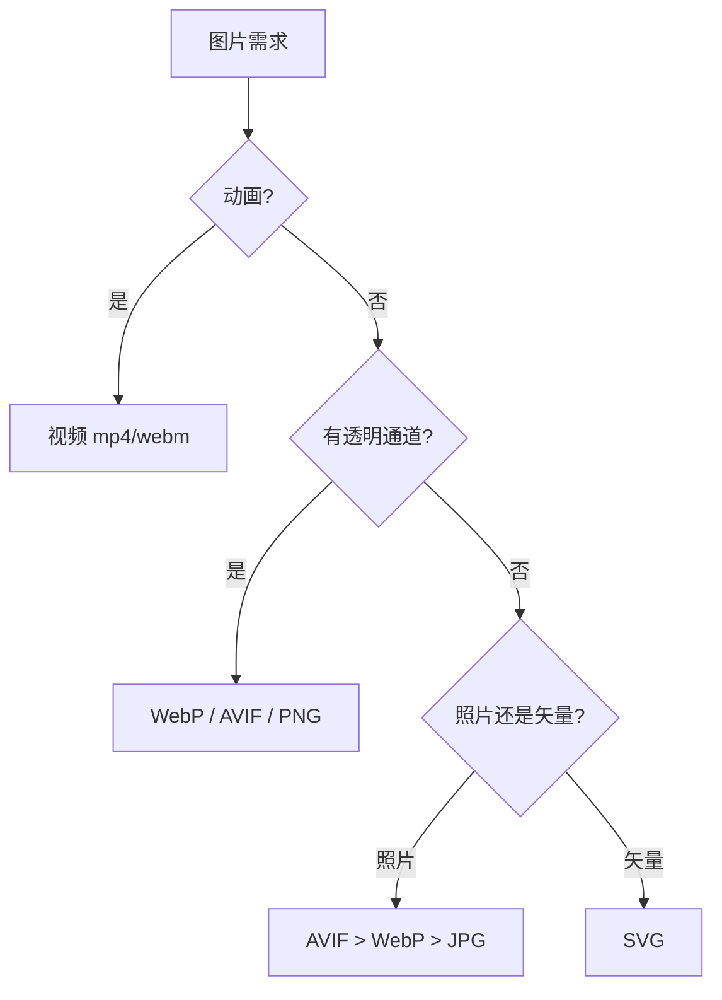
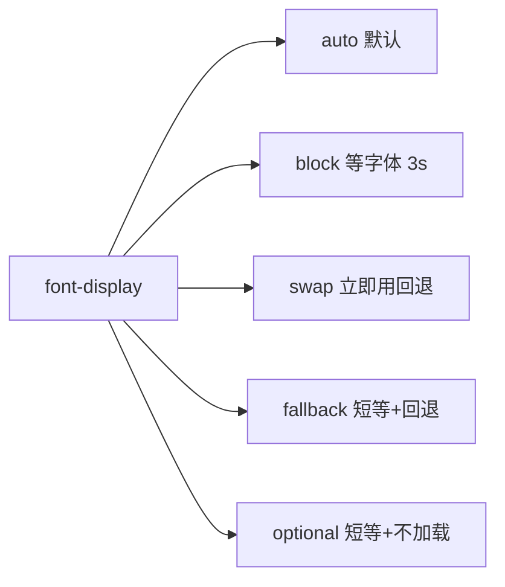
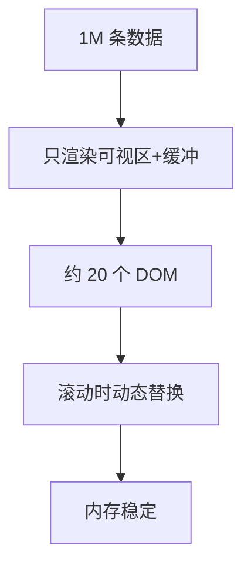
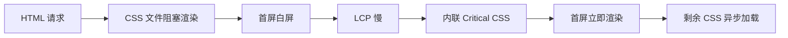
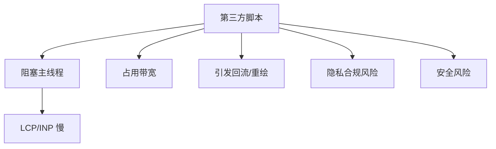

# 性能优化实战 · 核心知识点详解

> 本文档位于 `知识库/前端/运行时与性能/性能优化实战/`，是性能优化实战的核心知识库。配套面试题见《常见面试题与最佳实践.md》。
>
> 读完应能解释清楚"图片优化全链路""字体加载策略与 FOUT/FOIT""代码分割与按需加载""懒加载实现原理""Critical CSS 提取流程""第三方脚本治理体系"。

---

## 一、图片优化（核心高频）

### 1.1 图片格式选型



<!-- -->

**格式对比**：

| 格式 | 压缩率 | 透明通道 | 动画 | 浏览器支持 | 适用 |
|---|---|---|---|---|---|
| JPG | 中 | 否 | 否 | 全部 | 老照片 |
| PNG | 低 | 是 | 否 | 全部 | 图标 / 透明 |
| WebP | 高（-30% vs JPG） | 是 | 是 | 96%+ | 主流 |
| AVIF | 极高（-50% vs JPG） | 是 | 是 | 92%+ | 新项目 |
| SVG | 矢量 | 是 | 是 | 全部 | 图标 / 简单图形 |
| GIF | 低 | 是 | 是 | 全部 | 不推荐 → 用 MP4 |

**最佳实践**：

```html
<picture>
  <!-- 优先 AVIF，其次 WebP，最后 PNG/JPG 兜底 -->
  <source type="image/avif" srcset="/hero.avifs">
  <source type="image/webp" srcset="/hero.webp">
  
</picture>
```

### 1.2 响应式图片

```html
<!-- srcset + sizes：按视口加载不同尺寸 -->


<!-- picture + media：按设备加载不同图 -->
<picture>
  <source media="(max-width: 768px)" srcset="hero-mobile.webp">
  <source media="(min-width: 769px)" srcset="hero.webp">
  
</picture>
```

### 1.3 懒加载

```html
<!-- 原生懒加载 -->

```

**`loading="lazy"`**：

- 浏览器自动延迟加载视口外图片。
- 不需要 JS 库。
- 现代浏览器全部支持。

**`decoding="async"`**：图片解码不阻塞主线程。

**IntersectionObserver 实现**（兼容老浏览器）：

```js
const images = document.querySelectorAll('img[data-src]');
const observer = new IntersectionObserver(entries => {
  entries.forEach(entry => {
    if (entry.isIntersecting) {
      const img = entry.target;
      img.src = img.dataset.src;
      observer.unobserve(img);
    }
  });
}, { rootMargin: "200px" });  // 提前 200px 加载

images.forEach(img => observer.observe(img));
```

**LQIP（Low Quality Image Placeholder）**：

```html
<!-- 低质量占位图 + 高质量图渐进 -->

```

### 1.4 CDN 图片处理

```
# 阿里云 / 七牛 / Cloudflare 按需转格式
https://cdn.example.com/hero.jpg?format=webp&width=800&quality=80

# Cloudflare Polish
# 自动转 WebP/AVIF + 压缩 + 调整尺寸
```

**优势**：

- 不需要在构建期生成多版本。
- 按用户浏览器 UA 自动选格式。
- 按视口宽度自适应尺寸。

### 1.5 SVG 优化

```svg
<!-- 优化前 -->
<svg xmlns="http://www.w3.org/2000/svg" width="24" height="24" viewBox="0 0 24 24">
  <path d="M12 2L2 22h20L12 2z" fill="#ff0000" stroke="#000" stroke-width="2"/>
</svg>

<!-- 用 SVGO 优化：去注释 / 去元数据 / 简化路径 -->
```

**工具**：

- `svgo` CLI：`svgo input.svg -o output.svg`
- `svgomg` 在线：https://jakearchibald.github.io/svgomg/
- Vite 插件：`vite-plugin-svgo`

**SVG 雪碧图**：

```html
<!-- 单文件多图标 -->
<svg xmlns="http://www.w3.org/2000/svg" style="display:none">
  <symbol id="icon-home" viewBox="0 0 24 24">
    <path d="..."/>
  </symbol>
  <symbol id="icon-user" viewBox="0 0 24 24">
    <path d="..."/>
  </symbol>
</svg>

<!-- 使用 -->
<svg width="24" height="24"><use href="#icon-home"/></svg>
```

---

## 二、字体优化

### 2.1 字体加载策略



<!-- -->

| `font-display` | 行为 | 适用 |
|---|---|---|
| `auto` | 浏览器决定（多数 block） | 不推荐 |
| `block` | 等字体 3s，期间不显示文字 | 关键标题（不推荐） |
| `swap` | 立即用回退字体，字体加载完切换 | 正文 |
| `fallback` | 100ms 回退，3s 切换 | 折中 |
| `optional` | 100ms 回退，网络慢则不加载 | 非关键 |

**FOUT vs FOIT**：

| 现象 | 含义 | 触发 |
|---|---|---|
| **FOIT**（Flash Of Invisible Text） | 字体加载期间文字不可见 | `block` / `auto` |
| **FOUT**（Flash Of Unstyled Text） | 先用回退字体显示，加载完切换 | `swap` |

**推荐**：

```css
@font-face {
  font-family: "Inter";
  src: url("/fonts/inter.woff2") format("woff2");
  font-display: swap;       /* 立即显示，避免空白 */
  font-weight: 400;
}
```

### 2.2 字体格式

| 格式 | 压缩率 | 浏览器支持 |
|---|---|---|
| TTF | 低 | 全部 |
| OTF | 低 | 全部 |
| WOFF | 中 | 全部 |
| **WOFF2** | 高 | 96%+ |

**最佳实践**：只用 woff2 + ttf 兜底。

```css
@font-face {
  font-family: "Inter";
  src: url("/fonts/inter.woff2") format("woff2"),
       url("/fonts/inter.woff") format("woff");
  font-display: swap;
}
```

### 2.3 字体子集化

只保留页面用到的字符，大幅减少文件大小。

```bash
# 1. 用 glyphhanger 提取页面字符
npx glyphhanger --url=https://example.com --subset=*.woff2

# 2. 用 fonttools（Python）
pyftsubset Inter.ttf --text="Hello, World" --output-file=Inter-subset.woff2
```

**效果**：

- 全字体 200KB → 子集 20KB（-90%）。
- 中文页面尤其受益（全字符 5MB → 子集 100KB）。

### 2.4 字体预加载

```html
<link rel="preload" as="font" href="/fonts/inter.woff2"
      type="font/woff2" crossorigin>
```

**注意**：

- `crossorigin` 必须加，否则 preload 失效。
- 只 preload 关键字体（首屏正文）。
- 字体本身放 CDN，加 `Cache-Control: max-age=31536000, immutable`。

### 2.5 字体可变字体（Variable Font）

```css
@font-face {
  font-family: "Inter Variable";
  src: url("/fonts/inter-variable.woff2") format("woff2-variations");
  font-weight: 100 900;  /* 范围 100-900 */
}

/* 一个文件覆盖所有粗细 */
.light { font-weight: 300; }
.bold { font-weight: 700; }
```

**优势**：

- 一个文件替代多个静态字体。
- 字重自由调整。
- 体积比多文件总和小 50%+。

---

## 三、代码分割与按需加载

### 3.1 路由级分割（React/Vue）

```jsx
// React：React.lazy + Suspense
import { lazy, Suspense } from "react";

const Home = lazy(() => import("./pages/Home"));
const About = lazy(() => import("./pages/About"));

function App() {
  return (
    <Suspense fallback={<div>Loading...</div>}>
      <Routes>
        <Route path="/" element={<Home />} />
        <Route path="/about" element={<About />} />
      </Routes>
    </Suspense>
  );
}
```

```js
// Vue：defineAsyncComponent
import { defineAsyncComponent } from "vue";

const Home = defineAsyncComponent(() => import("./pages/Home.vue"));

// Vue Router 原生支持
const routes = [
  { path: "/", component: () => import("./pages/Home.vue") },
  { path: "/about", component: () => import("./pages/About.vue") },
];
```

### 3.2 组件级分割

```jsx
// 重型组件按需加载（如富文本编辑器、图表库）
const RichEditor = lazy(() => import("./components/RichEditor"));

function Page() {
  const [showEditor, setShowEditor] = useState(false);
  return (
    <>
      <button onClick={() => setShowEditor(true)}>打开编辑器</button>
      {showEditor && (
        <Suspense fallback={<Spinner />}>
          <RichEditor />
        </Suspense>
      )}
    </>
  );
}
```

### 3.3 第三方库分割

```js
// Vite/Webpack 自动按动态 import 分包
const loadLodash = () => import("lodash-es");

// 手动配置 chunks（Webpack）
module.exports = {
  optimization: {
    splitChunks: {
      chunks: "all",
      cacheGroups: {
        vendor: {
          test: /[\\/]node_modules[\\/]/,
          name: "vendors",
          chunks: "all",
        },
      },
    },
  },
};
```

```js
// Vite 手动分包（manualChunks）
export default {
  build: {
    rollupOptions: {
      output: {
        manualChunks: {
          "react-vendor": ["react", "react-dom"],
          "chart-vendor": ["echarts", "d3"],
        },
      },
    },
  },
};
```

### 3.4 预加载策略

```jsx
// 用户 hover 链接时预加载下一页
function Link({ to, children }) {
  const handleClick = () => {
    // 鼠标 hover 时预取
    import(`./pages/${to}.jsx`);
  };
  return (
    <a href={to} onMouseEnter={handleClick}>{children}</a>
  );
}
```

```html
<!-- 或用 link prefetch -->
<link rel="prefetch" href="/about.js">
```

### 3.5 Tree Shaking

```js
// 坏：导入整个 lodash
import _ from "lodash";
_.get(obj, "a.b.c");

// 好：按需导入
import get from "lodash/get";
get(obj, "a.b.c");

// 更好：用 lodash-es（ESM，支持 Tree Shaking）
import { get } from "lodash-es";
```

```js
// package.json 标记 sideEffects
{
  "sideEffects": false  // 模块无副作用，可放心 Tree Shake
}
```

```js
// Webpack/Vite 配置
// production 模式默认开启 Tree Shaking
// 注意：必须 ESM 才能摇
```

---

## 四、懒加载与虚拟列表

### 4.1 虚拟列表原理



<!-- -->

**核心思路**：

- 不渲染所有数据，只渲染视口内的 N 条 + 缓冲。
- 滚动时根据 `scrollTop` 计算当前应渲染的区间。
- 用绝对定位 + `transform` 跳过 layout。

### 4.2 简易实现

```jsx
function VirtualList({ items, itemHeight, visibleCount }) {
  const [scrollTop, setScrollTop] = useState(0);
  const totalHeight = items.length * itemHeight;

  const startIndex = Math.max(0, Math.floor(scrollTop / itemHeight) - 5);
  const endIndex = Math.min(
    items.length,
    Math.ceil((scrollTop + visibleCount * itemHeight) / itemHeight) + 5
  );

  const visibleItems = items.slice(startIndex, endIndex);

  return (
    <div
      style={{ height: visibleCount * itemHeight, overflow: "auto" }}
      onScroll={(e) => setScrollTop(e.target.scrollTop)}
    >
      <div style={{ height: totalHeight, position: "relative" }}>
        {visibleItems.map((item, i) => (
          <div
            key={startIndex + i}
            style={{
              position: "absolute",
              top: (startIndex + i) * itemHeight,
              height: itemHeight,
            }}
          >
            {item.content}
          </div>
        ))}
      </div>
    </div>
  );
}
```

### 4.3 成熟方案

```jsx
// react-window（推荐）
import { FixedSizeList, VariableSizeList } from "react-window";

function Row({ index, style }) {
  return <div style={style}>Row {index}</div>;
}

<FixedSizeList
  height={600}
  itemCount={100000}
  itemSize={35}
  width="100%"
>
  {Row}
</FixedSizeList>
```

```jsx
// react-virtualized（功能更多）
import { List, WindowScroller } from "react-virtualized";
```

```vue
<!-- Vue: vue-virtual-scroller -->
<template>
  <RecycleScroller
    :items="items"
    :item-size="50"
    key-field="id"
    v-slot="{ item }"
  >
    <div>{{ item.name }}</div>
  </RecycleScroller>
</template>
```

### 4.4 懒加载场景

```jsx
// 1. 图片懒加载


// 2. 组件懒加载（重型组件如编辑器）
const Editor = lazy(() => import("./Editor"));

// 3. 路由懒加载
const Home = lazy(() => import("./Home"));

// 4. 数据懒加载（分页 + IntersectionObserver）
function List() {
  const [items, setItems] = useState([]);
  const loader = useRef();

  useEffect(() => {
    const observer = new IntersectionObserver(([entry]) => {
      if (entry.isIntersecting) {
        loadMore().then(newItems => setItems(prev => [...prev, ...newItems]));
      }
    });
    observer.observe(loader.current);
    return () => observer.disconnect();
  }, []);

  return (
    <>
      {items.map(item => <div key={item.id}>{item.name}</div>)}
      <div ref={loader}>Loading...</div>
    </>
  );
}
```

---

## 五、Critical CSS

### 5.1 Critical CSS 原理



<!-- -->

**关键 CSS** = 首屏可见区域所需的 CSS。

**优化思路**：

1. 内联 Critical CSS 到 `<style>` 标签。
2. 剩余 CSS 用 `preload` 异步加载。
3. 加载完成后切换为 `<link rel="stylesheet">`。

### 5.2 提取 Critical CSS

```bash
# 1. critical（Node 库）
npx critical index.html critical.css --inline

# 2. critters（Vite/Webpack 插件）
import { Critters } from "critters-webpack-plugin";
// 自动提取并内联
```

**手动流程**：

```js
// 1. 用 Puppeteer 渲染首屏
const browser = await puppeteer.launch();
const page = await browser.newPage();
await page.goto("http://localhost:3000");
const criticalCSS = await page.evaluate(() => {
  // 收集首屏用到的选择器
  return getMatchedCSSRules();
});

// 2. 用 penthouse 提取
const critical = await penthouse({
  url: "http://localhost:3000",
  css: ["./dist/main.css"],
  width: 1440,
  height: 900,
});

fs.writeFileSync("critical.css", critical);
```

### 5.3 内联 Critical CSS

```html
<head>
  <!-- 内联 Critical CSS（首屏必要） -->
  <style>
    body { margin: 0; font-family: sans-serif; }
    .hero { width: 100%; height: 60vh; background: #f0f0f0; }
    .header { position: sticky; top: 0; }
    /* ... 首屏所有需要的样式 */
  </style>

  <!-- 剩余 CSS 异步加载 -->
  <link rel="preload" href="/full.css" as="style"
        onload="this.rel='stylesheet'">
  <noscript><link rel="stylesheet" href="/full.css"></noscript>
</head>
```

### 5.4 注意事项

- Critical CSS 大小控制在 14KB（HTTP/2 首包大小，避免触发额外 RTT）。
- 内联后 HTML 文件变大，但减少一次 CSS 请求，整体首屏更快。
- 不要内联所有 CSS——影响 HTML 缓存。
- 用工具自动提取，不要手写。

---

## 六、第三方脚本治理

### 6.1 第三方脚本的影响



<!-- -->

**常见第三方**：

- **分析**：Google Analytics、Mixpanel。
- **客服**：Zendesk、Intercom。
- **广告**：Google Ads、Facebook Pixel。
- **支付**：Stripe、PayPal。
- **视频**：YouTube、Vimeo。

### 6.2 治理手段

#### 6.2.1 延迟加载

```html
<!-- defer 异步加载，DOMContentLoaded 后执行 -->
<script defer src="https://www.google-analytics.com/analytics.js"></script>

<!-- 动态加载 -->
<script>
  window.addEventListener("load", () => {
    setTimeout(() => {
      const s = document.createElement("script");
      s.src = "https://www.google-analytics.com/analytics.js";
      document.body.appendChild(s);
    }, 3000);  // 3 秒后加载
  });
</script>
```

#### 6.2.2 域名预热

```html
<!-- 关键第三方 preconnect -->
<link rel="preconnect" href="https://www.google-analytics.com" crossorigin>

<!-- 非关键 dns-prefetch -->
<link rel="dns-prefetch" href="//connect.facebook.net">
```

#### 6.2.3 Partytown（推荐）

把第三方脚本移到 Web Worker，不占主线程。

```html
<!-- 1. 引入 Partytown -->
<script src="https://cdn.jsdelivr.net/npm/@builder.io/partytown/lib/partytown.min.js"></script>

<!-- 2. 第三方脚本加 type="text/partytown" -->
<script type="text/partytown">
  // Google Analytics 跑在 Worker
  (function(i,s,o,g,r,a,m){...})(window,document,'script','https://www.google-analytics.com/analytics.js','ga');
  ga('create', 'UA-XXXXX-Y', 'auto');
  ga('send', 'pageview');
</script>

<!-- 或 type="text/partytown" + src -->
<script type="text/partytown" src="https://www.example-analytics.com/script.js"></script>
```

#### 6.2.4 自建代理

```js
// 前端：同域请求
fetch("/proxy/analytics", { method: "POST", body: data });

// 服务端：代理转发
app.post("/proxy/analytics", async (req, res) => {
  await fetch("https://www.google-analytics.com/collect", {
    method: "POST",
    body: JSON.stringify(req.body),
  });
  res.sendStatus(200);
});
```

### 6.3 第三方监控

```js
// 用 Resource Timing 监控第三方加载耗时
const thirdPartyEntries = performance
  .getEntriesByType("resource")
  .filter(e => !e.name.includes(location.hostname))
  .map(e => ({
    domain: new URL(e.name).hostname,
    duration: e.duration,
    size: e.transferSize,
  }));

// 上报
fetch("/api/third-party", {
  method: "POST",
  body: JSON.stringify(thirdPartyEntries),
});
```

### 6.4 清单管理

```json
// third-party-manifest.json
{
  "scripts": [
    {
      "name": "Google Analytics",
      "domain": "www.google-analytics.com",
      "size": "45KB",
      "critical": false,
      "loadStrategy": "defer",
      "usage": "用户分析"
    },
    {
      "name": "Stripe",
      "domain": "js.stripe.com",
      "size": "120KB",
      "critical": true,
      "loadStrategy": "async",
      "usage": "支付"
    }
  ]
}
```

---

## 七、构建优化

### 7.1 Bundle 分析

```bash
# Webpack: webpack-bundle-analyzer
npx webpack-bundle-analyzer dist/stats.json

# Vite: rollup-plugin-visualizer
npm i -D rollup-plugin-visualizer
```

```js
// vite.config.js
import { visualizer } from "rollup-plugin-visualizer";

export default {
  plugins: [
    visualizer({
      filename: "dist/stats.html",
      gzipSize: true,
      brotliSize: true,
    }),
  ],
};
```

### 7.2 体积优化

| 方法 | 节省 | 工具 |
|---|---|---|
| Tree Shaking | 30-60% | Webpack/Vite production 默认 |
| 代码压缩 | 50-70% | Terser / esbuild |
| gzip | 70% | 服务端开启 |
| Brotli | 80% | 服务端开启 |
| 按需加载 | 50-80% | dynamic import |
| 字体子集 | 90% | glyphhanger |

### 7.3 Vite 生产构建优化

```js
// vite.config.js
export default {
  build: {
    target: "es2020",        // 现代浏览器，少 polyfill
    cssCodeSplit: true,      // CSS 代码分割
    minify: "esbuild",       // 比 terser 快
    rollupOptions: {
      output: {
        manualChunks: {
          "react-vendor": ["react", "react-dom"],
          "chart-vendor": ["echarts", "d3"],
        },
        // 文件名带 hash
        chunkFileNames: "assets/[name]-[hash].js",
        assetFileNames: "assets/[name]-[hash][extname]",
      },
    },
  },
};
```

### 7.4 Polyfill 策略

```html
<!-- 坏：引入整个 polyfill bundle -->
<script src="https://polyfill.io/v3/polyfill.min.js"></script>

<!-- 好：按 UA 按需 polyfill -->
<script src="https://polyfill.io/v3/polyfill.min.js?features=es2020"></script>

<!-- 更好：用 @vitejs/plugin-legacy 分包 -->
```

```js
// Vite legacy 插件
import legacy from "@vitejs/plugin-legacy";

export default {
  plugins: [
    legacy({
      targets: ["defaults", "not IE 11"],
      modernPolyfills: true,
    }),
  ],
};
```

---

## 八、运行时优化

### 8.1 防抖与节流

```js
// 防抖：N 秒后执行，期间再次触发重置
function debounce(fn, delay = 300) {
  let timer;
  return function (...args) {
    clearTimeout(timer);
    timer = setTimeout(() => fn.apply(this, args), delay);
  };
}

// 节流：N 秒内只执行一次
function throttle(fn, delay = 300) {
  let last = 0;
  return function (...args) {
    const now = Date.now();
    if (now - last >= delay) {
      last = now;
      fn.apply(this, args);
    }
  };
}

// 应用
const onSearch = debounce(search, 300);
const onScroll = throttle(() => { /*...*/ }, 16);  // 60fps
```

### 8.2 requestAnimationFrame

```js
// 坏：setTimeout 动画
function animate() {
  setTimeout(() => {
    el.style.left = `${x++}px`;
    animate();
  }, 16);
}

// 好：requestAnimationFrame
function animate() {
  el.style.left = `${x++}px`;
  requestAnimationFrame(animate);
}
```

**优势**：

- 跟随显示器刷新率（60Hz / 120Hz / 144Hz）。
- 后台标签页自动暂停。
- 比 setTimeout 更平滑。

### 8.3 requestIdleCallback

```js
// 把非关键任务放空闲时段
function processLowPriority(data) {
  requestIdleCallback(deadline => {
    while (deadline.timeRemaining() > 0 && data.length) {
      process(data.pop());
    }
    if (data.length) {
      requestIdleCallback(process);  // 继续下一帧
    }
  });
}
```

### 8.4 Web Worker

```js
// main.js
const worker = new Worker("heavy.js");
worker.postMessage({ data: largeData });
worker.onmessage = ({ data }) => {
  console.log("结果:", data);
};

// heavy.js
self.onmessage = ({ data }) => {
  const result = expensiveCompute(data);
  self.postMessage(result);
};
```

### 8.5 CSS Containment

```css
/* 隔离样式作用域，避免回流扩散 */
.widget {
  contain: layout style paint;
}

/* 严格隔离（性能更好，但限制更多） */
.sidebar {
  contain: strict;
}

/* content-visibility：跳过不可见区域渲染 */
.list-item {
  content-visibility: auto;
  contain-intrinsic-size: 100px;
}
```

---

## 九、参考与延伸

### 9.1 工具

- **Lighthouse**：综合性能审计。
- **WebPageTest**：多地点多设备测试。
- **Bundle Analyzer**：Webpack / Vite 包分析。
- **Critters**：Critical CSS 自动提取。
- **Partytown**：第三方脚本移到 Worker。
- **SVGO**：SVG 优化。
- **glyphhanger**：字体子集化。

### 9.2 阅读延伸

- web.dev 性能优化：https://web.dev/learn/performance/
- MDN Web Performance：https://developer.mozilla.org/zh-CN/docs/Web/Performance
- 《High Performance Browser Networking》Ilya Grigorik
- 《Web Performance in Action》Jeremy Wagner
- Chrome 工程师 Patrick Meenan 博客
