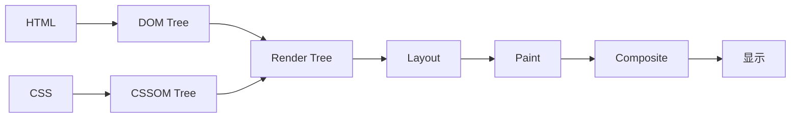
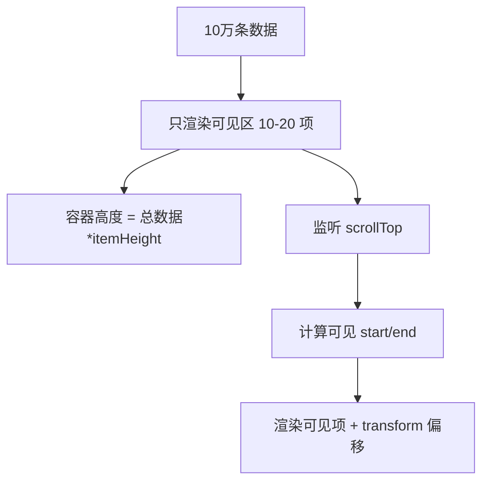

# 渲染原理 · 常见面试题与最佳实践

> 本文档位于 `知识库/前端/运行时与性能/渲染原理/`，是渲染原理的面试题集与生产最佳实践。配套核心知识见《核心知识点详解.md》。
>
> 15 道高频题 + 8 个生产场景 + 完整 Checklist，覆盖渲染流水线、回流重绘、合成层、RAF/RIC、虚拟滚动等面试常考点。

---

## 一、渲染流水线类（高频）

### 1. 浏览器的渲染流水线是什么？

**核心答案**：六步——解析 HTML→DOM、解析 CSS→CSSOM、合成 Render Tree、Layout 布局、Paint 绘制、Composite 合成。



<!-- -->

**详细**：

1. **DOM Tree**：字节 → 字符 → token → 节点 → DOM 树。
2. **CSSOM Tree**：选择器匹配 → 优先级计算 → CSSOM 树。
3. **Render Tree**：DOM + CSSOM，只含可见节点（`display: none` 不入，`visibility: hidden` 入）。
4. **Layout（布局/回流）**：计算盒模型、位置、大小。
5. **Paint（绘制）**：把节点绘制成位图（颜色、阴影、文字、图片）。
6. **Composite（合成）**：把各图层合成为最终图像显示。

**JS 的角色**：JS 能改 DOM/CSSOM，浏览器必须停下渲染等 JS 跑完——所以同步 JS 阻塞渲染。

---

### 2. 回流、重绘、合成有什么区别？

**核心答案**：回流改几何（重新布局）、重绘改视觉（只重绘）、合成只动 transform/opacity（GPU 加速）。

| 类型 | 触发 | 开销 | 示例 |
|---|---|---|---|
| 回流（Layout） | 几何属性变 | 最高 | `width`/`height`/`top`/`margin` |
| 重绘（Paint） | 视觉属性变 | 中 | `color`/`background`/`box-shadow` |
| 合成（Composite） | transform/opacity | 最低 | `transform`/`opacity` |

```css
/* 慢：每帧回流 + 重绘 */
.move-slow { transition: left 1s; left: 0; }
.move-slow.active { left: 100px; }

/* 快：每帧只合成（GPU） */
.move-fast { transition: transform 1s; transform: translateX(0); }
.move-fast.active { transform: translateX(100px); }
```

**关键认知**：

- 回流必引发重绘，重绘不引发回流。
- transform/opacity 不触发回流也不触发重绘，只重新合成（GPU 直接重排纹理）。
- 这是为什么现代动画都用 transform/opacity。

---

### 3. 什么是关键渲染路径？怎么优化？

**核心答案**：CRP 是首屏渲染必须经过的最小资源集合。优化方向：内联 critical CSS、defer JS、preload 关键字体。

**关键资源**：

- HTML 本身（必须）。
- `<head>` 内的 CSS（媒体匹配的）。
- 同步加载的 JS（无 defer/async）。

**优化策略**：

```html
<!-- 1. 内联 critical CSS -->
<style>
  body { margin: 0; }
  .hero { ... }
</style>

<!-- 2. 异步加载 non-critical CSS -->
<link rel="preload" href="/all.css" as="style" onload="this.rel='stylesheet'">
<noscript><link rel="stylesheet" href="/all.css"></noscript>

<!-- 3. defer 加载 JS（应用主脚本） -->
<script src="/app.js" defer></script>

<!-- 4. async 加载独立 JS（统计） -->
<script src="/analytics.js" async></script>

<!-- 5. 预连接 CDN/API -->
<link rel="preconnect" href="https://cdn.example.com">
<link rel="preconnect" href="https://api.example.com" crossorigin>

<!-- 6. 预加载关键字体 -->
<link rel="preload" href="/fonts/inter.woff2" as="font" type="font/woff2" crossorigin>
```

**资源加载属性对比**：

| 属性 | 下载 | 执行 | 顺序 |
|---|---|---|---|
| 默认 | 阻塞解析 | 阻塞解析 | 文档顺序 |
| `async` | 不阻塞 | 阻塞（下载完立即） | 任意顺序 |
| `defer` | 不阻塞 | 不阻塞（解析完执行） | 文档顺序 |
| `type="module"` | 不阻塞 | defer 行为 | 文档顺序 |

---

## 二、回流与重绘类（高频）

### 4. 什么是强制同步布局（Layout Thrashing）？怎么避免？

**核心答案**：读写布局属性交替进行，每次读都强制浏览器立即回流（防止读到旧值）。修复：批量读完再批量写。

```js
// 错：读写交替，每次读 offsetLeft 强制回流
for (let i = 0; i < items.length; i++) {
  items[i].style.left = items[i].offsetLeft + 10 + "px";
}
// 1000 个 item → 1000 次回流
```

```js
// 对：先读完再写
const offsets = items.map(el => el.offsetLeft);  // 一次回流
items.forEach((el, i) => {
  el.style.left = offsets[i] + 10 + "px";         // 批量写，不读
});
// 总共 1 次回流
```

**触发强制回流的属性**：

```js
// 读这些属性会立即触发回流
el.offsetTop;
el.offsetHeight;
el.offsetLeft;
el.offsetWidth;
el.clientX/Top/Width/Height;
el.scrollWidth/Height/Top/Left;
el.getBoundingClientRect();
el.getClientRects();
window.getComputedStyle(el);
window.scrollX/Y;
window.innerWidth/Height;
```

**原理**：

- 浏览器会批量优化样式变更（一次回流处理多次变更）。
- 但读布局属性会**立即触发回流**——浏览器为保证读到最新值，必须立即计算布局。
- 读写交替 → 每次读都打断批量优化 → N 次回流。

**最佳实践**：

- 用变量缓存读取的布局值。
- 不要在循环里读布局。
- 用 ResizeObserver 监听变化，避免手动轮询。

---

### 5. 怎么减少回流？

**核心答案**：从五个维度——批量样式变更、避免强制同步布局、离线 DOM 操作、用 transform 替代 top/left、用 contain。

```js
// 1. 批量样式变更（用 class 而非逐个改）
// 错：
el.style.width = "100px";
el.style.height = "200px";
el.style.margin = "10px";

// 对：
el.className = "active";  // 一次 class 切换

// 或用 cssText
el.style.cssText = "width: 100px; height: 200px; margin: 10px;";

// 2. 离线 DOM 操作（display: none → 改 → display: block）
el.style.display = "none";
// 大量改动（回流不计算）
el.style.display = "block";
// 只一次回流

// 3. 用 DocumentFragment 批量插入
const frag = document.createDocumentFragment();
items.forEach(item => {
  const li = document.createElement("li");
  li.textContent = item;
  frag.appendChild(li);
});
ul.appendChild(frag);  // 一次回流

// 4. 用 transform 替代 top/left
// 错：el.style.top = "100px";（回流）
// 对：el.style.transform = "translateY(100px)";（合成）

// 5. 用 contain 限制回流范围
```

```css
/* contain 让浏览器知道元素内部不影响外部 */
.widget {
  contain: layout;  /* 内部布局变化不影响外部 */
}

/* 大列表每项用 contain */
.list-item {
  contain: layout style paint;
}

/* content-visibility 跳过不可见区域渲染 */
.long-list-item {
  content-visibility: auto;
  contain-intrinsic-size: 100px;
}
```

---

## 三、合成层与 GPU 加速类（高频）

### 6. 什么是合成层？哪些 CSS 会触发？

**核心答案**：合成层是独立 GPU 处理的图层，transform/opacity/filter/will-change 等会触发。

```css
/* 触发合成层的属性 */
.gpu-1 { transform: translateZ(0); }            /* 3D 变换 */
.gpu-2 { opacity: 0.5; }                          /* opacity < 1 + 动画 */
.gpu-3 { animation: slide 1s; }                  /* transform/opacity 动画 */
.gpu-4 { will-change: transform; }               /* 显式声明 */
.gpu-5 { filter: blur(5px); }                    /* CSS filter */
.gpu-6 { position: fixed; }                      /* 固定定位（受限） */

video, canvas, iframe { /* 自动提升 */ }
```

**为什么 GPU 加速快**：


<!-- -->

- 主线程只绘制一次（图层位图）。
- 后续 transform/opacity 变化由合成器线程 + GPU 处理，不触发主线程回流/重绘。
- 主线程可以继续处理 JS、其他渲染。

**为什么 transform 比 top 快**：

- `top: 100px` → 回流（重新布局）+ 重绘。
- `transform: translateY(100px)` → 只合成（GPU 重排纹理，主线程不参与）。

---

### 7. will-change 怎么用？有什么陷阱？

**核心答案**：`will-change` 提前提示浏览器创建图层。陷阱：过度使用导致内存爆炸。

```css
/* 对：只对真动画元素开 */
.smooth-anim { will-change: transform, opacity; }
```

**陷阱**：

```css
/* 错：每个元素都开，内存爆炸 */
* { will-change: transform; }

/* 错：动画结束不移除，图层永不释放 */
.fade { will-change: opacity; transition: opacity 1s; }
```

**最佳实践**：

```js
// 动画前加，动画后移
el.addEventListener("mouseenter", () => {
  el.style.willChange = "transform";
});
el.addEventListener("transitionend", () => {
  el.style.willChange = "auto";  // 用完移除
});
```

**症状**：

- 内存占用大（每层位图占用内存）。
- 合成时间长（层数过多）。
- 移动端可能崩溃。

**修复**：

- 只对真动画元素开 will-change。
- 动画结束移除。
- 用 transform/opacity 动画。
- 限制图层层数（< 30 层为佳）。

---

## 四、帧调度类（高频）

### 8. requestAnimationFrame 与 setTimeout 有什么区别？

**核心答案**：RAF 同步浏览器帧率（60FPS = 16.6ms），后台暂停节省电；setTimeout 不感知渲染帧，可能掉帧。

```js
// 错：setTimeout 不感知帧，可能与帧错开
function loop() {
  update();
  setTimeout(loop, 16);
}

// 对：RAF 同步帧
function loop() {
  update();
  requestAnimationFrame(loop);
}
requestAnimationFrame(loop);
```

| 维度 | RAF | setTimeout |
|---|---|---|
| 帧率同步 | 是（60FPS） | 否 |
| 后台 | 暂停 | 继续 |
| 调度精度 | 帧级 | ms 级（不稳定） |
| 适用 | 动画、UI 更新 | 定时任务、轮询 |

**关键认知**：

- 浏览器每 16.6ms（60FPS）渲染一帧。
- RAF 在每帧渲染前调用，对齐帧避免掉帧。
- setTimeout 16ms 可能在帧间隙触发，导致这帧没渲染下次才有——掉帧。
- RAF 在 tab 后台时暂停，节省电（移动端友好）。

---

### 9. requestIdleCallback 是什么？什么时候用？

**核心答案**：浏览器空闲时调用，不阻塞关键任务。用于低优先级任务（日志、预取、统计）。

```js
// 浏览器空闲时跑
requestIdleCallback((deadline) => {
  while (deadline.timeRemaining() > 0 && tasks.length) {
    const task = tasks.shift();
    task();
  }
  if (tasks.length) requestIdleCallback(handler);
});
```

**用途**：

- 数据预取（如预加载下一页）。
- 日志上报（不阻塞交互）。
- 虚拟列表预渲染（不可见项预热）。
- 大数据解析（CSV、JSON）。

**与 RAF 区别**：

| 维度 | RAF | RIC |
|---|---|---|
| 触发时机 | 下一帧渲染前 | 浏览器空闲 |
| 帧率同步 | 是 | 否 |
| 适用 | 动画、UI 更新 | 低优先级任务 |
| 后台 | 暂停 | 不调用 |

**长任务拆分示例**：

```js
function processChunked(items) {
  let i = 0;
  function chunk(deadline) {
    while (i < items.length && deadline.timeRemaining() > 0) {
      heavyWork(items[i]);
      i++;
    }
    if (i < items.length) requestIdleCallback(chunk);
  }
  requestIdleCallback(chunk);
}
```

---

### 10. 怎么优化长任务？

**核心答案**：拆分到多帧（每帧 < 50ms），或用 Web Worker 移出主线程。

```js
// 错：长任务阻塞主线程 100ms
function process(items) {
  items.forEach(item => heavyWork(item));
}

// 对 1：拆分到多帧
function processChunked(items) {
  let i = 0;
  function chunk() {
    const start = performance.now();
    while (i < items.length && performance.now() - start < 16) {
      heavyWork(items[i]);
      i++;
    }
    if (i < items.length) {
      requestIdleCallback(chunk);
      // 或 requestAnimationFrame(chunk);
    }
  }
  chunk();
}

// 对 2：放到 Worker
const worker = new Worker("./worker.js");
worker.postMessage({ data: items });
worker.onmessage = (e) => console.log(e.data);

// worker.js
self.onmessage = (e) => {
  const result = e.data.data.map(item => heavyWork(item));
  self.postMessage(result);
};
```

**判断长任务**：

```js
// 用 PerformanceObserver 监听 > 50ms 的任务
const observer = new PerformanceObserver((list) => {
  list.getEntries().forEach((entry) => {
    console.log("长任务", entry.duration, "ms");
  });
});
observer.observe({ entryTypes: ["longtask"] });
```

**scheduler.postTask（Chrome 94+）**：

```js
// 按优先级调度
scheduler.postTask(() => updateUI(), { priority: "user-visible" });
scheduler.postTask(() => prefetchData(), { priority: "background" });
```

---

## 五、虚拟滚动与 DOM 优化类（高频）

### 11. 为什么大列表要虚拟滚动？怎么实现？

**核心答案**：10 万 DOM 节点会爆内存 + 卡顿。虚拟滚动只渲染可见项（10-20 个），用占位容器维持滚动条。



<!-- -->

**实现示例**：

```jsx
function VirtualList({ items, itemHeight, visibleCount }) {
  const [scrollTop, setScrollTop] = useState(0);

  const onScroll = (e) => setScrollTop(e.target.scrollTop);

  const startIndex = Math.floor(scrollTop / itemHeight);
  const endIndex = Math.min(
    startIndex + visibleCount + 5,  // 缓冲 5 项
    items.length
  );

  return (
    <div
      style={{ height: visibleCount * itemHeight, overflow: "auto" }}
      onScroll={onScroll}
    >
      <div style={{ height: items.length * itemHeight, position: "relative" }}>
        {items.slice(startIndex, endIndex).map((item, i) => (
          <div
            key={startIndex + i}
            style={{
              position: "absolute",
              top: (startIndex + i) * itemHeight,
              height: itemHeight,
            }}
          >
            {item.content}
          </div>
        ))}
      </div>
    </div>
  );
}
```

**成熟库**：

- **react-window**：轻量（6KB）。
- **react-virtuoso**：功能强（不定高度、分组）。
- **@tanstack/react-virtual**：框架无关。

```jsx
import { FixedSizeList } from "react-window";

<FixedSizeList
  height={500}
  width={300}
  itemCount={100000}
  itemSize={50}
>
  {({ index, style }) => <div style={style}>Item {index}</div>}
</FixedSizeList>;
```

**content-visibility 替代方案（Chrome 85+）**：

```css
/* 自动跳过不可见区域渲染 */
.long-list-item {
  content-visibility: auto;
  contain-intrinsic-size: 100px;
}
```

不需要虚拟滚动逻辑，浏览器自动跳过不可见区域。

---

### 12. scroll 事件怎么优化才不卡？

**核心答案**：用 RAF 节流 + passive listener，避免阻塞滚动。

```js
// 错：scroll 频繁触发，没节流
window.addEventListener("scroll", () => {
  update();  // 每秒触发几十次
});

// 对 1：RAF 节流
let ticking = false;
window.addEventListener("scroll", () => {
  if (!ticking) {
    requestAnimationFrame(() => {
      update();
      ticking = false;
    });
    ticking = true;
  }
});

// 对 2：passive listener（不阻塞滚动）
window.addEventListener("scroll", handler, { passive: true });

// 对 3：IntersectionObserver 替代 scroll
const observer = new IntersectionObserver((entries) => {
  entries.forEach(entry => {
    if (entry.isIntersecting) {
      entry.target.classList.add("visible");
    }
  });
}, { threshold: 0.1 });

document.querySelectorAll(".lazy").forEach(el => observer.observe(el));
```

**passive 的意义**：

- 浏览器默认 `touchstart`/`wheel`/`scroll` 等事件可能调用 `preventDefault()`，必须等 handler 跑完才能滚动。
- `passive: true` 告诉浏览器不会 preventDefault，可以并行滚动。
- 移动端尤其重要——避免滚动卡顿。

---

## 六、Web Worker 与 JS 性能类（高频）

### 13. 什么时候用 Web Worker？

**核心答案**：CPU 密集任务、大数据处理、不阻塞 UI 的后台任务。

| 场景 | 用 Worker | 不用 |
|---|---|---|
| 图像处理 | ✓ | < 100ms |
| 加密/压缩 | ✓ | 简单 hash |
| CSV/JSON 解析 | ✓（大文件） | < 1MB |
| AI 推理 | ✓ | 小模型 |
| IndexedDB | 可（少量） | 简单读写 |
| DOM 操作 | ✗（不能访问 DOM） | 直接做 |

```js
// main.js
const worker = new Worker("./worker.js");
worker.postMessage({ data: largeArray });
worker.onmessage = (e) => console.log("结果", e.data);

// worker.js
self.onmessage = (e) => {
  const result = heavyCompute(e.data.data);
  self.postMessage(result);
};
```

**注意**：

- **不能访问 DOM**：Worker 无 `window`/`document`，只有 `self`。
- **数据传递开销**：postMessage 默认结构化克隆，大对象慢。用 `Transferable`（ArrayBuffer）零拷贝。
- **启动开销**：Worker 启动有成本，小任务别用。
- **不能跨域**：Worker 文件需同源（除非 importScripts）。

```js
// 用 Transferable 零拷贝
const buffer = new ArrayBuffer(1024 * 1024);
worker.postMessage(buffer, [buffer]);  // 转移所有权
```

---

### 14. 怎么优化 JS 执行性能？

**核心答案**：从 V8 优化、数组优化、防抖节流三个维度。

**1. V8 优化**：

```js
// 1. 对象形状稳定（hidden class）
class User {
  constructor(name, age) {
    this.name = name;  // 顺序一致
    this.age = age;
  }
}

// 错：动态添加属性破坏 hidden class
const u = {};
u.name = "Tom";
u.age = 18;
// 每次添加属性创建新 hidden class

// 2. 函数单态（参数类型一致）
function add(a, b) { return a + b; }
add(1, 2);       // 单态（整数版本，最快）
add(1.5, 2.5);   // 多态（浮点版本）
add("a", "b");   // 多态（字符串版本）
// 单态比多态快 5-10x

// 3. 避免 arguments.callee/with/eval（禁优化）
```

**2. 数组优化**：

```js
// 1. 类型一致
const nums = [1, 2, 3];      // PACKED_SMI_ELEMENTS（最快）
const mixed = [1, "a", {}];  // PACKED_ELEMENTS（慢）

// 2. 避免稀疏数组
const arr = [1, 2, 3];
arr[100] = 4;  // 变稀疏（HOLEY_ELEMENTS，慢）

// 3. 预分配大小
const arr = new Array(100);  // 比 push 快

// 4. 热点代码用 for 循环
for (let i = 0; i < arr.length; i++) { ... }  // 比 forEach 略快
```

**3. 防抖节流**：

```js
// 防抖：等待静止后才执行
function debounce(fn, delay) {
  let timer;
  return (...args) => {
    clearTimeout(timer);
    timer = setTimeout(() => fn(...args), delay);
  };
}

// 节流：固定间隔一次
function throttle(fn, interval) {
  let last = 0;
  return (...args) => {
    const now = Date.now();
    if (now - last >= interval) {
      last = now;
      fn(...args);
    }
  };
}

// RAF 节流（同步帧）
function rafThrottle(fn) {
  let ticking = false;
  return (...args) => {
    if (!ticking) {
      requestAnimationFrame(() => {
        fn(...args);
        ticking = false;
      });
      ticking = true;
    }
  };
}

// 用法
input.addEventListener("input", debounce(search, 300));
window.addEventListener("scroll", rafThrottle(update));
```

---

## 七、CSS 性能类（高频）

### 15. CSS 选择器怎么写才快？contain/content-visibility 怎么用？

**核心答案**：选择器从右向左匹配，越右越具体越好；contain 限制回流范围；content-visibility 跳过不可见区域。

**选择器性能**：

```css
/* 慢：复杂选择器，从右向左匹配 */
.nav > ul > li > a > span.icon { color: red; }
/* 先匹配所有 span.icon，再过滤 */

/* 快：直接类选择器 */
.icon { color: red; }
```

**避免**：

- 深层嵌套（> 3 层）。
- 通配符 `*`（匹配所有）。
- 属性选择器 `[type="text"]`（比类慢）。
- 标签选择器 `div`（比类慢）。

**contain 限制回流**：

```css
.widget {
  contain: layout;       /* 内部布局不影响外部 */
  /* contain: paint; */  /* 内部绘制不溢出 */
  /* contain: strict; */ /* layout + paint + size */
}

/* 大列表用 contain */
.list-item {
  contain: layout style paint;
}
```

**content-visibility 跳过不可见**：

```css
/* Chrome 85+，自动跳过不可见区域 */
.long-list-item {
  content-visibility: auto;
  contain-intrinsic-size: 100px;  /* 占位高度 */
}
```

**效果**：

- 不可见区域不渲染、不布局、不绘制。
- 大幅提升长列表、长文档性能。
- 滚动到可见时才渲染。

**属性优先级**：

```css
/* 性能从优到劣 */
/* 1. transform/opacity（只合成，最佳） */
.anim { transform: translateX(100px); opacity: 0.5; }

/* 2. visibility（只重绘） */
.toggle { visibility: hidden; }

/* 3. color/background（重绘） */
.color { color: red; }

/* 4. width/height/margin（回流+重绘，最差） */
.resize { width: 200px; }
```

---

## 八、生产最佳实践

### 8.1 推荐动画 CSS

```css
/* 用 transform/opacity 做动画 */
.fade-in {
  opacity: 0;
  transform: translateY(20px);
  transition: opacity 0.3s, transform 0.3s;
}

.fade-in.visible {
  opacity: 1;
  transform: translateY(0);
}

/* 复杂动画用 will-change */
.complex-anim {
  will-change: transform, opacity;
  animation: slide 1s ease;
}

@keyframes slide {
  from { transform: translateX(-100%); opacity: 0; }
  to { transform: translateX(0); opacity: 1; }
}

/* 动画结束移除 will-change */
.complex-anim.done { will-change: auto; }
```

### 8.2 推荐长列表方案

```jsx
import { FixedSizeList } from "react-window";

function BigList({ items }) {
  return (
    <FixedSizeList
      height={600}
      width="100%"
      itemCount={items.length}
      itemSize={50}
      overscanCount={5}
    >
      {({ index, style }) => (
        <div style={style}>
          {items[index].name}
        </div>
      )}
    </FixedSizeList>
  );
}
```

### 8.3 推荐滚动监听

```js
// 用 IntersectionObserver 替代 scroll
const lazyLoadObserver = new IntersectionObserver(
  (entries) => {
    entries.forEach((entry) => {
      if (entry.isIntersecting) {
        const img = entry.target;
        img.src = img.dataset.src;
        lazyLoadObserver.unobserve(img);
      }
    });
  },
  { rootMargin: "50px" }
);

document.querySelectorAll("img[data-src]").forEach(img => {
  lazyLoadObserver.observe(img);
});

// scroll 必须用时用 RAF 节流 + passive
let ticking = false;
window.addEventListener("scroll", () => {
  if (!ticking) {
    requestAnimationFrame(() => {
      update();
      ticking = false;
    });
    ticking = true;
  }
}, { passive: true });
```

### 8.4 推荐 Web Worker 用法

```js
// 内联 Worker（无需单独文件）
function createWorker(workerFunc) {
  const blob = new Blob([`(${workerFunc})()`], { type: "application/javascript" });
  return new Worker(URL.createObjectURL(blob));
}

const worker = createWorker(() => {
  self.onmessage = (e) => {
    const result = heavyCompute(e.data);
    self.postMessage(result);
  };
});

worker.postMessage(largeData);
worker.onmessage = (e) => {
  console.log("结果", e.data);
};
```

### 8.5 推荐长任务拆分

```js
function chunkedProcess(items, processor, onProgress, onComplete) {
  let i = 0;
  function processChunk(deadline) {
    const hasDeadline = deadline && deadline.timeRemaining;
    while (
      i < items.length &&
      (!hasDeadline || deadline.timeRemaining() > 0)
    ) {
      processor(items[i], i);
      i++;
      if (performance.now() - startTime > 16) break;
    }
    onProgress(i / items.length);
    if (i < items.length) {
      (requestIdleCallback || requestAnimationFrame)(processChunk);
    } else {
      onComplete();
    }
  }
  const startTime = performance.now();
  (requestIdleCallback || requestAnimationFrame)(processChunk);
}
```

### 8.6 推荐性能监控

```js
// 监听长任务
const longTaskObserver = new PerformanceObserver((list) => {
  list.getEntries().forEach((entry) => {
    if (entry.duration > 50) {
      console.warn("长任务", entry.duration, "ms");
    }
  });
});
longTaskObserver.observe({ entryTypes: ["longtask"] });

// 监听布局抖动
const layoutShiftObserver = new PerformanceObserver((list) => {
  list.getEntries().forEach((entry) => {
    if (!entry.hadRecentInput) {
      console.warn("布局抖动", entry.value);
    }
  });
});
layoutShiftObserver.observe({ entryTypes: ["layout-shift"] });
```

---

## 九、最佳实践 Checklist

### 9.1 关键渲染路径

- 内联 critical CSS
- 异步加载 non-critical CSS
- `defer` 加载应用 JS
- `async` 加载独立 JS
- 预连接 CDN/API
- 预加载关键字体

### 9.2 回流与重绘

- 动画用 transform/opacity
- 批量读写避免强制同步布局
- 用 `contain` 限制回流范围
- 用 `content-visibility: auto` 长列表
- 复杂动画用 will-change

### 9.3 帧调度

- 动画用 requestAnimationFrame
- 低优先级用 requestIdleCallback
- 长任务拆分（< 50ms/帧）
- scroll/resize 用 RAF 节流
- 事件加 `passive: true`

### 9.4 DOM 优化

- 大列表用虚拟滚动
- 减少 DOM 嵌套层级
- 用 DocumentFragment 批量插入
- 离线 DOM 操作
- IntersectionObserver 替代 scroll

### 9.5 JS 性能

- 对象形状稳定
- 函数单态
- 数组类型一致
- 避免稀疏数组
- CPU 密集用 Web Worker

### 9.6 CSS 性能

- 选择器简短具体（用类）
- 避免深嵌套
- 用 `contain` 限制回流
- 用 `content-visibility` 长列表
- 优先 transform/opacity 动画

---

## 十、一句话总纲

> 渲染原理的本质是 **"HTML→DOM、CSS→CSSOM、合成 Render Tree→Layout→Paint→Composite"**：回流改几何（重新布局）、重绘改视觉（只重绘）、合成只动 transform/opacity（GPU 加速）；关键渲染路径决定首屏——内联 critical CSS、defer JS、preload 字体；用 RAF 同步帧、RIC 跑低优先级任务、长任务拆到多帧；虚拟滚动只渲染可见项、Web Worker 把 CPU 密集移出主线程。能答出"渲染流水线六步""回流重绘合成区别""为什么 transform 比 top 快""RAF 与 RIC 区别""强制同步布局怎么避免""虚拟滚动原理""will-change 陷阱"，就是高级前端对渲染原理的认知。
