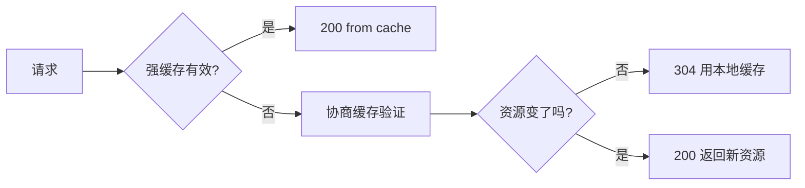
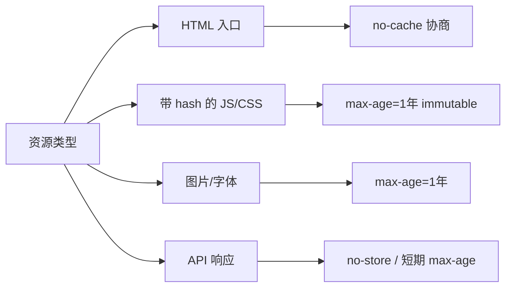
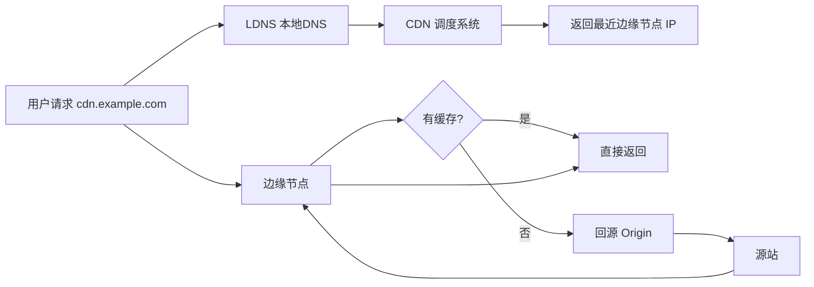
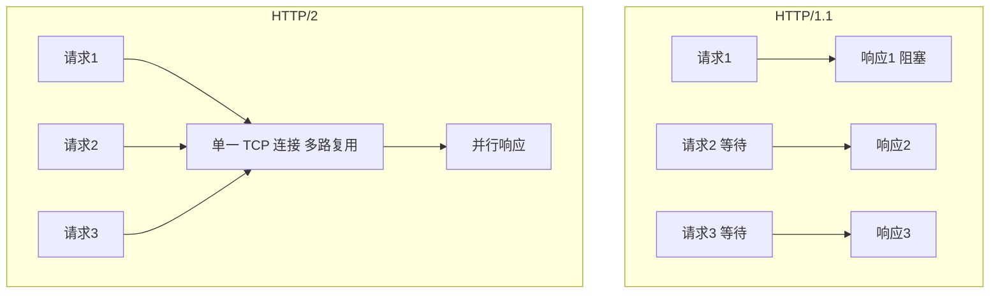
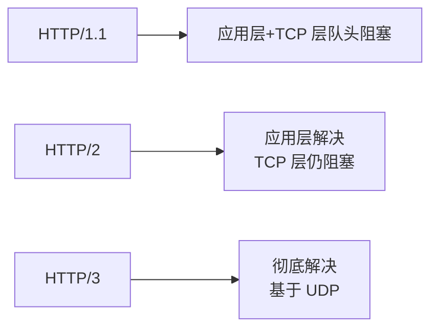
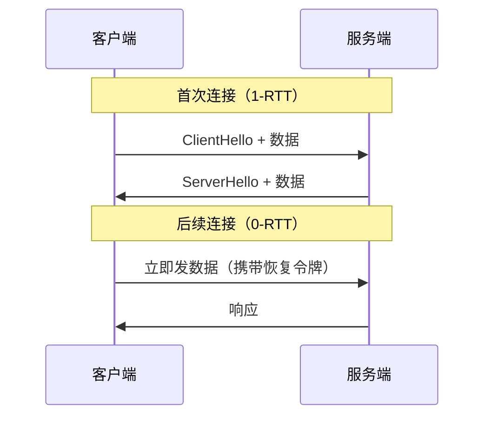
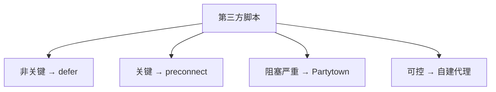

# 网络与缓存 · 常见面试题与最佳实践

> 本文档位于 `知识库/前端/运行时与性能/网络与缓存/`，是网络与缓存的面试题集与生产最佳实践。配套核心知识见《核心知识点详解.md》。
>
> 15 道高频题 + 6 个生产场景 + 完整 Checklist，覆盖 HTTP 缓存、Cache-Control、Service Worker、CDN、HTTP/2 / 3、资源预加载、第三方治理等面试常考点。

---

## 一、HTTP 缓存类（高频）

### 1. 强缓存和协商缓存有什么区别？

**核心答案**：强缓存未过期时不发请求直接用本地缓存；协商缓存过期后发请求带验证字段，服务器返回 304 才用缓存。

| 维度 | 强缓存 | 协商缓存 |
|---|---|---|
| 触发条件 | 未过期 | 已过期 |
| 请求服务器 | 否 | 是 |
| 状态码 | 200 (from cache) | 304 Not Modified |
| 控制字段 | Cache-Control / Expires | ETag / Last-Modified |
| 速度 | 快（零 RTT） | 中（需一次 RTT） |
| 一致性 | 差（过期前看不到更新） | 好 |



<!-- -->

**关键认知**：

- 浏览器先看强缓存 → 未过期直接用 → 过期走协商。
- `no-cache` 跳过强缓存，直接协商。
- `no-store` 直接禁用所有缓存。

---

### 2. Cache-Control 的 no-cache 和 no-store 区别？

**核心答案**：`no-cache` 仍缓存，但每次必须协商验证；`no-store` 完全不缓存。

| 字段 | 缓存 | 协商 | 状态码 |
|---|---|---|---|
| `no-cache` | 是 | 是（每次） | 200 or 304 |
| `no-store` | 否 | - | 每次都 200 |
| `max-age=0` | 是 | 是（每次） | 200 or 304 |

**典型场景**：

```
# HTML 入口：每次验证（用户看到最新版）
Cache-Control: no-cache

# 用户隐私 API：完全不缓存
Cache-Control: no-store

# 公开静态资源：长期缓存（带 hash）
Cache-Control: public, max-age=31536000, immutable

# 共享缓存（CDN）：s-maxage 覆盖 max-age
Cache-Control: public, max-age=600, s-maxage=86400
```

**易混淆点**：

- `no-cache` 不代表"不缓存"，而是"必须协商验证"。
- `max-age=0` ≈ `no-cache`（每次协商）。
- `private` 表示只浏览器缓存，CDN 不能缓存。

---

### 3. ETag 和 Last-Modified 哪个优先？

**核心答案**：ETag 优先。Last-Modified 只能精确到 1 秒，ETag 是内容 hash，更精确。

**优先级判断**：

1. 服务器同时返回 ETag 和 Last-Modified。
2. 浏览器请求时同时带 `If-None-Match` 和 `If-Modified-Since`。
3. 服务器**先验证 ETag**，匹配后再验证 Last-Modified。
4. 都匹配才返回 304。

**对比**：

| 维度 | ETag | Last-Modified |
|---|---|---|
| 精度 | 字节级（hash） | 1 秒 |
| 计算 | 服务端 hash | 文件 mtime |
| 优先级 | 高 | 低 |
| 性能 | hash 开销 | 几乎无 |
| 限制 | 大文件 hash 慢 | 1 秒内改多次不准 |

**示例**：

```
# 首次响应
HTTP/1.1 200 OK
ETag: "abc123"
Last-Modified: Wed, 21 Oct 2025 07:28:00 GMT
Cache-Control: max-age=0

# 协商请求
GET /file HTTP/1.1
If-None-Match: "abc123"
If-Modified-Since: Wed, 21 Oct 2025 07:28:00 GMT

# 验证通过
HTTP/1.1 304 Not Modified
```

---

### 4. 怎么设计 JS/CSS/HTML 的缓存策略？

**核心答案**：

- **HTML**：`no-cache`，每次协商（入口文件名不变，必须看到最新版）。
- **JS/CSS（带 hash）**：`max-age=31536000, immutable`，永久缓存。
- **API**：按业务，敏感数据 `no-store`，公开数据短缓存。



<!-- -->

**HTML 配置**：

```
Cache-Control: no-cache
```

- HTML 是入口，文件名不带 hash，必须每次协商验证。
- 否则用户改了 HTML 但浏览器一直用旧版。

**JS/CSS 配置**（带 hash 文件名）：

```
Cache-Control: public, max-age=31536000, immutable
```

- 文件名带 hash（如 `app.a1b2c3.js`）。
- 内容变 → hash 变 → URL 变 → 浏览器请求新文件。
- 旧文件名永远不再请求，缓存一年安全。
- `immutable` 防止用户 F5 主动刷新时也走协商缓存。

**HTML 引用方式**：

```html
<!-- Vite/Webpack 自动注入 hash 文件名 -->
<script type="module" src="/assets/index.a1b2c3.js"></script>
<link rel="stylesheet" href="/assets/index.d4e5f6.css">
```

**API 配置**：

```
# 用户敏感数据：不缓存
Cache-Control: no-store

# 公开数据（如产品列表）：短缓存
Cache-Control: public, max-age=60

# 频率受限 API：长缓存 + 后台刷新
Cache-Control: public, max-age=3600, stale-while-revalidate=86400
```

---

### 5. 用户主动刷新（F5）和强制刷新（Ctrl+F5）有什么不同？

**核心答案**：

| 操作 | 缓存行为 |
|---|---|
| 普通访问 | 强缓存 → 协商缓存 → 网络 |
| F5（刷新） | 跳过强缓存，直接协商 |
| Ctrl+F5（强制刷新） | 跳过所有缓存，全部重新下载 |
| 后退按钮 | 用强缓存（不发请求） |

**F5 的请求头**：

```
Cache-Control: max-age=0
```

- 跳过强缓存，但仍走协商（可能 304）。

**Ctrl+F5 的请求头**：

```
Cache-Control: no-cache
Pragma: no-cache
```

- 完全跳过缓存，重新下载所有资源。

**`immutable` 字段的作用**：

```
Cache-Control: max-age=31536000, immutable
```

- 即使 F5 也走强缓存（不再发协商请求）。
- 适用于带 hash 的资源。

---

## 二、Service Worker 类

### 6. Service Worker 缓存有哪些策略？

**核心答案**：5 种常用策略——Cache First、Network First、Stale While Revalidate、Cache Only、Network Only。

| 策略 | 适用 | 逻辑 |
|---|---|---|
| Cache First | 静态资源（JS/CSS/字体） | 缓存有就用，无则请求并缓存 |
| Network First | 关键 API / 实时数据 | 优先网络，失败回退缓存 |
| Stale While Revalidate | 图片 / 非关键资源 | 立即返回缓存，同时后台更新 |
| Cache Only | 离线包 / 预缓存 | 只用缓存（无网络） |
| Network Only | 强实时数据（股价） | 只用网络 |

**代码实现**：

```js
// Cache First：静态资源
async function cacheFirst(req) {
  const cached = await caches.match(req);
  if (cached) return cached;
  const res = await fetch(req);
  const cache = await caches.open("v1");
  cache.put(req, res.clone());
  return res;
}

// Network First：关键 API
async function networkFirst(req) {
  try {
    const res = await fetch(req);
    const cache = await caches.open("api");
    cache.put(req, res.clone());
    return res;
  } catch (err) {
    const cached = await caches.match(req);
    return cached || new Response("Offline", { status: 503 });
  }
}

// Stale While Revalidate：图片
async function swr(req) {
  const cached = await caches.match(req);
  const networkPromise = fetch(req).then(res => {
    caches.open("img").then(c => c.put(req, res.clone()));
    return res;
  });
  return cached || networkPromise;
}
```

**Workbox 简化**：

```js
import { registerRoute } from "workbox-routing";
import { CacheFirst, NetworkFirst, StaleWhileRevalidate } from "workbox-strategies";

registerRoute(
  ({ request }) => request.destination === "script",
  new CacheFirst({ cacheName: "js" })
);
registerRoute(
  ({ url }) => url.pathname.startsWith("/api/"),
  new NetworkFirst({ cacheName: "api", networkTimeoutSeconds: 3 })
);
registerRoute(
  ({ request }) => request.destination === "image",
  new StaleWhileRevalidate({ cacheName: "img" })
);
```

---

### 7. Service Worker 怎么更新缓存？

**核心答案**：用版本号管理 + activate 时清理旧缓存 + skipWaiting + controllerchange 提示用户。

```js
const CACHE_VERSION = "v2";
const PRECACHE = ["/", "/main.js", "/styles.css"];

// 安装时预缓存新资源
self.addEventListener("install", e => {
  e.waitUntil(
    caches.open(CACHE_VERSION).then(c => c.addAll(PRECACHE))
  );
  self.skipWaiting();  // 跳过等待，立即激活
});

// 激活时清理旧版本缓存
self.addEventListener("activate", e => {
  e.waitUntil(
    caches.keys().then(keys => Promise.all(
      keys.filter(k => k !== CACHE_VERSION)
          .map(k => caches.delete(k))
    ))
  );
  self.clients.claim();  // 立即接管所有客户端
});
```

**前端提示用户刷新**：

```js
// 监听 SW 更新
let refreshing = false;
navigator.serviceWorker.addEventListener("controllerchange", () => {
  if (refreshing) return;
  refreshing = true;
  window.location.reload();
});

// 主动检查更新
setInterval(() => {
  navigator.serviceWorker.getRegistration().then(reg => {
    reg.update();
  });
}, 60 * 60 * 1000);  // 每小时
```

**用户提示**：

```js
navigator.serviceWorker.addEventListener("message", e => {
  if (e.data === "NEW_VERSION_AVAILABLE") {
    if (confirm("新版本可用，刷新页面？")) {
      navigator.serviceWorker.controller.postMessage("SKIP_WAITING");
    }
  }
});
```

---

## 三、CDN 类

### 8. CDN 的工作原理是什么？

**核心答案**：用户请求 CDN 域名 → DNS 返回最近边缘节点 IP → 边缘节点有缓存直接返回，无缓存回源站。



<!-- -->

**详细流程**：

1. 用户请求 `cdn.example.com/img.jpg`。
2. 本地 DNS 解析到 CDN 调度系统。
3. 调度返回**就近边缘节点 IP**（基于地理位置、网络质量、负载）。
4. 用户请求边缘节点。
5. 边缘节点有缓存 → 直接返回。
6. 边缘无缓存 → 回源站拉取，缓存后返回。

**缓存层级**：

```
用户 → 边缘节点（L1）→ 中间节点（L2）→ 源站
```

- L1 命中率最高（>90%）。
- L2 缓存共享多个 L1 请求，减少回源。
- 源站压力大幅降低。

---

### 9. CDN 缓存怎么刷新？发版后用户能看到最新版吗？

**核心答案**：带 hash 的资源无需刷新（新文件名）；HTML 等无 hash 资源用主动刷新 API。

**场景分析**：

| 资源 | 是否需要刷新 | 原因 |
|---|---|---|
| 带 hash 的 JS/CSS | 否 | 内容变 → hash 变 → URL 变 → 新请求 |
| HTML | 是 | 文件名不变，CDN 缓存旧版 |
| API 响应 | 是 | 业务数据更新 |
| 图片 | 看需求 | 内容改了但 URL 没变 |

**刷新方法**：

```bash
# 1. 主动刷新 API（以阿里云为例）
curl -X POST https://cdn.aliyun.com/refresh \
  -d '{"paths":["/","/index.html"]}'

# 2. 预热 API（发版前主动推送新资源到边缘节点）
curl -X POST https://cdn.aliyun.com/push \
  -d '{"paths":["/assets/app.a1b2c3.js"]}'
```

**最佳实践**：

1. **发版前预热**：新 hash 文件发布前主动预热到 CDN，避免冷启动。
2. **HTML 主动刷新**：发版后调用刷新 API。
3. **HTML 短缓存**：`Cache-Control: max-age=60`，最多 1 分钟延迟。
4. **带版本号查询参数**：`/index.html?v=2`，强制 URL 变化。

**关键陷阱**：

- CDN 刷新有延迟（1~5 分钟生效）。
- 用户本地缓存可能仍命中（不刷新浏览器）。
- 跨多个 CDN 厂商时需要同时刷新。

---

## 四、HTTP/2 / HTTP/3 类

### 10. HTTP/2 相比 HTTP/1.1 有什么改进？

**核心答案**：多路复用、头部压缩（HPACK）、二进制分帧、服务器推送（已废弃）。



<!-- -->

**改进点**：

| 特性 | HTTP/1.1 | HTTP/2 |
|---|---|---|
| 多路复用 | 否（管道化有队头阻塞） | 是 |
| 头部压缩 | 否 | HPACK |
| 二进制分帧 | 否 | 是 |
| 服务器推送 | 否 | 是（已废弃） |
| 优先级 | 否 | 是 |
| 流量控制 | 否 | 是 |

**为什么 HTTP/2 不用合并资源**：

- HTTP/1.1 时代：6 个并发连接，合并减少请求数。
- HTTP/2 时代：单连接多流，合并反而影响缓存命中率。

**Server Push 为什么废弃**：

- 服务端推送的缓存命中率差。
- 用户已有缓存时仍推送浪费带宽。
- 用 `<link rel="preload">` 替代更可控。

---

### 11. HTTP/2 的队头阻塞解决了吗？

**核心答案**：应用层解决了，TCP 层没解决。HTTP/3 才彻底解决。



<!-- -->

**HTTP/1.1 队头阻塞**：

- 应用层：管道化请求中前一个响应慢，后响应被阻塞。
- TCP 层：TCP 严格按序，丢一个包后面全等。

**HTTP/2 应用层解决**：

- 单连接多流，每个流独立。
- 应用层不再有队头阻塞。

**HTTP/2 TCP 层仍阻塞**：

- TCP 仍按序，丢一个包所有流都等重传。
- 高丢包率网络（如移动 4G）下反而比 HTTP/1.1 更慢。

**HTTP/3 解决方案**：

- 基于 UDP 的 QUIC 协议。
- 每个流独立丢包恢复，互不阻塞。
- 还带来 0-RTT 握手、连接迁移等好处。

---

### 12. HTTP/3 有什么新特性？

**核心答案**：基于 QUIC（UDP），无 TCP 队头阻塞、0-RTT 握手、连接迁移、QPACK 头部压缩。

| 特性 | HTTP/2 | HTTP/3 |
|---|---|---|
| 传输层 | TCP | QUIC（UDP） |
| 队头阻塞 | TCP 层有 | 无 |
| 握手 | TLS 1.2 (2-RTT) | 1-RTT / 0-RTT |
| 连接迁移 | 不支持 | 支持（IP 变化不断连） |
| 头部压缩 | HPACK | QPACK |

**0-RTT 握手**：



<!-- -->

**连接迁移**：

- 用户从 WiFi 切到 4G，IP 变化。
- TCP 连接断了，要重新建立。
- QUIC 用 Connection ID 标识，IP 变化连接不断。

---

## 五、资源预加载类

### 13. preload 和 prefetch 有什么区别？

**核心答案**：preload 加载当前页必用资源（高优先级）；prefetch 加载下一页可能用的资源（低优先级）。

| 维度 | preload | prefetch |
|---|---|---|
| 时机 | 当前页必用 | 下一页可能用 |
| 优先级 | 高 | 低 |
| 缓存 | 缓存 5 分钟 | 长期缓存 |
| 用法 | 关键 CSS、字体、LCP 图片 | 下一页 JS/CSS |

```html
<!-- preload：本页必用，高优先级 -->
<link rel="preload" href="/fonts/MyFont.woff2" as="font"
      type="font/woff2" crossorigin>
<link rel="preload" href="/img/hero.webp" as="image"
      fetchpriority="high">

<!-- prefetch：下一页可能用，空闲时加载 -->
<link rel="prefetch" href="/next-page.js">
<link rel="prefetch" href="/next-page.css">

<!-- 用户 hover 链接时 prefetch -->
<script>
  document.querySelectorAll("a").forEach(a => {
    a.addEventListener("mouseenter", () => {
      const link = document.createElement("link");
      link.rel = "prefetch";
      link.href = a.href;
      document.head.appendChild(link);
    });
  });
</script>
```

**关键原则**：

- preload 必须用——否则浪费带宽。
- prefetch 用于"下一页预测"——空闲时加载，不阻塞当前页。
- 不要 preload 不必要的资源——会抢占关键资源带宽。

---

### 14. preconnect 和 dns-prefetch 有什么区别？

**核心答案**：preconnect 完成全连接（DNS + TCP + TLS）；dns-prefetch 只解析 DNS。

| 维度 | dns-prefetch | preconnect |
|---|---|---|
| DNS | 是 | 是 |
| TCP | 否 | 是 |
| TLS | 否 | 是 |
| 开销 | 小 | 中 |
| 用途 | 一般第三方 | 关键第三方 |

```html
<!-- dns-prefetch：只解析 DNS，轻量 -->
<link rel="dns-prefetch" href="//www.google-analytics.com">

<!-- preconnect：全连接（DNS+TCP+TLS），重 -->
<link rel="preconnect" href="https://cdn.example.com" crossorigin>
<link rel="preconnect" href="https://api.example.com">
```

**何时用**：

- **preconnect**：关键第三方域名（如字体 CDN、API 服务器）。
- **dns-prefetch**：非关键第三方（如统计、广告）。

**典型配置**：

```html
<head>
  <!-- 关键字体 preload + preconnect -->
  <link rel="preconnect" href="https://fonts.gstatic.com" crossorigin>
  <link rel="preload" as="font" type="font/woff2" crossorigin
        href="https://fonts.gstatic.com/s/inter.woff2">

  <!-- LCP 图片 preload -->
  <link rel="preload" as="image" href="/hero.webp" fetchpriority="high">

  <!-- 非关键第三方 dns-prefetch -->
  <link rel="dns-prefetch" href="//www.googletagmanager.com">
  <link rel="dns-prefetch" href="//www.facebook.com">
</head>
```

---

## 六、综合与陷阱类

### 15. 怎么治理第三方脚本对性能的影响？

**核心答案**：延迟加载、域名预热、自建代理、Partytown 移到 Worker。



<!-- -->

**4 种治理手段**：

```html
<!-- 1. 域名预热（DNS + TCP + TLS） -->
<link rel="preconnect" href="https://cdn.third-party.com">
<link rel="dns-prefetch" href="//www.analytics.com">

<!-- 2. defer 异步加载（不阻塞首屏） -->
<script defer src="https://cdn.third-party.com/sdk.js"></script>

<!-- 3. Partytown：把第三方移到 Web Worker -->
<script src="https://unpkg.com/@builder.io/partytown/lib/partytown.js"></script>
<script type="text/partytown">
  // 第三方代码跑在 Worker，不占主线程
  (function() {
    // Google Analytics 等
  })();
</script>

<!-- 4. 自建代理：绕过第三方域名握手 -->
<!-- 服务器端代码
app.get('/proxy/analytics', (req, res) => {
  // 代理转发到 analytics.com
});
-->
<script src="/proxy/analytics/ga.js"></script>
```

**关键策略**：

- 列出第三方清单（domain + 大小 + 用途）。
- 非关键的延迟到首屏后加载。
- 关键的用 preconnect 提前预热。
- 阻塞主线程的用 Partytown。
- 完全无用的下线。

---

## 七、生产场景实战

### 场景 1：用户看不到新版页面

**症状**：发版 1 小时后，部分用户仍看到旧版页面。

**排查**：

1. **检查 HTML 缓存策略**：是否 `Cache-Control: no-cache`。
2. **检查 CDN 缓存**：HTML 是否在 CDN 上缓存了。
3. **检查 Service Worker**：是否缓存了 HTML。
4. **检查用户浏览器缓存**：Memory Cache / Disk Cache。

**典型原因**：

- HTML 配置了 `max-age=3600`，1 小时内强缓存。
- CDN 缓存 HTML 没刷新。
- Service Worker Cache First 策略缓存了 HTML。

**修复**：

```nginx
# 1. 服务端 HTML 配置 no-cache
location / {
  try_files $uri $uri/ /index.html;
  add_header Cache-Control "no-cache";
}

# 2. 发版后主动刷新 CDN
curl -X POST https://cdn.api/refresh -d '{"paths":["/"]}'

# 3. Service Worker 用 Network First（HTML 不用 Cache First）
registerRoute(
  ({ request }) => request.mode === "navigate",
  new NetworkFirst({ cacheName: "html", networkTimeoutSeconds: 3 })
);
```

---

### 场景 2：首屏加载慢，发现是图片阻塞

**症状**：LCP 3.5s，发现 LCP 元素是一张大图，下载耗时 2s。

**修复**：

```html
<!-- 1. preload LCP 图片 -->
<link rel="preload" as="image" href="/hero.webp" fetchpriority="high">

<!-- 2. 用 WebP/AVIF 替代 JPG/PNG -->
<picture>
  <source type="image/avif" srcset="/hero.avif">
  <source type="image/webp" srcset="/hero.webp">
  
</picture>

<!-- 3. CDN 按需转格式 -->

```

**关键配置**：

- 图片格式：AVIF > WebP > JPG/PNG。
- 尺寸响应式：`srcset` 按视口大小加载。
- preload 高优先级：抢占带宽。
- `width` `height` 避免布局偏移（CLS）。

---

### 场景 3：Service Worker 缓存越来越大

**症状**：用户用了一段时间，SW 缓存占 100MB+。

**对策**：

```js
// 1. 用 ExpirationPlugin 限制条目和过期
import { ExpirationPlugin } from "workbox-expiration";

registerRoute(
  ({ request }) => request.destination === "image",
  new CacheFirst({
    cacheName: "images",
    plugins: [
      new ExpirationPlugin({
        maxEntries: 60,            // 最多 60 张
        maxAgeSeconds: 30 * 24 * 60 * 60,  // 30 天过期
        purgeOnQuotaUsageExceeded: true,  // 配额满自动清理
      }),
    ],
  })
);

// 2. 主动清理旧版本
self.addEventListener("activate", e => {
  e.waitUntil(
    caches.keys().then(keys => Promise.all(
      keys.filter(k => k !== "v2").map(k => caches.delete(k))
    ))
  );
});

// 3. 监控缓存大小
navigator.storage.estimate().then(estimate => {
  console.log({
    usage: (estimate.usage / 1024 / 1024).toFixed(1) + "MB",
    quota: (estimate.quota / 1024 / 1024).toFixed(1) + "MB",
  });
});
```

---

### 场景 4：跨域请求慢

**症状**：第三方 API 调用比同域慢 500ms。

**原因**：

- 第三方域名首次请求要 DNS + TCP + TLS 握手。
- 跨域 cookie / CORS 检查。

**对策**：

```html
<!-- 1. preconnect 提前建立连接 -->
<link rel="preconnect" href="https://api.third-party.com" crossorigin>

<!-- 2. 关键第三方用 dns-prefetch -->
<link rel="dns-prefetch" href="//api.third-party.com">
```

**自建代理方案**：

```js
// 前端：同域请求
fetch("/api/proxy/user").then(...);

// 服务端：代理转发
app.get("/api/proxy/user", async (req, res) => {
  const response = await fetch("https://api.third-party.com/user", {
    headers: req.headers,
  });
  const data = await response.json();
  res.json(data);
});
```

---

### 场景 5：HTTP/2 后反而变慢

**症状**：升级 HTTP/2 后，弱网用户性能反而下降。

**原因**：HTTP/2 单连接，TCP 层丢包阻塞所有流；HTTP/1.1 多连接，丢包影响小。

**对策**：

1. **升级 HTTP/3**：基于 QUIC，无 TCP 队头阻塞。
2. **CDN 配置**：让 CDN 自动选择 HTTP/2 还是 HTTP/3。
3. **关键资源 preload**：单独高优先级加载。
4. **降低并发数**：HTTP/2 时代不用过度拆分资源。

**诊断**：

```js
// 看协议版本
const entries = performance.getEntriesByType("resource");
entries.forEach(e => {
  console.log(e.name, e.nextHopProtocol);  // h2 / h3
});
```

---

### 场景 6：移动网络下首屏特别慢

**症状**：4G 网络下 LCP 4s+，桌面 1s。

**原因**：

- 移动网络 RTT 高（100-500ms）。
- 中端 Android 性能弱。
- 蜂窝网络丢包率高。

**对策**：

1. **关键资源 inline**：HTML 内联 critical CSS，减少 RTT。
2. **图片响应式**：移动端加载小尺寸图片。
3. **HTTP/3 + 0-RTT**：减少握手时间。
4. **预加载关键字体**：避免字体延迟 LCP。
5. **Service Worker 离线缓存**：二次访问超快。

```html
<!-- 内联 critical CSS -->
<style>
  /* 首屏必要样式直接内联 */
  body { margin: 0; }
  .hero { width: 100%; height: 60vh; }
</style>

<!-- 响应式图片 -->
<picture>
  <source media="(max-width: 768px)" srcset="/hero-mobile.webp">
  <source media="(min-width: 769px)" srcset="/hero.webp">
  
</picture>

<!-- 字体 preload -->
<link rel="preload" as="font" href="/fonts/MyFont.woff2"
      type="font/woff2" crossorigin>
```

---

## 八、生产环境 Checklist

### 8.1 缓存策略

HTML 配置 `no-cache`
JS/CSS 带 hash 文件名
静态资源 `max-age=31536000, immutable`
敏感 API `no-store`
公开 API `max-age=60` 或按业务
Service Worker 按资源类型选策略
Service Worker 加 ExpirationPlugin 限制大小

### 8.2 资源加载

LCP 元素 preload + fetchpriority="high"
关键字体 preload
关键第三方域名 preconnect
非关键第三方 dns-prefetch
非关键 JS defer / async
图片 lazy loading

### 8.3 CDN 优化

静态资源走 CDN
发版前预热新资源
HTML 发版后主动刷新
开启 HTTP/2 或 HTTP/3
开启 Brotli 压缩
监控 CDN 命中率 > 95%

### 8.4 第三方治理

第三方清单（domain + 大小 + 用途）
非关键第三方 defer 加载
关键第三方 preconnect
主线程阻塞第三方用 Partytown
定期清理无用第三方

### 8.5 协议与安全

全站 HTTPS
HSTS：`Strict-Transport-Security: max-age=31536000; preload`
CSP：`Content-Security-Policy: default-src 'self'`
X-Frame-Options: DENY
X-Content-Type-Options: nosniff
Referrer-Policy: strict-origin-when-cross-origin

### 8.6 监控

Resource Timing 上报慢资源
CDN 命中率监控
回源率监控
第三方脚本大小监控
缓存命中率监控

---

## 九、面试速记卡

| 问题 | 一句话答案 |
|---|---|
| 强缓存 vs 协商缓存？ | 强缓存未过期不发请求；协商缓存过期后发请求验证 |
| no-cache vs no-store？ | no-cache 仍缓存但每次协商；no-store 完全不缓存 |
| ETag vs Last-Modified？ | ETag 优先（内容 hash 精确）；Last-Modified 1 秒粒度 |
| JS/CSS/HTML 缓存策略？ | HTML no-cache；JS/CSS 带 hash max-age=1年 immutable |
| Service Worker 策略？ | 静态 CacheFirst、API NetworkFirst、图片 SWR |
| CDN 工作原理？ | DNS 调度到最近边缘节点，有缓存直接返回，无则回源 |
| HTTP/2 改进？ | 多路复用、HPACK 头压缩、二进制分帧 |
| HTTP/2 队头阻塞解决？ | 应用层解决，TCP 层未解决，HTTP/3 才彻底解决 |
| HTTP/3 特性？ | 基于 QUIC/UDP、0-RTT、连接迁移、无队头阻塞 |
| preload vs prefetch？ | preload 当前页必用（高优）；prefetch 下一页可能用（低优） |
| preconnect vs dns-prefetch？ | preconnect 全连接；dns-prefetch 仅 DNS |
| 怎么治理第三方？ | defer + preconnect + Partytown + 自建代理 |
| 用户 F5 vs Ctrl+F5？ | F5 跳强缓存走协商；Ctrl+F5 跳所有缓存 |
| 用户看不到新版？ | 检查 HTML 缓存策略 + CDN 刷新 + Service Worker |
| 移动网络慢？ | inline critical CSS + 响应式图片 + HTTP/3 + SW 离线缓存 |
