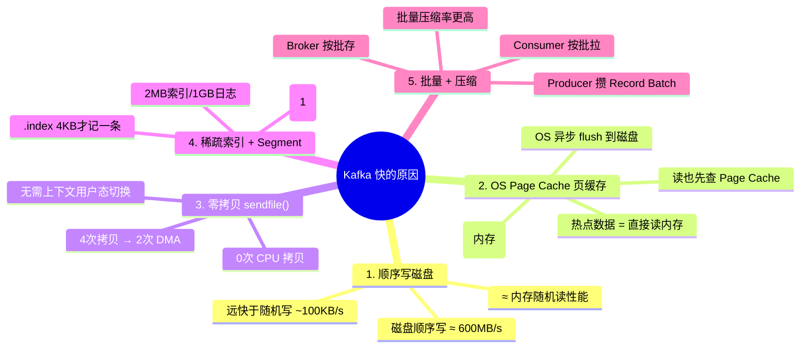
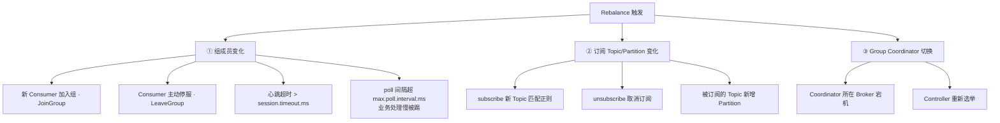
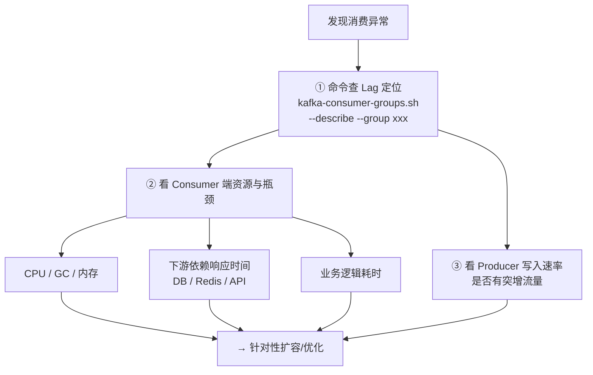
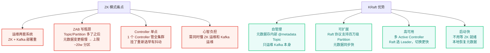

# Kafka 常见面试题与最佳实践

> 配套文档《核心知识点详解.md》请见同目录。本文件覆盖 12 道高频面试题（含参考答案）+ 生产环境 Checklist。

---

## 一、12 道高频面试题

---

### 🏷️ 模块 1：Producer · 写入端

#### Q1：Kafka 如何保证消息不重复？（幂等生产者原理）

**参考答案**：

配置 Producer 端参数 `enable.idempotence=true`（Kafka 3.0+ 默认开启），配合 `acks=all` + `retries>0` 使用。

**实现机制（三要素）**：
1. **PID (Producer ID)**：Producer 初始化时，Broker 为其分配一个全局唯一的 PID（对业务透明）
2. **Sequence Number（序列号）**：Producer 对每个 `<Topic, Partition>` 维度维护一个从 0 递增的序列号，和消息一起发给 Broker
3. **Broker 端校验表**：Broker 按 `(PID, Topic, Partition)` 维度持久化一张表，记录「上次收到的最大 Seq = lastSeq」

收到新消息时，Broker 判断：
- `newSeq == lastSeq + 1` → ✅ 正常写入，更新 lastSeq
- `newSeq ≤ lastSeq` → ⛔ 判定为重复，**直接丢弃但返回成功**给 Producer（实现去重）
- `newSeq > lastSeq + 1` → ❌ 抛 `OutOfOrderSequenceException`（中间有消息丢失，乱序）

**注意边界**：幂等性只能保证 **单 Producer 会话内、单 Partition 内** 不重复。Producer 重启 PID 会变，跨会话/跨分区的重复幂等生产者无法保证，需要业务层（如消息唯一 ID 表）解决。

---

#### Q2：Kafka 如何保证消息不丢失？（三端完整答案）

**参考答案**：消息不丢失需要 **Producer + Broker + Consumer 三端同时配置正确，缺一不可**。


**① Producer（写入端）**
- `acks=all`：等 ISR 中所有副本同步完成才 ACK（默认 1 不行）
- `enable.idempotence=true`：配合重试不重复
- `retries=Integer.MAX_VALUE`（3.0+ 默认）+ `delivery.timeout.ms` 设置合理（默认 120s）
- 同步发送要 `future.get()` 捕获异常；异步发送要在 Callback 里判断异常并告警

**② Broker（集群端）**
- `replication.factor ≥ 3`：至少 3 副本，容忍 1 台挂仍有 2 份
- `min.insync.replicas ≥ 2`：ISR 至少 ≥2 个副本同步成功才允许 ACK，**和 acks=all 配对，缺了 min.insync=2 的 acks=all 白搭**
- `unclean.leader.election.enable=false`（默认）：禁止从 OSR 落后副本选 Leader，防止丢大量数据

**③ Consumer（消费端）**
- **关掉 `enable.auto.commit=true`（默认 true，巨坑）**：该参数会按 `auto.commit.interval.ms` 周期自动提交「上次 poll 返回的最大 offset」，一旦业务还没处理完就自动提交了，此时 Consumer 重启就会从已提交的位置继续，中间未处理完的消息 = 「已跳过」即丢失
- 改为业务处理逻辑成功后，**手动** `consumer.commitSync()` 或 `commitAsync()`（Async 要配失败回调记录告警）

---

#### Q3：Producer 分区路由策略有哪些？如何保证同 Key 有序？

**参考答案**：

三种路由方式，由 `partitioner.class` 配置，默认 `org.apache.kafka.clients.producer.internals.DefaultPartitioner`：

| 情况 | 默认策略 | 原理 |
|---|---|---|
| 消息 **带 key**（key ≠ null） | Hash 分区 | `hash(key) % partitionNum`（默认 hash 算法是 murmur2，均匀分布）→ **同一 key 固定进入同一个 Partition** |
| 消息 **无 key**（key = null） | Sticky Partitioner（粘性分区，Kafka 2.4+） | 先随机选 1 个 Partition，连续把 batch 发到这个 Partition，直到 batch 满或 `linger.ms` 超时，再切换下一个 Partition。比老 Round-Robin 批次更大，网络请求更少，吞吐更高 |
| 自定义路由 | 实现 `Partitioner` 接口 | 重写 `partition(String topic, Object key, byte[] keyBytes, Object value, byte[] valueBytes, Cluster cluster)` 自定义返回分区号 |

**如何保证同 Key 严格有序？**
- 消息必须 **带上业务主键作为 key**（如 `orderId`、`userId`）
- Producer 使用默认 Hash Partitioner → 同 key 进同 Partition
- **单个 Partition 内部保证按 Offset 严格有序**
- Consumer 端**同一 Partition 的消息不要并发处理**（不要拿到消息就丢到线程池异步，否则顺序就乱了），如果要提升性能可以按 key 二次路由到本地有序线程池

> ❌ 注意：如果 Partition 数改了（增/减 Partition），`hash(key) % N` 的 N 变了 → 同 key 可能进不同分区 → 所以生产环境 **Topic 分区数只能加不能减**，加之前要评估对有序性的影响。

---

### 🏷️ 模块 2：可靠性 · 高可用

#### Q4：讲一下 ISR、OSR、AR、LEO、HW，以及它们之间的关系？

**参考答案**：

| 概念 | 全称 | 含义 |
|---|---|---|
| **AR** | Assigned Replicas | 该 Partition 配置的全部副本集合，总数 = `replication.factor`。AR = ISR ∪ OSR |
| **ISR** | In-Sync Replicas | AR 的子集，与 Leader **保持同步** 的副本集合。Leader 一定在 ISR 中。Follower 满足：<br/>① 在 `replica.lag.time.max.ms`（默认 30s）内向 Leader 发过 Fetch 请求<br/>② 并且追上 Leader 最新消息的延迟 < 该阈值 |
| **OSR** | Out-of-Sync Replicas | AR 中 ISR 之外的副本，即「落后/失联」的副本。它们不参与 ACK；等恢复并追上后 Controller 会把它们重新加回 ISR |
| **LEO** | Log End Offset | **每个副本各维护一个**，表示该副本下一条待写入消息的 Offset（LEO = 当前已写消息数 = 当前最大 Offset + 1）。消息一落盘 LEO 就 +1 |
| **HW** | High Watermark | Leader 维护，**消费者最多只能消费到 HW - 1**。更新规则：每次 ISR 中副本同步成功后，Leader 取 **ISR 中所有副本的 LEO 最小值** 作为新的 HW。Follower 每次 Fetch 时从响应拿到 Leader HW，再更新自己的 Follower HW |

**核心关系公式**：
```
对任意副本 Follower_i:  HW ≤ Follower_i.LEO ≤ Leader.LEO
消费者可见 Offset 范围: [0, HW)  即左闭右开
```

---

#### Q5：acks=all 就一定不丢消息吗？还差什么？

**参考答案**：**❌ 不一定**。

`acks=all` 只说「ISR 里所有副本同步成功就 ACK」，但 **ISR 可以只剩 Leader 1 个**（比如其他 Follower 都失联被踢到 OSR 了），此时 `acks=all` 等价于 `acks=1`，Leader 写完 ACK 回来后立刻挂了，数据就丢。

**必须同时满足：**
```properties
# Broker 端（Topic 级别或集群级别）
min.insync.replicas = 2   # 而不是默认的 1
replication.factor   = 3   # 3 副本起步
acks                 = all # Producer 端
```

这样，写入时会检查：
- 如果 ISR 中副本数 ≥ 2 → 写成功，ACK。数据至少落在 2 个独立磁盘上，此时任意 1 台 Broker 宕机，其他副本里还有数据，不丢
- 如果 ISR 中副本数 < 2（=1 只剩 Leader）→ 抛 `NotEnoughReplicasException`，直接拒绝写。Producer 会进入重试，等 ISR 恢复到 ≥2 后才能写入，牺牲可用性保证数据不丢（CAP 里选了 CP）

> 💡 口诀：**「acks=all + min.insync≥2 + rf≥3」 三箭齐发才是真不丢。**

---

### 🏷️ 模块 3：顺序性 · 存储

#### Q6：Kafka 是全局有序的吗？如何实现严格全局有序？

**参考答案**：

❌ Kafka **原生不保证全局跨 Partition 有序**，只保证 **单个 Partition 内部按 Offset 严格有序**。

**方案 A：严格全局有序（不推荐，代价大）**
- Topic 设置 `partitionNum=1`
- Consumer Group 只能有 1 个 Consumer 实例，也不能开多线程并发处理
- 代价：完全失去并发，吞吐等于单分区上限（通常 10MB/s 或万级 TPS），生产环境几乎不这么做

**方案 B：业务 Key 有序（99% 场景足够，推荐）**
- 所有消息带上业务唯一键作为 `key`（如 `orderId`、`userId`、`deviceId`）
- Producer 默认 Hash Partitioner 将同 key 路由到同一 Partition → 同 key 消息天然有序
- 例如：订单 `order_123` 的 Created → Paid → Shipped → Completed 4 条状态消息，因为 key 都为 `order_123`，进同一个 Partition，Offset 递增，Consumer 按顺序消费，状态流转正确
- 不同订单之间互相不要求有序，并发处理

> 面试加分项：补充 Kafka **不能保证全局有序**的根本原因——它设计目标就是高吞吐分布式日志系统，而不是传统严格队列，为了可扩展性接受了「分 Partition」这一 trade-off。

---

#### Q7：Kafka 为什么这么快？（五大支柱 + 零拷贝原理）


<!-- -->

**零拷贝详细原理（常考）**：
- 传统 read + write 发送文件：磁盘 → DMA→ 内核 Page Cache → CPU→ 用户态 Buffer → CPU→ Socket 内核 Buffer → DMA→ 网卡。**4 次数据拷贝 + 4 次上下文切换**，2 次 CPU 拷贝是性能瓶颈。
- Kafka 用 Linux `sendfile()` 系统调用：磁盘 → DMA→ 内核 Page Cache，然后 Socket Buffer 只写入「数据位置 + 长度」descriptor，DMA 引擎直接从 Page Cache 把数据送到网卡。**2 次 DMA 拷贝，0 次 CPU 拷贝**，即「零拷贝」名称来源。
- 前提：Broker 端不需要对消息做用户态加工，仅做搬运（Kafka 的设计刚好满足这个前提）。

---

### 🏷️ 模块 4：Consumer · 消费端

#### Q8：Kafka 消费模型 Pull vs Push，为什么 Kafka 选 Pull？

**参考答案**：

| 对比维度 | Push（Broker → Consumer） | Pull（Consumer → Broker，Kafka 方案） |
|---|---|---|
| 速率匹配 | Broker 统一速率推 → 快 Consumer 闲、慢 Consumer 被压垮（Buffer Overflow） | Consumer 按自己处理能力控制 poll 速率，不会被压垮 |
| 批量效率 | 推单条或固定小批量 | Consumer 一次 `fetch.min.bytes` 可拉一大批，批量处理效率更高 |
| Broker 复杂度 | 要维护每个 Consumer 的消费进度、背压状态 → Broker 有状态复杂 | Broker 无状态，只按请求返回对应字节范围，实现简单 |
| 空轮询浪费 CPU | 无 | ✅ 但 Kafka 通过长轮询解决：<br/>`fetch.max.wait.ms`（等够时间）+ `fetch.min.bytes`（等够数据）两者任一满足才返回，避免空转 |

Kafka 选 Pull 模型，核心是让 **Consumer 自主掌控消费节奏**，天然适配下游消费能力不均的真实生产环境。

---

#### Q9：什么是 Rebalance？什么时候触发？有什么危害？怎么避免？

**参考答案**：

**定义**：Consumer Group 内，当成员或订阅关系发生变化时，由 **Group Coordinator**（某个 Broker）组织全体 Consumer 重新协商「哪个 Consumer 消费哪些 Partition」的过程。期间整个组 **STW（Stop-The-World）暂停消费**，谁也不能拉消息。

**触发场景三大类**：


<!-- -->

**危害**：
- 整个组暂停消费 → 消息延迟 + 积压（Lag 飙升）
- 分区所有权转移过程中，Consumer 刚 poll 到一批还没 commit 就被 Rebalance 打断 → 恢复后重新 poll → **重复消费**
- 频繁 Rebalance 导致 Consumer 大部分时间在分配而不在实际消费，吞吐严重下降

**避免/缓解方法**：
1. 调大 `max.poll.interval.ms`（默认 5min），**确保 > 单批消息最大业务处理时长 × 2**，防止业务慢被误踢
2. `session.timeout.ms`（默认 45s）+ `heartbeat.interval.ms`（通常前者 1/3，15s）按场景设置；生产环境避免频繁上下线 Consumer
3. 分配策略选 `StickyAssignor` 或新版 `CooperativeStickyAssignor`，增量 Rebalance 只移必要的 Partition，减少移动范围
4. 如果 subscribe 使用正则表达式，确保不会误匹配到 TopicName 相似的其他 Topic（运维大忌）

---

#### Q10：如何处理消息积压？排查步骤与常见原因？

**参考答案**：

**排查三步法**：


<!-- -->

**常见根因与解法**：

| 类别 | 根因 | 解法 |
|---|---|---|
| 消费逻辑慢 | DB 没索引、大事务、同步调用第三方慢接口 | 加索引、拆事务、第三方改为异步/批量 |
| 并发不足 | Consumer 实例数 < Partition 数 | 扩容 Consumer 实例（至 = Partition 数） |
| 线程模型错 | 单线程 poll + 单线程顺序处理，单条耗时大 | poll 后按 Partition/key 路由到有序线程池，但注意手动提交 offset |
| 配置不合理 | `max.poll.records` 太大或太小 | 按单条处理耗时合理设置（如 50~500） |
| 流量洪峰 | 大促/批量刷数导致写速率暴涨数倍 | 临时扩容 Consumer、建新 Topic 分流、限流降级 |

---

### 🏷️ 模块 5：Broker · 对比 · 架构演进

#### Q11：Kafka vs RabbitMQ 选型对比？

| 维度 | Apache Kafka | RabbitMQ |
|---|---|---|
| **架构模型** | 分布式日志（Append-Only Log）+ Partition + 副本 | 传统 AMQP 消息队列：Exchange 路由 + Queue |
| **核心吞吐** | 极高（百万级 msg/s / 节点，靠顺序写 + 零拷贝） | 中低（万级 msg/s / 节点，Broker 要做路由/确认/重投递等重逻辑） |
| **消费模型** | Pull 为主（Consumer 主动 poll） | Push 为主（Broker 推给 Consumer），也支持 basic.get Pull |
| **消息回溯** | ✅ 天然支持（按 offset 重置到任意历史位置） | ❌ 很弱，消费完就删，需死信/插件实现 |
| **有序性** | ✅ 单 Partition 内部严格有序 | ⚠️ 单队列有序但高并发场景受限 |
| **高级特性** | Log Compaction、Kafka Streams、KSQL、Connect 生态丰富 | DLX 死信、TTL 延迟消息、优先级队列、插件系统 |
| **运维复杂度** | 分布式集群，高可用复杂（但 KRaft 后已大幅简化） | 单机即可跑，集群 Mode 用镜像队列/Quorum Queue |
| **适合场景** | 🎯 大数据管道、日志采集、埋点流、事件溯源、CDC、流处理 | 🎯 业务解耦（订单→支付→通知）、任务调度、延迟重试、需要复杂路由 |

---

#### Q12：ZooKeeper 在旧版 Kafka 中做了什么？为什么 KRaft 要替换它？

**参考答案**：

**ZK 时代（Kafka 0.x ~ 2.x）的职责**：
1. **Broker 注册 & 存活感知**：Broker 启动在 ZK 注册临时节点，下线临时节点删，Watch 机制通知 Controller
2. **Topic 元数据**：Topic 配置、Partition 分布、AR/ISR 信息存在 ZK
3. **Controller 选举**：抢占 ZK /controller 临时节点，谁抢到谁是 Controller（唯一），负责分区分配、Leader 选举
4. **Consumer Group 元数据**（0.10 前旧消费者）：分区分配、offset 都存 ZK；0.10+ 新消费者把 offset 迁到内部 Topic `__consumer_offsets`
5. **ACL / 动态配置**：权限、参数动态配置存在 ZK

**KRaft（Kafka Raft，3.x 正式可用，4.0 默认）替换 ZK 的原因**：


<!-- -->

> 🎯 总结：KRaft 去掉了对 ZK 的外部依赖，把协调服务做成 Kafka 自己的一个 Raft 组成部分，是 Kafka 架构演进的里程碑方向，新项目建议直接 KRaft。

---

## 二、生产环境最佳实践 Checklist

> 按 Topic / Producer / Consumer / Broker 四个维度整理，上线前逐项核对。

### 📋 1. Topic 规划

| 参数 / 要点 | 推荐值 / 做法 | 说明 |
|---|---|---|
| `replication.factor` | **≥ 3** | 至少 3 副本，机房多机架建议按机架分布 |
| `partition 数量` | 目标吞吐 ÷ 单分区能力 | 单分区上限约：写 10MB/s、读 20MB/s；一个集群总 Partition 数尽量 < 10w（KRaft 可以百万，但仍要经济） |
| 命名规范 | `业务域.子域.事件名` | 如 `trade.order.created`、`log.app.error`，禁止中文、空格、特殊字符 |
| `min.insync.replicas` | **2** | 配合 `acks=all`，写成功 = 至少 2 份落盘 |
| `cleanup.policy` | `delete` 或 `compact` | 事件流用 delete（按时间删）；配置/画像等 KV 场景用 compact |
| 分区数修改 | 只能 **增不能减**！| 减分区会导致路由 hash 结果变化、顺序性乱、数据混乱；所以一开始要保守估算 |

### 📋 2. Producer 端

```properties
# ====== 可靠性 ======
acks                      = all         # ISR 全部同步才 ACK
enable.idempotence        = true        # 幂等性（3.0+ 默认 true），配合重试不重复
retries                   = 2147483647  # 3.0+ 默认，不要改 0
delivery.timeout.ms      = 120000      # 投递总超时 2 分钟

# ====== 性能 ======
compression.type          = zstd        # 压缩率最高、CPU 消耗较低，优先选
batch.size                = 16384       # 默认 16KB，可按需调到 32~64KB（大消息更大）
linger.ms                 = 5~20        # 默认 0，适当延迟 5~20ms 攒更大 batch 提升吞吐
max.in.flight.requests.per.connection = 5  # 开启幂等性时 ≤5，保证顺序性不被乱序重试破坏

# ====== 元数据 ======
metadata.max.age.ms       = 300000      # 定期刷新元数据，防止 Broker 变化后路由旧
```

### 📋 3. Consumer 端

```properties
# ====== 位点（最关键） ======
enable.auto.commit        = false       # ❌ 关掉自动提交！业务成功后手动 commitSync
auto.offset.reset         = earliest    # 新组从最早开始（防止新组丢历史），生产不推荐 latest
max.poll.records          = 50~500      # 按单条处理耗时匹配，避免单次处理太久
max.poll.interval.ms      = (单批最大耗时 × 2)  # ≥ 300000，业务慢的要放大

# ====== 心跳 ======
session.timeout.ms        = 45000       # 默认 45s，检测 Consumer 是否存活
heartbeat.interval.ms     = 15000       # 通常是 session.timeout 的 1/3

# ====== 消费端拉取 ======
fetch.min.bytes           = 1048576     # 1MB，让 Broker 凑够再返回，节省网络往返
fetch.max.wait.ms         = 500         # 配合 min.bytes，最多等 500ms
fetch.max.bytes           = 52428800    # 单次拉取 50MB 上限

# ====== 分配策略 ======
partition.assignment.strategy = org.apache.kafka.clients.consumer.StickyAssignor
# 或用新版：CooperativeStickyAssignor（增量 Rebalance）
```

### 📋 4. Broker / 集群运维

| 项 | 推荐做法 |
|---|---|
| **磁盘** | 必须 SSD；`log.dirs` 多目录跨多块 SSD 挂载，摊平 IOPS |
| **磁盘监控** | UnderReplicatedPartitions（ISR 不足）> 0 → 立刻报警；此为 Kafka 健康度第一指标 |
| **Broker 监控** | RequestHandlerAvgIdlePercent < 30% → 报警（请求处理线程要用完了）；UncleanLeaderElectionsTotal 持续增长报警 |
| **消息保留** | `log.retention.hours` 按业务实际设（如 3 天、7 天），不要默认 7 天占满盘；定期巡检磁盘水位 |
| **JVM 堆** | 别太大，通常 6~8G 就够。Kafka 吃 Page Cache（OS 内存）不是 JVM Heap，堆过大会导致 GC 停顿长、Page Cache 反而小 |
| **OS 参数** | `vm.swappiness=1`（尽量不用 swap）；文件句柄 `ulimit -n` ≥ 100,000；关闭 atime；用 XFS/ext4 高性能文件系统 |
| **机架感知** | `broker.rack` 配置机架 ID，副本分配时分散在不同机架/不同可用区，提高容灾能力 |
