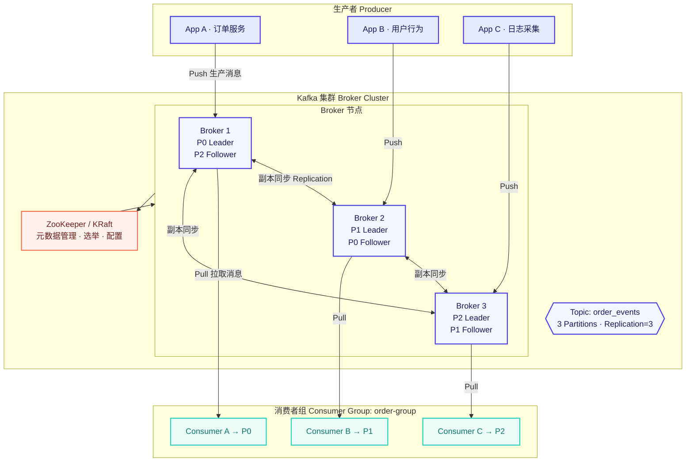
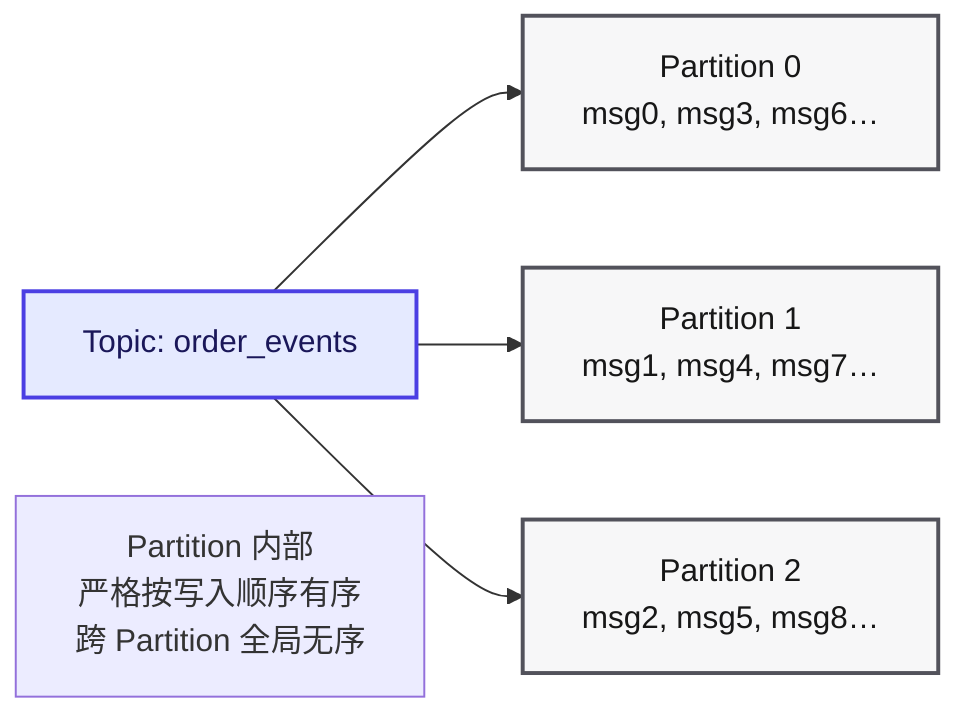
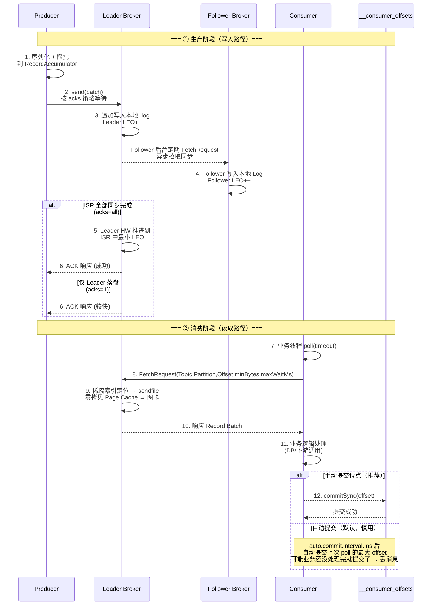
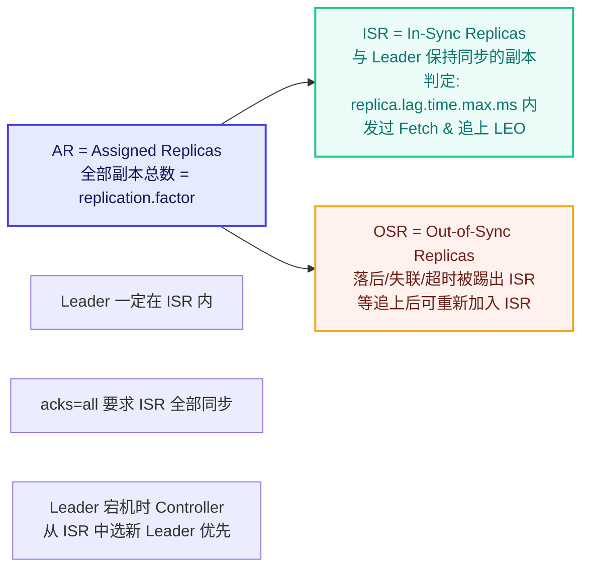
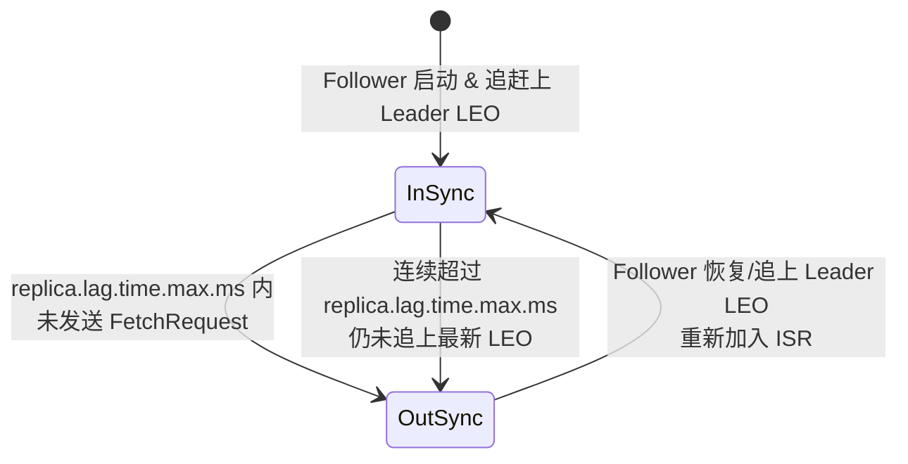
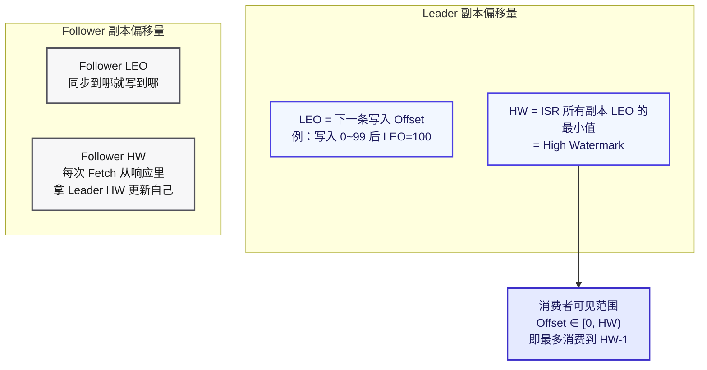
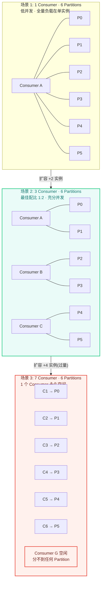
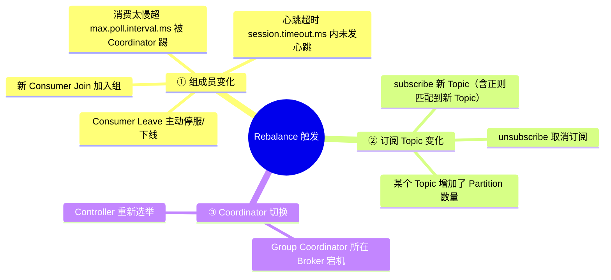
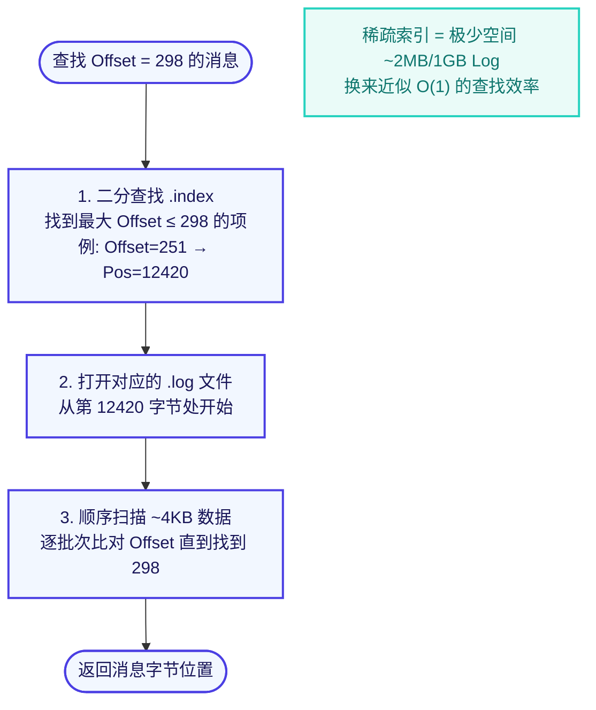
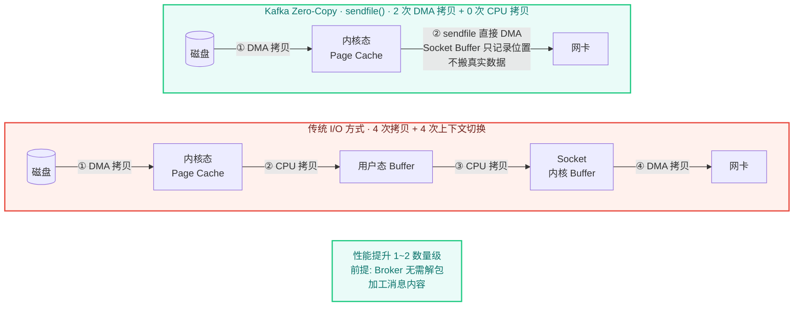

# Kafka 核心知识点详解

> 本系统梳理 Kafka 从入门到进阶的全部核心概念，配合 Mermaid 架构图辅助理解。配套文档《常见面试题与最佳实践.md》请见同目录。

---

## 一、Kafka 整体架构

Kafka 是一个**分布式、可分区、多副本、基于 ZK/KRaft 协调**的分布式日志流平台，核心五组件是：**Producer → Broker Cluster → Consumer Group**，加上元数据协调 **ZooKeeper / KRaft**。


<!-- -->

---

## 二、核心概念详解

### 2.1 Broker（Kafka 服务器节点）

单个 Kafka 进程节点，Kafka 集群 = 多台 Broker 协同工作。

| 职责 | 说明 |
|---|---|
| 接收写入 | 接收 Producer 的消息，追加到磁盘 Segment 文件 |
| 提供读取 | 响应 Consumer 的 Fetch 请求，通过零拷贝发送消息 |
| 副本同步 | 作为 Follower 从 Leader 拉取消息 / 作为 Leader 维护 ISR |
| 心跳上报 | 与 ZK / KRaft 保持心跳，维护成员存活状态 |

**特性**：Broker 无状态（消费位点不存 Broker，存在内部 Topic `__consumer_offsets`），天然便于横向扩展。

---

### 2.2 Topic（主题）

消息的**逻辑分类容器**，类比数据库「表」或消息系统「队列名」。命名建议 `业务域.子域.事件名`，如 `trade.order.created`、`log.app.error`。

- 每条消息必须指定 Topic
- 同一 Topic 可被**多个 Consumer Group 独立消费**（发布-订阅语义）
- Topic 内部可划分为 1 ~ N 个 Partition，Partition 数建议先测后定，不宜过大

---

### 2.3 Partition（分区）

Partition 是 Kafka 水平扩展与并发的基础，一个 Topic = 多个 Partition 之和。



<!-- -->

**Partition 的三个不可变性质（面试要点）**：

1. **顺序性**：单 Partition 内部消息按写入 Offset 严格有序，跨分区不保证全局有序
2. **不可变性（Append-Only）**：消息一旦写入 Partition 只能追加，不能修改/删除单条；删除靠 Segment 到期整体回收
3. **Offset 偏移量**：每条消息在 Partition 内有唯一递增的 `Offset`（Long 型），Consumer 以 `(Topic, Partition, Offset)` 三元组精确定位消息

**为什么要分区？**
- 水平扩展：Topic 数据分散到多台 Broker，突破单机存储/吞吐上限
- 并发写入：不同 Partition 可并行写，提高 TPS
- 并行消费：Consumer Group 内多个 Consumer 并行读不同 Partition

---

### 2.4 Producer（生产者）

消息写入方，负责将业务数据序列化为字节发送到 Broker。

#### 发送决策链

| 决策点 | 策略 |
|---|---|
| **目标 Partition** | ① 指定 key → `murmur2(key) % partitionNum`（同 key 进同分区，保证同 key 有序）<br/>② 无 key → Sticky Partitioner（粘性分区器，连续发到同分区攒 batch 直到超时，再切换）<br/>③ 自定义 Partitioner 接口 |
| **确认级别 acks** | `0` 不等响应（最快，可能丢）<br/>`1` Leader 落盘返回（默认，均衡）<br/>`all/-1` ISR 全部同步返回（最安全） |
| **重试 & 幂等** | `retries`（Kafka 3.0+ 默认 `Integer.MAX`）+ `enable.idempotence=true`（默认开启，PID+Seq 去重） |
| **攒批参数** | `batch.size`（默认 16KB，批次大小）<br/>`linger.ms`（默认 0，最多等多久就发，平衡延迟和吞吐） |
| **压缩** | `compression.type`：none / gzip / snappy / lz4 / **zstd**（推荐，压缩率高 CPU 低） |

---

### 2.5 Consumer 与 Consumer Group（消费者 / 消费者组）

Kafka 采用 **Pull 模型**，Consumer 调用 `poll(Duration)` 主动从 Leader 拉取消息。多个 Consumer 组成一个 Consumer Group。

#### 核心规则（牢记）

| 规则 | 说明 |
|---|---|
| **同组 1 Partition → 1 Consumer** | 同一 Consumer Group 内，每个 Partition 最多只能分配给组内 1 个 Consumer（保证不重复消费，即队列模型） |
| **跨组独立** | 不同 Consumer Group 互不影响，各自完整消费同一份消息（即广播/发布订阅模型） |
| **Consumers ≤ Partitions** | 组内 Consumer 数 > Partition 数时，多余 Consumer 永久空闲（浪费资源） |
| **最佳配比** | Consumer 数 = Partition 数，或略少便于扩容 |

---

## 三、消息生产与消费完整流程



<!-- -->

---

## 四、Partition 副本机制 & ISR / AR / OSR / HW / LEO

高可用的核心。每个 Partition 配置 `replication.factor=N` 表示 N 个副本。

### 4.1 副本角色

| 角色 | 数量 | 职责 |
|---|---|---|
| **Leader 副本** | 1 / Partition | 处理所有读写请求（Producer 写、Consumer 读都走 Leader），维护 ISR 集合 |
| **Follower 副本** | N-1 / Partition | 只做一件事：定期 FetchRequest 从 Leader 拉消息同步，不对外服务；当 Leader 挂时才有机会被选举为新 Leader |

> ⚠️ Kafka **没有 Redis 那样的读写分离**，Consumer 默认只从 Leader 读（避免从延迟的 Follower 读到旧数据）。Kafka 3.x 后支持机架感知的 Follower Fetch，但默认关闭。

### 4.2 AR / ISR / OSR 集合关系


<!-- -->

### 4.3 ISR 进入/退出状态流转


<!-- -->

### 4.4 LEO 与 HW（高频考点）

每个副本都维护两个偏移量。假设 Partition 有 Leader + 2 Follower：


<!-- -->

> 💡 **为什么需要 HW？** —— 防止 Consumer 读到「Leader 已经写入、但 Follower 还没同步、若 Leader 立刻挂该消息会回滚」的未提交消息，保障消费语义的一致性。

---

## 五、消费者组 Rebalance（重平衡）

### 5.1 三种 Consumer / Partition 配比场景


<!-- -->

### 5.2 Rebalance 触发条件（三大类）


<!-- -->

> ⚠️ **STW 副作用**：Rebalance 期间整个 Consumer Group 进入 Stop-The-World 状态，**所有 Consumer 暂停消费**，等分区重新分配完成后才能恢复。频繁 Rebalance = 消费堆积 + 抖动。

### 5.3 三种分区分配策略

| 策略 | 算法 | 适用场景 |
|---|---|---|
| **RangeAssignor**（默认） | 对每个 Topic 单独切分：按 Partition 排序后按 Consumer 数范围分，前 N 个 Consumer 多 1 个 | 订阅单一 Topic 的场景 |
| **RoundRobinAssignor** | 把所有订阅的 Topic 所有 Partition 汇总，全局轮询依次发给每个 Consumer | 订阅多个 Topic、希望更均匀分布的场景 |
| **StickyAssignor / CooperativeSticky**（推荐） | ① 同 RoundRobin 均匀分配 ② **增量 Rebalance 时尽量保留原分配**，尽量少移动 Partition | 生产环境推荐；配合 Cooperative 模式可进一步缩小 STW 时间 |

---

## 六、存储机制：磁盘上长什么样？

### 6.1 文件目录结构（单 Partition）

Kafka 的日志目录由 `log.dirs` 指定，**一个 Partition 对应一个文件夹**，文件夹命名 `<topic-name>-<partition-id>`。内部按 Segment（段）滚动。

```
${log.dirs}/
└── order_events-0/                  ← 一个分区 = 一个文件夹
    ├── 00000000000000000000.log     ← Segment 1: 第 0~x 条消息的真实字节
    ├── 00000000000000000000.index   ← 稀疏偏移量索引：Offset → .log 物理位置
    ├── 00000000000000000000.timeindex  ← 稀疏时间戳索引：Timestamp → Offset
    │
    ├── 00000000000000005678.log     ← Segment 2: 从第 5678 条开始的消息
    ├── 00000000000000005678.index
    ├── 00000000000000005678.timeindex
    │
    └── leader-epoch-checkpoint
```

**Segment 滚动触发条件（满足任一即滚动）**：
- `log.segment.bytes`：单 Segment 大小达上限（默认 1GB）
- `log.roll.hours`：按时间滚动（默认 168h = 7 天）

### 6.2 稀疏索引（Sparse Index）查找流程

`.index` 不是每条消息一条索引（那样索引会很大），而是**每写入约 4KB（`log.index.interval.bytes` 默认 4096）的消息数据，才插入一条索引**。

每条索引 8 字节：`Offset(4B 相对偏移) + Position(4B .log 内物理位置)`


<!-- -->

### 6.3 零拷贝（Zero-Copy）

这是 Kafka Consumer 读性能能百万级的核心。对比传统 I/O vs Kafka sendfile：



> 💡 面试追问：为什么 RabbitMQ 不直接用零拷贝？答：因为 RabbitMQ Broker 要对消息做路由判断、TTL、DLX 重投递等加工，必须先读到用户态处理，没办法直接从磁盘到网卡。而 Kafka Broker 对消息「透明」，只需搬字节。

### 6.4 消息留存策略

| 策略 | 配置 | 作用 |
|---|---|---|
| **按时间删** | `log.retention.hours`（默认 168h = 7d） | 超过时间的 Segment 整个删除，不是删单条消息 |
| **按大小删** | `log.retention.bytes`（默认 -1 不限） | Partition 总日志超过阈值，删最旧的 Segment |
| **Log Compaction** | `cleanup.policy=compact` | 按 Key 维度保留「每个 Key 最新的一条消息」，旧的同 Key 会在清理阶段被删除 |

**Log Compaction 语义示意**（适用于配置、用户画像等 KV 场景）：

```
原始日志:
  Offset  0    1    2    3    4    5
  Key    k1   k2   k1   k3   k2   k1
  Value  A    B    C    D    E    F

              ↓  Compact 之后  ↓

  Offset  2    3    4    5    （k1 的 Offset 0,2 被删，只剩最新的 k1=F）
  Key    k1   k3   k2   k1
  Value  C    D    E    F     （实际按 Segment 粒度，跨段保留最新值）
```

内部 Topic `__consumer_offsets` 就用了 compact 策略，避免位点元数据无限膨胀。
