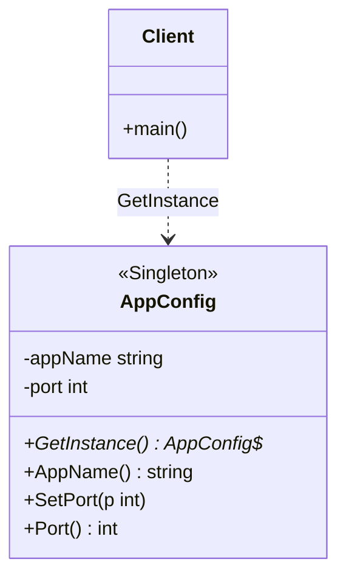

# 单例模式（Singleton）— Go 语言

核心一句话：

> **整个进程里，某类只允许有一个实例；所有人通过同一入口拿到它。**  
> 不是「随便 new」，而是「第一次创建，之后复用」。

本例：应用配置中心 `AppConfig`。多处调用 `GetInstance()`，拿到的是同一个指针；改一处，别处立刻看见。

---

## 1. 用一张表想清楚

| | 普通对象 | 单例 |
|---|---|---|
| **创建方式** | 到处 `new` / `&T{}` | 只能走 `GetInstance()` |
| **实例个数** | 想几个就几个 | 全局最多 1 个 |
| **共享状态** | 各管各的 | 所有调用方共享同一份 |

### 1.1 不会单例时

业务里到处写：

```go
cfg := &AppConfig{AppName: "demo"}
```

每个模块一份配置副本；A 改了端口，B 还是旧值；还可能重复读文件、重复建连接。

### 1.2 会单例时

```text
cfg1 := AppConfig.GetInstance()
cfg2 := AppConfig.GetInstance()
// cfg1 == cfg2  → 同一块内存
```

- 第一次访问才初始化（惰性）。
- 并发下用 `sync.Once` 保证只建一次。

---

## 2. 定义

### 2.1 官方味道的定义

单例是一种**创建型**设计模式：保证一个类仅有一个实例，并提供一个全局访问点。

做法是：

1. 把构造过程藏起来（Go 里：未导出类型字段 + 包级变量，或导出类型但只通过 `GetInstance` 拿）。
2. 提供唯一获取入口（`GetInstance`）。
3. 保证多线程 / 多 goroutine 下仍只创建一次。

### 2.2 角色关系（UML 类图）



| 模式角色 | 本例 | 含义 |
|----------|------|------|
| Singleton | `AppConfig` | 唯一实例所在类型 |
| 全局访问点 | `GetInstance` | 唯一拿到实例的入口 |
| Client | `main` | 多处调用，应拿到同一指针 |

Go 惯用实现：包级 `instance` + `sync.Once`（见 `main.go`）。不必照搬 Java 的私有构造函数写法。

---

## 3. 和「全局变量 / 享元」的区别（一句话）

| | 全局变量 | 单例 | 享元 |
|---|---|---|---|
| **个数** | 人为约定「只用一个」 | 机制上保证只有一个 | 按键缓存，可以多个 |
| **初始化** | 包加载时或随便赋 | 通常惰性 + 线程安全 | 按需创建并复用 |
| **关注点** | 方便共享 | 「唯一 + 可控入口」 | 「相同内在状态共享」 |

全局 `var cfg = &AppConfig{}` 也能共享，但缺少统一入口与并发创建保障；单例把这两点写进模式里。

---

## 4. 怎么跑

```bash
go run .
```

或：

```bash
go run main.go
```

观察输出：两次 `GetInstance` 地址相同；一处改端口，另一处读到新值；并发下「初始化」只打印一次。

---

## 5. 适用与注意

适合：

- 进程内确实只该有一份的资源（配置、日志门面、某些连接管理器）。
- 需要惰性初始化，且要并发安全。

注意：

- 单例是全局状态，测起来麻烦，滥用会让依赖隐式耦合。
- 能依赖注入解决的，优先注入；真要唯一时再用单例。
- Go 里优先 `sync.Once`，不要自己用「检查 + 加锁」手写双重检查除非有明确理由。
