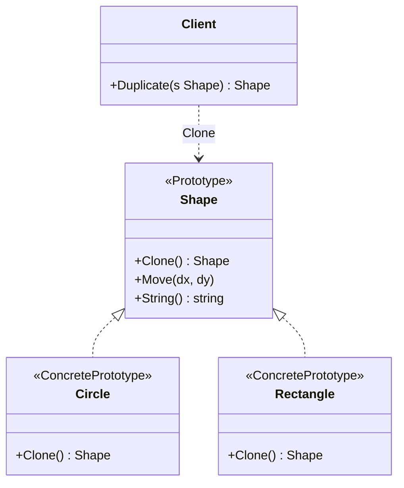

# 原型模式（Prototype）— Go 语言

核心一句话：

> **用已有对象当模板，拷一份出来再改，而不是从头 new 再填一遍。**  
> 克隆走统一接口；深拷还是浅拷，由原型自己说了算。

本例：图形编辑器。选中一个 `Circle` / `Rectangle`，`Clone()` 出副本再挪位置；原件不动。

---

## 1. 用一张表想清楚


|           | 从零创建                   | 原型克隆                |
| --------- | ---------------------- | ------------------- |
| **步骤**    | new → 设颜色 → 设尺寸 → 设坐标… | `Clone()` → 只改要变的字段 |
| **谁知道细节** | 调用方必须懂全部字段             | 原型自己负责怎么拷           |
| **嵌套对象**  | 容易漏拷 / 误共享             | 可在 `Clone` 里做深拷贝    |


### 1.1 不会原型时

业务里到处写：

```go
c2 := &Circle{Color: c1.Color, Radius: c1.Radius, X: c1.X, Y: c1.Y}
```

字段一多就抄漏；若有切片 / 指针字段，还容易和原件共享底层数据。

### 1.2 会原型时

```text
copy := original.Clone()
copy.Move(10, 20)   // 只动副本
```

- 客户端只认 `Shape` 接口，不关心具体类型字段。
- 新增图形类型 = 实现 `Clone`，调用方克隆逻辑不动。

---


## 2. 定义


### 2.1 官方味道的定义

原型是一种**创建型**设计模式：用原型实例指定创建对象的种类，并且通过拷贝这些原型创建新的对象。

做法是：

1. 声明可克隆接口（本例 `Shape.Clone() Shape`）。
2. 具体类型实现克隆（决定深拷 / 浅拷）。
3. 客户端持有原型引用，需要新品时 `Clone()`，再按需修改。


### 2.2 角色关系（UML 类图）




| 模式角色              | 本例                     | 含义               |
| ----------------- | ---------------------- | ---------------- |
| Prototype         | `Shape`                | 声明 `Clone`       |
| ConcretePrototype | `Circle` / `Rectangle` | 实现具体拷贝           |
| Client            | `Duplicate` / `main`   | 通过接口克隆，不 new 具体类 |


Go 没有语言级 `clone`，约定接口方法即可；有嵌套引用时务必在 `Clone` 里显式深拷。

---


## 3. 和「直接赋值 / 工厂」的区别（一句话）


|          | `b = a`（同类型赋值） | 工厂方法           | 原型               |
| -------- | -------------- | -------------- | ---------------- |
| **得到什么** | 值拷或共享引用，语义含糊   | 全新对象，从默认状态建    | 以现有实例为模板的副本      |
| **适合**   | 简单值类型          | 「创建哪一种」        | 「基于当前配置再变一点」     |
| **多态克隆** | 调用方要写类型分支      | 工厂不知「当前这一个」的状态 | 接口 `Clone`，状态跟着走 |


已经有一个配好的对象，只想再要一个差不多的 → 原型；从零按类型创建 → 工厂。

---


## 4. 浅拷贝 vs 深拷贝（本例对照）

要点：值字段两种拷都行；**切片 / 指针 / map** 才需要深拷，否则会共享底层数据。
`Rectangle.Tags` 是切片：结构体赋值只复制「切片头」（指针 / len / cap），**不复制底层数组**。


|                      | 浅拷贝 `CloneShallow` | 深拷贝 `Clone`                                        |
| -------------------- | ------------------ | -------------------------------------------------- |
| **做法**               | `copy := *r` 完事    | `copy := *r` 后再 `append([]string(nil), r.Tags...)` |
| **Tags 底层**          | 原件与副本指向**同一块**数组   | 各有**一份**数组                                         |
| **改副本** `Tags[0]`    | 原件一起变（连坐）          | 原件不变                                               |
| **改副本** `X`**（值字段）** | 只动副本               | 只动副本                                               |


```text
浅拷：  原件.Tags ──┐
                   ├──► ["选中","图层1"]   ← 改副本 Tags[0]，两边都看见
        副本.Tags ──┘

深拷：  原件.Tags ──► ["选中","图层1"]
        副本.Tags ──► ["未选中","图层1"]   ← 两份独立数据
```

没有切片 / 指针 / map 时（如本例 `Circle`），`*c` 赋值就是安全独立副本，不必谈深浅。

---


## 5. 怎么跑

```bash
go run .
```

或：

```bash
go run main.go
```

观察三段输出：

1. 圆形：改副本颜色 / 坐标，原件不动。
2. 浅拷矩形：打印 Tags 地址相同；改副本标签后原件也变成「未选中」。
3. 深拷矩形：Tags 地址不同；改副本后原件仍是「选中」。

---


## 6. 适用与注意

适合：

- 对象创建成本高，或初始化步骤多，复制比重建便宜。
- 客户端不应依赖具体类型，又需要「基于现有实例」扩展。
- 运行时动态决定「以谁为模板」。

注意：

- 分清浅拷与深拷：切片、map、指针字段浅拷会共享，易出诡异 bug。
- 含锁、文件句柄、连接等不可随便拷的资源时，不要盲目 `Clone`。
- Go 里也可用包级「原型注册表」按 key 取模板再克隆；本例刻意保持最小可跑通形态。

