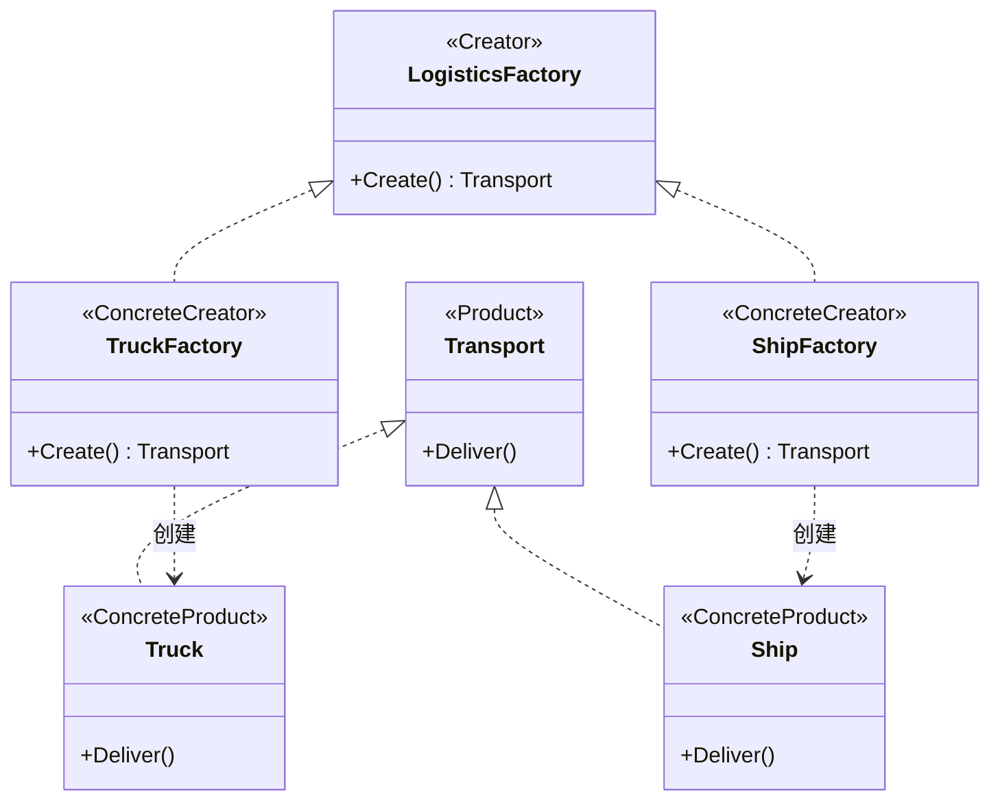

# 工厂方法模式（Factory Method）— Go 语言

核心一句话：

> **「创建哪个具体产品」交给子类 / 具体创建者决定。**  
> 客户端只调用工厂方法拿抽象产品，不写死 `new` 具体类。

本例：物流发货。`TruckFactory` 造卡车，`ShipFactory` 造货轮；调度代码只认 `Transport`，换运输方式只换工厂。

---

## 1. 用一张表想清楚

| | 陆运 | 海运 |
|---|---|---|
| **具体产品** | `Truck` | `Ship` |
| **具体工厂** | `TruckFactory` | `ShipFactory` |
| **工厂方法** | `Create()` → `Truck` | `Create()` → `Ship` |

### 1.1 不会工厂方法时

业务里到处写：

```go
t := &Truck{}
t.Deliver()
```

要上海运，得改调用处；再加空运，继续改。创建逻辑和业务搅在一起。

### 1.2 会工厂方法时

```text
factory := NewTruckFactory()   // 或 NewShipFactory()
t := factory.Create()
t.Deliver()
```

- 创建点集中在工厂方法。
- 加新运输方式 = 新 `Transport` + 新 `LogisticsFactory`，调度函数不动。

---

## 2. 定义

### 2.1 官方味道的定义

工厂方法是一种**创建型**设计模式：定义一个用于创建对象的接口，让子类决定实例化哪一个类。工厂方法使一个类的实例化延迟到其子类。

落到 Go（无继承时）：

1. 产品接口（`Transport`）。
2. 工厂接口，声明工厂方法（`LogisticsFactory.Create() Transport`）。
3. 每个具体工厂只负责一种具体产品。

### 2.2 角色关系（UML 类图）



| 模式角色 | 本例 | 含义 |
|----------|------|------|
| Product | `Transport` | 产品抽象 |
| ConcreteProduct | `Truck` / `Ship` | 具体运输工具 |
| Creator | `LogisticsFactory` | 声明工厂方法 |
| ConcreteCreator | `TruckFactory` / `ShipFactory` | 决定 new 哪一个 |
| Client | `PlanDelivery` | 只用抽象工厂与抽象产品 |

---

## 3. 和抽象工厂的区别（一句话）

| | 工厂方法 | 抽象工厂 |
|---|---|---|
| **一次造几个** | 通常一种产品 | 一整套相关产品 |
| **关注点** | 「怎么创建某一个」 | 「这一族产品如何配套」 |
| **本例对应** | 只要 `Transport` | 若还要配套 `Invoice` + `Tracker` 同风格，才上抽象工厂 |

本例只有运输工具一种产品 → 工厂方法刚好；不必上抽象工厂。

---

## 4. 怎么跑

```bash
go run .
```

或：

```bash
go run main.go
```

观察输出：陆运 / 海运两套；`PlanDelivery` 函数本身没有改。

---

## 5. 适用与注意

适合：

- 客户端不应依赖具体产品类名。
- 产品种类会扩展，希望「加类型少改旧代码」。
- 创建逻辑需要集中、可替换（测试时换假工厂）。

注意：

- 每加一种产品往往多一个工厂类，类数量会涨。
- 只有一两种产品且几乎不变时，简单的 `NewXxx()` 函数可能更够用。
- 不要和「简单工厂」（一个函数里 `switch` 出不同类型）混为一谈：简单工厂集中判断；工厂方法把判断拆到各个具体工厂。
