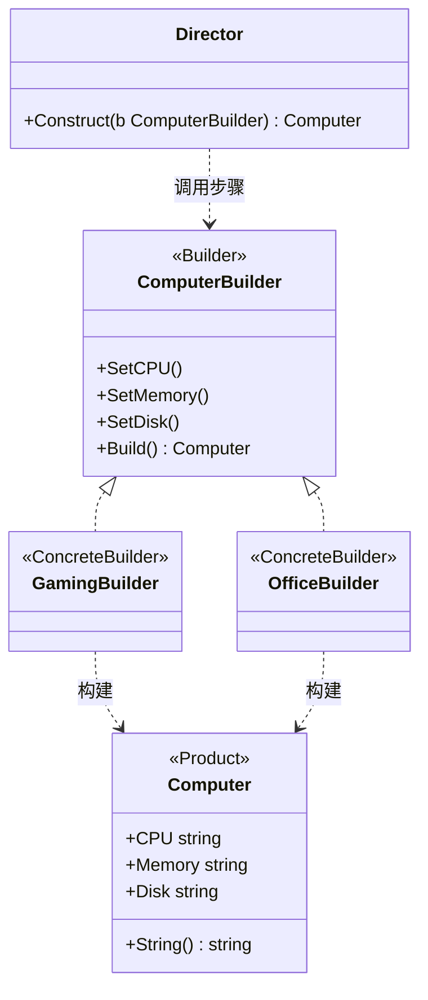

# 建造者模式（Builder）— Go 语言

核心一句话：

> **把「复杂对象怎么一步步拼起来」从使用方拆出去。**  
> 同一种组装流程，换 Builder 就能产出不同表示；还能链式设可选参数。

本例：组装电脑。`Director` 固定「装 CPU → 内存 → 硬盘」的顺序；`GamingBuilder` / `OfficeBuilder` 决定每个步骤装什么。客户端最后拿成品 `Computer`。

---

## 1. 用一张表想清楚

| 步骤 | 游戏主机 | 办公主机 |
|---|---|---|
| **CPU** | 8 核高性能 | 4 核节能 |
| **内存** | 32GB | 16GB |
| **硬盘** | 1TB SSD | 512GB SSD |

### 1.1 不会建造者时

构造函数参数爆炸，或到处手写：

```go
c := &Computer{CPU: "...", Memory: "...", Disk: "...", GPU: "..."}
```

可选配件一多，调用处又长又容易漏步骤；游戏机和办公机的组装顺序还可能各写一遍。

### 1.2 会建造者时

```text
director.Construct(gamingBuilder)  → 游戏主机
director.Construct(officeBuilder)  → 办公主机
```

- 步骤顺序由 `Director`（或约定好的 `Build` 流程）统一。
- 每步装什么由具体 Builder 决定。
- 可选参数也可用链式 `WithXxx` 补齐（见 `main.go` 后半段）。

---

## 2. 定义

### 2.1 官方味道的定义

建造者是一种**创建型**设计模式：将一个复杂对象的构建与它的表示分离，使得同样的构建过程可以创建不同的表示。

做法是：

1. 产品（`Computer`）只表示最终结果。
2. Builder 接口声明各个构建步骤。
3. 具体 Builder 实现步骤并保存中间结果。
4. （可选）Director 按固定顺序调用这些步骤。

### 2.2 角色关系（UML 类图）



| 模式角色 | 本例 | 含义 |
|----------|------|------|
| Product | `Computer` | 复杂成品 |
| Builder | `ComputerBuilder` | 声明构建步骤 |
| ConcreteBuilder | `GamingBuilder` / `OfficeBuilder` | 决定每步装什么 |
| Director | `Director` | 固定组装顺序 |
| Client | `main` | 选 Builder，拿成品 |

---

## 3. 和工厂方法的区别（一句话）

| | 工厂方法 | 建造者 |
|---|---|---|
| **一次动作** | 通常一步 `Create()` | 多步 `SetCPU` / `SetMemory`… |
| **关注点** | 「创建哪一种产品」 | 「同流程拼出不同配置」 |
| **产品复杂度** | 往往较简单 | 零件多、可选多、顺序有意义 |

只要 `new Truck` / `new Ship` → 工厂方法；要按步骤拼一台配置可变的电脑 → 建造者。

---

## 4. 怎么跑

```bash
go run .
```

或：

```bash
go run main.go
```

观察输出：同一 `Director.Construct`，游戏机与办公机配置不同；随后链式 Builder 再拼一台自定义机。

---

## 5. 适用与注意

适合：

- 对象字段多、有必选 / 可选、希望可读的构建 API。
- 同一套步骤要产出多种表示（报表 HTML / PDF，或本例游戏机 / 办公机）。
- 希望隐藏组装细节，避免超长构造函数。

注意：

- 产品很简单时不必上建造者，直接结构体字面量即可。
- Director 不是必须的：Go 里常见「Builder 自带 `Build()` + 链式 `WithXxx`」，没有单独导演类。
- Builder 若可复用，注意每次 `Build` 前重置内部状态，避免脏数据。
