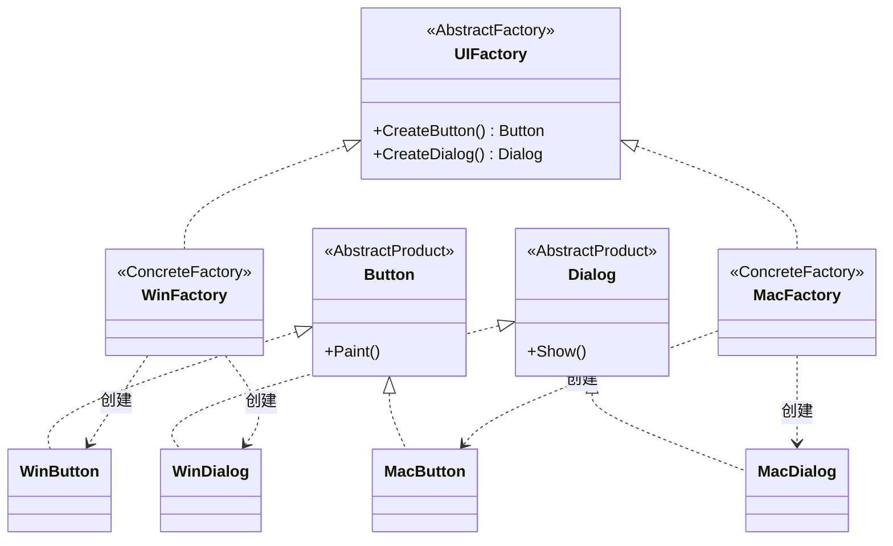

# 抽象工厂模式（Abstract Factory）— Go 语言

核心一句话：

> **一次拿「一整套」互相配套的产品，而不是零散 new。**  
> 换工厂 = 换整套风格；客户端只认抽象接口，不点名具体类。

本例：桌面 UI 皮肤。`WinFactory` 产出 Windows 风按钮 + 对话框；`MacFactory` 产出 Mac 风按钮 + 对话框。同一套业务代码，换工厂即换皮肤。

---

## 1. 用一张表想清楚

| | Windows 风 | Mac 风 |
|---|---|---|
| **按钮** | `WinButton` | `MacButton` |
| **对话框** | `WinDialog` | `MacDialog` |

### 1.1 不会抽象工厂时

业务里到处写：

```go
btn := &WinButton{}
dlg := &WinDialog{}
```

要上 Mac，得全局搜改；还容易混搭（Win 按钮 + Mac 对话框）。

### 1.2 会抽象工厂时

```text
factory := NewWinFactory()   // 或 NewMacFactory()
btn := factory.CreateButton()
dlg := factory.CreateDialog()
```

- 产品族保证配套：同一工厂出来的控件同一风格。
- 换皮肤只换工厂创建处，渲染逻辑不动。

---

## 2. 定义

### 2.1 官方味道的定义

抽象工厂是一种**创建型**设计模式：提供一个接口，用于创建**一系列相关或相互依赖**的对象，而无需指定它们的具体类。

做法是：

1. 为每种产品定义抽象接口（`Button`、`Dialog`）。
2. 为每个产品族提供一个具体工厂（`WinFactory`、`MacFactory`），工厂方法一次性覆盖该族全部产品。
3. 客户端只依赖抽象工厂与抽象产品。

### 2.2 角色关系（UML 类图）



| 模式角色 | 本例 | 含义 |
|----------|------|------|
| AbstractFactory | `UIFactory` | 声明「能造哪些产品」 |
| ConcreteFactory | `WinFactory` / `MacFactory` | 某一产品族的具体实现 |
| AbstractProduct | `Button` / `Dialog` | 单种产品的抽象 |
| ConcreteProduct | `WinButton` / `MacDialog` 等 | 具体控件 |
| Client | `RenderUI` | 只用抽象，不 new 具体类 |

---

## 3. 和工厂方法的区别（一句话）

| | 工厂方法 | 抽象工厂 |
|---|---|---|
| **一次造几个** | 通常一种产品 | 一整套相关产品 |
| **关注点** | 「怎么创建某一个」 | 「这一族产品如何配套」 |
| **扩展方向** | 加新产品类型 → 常改接口 | 加新产品族 → 新工厂类 |

本例若只有按钮，工厂方法就够；有了按钮 + 对话框且必须同风格，才轮到抽象工厂。

---

## 4. 怎么跑

```bash
go run .
```

或：

```bash
go run main.go
```

观察输出：先整套 Windows 风，再整套 Mac 风；`RenderUI` 函数本身没有改。

---

## 5. 适用与注意

适合：

- 需要成套、可互换的产品族（主题、平台、数据库驱动套件）。
- 客户端不应依赖具体产品类名。

注意：

- 产品种类一变（比如要加 `Menu`），抽象工厂接口和所有具体工厂都要动——这是该模式的经典代价。
- 只有一种产品时，不要上抽象工厂，用工厂方法或简单工厂即可。
