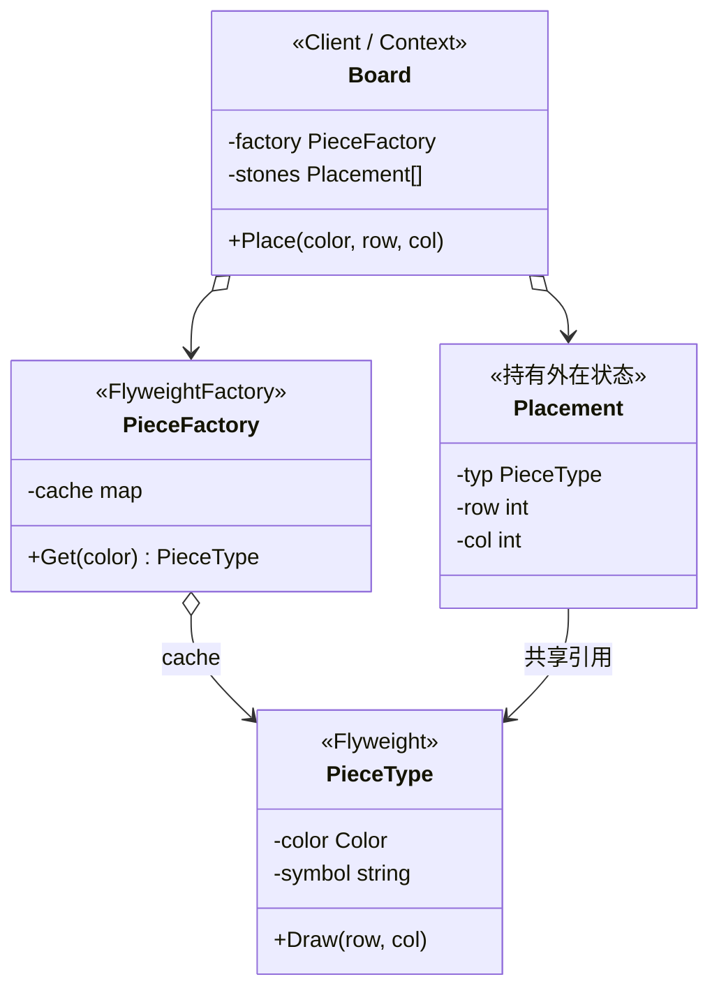

# 享元模式（Flyweight Pattern）— Go 语言

享元模式的核心一句话：

> **把大量对象里「相同且不变」的部分抽成共享实例**——内在状态进享元；外在状态（如坐标）放调用方或上下文。

本例：棋盘落子。黑白外观各一份；每一枚子的行列存在棋盘侧。

---

## 1. 定义

### 1.1 官方味道的定义

享元模式是一种**结构型**设计模式：运用共享技术有效地支持大量细粒度对象的复用。

做法是：

1. 区分**内在状态**（可共享、与上下文无关）和**外在状态**（不可共享、随使用变化）。
2. 用工厂按键缓存享元，相同键返回同一实例。
3. 操作时把外在状态作为参数传入（或存在 Context），享元本身不保存它们。

### 1.2 角色关系（UML 类图）



图例：

| 线 | UML 含义 | 在本例里 |
|----|----------|----------|
| `o→` | 持有 | 工厂缓存享元；棋盘持有落子列表 |
| `→` | 关联 | `Placement` 引用共享的 `*PieceType` |

结构速览：

```text
Board.Place(black, 3, 3)
  → Factory.Get(black)  ──► 缓存命中则复用，否则新建
  → stones 追加 {typ, 3, 3}
  → typ.Draw(3, 3)      ──► 外在坐标当场传入
```

要点：

- **内在**：`color`、`symbol`——所有黑子共用一个 `PieceType`。
- **外在**：`row`、`col`——每枚落子一份，不放进享元。
- 工厂保证「同色只有一个享元对象」（本例用 `map[Color]*PieceType`）。

### 1.3 和「单例 / 对象池」差在哪（一句话）

单例强调全局唯一；对象池强调复用可重置的实例以减分配。享元强调：**按内在状态键共享不可变（或准不可变）细粒度对象**，外在状态分离。更细的对照见 [第 4 节](#4-常见混淆区分)。

---

## 2. 常见场景

| 场景 | 为什么适合 |
|------|------------|
| 棋盘 / 地图格子 | 类型少、实例多；外观共享，坐标外置 |
| 文字排版 | 字形按字符共享，绘制位置外置 |
| 粒子 / 子弹 | 模板与贴图共享，位姿与生命值外置 |
| 样式表 / 主题 token | 相同样式对象被大量 UI 节点引用 |

Go 里更接地气的说法：

- 你会 new 成千上万个几乎一样的小结构，只有几个字段不同。
- 那几个「不同」能拆出去当参数或旁路表；剩下的适合缓存一份。

---

## 3. 示范代码

### 3.1 享元：PieceType

```go
type PieceType struct {
	color  Color
	symbol string
}

// Draw：坐标是外在状态，由调用方传入。
func (t *PieceType) Draw(row, col int) {
	fmt.Printf("  在 (%d,%d) 落子 %s(%s)\n", row, col, t.symbol, t.color)
}
```

### 3.2 工厂：按颜色缓存

```go
func (f *PieceFactory) Get(c Color) *PieceType {
	if t, ok := f.cache[c]; ok {
		return t
	}
	// 新建并放入 cache……
	return t
}
```

### 3.3 棋盘：外在状态在落子记录里

```go
type Placement struct {
	typ *PieceType
	row, col int
}

func (b *Board) Place(c Color, row, col int) {
	t := b.factory.Get(c) // 共享
	b.stones = append(b.stones, Placement{typ: t, row: row, col: col})
	t.Draw(row, col)
}
```

### 3.4 运行

```bash
cd 设计模式/享元模式
go run .
```

示例输出（指针地址因运行而异，同色应相同）：

```text
========== 开始落子 ==========
[Factory] 新建享元: black（缓存现有 1 种）
  在 (3,3) 落子 ●(black)
[Factory] 新建享元: white（缓存现有 2 种）
  在 (3,4) 落子 ○(white)
[Factory] 复用享元: black（缓存已有）
  ...

========== 享元复用核对 ==========
落子总数:     6
享元缓存数:   2  （期望 2：黑 + 白）
```

### 3.5 调用链拆解

```text
Place(Black, 5, 5)
  → Get(Black) → 命中 cache，返回同一 *PieceType
  → append Placement{该指针, 5, 5}
  → Draw(5, 5) 只用到共享外观 + 外在坐标
```

### 3.6 Go 里的注意点

1. **享元宜只读**：共享后不要改 `PieceType` 字段，否则所有引用者一起变。
2. **外在状态别塞进享元**：坐标进 `PieceType` 就无法共享。
3. **工厂要有键**：本例键是 `Color`；更复杂时可用字符串或结构体当 key。
4. **别为了模式而套**：对象不多、或几乎没有可共享内在状态时，直接普通结构体即可。
5. **并发**：多 goroutine 共用工厂时，需给 `cache` 加锁（本示例单线程从略）。

---

## 4. 常见混淆区分

自学时最容易和享元搅在一起的，主要是下面几组。

### 4.1 享元 vs 单例

| | 享元 | 单例 |
|--|------|------|
| 数量 | **按键** 可有多个共享实例（黑一份、白一份） | 通常**全局一个** |
| 目的 | 大量细粒度对象共享内在状态 | 保证唯一访问点 / 全局状态 |

一句话：单例是「整个类型只有一个」；享元是「相同内在状态共用一个」。

### 4.2 享元 vs 对象池（`sync.Pool` 等）

| | 享元 | 对象池 |
|--|------|--------|
| 对象寿命 | 长期存活、**尽量只读**、被多方同时引用 | 借出 → 用完归还 → **可重置再租** |
| 状态 | 内在共享 + 外在外置 | 实例本身常被改写 |
| 目的 | 少创建「重复内容」 | 少分配 / 控峰值、复用缓冲区 |

一句话：池是「租还可脏对象」；享元是「不拆分的共享只读份」。

### 4.3 享元 vs 普通缓存 / memo

| | 享元 | 一般缓存 |
|--|------|----------|
| 侧重点 | **设计拆分**：内在 / 外在 + 工厂键 | **性能优化**：结果或对象按 key 暂存 |
| 结构 | 模式角色明确（Flyweight / Factory / Context） | 任意 `map` 都行 |

缓存可以是实现享元工厂的手段；但「加了个 map」不等于在用享元——关键看有没有把外在状态拆干净。

### 4.4 享元 vs 原型（Prototype）

| | 享元 | 原型 |
|--|------|------|
| 动作 | **共享同一份** | **克隆出新份** |
| 结果 | 多处引用同一指针 | 每处一份拷贝（可再改） |

需要独立可变副本 → 原型；需要大家看同一份不变数据 → 享元。

### 4.5 内在状态 vs 外在状态（模式内部）

| | 内在（进享元） | 外在（不进享元） |
|--|----------------|------------------|
| 特点 | 与上下文无关、可共享 | 随每次使用变化 |
| 本例 | 颜色、显示符 | 行列坐标 |

把坐标写进 `PieceType`，就没法共享——这是最常见的实现级混淆。

### 4.6 享元工厂 vs「就是个工厂模式」

工厂模式管的是**怎么创建**；享元工厂的关键是**创建后按键缓存并复用**。没有共享缓存，只是普通 Simple Factory。

### 4.7 「多处指向同一对象」vs 享元

Go 里结构体指针本来就能共享。享元多的是：**刻意拆状态 + 工厂保证同键同实例 + 面向海量细粒度**。偶尔两个变量指向同一个 `*T`，不必叫享元。

### 4.8 选型口诀

> 类型少、实例多、能拆出稳定内在状态 → 享元；要唯一入口 → 单例；要借还减 GC → 对象池；要各自可改的副本 → 原型。

---

## 5. 总结

### 5.1 记住三件事

1. **意图**：大量细粒度对象 → 共享内在状态，省内存、统一外观。
2. **机制**：工厂缓存 + 外在状态外置（参数或 Context）。
3. **适用边界**：重复多、内在状态稳定时可考虑；过早享元会增加间接层。

### 5.2 优缺点速查

| | 说明 |
|---|------|
| 优点 | 大幅减少重复对象；外观修改一处生效 |
| 优点 | 强迫想清「什么可变、什么可共享」 |
| 缺点 | 代码多一层工厂与状态拆分，简单场景易过度设计 |
| 缺点 | 外在状态传递/存储本身也有成本；要算总账 |
| 缺点 | 共享对象被误改会造成「一改全挂」 |

### 5.3 选型一句话

> 类型少、实例海量，且能干净拆出「共享外观 vs 每次不同的上下文」时，用享元；否则先别上。
