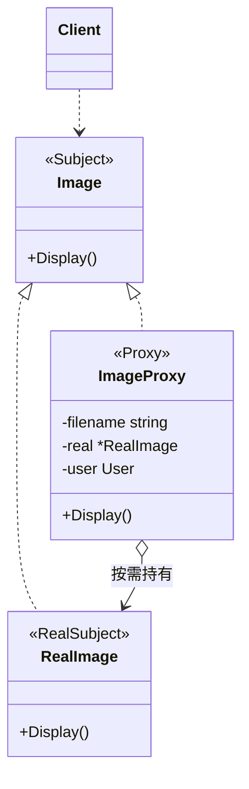

# 代理模式（Proxy）— Go 语言

核心一句话：

> **客户端以为在跟本体说话，其实中间拦了一层「替身」。**  
> 替身和本体实现同一接口；额外逻辑（懒加载、鉴权、缓存、日志）放在替身里，本体保持干净。

本例：高清图查看。`ImageProxy` 先占坑；真正第一次 `Display` 才去加载 `RealImage`。还可顺带做权限校验。

---

## 1. 用一张表想清楚

| | 直接用本体 | 经代理 |
|---|---|---|
| **客户端调用** | `real.Display()` | `proxy.Display()`（接口相同） |
| **昂贵操作何时发生** | 构造时就加载 | 第一次真正用时再加载 |
| **横切逻辑** | 散落在业务 / 改本体 | 集中在代理 |

### 1.1 不会代理时

```go
img := NewRealImage("photo.png") // 构造就读盘，哪怕用户根本没点开
img.Display()
```

列表里几十张图，一进页面全加载，又慢又费。

### 1.2 会代理时

```text
proxy := NewImageProxy("photo.png", user)
proxy.Display()  → 鉴权 →（首次）加载 RealImage → 显示
proxy.Display()  → 鉴权 → 复用已加载的 RealImage
```

- 客户端只认 `Image`，不区分代理还是本体。
- 懒加载、鉴权加在代理，`RealImage` 只负责「显示」。

---

## 2. 定义

### 2.1 官方味道的定义

代理是一种**结构型**设计模式：为另一个对象提供一个替身或占位符，以控制对这个对象的访问。

做法是：

1. 抽象主题接口（`Image`）。
2. 真实主题实现业务（`RealImage`）。
3. 代理实现同一接口，内部持有（或按需创建）真实主题，并在转发前后加逻辑。

### 2.2 角色关系（UML 类图）



| 模式角色 | 本例 | 含义 |
|----------|------|------|
| Subject | `Image` | 客户端依赖的接口 |
| RealSubject | `RealImage` | 真正干活的对象 |
| Proxy | `ImageProxy` | 替身：懒加载 + 鉴权后转发 |
| Client | `main` | 只通过 `Image` 调用 |

---

## 3. 常见代理种类（一句话）

| 种类 | 干什么 | 本例对应 |
|------|--------|----------|
| **虚拟代理** | 推迟昂贵创建 / 加载 | 第一次 `Display` 才 `NewRealImage` |
| **保护代理** | 权限不够就拒绝 | `user.CanView` 校验 |
| **远程代理** | 本地接口藏远程调用 | 未展开 |
| **缓存 / 日志代理** | 命中缓存或打日志再转发 | 二次 `Display` 复用 `real` |

---

## 4. 和装饰器的区别（一句话）

| | 代理 | 装饰器 |
|---|---|---|
| **意图** | **控制访问**（何时 / 谁能用本体） | **叠加职责**（增强行为） |
| **关系** | 常常「替身 ↔ 唯一本体」 | 可多层嵌套包装 |
| **客户端感知** | 常当本体用，甚至不知有代理 | 明确在「加料」 |

懒加载、鉴权更像代理；给响应加压缩 / 加密层层包更像装饰器。边界有时模糊，按意图选词即可。

---

## 5. 怎么跑

```bash
go run .
```

或：

```bash
go run main.go
```

观察输出：无权限用户被拒；有权限用户首次 `Display` 打印「加载」，第二次不再加载。

---

## 6. 适用与注意

适合：

- 对象创建 / 加载很贵，希望用到再建（虚拟代理）。
- 需要统一的访问控制、限流、审计（保护 / 智能引用）。
- 想对客户端隐藏远程或本地复杂性。

注意：

- 代理与本体接口应保持一致，否则客户端要分支。
- 别把业务规则全塞进代理，代理只做「访问控制与转发」。
- 和装饰器、适配器别混：适配器是换接口；装饰器是加能力；代理是控访问。
