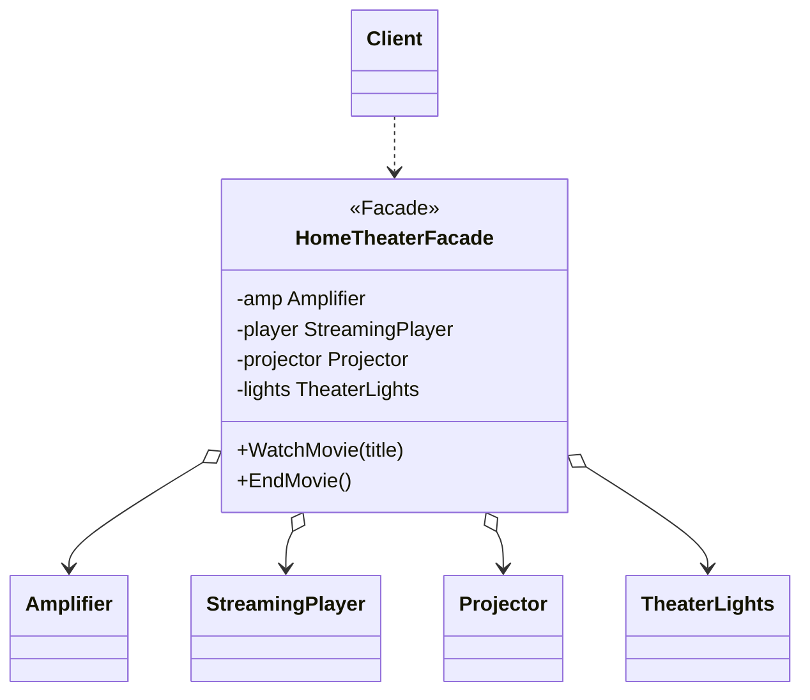

# 外观模式（Facade）— Go 语言

核心一句话：

> **子系统很复杂时，对外只开一扇「简门」。**  
> 客户端调外观的一两个方法；里面再去编排灯光、音箱、投影等多件设备。

本例：家庭影院一键观影。`HomeTheaterFacade.WatchMovie` 按顺序开机、投屏、放音、关灯；客户端不用记住十几步。

---

## 1. 用一张表想清楚

| | 没有外观 | 有外观 |
|---|---|---|
| **客户端要懂** | 放大器、播放器、投影、灯光各自 API | 只懂 `WatchMovie` / `EndMovie` |
| **调用次数** | 每次观影写一长串 | 一行 |
| **子系统改顺序** | 所有调用处都要改 | 只改外观内部 |

### 1.1 不会外观时

```go
amp.On()
amp.SetVolume(5)
player.On()
player.Play("demo.mkv")
projector.On()
projector.WideScreen()
lights.Dim(10)
```

每个客户端都复制这份「仪式」；漏一步就体验坏了。

### 1.2 会外观时

```text
facade.WatchMovie("demo.mkv")
  → 开灯调暗 → 投影 → 功放 → 播放器
facade.EndMovie()
  → 逆序收尾
```

- 子系统类仍可单独用（外观不强制封装死）。
- 常见路径走外观；高级用户仍可直连子系统。

---

## 2. 定义

### 2.1 官方味道的定义

外观是一种**结构型**设计模式：为子系统中的一组接口提供一个统一的高层接口，使子系统更容易使用。

做法是：

1. 子系统保持各自职责（`Amplifier`、`Projector`…）。
2. 外观类持有这些子系统引用。
3. 对外暴露简化方法，内部按正确顺序编排调用。

### 2.2 角色关系（UML 类图）



| 模式角色 | 本例 | 含义 |
|----------|------|------|
| Facade | `HomeTheaterFacade` | 对外简门 |
| Subsystem classes | `Amplifier` 等 | 真正干活的部件 |
| Client | `main` | 只调外观 |

---

## 3. 和适配器 / 代理的区别（一句话）

| | 外观 | 适配器 | 代理 |
|---|---|---|---|
| **意图** | **简化一堆接口** | **转换一个接口** | **控制对一个对象的访问** |
| **对象个数** | 通常编排多个子系统 | 通常包一个 Adaptee | 通常替一个 RealSubject |
| **接口关系** | 新开高层 API | Target ← 翻译 ← Adaptee | Proxy ≈ Subject |

「步骤太多记不住」→ 外观；「接口形状不对」→ 适配器；「想拦着访问」→ 代理。

---

## 4. 怎么跑

```bash
go run .
```

或：

```bash
go run main.go
```

观察输出：`WatchMovie` 串起整套开机流程；`EndMovie` 逆序关机。

---

## 5. 适用与注意

适合：

- 子系统类多、依赖乱，希望给常见用例一条捷径。
- 分层：上层只依赖外观，不依赖底层细节。
- 遗留系统包一层，降低新代码接入成本。

注意：

- 外观是「便利入口」，不是禁止直连子系统。
- 别做成上帝对象：一个外观只服务一块边界（如「影院」），别包整个应用。
- 外观里编排可以变复杂；复杂到要分支策略时，再考虑把流程拆出去，而不是无限堆方法。
