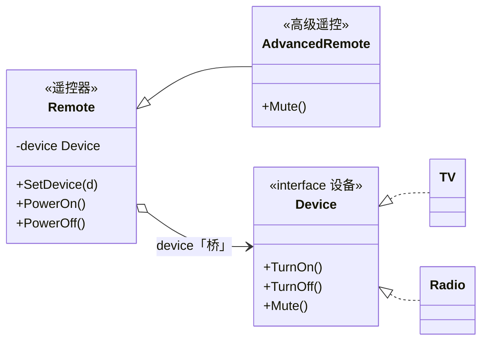

# 桥接模式（Bridge Pattern）— Go 语言

换一种说法（先别背角色名）：

> **遥控器里插着一台设备。**  
> 按键在遥控上，真正开关在电视 / 收音机上。  
> 那个 `device` 字段，就是「桥」。

---

## 1. 用一张表想清楚

两个会变的东西：

| | 电视 | 收音机 | 音箱（以后再买） |
|---|---|---|---|
| **基础遥控** | 要能用 | 要能用 | 要能用 |
| **高级遥控**（多静音） | 要能用 | 要能用 | 要能用 |

### 1.1 不会桥接时（step1）

每个格子做一个类：`BasicTVRemote`、`AdvancedRadioRemote`…

格子一多，类就炸；「静音」还要在每个高级类里抄一遍。

### 1.2 会桥接时（step2）

- 遥控只负责「有哪些键」→ `Remote` / `AdvancedRemote`
- 设备只负责「怎么开关」→ `TV` / `Radio`
- 遥控里有一个字段：`device Device` ← **桥**

格子不再变成类，而是运行时插上去：

```text
高级遥控.device = 电视     → 按键控制电视
高级遥控.device = 收音机   → 同一只遥控控制收音机
```

### 1.3 演变目录（建议先跑）

| 步骤 | 目录 | 要体会的点 |
|------|------|------------|
| 1 | `evolve/step1_继承乘积爆炸` | 功能×设备粘成多个类 |
| 2 | `evolve/step2_桥接拆开` | 遥控持有 `device` |
| 3 | `evolve/step3_只加新设备` | 只加 `Speaker`，遥控不动 |

```bash
cd evolve/step1_继承乘积爆炸 && go run .
cd ../step2_桥接拆开 && go run .
cd ../step3_只加新设备 && go run .
```

---

## 2. 定义（对照生活）

### 2.1 官方味道的定义

桥接是一种**结构型**模式：把抽象部分和实现部分分开，让它们可以各自变化。

落到本例：

| 模式角色 | 本例 | 生活对应 |
|----------|------|----------|
| Abstraction | `Remote` | 遥控器（按键） |
| RefinedAbstraction | `AdvancedRemote` | 带静音的高级遥控 |
| Implementor | `Device` | 「能被遥控的设备」接口 |
| ConcreteImplementor | `TV` / `Radio` | 具体电器 |

### 2.2 UML（只看中间那条桥）



调用时发生的事：

```text
adv.PowerOn()
  → Remote 发现自己握着 device
  → device.TurnOn()
      → 若是 TV：画面亮了
      → 若是 Radio：开始出声
```

遥控**不知道**细节怎么画画面，只知道「对当前 device 喊 TurnOn」。

---

## 3. 示范代码

完整可运行见同级 `main.go`。

### 3.1 设备

```go
type Device interface {
	TurnOn()
	TurnOff()
	Mute()
	Name() string
}

type TV struct{ on bool }

func (d *TV) Name() string { return "电视" }
func (d *TV) TurnOn()      { d.on = true; fmt.Println("  [TV] 开机") }
func (d *TV) TurnOff()     { d.on = false; fmt.Println("  [TV] 关机") }
func (d *TV) Mute()        { fmt.Println("  [TV] 静音") }

type Radio struct{ on bool }

func (d *Radio) Name() string { return "收音机" }
func (d *Radio) TurnOn()      { d.on = true; fmt.Println("  [Radio] 开机") }
func (d *Radio) TurnOff()     { d.on = false; fmt.Println("  [Radio] 关机") }
func (d *Radio) Mute()        { fmt.Println("  [Radio] 静音") }
```

### 3.2 遥控（桥在这里）

```go
type Remote struct {
	device Device // 桥：手里握着谁
}

func (r *Remote) SetDevice(d Device) { r.device = d }

func (r *Remote) PowerOn()  { r.device.TurnOn() }
func (r *Remote) PowerOff() { r.device.TurnOff() }

type AdvancedRemote struct{ Remote }

func (r *AdvancedRemote) Mute() { r.device.Mute() }
```

### 3.3 使用：同一只遥控换设备

```go
func main() {
	adv := &AdvancedRemote{}
	adv.SetDevice(&TV{})
	adv.PowerOn()
	adv.Mute()

	adv.SetDevice(&Radio{}) // 换桥，不换遥控类型
	adv.PowerOn()
	adv.Mute()
}
```

```bash
cd server_study/设计模式/桥接模式
go run .
```

---

## 4. 和「策略」差在哪（一句话）

- **策略**：换一种算法（常常是一维替换）。
- **桥接**：强调**两维**都会长——遥控功能一层、设备种类一层——用字段接住，而不是乘出所有子类。

本课先抓住「遥控插着设备」就够。

---

## 5. 总结

### 5.1 只记三句

1. **桥** = 抽象里指向实现的那个字段（`Remote.device`）。
2. **按键**在遥控，**干活**在设备。
3. **两维独立扩展**：加静音键不改 TV；加音箱不改 AdvancedRemote。

### 5.2 选型一句话

> 当你脑子里已经出现一张「A 的种类 × B 的种类」表格，并且两边都会继续加行/加列时，用桥接；只有一边在变，普通接口 / 策略就够了。
