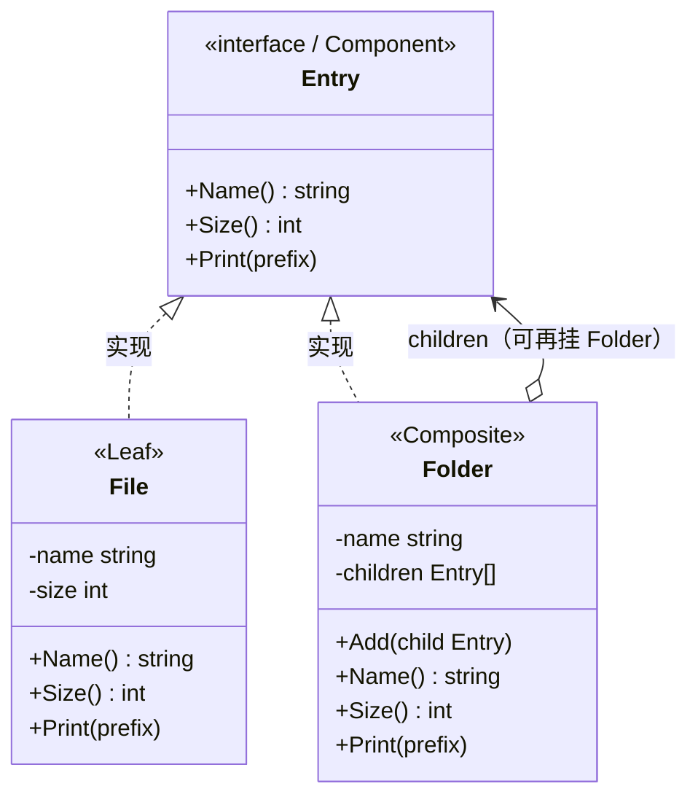

# 组合模式（Composite Pattern）— Go 语言

组合模式的核心一句话：

> **让「单个对象」和「对象树」用同一套接口**——客户端不用区分眼前是叶子还是容器，照样操作。

本例：文件系统。文件是叶子，文件夹是容器；算大小、打印树时，两边都叫 `Size()` / `Print()`。

---

## 1. 定义

### 1.1 官方味道的定义

组合模式是一种**结构型**设计模式：将对象组合成树形结构以表示「部分—整体」的层次，使得用户对单个对象和组合对象的使用具有一致性。

做法是：

1. 抽出统一接口（Component），叶子和容器都实现它。
2. 容器（Composite）内部持有 `[]Component`，并可再挂容器。
3. 客户端只依赖接口搭树、遍历，不写「如果是文件夹就……否则……」。

### 1.2 角色关系（UML 类图）



图例：

| 线 | UML 含义 | 在本例里 |
|----|----------|----------|
| `◁‥` | 实现接口 | `File` / `Folder` 都是 `Entry` |
| `o→` | 组合 | `Folder.children` 里是 `Entry`（文件或子文件夹） |

结构速览：

```text
docs/                    ← Folder
├── readme.txt           ← File（叶子）
└── images/              ← Folder（容器里再挂容器）
    ├── logo.png         ← File
    └── banner.png       ← File
```

要点：

- **叶子**不再有孩子；`Size` 返回自身。
- **容器**递归问孩子；`Folder.Size` = Σ `child.Size()`。
- 客户端搭树时：`folder.Add(file)` 和 `folder.Add(subFolder)` 写法一样。

### 1.3 和「就是个树结构」差在哪（一句话）

树到处都是；组合模式强调的是：**对外接口一致**，让调用方忘掉「部分 / 整体」的差别。

---

## 2. 常见场景

| 场景 | 为什么适合 |
|------|------------|
| 文件系统 / 资源目录 | 文件与文件夹统一列举、统计、删除 |
| UI 控件树 | Button 是叶子，Panel 可嵌套控件，统一 Draw |
| 菜单 / 权限树 | 菜单项与子菜单同一套展示与勾选 |
| 组织架构 | 员工与部门：算人头、发通知走同一接口 |
| 表达式树（远亲） | 与解释器常一起出现：叶子是数字，节点是运算符 |

Go 里更接地气的说法：

- 数据天然是树。
- 你不想在每个递归函数里写 `switch` 区分节点类型。
- 希望「对一个节点做的事」也能「对整棵子树做」。

---

## 3. 示范代码

### 3.1 统一接口

```go
package main

import "fmt"

// Entry：文件和文件夹的共同面孔。
type Entry interface {
	Name() string
	Size() int
	Print(prefix string)
}
```

### 3.2 叶子：File

```go
type File struct {
	name string
	size int
}

func NewFile(name string, size int) *File {
	return &File{name: name, size: size}
}

func (f *File) Name() string { return f.name }
func (f *File) Size() int    { return f.size }

func (f *File) Print(prefix string) {
	fmt.Printf("%s- %s (%dKB)\n", prefix, f.name, f.size)
}
```

### 3.3 容器：Folder

```go
type Folder struct {
	name     string
	children []Entry
}

func NewFolder(name string) *Folder {
	return &Folder{name: name}
}

func (d *Folder) Add(child Entry) {
	d.children = append(d.children, child)
}

func (d *Folder) Name() string { return d.name }

func (d *Folder) Size() int {
	total := 0
	for _, c := range d.children {
		total += c.Size() // 递归：子 Folder 会继续加总
	}
	return total
}

func (d *Folder) Print(prefix string) {
	fmt.Printf("%s+ %s/ (%dKB)\n", prefix, d.name, d.Size())
	for _, c := range d.children {
		c.Print(prefix + "  ")
	}
}
```

### 3.4 使用方式

```go
func main() {
	root := NewFolder("docs")
	root.Add(NewFile("readme.txt", 10))

	images := NewFolder("images")
	images.Add(NewFile("logo.png", 40))
	images.Add(NewFile("banner.png", 80))
	root.Add(images)

	root.Print("")
	fmt.Println("总大小:", root.Size()) // 130
}
```

本目录运行：

```bash
cd server_study/设计模式/组合模式
go run .
```

示例输出：

```text
[Add] docs ← readme.txt
[Add] images ← logo.png
[Add] images ← banner.png
[Add] docs ← images

========== 树形打印（客户端只认 Entry）==========
+ docs/ (130KB)
  - readme.txt (10KB)
  + images/ (120KB)
    - logo.png (40KB)
    - banner.png (80KB)

根目录总大小: 130KB
```

### 3.5 调用链拆解（算 docs 大小）

```text
docs.Size()
  → readme.Size()     = 10
  → images.Size()
       → logo.Size()  = 40
       → banner.Size()= 80
       → 40+80        = 120
  → 10+120            = 130
```

全程没有「判断孩子是不是文件夹」——因为都是 `Entry`，都会 `Size()`。

### 3.6 Go 里的注意点

1. **安全组合 vs 透明组合**：本例 `Add` 只挂在 `Folder` 上（更安全）；若把 `Add` 也放进 `Entry`，文件上调用就要返回错误或空操作（更透明、但叶子接口变脏）。
2. **递归别忘终止**：叶子的 `Size` / `Print` 不再往下走，树才结束。
3. **和访问者可配合**：树结构稳定、操作很多时，遍历用组合，操作可用访问者。
4. **别为了模式而套**：扁列表、没有「部分—整体」层次时，不必上组合。

---

## 4. 总结

### 4.1 记住三件事

1. **意图**：部分与整体同一接口，客户端一致使用。
2. **机制**：叶子直接干活；容器把请求转给孩子（常递归）。
3. **适用边界**：真有树形「部分—整体」时香；平铺结构别硬造树。

### 4.2 优缺点速查

| | 说明 |
|---|------|
| 优点 | 客户端简单，递归自然；加新叶子/容器类型往往只需新实现接口 |
| 优点 | 树的操作（统计、打印、查找）写法统一 |
| 缺点 | 设计过于一般化时，限制类型变难（什么都能 Add） |
| 缺点 | 叶子与容器接口强行完全一致时，叶子上会出现无意义方法 |
| 缺点 | 深树递归要注意栈与性能 |

### 4.3 选型一句话

> 数据是树，且你希望「对一个节点做的事」也能「对整棵子树做」时，用组合；只是列表，就老老实实用切片。
